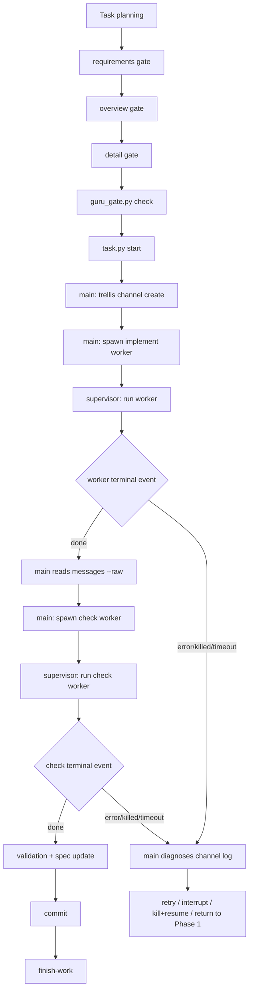

# Guru Workflow 默认启用官方 Supervision 迁移方案

## 1. 文档状态

| 项目 | 内容 |
|---|---|
| 任务 | `migrate-guru-design-to-0-6-0` |
| 任务目录 | `.trellis/tasks/06-15-migrate-guru-design-to-0-6-0` |
| 目标版本 | `0.6.0-guru.1` |
| 当前 worktree | `/Users/devSC/Documents/MyProject/Trellis-guru-0.6.0-ga-worktree` |
| 目标模式 | Guru workflow 默认使用官方 `trellis channel` supervision |
| 本文范围 | 方案设计和后续落地清单 |
| 本文不做 | 不修改官方 supervisor runtime，不提交代码，不发布包 |

## 2. 结论

Guru workflow 应该默认使用官方 `trellis channel` supervision，但不应该 fork 或重写官方 supervisor runtime。

正确迁移方式是：

1. 保留官方 `trellis channel` 的 worker lifecycle、event log、supervisor、idle guard、interrupt、kill、wait 语义。
2. 在 Guru workflow、Guru overlay、配置和文档层新增默认调度策略。
3. 把 Guru 的 Phase 2 默认实现/检查路径从平台内置 `trellis-implement` / `trellis-check` sub-agent 调度，切换为官方 `trellis channel spawn --agent implement/check`。
4. 保留 `inline` 和 legacy `sub-agent` 作为显式回退模式。
5. 继续由 Guru Gate 控制是否允许进入实现，supervision 只接管实现期 worker 运行，不绕过 planning Gate。
6. Guru workflow 的普通 `planning` / `in_progress` breadcrumb 必须变成 channel 默认；legacy sub-agent 不能继续复用普通 `in_progress`，否则回退模式会和新默认混在一起。

迁移后，主会话仍然是唯一协调者：

- 主会话创建 channel。
- 主会话 spawn supervised worker。
- 主会话发送 `Active task: <task path>` 和实现/检查 brief。
- 主会话等待官方 terminal events。
- 主会话读取 channel event log。
- 主会话负责最终验证、spec 回写、commit 和 finish。

worker 只负责实现或检查，不拥有任务生命周期和提交权。

## 3. 现状判断

### 3.1 当前 Guru workflow

当前 Guru workflow 在 `in_progress` 阶段仍采用平台 sub-agent 调度：

```text
实现 -> 质检 -> spec回写 -> commit -> finish
dispatch trellis-implement/check
```

当前 dogfood 配置是：

```yaml
codex:
  dispatch_mode: sub-agent
```

这意味着 Codex 主会话会继续收到 `<codex-mode>sub-agent</codex-mode>`，并按平台内置 sub-agent 路径工作。

### 3.2 官方 0.6.0 supervision

官方 0.6.0 的 supervision 已经通过 `trellis channel` runtime 提供：

- `trellis channel create`
- `trellis channel spawn`
- `trellis channel send`
- `trellis channel wait`
- `trellis channel messages`
- `trellis channel interrupt`
- `trellis channel kill`
- per-worker supervisor process
- durable event log
- worker guard: `idle_timeout` / `max_live_workers`
- terminal events: `done` / `error` / `killed`
- progress and warning events: `progress` / `supervisor_warning`

官方 channel runtime 已经进入 `0.6.0-guru.1` 迁移范围，不需要重做。

### 3.3 当前差距

差距不在 runtime，而在默认调度策略：

| 层 | 当前状态 | 目标状态 |
|---|---|---|
| official runtime | `trellis channel` 已可用 | 继续沿用 |
| Guru Gate | planning Gate 和 `before_start` 生效 | 继续沿用 |
| Guru Phase 2 | 默认 dispatch 平台 sub-agent | 默认 dispatch 官方 channel worker |
| Codex config | `dispatch_mode: sub-agent` | `dispatch_mode: channel` |
| workflow-state hook | 只识别 `inline` / `sub-agent` | 增加 `channel` |
| phase detail routing | 只识别 `codex-inline` / `codex-sub-agent` | 增加 `codex-channel` |
| overlay apply | 不安装 Guru supervision helper | 安装或配置 channel 默认策略 |
| Guru worker context | legacy `trellis-implement/check` 会读 Guru 领域 skill | channel `implement/check` agent 默认只读通用 card，必须显式注入 Guru 领域 skill |

### 3.4 Full-Cycle Risk Matrix

| 风险类别 | 证据 | 当前行为 | 方案覆盖 | 分类 |
|---|---|---|---|---|
| 目标/范围边界 | `official-supervision-default-plan.md` 本文；`commands-channel.md` 定义官方 runtime | runtime 已有，缺默认使用策略 | 本方案限定为 Guru workflow/overlay/config 调度策略，不 fork runtime | covered |
| workflow-state 路由 | `inject-workflow-state.py` 当前只接受 `inline` / `sub-agent` | `channel` 会被当成默认 inline 或 fallback | 增加 `channel`，并把 legacy `sub-agent` 路由到 `*-sub-agent` | blocker |
| phase detail 路由 | `workflow_phase.py` 当前只产生 `codex-inline` / `codex-sub-agent` | `get_context.py --platform codex` 不能加载 channel 专属步骤 | 增加 `codex-channel` marker | blocker |
| 默认与回退隔离 | Guru workflow 普通 `in_progress` 当前是 sub-agent | 若普通 `in_progress` 改 channel，而 `sub-agent -> status` 不变，legacy 回退会失效 | 普通 block 作为 channel 默认，legacy 使用 `in_progress-sub-agent` | blocker |
| Guru 领域上下文 | `.trellis/agents/implement.md` / `check.md` 是官方通用 card，默认 provider 是 `claude` | channel worker 不会自动加载 `flutter-implementation-guru-writing/review` 等 Guru skill | spawn/send contract 必须按平台注入 Guru implementation/review skill | blocker |
| provider 默认 | 官方 agent card frontmatter `provider: claude` | Codex dogfood 未显式 provider 会误走 Claude | Guru 默认 `provider: codex`，所有示例和 helper 显式 `--provider` | blocker |
| helper 优先级一致性 | 第 8 / 15 / 17 节都要求 `guru_supervise.py` 承载默认 supervision，但旧清单曾把 helper 放在 P1 | 实施者可能只改 workflow 文案和 config，漏掉可复跑 wrapper | `guru_supervise.py`、packaged copy、helper dry-run tests 全部归入 P0 | blocker |
| 重复执行/单飞 | `trellis channel create` 已存在且无 `--force` 会失败；worker 同名 live pid 会失败 | 稳定 channel/worker 名会碰撞 | 每次 run 使用 run id；helper 先检查 live worker，失败时给 kill/resume 指令 | should-fix |
| 可复制命令完整性 | Phase 2.2 示例曾引用 `$TASK` 但未声明；real provider smoke 曾使用固定 channel 名 | copy-paste 会创建空 task metadata、固定 channel 碰撞或误测旧 event log | 每个可复制 command block 自带 `TASK` / `RUN_ID` / 唯一 channel 和 worker | should-fix |
| helper control plane | `trellis channel kill` 真实接口是 `kill <channel> --as <worker>`；计划旧示例曾写固定 `--worker implement-cx` | run-id worker 下无法定位正确 worker，可能误 kill 或 kill 失败 | `status` 输出 exact channel/worker；`kill` 必须接收 exact channel + worker，不做前缀模糊匹配 | should-fix |
| context 文件存在性 | channel `--file` 通过 jail/loader 处理；计划示例固定传 `design.md` / `implement.md` | 缺文件可能导致上下文缺失或 warning 被忽略 | helper 只传存在文件；workflow 明确可选文件策略 | should-fix |
| bundled skill 文档一致性 | `command-reference.md` 明确 v0.6.0 channel CLI 无 `--tag`；但 `workers.md` / `workflows.md` / `progress-debugging.md` 仍含可执行 `--tag` 示例 | Guru 默认 supervision 虽不使用 tag，但操作者可能按 bundled skill 旧示例复制出无效命令 | P0 修正 packaged 与 installed `trellis-channel` reference；grep 禁止可执行 `trellis channel ... --tag` 示例，只允许说明“没有 `--tag`”的警告文字 | should-fix |
| 配置合并 | `apply.sh` 当前用 shell/python 片段维护 config | 直接拼 YAML 容易重复或覆盖用户值 | 用幂等 config patch helper；已有用户值只提示不覆盖 | blocker |
| `guru.supervision` 部分配置 | helper 需要 `provider`、`implement_timeout`、`check_timeout`、`warn_before`；计划旧文案只说缺整个 `guru.supervision` 时补默认 | 已有 `guru.supervision.provider: claude` 的项目可能缺 timeout 子键，helper 运行时行为不完整 | `guru.supervision` 和 `channel.worker_guard` 一样逐子键补缺，不覆盖已有子键 | should-fix |
| 当前 dogfood 自证 | `.trellis/config.yaml` 当前仍是 `codex.dispatch_mode: sub-agent`，hook banner 仍显示 sub-agent 模式 | 本迁移 worktree 无法证明 Guru 默认已切官方 supervision | routing/helper 落地后，当前迁移 worktree 必须显式切到 `channel` 并验证；普通既有项目仍不被 apply 静默覆盖 | should-fix |
| worker terminal semantics | channel spec 要求 terminal event；`wait` timeout exit 124 | 自定义文本完成不可靠 | 只等 `done,error,killed`，timeout 后读 raw messages/log | covered |
| hooks recursion | channel supervisor 设置 `TRELLIS_HOOKS=0` | worker 不会获得 per-turn Trellis hook breadcrumb | 必须通过 `--jsonl` / `--file` / message brief 注入上下文 | should-fix |
| tests/smoke | 当前迁移已有 packaged install smoke，但没有 channel default smoke | 默认 supervision 可能只在文档中成立 | 增加 structural dry-run smoke 和 provider smoke | should-fix |
| 文档一致性 | `design.md` / `implement.md` 曾写 dogfood `sub-agent` 默认 | 任务文档和新方案冲突 | 本次 repair 已同步任务文档，标明新计划 supersedes 旧 dogfood 差异 | covered |

这里的 `blocker` / `should-fix` 是实施期风险等级：如果这些点不进入实现，
迁移会失败。本轮计划修复已经把对应处理方案写入第 7-12、15-16 节，
不表示仍有未修复的计划 blocker。

## 4. 目标架构

### 4.1 分层

```text
Guru Planning Layer
  requirement -> overview -> detail
  design-grill
  guru_gate.py confirm
  before_start hook

Official Supervision Layer
  trellis channel create
  trellis channel spawn
  supervisor process
  event log
  wait / interrupt / kill

Guru Finish Layer
  validation evidence
  trellis-update-spec
  commit
  finish-work
```

### 4.2 控制流



## 5. 配置契约

### 5.1 新增 Codex dispatch mode

当前 `codex.dispatch_mode` 只有两个有效值：

```yaml
codex:
  dispatch_mode: inline
```

```yaml
codex:
  dispatch_mode: sub-agent
```

需要增加第三个值：

```yaml
codex:
  dispatch_mode: channel
```

语义：

| mode | 语义 |
|---|---|
| `inline` | 主会话直接实现和检查，使用 `trellis-before-dev` / `trellis-check` skill |
| `sub-agent` | legacy 模式，主会话调用平台内置 `trellis-implement` / `trellis-check` |
| `channel` | 默认 Guru 模式，主会话通过官方 `trellis channel` spawn supervised workers |

### 5.2 Guru 默认配置

Guru overlay 应默认写入或建议写入：

```yaml
codex:
  dispatch_mode: channel

channel:
  worker_guard:
    idle_timeout: 10m
    max_live_workers: 4

guru:
  supervision:
    provider: codex
    implement_timeout: 45m
    check_timeout: 30m
    warn_before: 5m
```

说明：

- `channel.worker_guard` 属于官方配置。
- `guru.supervision` 是 Guru 策略层配置，不改变官方 channel runtime。
- `provider: codex` 是 Guru dogfood 的默认值。
- 如果项目团队使用 Claude，可以把 `provider` 改为 `claude`。
- `idle_timeout` 和 `max_live_workers` 可以被 CLI flag 或 env override。

### 5.3 配置覆盖规则

配置合并必须遵循：

1. 不静默覆盖用户已经设置的 `codex.dispatch_mode`。
2. fresh Guru 项目默认写入 `channel`。
3. 已有项目如果配置为 `inline` 或 `sub-agent`，`apply.sh` 应提示当前值，不强制改。
4. 需要强制切换时，应提供显式操作，例如后续可增加 `--force-supervision`。
5. `channel.worker_guard` 若不存在则补默认，若存在则保留用户配置。
6. 当前迁移 worktree 是 Guru GA dogfood 目标，不按普通既有项目处理：在
   `channel` routing、helper、installed hook copy 都落地后，实施阶段必须
   显式把本 worktree 的 `.trellis/config.yaml` 切到
   `codex.dispatch_mode: channel` 并记录 rollback 点。这个规则不授权
   `apply.sh` 静默覆盖外部既有项目。

## 6. Workflow-State 路由设计

### 6.1 `inject-workflow-state.py`

文件：

```text
packages/cli/src/templates/shared-hooks/inject-workflow-state.py
```

当前关键函数：

- `_codex_mode_banner`
- `resolve_breadcrumb_key`

需要调整：

```text
inline     -> status-inline, fallback to status
sub-agent  -> status-sub-agent, fallback to status
channel    -> status-channel, fallback to status
```

示例：

| task status | mode | breadcrumb key |
|---|---|---|
| `planning` | `inline` | `planning-inline` |
| `planning` | `sub-agent` | `planning-sub-agent` |
| `planning` | `channel` | `planning-channel` |
| `in_progress` | `inline` | `in_progress-inline` |
| `in_progress` | `sub-agent` | `in_progress-sub-agent` |
| `in_progress` | `channel` | `in_progress-channel` |

fallback 规则：

- 如果 `in_progress-channel` 不存在，读取 `in_progress`。
- 如果 `planning-channel` 不存在，读取 `planning`。
- 如果 `in_progress-sub-agent` 不存在，读取 `in_progress`。
- 如果 `planning-sub-agent` 不存在，读取 `planning`。
- 这样旧 workflow 不会因为新 mode 崩掉。
- Guru workflow 自身必须同时提供 channel 默认 block 和 legacy `*-sub-agent` block；否则 `sub-agent` 回退会被新默认 channel 语义污染。

`<codex-mode>` banner 需要增加：

```text
channel: implement/check work defaults to official trellis channel supervised workers; main session creates channels, waits on done/error/killed, owns commits and finish.
```

### 6.2 `workflow_phase.py`

文件：

```text
packages/cli/src/templates/trellis/scripts/common/workflow_phase.py
```

当前 `resolve_effective_platform("codex", config)` 只返回：

- `codex-inline`
- `codex-sub-agent`

需要新增：

- `codex-channel`

这样命令能加载正确的 step detail：

```bash
python3 .trellis/scripts/get_context.py --mode phase --platform codex
python3 .trellis/scripts/get_context.py --mode phase --step 2.1 --platform codex
python3 .trellis/scripts/get_context.py --mode phase --step 2.2 --platform codex
```

## 7. Guru Workflow 改造

### 7.1 需要改的源文件

Guru workflow 源头：

```text
guru-template/workflows/guru-client-workflow.md
guru-template/workflows/guru-go-workflow.md
guru-template/workflows/guru-ios-workflow.md
guru-template/workflows/guru-h5-workflow.md
```

packaged copy：

```text
packages/cli/src/templates/guru/workflows/guru-client.md
packages/cli/src/templates/guru/workflows/guru-go.md
packages/cli/src/templates/guru/workflows/guru-ios.md
packages/cli/src/templates/guru/workflows/guru-h5.md
```

同步方式：

```bash
pnpm -C packages/cli sync:guru
```

### 7.2 Breadcrumb block 策略

Guru workflow 的默认普通 block 应切换为 channel 语义：

```text
[workflow-state:planning]
... channel 默认 planning 文案 ...
[/workflow-state:planning]
```

```text
[workflow-state:in_progress]
... channel 默认 in_progress 文案 ...
[/workflow-state:in_progress]
```

同时新增 Codex channel 专属 block，内容应与普通 channel 默认保持同一语义：

```text
[workflow-state:planning-channel]
...
[/workflow-state:planning-channel]
```

```text
[workflow-state:in_progress-channel]
...
[/workflow-state:in_progress-channel]
```

再新增 legacy sub-agent 回退 block：

```text
[workflow-state:planning-sub-agent]
... legacy sub-agent planning 文案 ...
[/workflow-state:planning-sub-agent]
```

```text
[workflow-state:in_progress-sub-agent]
... legacy sub-agent in_progress 文案 ...
[/workflow-state:in_progress-sub-agent]
```

保留现有 inline block：

```text
[workflow-state:planning-inline]
...
[/workflow-state:planning-inline]

[workflow-state:in_progress-inline]
...
[/workflow-state:in_progress-inline]
```

`planning-channel` 必须强调：

- 仍需完成需求、概要、详细三 Gate。
- 仍需 `design-grill`。
- 仍需 `guru_gate.py confirm`。
- 仍需策展 `implement.jsonl` / `check.jsonl`，因为 channel worker 也要读它们。
- `task.py start` 前必须 `guru_gate.py check` 通过。

`in_progress-channel` 必须强调：

- 默认使用 `trellis channel`。
- 不调用平台内置 `trellis-implement` / `trellis-check` sub-agent。
- 主会话创建 channel 并监督 worker。
- worker 不 commit、不 push、不 merge。
- completion 只等官方 event，不依赖自定义 tag。
- `error` / `killed` / wait timeout 必须先读 `messages --raw` 和 channel log。

`in_progress-sub-agent` 保留当前 legacy 文案：

- dispatch 平台内置 `trellis-implement` / `trellis-check`。
- prompt 以 `Active task: <path>` 开头。
- sub-agent self-exemption 继续生效，避免递归 spawn。

测试必须覆盖：

- Guru workflow 普通 `in_progress` 包含 `trellis channel`。
- `in_progress-channel` 包含 `trellis channel`。
- `in_progress-sub-agent` 包含 legacy `trellis-implement` / `trellis-check`。
- `in_progress-inline` 包含 `trellis-before-dev`。

### 7.3 Phase 2.1 实现步骤

推荐 workflow 文案中的标准命令：

```bash
TASK="<active task path>"
RUN_ID="$(date +%Y%m%d%H%M%S)"
CHANNEL="guru-$(basename "$TASK")-impl-$RUN_ID"
IMPLEMENT_WORKER="implement-cx-$RUN_ID"
IMPLEMENT_SKILL=".agents/skills/flutter-implementation-guru-writing/SKILL.md"  # 按平台替换

CTX_FILES=(--file "$TASK/prd.md")
CTX_MANIFESTS=()
[ -f "$TASK/design.md" ] && CTX_FILES+=(--file "$TASK/design.md")
[ -f "$TASK/implement.md" ] && CTX_FILES+=(--file "$TASK/implement.md")
[ -f "$TASK/implement.jsonl" ] && CTX_MANIFESTS+=(--jsonl "$TASK/implement.jsonl")
[ -f "$IMPLEMENT_SKILL" ] && CTX_FILES+=(--file "$IMPLEMENT_SKILL")

trellis channel create "$CHANNEL" --task "$TASK" --by main --description "Guru implement $(basename "$TASK")"

trellis channel spawn "$CHANNEL" \
  --agent implement \
  --provider codex \
  --as "$IMPLEMENT_WORKER" \
  --cwd "$PWD" \
  "${CTX_MANIFESTS[@]}" \
  "${CTX_FILES[@]}" \
  --timeout 45m \
  --warn-before 5m \
  --idle-timeout 10m \
  --max-live-workers 4

printf 'Active task: %s\nLoad the injected Guru implementation skill and implement according to Guru workflow. Do not commit, push, or merge.' "$TASK" \
  | trellis channel send "$CHANNEL" \
      --as main \
      --to "$IMPLEMENT_WORKER" \
      --stdin \
      --delivery-mode requireRunningWorker

trellis channel wait "$CHANNEL" \
  --as main \
  --from "$IMPLEMENT_WORKER" \
  --kind done,error,killed \
  --timeout 45m

trellis channel messages "$CHANNEL" --from "$IMPLEMENT_WORKER" --raw --last 20
```

注意：

- `TASK` 不应靠脆弱 shell 解析从 `task.py current` 提取。主会话已从 workflow-state / task context 知道 active task path；后续也可以由 `guru_supervise.py` helper 接管。
- `--provider codex` 必须显式写出，避免官方 agent card 默认 `provider: claude`。
- `--jsonl` 和 `--file` 注入保持现有 context discipline；manifest 和
  optional file 都只在存在时传入，避免把缺失文件 warning 当成成功。
- 每次 run 使用带 `RUN_ID` 的 channel / worker 名，避免 `channel create` 已存在或 live worker 同名导致失败。
- `--file` / `--jsonl` 只传存在的文件。helper 必须实现同样逻辑，不能把缺失的 optional file 或 manifest 当作硬错误。
- `IMPLEMENT_SKILL` 必须按平台替换，见 7.5。

### 7.4 Phase 2.2 检查步骤

推荐 workflow 文案中的标准命令：

```bash
TASK="<active task path>"
RUN_ID="$(date +%Y%m%d%H%M%S)"
CHANNEL="guru-$(basename "$TASK")-check-$RUN_ID"
CHECK_WORKER="check-cx-$RUN_ID"
CHECK_SKILL=".agents/skills/flutter-implementation-guru-review/SKILL.md"  # 按平台替换

CTX_FILES=(--file "$TASK/prd.md")
CTX_MANIFESTS=()
[ -f "$TASK/design.md" ] && CTX_FILES+=(--file "$TASK/design.md")
[ -f "$TASK/implement.md" ] && CTX_FILES+=(--file "$TASK/implement.md")
[ -f "$TASK/check.jsonl" ] && CTX_MANIFESTS+=(--jsonl "$TASK/check.jsonl")
[ -f "$CHECK_SKILL" ] && CTX_FILES+=(--file "$CHECK_SKILL")

trellis channel create "$CHANNEL" --task "$TASK" --by main --description "Guru check $(basename "$TASK")"

trellis channel spawn "$CHANNEL" \
  --agent check \
  --provider codex \
  --as "$CHECK_WORKER" \
  --cwd "$PWD" \
  "${CTX_MANIFESTS[@]}" \
  "${CTX_FILES[@]}" \
  --timeout 30m \
  --warn-before 5m \
  --idle-timeout 10m \
  --max-live-workers 4

printf 'Active task: %s\nLoad the injected Guru review skill and review the current diff under Guru quality rules. Self-fix only mechanical issues. Do not commit, push, or merge.' "$TASK" \
  | trellis channel send "$CHANNEL" \
      --as main \
      --to "$CHECK_WORKER" \
      --stdin \
      --delivery-mode requireRunningWorker

trellis channel wait "$CHANNEL" \
  --as main \
  --from "$CHECK_WORKER" \
  --kind done,error,killed \
  --timeout 30m

trellis channel messages "$CHANNEL" --from "$CHECK_WORKER" --raw --last 20
```

### 7.5 Guru 领域 Skill 注入矩阵

官方 `.trellis/agents/implement.md` / `check.md` 是通用 channel agent card，不包含 Guru 平台领域口径。Guru 默认 supervision 必须把领域 skill 作为 context 注入，或在 helper brief 中明确要求 worker 读取。

| 平台 | implement skill | check skill |
|---|---|---|
| flutter | `.agents/skills/flutter-implementation-guru-writing/SKILL.md` | `.agents/skills/flutter-implementation-guru-review/SKILL.md` |
| go | `.agents/skills/go-implementation-guru-writing/SKILL.md` | `.agents/skills/go-implementation-guru-review/SKILL.md` |
| ios | `.agents/skills/ios-implementation-guru-writing/SKILL.md` | `.agents/skills/ios-implementation-guru-review/SKILL.md` |
| h5 | `.agents/skills/h5-implementation-guru-writing/SKILL.md` | `.agents/skills/h5-implementation-guru-review/SKILL.md` |

helper 必须根据 overlay apply 的平台参数或 `.trellis/config.yaml guru.platform` 等后续配置来源选择正确 skill。若无法确定平台，必须失败并提示用户指定 `--platform flutter|go|ios|h5`，不能退回通用实现。

### 7.6 Channel Run 重试和单飞规则

默认策略：

1. 每次 implement/check 运行创建新的 channel，channel 名包含 task basename、action 和 run id。
2. worker 名同样包含 run id。
3. 不默认使用 `channel create --force`，避免删除仍有审计价值的 event log。
4. 若 `spawn` 因 live-worker budget 失败，主会话先运行 `trellis channel list --all` 和 `trellis channel messages <channel> --raw`，再决定 kill 或等待。
5. 若 `wait` 返回 124，主会话必须读取 raw messages 和 worker log 路径，再决定 `interrupt`、按 exact channel/worker `kill` 后重跑，或等待。
6. helper 的 `status` 子命令必须能列出最近 Guru channels、exact worker names、terminal event、log path，并输出可复制的 exact `kill` 命令，方便定位卡住的 worker。

### 7.7 Event contract

完成信号只能使用官方事件：

```text
done
error
killed
turn_finished
```

推荐 wait 默认：

```bash
--kind done,error,killed
```

`turn_finished` 可用于调试或多轮交互，但不能替代最终 `done`。

不得使用：

- 自定义 tag。
- 要求 worker 在正文里写某个完成字符串。
- `message` 文本匹配作为完成条件。

原因：

- worker LLM 很容易把 tag 写成自然语言，而不是执行 CLI。
- v0.6.0 channel CLI 没有 `send --tag`。
- official supervisor 会自动发 terminal events，应以 event log 为准。

## 8. Guru Supervision Helper 设计

### 8.1 是否需要 helper

推荐新增一个 Guru 薄封装：

```text
guru-template/overlay/verify/guru_supervise.py
packages/cli/src/templates/guru/overlay/verify/guru_supervise.py
```

安装到项目：

```text
.trellis/scripts/guru/guru_supervise.py
```

helper 不替代官方 supervisor，只负责把 Guru 默认参数固定下来。

### 8.2 命令设计

```bash
python3 .trellis/scripts/guru/guru_supervise.py implement <task-dir>
python3 .trellis/scripts/guru/guru_supervise.py check <task-dir>
python3 .trellis/scripts/guru/guru_supervise.py status <task-dir>
python3 .trellis/scripts/guru/guru_supervise.py kill <task-dir> --channel <channel-name-from-status> --worker <worker-name-from-status>
```

支持 dry-run：

```bash
python3 .trellis/scripts/guru/guru_supervise.py implement <task-dir> --dry-run
python3 .trellis/scripts/guru/guru_supervise.py check <task-dir> --dry-run
```

### 8.3 helper 职责

helper 应该做：

1. 校验 task dir 存在。
2. implement 前运行 `guru_gate.py check <task-dir>`。
3. 读取 `.trellis/config.yaml`。
4. 使用 `guru.supervision.provider`，默认 `codex`。
5. 使用 `guru.supervision.implement_timeout` / `check_timeout`。
6. 使用 `channel.worker_guard` 默认值。
7. 解析 Guru 平台类型，选择对应 implementation/review skill。
8. 只注入存在的 task artifact、jsonl manifest 和 skill 文件。
9. 创建带 run id 的唯一 channel name 和 worker name。
10. 调用 `trellis channel create`。
11. 调用 `trellis channel spawn`。
12. 调用 `trellis channel send`。
13. 调用 `trellis channel wait --kind done,error,killed`。
14. 调用 `trellis channel messages --raw`。
15. 输出 channel name、worker handle、terminal event、raw messages 摘要和失败排查提示。
16. `status` 子命令列出最近 Guru channels、live workers、terminal event 和 log path。
17. `status` 输出可复制的 exact kill 命令，格式为 `kill <task-dir> --channel <channel> --worker <worker>`。
18. `kill` 子命令用 exact channel name + exact worker name 调用 `trellis channel kill <channel> --as <worker>`；不得基于 `implement-cx` / `check-cx` 前缀模糊匹配。

helper 不应该做：

1. 不直接读写 channel storage。
2. 不重写 supervisor。
3. 不修改业务代码。
4. 不自动 commit。
5. 不隐藏 `error` / `killed`。
6. 不在 Gate 未过时强行 spawn implement。
7. 不用 `channel create --force` 删除旧 event log。
8. 不在无法判断 Guru 平台时退回通用实现。
9. 不用固定 worker 前缀执行 kill；必须使用 `status` 返回的 exact handle。

### 8.4 为什么推荐 helper

如果只把命令写在 workflow 里，模型可能漏掉：

- `--provider codex`
- `--delivery-mode requireRunningWorker`
- `--kind done,error,killed`
- `--jsonl`
- `messages --raw`
- Gate check
- 平台 Guru implementation/review skill 注入
- optional file 存在性判断
- run id 防碰撞
- worker 不 commit 约束

helper 可以把这些变成稳定脚本 contract，workflow 只需要调用：

```bash
python3 .trellis/scripts/guru/guru_supervise.py implement <task-dir>
python3 .trellis/scripts/guru/guru_supervise.py check <task-dir>
```

## 9. Overlay Apply 改造

文件：

```text
guru-template/overlay/apply.sh
packages/cli/src/templates/guru/overlay/apply.sh
```

需要增加：

1. 安装 `guru_supervise.py` 到 `.trellis/scripts/guru/`。
2. fresh project 默认配置 `codex.dispatch_mode: channel`。
3. 若 `channel.worker_guard` 缺失，则补：

   ```yaml
   channel:
     worker_guard:
       idle_timeout: 10m
       max_live_workers: 4
   ```

4. 若 `guru.supervision` 缺失或缺少子键，则逐子键补缺：

   ```yaml
   guru:
     supervision:
       provider: codex
       implement_timeout: 45m
       check_timeout: 30m
       warn_before: 5m
   ```

5. 已有用户配置不静默覆盖；已有子键保留，缺失子键补默认。
6. apply 输出明确提示当前 dispatch mode。
7. `apply_test.sh` 覆盖安装、幂等、保留用户配置。

配置写入必须通过一个幂等 config patch helper 完成，不能在 `apply.sh` 中用裸 `cat >> .trellis/config.yaml` 追加整段 YAML。原因：

- 重复 apply 会产生重复 key。
- 用户已有 `codex.dispatch_mode` 时可能被覆盖。
- `channel.worker_guard` 可能已有用户调优值。
- 注释和空行结构可能让简单 `grep` 判断失真。

建议实现：

```text
guru-template/overlay/verify/guru_config_patch.py
packages/cli/src/templates/guru/overlay/verify/guru_config_patch.py
```

安装到：

```text
.trellis/scripts/guru/guru_config_patch.py
```

`apply.sh` 调用：

```bash
python3 .trellis/scripts/guru/guru_config_patch.py ensure-supervision-defaults --platform "$PLATFORM"
```

helper 行为：

- fresh project 缺 `codex.dispatch_mode` 时写入 `channel`。
- 已有 `codex.dispatch_mode` 时不覆盖，只输出当前值和切换提示。
- 缺 `channel.worker_guard` 时补默认；已有任一子键时不覆盖该子键，只补缺失子键。
- 缺 `guru.supervision` 时补默认；已有任一子键时不覆盖该子键，只补缺失子键。
- 写入 `guru.platform: <flutter|go|ios|h5>`，供 `guru_supervise.py` 选择领域 skill；已有值不一致时 warning，不静默覆盖。
- dry-run 模式输出将变更的键。

测试必须覆盖：

- 空 config。
- 已有 `codex.dispatch_mode: sub-agent`。
- 已有 `channel.worker_guard.idle_timeout` 时保留该值，并补缺 `max_live_workers`。
- 已有 `guru.supervision.provider: claude` 时保留该值，并补缺 `implement_timeout` / `check_timeout` / `warn_before`。
- 已有 `guru.supervision.implement_timeout` 或 `check_timeout` 时保留该值，并补缺其它子键。
- 已有 `guru.platform` 与 `--platform` 不一致时 warning，不覆盖。
- 二次 apply 无 diff。

## 10. 代码改造清单

### 10.1 P0 文件

| 文件 | 改造内容 |
|---|---|
| `packages/cli/src/templates/shared-hooks/inject-workflow-state.py` | 支持 `dispatch_mode: channel`，新增 channel banner 和 breadcrumb key |
| `packages/cli/src/templates/trellis/scripts/common/workflow_phase.py` | `codex` 映射到 `codex-channel` |
| `packages/cli/src/templates/trellis/config.yaml` | 文档化 `inline` / `sub-agent` / `channel` |
| `packages/cli/src/templates/common/bundled-skills/trellis-channel/references/*.md` and installed copies | 修正 stale `--tag` 可执行示例，与 `command-reference.md` 的 no-tag CLI contract 保持一致 |
| `guru-template/workflows/guru-*-workflow.md` | 默认 Phase 2 走 `trellis channel` |
| `packages/cli/src/templates/guru/workflows/*.md` | sync 后更新 packaged workflow |
| `guru-template/overlay/apply.sh` | 安装 helper 和默认配置 |
| `packages/cli/src/templates/guru/overlay/apply.sh` | sync 后更新 packaged apply |
| `guru-template/overlay/verify/guru_config_patch.py` | 幂等写入 Guru supervision 默认配置 |
| `packages/cli/src/templates/guru/overlay/verify/guru_config_patch.py` | packaged copy |
| `guru-template/overlay/verify/guru_supervise.py` | Guru thin wrapper，执行官方 channel 默认 implement/check/status/kill |
| `packages/cli/src/templates/guru/overlay/verify/guru_supervise.py` | packaged copy |
| `guru-template/overlay/verify/tests/run_tests.sh` | helper dry-run 测试，覆盖 provider、run id、conditional jsonl、skill 注入、status/kill exact handle |
| `guru-template/overlay/tests/apply_test.sh` | 覆盖 supervision 默认配置 |
| `packages/cli/src/templates/guru/overlay/tests/apply_test.sh` | packaged overlay 测试 |
| `packages/cli/test/regression.test.ts` | Codex channel breadcrumb 和 phase route |
| `packages/cli/test/templates/trellis.test.ts` | workflow event contract 和 self-exemption |
| `.codex/hooks/inject-workflow-state.py` and other installed dogfood hook copies | dogfood 当前 checkout 需要同步模板更新，避免本地验证仍读旧 hook |
| `.trellis/scripts/common/workflow_phase.py` | dogfood 当前 checkout 需要同步 phase routing，避免本地 `get_context.py` 仍读旧逻辑 |
| `.trellis/config.yaml` | 当前迁移 worktree 显式切到 `codex.dispatch_mode: channel`，用于自证 Guru dogfood 默认；外部既有项目仍由 config patch 保护 |

### 10.2 P1 文件

| 文件 | 改造内容 |
|---|---|
| `GURU_FORK.md` | 更新默认 supervision 说明 |
| `TRELLIS_RELEASES.md` | 更新发布和运维说明 |
| `.trellis/tasks/06-15-migrate-guru-design-to-0-6-0/design.md` | 同步方案 |
| `.trellis/tasks/06-15-migrate-guru-design-to-0-6-0/implement.md` | 同步执行清单 |
| `.trellis/tasks/06-15-migrate-guru-design-to-0-6-0/migration-plan.md` | 同步迁移计划 |

## 11. 测试计划

### 11.1 Focused tests

```bash
pnpm --filter @devsc/trellis test -- test/regression.test.ts -t "codex.dispatch_mode"
pnpm --filter @devsc/trellis test -- test/regression.test.ts -t "workflow-v2"
pnpm --filter @devsc/trellis test -- test/templates/trellis.test.ts
pnpm --filter @devsc/trellis test -- test/guru/guru-bundled.test.ts
```

新增/更新断言：

- `codex.dispatch_mode: channel` 时 `<codex-mode>` 显示 channel 语义。
- `channel` mode 优先读取 `in_progress-channel`，缺失时 fallback 到 `in_progress`。
- `sub-agent` mode 优先读取 `in_progress-sub-agent`，缺失时 fallback 到 `in_progress`。
- Guru workflow 普通 `in_progress` 是 channel 默认。
- Guru workflow `in_progress-sub-agent` 保留 legacy dispatch 文案。
- Guru workflow `in_progress-inline` 保留 inline 文案。
- `get_context.py --mode phase --platform codex` 在 channel mode 下只显示 channel 路由，不显示 legacy sub-agent 或 inline 路由。
- `trellis-channel` bundled skill reference 中没有可执行 `trellis channel ... --tag` 示例；只允许 `command-reference.md` / skill 入口保留 no-tag 警告文字。

### 11.2 Overlay tests

```bash
bash guru-template/overlay/tests/apply_test.sh
bash packages/cli/src/templates/guru/overlay/tests/apply_test.sh
bash guru-template/overlay/verify/tests/run_tests.sh
```

### 11.3 Build and package tests

```bash
pnpm build
pnpm --filter @devsc/trellis lint
pnpm --filter @devsc/trellis typecheck
pnpm --filter @devsc/trellis test
pnpm test
```

### 11.4 Sync verification

```bash
pnpm -C packages/cli sync:guru
git diff --exit-code packages/cli/src/templates/guru
rg -n -- 'trellis channel (send|wait|messages|run|spawn|create|kill)[^\n]*--tag|^[[:space:]]+--stdin --tag|--kind message --from check --tag' \
  packages/cli/src/templates/common/bundled-skills/trellis-channel \
  .agents/skills/trellis-channel \
  .claude/skills/trellis-channel \
  .cursor/skills/trellis-channel \
  .opencode/skills/trellis-channel \
  .pi/skills/trellis-channel && exit 1 || true
```

### 11.5 GitNexus gates

编辑前后都需要关注：

```bash
npx gitnexus impact --repo /Users/devSC/Documents/MyProject/Trellis-guru-0.6.0-ga-worktree resolve_breadcrumb_key --direction upstream --include-tests
npx gitnexus impact --repo /Users/devSC/Documents/MyProject/Trellis-guru-0.6.0-ga-worktree _codex_mode_banner --direction upstream --include-tests
npx gitnexus impact --repo /Users/devSC/Documents/MyProject/Trellis-guru-0.6.0-ga-worktree resolve_effective_platform --direction upstream --include-tests
npx gitnexus detect-changes --repo /Users/devSC/Documents/MyProject/Trellis-guru-0.6.0-ga-worktree --scope all
```

### 11.6 Dogfood self-proof

当前迁移 worktree 不能只依赖 fresh smoke；实施完成后必须证明本 checkout
也在官方 supervision 默认下运行：

```bash
rg "dispatch_mode: channel" .trellis/config.yaml
python3 .trellis/scripts/get_context.py --mode phase --platform codex | rg "codex-channel|trellis channel"
python3 .trellis/scripts/guru/guru_supervise.py implement .trellis/tasks/<task> --dry-run
python3 .trellis/scripts/guru/guru_supervise.py check .trellis/tasks/<task> --dry-run
```

验收点：

- 当前 hook 输出的 `<codex-mode>` 是 channel 语义，不再是 sub-agent 语义。
- `get_context.py --platform codex` 只显示 channel 路由。
- dry-run 不传缺失的 `implement.jsonl` / `check.jsonl`。
- dry-run 仍注入存在的 Guru 平台 skill、`prd.md`、可选 `design.md` /
  `implement.md`。

当前已知 impact 判断：

| Symbol | Risk | 说明 |
|---|---|---|
| `resolve_breadcrumb_key` | LOW | 直接调用者为 hook `main` |
| `_codex_mode_banner` | LOW | 直接调用者为 hook `main` |
| `resolve_effective_platform` | LOW | 影响 `get_context.py` phase detail 输出 |

代码 blast radius 是 LOW，但 workflow 默认行为是 Guru 主路径，因此按 MEDIUM 变更管理。

## 12. 模拟项目验收

### 12.1 Structural smoke

不依赖真实 provider 登录态：

```bash
pnpm build

SMOKE="$(mktemp -d /tmp/trellis-guru-channel-smoke-XXXXXX)"

node packages/cli/bin/trellis.js init \
  -u SmokeGuru \
  --yes \
  --claude \
  --codex \
  --workflow guru-client \
  --no-monorepo \
  "$SMOKE"

bash packages/cli/dist/templates/guru/overlay/apply.sh "$SMOKE" flutter
```

验收点：

- `.trellis/workflow.md` 是 Guru workflow。
- `.trellis/config.yaml` 默认包含 `codex.dispatch_mode: channel`。
- `.trellis/scripts/guru/guru_supervise.py` 存在。
- `trellis channel --help` 可运行。
- Gate 未过时，`task.py start` 被 `before_start` 拦截。
- `grill-done` + soft confirm 后，`task.py start` 能进入 `in_progress`。
- `guru_supervise.py implement <task> --dry-run` 输出 `trellis channel spawn --agent implement --provider codex`。
- `guru_supervise.py check <task> --dry-run` 输出 `trellis channel spawn --agent check --provider codex`。
- dry-run 命令包含 `--kind done,error,killed`。
- dry-run 命令包含平台 Guru implementation/review skill 的 `--file` 注入。
- dry-run channel / worker 名包含 run id，不复用固定 worker handle。
- `status` 输出 exact channel / worker 和可复制 kill 命令。
- `kill --dry-run` 或 helper tests 证明会调用 `trellis channel kill <channel> --as <worker>`，不使用固定 `implement-cx` / `check-cx` 前缀。
- dry-run 命令不包含自定义 tag。
- `trellis update --dry-run` 不破坏 Guru workflow 和 channel 默认。

### 12.2 Real provider smoke

依赖本机 provider CLI 和登录态。

Codex 可用时：

```bash
TASK="<safe smoke task path>"
RUN_ID="$(date +%Y%m%d%H%M%S)"
CHANNEL="guru-smoke-supervision-$RUN_ID"
CHECK_WORKER="check-cx-smoke-$RUN_ID"

trellis channel create "$CHANNEL" --ephemeral --by main --description "Guru supervision provider smoke $RUN_ID"

trellis channel spawn "$CHANNEL" \
  --agent check \
  --provider codex \
  --as "$CHECK_WORKER" \
  --timeout 5m

printf 'Active task: %s\n只回复一句 smoke ok，不要改文件。' "$TASK" \
  | trellis channel send "$CHANNEL" \
      --as main \
      --to "$CHECK_WORKER" \
      --stdin \
      --delivery-mode requireRunningWorker

trellis channel wait "$CHANNEL" \
  --as main \
  --from "$CHECK_WORKER" \
  --kind done,error,killed \
  --timeout 5m

trellis channel messages "$CHANNEL" --raw --last 20
```

验收点：

- event log 有 `create`。
- event log 有 `spawned`。
- event log 有主会话 `message`。
- event log 有 terminal event。
- channel / worker 名包含 run id，不复用固定 smoke 名。
- 没有遗留失控 worker。

如果 provider 未登录或 CLI 不存在，不判定包失败。记录为外部环境 blocker，并以 structural smoke + dry-run + channel CLI tests 作为包级证据。

## 13. 回滚策略

| 失败点 | 回滚方式 |
|---|---|
| Codex breadcrumb 路由错误 | 将 `codex.dispatch_mode` 改回 `sub-agent` |
| channel provider 不可用 | 保留官方 channel assets，Guru 项目临时回退 legacy `sub-agent` |
| helper 脚本错误 | workflow 直接使用裸 `trellis channel` 命令 |
| apply 覆盖用户配置 | 回滚 apply config merge，不回滚 channel runtime |
| workflow 文案导致主会话误判 | 修正 `in_progress-channel` block 并重新 `trellis update` |
| 已发布包有问题 | 不覆盖旧包，发布 `0.6.0-guru.2` 修复 |

## 14. 风险和防护

| 风险 | 等级 | 防护 |
|---|---|---|
| 只改 config 但 hook 不识别 `channel`，导致仍走旧 workflow | HIGH | 修改 `resolve_breadcrumb_key` 和测试 |
| `get_context.py --platform codex` 不能加载 channel detail | HIGH | 修改 `resolve_effective_platform` 和 workflow-v2 测试 |
| 官方 agent card 默认 provider 为 `claude` | HIGH | Guru 默认显式传 `--provider codex` |
| worker 完成条件依赖自定义文本 | HIGH | 只等 `done,error,killed` |
| bundled `trellis-channel` 文档仍含旧 `--tag` 示例 | HIGH | 修正 packaged + installed reference；grep gate 禁止可执行 `trellis channel ... --tag` 示例 |
| channel supervision 被误解为可以跳过 Guru Gate | HIGH | implement helper 前置 `guru_gate.py check` |
| apply 覆盖用户选择的 dispatch mode | MEDIUM | 缺失才补，已有只提示 |
| timeout 过短导致长任务被误杀 | MEDIUM | `implement_timeout: 45m`，`check_timeout: 30m`，可配置 |
| helper 过度封装官方 runtime | MEDIUM | helper 只调用 CLI，不读写 event store |
| 文档示例命令复制后使用空 task 或固定 channel | MEDIUM | 所有 command block 自带 `TASK`、`RUN_ID`、唯一 channel / worker 名 |
| helper kill 用固定 worker 前缀 | MEDIUM | `status` 输出 exact handle；`kill` 要求 exact channel + worker 并映射官方 `channel kill <channel> --as <worker>` |
| legacy sub-agent 回退不可用 | MEDIUM | 保留 `sub-agent` mode 和旧 workflow block |

## 15. 实施顺序

1. 将本方案同步到 `design.md`、`implement.md`、`migration-plan.md`。
2. 对 `resolve_breadcrumb_key`、`_codex_mode_banner`、`resolve_effective_platform` 跑 GitNexus impact。
3. 修改 `inject-workflow-state.py`，支持 `dispatch_mode: channel`。
4. 修改 `workflow_phase.py`，支持 `codex-channel`。
5. 增加 regression tests。
6. 修改四个 Guru workflow 源文件。
7. 增加或更新 channel-specific workflow-state blocks。
8. 修正 `trellis-channel` bundled reference 中 stale `--tag` 可执行示例，并同步 installed copies。
9. 修改 `packages/cli/src/templates/trellis/config.yaml` 注释。
10. 增加 `guru_supervise.py` helper。
11. 增加 `guru_config_patch.py` helper。
12. 修改 `apply.sh` 安装 helper 和配置默认值。
13. 修改 overlay tests 和 helper dry-run tests。
14. 运行 `pnpm -C packages/cli sync:guru`。
15. 更新 dogfood installed hook/script copies 或运行等效 `trellis update`，确保当前 checkout 不继续读旧 hook。
16. 在当前迁移 worktree 显式切换 `.trellis/config.yaml` 到 `codex.dispatch_mode: channel`，并记录 rollback 点；不要把这一步推广成 `apply.sh` 对普通既有项目的静默覆盖。
17. 跑 focused tests。
18. 跑 overlay tests。
19. 跑 dogfood self-proof。
20. 跑 build/lint/typecheck/root tests。
21. 新建模拟项目跑 structural smoke。
22. provider 可用时跑 real provider smoke。
23. 更新 `GURU_FORK.md` 和 `TRELLIS_RELEASES.md`。
24. 跑 GitNexus `detect-changes`。
25. 汇总验证证据，等待提交确认。

## 16. 验收标准

必须同时满足：

- Fresh Guru project 默认 `codex.dispatch_mode: channel`。
- 当前迁移 worktree 在 routing/helper/installed hooks 同步后显式使用
  `codex.dispatch_mode: channel`，并能通过 dogfood self-proof。
- Guru Phase 2 默认指令使用官方 `trellis channel` supervision。
- 不再默认调用平台内置 `trellis-implement` / `trellis-check` sub-agent。
- Legacy `sub-agent` 和 `inline` 仍可配置使用。
- `design-grill`、`guru_gate.py confirm`、`guru_gate.py check`、`before_start` 仍生效。
- Codex 默认 provider 不误走 Claude。
- Worker completion 等官方 events。
- `trellis-channel` bundled skill 文档不再包含可执行旧 `--tag` 命令示例。
- worker 不 commit、不 push、不 merge。
- 主会话负责 validation、spec update、commit 和 finish。
- 模拟项目能跑通 Gate、start、channel dry-run、update dry-run。
- 有 provider 时真实 `trellis channel spawn/wait/messages` 能跑通。
- Focused tests、overlay tests、build/lint/typecheck/root tests 通过，或失败被明确记录为外部 blocker。

## 17. 已收敛决策和剩余边界

本轮 full-cycle repair 后，以下决策不再悬空：

| 决策 | 结论 |
|---|---|
| `guru_supervise.py` 是否 P0 | P0 必做。只靠 workflow 文案不足以稳定执行。 |
| `guru_config_patch.py` 是否 P0 | P0 必做。配置合并不能靠裸追加 YAML。 |
| `channel.worker_guard` 默认 | Guru 默认 `idle_timeout: 10m`、`max_live_workers: 4`。 |
| `guru.supervision` 默认 | 逐子键补 `provider: codex`、`implement_timeout: 45m`、`check_timeout: 30m`、`warn_before: 5m`；已有子键不覆盖。 |
| 既有 `codex.dispatch_mode` | apply 不静默覆盖，只提示；强制切换必须显式操作。 |
| 当前 dogfood worktree | 作为迁移目标显式切到 `channel` 自证；这不是普通既有项目覆盖规则。 |
| Real provider smoke | Codex 为主，Claude 为补充；provider 不可用时记录外部 blocker，不判包失败。 |
| Guru 普通 `in_progress` | 改为 channel 默认。 |
| Legacy sub-agent | 迁移到 `in_progress-sub-agent` / `planning-sub-agent`。 |

剩余 MVP 边界：

- 不实现新的官方 channel provider。
- 不改变官方 event schema。
- 不把 channel event log 同步到外部 tracker。
- 不要求所有机器都有 Codex/Claude 登录态；真实 provider smoke 可以因为外部登录态被标记为 skipped/blocker。

## 18. 本轮 Full-Cycle Repair 自审

触发：用户再次要求对 `official-supervision-default-plan.md` 执行
`full-cycle-plan-repair`。本轮范围限定为计划和任务文档修复，不修改产品源码。

### 18.1 Intake Map

| 输入 | 结论 |
|---|---|
| 用户目标 | Guru workflow 默认使用官方 `trellis channel` supervision。 |
| 当前计划 | 已有 `official-supervision-default-plan.md`，但仍需和 PRD / design / implement / migration-plan 统一口径。 |
| 旧冲突 | 早期迁移文档仍把 dogfood `sub-agent` 当作需要保留的长期默认。 |
| 约束 | 不 fork 官方 channel runtime；不绕过 Guru Gate；不静默覆盖既有用户配置。 |
| 输出 | 修复本计划并同步任务文档，保留 legacy `sub-agent` 作为显式回退。 |

### 18.2 Evidence Pass

本轮核对的关键证据：

- `inject-workflow-state.py` 和 `workflow_phase.py` 当前只覆盖 inline /
  sub-agent 路径，实施时必须新增 channel 路由。
- 官方 channel spec 已定义 `channel create/spawn/send/wait/messages`、
  worker guard、terminal event、hook recursion guard 和 context file 约束；
  Guru 不需要 fork runtime。
- 官方 `.trellis/agents/implement.md` / `check.md` 是通用 channel agent
  card，且 provider 默认不是 Guru dogfood 需要的 Codex，所以 Guru helper
  必须显式传 provider 并注入平台领域 skill。
- 当前 `.trellis/config.yaml` 和本轮 hook banner 仍处于
  `codex.dispatch_mode: sub-agent`，说明仅声明 fresh 默认还不足以证明
  本迁移 worktree 已默认使用官方 supervision。
- 原示例命令无条件传 `--jsonl "$TASK/implement.jsonl"` /
  `--jsonl "$TASK/check.jsonl"`，与“只注入存在文件”的 helper 契约不完全一致。
- Phase 2.2 检查示例曾缺少 `TASK="<active task path>"`，real provider
  smoke 曾使用固定 `guru-smoke-supervision` / `check-cx` 名称；这与第
  7.6 的 run id 单飞规则冲突。
- `trellis channel kill` 的真实接口是 `kill <channel> --as <worker>`，而
  旧 helper 示例只写 `kill <task-dir> --worker implement-cx`；在 run-id
  worker 设计下这会定位不到正确 worker。
- `trellis-channel` 的 `command-reference.md` 明确没有 `--tag` CLI flag，
  但 packaged / installed reference 里的 `workers.md`、`workflows.md`、
  `progress-debugging.md` 仍有可执行 `--tag` 示例；这会和本计划的
  official event completion contract 冲突。
- `guru.supervision` 旧文案只说缺整个块时补默认，但 helper 运行需要
  provider、implement/check timeout 和 warn_before；已有 provider 的项目仍需补缺其它子键。
- `design.md`、`implement.md`、`migration-plan.md` 仍有早期
  `sub-agent` 默认语义，本轮已改为 superseded / legacy rollback 语义。

### 18.3 Findings And Repairs

| Finding | 严重度 | 修复 |
|---|---|---|
| 普通 `planning` / `in_progress` 与 `*-sub-agent` 语义未隔离 | blocker | 明确普通 block 是 channel 默认，legacy 迁移到 `planning-sub-agent` / `in_progress-sub-agent`。 |
| channel worker 会失去 Guru 领域上下文 | blocker | 增加平台 Guru skill 注入矩阵，helper 必须按平台传入 implementation/review skill。 |
| 官方 agent card provider 默认可能误走 Claude | blocker | 所有 Guru 默认 supervision 示例和 helper 都显式 `--provider codex`，并允许配置覆盖。 |
| `guru_supervise.py` P0/P1 归属矛盾 | blocker | 将 helper、packaged copy、helper dry-run tests 全部移入 P0 清单；P1 只保留文档更新。 |
| 多次运行可能复用同一 channel / worker 名 | should-fix | 使用 task/action/run id 命名，不默认 `channel create --force`。 |
| 可复制命令 block 不完整或固定 smoke 名 | should-fix | Phase 2.2 补 `TASK`；real provider smoke 改为 `RUN_ID` 派生 channel / worker。 |
| helper kill 无法匹配 run-id worker | should-fix | `status` 输出 exact channel/worker；`kill` 要求 exact `--channel` + `--worker` 并映射官方 CLI。 |
| `guru.supervision` 部分配置不补齐 | should-fix | 改为逐子键补缺，保留已有 provider/timeout，同时补缺其它默认子键。 |
| 可选 context 文件不存在会造成 spawn/send 失败 | should-fix | helper 构造 `CTX_FILES` 时只注入存在的设计、执行和 skill 文件。 |
| bundled `trellis-channel` reference 含旧 `--tag` 命令示例 | should-fix | 将 packaged 和 installed copies 的可执行 tag 示例改为 `interrupt` / `kind` / raw messages 语义，并用 grep gate 禁止回归。 |
| 当前 dogfood 仍停留在 sub-agent | should-fix | 明确当前迁移 worktree 必须在 routing/helper 落地后显式切到 channel 并自证；普通既有项目仍不静默覆盖。 |
| 缺失 jsonl manifest 被无条件传给 spawn | should-fix | `CTX_MANIFESTS` 只在 `implement.jsonl` / `check.jsonl` 存在时追加。 |
| 配置合并靠裸追加 YAML 风险过高 | blocker | 增加 `guru_config_patch.py`，要求幂等补齐缺失键且不覆盖既有用户选择。 |
| 任务文档仍保留旧 `sub-agent` 默认 | should-fix | 同步修复 `prd.md`、`design.md`、`implement.md`、`migration-plan.md`，标明本计划 supersedes 旧默认。 |

### 18.4 Self-Review Gate

- 目标和范围：通过。方案限定为 Guru 默认调度策略，不 fork 官方 runtime。
- 官方功能支持：通过。默认使用官方 channel runtime；event、worker guard、
  wait、messages、hook guard 保持官方语义。
- Guru 功能保留：通过。Gate、design-grill、平台 Guru skill、主会话最终
  validation/commit 边界均保留。
- P0 完整性：通过。`guru_supervise.py`、packaged copy 和 helper dry-run
  tests 已与第 8 / 15 / 17 节一致，全部列为 P0。
- Copy-paste 命令完整性：通过。Phase 2.2、real provider smoke 都显式声明
  task path 和 run id，不复用固定 channel / worker。
- Bundled skill 文档一致性：通过。计划现在把 packaged + installed
  `trellis-channel` reference 的可执行 `--tag` 示例列为 P0 修正对象，并
  增加 grep gate；no-tag 警告文字可保留，旧命令示例不可保留。
- Control plane：通过。helper `status` / `kill` 现在使用 exact channel
  和 exact worker，不再依赖固定 worker 前缀。
- Config merge：通过。`guru.supervision` 与 `channel.worker_guard` 都采用
  逐子键补缺，不覆盖已有用户值。
- 回退路径：通过。`inline` 和 legacy `sub-agent` 仍可显式配置；既有
  `codex.dispatch_mode` 不被 apply 静默覆盖。
- Dogfood 自证：通过。计划现在要求当前迁移 worktree 在 routing/helper/
  installed hooks 同步后显式切到 `channel` 并运行 dogfood self-proof。
- Context 注入：通过。示例命令和 helper 契约都要求 `--jsonl` manifest
  只在存在时传入。
- 文档一致性：通过。关联任务文档已统一为 channel default + legacy
  sub-agent rollback 口径。
- 验证闭环：通过。计划包含 focused tests、overlay tests、dogfood
  self-proof、structural smoke 和 provider smoke 分层；provider 登录态不可用时记录外部 blocker。

结论：

- 未发现剩余 plan blocker。
- 未发现剩余 should-fix plan gap。
- 剩余风险均为实施期风险，已进入第 14-16 节的风险、防护和验收标准。
