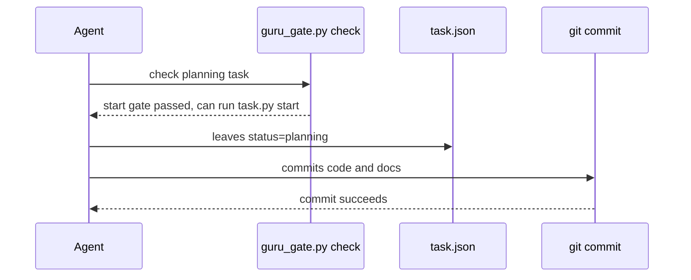
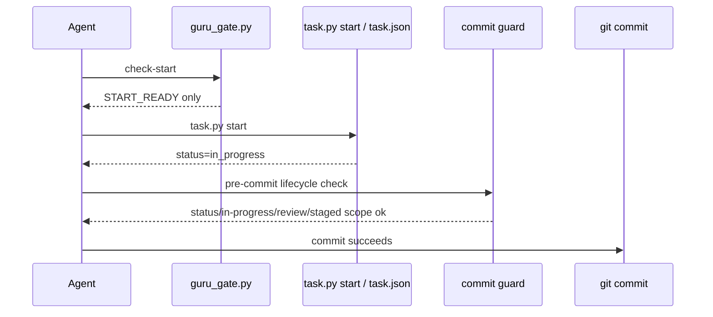

# Session 019f171a Guru/Trellis 根因修复方案

## 0. 结论

会话 `019f171a-091d-7572-85ab-34b1d475b2e5` 不符合当前最新 Guru 系 Trellis 规范。

核心违规不是单点误操作，而是三层防线同时失效：

1. 会话仍处于 `planning`，但实现和提交已经发生。
2. `Brainstorm Evidence` 被结构性补齐，但没有执行高风险决策的一问一答确认闭环。
3. `guru_gate.py check` 的语义是“start 前置闸门已满足”，但输出和工具边界让 agent 把它当成“可以直接实现/提交”。

当前代码已经有 `before_start`、`guru_gate.py check`、`requirement-writing/review` 的部分规范，也已经有实现期 `slice-packets` 与 `implementation-reviews.jsonl` 的结构化能力；但缺少“未 start 不准实现/提交”的硬闸，以及“当前轮确认”和“真实 brainstorm 闭环”的可验证证据模型。

## 1. 事故范围

目标会话：`/Users/devSC/.codex/sessions/2026/06/30/rollout-2026-06-30T13-56-50-019f171a-091d-7572-85ab-34b1d475b2e5.jsonl`

目标工作树：`/Users/devSC/Documents/JobProject/_wt/himora-character-chat-feature-podcast-ui-sync`

目标任务：`/Users/devSC/Documents/JobProject/_wt/himora-character-chat-feature-podcast-ui-sync/.trellis/tasks/06-30-fix-home-character-chat-background-restore`

目标提交：`b841e5dd fix: restore chat background from home entry`

本方案只修 Guru/Trellis 流程和工具防线，不评价业务代码修复本身是否正确。

## 2. 事实证据

| 证据 | 观察 | 结论 |
| --- | --- | --- |
| 目标 `task.json:6` | `"status": "planning"` | 任务未进入实现态。 |
| 目标 `task.json:18` | `"commit": null` | 任务元数据没有记录完成提交。 |
| 目标 `git log --oneline -5` | 存在 `b841e5dd fix: restore chat background from home entry` | 在任务仍为 planning 时产生了业务提交。 |
| 目标 `prd.md:119-139` | 有 `Brainstorm Evidence`，但 `DEC-001` 的 `user_quote` 是原始 TAPD/用户问题陈述，不是当前轮 OQ 回答 | brainstorm 被补成结构证据，不是逐问确认证据。 |
| 会话函数调用流 | 先多次 `guru_gate.py check` / `record-review` / `confirm detail`，最后直接 `git commit` | 没有 `task.py start` 成功记录，也没有 `guru_supervise.py implement/check` 主路径记录。 |
| 会话开发态注入 | `<workflow-state>` 明示 `Task ... (planning)`，且要求主会话跑 `guru_supervise` | 运行时已有提醒，但提醒没有硬约束。 |
| 当前 `.trellis/workflow.md:148` | `Phase 2: Execute -> implement only after task status is in_progress` | 当前规范明确禁止 planning 中实现。 |
| 当前 `.trellis/workflow.md:187`、`:438-448`、`:454-459` | `task.py start` 是必需激活步骤，成功后才切到 `in_progress` | review 结束后必须先 start，不能自动实现。 |
| 当前 `.trellis/workflow.md:193-198` | planning 阶段必须加载 `trellis-brainstorm`，高风险决策一问一答 | “加载 skill”不等于完成 one-question loop。 |
| 当前 `.trellis/workflow.md:229-233` | in_progress 主会话默认派发 implement/check sub-agent | 主会话直接实现/提交绕过了当前默认路径。 |
| 当前 `requirement-writing/SKILL.md:52-54` | 模糊“继续/好/按推荐”不得推断为批量确认，且不得替用户写入 `user_confirmed*` | 目标会话的确认使用方式不符合当前规则。 |
| 当前 `requirement-review/SKILL.md:54-58` | confirmed decision 必须有可追踪确认，历史 quote 不能提升其他决策或触发 start | 原始缺陷描述不能作为当前轮确认。 |
| 当前 `guru_gate.py:46` | 脚本声明只查结构和引用闭合，不做语义判断 | 它无法证明 brainstorm 真实执行。 |
| 当前 `guru_gate.py:102-130`、`:377-427` | `Brainstorm Evidence` 检查主要验证标签、占位、`user_quote/confirmed_ref`、批量确认形态 | 缺少 question loop transcript 或 evidence-only policy 的硬要求。 |
| 当前 `guru_gate.py:2527-2618` | status 最终输出“可 task.py start 进入实现” | 文案容易被误读成可以直接实现。 |
| 当前 `guru_gate.py:2621-2672` | `cmd_check` 只验证需求/概要/详细/人工确认，不验证 `task.status`、实现状态、提交状态 | check 是 start 前置，不是实现/提交前置。 |
| 当前 `config.hooks.yaml:13-15` | hook 只把 `guru_gate.py check` 接到 `before_start` | 跳过 `task.py start` 直接 `git commit` 时没有工具拦截。 |
| 当前 `block-unconfirmed-start.sh:1-69` | PreToolUse 只识别 `task.py start` | 它不能拦直接 `git commit`。 |
| 当前 `guru_supervise.py:673-683`、`:692` | implement-check prompt 要求 review current diff，且禁止 commit | 这是 prompt 约束，不是主会话 commit 硬闸。 |
| 当前 `guru_review_record.py:1-11`、`:131-175`、`:192-226` | 已有实现期 packet/record 的 schema reader/writer | 修复应复用该结构化通道，不应另造一套实现审查记录。 |

用于抽取会话函数调用的命令：

```bash
jq -r 'select(.type=="response_item" and .payload.type=="function_call") | [.timestamp, .payload.name, .payload.arguments] | @tsv' \
  /Users/devSC/.codex/sessions/2026/06/30/rollout-2026-06-30T13-56-50-019f171a-091d-7572-85ab-34b1d475b2e5.jsonl |
  rg -n 'task\.py start|guru_supervise\.py .*implement|guru_supervise\.py .*check|git commit|guru_gate\.py check|record-review|confirm detail'
```

该提取结果显示存在 `git commit`，存在多次 `guru_gate.py check`，存在 `confirm detail --via-agent --user-quote "好，继续"`，但没有 `task.py start` 成功调用，也没有 `guru_supervise.py implement/check` 主路径调用。

## 3. 对用户三个问题的直接回答

### 3.1 为何需求没让我确认就开始了概要设计和详细设计

原因是 `Brainstorm Evidence` 和 requirement gate 的工具判定把“结构证据齐全”当成了“需求确认充分”。当前 `prd.md` 的 `DEC-001` 使用原始缺陷描述作为 `user_quote`，这只能证明问题存在，不能证明当前轮对需求边界、非目标、验收口径已经逐项确认。

正确口径是：

1. 如果存在高风险产品/范围/验收决策，必须用 one-question loop 逐个问。
2. 如果已有 TAPD/需求包/代码证据足以回答，必须记录 `question_policy=evidence_only` 和逐项理由，但不能把它标成当前用户已确认。
3. 进入概要设计前，requirements confirmation 必须是当前轮、当前 artifact digest、当前 gate 的确认，不能用历史 bug quote 或泛化“继续”替代。

### 3.2 概要设计和详细设计 review 结束后为何自动开始了实现

原因是生命周期闸门只拦 `task.py start`，没有拦“未 start 直接编辑代码或提交”。`guru_gate.py status/check` 输出了“可 task.py start 进入实现”，但后续会话把它解释成“实现/提交已放行”。现有 `before_start` hook 只在执行 `task.py start` 时生效，直接 `git commit` 不会触发该闸门。

正确口径是：

1. overview/detail review clean 只表示可以申请激活任务。
2. 用户确认进入实现后，必须执行 `python3 ./.trellis/scripts/task.py start <task-dir>`。
3. 只有 `task.json.status == "in_progress"` 后，才允许 implement/check 和提交。
4. commit 前还必须验证 active task、status、实现审查记录和 staged 范围。

### 3.3 当前是否正确触发 brainstorm 并逐个让我确认问题

没有。

有证据表明 `trellis-brainstorm` 被写入了 `prd.md` 的 `Brainstorm Evidence`，但没有证据表明它按 one-question loop 逐个提出高风险问题、等待用户回答、回写需求后再问下一个。目标 `prd.md` 中的 `Product decisions confirmed` 使用的是原始缺陷陈述和代码证据，不是当前轮问题确认记录。会话中出现的“好，继续”和“已确认”发生在 detail gate/提交附近，也不是逐个需求问题确认。

## 4. 根因树

### RC-001 生命周期状态机没有成为实现/提交硬闸

现有 `task.py start` 是唯一从 `planning` 到 `in_progress` 的普通路径，workflow 也明确写了实现必须在 `in_progress` 后发生。但是工具只把 Guru gate 接到了 `before_start`，没有在 `git commit` 或实现期监督入口上 fail-closed。

失败机制：



目标修复：



### RC-002 `guru_gate.py check` 的输出语义过宽

`cmd_check` 名称和最终“放行”文案没有限定“仅用于 start 前置”。当 agent 已经处于提交路径时，`check` 仍返回 0，容易被当成全面放行。状态输出虽写了“可 task.py start”，但最终 `[guru-gate:check] ... 放行` 没有阶段标签。

修复原则：把 `check` 拆成目的明确的子命令，或至少新增 `--for start|implementation|commit`。`check` 默认只能保持兼容为 `check-start`，输出必须是 `START_READY`，不能写“进入实现已放行”。

### RC-003 brainstorm 证据模型只验证结构，不验证真实问答

当前 `_brainstorm_evidence_problems` 能发现缺标签、占位、缺 `user_quote/confirmed_ref`、批量确认部分问题，但它不能证明：

1. 是否真的问过一个最高优先级问题。
2. 用户回答是否对应具体 `OQ-*`。
3. 回答是否发生在当前轮。
4. repo/TAPD 证据是否足以跳过用户提问。
5. `user_quote` 是“原始问题陈述”还是“对当前问题的答复”。

因此 `Skill loaded` 和 `Product decisions confirmed` 同时存在，仍可能只是后补结构证据。

### RC-004 当前轮确认没有强身份和作用域

`confirm detail --via-agent --user-quote "好，继续"` 可以记录 detail 确认，但该 quote 没有强绑定：

1. 只确认 detail gate，还是确认进入实现。
2. 只确认当前 artifact digest，还是允许后续 commit。
3. 是否回答某个 OQ。
4. 是否来自用户刚刚对一个明确问题的回答。

修复原则：确认记录必须包含 `confirmation_scope`、`gate`、`artifact_digest`、`prompt_summary`、`quote`、`turn_ref`、`allowed_next_action`。模糊确认只能作用于最近一次明确请求的单一 gate，不能跨 gate 复用。

### RC-005 主会话调度规范没有被工具执行

当前 workflow 已要求 `in_progress` 主会话默认派发 `trellis-implement -> trellis-check`，`guru_supervise.py` 也能生成 implement/check worker brief。但该规则依赖 agent 遵守。目标会话没有进入 `in_progress`，所以对应 breadcrumb 没有成为硬约束；即便出现 developer workflow-state 提醒，也没有 commit guard 阻止主会话绕过。

### RC-006 review record 写入和 digest 刷新容易制造机械性“补记录”循环

目标会话中出现过 requirements reconfirm 后 overview/detail digest 失配、并发写丢、串行重记 clean review 的现象。这类问题会让 agent 把注意力放在“补齐 gate 记录”上，而不是重新判断是否还能进入下一阶段。

修复原则：所有 review record 写入都应经过单一 writer、原子写和锁；digest 变化后必须回退到对应阶段，而不是允许在同一实现/提交路径里机械补 record。

## 5. 修复方案

### 5.1 新增生命周期 gate：start、implementation、commit 三段分离

新增或调整命令：

```bash
python3 .trellis/scripts/guru/guru_gate.py check-start <task-dir>
python3 .trellis/scripts/guru/guru_gate.py check-implementation <task-dir>
python3 .trellis/scripts/guru/guru_gate.py check-commit <task-dir>
```

兼容策略：

| 命令 | 第一版行为 | 失败条件 |
| --- | --- | --- |
| `check` | 保持为 `check-start` alias，并输出兼容警告 | 与现有 before_start 兼容 |
| `check-start` | 只判断 requirements/overview/detail/review/confirm 是否允许 `task.py start` | 任一规划 gate 不满足 |
| `check-implementation` | 要求 task status 为 `in_progress`，并要求 active task 指向一致 | status 仍是 `planning` 或无 active task |
| `check-commit` | 要求 status 为 `in_progress`，staged 代码范围属于 active task，必要时要求 implementation review clean record | 未 start、staged scope 异常、缺实现审查、review blocked |

`cmd_status` 文案调整：

```text
规划 gate 已满足：START_READY。
下一步只能运行：
  python3 ./.trellis/scripts/task.py start <task-dir>
在 task.json.status 变为 in_progress 前，禁止编辑业务代码、运行实现 worker、提交 commit。
```

### 5.2 新增 direct commit 防线

新增平台 hook：

```text
guru-template/overlay/hooks/platform/block-unstarted-commit.sh
packages/cli/src/templates/guru/overlay/hooks/platform/block-unstarted-commit.sh
```

拦截策略：

1. 只在 Bash 命令位识别 `git commit`，避免误伤文档、grep、echo、commit message。
2. 若当前 repo 没有 Guru active task，不拦截。
3. 若 active task `status != in_progress` 且存在 staged code/doc changes，阻断并提示先 `task.py start`。
4. 若 active task `status == planning` 且 staged 仅包含规划文档，仍阻断 commit；规划文档可以 stage，但不能提交为实现交付。
5. 若用户显式要求提交纯治理文档且没有 active product task，可不拦截。
6. 对无法判断 active task 的多任务场景 fail-closed，要求显式传 task 或先修复 active task pointer。

补充 `check-commit` 到 finish/commit 前说明：

```bash
python3 .trellis/scripts/guru/guru_gate.py check-commit <task-dir>
git diff --cached --check
git commit ...
```

### 5.3 强化 brainstorm 证据合同

`prd.md` 的 `Brainstorm Evidence` 必须二选一：

#### 模式 A：真实 one-question loop

新增必填区：

```markdown
### Question Loop Log

| oq_id | asked_at | question | recommended_answer | tradeoff | user_quote | resolved_decision | artifact_update |
| --- | --- | --- | --- | --- | --- | --- | --- |
| OQ-001 | 2026-06-30T... | ... | ... | ... | ... | DEC-001 | prd.md §... |
```

规则：

1. 每轮最多一个 `next_question`。
2. 用户回答后先回写 `prd.md`，再进入下一问。
3. `user_confirmed*` 必须引用 `oq_id` 或 `decision_id`。
4. `好/继续/按推荐/已确认` 只有在上一条 assistant 明确问了单一 OQ 时才可接受。
5. 同一句确认不得覆盖多个未列明的 OQ 或 gate。

#### 模式 B：证据充分，无需问用户

新增必填区：

```markdown
### Question Policy

question_policy: evidence_only
reason: TAPD/正式需求包/代码事实已经覆盖所有高风险产品、范围、验收决策。
coverage:
  - risk_area: scope
    source: TAPD + requirement package
    result: evidence_ready
    why_no_user_question: ...
  - risk_area: acceptance
    source: existing requirement package
    result: evidence_ready
    why_no_user_question: ...
```

规则：

1. `evidence_only` 只能得出 `evidence_ready`，不能直接得出 `user_confirmed*`。
2. 进入概要设计前仍需一次当前轮 requirements confirmation。
3. 原始 bug quote 只能作为 `source_quote`，不能作为 `current_turn_confirmation`。

### 5.4 强化当前轮确认模型

`guru_gate.py confirm` 写入结构增加字段：

```json
{
  "confirmed_by": "Wilson",
  "confirmed_at": "2026-06-30T15:15:26+08:00",
  "artifact_digest": "...",
  "confirmation_scope": "detail_gate_only",
  "allowed_next_action": "task_start",
  "prompt_summary": "请确认详细设计 review 后是否允许进入 task.py start",
  "user_quote": "已确认",
  "turn_ref": "019f1762-1962-7ba2-8073-7f3a12d78af3"
}
```

约束：

1. `requirements` confirmation 的 `allowed_next_action` 最多是 `overview_design`。
2. `detail` confirmation 的 `allowed_next_action` 最多是 `task_start`。
3. `task_start` confirmation 不等于 implementation permission；实现 permission 由 `task.py start` 成功后的 `status=in_progress` 给出。
4. `commit` permission 只能由 `check-commit` 给出，不能由任何人工 gate confirmation 给出。

### 5.5 实现期入口强制检查

`guru_supervise.py implement`、`check`、`implement-check` 启动前必须执行：

1. task status 必须为 `in_progress`。
2. active task 必须等于传入 task。
3. 若存在 slice packet，复用 `guru_review_record.load_packet` 做 packet preflight。
4. 高风险 slice 必须有 required semantic review provider；若 provider disabled，只能记录 deferred/blocked，不能产生 clean。
5. worker brief 继续保留 `Do not commit`，但 commit 前硬闸不依赖 prompt。

### 5.6 统一 review record 写入

已有 `guru_review_record.py` 是实现期 packet/record 的单一 schema 通道。后续应扩展或复用同样原则覆盖 overview/detail review_runs：

1. `record-review overview/detail` 的 read-modify-write 加锁。
2. 同一 artifact digest 下 run_id 唯一。
3. digest 变化后旧 clean 自动只读归档，不可在同一提交路径里机械补齐。
4. 并发写入失败必须显式报 `REVIEW_RECORD_RACE`，要求重新读取 status 后再继续。

### 5.7 模板和安装镜像同步

所有改动必须双写：

| 源 | 镜像 |
| --- | --- |
| `guru-template/overlay/verify/guru_gate.py` | `packages/cli/src/templates/guru/overlay/verify/guru_gate.py` |
| `guru-template/overlay/verify/guru_supervise.py` | `packages/cli/src/templates/guru/overlay/verify/guru_supervise.py` |
| `guru-template/overlay/verify/guru_review_record.py` | `packages/cli/src/templates/guru/overlay/verify/guru_review_record.py` |
| `guru-template/overlay/hooks/platform/*.sh` | `packages/cli/src/templates/guru/overlay/hooks/platform/*.sh` |
| `guru-template/overlay/config-snippets/config.hooks.yaml` | `packages/cli/src/templates/guru/overlay/config-snippets/config.hooks.yaml` |
| `guru-template/overlay/agents-skills/*/SKILL.md` | `packages/cli/src/templates/guru/overlay/agents-skills/*/SKILL.md` |
| `guru-template/workflows/guru-*-workflow.md` | `packages/cli/src/templates/guru/workflows/guru-*.md`；安装结果写入目标项目 `.trellis/workflow.md` |
| `guru-template/specs/guru-*/harness/gate/gate-confirmation-model.md` | `packages/cli/src/templates/guru/specs/guru-*/harness/gate/gate-confirmation-model.md` |
| `guru-template/specs/guru-*/harness/implementation/implementation-trace-contract.md` | `packages/cli/src/templates/guru/specs/guru-*/harness/implementation/implementation-trace-contract.md` |

## 6. 代码落点

### 6.1 `guru_gate.py`

必须改：

1. 增加 `check-start`、`check-implementation`、`check-commit`。
2. `check` alias 到 `check-start`，输出兼容提示。
3. `cmd_status` 末尾只输出 `START_READY`，不再输出容易误读的“放行”。
4. `_brainstorm_evidence_problems` 要求 `Question Loop Log` 或 `Question Policy`。
5. `confirm` 记录 `confirmation_scope`、`allowed_next_action`、`prompt_summary`、`turn_ref`。
6. `check-commit` 读取 `git diff --cached --name-only`，判断 staged scope 与 task status。

### 6.2 `guru_supervise.py`

必须改：

1. `implement`、`check`、`implement-check` 入口调用 `check-implementation`。
2. `implement-check` 完成后写 `implementation-reviews.jsonl`，不得只依赖 worker 文本。
3. 如果 task still planning，直接 fail-closed，不启动 worker。

### 6.3 `block-unconfirmed-start.sh`

保留现有职责，但错误提示改为：

```text
Guru start gate 未通过，禁止 task.py start。
注意：gate 通过后仍必须执行 task.py start；不能直接实现或提交。
```

### 6.4 `block-unstarted-commit.sh`

新增职责：

1. 命令位识别 `git commit`。
2. 运行 `guru_gate.py check-commit`。
3. 失败时退出 2，并打印 `task.py start` 和 `guru_gate.py status` 修复步骤。

### 6.5 `requirement-writing` / `requirement-review`

已有规则方向正确，但需要补模板约束：

1. `Question Loop Log` 输出样例。
2. `Question Policy: evidence_only` 输出样例。
3. 明确 `source_quote`、`confirmed_ref`、`current_turn_confirmation` 三者区别。
4. 明确原始缺陷描述不能作为 `user_confirmed*` 的当前轮确认。

### 6.6 `workflow.md`

在 planning 与 activation 段补一句强约束：

```text
Review clean only means START_READY. It is not permission to implement or commit.
Until task.py start succeeds and task.json.status is in_progress, do not edit implementation code, run implement/check workers, or commit task deliverables.
```

在 in_progress 段补 commit 前命令：

```bash
python3 ./.trellis/scripts/guru/guru_gate.py check-commit <task-dir>
```

## 7. 验收标准

### 7.1 事故不可复现

用 `019f171a` 的行为序列构造回归夹具：

1. 创建 full Guru task。
2. 补齐 requirements/overview/detail/review/confirm。
3. 不运行 `task.py start`。
4. stage 代码和设计文档。
5. 运行 `git commit`。

预期：`block-unstarted-commit.sh` 或 `check-commit` 失败，提示必须 `task.py start`。

### 7.2 正常路径不被误伤

1. planning 阶段 `check-start` 通过后，`task.py start` 成功。
2. task status 变为 `in_progress`。
3. `guru_supervise.py implement-check` 可启动。
4. 实现审查 clean record 写入。
5. `check-commit` 通过。
6. `git commit` 成功。

### 7.3 brainstorm 结构不可伪造

必须新增测试：

| 输入 | 预期 |
| --- | --- |
| 只有 `Skill loaded` 和 `Product decisions confirmed` | fail |
| `DEC-001 user_quote` 是原始缺陷描述，但无 `Question Loop Log` / `Question Policy` | fail |
| 多个 OQ 用一句“好，继续”确认 | fail |
| 单一 OQ 上一轮明确询问，用户答“按推荐”，有 `oq_id` 和 artifact update | pass |
| `question_policy=evidence_only` 且 coverage 完整，decision 为 `evidence_ready` | pass |
| `question_policy=evidence_only` 但 decision 写成 `user_confirmed` | fail |

### 7.4 状态文案不可误读

`guru_gate.py status/check-start` 的测试必须断言输出包含 `START_READY` 和 `task.py start`，并且不包含单独的“实现放行/提交放行”。

### 7.5 模板一致性

执行：

```bash
rg -n "check-commit|Question Loop Log|Question Policy|block-unstarted-commit" guru-template packages/cli/src/templates/guru
```

预期源模板和 CLI 安装模板都有同名能力。

## 8. 建议实现顺序

### P0 阻断事故复现

1. `guru_gate.py` 增加 `check-start/check-implementation/check-commit`。
2. 新增 `block-unstarted-commit.sh` 并接入 Guru hooks。
3. 修改 `cmd_status/check` 文案，消除“check 通过等于实现放行”的歧义。
4. `guru_supervise.py implement/check/implement-check` 在 status 非 `in_progress` 时 fail-closed。
5. 添加 `019f171a` 回归夹具。

### P1 修复确认和 brainstorm 证据

1. 扩展 `Brainstorm Evidence` 合同。
2. `_brainstorm_evidence_problems` 校验 `Question Loop Log` / `Question Policy`。
3. `confirm` 记录 current-turn scope。
4. 更新 `requirement-writing/review` 模板。
5. 增加模糊确认、历史 quote、evidence-only 的测试。

### P2 降低 review record 机械补齐风险

1. overview/detail review_runs 写入加锁或迁移到结构化 JSONL。
2. digest 变更后输出更明确的阶段回退提示。
3. `record-review` 并发冲突转为显式失败，不允许静默覆盖或丢失。

## 9. 验证命令

实现后至少运行：

```bash
python3 -m py_compile guru-template/overlay/verify/guru_gate.py
python3 -m py_compile guru-template/overlay/verify/guru_supervise.py
python3 -m py_compile guru-template/overlay/verify/guru_review_record.py
bash -n guru-template/overlay/hooks/platform/block-unconfirmed-start.sh
bash -n guru-template/overlay/hooks/platform/block-unstarted-commit.sh
rg -n "check-commit|Question Loop Log|Question Policy|block-unstarted-commit" guru-template packages/cli/src/templates/guru
git diff --check
```

若已有测试入口可用，补跑：

```bash
npm test -- --runInBand
```

若仓库测试是分组命令，以现有 package scripts 为准，但必须覆盖：

1. `guru_gate.py` brainstorm/lifecycle 单测。
2. hook 命令位识别单测。
3. template mirror 一致性测试。
4. 事故夹具回归测试。

## 10. 迁移与兼容

1. `guru_gate.py check` 第一版保留 alias，避免破坏现有 `before_start`。
2. 旧任务缺 `Question Loop Log` 时，只有在重新进入 requirements gate 或确认态刷新时才强制修复；已 archived 的任务不回写。
3. 旧任务可通过 `question_policy=evidence_only` 补足证据，但不能批量把历史 `user_quote` 升级为当前用户确认。
4. `block-unstarted-commit.sh` 只在有 active Guru task 时启用，降低对普通仓库提交的干扰。
5. 对 Codex hooks 未启用的环境，`check-commit` 仍必须作为 `/trellis:finish-work` 和 workflow commit step 的显式命令；hook 是提前拦截，不是唯一防线。

## 11. 自审矩阵

| 维度 | 结论 | 说明 |
| --- | --- | --- |
| 目标清晰度 | covered | 目标是防止 planning 中实现/提交，以及防止伪 brainstorm/伪确认。 |
| 范围边界 | covered | 只修 Guru/Trellis 工具和规范，不碰 Himora 业务代码。 |
| 当前代码对齐 | covered | 落点覆盖 `guru_gate.py`、`guru_supervise.py`、hooks、skills、workflow、template mirror。 |
| 生命周期状态机 | covered | start/implementation/commit 三段 gate 分离。 |
| brainstorm 语义 | covered | 要求 Question Loop Log 或 evidence-only policy。 |
| 当前轮确认 | covered | 增加 scope、allowed_next_action、turn_ref、prompt_summary。 |
| 主会话绕过 | covered | commit hook + check-commit 拦直接提交。 |
| sub-agent 路径 | covered | implement/check 入口必须验证 in_progress。 |
| review record race | covered | P2 加锁或迁移 JSONL，避免机械补 clean。 |
| 测试验收 | covered | 包含事故夹具、正常路径、brainstorm、文案、mirror 一致性。 |
| 迁移兼容 | covered | 保留 `check` alias，旧任务渐进修复。 |
| 残余风险 | accepted | 无法把 prompt 规则变成密码学安全边界；本方案以 hook、gate 和 commit 前命令降低无意绕过风险。蓄意绕过仍需外部信任根。 |

## 12. 本方案的审查结论

本方案已按 plan-reviewer 与 full-cycle-plan-repair 清单自审。当前没有 blocker 或 should-fix。

剩余 accepted boundary：

1. 该方案不要求第一版把确认信任根移到 agent 可写域之外；那是架构级安全边界升级。
2. 该方案不要求回写所有历史 task；只对重新进入 gate 或新增任务生效。
3. 该方案不评价 `b841e5dd` 的业务修复正确性，只处理流程根因。
