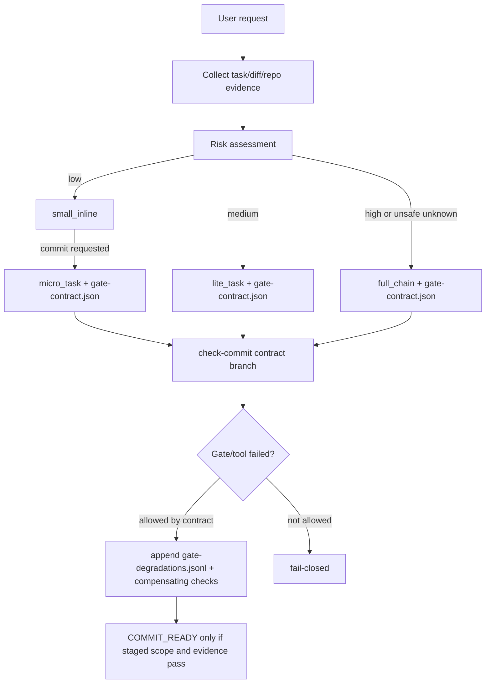

# Risk-based intake routing with gate contracts design

## §1 概要设计

### 1.1 Architecture Summary

本设计在现有 Guru 双轨制上加一层 intake contract，不替换 Trellis task status，也不替换 `task.json.guru_chain`。

核心边界：

- `guru_risk.py` 继续作为风险信号来源，扩展为 `low|medium|high|unknown` 和 route 建议。
- 新增或等价抽取 `guru_contract.py` 作为 gate contract / degradation 的单一读写和校验入口。
- `guru_after_create.py` 对新任务写入 fail-safe 默认合同：`route=full_chain`、`risk=unknown` 或 `high` 口径；lite/micro 只能由 intake router 或人工确认后的工具显式改写。
- `guru_gate.py check-commit` 读取合同：`full_chain` 保持当前 strict 行为；`lite_task` 在 strict 行为基础上校验合同；`micro_task` 走低风险 scoped commit 口径，不要求 full start/review，但必须校验 staged scope、风险信号、允许降级和补偿检查。
- workflow / skill 文档只负责让 AI 在收到任务时做 route 判断并落 contract，不把降级权限写死在 prompt 中。
- `packages/cli/src/templates/guru/**` 与 `guru-template/**` 必须同步；当前本地 `.trellis` / hooks 只在验证需要时最小 dogfood。

### 1.2 行为 owner 归属表

| BHV | owner | 归属理由 / 三问 |
| --- | --- | --- |
| BHV-001 | `guru_risk.py` + workflow/skill intake 文案 | 为什么属于它：低风险自动执行首先是入口分类问题；为什么不属于 `guru_gate.py`：commit gate 只能复核，不能决定收到任务时的 UX；是否独立存在：需要独立函数便于测试和复用。 |
| BHV-002 | `guru_risk.py` + `guru_contract.py` | 为什么属于它：medium/lite 需要同时给出风险和合同；为什么不只写 task.json：合同字段比 `guru_chain` 更细；是否独立存在：是，合同验证要被 commit gate 复用。 |
| BHV-003 | `guru_risk.py` + `guru_contract.py` | 为什么属于它：high-risk fail-closed 必须在分类和合同校验两处都成立；为什么不靠 prompt：prompt 不能作为 hard gate；是否独立存在：是，全局 policy 是高风险不可降级的 owner。 |
| BHV-004 | `guru_contract.py` | 为什么属于它：degradation 是 append-only 事实账，读写和字段校验必须单一来源；为什么不放 `guru_gate.py`：避免 commit gate 内部重复解析 JSONL；是否独立存在：是，会被 supervise/check/commit 多处消费。 |
| BHV-005 | `guru_contract.py` + `guru_gate.py` | 为什么属于它：合同校验判断能否降级，commit gate 负责 fail-closed；为什么不只靠降级记录：记录本身不是授权；是否独立存在：是，必须测试伪造/越权合同。 |
| BHV-006 | `guru_gate.py check-commit` | 为什么属于它：staged scope 是提交时事实，只能在 commit gate 里复核；为什么不属于 intake：intake 发生在 diff 之前；是否独立存在：是，commit hook 必须可复跑。 |
| BHV-007 | `guru_gate.py finish/commit policy` + workflow text | 为什么属于它：Finish 预算是 gate lifecycle 决策；为什么不属于 intake：只有实现和验证完成后才知道 spec update / commit readiness；是否独立存在：是，直接影响 commit 前耗时。 |
| BHV-008 | detail digest builder + mutable evidence store | 为什么属于它：digest 取材边界决定 evidence 是否让 Gate stale；为什么不只靠 prompt：agent 很容易把证据追加到 `implement.md`；是否独立存在：是，需要测试 digest 稳定性。 |
| BHV-009 | `guru_gate.py commit-plan` | 为什么属于它：stage scope 必须由 gate 机器输出；为什么不靠 agent 读源码：会造成 token 膨胀和推断漂移；是否独立存在：是，后续 `check-commit` 复用同一 decision。 |
| BHV-010 | `guru_supervise.py status/cleanup` | 为什么属于它：worker live/terminal 状态属于 channel runtime；为什么不属于 commit gate：commit gate 只消费结果，不管理进程；是否独立存在：是，避免完成态 worker 阻塞尾部。 |
| BHV-011 | workflow stop rule + `commit-plan` | 为什么属于它：不可逆边界由 workflow 和 commit-plan 一起表达；为什么不属于实现 worker：worker 不应 stage/commit；是否独立存在：是，避免自动扩展收口。 |
| BHV-012 | compact commit context loader | 为什么属于它：上下文装载决定尾部 token 成本；为什么不属于业务 gate：这是主会话恢复/收口策略；是否独立存在：是，可单独验证不重读大文件。 |

### 1.3 Flow



### 1.4 详细设计承接索引

| chapter_target | doc_type | 承接行为 | owner |
| --- | --- | --- | --- |
| `design.md#UNIT-intake-risk-router` | service | BHV-001, BHV-002, BHV-003 | `guru_risk.py` plus workflow/skill routing text |
| `design.md#UNIT-gate-contract-store` | data-contract | BHV-002, BHV-003, BHV-004, BHV-005 | `guru_contract.py` |
| `design.md#UNIT-commit-contract-gate` | gate-runtime | BHV-004, BHV-005, BHV-006 | `guru_gate.py check-commit` |
| `design.md#UNIT-template-sync` | template-sync | BHV-001, BHV-002, BHV-003, BHV-006 | `packages/cli/src/templates/guru/**` and `guru-template/**` |
| `design.md#UNIT-finish-route-policy` | gate-runtime | BHV-007, BHV-011, BHV-012 | `guru_gate.py` finish/commit policy plus workflow text |
| `design.md#UNIT-mutable-evidence-store` | evidence-contract | BHV-008 | detail digest builder plus task-local evidence JSONL |
| `design.md#UNIT-commit-plan-gate` | gate-runtime | BHV-009, BHV-011 | `guru_gate.py commit-plan` |
| `design.md#UNIT-worker-cleanup-and-compact-context` | runtime-context | BHV-010, BHV-012 | `guru_supervise.py` status/cleanup plus compact context loading |

### 1.5 Compatibility

- Existing tasks without `gate-contract.json` keep current behavior. `check-commit` must fall back to the existing full strict branch unless a valid contract explicitly selects `micro_task` or `lite_task`.
- Existing `guru_chain=full|light` remains the artifact-shape selector. New `route` is a contract selector and must not become a Trellis `status`.
- `gate-degradations.jsonl` is evidence, not permission. Permission comes from global policy plus the selected contract.
- Full-chain commit behavior must remain at least as strict as current code: `check-implementation` + staged scope + latest clean implementation review digest.

### 1.6 Rollout / Rollback

- Rollout is template-first. Modify `packages/cli/src/templates/guru/**`, mirror into `guru-template/**`, and validate mirror consistency.
- Dogfood local `.trellis` / hooks only when a validation path cannot run against the template source directly.
- Rollback is file-level: revert `guru_contract.py` and the changed call sites; tasks without contracts remain compatible because fallback behavior is unchanged.

## §2 详细设计

### UNIT-intake-risk-router

#### 单元职责

承接 BHV-001, BHV-002, BHV-003。负责把请求、task metadata、dirty/staged paths 和 existing `guru_risk.py` signals 归一化为 `RiskAssessment`。

#### 行为定义

行为清单：

- BHV-001: 低风险小改返回 `risk=low`、`route=small_inline`，commit 请求时升级为 `micro_task`。
- BHV-002: 中风险局部行为变更返回 `risk=medium`、`route=lite_task`。
- BHV-003: high-risk signal 返回 `risk=high`、`route=full_chain`，优先级高于任何 low hint。

#### 核心数据结构

`RiskAssessment` 使用普通 dict / TypedDict 风格字段：

```json
{
  "risk": "low|medium|high|unknown",
  "route": "small_inline|micro_task|lite_task|full_chain",
  "confidence": 0.0,
  "reasons": ["short reason"],
  "risk_flags": ["payment", "workflow", "cross_layer"],
  "needs_user_choice": false,
  "recommended_contract": "micro_task"
}
```

#### 逐行为设计

- BHV-001: 先排除 high-risk keywords/path signals；再识别局部 UI/文案/注释/格式类小改。无 commit 时只返回 inline 建议；commit 时要求 `micro_task` 合同。
- BHV-002: 未命中 high-risk，但涉及局部行为、测试、单层逻辑或多文件小范围改动时返回 `medium/lite_task`。
- BHV-003: `payment`、`ads`、`permission`、`privacy`、`db_migration`、`protocol_migration`、`workflow`、`hook`、`gate`、`runtime`、cross-layer/storage 等任一命中即 high。

#### 状态/边界

`unknown` 不得降为 low。扫描失败时至少 medium；扫描失败且请求文本含 high-risk 词时 high。

#### 数据合同

该单元只产生 assessment，不写文件。写文件由 UNIT-gate-contract-store 负责。

#### 测试映射

- `low UI color` -> low/small_inline。
- `low UI color + commit` -> low/micro_task。
- `local behavior bug` -> medium/lite_task。
- `payment/privacy/schema/workflow/gate` -> high/full_chain。
- `git scan failure` -> medium 或 high，不能 low。

#### 不得补造清单

不得凭用户说“小改”覆盖 high-risk signal；不得在分类阶段直接伪造 gate 通过证据。

### UNIT-gate-contract-store

#### 单元职责

承接 BHV-002, BHV-003, BHV-004, BHV-005。负责 `gate-contract.json`、`gate-degradations.jsonl`、`gate-evidence/` 的 schema、读写、校验和全局 policy 合并。

#### 行为定义

行为清单：

- BHV-002: medium/lite task 写入 lite contract。
- BHV-003: high/full task 写入 full contract，并拒绝任何降级到 lite/micro/inline。
- BHV-004: 工具失败且合同允许时追加 degradation 事实。
- BHV-005: 工具失败但合同不允许时返回 validation problem。

#### 核心数据结构

`gate-contract.json` 最小结构：

```json
{
  "schema_version": 1,
  "risk": "low|medium|high|unknown",
  "route": "micro_task|lite_task|full_chain",
  "assessment": {
    "confidence": 0.95,
    "reasons": [],
    "risk_flags": []
  },
  "scope": {
    "allowed_paths": [],
    "forbidden_path_patterns": [],
    "max_files": null
  },
  "required_gates": [],
  "optional_gates": [],
  "allowed_degradations": [
    {
      "gate": "gitnexus_impact",
      "max_risk": "low",
      "fallback_checks": ["rg_callers", "git_diff_check"]
    }
  ],
  "commit_policy": {
    "require_in_progress": true,
    "require_clean_implementation_review": true,
    "allow_task_artifacts_only": false
  },
  "created_by": "intake",
  "created_at": "ISO-8601",
  "policy_version": "guru-risk-contract-v1"
}
```

`gate-degradations.jsonl` 每行结构：

```json
{
  "schema_version": 1,
  "gate": "gitnexus_impact",
  "reason": "tool_unavailable",
  "command": "node .gitnexus/run.cjs impact ...",
  "stderr_excerpt": "incompatible architecture",
  "allowed_by": "gate-contract.json#/allowed_degradations/0",
  "compensating_checks": [
    {"name": "rg_callers", "status": "passed", "evidence": "gate-evidence/rg-callers.txt"}
  ],
  "created_at": "ISO-8601",
  "created_by": "agent"
}
```

#### 逐行为设计

- BHV-002: `lite_task` contract may allow optional provider degradation only when deterministic checks and scoped tests are present.
- BHV-003: `full_chain` contract rejects degradation for requirements/detail/implementation semantic gate and high-risk impact analysis.
- BHV-004: append-only JSONL write creates parent directories and never rewrites previous rows.
- BHV-005: validation returns explicit problem strings for route/risk mismatch, unauthorized gate, missing compensating check, malformed JSON, stale policy version, or high-risk downgrade attempt.

#### 状态/边界

Contract file can be replaced only by route selection before implementation starts. Degradation JSONL is append-only during execution.

#### 数据合同

Global policy is hard-coded in source template first. Future config can expose policy, but this task keeps policy local to the Guru overlay to avoid uncontrolled project overrides.

#### 测试映射

- Valid micro/lite/full contract fixtures.
- High risk with `route=micro_task` fails validation.
- Degradation row for unlisted gate fails validation.
- Degradation row with missing compensating check fails validation.
- Malformed JSON fails closed.

#### 不得补造清单

不得让 task-local contract permit a degradation that global policy forbids. 不得把 `gate-degradations.jsonl` 当作预授权白名单。

### UNIT-commit-contract-gate

#### 单元职责

承接 BHV-004, BHV-005, BHV-006。负责让 `guru_gate.py check-commit` 同时理解 staged scope、existing implementation review 和 task contract。

#### 行为定义

行为清单：

- BHV-004: optional gate failed but allowed degradation and compensating checks pass -> continue.
- BHV-005: gate failure unauthorized or high-risk -> block.
- BHV-006: staged paths must match contract scope and required evidence.

#### 核心数据结构

Internal `CommitDecision`:

```json
{
  "ready": false,
  "route": "full_chain",
  "problems": [],
  "staged_paths": [],
  "used_degradations": []
}
```

#### 逐行为设计

- `full_chain`: keep current implementation: `cmd_check_implementation` then `_implementation_review_problem`.
- `lite_task`: run current implementation path, then additionally validate contract and degradations.
- `micro_task`: skip full `check-implementation` only when contract is valid, risk is low, staged scope is inside allowed paths, no high-risk path signal exists, and required deterministic/compensating evidence is present.
- No contract: preserve current behavior to avoid breaking existing tasks.

#### 失败收口

失败如何收口：

- Missing or malformed `gate-contract.json` on `micro_task` path -> block and ask to regenerate the micro task contract.
- Unauthorized or malformed `gate-degradations.jsonl` row -> block and print the invalid gate plus recovery action.
- Staged path outside contract scope -> block and require restaging or contract regeneration.
- High-risk staged signal in a `micro_task` contract -> block and require full_chain.
- Full-chain review digest mismatch -> keep current hard block and require rerunning implementation review.

#### 状态/边界

`micro_task` is the only route allowed to commit without full `in_progress` + clean implementation review. That exception is bounded by low risk and scoped staged paths.

#### 数据合同

`check-commit` prints which contract branch it used. Blocking output includes the first recovery action.

#### 测试映射

- Full chain fixture still passes/fails exactly as existing tests expect.
- Micro task with allowed staged code path and valid GitNexus degradation passes.
- Micro task with task artifacts only fails.
- Micro task with cross-layer/storage staged path fails.
- `lite_task` with unauthorized degradation fails.

#### 不得补造清单

不得 weaken existing full chain checks. 不得 let micro_task cover `.trellis/tasks/**`-only commits unless a future docs-only contract is explicitly designed.

### UNIT-template-sync

#### 单元职责

承接 BHV-001, BHV-002, BHV-003, BHV-006。负责 source/template 优先实现和 mirror 一致性。

#### 行为定义

行为清单：

- BHV-001/BHV-002/BHV-003: workflow and skill text must describe the same routing table as runtime helpers.
- BHV-006: commit hook docs must point to contract-aware `check-commit`.

#### 核心数据结构

Template pairs:

- `packages/cli/src/templates/guru/overlay/**`
- `guru-template/overlay/**`
- `packages/cli/src/templates/guru/workflows/**`
- `guru-template/workflows/**`
- `packages/cli/src/templates/guru/specs/**`
- `guru-template/specs/**`

#### 逐行为设计

Edit source template first, mirror into `guru-template`, then run diff checks to prove no intended mirror drift.

#### 状态/边界

Local `.trellis` / `.codex` dogfood is not part of default implementation. If used, record exact files and reason in `implement.md`.

#### 数据合同

Mirror check is command evidence, not a separate runtime contract.

#### 测试映射

- `diff -qr` or targeted `git diff --no-index` on changed mirror pairs.
- Existing Guru verify tests.
- Requirements/overview/detail/implement gate checks on this task artifacts.

#### 不得补造清单

不得只改 `guru-template` 或只改 `packages/cli/src/templates/guru`。不得把 local dogfood edits committed as if they were template source changes.

### UNIT-finish-route-policy

#### 单元职责

承接 BHV-007, BHV-011, BHV-012。负责在 Finish 阶段按 route / gate contract 选择完成预算，避免所有任务默认进入 full Phase 3.3 收口。

#### 行为定义

行为清单：

- BHV-007: route 决定 verification、spec update、worker cleanup、commit-plan 的默认严格度。
- BHV-011: 达到 commit-ready 后停止在用户确认边界，不自动 stage/commit/TAPD/archive。
- BHV-012: commit 前使用 compact commit context，避免尾部重新加载完整 skill/memory/spec。

#### Route Matrix

| route | verification | spec update | worker cleanup | commit-plan | stop boundary |
| --- | --- | --- | --- | --- | --- |
| `direct_small_inline` | scoped diff/check only | n/a | n/a | required | before commit |
| `micro_task` | scoped deterministic checks | deferred by default | terminal-only | required | before commit |
| `lite_task` | focused tests + scoped analyze/checks | conditional reusable contract | terminal-only | required | before commit |
| `full_chain` | full task verification | required | required | required | before commit/archive |

#### 逐行为设计

- `direct_small_inline`: 只允许 no-task 低风险 staged scope；完成条件是 `check-commit` / `commit-plan` 判定 direct commit ready。
- `micro_task`: 默认记录 `spec_update=deferred|not_applicable`，不因缺 Phase 3.3 阻塞 implementation commit。
- `lite_task`: 若实现沉淀为可复用跨层合同，则执行 spec update；否则记录 deferred，不机械写 spec。
- `full_chain`: 保持当前 Phase 3.3 required 语义。
- 所有 route: commit-ready 后只报告 stage/commit 下一步，停止自动扩展。

#### 状态/边界

Finish policy 不新增 Trellis status。它读取 `gate-contract.json`、task status 和 review/check evidence，输出下一步动作。

#### 数据合同

```json
{
  "schema_version": 1,
  "route": "lite_task",
  "spec_update": "conditional|deferred|required|not_applicable",
  "commit_ready_stop": true,
  "compact_context_required": true
}
```

#### 测试映射

- `micro_task` spec update deferred 不阻塞 commit-plan。
- `lite_task` no reusable contract -> deferred。
- `lite_task` reusable contract -> conditional required。
- `full_chain` missing spec update -> block。

#### 不得补造清单

不得把 route-aware Finish 当作跳过验证；不得让 `micro_task` / `lite_task` 规避 staged scope 或 high-risk fail-closed。

### UNIT-mutable-evidence-store

#### 单元职责

承接 BHV-008。负责把实现后的验证、spec 萃取、worker cleanup、commit-plan 证据从 planning/detail digest 中隔离。

#### 行为定义

行为清单：

- BHV-008: post-implementation evidence 不得写入会参与 detail digest 的 `implement.md`。

#### 核心数据结构

推荐文件：

- `implementation-evidence.jsonl`
- `verification-evidence.jsonl`
- `spec-extraction.jsonl`
- `worker-cleanup.jsonl`
- `commit-plan.json`

每行 JSONL 记录至少包含：

```json
{
  "schema_version": 1,
  "kind": "verification|spec_extraction|worker_cleanup",
  "route": "lite_task",
  "status": "passed|deferred|not_applicable|failed",
  "evidence": [],
  "created_at": "ISO-8601"
}
```

#### 逐行为设计

- 测试、analyze、diff check、GitNexus detect_changes 写 `verification-evidence.jsonl`。
- Phase 3.3 九段萃取写 `spec-extraction.jsonl` 或 workspace journal，不写 `implement.md`。
- cleanup done/killed/error worker 写 `worker-cleanup.jsonl`。
- commit scope decision 写 `commit-plan.json`。

#### 状态/边界

这些 mutable evidence 文件是 Finish audit 输入，不是 planning contract。它们不参与 requirements / overview / detail digest。

#### 测试映射

- 追加 `verification-evidence.jsonl` 后 detail digest 不变。
- 追加 `spec-extraction.jsonl` 后 detail digest 不变。
- 修改 `design.md` 或 `implement.md` 合同正文后 detail digest 变化。

#### 不得补造清单

不得把 execution evidence 伪装成设计合同；不得为了让 commit gate 看到证据而污染 detail digest。

### UNIT-commit-plan-gate

#### 单元职责

承接 BHV-009, BHV-011。负责在 commit 前输出机器可读 staged-scope 计划，并让 `check-commit` 后续复用同一 decision model。

#### 行为定义

行为清单：

- BHV-009: commit 前输出 allowed / forbidden paths 和 suggested stage commands。
- BHV-011: commit-plan 达到 ready 后停止等待用户确认。

#### 核心数据结构

```json
{
  "schema_version": 1,
  "route": "direct_small_inline|micro_task|lite_task|full_chain",
  "commit_mode": "direct|implementation|docs|tooling|split_required",
  "allowed_stage_paths": [],
  "forbidden_stage_paths": [],
  "required_commands": [],
  "optional_commands": [],
  "required_user_confirmations": [],
  "can_commit_now": false,
  "blocking_reasons": [],
  "suggested_stage_commands": []
}
```

#### 逐行为设计

- direct small_inline: allowed paths 等于当前 staged low-risk implementation files；forbidden 包含 task/workspace/high-risk paths。
- micro_task: allowed paths 来自 contract scope；requires compensating checks if degradation exists。
- lite_task: allowed paths 来自 latest clean implementation review target paths；spec/task/journal/tooling 文件默认 split_required。
- full_chain: 保持当前 staged scope + reviewed target digest strict checks；若 task/spec/tooling 混入 implementation commit，输出 split_required。

#### 状态/边界

`commit-plan` 是只读决策命令；初期可以先不改变 `check-commit` 行为，但最终 `check-commit` 必须复用该 decision。

#### 测试映射

- no-task low-risk staged 2 files -> `direct`, can commit。
- task/spec/journal 混入 implementation commit -> `split_required`。
- full-chain review digest mismatch -> blocking reason。
- micro_task missing compensating checks -> blocking reason。

#### 不得补造清单

不得让 agent 读取 `guru_gate.py` 源码推断 stage 范围；不得让 `commit-plan` 和 `check-commit` 使用两套判定。

### UNIT-worker-cleanup-and-compact-context

#### 单元职责

承接 BHV-010, BHV-012。负责减少 Finish 尾部 worker 状态和上下文装载造成的时间/token 放大。

#### 行为定义

行为清单：

- BHV-010: terminal worker 不再作为 live blocker。
- BHV-012: commit 前只保留 compact commit context。

#### 核心数据结构

Worker status summary:

```json
{
  "live_workers": 0,
  "terminal_workers": 2,
  "cleanup_available": true,
  "blocking": false
}
```

Compact commit context:

```json
{
  "task_dir": "...",
  "route": "lite_task",
  "latest_review_digest": "...",
  "validation_summary": [],
  "dirty_scope": [],
  "commit_plan": {}
}
```

#### 逐行为设计

- `guru_supervise status` 区分 live 与 terminal。
- terminal-only 状态给出单条 cleanup 建议，不要求主会话多轮 `pgrep`。
- commit-ready 后不重新读取完整 skill/memory/spec；只读 commit-plan 和 compact context。

#### 测试映射

- terminal done worker 不阻塞 commit-plan。
- live worker 仍阻塞或提示等待。
- compact context 缺 latest review digest 时提示补证据，不自动加载全部 spec。

#### 不得补造清单

不得误杀 live worker；不得因为 compact context 缺失而静默跳过 required review。
