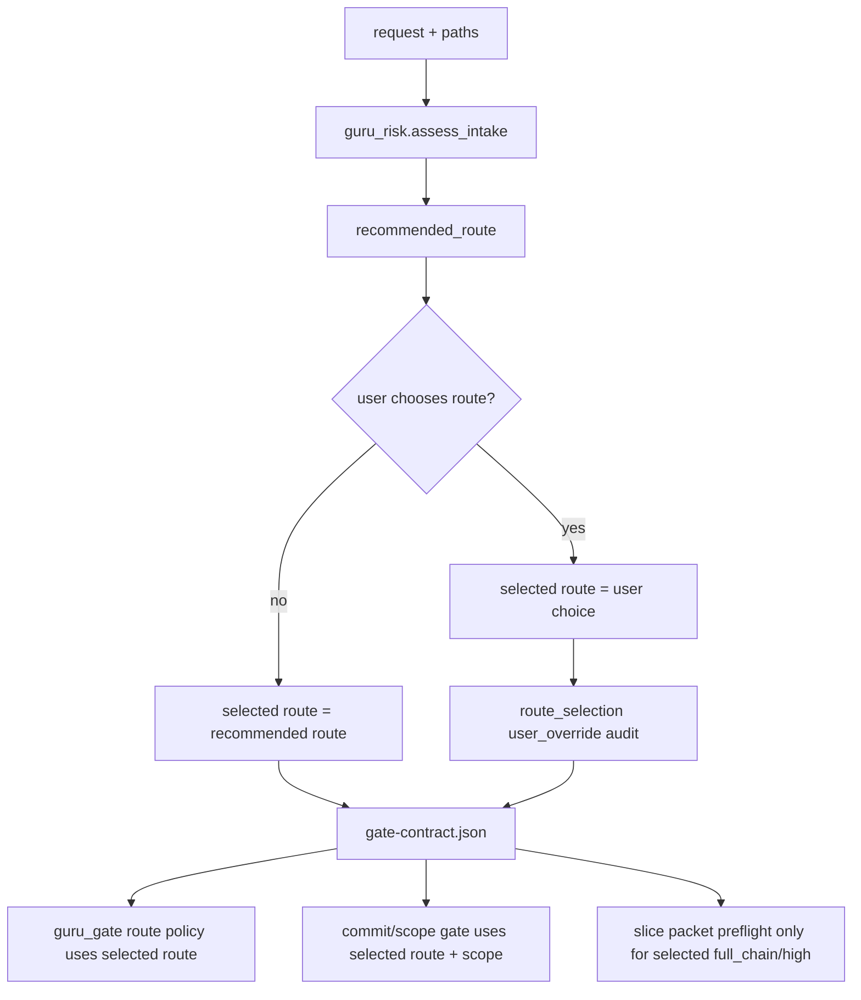

# 允许用户覆盖 Guru 风险路由建议设计

## 1. Architecture Summary

本任务不重写 risk classifier。核心调整是把当前单字段 `route` 的语义拆清：

- `risk`: 系统识别的风险等级。
- `recommended_route`: 系统根据风险推荐的路线。
- `route`: 兼容现有 runtime 的实际执行路线，等价于 `selected_route`。
- `route_selection`: 新增审计块，记录 route 来源、推荐值、用户覆盖和风险确认。

保持 `gate-contract.json` 为 runtime SSOT。`guru_risk.py` 仍可对 high-risk work 推荐 `full_chain`；但 `guru_contract.py`、`guru_gate.py` 和 `guru_supervise.py` 必须按合同中的实际 `route` 执行。

## 2. Contract Shape

`gate-contract.json` 新增兼容字段：

```json
{
  "schema_version": 1,
  "risk": "high",
  "route": "lite_task",
  "assessment": {
    "confidence": 0.95,
    "reasons": ["high-risk signal: permission"],
    "risk_flags": ["permission"],
    "recommended_route": "full_chain"
  },
  "route_selection": {
    "selected_route": "lite_task",
    "source": "user_override",
    "recommended_route": "full_chain",
    "risk_acknowledged": true,
    "user_quote": "走 lite",
    "selected_by": "user",
    "selected_at": "2026-07-02T00:00:00Z"
  }
}
```

Compatibility rule: older contracts without `route_selection` keep current behavior except the hard `risk=high && route!=full_chain` validator must be removed. For a high-risk non-full route to count as a deliberate user override, runtime should require either `route_selection.source=user_override` with `risk_acknowledged=true` and non-empty `user_quote`, or an equivalent legacy manual field if already present in a target project.

## 3. Affected Units

| Unit | Files | Change |
| --- | --- | --- |
| Contract schema and validator | `guru_contract.py` | Add route-selection helpers; stop rejecting high-risk non-full route when user override audit is present; keep structural validation strict. |
| Init contract writer | `guru_gate.py cmd_init_contract` | Accept optional override metadata flags or derive route selection from options; write `assessment.recommended_route` and `route_selection`. |
| Review policy | `guru_gate.py _contract_route_for_review_policy` | Return actual selected `route` for high-risk non-full user overrides so lite/micro policies apply. |
| Implementation packet preflight | `guru_risk.full_chain_packet_required`, `guru_gate.py`, `guru_supervise.py` | Require slice packets only when selected route is `full_chain` and risk is high. |
| Commit/scope gate | `guru_contract.validate_commit_contract`, `guru_gate.py` stage planning helpers | Stop treating high-risk path signal alone as a block for a user-overridden non-full route; still block scope, max file, forbidden pattern, task artifacts, missing evidence, and malformed contract. |
| After-create default | `guru_after_create.py` | Reword default as conservative recommendation and keep it explicitly overridable. |
| Skill/spec text | `client-small-iteration-dev/SKILL.md`, `.trellis/spec/cli/backend/guru-overlay-gates.md` | Replace hard “must full / cannot downgrade” wording with recommendation + user override wording. |
| Tests | `verify/tests/run_tests.sh` | Replace high-risk downgrade rejection expectations with positive override fixtures plus missing-override negative fixtures. |

## 4. Validation Rules

Still fail closed:

- malformed JSON or non-object root
- raw risk typo
- unknown route string
- `small_inline` as commit contract
- `micro_task` missing explicit non-root `scope.allowed_paths`
- `micro_task` missing positive `scope.max_files`
- missing required route-selection audit for high-risk non-full selected routes
- current blocked / malformed / medium+ review evidence
- staged paths outside selected route scope
- staged task/workspace artifacts in implementation commit

No longer fail closed:

- `risk=high` with `route=lite_task` when route-selection audit records user override and risk acknowledgement
- `risk=high` with `route=micro_task` when route-selection audit is valid and micro scope/max-files are valid
- non-full route touching high-risk path signals when the staged paths are inside the confirmed scope and selected route gates pass

## 5. Data Flow



## 6. Rollout / Rollback

Rollout is source-template first:

1. Update `packages/cli/src/templates/guru/overlay/**`.
2. Mirror to `guru-template/overlay/**`.
3. Update `.trellis/spec/cli/backend/guru-overlay-gates.md`.
4. Run overlay verify tests and source/template mirror diff.

Rollback is file-level: revert contract validator, gate policy, skill/spec wording, and test fixture changes. Existing full-chain contracts remain compatible because selected `route=full_chain` behavior is unchanged.

## 7. Non-Goals

- Do not make unknown arbitrary route names valid.
- Do not let `small_inline` become a commit contract.
- Do not weaken full-chain strict behavior when selected route is `full_chain`.
- Do not treat route override as `gate-degradations.jsonl`; this is not a tool failure bypass.
- Do not bypass current blocked/medium+ review evidence.
