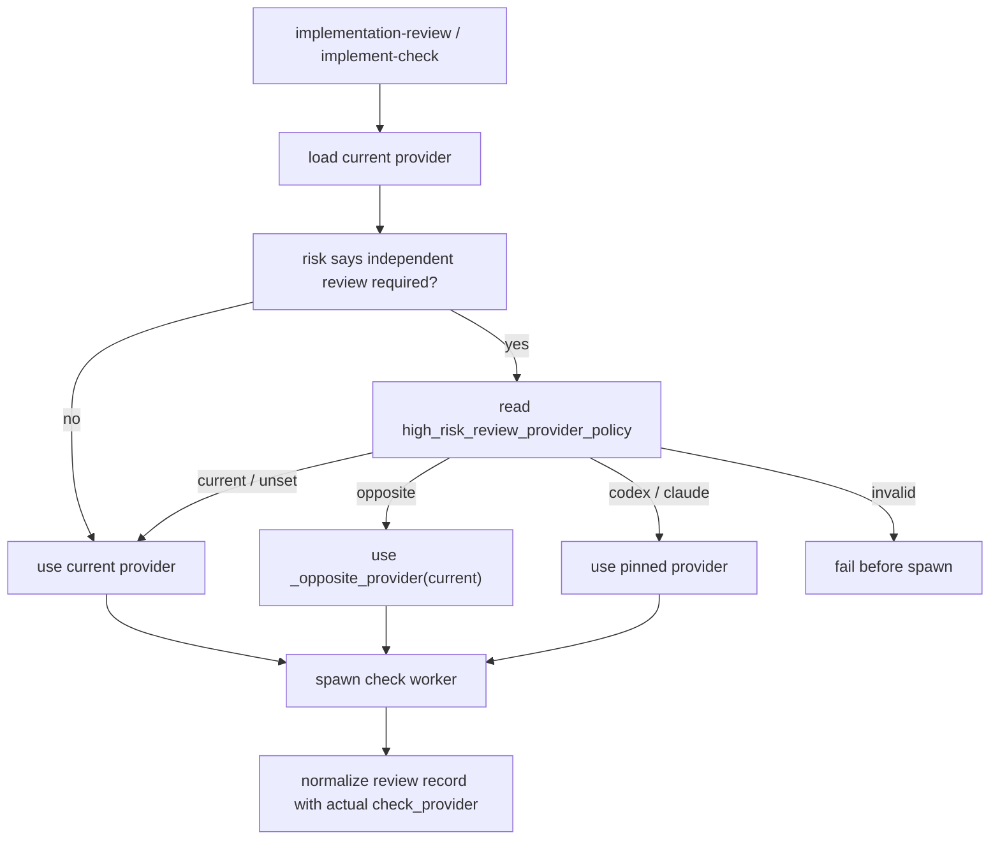

# Configure high-risk slice review provider design

## §1 概要设计

### 1.1 Design Summary

Add a single Guru supervision policy:

```yaml
guru:
  supervision:
    high_risk_review_provider_policy: current
```

Allowed values:

| value | meaning |
| --- | --- |
| `current` | Default. High-risk independent implementation review uses the current configured provider. |
| `opposite` | Preserve old behavior. `codex -> claude`, `claude -> codex`. |
| `codex` | Pin high-risk review workers to Codex. |
| `claude` | Pin high-risk review workers to Claude. |

This policy only controls high-risk independent implementation review provider resolution. It does not change whether an independent review is required, whether a slice packet is required, or whether `--adversarial` is skipped by `adversarial_enabled=false`.

### 1.2 行为 owner 归属表

| Behavior | Owner | Rationale |
| --- | --- | --- |
| BHV-001, BHV-002, BHV-003, BHV-004 | `guru_supervise.py` | 为什么属于它：provider selection happens while building channel run plans. 为什么不属于别人：`guru_risk.py` decides whether review is required, not which provider to spawn. 是否需独立存在：yes, one resolver is shared by `implement-check` and `implementation-review`. |
| BHV-005 | `guru_supervise.py` | 为什么属于它：`--adversarial` skip and high-risk review policy share config loading but must remain separate branches. 为什么不属于别人：`guru_gate.py` only reads evidence state. 是否需独立存在：yes, to prevent conflating adversarial skip with implementation-review policy. |
| BHV-006 | `guru_review_record.py` | 为什么属于它：required evidence validation owns whether a same-provider high-risk review can satisfy the gate. 为什么不属于别人：the worker output parser must validate actual `check_provider`. 是否需独立存在：yes, commit evidence must remain tamper-resistant. |
| BHV-007 | `guru_config_patch.py`, `packages/cli/src/commands/guru.ts`, config snippets, README | 为什么属于它：install/default/preserve behavior belongs to overlay application and documentation. 为什么不属于别人：runtime resolver cannot update target configs. 是否需独立存在：yes, downstream installs must get the same default. |

### 1.3 Flow



### 1.4 详细设计承接索引

| chapter_target | doc_type | 承接行为 | owner |
| --- | --- | --- | --- |
| `design.md#UNIT-provider-policy-config` | config-contract | BHV-001, BHV-002, BHV-003, BHV-004 | `guru_supervise.py` |
| `design.md#UNIT-provider-resolution` | runtime-control-flow | BHV-001, BHV-002, BHV-003, BHV-004, BHV-005 | `guru_supervise.py` |
| `design.md#UNIT-review-record-validation` | evidence-contract | BHV-006 | `guru_review_record.py` |
| `design.md#UNIT-config-install` | template-install | BHV-007 | `guru_config_patch.py`, CLI apply command, config snippets |
| `design.md#UNIT-tests` | validation | BHV-001 through BHV-007 | overlay verify tests |

### 1.5 Compatibility

- Existing configs without the field behave with the new default `current`.
- Projects that depend on old cross-LLM high-risk review can opt in with `opposite`.
- Existing `adversarial_enabled` behavior stays byte-for-byte semantically scoped to `--adversarial` review.
- Existing low-risk `semantic_review_provider: {provider: opposite, required: false}` records stay valid.
- Required `semantic_review_provider: opposite` should remain fail-closed if same-provider policy is selected, because that packet explicitly requires opposite evidence.

### 1.6 Template Sync

The implementation must update all live/template copies that are committed in this repo:

- `.trellis/scripts/guru/*` dogfood runtime, only as needed for verification.
- `guru-template/overlay/verify/*`.
- `guru-template/overlay/agents-skills/*implementation-guru-review/SKILL.md` when their provider instructions mention required evidence.
- `guru-template/workflows/guru-*-workflow.md` and `guru-template/specs/*/harness/{index.md,gate/gate-confirmation-model.md}` when their implementation-review/provider text changes.
- `packages/cli/src/templates/guru/overlay/verify/*`.
- `packages/cli/src/templates/guru/overlay/agents-skills/*implementation-guru-review/SKILL.md`, workflow templates, and matching Guru harness specs when applicable.
- `packages/cli/dist/templates/guru/overlay/verify/*` if generated assets are committed or build updates them.
- `packages/cli/dist/templates/guru/overlay/agents-skills/*implementation-guru-review/SKILL.md`, workflow templates, and matching Guru harness specs when applicable.
- Config snippets and README in `guru-template` and CLI templates.

### 1.7 Rollback

Rollback is local to provider policy resolution and config defaulting. Reverting the new field should restore old hard-coded provider selection only if the policy branch is removed; existing configs with the new field should fail harmlessly as unknown unused YAML to older scripts.

## §2 详细设计

### 1. 单元职责

| UNIT | 职责 | 依赖关系 | 承接行为 |
| --- | --- | --- | --- |
| UNIT-provider-policy-config | 读取并校验 `guru.supervision.high_risk_review_provider_policy`，为未配置项目提供 `current` 默认值。 | 读取 `.trellis/config.yaml`；不决定风险、slice packet 或 worker 输出格式。 | BHV-001, BHV-002, BHV-003, BHV-004, BHV-005 |
| UNIT-provider-resolution | 在 `implement-check` 与 `implementation-review` 建立 worker plan 时，根据独立审查原因解析实际 `check_provider`。 | 调用 `guru_risk.implement_check_independent_required()` 的结论；不改写 packet 语义合同。 | BHV-001, BHV-002, BHV-003, BHV-004, BHV-005 |
| UNIT-review-record-validation | 校验 required implementation review 记录是否与 supervisor 实际派发 provider 一致，并决定 same-provider required evidence 是否可接受。 | 读取 supervisor context、worker output、slice packet semantic review contract；不负责 spawn worker。 | BHV-006 |
| UNIT-dogfood-template-parity | 让 `.trellis/scripts/guru/guru_supervise.py` 与 `guru-template`/CLI src/dist 在 `implementation-review` provider-policy 行为上保持一致。 | 以 template runtime 的 check-only implementation-review path 为参考；不改变 task/gate policy 本身。 | BHV-001, BHV-006, BHV-007 |
| UNIT-config-install | 在 overlay 安装/刷新时默认写入并保留 `high_risk_review_provider_policy`，同步 README 与 config snippet。 | 使用 `guru_config_patch.py` 默认补丁；不覆盖目标项目显式配置。 | BHV-007 |
| UNIT-tests | 覆盖 provider policy、invalid config、same-provider record validation、semantic opposite fail-closed 与模板同步。 | 复用 overlay verify test harness；不新增外部依赖。 | BHV-001, BHV-002, BHV-003, BHV-004, BHV-005, BHV-006, BHV-007 |

#### UNIT-provider-policy-config

承接行为：BHV-001, BHV-002, BHV-003, BHV-004, BHV-005。测试映射：见 §7。

#### UNIT-provider-resolution

承接行为：BHV-001, BHV-002, BHV-003, BHV-004, BHV-005。测试映射：见 §7。

#### UNIT-review-record-validation

承接行为：BHV-006。测试映射：见 §7。

#### UNIT-dogfood-template-parity

承接行为：BHV-001, BHV-006, BHV-007。测试映射：见 §7。

#### UNIT-config-install

承接行为：BHV-007。测试映射：见 §7。

#### UNIT-tests

承接行为：BHV-001, BHV-002, BHV-003, BHV-004, BHV-005, BHV-006, BHV-007。测试映射：见 §7。

### 2. 行为定义

#### 2.1 行为清单

| 行为 | 简述 | 承接 BHV |
| --- | --- | --- |
| ResolveDefaultCurrentProvider | 未配置新字段时，高风险 slice required review 继续使用当前 provider 的 check subagent/review worker。 | BHV-001 |
| ResolveOppositeProvider | 显式配置 `opposite` 时恢复旧行为：`codex -> claude`、`claude -> codex`。 | BHV-002 |
| ResolvePinnedProvider | 显式配置 `codex` 或 `claude` 时固定 high-risk check worker provider；若 raw packet 显式 required provider 与 pinned policy 冲突，则 fail closed。 | BHV-003 |
| RejectInvalidPolicy | 配置值不在允许集合内时，在 channel worker spawn 前失败。 | BHV-004 |
| KeepAdversarialSeparate | `adversarial_enabled=false` 只影响 `--adversarial`，不跳过 high-risk implementation review。 | BHV-005 |
| AcceptSameProviderRequiredEvidence | 仅在 supervisor context 显式允许且 packet 未要求 opposite 时，接受 same-provider required clean review。 | BHV-006 |
| PreserveDogfoodTemplateParity | dogfood `.trellis` runtime 与 template/CLI copies 在 `implementation-review` provider policy 上一致。 | BHV-001, BHV-006, BHV-007 |
| InstallPolicyDefault | `trellis guru apply` 默认补齐该配置并保留已有显式值，同时文档暴露允许值。 | BHV-007 |

#### 2.2 接口定义

```python
HIGH_RISK_REVIEW_PROVIDER_POLICIES = {"current", "opposite", "codex", "claude"}
DEFAULT_HIGH_RISK_REVIEW_PROVIDER_POLICY = "current"

def _high_risk_review_provider_policy(root: Path) -> str: ...
def _implementation_review_check_config(
    root: Path,
    config: GuruSupervisionConfig,
    *,
    independent_required: bool,
    independent_reason: str,
    packet_context: dict[str, object] | None = None,
) -> tuple[GuruSupervisionConfig, dict[str, object]]: ...
```

`guru_review_record.normalize_review_record()` 继续接收 worker 输出和 context；context 新增 supervisor 允许信号，例如 `same_provider_required_allowed` 与 `semantic_review_provider_required`，用于 required evidence 判定。

### 3. 核心数据结构

#### 3.1 配置模型

| 字段 | 类型 | 取值域 | 默认 | owner |
| --- | --- | --- | --- | --- |
| `guru.supervision.high_risk_review_provider_policy` | string | `current`, `opposite`, `codex`, `claude` | `current` | UNIT-provider-policy-config |
| `guru.supervision.adversarial_enabled` | boolean | `true`, `false` | 既有默认 | 既有 adversarial 分支 |

#### 3.2 Supervisor context

| 字段 | 类型 | 语义 | producer | consumer |
| --- | --- | --- | --- | --- |
| `check_provider` | string | 实际派发的 check worker provider。 | UNIT-provider-resolution | UNIT-review-record-validation |
| `high_risk_review_provider_policy` | string | 解析后的策略值。 | UNIT-provider-resolution | review record normalization / debug output |
| `same_provider_required_allowed` | boolean | 当前 required review 是否允许 same-provider evidence。 | UNIT-provider-resolution | UNIT-review-record-validation |
| `semantic_review_provider_explicit` | boolean | raw packet 是否显式声明 `semantic_review_provider`。 | slice packet loader / UNIT-provider-resolution | UNIT-review-record-validation |
| `semantic_review_provider_required` | boolean | packet 是否显式要求 semantic provider。 | slice packet loader / UNIT-provider-resolution | UNIT-review-record-validation |
| `semantic_review_provider` | string | packet 要求的 semantic provider，例如 `opposite`。 | slice packet loader | UNIT-review-record-validation |
| `review_target_kind` | string | `slice` 或 `staged`，用于区分 high-risk slice policy 与 staged synthetic packet。 | UNIT-provider-resolution | UNIT-review-record-validation / tests |

#### 3.3 错误类型表

| 错误名 | 错误码/枚举 | 语义 | 上抛/收口位置 |
| --- | --- | --- | --- |
| InvalidHighRiskReviewProviderPolicy | `CONFIG_INVALID` | 配置值不在 `current|opposite|codex|claude`。 | `_high_risk_review_provider_policy()` 抛 `GuruSupervisionError`，命令退出前不 spawn worker。 |
| RequiredOppositeProviderUnsatisfied | `PROVIDER_MISMATCH` | packet 要求 opposite(required=true)，但实际 check provider 与 implement provider 相同。 | `guru_review_record.normalize_review_record()` fail closed。 |
| RequiredProviderPolicyConflict | `CONFIG_CONFLICT` | raw packet 显式 required provider 与 `high_risk_review_provider_policy` 的 pinned/opposite/current 解析结果冲突。 | UNIT-provider-resolution 在 spawn 前 fail closed；若历史记录绕过 resolver，则 UNIT-review-record-validation fail closed。 |
| ImplicitSemanticProviderDefault | `MALFORMED_REVIEW_OUTPUT` prevention | raw packet 缺 `semantic_review_provider` 时不得被 normalization 当作显式 opposite(required=true)。 | UNIT-provider-resolution 传 `semantic_review_provider_explicit=false`，UNIT-review-record-validation 按无显式语义要求处理。 |
| WorkerProviderMismatch | `PROVIDER_MISMATCH` | worker 输出的 `review_provider` 与 supervisor 实际 `check_provider` 不一致。 | `guru_review_record.normalize_review_record()` fail closed。 |

### 4. 逐行为设计（每个行为一小节）

#### 4.1 ResolveDefaultCurrentProvider

- 承接行为：BHV-001。
- 输入参数表：

| 参数 | 类型 | 取值域/约束 | 必填 |
| --- | --- | --- | --- |
| `config.provider` | string | 当前 Guru supervision provider。 | yes |
| `independent_required` | bool | high-risk slice required review 为 true。 | yes |
| `high_risk_review_provider_policy` | string | 缺省或显式 `current`。 | no |

- 输出表：

| 返回值/发射值 | 类型 | 语义 |
| --- | --- | --- |
| `check_provider` | string | 等于 `config.provider`。 |
| `same_provider_required_allowed` | bool | true，前提是 packet 未显式要求 opposite required。 |

- 执行流程：读取配置；未配置时落到 `current`；检查 raw packet 是否显式声明 `semantic_review_provider`；若缺失或 `required=false`，返回当前 provider 并写入 `same_provider_required_allowed=true` 与 `semantic_review_provider_explicit=false`；若显式 opposite(required=true)，转入 `ResolveOppositeProvider` 的 packet-contract 分支。
- 失败收口：配置文件不可读按既有默认读取语义处理；配置值无效交给 `RejectInvalidPolicy`。

#### 4.2 ResolveOppositeProvider

- 承接行为：BHV-002。
- 输入参数表：`config.provider` 为 `codex|claude`，policy 为 `opposite`。
- 输出表：`check_provider` 为 `_opposite_provider(config.provider)`；`same_provider_required_allowed=false`。
- 执行流程：如果 raw packet 显式 `semantic_review_provider: {provider: opposite, required: true}`，packet contract 优先，强制 `_opposite_provider()`，并写入 `same_provider_required_allowed=false`；如果独立审查只来自 high-risk policy 且配置为 `opposite`，调用 `_opposite_provider()`；返回旧行为。
- 失败收口：provider 非支持值时沿用既有 provider 校验错误。

#### 4.3 ResolvePinnedProvider

- 承接行为：BHV-003。
- 输入参数表：policy 为 `codex` 或 `claude`。
- 输出表：`check_provider` 等于 policy；`same_provider_required_allowed` 仅在 pinned provider 等于 implement provider 且 packet 未要求 opposite 时为 true。
- 执行流程：不调用 `_opposite_provider()`；直接复制 config 并替换 provider 字段；context 记录 policy。若 raw packet 显式要求另一个 provider 且 `required=true`，必须在 spawn 前以 `RequiredProviderPolicyConflict` fail closed；不得自动改用 packet-required provider，也不得让 pinned policy 覆盖显式 packet requirement。
- 失败收口：pinned provider 之外的值交给 `RejectInvalidPolicy`。

#### 4.4 RejectInvalidPolicy

- 承接行为：BHV-004。
- 输入参数表：原始 YAML 值，允许字符串或缺省；非字符串或未知字符串均无效。
- 输出表：无 worker plan；命令返回非 0。
- 执行流程：trim + lowercase；检查允许集合；失败时抛 `GuruSupervisionError`，错误文案包含字段名、实际值、允许值。
- 失败收口：必须在 `trellis channel spawn` 或 worker plan 执行前收口。

#### 4.5 KeepAdversarialSeparate

- 承接行为：BHV-005。
- 输入参数表：`adversarial_enabled=false` 与 high-risk provider policy。
- 输出表：`--adversarial` review 可跳过；`implement-check` / `implementation-review` 仍按 high-risk policy 产生 check worker。
- 执行流程：保留 adversarial 分支读取 `adversarial_enabled`；implementation review 分支只读取 `high_risk_review_provider_policy`。
- 失败收口：如果发现 high-risk review 被 adversarial flag 跳过，测试归类为 `IMPLEMENT_DEFECT`。

#### 4.6 AcceptSameProviderRequiredEvidence

- 承接行为：BHV-006。
- 输入参数表：worker output、`implement_provider`、`check_provider`、supervisor context、slice packet raw semantic review contract。
- 输出表：normalized clean review record 或 fail-closed diagnostic。
- 执行流程：先校验 worker output `review_provider == check_provider`；再按 raw packet 合同判断：
  - `semantic_review_provider_explicit=false`：无 packet-level provider requirement，same-provider required evidence 可由 high-risk policy context 接受。
  - `semantic_review_provider.required=false`：不强制 provider，但仍要求 actual 等于 supervisor `check_provider`。
  - 显式 `provider=opposite, required=true`：`actual == implement_provider` 必须 blocked。
  - 显式 `provider=codex|claude, required=true`：`actual` 必须等于 pinned provider。
  - 通过 provider gate 后再检查 deterministic checks 与 invariant aggregation。
- 失败收口：缺少 required context、显式 packet provider 未满足、worker provider mismatch 任一出现都不得算 required clean evidence。

#### 4.7 InstallPolicyDefault

- 承接行为：BHV-007。
- 输入参数表：目标 `.trellis/config.yaml`、overlay config snippets、README/template copies。
- 输出表：目标 config 缺字段时新增 `high_risk_review_provider_policy: current`；已有值不覆盖。
- 执行流程：在 `guru_config_patch.DEFAULTS` 增加默认项；同步 `guru-template`、CLI src template、dist template 的说明文本；用 `rg` 核验 workflow templates、implementation review skills、Guru harness gate/spec docs 中的旧 opposite-provider 文案，必要时更新。
- 失败收口：模板/运行时 drift 通过 verify tests 或 `diff -q` 暴露，不能默默忽略。

#### 4.8 ResolveStagedImplementationReview

- 承接行为：BHV-001, BHV-006。
- 输入参数表：`implementation-review --staged` 或 `--contract`，且没有 `--slice`。
- 输出表：使用现有 staged synthetic packet：`review_target=staged:index`、`digest_source=index`、`deterministic_checks=["git diff --cached --check"]`、非空 `invariants`、显式 `semantic_review_provider={provider: "opposite", required: true}`。
- 执行流程：不从 high-risk slice policy 推导 provider；按 staged synthetic packet 的显式 semantic provider contract 走 required opposite evidence。若未来要让 staged review 默认 current，必须新增独立需求和配置，不能复用本任务的 high-risk slice policy 偷改。
- 失败收口：staged paths 缺失、contract invalid、只有 task artifacts、synthetic packet 无 invariants 时写 preflight failure 或阻断，不得补造 clean required evidence。

#### 4.9 PreserveDogfoodTemplateParity

- 承接行为：BHV-001, BHV-006, BHV-007。
- 输入参数表：`.trellis/scripts/guru/guru_supervise.py` dogfood runtime、`guru-template/overlay/verify/guru_supervise.py`、CLI src/dist template copies。
- 输出表：四个 runtime/copy 至少在 `implementation-review` action、`_implementation_review_check_config()` resolver、slice target、staged synthetic packet、dry-run provider output、review-record context 字段上语义一致。
- 执行流程：以 template/CLI copy 中已有 `implementation-review` check-only path 为基线，把缺失能力 port 到 dogfood runtime，然后在同一 provider-policy patch 中同步四份文件。若发现 dogfood parity 需要大范围重构，必须先停止并更新计划，不能让 dogfood runtime 保持旧行为。
- 失败收口：`python3 .trellis/scripts/guru/guru_supervise.py --help` 不含 `implementation-review`、dogfood dry-run 无法覆盖 `implementation-review --slice`、或 dogfood/template provider resolver drift，均视为本任务 blocker。

### 5. 状态/边界管理

| 状态/边界 | owner | 读 | 写 | 边界规则 |
| --- | --- | --- | --- | --- |
| `.trellis/config.yaml` provider policy | UNIT-provider-policy-config / UNIT-config-install | runtime resolver、installer | installer 只补缺省 | 不覆盖显式值。 |
| slice packet semantic review provider | slice packet owner | provider resolver、record validator | 本任务不写 | `required=true` 的 opposite 语义优先 fail-closed。 |
| review records | UNIT-review-record-validation | gates / status | implementation-review command | same-provider acceptance 必须来自 supervisor context。 |
| staged synthetic review packet | UNIT-provider-resolution / existing staged target builder | implementation-review staged path | existing staged target builder | 无 `--slice` 时不使用 high-risk slice policy；显式 opposite(required=true) 仍硬约束。 |
| dogfood runtime parity | UNIT-dogfood-template-parity | dogfood `.trellis` runtime / template copies | implementation patch | dogfood runtime 不得缺少本任务验收覆盖的 `implementation-review` provider-policy path。 |
| adversarial skip state | 既有 adversarial branch | gates / status | 本任务不改写 | 与 high-risk implementation review policy 分离。 |

### 6. 数据合同（类型专属章节）

本任务的 detail_doc_type 为 `config-contract`、`runtime-control-flow`、`evidence-contract`、`template-install`、`validation`：

| doc_type | UNIT | 专属约束 |
| --- | --- | --- |
| `config-contract` | UNIT-provider-policy-config | 配置解析必须有默认值、允许集合、invalid fail-closed。 |
| `runtime-control-flow` | UNIT-provider-resolution | worker provider 决策必须发生在 spawn 前，dry-run 可观察。 |
| `evidence-contract` | UNIT-review-record-validation | record 接受条件必须绑定 actual check provider 和 supervisor context。 |
| `template-install` | UNIT-config-install | source/template/dist 文档和默认配置保持同步。 |
| `validation` | UNIT-tests | 每个 BHV 至少一个成功或失败路径测试。 |

### 7. 测试映射

| BHV/行为 | 测试层 | 测试点 |
| --- | --- | --- |
| BHV-001 ResolveDefaultCurrentProvider | shell regression | unset/default policy 下 `implement-check --slice --dry-run` 和 `implementation-review --slice --dry-run` 都产生当前 provider，例如 `check-codex`；`implementation-review --staged/--contract --dry-run` 无 `--slice` 时仍按 staged synthetic packet 的 explicit opposite contract。 |
| BHV-002 ResolveOppositeProvider | shell regression | `opposite` 下 `implement-check` 与 `implementation-review` 都保留 codex→claude、claude→codex。 |
| BHV-003 ResolvePinnedProvider | shell regression | policy 为 `codex` / `claude` 时 slice-backed `implement-check` 与 `implementation-review` 的实际 check provider 精确等于配置；显式 packet required provider 冲突时 fail closed。 |
| BHV-004 RejectInvalidPolicy | shell regression | unknown policy 在 spawn 前非 0，stderr 含字段名与允许值。 |
| BHV-005 KeepAdversarialSeparate | shell regression | `adversarial_enabled=false` 时 `implement-check` 与 `implementation-review` 仍计划 check worker。 |
| BHV-006 AcceptSameProviderRequiredEvidence | Python unit snippet / shell regression | 缺 `semantic_review_provider` + default current + context 的 same-provider clean required review 被接受；显式 opposite(required=true)、缺 context、worker provider mismatch 被拒绝。 |
| BHV-007 InstallPolicyDefault / PreserveDogfoodTemplateParity | shell regression / template diff | `guru_config_patch.py` 补默认且保留显式值；README/config snippets/template copies/workflow/spec/implementation-review skill 文案同步；dogfood `guru_supervise.py --help` 暴露 `implementation-review`；dogfood/template/CLI copies 的 provider-policy behavior 同步；`pnpm -C packages/cli sync:guru:check` 通过。 |

### 8. 不得补造清单

- 不得把 `adversarial_enabled=false` 解释为“禁用所有其他 LLM 或所有审查”。
- 不得改写 `guru_risk.implement_check_independent_required()` 的职责来隐藏 provider policy。
- 不得让 same-provider review 满足 `semantic_review_provider: {provider: opposite, required: true}`。
- 不得把缺失的 `semantic_review_provider` normalize 成显式 opposite(required=true)，否则默认 `current` 策略无法满足 required evidence。
- 不得只覆盖 `implement-check`，漏掉 commit evidence 使用的 `implementation-review` check-only 路径。
- 不得让 dogfood `.trellis/scripts/guru/guru_supervise.py` 缺少本任务要求的 `implementation-review` provider-policy path，同时声称 template/CLI 已经 clean。
- 不得在 worker 输出中信任自报 provider 覆盖 supervisor 实际派发 provider。
- 不得只改 dogfood `.trellis/scripts/guru/*` 而漏掉 `guru-template`、CLI src template、dist template。
- 不得新增需要联网或非标准库 Python 依赖的 overlay verify 逻辑。

### 9. 不变量矩阵

| invariant_id | rule | owner | negative_case | route_if_missing |
| --- | --- | --- | --- | --- |
| HRP-INV-001 | `adversarial_enabled=false` must not disable high-risk implementation review. | `guru_supervise.py` | High-risk review is skipped entirely because adversarial is disabled. | `IMPLEMENT_DEFECT` |
| HRP-INV-002 | Default high-risk policy must not spawn the opposite provider. | `guru_supervise.py` | Codex default still creates `check-claude`. | `IMPLEMENT_DEFECT` |
| HRP-INV-003 | Required packet-level opposite evidence must not be silently satisfied by same-provider review. | `guru_review_record.py` | `semantic_review_provider.opposite(required=true)` accepts Codex-on-Codex clean. | `IMPLEMENT_DEFECT` |
| HRP-INV-004 | Invalid config values must fail before worker spawn. | `guru_supervise.py` | Unknown policy falls back to `current` silently. | `PROCESS_DEFECT` |
| HRP-INV-005 | Missing `semantic_review_provider` is not explicit opposite(required=true). | `guru_review_record.py` | Default current same-provider clean is blocked only because the field was absent. | `IMPLEMENT_DEFECT` |
| HRP-INV-006 | `implementation-review` and `implement-check` use the same provider resolver. | `guru_supervise.py` | `implement-check` uses current but `implementation-review --slice` still flips opposite. | `IMPLEMENT_DEFECT` |
| HRP-INV-007 | Non-slice staged implementation review keeps its explicit packet contract. | `guru_supervise.py` | `implementation-review --staged` silently uses high-risk slice policy and weakens explicit opposite required evidence. | `IMPLEMENT_DEFECT` |
| HRP-INV-008 | Dogfood runtime exposes the same provider-policy path as template runtime. | `.trellis/scripts/guru/guru_supervise.py` | Template supports `implementation-review --slice` but dogfood runtime has no such action. | `PROCESS_DEFECT` |
