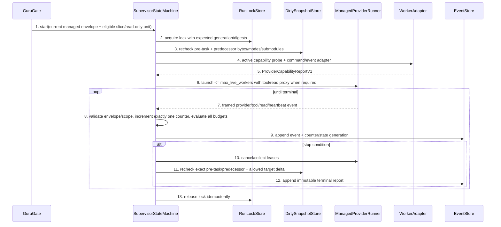

# Bounded Supervisor Detailed Design

> `doc_type=controller` | `l2_status=v1`
> `chapter_status=ready_for_review_after_migration_exception`
> Overview owner: design-main §4 UNIT-bounded-supervisor | TECH-006

### UNIT-bounded-supervisor

## 1. 单元职责

承接 BHV-001、BHV-003、BHV-006。唯一拥有 managed run id、previous/current run、run lock、legal transition、ManagedProviderRunner lease、observed budget counters、typed pre-task/predecessor snapshots、semantic progress、terminal idempotence 和 cleanup report。它消费 route-specific ExecutionEnvelope/selected slice，以及 writable Full 路径中 StartGuard 产生的 verified guarded result或本任务一次性 audited bootstrap result；read-only managed envelope 不调用 implementation StartGuard。它不改变 policy/Gate/confirmation，不把预算当绕过理由。Official `task.py start`、StartGuard、host-inline turn 和 current `implement-slices` dispatch report 都不创建 Supervisor run。

正向依赖：RunLockStore、ManagedProviderRunner、provider-specific WorkerAdapter、MonotonicClock、EventStore、DirtySnapshotStore、ContextPlanner。反向禁止：worker/adapter 不可写 Supervisor state、改变 envelope 或自报 capability；Supervisor 不可 record-review/confirm 或修改已确认 planning artifacts。

## 2. 行为定义

### 2.1 接口定义

```python
class RunState(str, Enum):
    PLANNED = "planned"
    RUNNING = "running"
    PROGRESSED = "progressed"
    DONE = "done"
    STALLED = "stalled"
    BUDGET_EXCEEDED = "budget_exceeded"
    SCOPE_EXPANDED = "scope_expanded"
    ERROR = "error"
    KILLED = "killed"

class SupervisorStateMachine(Protocol):
    def start(self, request: "RunRequest", expected_lock_generation: int) -> "RunSnapshot": ...
    def record_event(self, run_id: str, event: "ProgressEvent", expected_generation: int) -> "RunSnapshot": ...
    def transition(self, run_id: str, target: RunState, reason: str, expected_generation: int) -> "RunSnapshot": ...
    def finalize(self, run_id: str, expected_generation: int) -> "TerminalReport": ...
    def cancel(self, run_id: str, reason: str, expected_generation: int) -> "TerminalReport": ...

class WorkerAdapter(Protocol):
    def probe(self) -> "ProviderCapabilityReportV1": ...
    def build_command(self, request: "WorkerLaunchRequest") -> tuple[str, ...]: ...
    def translate_event(self, raw: bytes) -> "ProviderEventV1": ...

class ManagedProviderRunner(Protocol):
    def launch(self, request: "WorkerLaunchRequest", adapter: WorkerAdapter) -> "WorkerLease": ...
    def next_event(self, lease: "WorkerLease", deadline_monotonic_ns: int) -> "ProviderEventV1": ...
    def cancel(self, lease: "WorkerLease", reason: str) -> "WorkerExit": ...
    def collect(self, lease: "WorkerLease") -> "WorkerExit": ...
```

### 2.2 合法 transition table

| From | Allowed to | Required evidence |
| --- | --- | --- |
| planned | running, killed, error | current route-specific envelope + selected packet when required + verified guarded/bootstrap result only when StartGuard is required + Supervisor lock + capability/dirty snapshot recheck |
| running | progressed, stalled, budget_exceeded, scope_expanded, error, killed, done | worker event or deterministic stop condition |
| progressed | progressed, done, stalled, budget_exceeded, scope_expanded, error, killed | new semantic delta or stop condition |
| any terminal | same terminal only | idempotent replay with same terminal digest |

Terminal states are `done/stalled/budget_exceeded/scope_expanded/error/killed`; terminal→different state and terminal→running are illegal. Resume creates a new run id after external preconditions, never reopens old run.

## 3. 核心数据结构

```python
@dataclass(frozen=True)
class RunSnapshot:
    run_id: str
    task_id: str
    slice_id: str
    state: RunState
    generation: int
    envelope_digest: str
    topology: Literal["managed_single", "managed_parallel"]
    scope_fingerprint: str
    pre_task_dirty_snapshot_digest: str
    verified_predecessor_snapshot_digest: str
    gate_digest: str
    started_monotonic_ns: int
    deadline_monotonic_ns: int
    last_semantic_progress_ns: int
    counters: "BudgetCountersV1"
    live_worker_ids: tuple[str, ...]

@dataclass(frozen=True)
class BudgetCountersV1:
    active_runtime_ns: int
    model_cycles: int
    tool_calls: int
    wait_calls: int
    observed_context_bytes: int | None
    duplicate_reads: int | None
    repairs: int
    started_workers: int
    confirmation_batches: int
    consecutive_no_progress_cycles: int

@dataclass(frozen=True)
class SupervisorEventV1:
    event_id: str
    worker_id: str | None
    kind: Literal["model_cycle_started", "model_cycle_completed", "tool_call", "wait_call", "context_read", "repair_started", "worker_started", "worker_heartbeat", "worker_stopped", "business_diff", "test_delta", "risk_closed", "artifact_semantic_delta", "decision", "first_value", "log"]
    evidence_digest: str
    scope_fingerprint: str
    monotonic_ns: int

@dataclass(frozen=True)
class FileImageV1:
    kind: Literal["missing", "regular", "symlink", "gitlink"]
    mode: int | None
    byte_size: int
    content_sha256: str | None

@dataclass(frozen=True)
class DirtyPathSnapshotV1:
    path: PurePosixPath
    head: FileImageV1
    index: FileImageV1
    worktree: FileImageV1
    staged: bool
    unstaged: bool
    untracked: bool

@dataclass(frozen=True)
class SubmoduleSnapshotV1:
    path: PurePosixPath
    superproject_head_gitlink: str | None
    index_gitlink: str | None
    checked_out_head: str | None
    dirty: bool
    dirty_status_sha256: str

@dataclass(frozen=True)
class PreTaskDirtySnapshotV1:
    repo_head_oid: str
    index_tree_sha256: str
    paths: tuple[DirtyPathSnapshotV1, ...]
    submodules: tuple[SubmoduleSnapshotV1, ...]
    snapshot_sha256: str

@dataclass(frozen=True)
class ProviderCapabilityReportV1:
    provider: str
    adapter_version: str
    probe_source: Literal["active_probe", "platform_attestation"]
    process_lifecycle_control: bool
    structured_cycle_events: bool
    tool_call_events: bool
    wait_call_events: bool
    read_tool_proxy: bool
    filesystem_isolation: bool
    token_telemetry: Literal["available", "unknown"]
    trusted_identity_attestation: Literal["available", "unavailable"]
    report_digest: str
```

Only `business_diff/test_delta/risk_closed/artifact_semantic_delta/decision` with a new accepted evidence digest can advance `last_semantic_progress`。`first_value` records the first route metric but does not by itself reset no-progress unless it also references one of those semantic deltas。Heartbeat/log/wait and duplicate digests remain audit events。

`PreTaskDirtySnapshotV1` is captured at intake/start before the first repository-scope implementation write；task-local planning/evidence artifacts are separately classified and never become repository write authority。For each staged/unstaged/untracked repository path it records all three HEAD/index/worktree images, including exact raw bytes digest and Git mode；symlink bytes are the link target and are never followed。Submodules record superproject HEAD gitlink, index gitlink, checked-out HEAD and canonical dirty-status digest。Missing/unreadable/non-regular state fails closed。A path string alone, including packet `dirty_state.unrelated`, is never a snapshot or permission。

### 3.1 错误枚举

| Error | Trigger | Closure |
| --- | --- | --- |
| `RunLockConflict` | another live run owns task/slice | no worker launch |
| `RunCASMismatch` | expected generation/digest/scope changed | re-read, no overwrite |
| `TransitionIllegal` | edge absent from table | keep current snapshot |
| `WorkerLeaseFailed` | spawn/heartbeat/cancel failure | error or cleanup_required |
| `BudgetExceeded` | deadline/repair/worker/idle/no-progress limit | terminal, Gate unchanged |
| `ScopeExpanded` | observed path/layer/risk outside fingerprint | freeze launch/cancel workers |
| `PredecessorSnapshotStale` | a dependency output/review/check digest changed or an undeclared dirty path is presented as baseline | no worker launch; re-verify predecessor or isolate change |
| `PreTaskDirtyMutation` | unrelated HEAD/index/worktree bytes/mode or submodule gitlink/HEAD/dirty digest differs at launch/finalize | freeze/cancel; preserve evidence; never accept path allow-list |
| `ProviderCapabilityMissing` | topology/counter/fence claims enforced without matching active probe | block managed launch or downgrade whole permitted route to explicit host advisory before activation |
| `ProviderEventInvalid` | missing/duplicate/out-of-order event, counter decrement, unknown worker or mismatched envelope/scope | reject event; cancel on trust boundary violation |
| `TerminalDigestConflict` | repeated finalize differs | preserve first terminal report |

## 4. 逐行为设计

### 4.1 Run loop



每次 event/transition 使用 generation CAS。`model_cycle_started/completed` 必须成对；每个 tool/wait/read invocation attempt 先记 event 再执行或返回，失败/retry仍消费预算。Context read bytes/duplicate only come from the managed read proxy；if `read_tool_proxy` or filesystem isolation is absent, an envelope requiring hard actual-read budget cannot launch。Worker 超时无 observable model/tool completion 与有 log/heartbeat 无 semantic progress 分别触发 idle/no-progress。`done` 必须有 selected slice expected outputs + deterministic checks evidence + current final dirty recheck；worker 自报 done 不足。

### 4.2 ManagedProviderRunner, WorkerAdapter, and host-inline boundary

ManagedProviderRunner is a concrete stdlib runtime module planned at `guru-template/overlay/verify/guru_provider_runner.py`。它拥有 subprocess/process-group or explicitly supported channel lease、ephemeral run-scoped proxy handles、framed event sequence、deadline/cancel/collect；不得解析业务 verdict。WorkerAdapter is provider-specific and owns only command construction, active capability probing and raw→`ProviderEventV1` translation；it cannot mutate policy, counters, target paths, trusted identity or terminal state。

`ProviderCapabilityReportV1` records facts obtained in that launch environment。`active_probe` may prove lifecycle/events/proxy reachability but is not a signature；`trusted_identity_attestation=available` is legal only when a platform actually supplies verifiable metadata to the adapter, otherwise it is `unavailable`。Likewise token telemetry is `unknown` unless the provider returns bound usage. No adapter may infer either from provider name, environment string or successful process spawn。

Current repository truth is intentionally weaker: `.trellis/scripts/guru/guru_supervise.py::run_implement_slices` prints a dispatch report and does not call a direct platform sub-agent API；its legacy channel `_execute_plan` runs create/spawn/send/wait/messages but does not emit the v2 model/tool/read counters or isolate direct filesystem reads。Therefore current direct root orchestration, legacy channel and host turn are not ManagedProviderRunner and cannot satisfy hard budget/context evidence. Host-inline is outside Supervisor：it receives an advisory envelope, may self-report counters/first-value, and is checked only at controllable pre/post scope/Gate boundaries；Supervisor never fabricates a run or kill guarantee for it。

### 4.3 Budget 与 Gate priority

检查顺序：envelope/Gate current → pre-task/predecessor snapshot → cancellation → first-value/terminal deadline → model/tool/wait/context/duplicate/worker/repair/idle/no-progress budget → semantic progress。Counters and deadlines use the exact policy table in delivery-policy §3. Same-generation resume creates a new run id but carries cumulative usage/active elapsed；terminal budget state cannot reopen。任何 budget failure 只选 terminal state；不修改 required review、confirmation、packet invariant 或 allowed paths。需要继续时返回一个 re-intake/re-scope/budget-override action，由外部重新检查 Gate 并生成合法新 envelope，而不是换 worker 清零。

Slice dispatch first validates the complete dependency graph, rejects unknown/self/cyclic edges, and produces a stable topological wave ordered by slice id only among independent nodes. A packet launches only when every `depends_on` terminal report is `done` with current structured clean implementation review, deterministic checks passed, invariant coverage all-passed, no supervisor failure and required provider satisfied. JSON array, filename and filesystem order never grant execution authority.

Dirty-scope preflight compares the candidate delta against typed evidence, not the entire accumulated task worktree and not a path allow-list. `PreTaskDirtySnapshotV1` freezes every pre-existing staged/unstaged/untracked path as exact HEAD/index/worktree raw bytes+mode and each submodule as superproject HEAD/index gitlink + checked-out HEAD + dirty digest。The predecessor baseline separately contains only transitive dependency outputs whose exact target paths, file bytes/modes/tree digest, terminal report, clean review record and deterministic-check digest are current。Both snapshots are digest-bound into RunSnapshot and re-read under lock immediately before every worker launch and after cancel/finalize。

Pre-task unrelated entries and predecessor outputs are read-only。The only permitted mutable set is the active packet target set (or none for read-only intent)；even if a predecessor path also appears in prose or `dirty_state.unrelated`, changing its byte/mode/submodule state is `PreTaskDirtyMutation`/`PredecessorSnapshotStale`。A new non-target path, deleted baseline path, mode-only change, symlink substitution, submodule HEAD move or dirty-state change is `ScopeExpanded`。This permits no-commit multi-slice execution without converting accumulated dirty work into write authority。

### 4.4 Terminal idempotence、cleanup 与失败收口

TerminalReport 必填 completed outputs、first blocker、all worker lease states、cleanup candidates、resume command、terminal digest。重复 finalize 同 digest 返回原 report；不同 digest 报 TerminalDigestConflict。Lock 仅在所有 worker 已 terminal 或明确 cleanup_required 后释放。

## 5. 状态 / 边界

RunSnapshot 单 writer；EventStore append-only。Envelope/scope/policy/gate/pre-task/predecessor/capability digests 是运行快照，不由 worker/adapter重算。Live/started workers and every event counter remain <= immutable budget。Cancellation 不等于完成；未停止 lease 进入 cleanup_required 并阻断同 slice 新 run。

StartGuard 只查询 live/cleanup-required run 并返回 official lifecycle result；Supervisor 在自己的 generation/lock 下创建 managed run。Read-only managed envelope and host-inline never acquire an implementation StartGuard result。Bootstrap result 还必须携带当前 task/digest/selected `delivery-control` 和 audit evidence digest，且只在 wrapper 尚未验证时可消费一次；它允许 root orchestrator dispatch but does not retroactively become a managed run. Verified pre-task and predecessor baselines are separately digest-bound into RunSnapshot and re-read before every launch and finalize。

## 6. 数据合同

- monotonic clock for budgets; wall time only for audit timestamp。
- event id/sequence 去重；重复 event 不增加任何 counter/progress，但 conflicting duplicate cancels the lease。
- run lock includes task/slice/run owner/generation; stale recovery requires worker liveness evidence。
- Delivery events excluded from planning digest。
- verified predecessor snapshots include only transitive dependency outputs with current terminal/review/check evidence; they grant read baseline, never write authority。
- pre-task dirty snapshots include exact HEAD/index/worktree bytes+mode and submodule gitlink/HEAD/dirty state; packet `dirty_state.unrelated` may locate expected entries but has zero authorization value。
- ManagedProviderRunner/WorkerAdapter capability reports are execution evidence；active probes never create platform-signed identity or unavailable token facts。

## 7. 测试映射

| Path | Command | Expected result |
| --- | --- | --- |
| all legal/illegal transitions | `python3 -m unittest discover -s guru-template/overlay/verify/tests -p 'test_bounded_supervisor.py'` | only table edges accepted |
| terminal idempotence | `python3 -m unittest discover -s guru-template/overlay/verify/tests -p 'test_bounded_supervisor.py'` | same report replay; conflicting digest rejected |
| run lock/CAS | `python3 -m unittest discover -s guru-template/overlay/verify/tests -p 'test_bounded_supervisor.py'` | one owner; no lost update |
| exact budget event/counter priority | `python3 -m unittest discover -s guru-template/overlay/verify/tests -p 'test_bounded_supervisor.py'` | every retry/batch/read/worker event consumes exact counter; carry-forward prevents reset; Gate unchanged on terminal |
| first-value/semantic progress | `python3 -m unittest discover -s guru-template/overlay/verify/tests -p 'test_bounded_supervisor.py'` | one scoped first-value event; wait/log/heartbeat/duplicate digest do not reset progress |
| scope expansion | `python3 -m unittest discover -s guru-template/overlay/verify/tests -p 'test_bounded_supervisor.py'` | no new worker; scope_expanded terminal |
| worker cleanup | `python3 -m unittest discover -s guru-template/overlay/verify/tests -p 'test_bounded_supervisor.py'` | cleanup_required retained |
| lifecycle ownership | `python3 -m unittest discover -s guru-template/overlay/verify/tests -p 'test_bounded_supervisor.py'` | only Supervisor lock/generation creates managed run; official/guard/bootstrap/host/report do not |
| dependency topology | `python3 -m unittest discover -s guru-template/overlay/verify/tests -p 'test_bounded_supervisor.py'` | missing/cycle blocked; only independent ready slices share a wave |
| typed pre-task/predecessor baseline | `python3 -m unittest discover -s guru-template/overlay/verify/tests -p 'test_bounded_supervisor.py'` | staged/unstaged/untracked bytes+mode and submodule gitlink/HEAD/dirty recheck; baseline paths remain read-only |
| managed runner/adapter lifecycle | `python3 -m unittest discover -s guru-template/overlay/verify/tests -p 'test_provider_runner.py'` | active probes, framed events, process-group cancel/collect and missing capability fail closed |
| capability truth/host limit | `python3 -m unittest discover -s guru-template/overlay/verify/tests -p 'test_provider_runner.py'` | local probe never fabricates trusted identity/token truth; host/legacy paths never report managed enforcement |
| error enum matrix | `python3 -m unittest discover -s guru-template/overlay/verify/tests -p 'test_bounded_supervisor.py'` | `RunLockConflict`, `RunCASMismatch`, `TransitionIllegal`, `WorkerLeaseFailed`, `BudgetExceeded`, `ScopeExpanded`, `PredecessorSnapshotStale`, `PreTaskDirtyMutation`, `ProviderCapabilityMissing`, `ProviderEventInvalid`, `TerminalDigestConflict` each reach the declared closure with no implicit restart |

Success and every terminal/error path use fake clock and deterministic WorkerAdapter.

## 8. 不得补造清单

- 不得定义 terminal→running/reopen transition。
- 不得把 wait/poll/log/heartbeat 当 semantic progress。
- 不得用 budget pressure 跳 Gate、扩大 scope 或伪造 done。
- 不得在 live/cleanup_required worker 存在时释放为 clean lock。
- 不得把 official task status/pointer mutation或 StartGuard attempt 冒充 Supervisor run creation。
- 不得用 `dirty_state.unrelated`、whole-worktree tolerance 或 stale predecessor review 把前序输出转成后续 slice 写权限。
- 不得把 current `implement-slices` report、legacy channel timeout、host turn或 bootstrap root orchestration冒充 ManagedProviderRunner。
- 不得让 WorkerAdapter 自报 policy/counter/trusted identity/token truth，或在没有 filesystem isolation + read proxy 时宣称 hard context fence。
- 不得漏掉 mode-only、symlink、index/worktree split 或 submodule gitlink/HEAD/dirty mutation。

## 9. 不变量矩阵

| invariant_id | rule | owner | positive_case | negative_case | route_if_missing |
| --- | --- | --- | --- | --- | --- |
| INV-SUP-001 | terminal run must-not transition to a different state or running | UNIT-bounded-supervisor | idempotent same digest | terminal reopened | block state write |
| INV-SUP-002 | wait/poll/log must-not count as semantic progress | UNIT-bounded-supervisor | business/test/risk delta only | logs extend run forever | stalled/budget terminal |
| INV-SUP-003 | budget exhaustion must-not remove a Gate/confirmation/invariant | UNIT-bounded-supervisor | stop report | continue by bypass | process defect |
| INV-SUP-004 | official lifecycle and StartGuard must-not create or own Supervisor run state | UNIT-bounded-supervisor | Supervisor creates run under its own generation after verified result | task.py/wrapper/hook writes previous/current run | block run launch |
| INV-SUP-005 | packet dispatch must-not bypass dependencies/order or launder predecessor dirty outputs into writable scope | UNIT-bounded-supervisor | stable eligible waves plus current digest-bound read-only predecessor baseline | early/cyclic launch, stale predecessor accepted, or `dirty_state.unrelated` grants writes | block dispatch |
| INV-SUP-006 | managed budget enforcement must consume runner-observed events and require the matching actively probed provider capability | UNIT-bounded-supervisor | framed cycle/tool/wait/read/worker events drive immutable counters | host/legacy/adapter claim creates hard enforcement or resets usage | block launch/claim |
| INV-SUP-007 | pre-task unrelated and predecessor state must remain exact read-only bytes/modes and submodule gitlink/HEAD/dirty state through every launch and finalize | UNIT-bounded-supervisor | unchanged typed snapshots plus active-target-only delta | path-only unrelated entry hides content/mode/submodule mutation | freeze/cancel and block finalize |

当前状态保持 `ready_for_review_after_migration_exception`；未产生 method review evidence。
