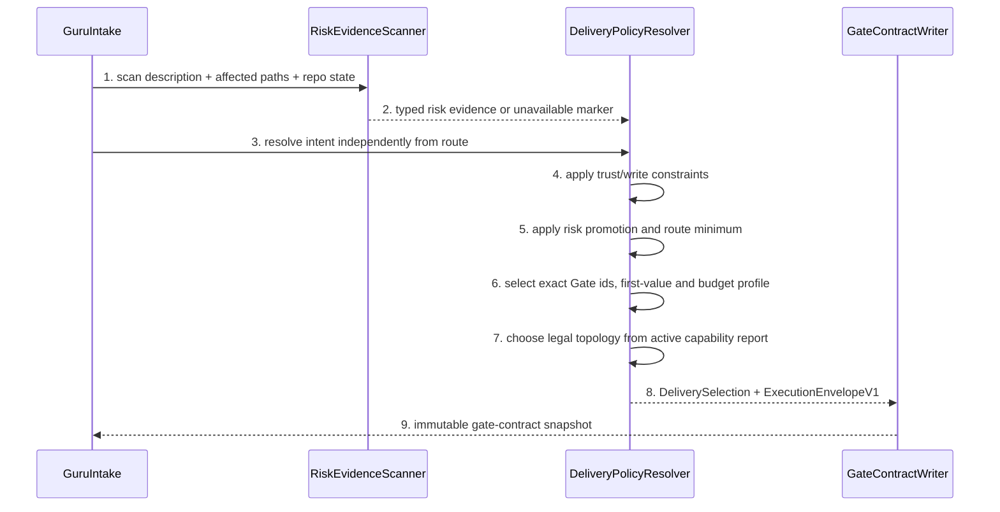

# Intent And Execution Route Policy Detailed Design

> `doc_type=usecase` | `l2_status=v1`
> `chapter_status=ready_for_review_after_migration_exception`
> Overview owner: design-main §4 UNIT-delivery-policy | TECH-002, TECH-005

### UNIT-delivery-policy

<!-- GURU-DECISION:DEC-POLICY-001 -->
The accepted architecture boundary is Custom-first, feature-phase Core-zero, reversible Extension ownership, with SDK de-fork deferred until official Template/Extension equivalence is proven. This is one decision across every task route, not a Lite-only exception.

## 1. 单元职责

承接 BHV-001、BHV-002、BHV-003。唯一拥有 IntentKind、ExecutionRoute、ExecutionTopology、risk promotion、route-owned Gate/first-value、artifact/review/confirmation/budget profile 与 immutable `ExecutionEnvelopeV1`。它产生 RiskDecisionPacketV1，但不验证可信 confirmation、不运行 worker、不修改 lifecycle status，也不把 host-inline 统计冒充 hard enforcement。

正向依赖：repo risk evidence scanner、policy JSON loader、contract writer。反向禁止：不得依赖 Supervisor runtime state、review verdict 文案或 user preference 来降低 high risk。

## 2. 行为定义

### 2.1 接口定义

```python
class IntentKind(str, Enum):
    IMPLEMENTATION = "implementation"
    REVIEW = "review"
    RESEARCH = "research"
    DEBUG = "debug"
    DOCS = "docs"
    CONFIG = "config"
    OPS = "ops"

class ExecutionRoute(str, Enum):
    SMALL_INLINE = "small_inline"
    MICRO_TASK = "micro_task"
    LITE_TASK = "lite_task"
    FULL_CHAIN = "full_chain"

class ExecutionTopology(str, Enum):
    HOST_INLINE = "host_inline"
    MANAGED_SINGLE = "managed_single"
    MANAGED_PARALLEL = "managed_parallel"

class EnforcementMode(str, Enum):
    ADVISORY = "advisory"
    ENFORCED = "enforced"

@dataclass(frozen=True)
class IntakeRequest:
    description: str
    intent_hint: IntentKind | None
    affected_paths: tuple[PurePosixPath, ...]
    commit_requested: bool
    read_only_requested: bool

@dataclass(frozen=True)
class DeliverySelection:
    intent: IntentKind
    execution_route: ExecutionRoute
    risk: Literal["low", "medium", "high", "unknown"]
    first_value_metric: Literal["first_code", "first_verified_evidence", "first_accepted_artifact"]
    write_capability: Literal["none", "task_artifacts", "scoped_repository"]
    required_artifacts: tuple[str, ...]
    terminal_conditions: tuple[str, ...]
    resolved_budget: "BudgetProfile"
    scope_fingerprint: str
    policy_version: str

@dataclass(frozen=True)
class ExecutionEnvelopeV1:
    schema_version: Literal[1]
    envelope_id: str
    selection_generation: int
    intent: IntentKind
    execution_route: ExecutionRoute
    topology: ExecutionTopology
    enforcement_mode: EnforcementMode
    write_capability: Literal["none", "task_artifacts", "scoped_repository"]
    task_id: str | None
    slice_id: str | None
    slice_packet_digest: str | None
    risk_packet_digest: str | None
    confirmation_attestation_digest: str | None
    scope_fingerprint: str
    policy_snapshot_digest: str
    required_gate_ids: tuple[str, ...]
    budget: "BudgetProfileV1"
    first_value_kind: Literal["first_scoped_code_diff", "first_verified_evidence", "first_accepted_artifact"]
    terminal_conditions: tuple[str, ...]

def resolve_delivery_selection(request: IntakeRequest, policy: "DeliveryPolicy", evidence: "RiskEvidence") -> DeliverySelection: ...
def build_risk_packet(selection: DeliverySelection, decisions: tuple["RiskDecision", ...], artifact_digest: str) -> "RiskDecisionPacketV1": ...
def build_execution_envelope(selection: DeliverySelection, inputs: "EnvelopeInputs", capabilities: "ProviderCapabilityReportV1") -> ExecutionEnvelopeV1: ...
```

### 2.2 行为清单

| Behavior | BHV | Result |
| --- | --- | --- |
| ClassifyIntent | BHV-001 | one intent independent of route |
| ResolveRoute | BHV-001, BHV-002 | minimum legal route with promotion evidence |
| SnapshotPolicy | BHV-003 | immutable execution_policy in gate-contract |
| BuildRiskPacket | BHV-002, BHV-003 | decisions bound to scope/artifact/policy digest |
| BuildExecutionEnvelope | BHV-001, BHV-003 | exact topology, conditional ids/Gates, budgets and first-value event contract |

## 3. 核心数据结构

### 3.1 Policy schema

`DeliveryPolicyV1` keys: `schema_version`, `policy_version`, `intent_profiles`, `route_profiles`, `read_only_cap`, `topology_rules`, `risk_rules`, `promotion_rules`, `first_value_rules`, `confirmation_rules`。每个 route profile 必须完整包含下表字段；不得用缺省 `null` 形成无界循环。单位固定为 seconds/bytes/count，所有 count 都是 inclusive maximum。

| profile | planning / first-value / terminal seconds | model cycles / tool calls / wait calls | planned / observed context bytes | duplicate reads | repairs | live / started workers | idle seconds | no-progress cycles | confirmation batches |
| --- | --- | --- | --- | --- | --- | --- | --- | --- | --- |
| `small_inline-v1` | `45 / 120 / 600` | `4 / 16 / 0` | `65536 / 98304` | `2` | `1` | `0 / 0` | `60` | `2` | `0` |
| `micro-task-v1` | `120 / 300 / 1200` | `8 / 32 / 2` | `262144 / 393216` | `4` | `1` | `1 / 1` | `120` | `3` | `0` |
| `lite-task-v1` | `240 / 600 / 2700` | `14 / 64 / 4` | `524288 / 786432` | `6` | `2` | `1 / 2` | `180` | `3` | `1` |
| `full-chain-v1` | `900 / 900 / 5400` | `32 / 144 / 8` | `1572864 / 2359296` | `12` | `3` | `2 / 4` | `300` | `4` | `2` |
| `read-only-cap-v1` | `300 / 300 / 1800` | `10 / 40 / 3` | `393216 / 589824` | `4` | `1` | `1 / 2` | `120` | `3` | route cap |

`write_capability=none` 逐字段取 route profile 与 `read-only-cap-v1` 的较小值；Small 的 `0` workers/waits 保持 `0`。Project config 可以降低任一值；提高默认值必须生成新 selection generation、记录旧/新 budget digest 和 reason，并由外部明确授权，不能由 worker 自行续杯。Unknown/negative/non-integer/missing value 是 `PolicySchemaInvalid`。

### 3.2 Counting, clocks, and resume semantics

- `planning_deadline_seconds` 从 intake 接受 request 到 immutable envelope 写成；等待用户输入的 wall time不计入 active monotonic time，但一次 confirmation prompt 立即消费一个 batch，且等待期间不得运行 worker。External dependency wait 不暂停为无界状态：runner 返回一个 blocker 后停止本 run。
- `first_value_deadline_seconds` 从 envelope activation 起算；Full 仅在 required confirmation current、selected packet eligible 后 activation。`FirstValueEventV1` 只接受一次：implementation 必须是相对 typed pre-task snapshot 的首个 allowed-path business diff；review/research/debug evidence 或 docs/config/ops artifact 必须带可重放 evidence digest。准备计划、写 task artifact、输出日志都不是 first value。
- `terminal_deadline_seconds` 统计同一 envelope generation 的累计 active monotonic runtime；用户等待不计时，但 tool/provider/external wait 均计时。First-value deadline和 terminal deadline独立，较先命中的 stop condition优先。
- 一次 `model_cycle` 是向 provider 提交一个生成请求并收到 terminal response/error；retry、context-overflow retry 和 follow-up 都各计一次。Streaming chunks不另计，host-inline 无可观测 adapter 时为 `unknown`。
- 一次 `tool_call` 是一个唯一 tool-call id 的一次 invocation attempt；失败、拒绝、超时、retry 都计数，batch 中每个 operation 分别计。一次 `wait_call` 是 wait/poll/sleep/worker-status invocation；等待产生的 log/heartbeat不重置 semantic progress。
- `planned_context_bytes` 是 ContextManifest 选中 candidate 的去重内容 bytes，不是读取事实。`observed_context_bytes` 是 managed read proxy 实际交付给 model/worker 的 bytes之和，cached/repeated delivery仍重复计；同一 phase 中相同 `(source, artifact_key, content_digest)` 在首次之后每次计一个 `duplicate_read`。Inline 没有完整 read interception 时 actual/duplicate 固定记录 `unknown`，绝不写 `0` 或以 planned 值代替。
- `repair` 是 deterministic check/review 已失败后开始的一组新 semantic patch；同一 patch 内编辑次数不重复计。`live_workers` 是同时处于 starting/running/cancelling 的 lease 数；`started_workers` 每次 launch attempt 都计，包括失败和 replacement。
- `idle_seconds` 从最后一个 runner-observed model/tool event结束起算；heartbeat/log/wait不重置。`no_progress_cycles` 是连续完成 model cycle 后没有新的 accepted business/test/risk/artifact/decision digest；重复 event/digest 不重置。
- 一个 confirmation batch 是一次面向用户、聚合当时全部 required decision ids 的 prompt。重问相同 current decision既消费 batch又是 process defect；相同 attestation直接复用。只在新增 required decision 或 scope/risk generation 变化时允许新 batch。
- 同一 non-terminal envelope 的 recoverable process resume 创建新 `run_id` 但继承累计 counters、active elapsed 和 remaining budgets；不得通过换 thread/worker/provider 重置。任一 terminal（含 budget exceeded）之后继续必须 re-intake 生成新 envelope generation；旧 usage 保留并从同 scope 的新 budget扣除，除非 scope 缩小或外部明确批准 budget override。Terminal run永不 reopen。

### 3.3 Route-specific envelope field and topology schema

| Case | task_id | slice_id / slice packet | risk / confirmation | Gate inheritance | topology / enforcement |
| --- | --- | --- | --- | --- | --- |
| Small writable | absent | absent / absent | absent / absent | inline scope + deterministic final only | host_inline / advisory |
| Micro writable | optional only for persisted trace | absent / absent | absent / absent | micro contract only | host_inline/advisory or managed_single/enforced |
| Lite writable | required | optional single unit / absent | risk absent；confirmation optional for one current medium decision batch | compact PRD + contract-impact delta + <=1 review；no Full Gate | managed_single/enforced preferred；host_inline/advisory fallback |
| Full writable | required | required / required | risk required；confirmation required iff unresolved required critical/high decisions remain | exact Full gate ids | managed_single or eligible managed_parallel / enforced |
| Read-only any route | optional below Full, required for Full evidence package | absent unless a named read-only unit；writable packet absent | absent unless the read itself has a separately classified sensitive/high-risk decision | intent evidence/artifact gates only；no StartGuard/implementation Gate | route limits remain: Small host-only, Micro/Lite host-or-single, Full single-or-independent parallel fanout；host stays advisory |

High/unknown-high signal always promotes to a new Full selection before an envelope is built。Presence of a task directory, `guru_chain=full`, Full-shaped historical artifact or selected provider never adds Gate ids to a lower-route envelope。`managed_parallel` is legal only for Full independent packets or read-only fanout after dependency/disjoint-target proof；Small is never managed and Micro/Lite are never parallel。`enforcement_mode=enforced` is legal only when ManagedProviderRunner reports lifecycle control + structured events and every claimed hard counter has its matching active probe；local capability reports do not create trusted user/reviewer identity or token telemetry。

<!-- GURU-DECISION:DEC-POLICY-002 -->
High risk and unknown-high-signal work cannot accept a Lite/Micro preference; the only legal closure is a new Full selection before any writable envelope or implementation worker exists.

### 3.4 Risk packet schema

| Field | Constraint |
| --- | --- |
| packet/task/owner ids | stable non-empty ids; owner UNIT-delivery-policy |
| intent/route/risk | legal enums; high/unknown-high-signal route must Full |
| scope_fingerprint/artifact_digest/policy_version | non-empty current values |
| decision_items | decision id, severity, irreversible, recommendation, alternatives, impact, required |
| invariant_ids | must resolve to slice packet/design invariant ids |

### 3.5 错误枚举

| Error | Trigger | Closure |
| --- | --- | --- |
| `PolicyMissing` / `PolicySchemaInvalid` | missing/unknown fields/non-positive budget | fail closed, no contract |
| `IntentAmbiguous` | evidence cannot distinguish intent | choose safest compatible intent or explicit blocker; never infer write capability |
| `RouteIllegalForRisk` | high or unknown-high signal with non-Full | force Full and audit reason |
| `RouteIllegalForIntent` | review/research requested write capability | split intent or block |
| `ScopeUnbounded` | Micro missing path/max-files; path escape | block selection |
| `RiskEvidenceUnavailable` | scan/index failure | risk at least medium; high-signal path promotes Full |
| `RiskPacketIncomplete` | required decision/invariant/digest missing | block check-start |
| `EnvelopeFieldIllegal` | route has missing/extra task/slice/packet/risk/confirmation field or inherited Full Gate | no envelope/write |
| `TopologyIllegal` | Small managed, Micro/Lite parallel, or Full parallel without independent eligibility | select allowed topology or block |
| `CapabilityUnavailable` | envelope claims enforced counter/fence without runner probe | advisory host-inline if route permits, otherwise block |
| `BudgetOverrideInvalid` | worker reset/raise, missing reason/generation, or counter decreases | preserve prior usage; block resume |

## 4. 逐行为设计

### 4.1 Intent × route resolution



顺序不可交换：先 intent capability，再 risk promotion，再 exact Gate/budget，最后按可证明 capability 选 topology。User route preference 只在不违反 risk/intent 时参与。Commit request 可把 small_inline 提升 Micro，但不能把 review intent 变 implementation。非 implementation 的 `first_code=N/A`，不得因“零业务 diff”误判 stalled；它们使用 first verified evidence/artifact。低 route 不能调用 Full `check-start` 作为省事实作法；如果发现 Full-only Gate 真有必要，必须 promote/re-intake，而非追加 gate id。

### 4.2 Execution envelope and first value

Envelope builder先验证 route conditional fields，再验证 `required_gate_ids` exact equality，最后绑定 policy/scope/budget digest。`FirstValueEventV1` fields are `schema_version,event_id,envelope_id,run_id_or_host_turn,metric,monotonic_elapsed_ms,evidence_ref,evidence_digest,scope_fingerprint,observer,enforcement_mode`。Managed runner 只能从 scoped diff/read-only verdict/verified source set/accepted artifact 的 structured event产生；Supervisor CAS 接受首条 current event，重复或不同 evidence 是 audit-only。Host inline记录 `observer=host_inline` 和 `enforcement_mode=advisory`；缺失事件是 SLO unknown/breach，不得伪造成 budget pass。

### 4.3 Risk packet、确认与复用

`build_risk_packet` 只收集 unresolved critical/high decisions，并为每项提供 recommended choice/alternatives/impact。Packet digest 由 canonical packet JSON（排除 created_at）计算。ConfirmationAttestor 后续绑定 packet digest；selection 的 scope/artifact/policy/decision set 任一变化使旧 attestation invalid。相同 tuple 的 attestation 复用，不重复询问。

### 4.4 失败收口

Policy/intent/risk/scope/envelope/topology 错误在写 gate-contract 前终止。Risk scan unavailable 不回落 low。Managed budget exceeded 直接产生 terminal stop reason并取消 lease；host-inline threshold crossing只能标记 advisory breach并在下一个 controllable Gate/finalize boundary停止，不能声称已经强杀 host。两者都不能改 required_artifacts/reviews/confirmations 或 route；恢复动作是 re-intake、缩 scope 或外部批准的新 generation budget，而非跳 Gate或换 worker 清零。

## 5. 状态 / 边界

DeliverySelection + ExecutionEnvelope 是任务执行快照；policy template 升级不改已有 generation。只有显式 re-intake 可生成新 `selection_generation`，保留前代、累计 usage 与 promotion/override reason。Scope fingerprint 覆盖 sorted allowed paths/max-files/layers/contracts；scope expansion 冻结执行并生成新 generation。Capability report变化只能降低 enforcement/阻塞 launch，不能原地扩大 topology 或 Gate。

## 6. 数据合同

- `guru_chain=full|light` 只表示 artifact shape；`ExecutionRoute` 只用 `*_task/full_chain` 值，不交叉写入。
- Intent determines write capability; route cannot escalate it。
- `required_artifacts` 按 intent/route 交集生成，N/A 项显式记录。
- Risk packet不保存 user confirmation；ConfirmationAttestation 由 StartGuard/可信 Gate owner 管理。
- `required_gate_ids` is exact；task/slice/risk/confirmation fields follow §3.3 conditional presence, never truthy-by-presence shortcuts。
- Provider capability is a local observed input to topology selection；it is not a trusted identity attestation and unsupported counters remain `unknown`。

## 7. 测试映射

| Path | Command | Expected result |
| --- | --- | --- |
| 7 intents × 4 routes | `python3 -m unittest discover -s guru-template/overlay/verify/tests -p 'test_delivery_policy.py'` | legal matrix resolves; illegal pairs explicit |
| route envelope fields/Gates | `python3 -m unittest discover -s guru-template/overlay/verify/tests -p 'test_delivery_policy.py'` | task/slice/packet/risk/confirmation conditional presence exact; lower routes never inherit Full gates |
| high cannot downgrade | `python3 -m unittest discover -s guru-template/overlay/verify/tests -p 'test_delivery_policy.py'` | Full selected, preference audited |
| review write denial | `python3 -m unittest discover -s guru-template/overlay/verify/tests -p 'test_delivery_policy.py'` | write capability none and no implementation StartGuard/TTFC |
| non-code N/A | `python3 -m unittest discover -s guru-template/overlay/verify/tests -p 'test_delivery_policy.py'` | review/research/docs no first_code |
| topology/capability truth | `python3 -m unittest discover -s guru-template/overlay/verify/tests -p 'test_delivery_policy.py'` | Small host-only; Micro/Lite not parallel; missing runner probes never claim enforced |
| exact budget schema/counting | `python3 -m unittest discover -s guru-template/overlay/verify/tests -p 'test_delivery_policy.py'` | every numeric default, read-only min, retry/batch/duplicate/cached counting and resume carry-forward match §3 |
| first-value event | `python3 -m unittest discover -s guru-template/overlay/verify/tests -p 'test_delivery_policy.py'` | one current scoped event accepted; planning/log/self-report cannot pass managed budget |
| scan unavailable | `python3 -m unittest discover -s guru-template/overlay/verify/tests -p 'test_delivery_policy.py'` | medium or Full by path signals |
| scope promotion | `python3 -m unittest discover -s guru-template/overlay/verify/tests -p 'test_delivery_policy.py'` | old selection/attestation stale |
| budget no bypass/reset | `python3 -m unittest discover -s guru-template/overlay/verify/tests -p 'test_delivery_policy.py'` | terminal budget state, gates unchanged, new worker/run cannot reset usage |
| error enum matrix | `python3 -m unittest discover -s guru-template/overlay/verify/tests -p 'test_delivery_policy.py'` | `PolicyMissing`, `PolicySchemaInvalid`, `IntentAmbiguous`, `RouteIllegalForRisk`, `RouteIllegalForIntent`, `ScopeUnbounded`, `RiskEvidenceUnavailable`, `RiskPacketIncomplete`, `EnvelopeFieldIllegal`, `TopologyIllegal`, `CapabilityUnavailable`, `BudgetOverrideInvalid` each fails closed with the declared result |
| existing regression | `bash guru-template/overlay/verify/tests/run_tests.sh` | intake/contract route suite green |

Success and failure fixtures assert full serialized gate-contract, not only route string.

## 8. 不得补造清单

- 不得把 Review-only/Research/Debug 当成 route 值；它们是 intent。
- 不得让 route 授予 intent 禁止的写权限。
- 不得在 scan failure 时选择 low，或用 budget 绕过 Gate。
- 不得把 confirmation 字符串写进 risk packet 作为 trusted attestation。
- 不得让 Inline/Micro/Lite 因存在 task/Full-shaped artifact 而继承 Full Gate。
- 不得把 host-inline、legacy channel timeout或本地 capability 字符串称为 managed hard enforcement/platform-signed evidence。
- 不得通过新 run/worker/provider、retry 或 planned-context bytes 重置/伪造 observed budget counters。

## 9. 不变量矩阵

| invariant_id | rule | owner | positive_case | negative_case | route_if_missing |
| --- | --- | --- | --- | --- | --- |
| INV-POLICY-001 | high/unknown-high-signal must-not resolve below full_chain | UNIT-delivery-policy | Full snapshot | high Lite override accepted | block intake/start |
| INV-POLICY-002 | execution route must-not grant capability forbidden by intent | UNIT-delivery-policy | Full review remains read-only | review launches writer | split/block intent |
| INV-POLICY-003 | budget expiry must-not remove required Gate/review/confirmation | UNIT-delivery-policy | terminal budget report | continue by skipping Gate | hard process defect |
| INV-POLICY-004 | each route envelope must use only its conditional task/slice/packet/risk/confirmation fields and exact Gate allow-list | UNIT-delivery-policy | Small/Micro/Lite omit Full-only fields and Gates; Full writer binds current packet | lower route inherits Full Gate or worker guesses a missing id | block envelope/write |
| INV-POLICY-005 | live budget counters must use the exact policy values and carry cumulative usage across retry/run/resume | UNIT-delivery-policy | observed attempts/reads/repairs consume one immutable generation budget | new run/provider resets usage or planned bytes replace actual reads | budget terminal or re-intake |
| INV-POLICY-006 | host_inline must remain advisory and managed enforcement must require the matching actively probed runner capability | UNIT-delivery-policy | unsupported counter is unknown/advisory or launch blocks | host/legacy/local string is reported as hard enforced or trusted identity | block hard-budget claim |

当前状态保持 `ready_for_review_after_migration_exception`；未产生 method review evidence。
