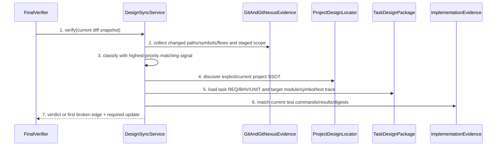

# Contract Impact And Project SSOT Sync Detailed Design

> `doc_type=service` | `l2_status=pending` | L2 exception: design-main §9
> `chapter_status=ready_for_review_after_migration_exception`
> Overview owner: design-main §4 UNIT-design-sync | TECH-001, TECH-004

### UNIT-design-sync

## 1. 单元职责

承接 BHV-005。唯一拥有 changed path/symbol/flow impact classification priority、project-current design SSOT discovery、task-local delta link、REQ-UC/BHV→UNIT→module/symbol→test trace 与 source/template/installed drift verdict。它不修改 project docs automatically、不 invent code/test evidence。

正向依赖：Git diff inventory、GitNexus impact/detect_changes evidence、ProjectDesignLocator、Catalog/InstallState digests。反向禁止：不得以 task-local design替代 project-current SSOT，不得用 no-doc-impact 覆盖高优先级 signal。

## 2. 行为定义

### 2.1 接口定义

```python
class ImpactClass(str, Enum):
    FORBIDDEN_OR_SECURITY = "forbidden_or_security"
    CONTRACT_IMPACT = "contract_impact"
    TEST_ONLY = "test_only"
    DOCS_ONLY = "docs_only"
    NO_DOC_IMPACT = "no_doc_impact"

class DesignSyncService(Protocol):
    def discover_project_ssot(self, repo_root: Path, config: "RepoConfig") -> "ProjectDesignSource": ...
    def classify(self, changes: tuple["ChangeEvidence", ...]) -> "ImpactVerdict": ...
    def build_trace(self, requirement_pkg: Path, task_design_pkg: Path, implementation_plan: Path) -> tuple["TraceRow", ...]: ...
    def verify(self, request: "DesignSyncRequest") -> "DesignSyncVerdict": ...
```

### 2.2 Classification priority

Highest matching class wins for mixed change set:

1. forbidden/security: path outside gate contract, secret/permission/unsafe dynamic execution;
2. contract-impact: route/API/schema/state/boundary/ownership/testing/Gate semantics/public Template id/install ownership;
3. test-only: tests change without production/design contract signal;
4. docs-only: non-generated docs change without contract source change;
5. no-doc-impact: formatting/internal refactor with complete symbol/flow evidence and no higher signal.

`no-doc-impact` is an evidence-bearing result, never a user-selected override。

## 3. 核心数据结构

### 3.1 Project SSOT discovery

Precedence:

1. explicit repo config `guru.design_ssot` path, realpath-fenced and manifest-valid;
2. `docs/design/current/manifest.json`;
3. current product-version design manifest selected by repo version metadata;
4. none → `ProjectDesignMissing` for contract-impact, not fallback task design.

This repository selects `guru-template/overlay/docs/delivery-control-plane.md` as the single project-current design SSOT for Guru delivery-control v2. Slice `design-sync-replay` must create it from the accepted task delta before final verification. `guru-template/overlay/policy/delivery-policy.json` and `extension-manifest.json` are machine contracts referenced by that document; four platform Workflow/Spec assets contain only platform projection/linkage and must not copy the complete control-plane design. Task `design_package` remains the reviewable delta and can never substitute for the project-current file.

The legacy SDK-bundled Guru tree is a versioned v1 compatibility snapshot, not a v2 mirror or fallback. Therefore the old `sync:guru:check` and bundled-v1 Vitest shard are transition-audit inputs only; neither is Custom-v2 release authority. Custom-v2 release consistency is instead: unchanged frozen owner boundary, Core-zero diff, dedicated Catalog source digest, Extension manifest/source digest, installed-state digest, mandatory v2 tests and official no-bundled-fallback E2E. Fork SDK/npm readiness remains a separate release domain that requires a clean legacy suite and aligned raw mirror check. Explained v1/v2 divergence or precisely pinned legacy debt never authorizes runtime fallback and must never be reported as green.

### 3.2 Trace row

`TraceRow(requirement_id, bhv_id, unit_id, module_path, symbol_name, test_command, expected_result, evidence_digest, status)`。Planning may define target module/symbol/test/expected result; evidence digest/status remain pending until implementation runs。

`covered` requires all of: module path exists in the current snapshot, symbol resolves through AST/GitNexus or an equivalent structured parser, the declared test file exists, the exact command executed with exit code 0, expected assertions were observed, and evidence is bound to the current code/test/SSOT digests. Planning prose, a command string, or a green result for an older digest cannot advance status.

### 3.3 Legacy v1 transition audit and release domains

`guru_design_sync.py verify-legacy-transition` owns this audit and reads a checked-in normalized baseline. The baseline binds schema/baseline id, task-start commit, frozen bundled-owner tree/blob ids, exact command and tool version, digest of the complete sorted test-name inventory, skipped/todo counts, and each allowed failure fingerprint. A failure fingerprint contains the full test name, exception class and normalized stable assertion signature; only temporary paths, line numbers, timing and stack noise may be removed. Counts alone are never sufficient.

The task-start fixture is anchored at commit `da9b9460cdf381c3abbeec608bb0c88400ea2dc2`, bundled owner tree `ff5a13764b18f021b321f05a9c07ad05ab035c88`, test blob `801728af418489dc504c3c4fc6237739f9373690`, Vitest `4.0.18`, inventory digest `9cd2482285eac07bc163a094e8dda603bf13a283a11a6562c3a0df6403cf9ab5`, `82` total, `77` passed, `5` failed and zero skipped/todo. The five accepted failed full names are:

1. `guru_supervise.py writes a staged implementation-review record that check-commit accepts`;
2. `guru_supervise.py commit-plan recommends implementation-review --staged instead of implement-check for missing records`;
3. `guru_supervise.py commit-plan recommends implementation-review --staged for malformed implementation review records`;
4. `guru_supervise.py commit-plan recommends implementation-review --staged for stale staged review digests`;
5. `guru_supervise.py commit-plan does not recommend implementation-review for mixed task artifacts without a contract`.

Suite verdicts are `CLEAN` for the exact inventory and zero failures, `KNOWN_DEBT_UNCHANGED` for the exact five fingerprints, `KNOWN_DEBT_REDUCED` for a strict subset with no new/changed fingerprint, `REGRESSION` for any new or changed failure, and `INVALID` for an aborted/malformed report, inventory change, skip/todo or owner-boundary mismatch. `KNOWN_DEBT_*` emits `legacy_status=known_debt`, `custom_v2_release_effect=non_blocking`, `sdk_release_effect=blocking`; it is never pass/green.

Mirror verdicts are independently `ALIGNED`, `EXPLAINED_V2_DIVERGENCE`, `UNEXPLAINED_DIVERGENCE`, `LEGACY_BOUNDARY_CHANGED` or `INVALID`. `EXPLAINED_V2_DIVERGENCE` requires the frozen bundle tree to remain byte-identical to the baseline and every source-side drift path to be declared by the v2 Catalog/Extension manifests. The auditor records raw `sync:guru:check` output but derives its verdict from structured file/hash comparison, not localized stderr parsing.

Custom-v2 may release only for suite `CLEAN|KNOWN_DEBT_UNCHANGED|KNOWN_DEBT_REDUCED`, mirror `ALIGNED|EXPLAINED_V2_DIVERGENCE`, unchanged frozen owner boundary, all mandatory v2 checks green and official no-fallback E2E green. Fork SDK/npm release remains blocked unless suite=`CLEAN`, mirror=`ALIGNED` and the SDK test set is green. Thus this task can prove Custom-v2 readiness but cannot claim fork SDK/npm readiness while pinned debt remains.

### 3.4 错误枚举

| Error | Trigger | Closure |
| --- | --- | --- |
| `ProjectDesignMissing` | contract-impact with no project SSOT | block final sync, require SSOT decision |
| `ProjectDesignAmbiguous` | multiple candidates without explicit selection | block, list candidates |
| `ImpactEvidenceMissing` | changed symbol/path has no impact evidence | unknown/high by signals; no no-doc-impact |
| `ClassificationConflict` | lower class chosen despite higher signal | use highest and report conflict |
| `TraceMissing` / `TraceGhost` | missing/unknown REQ/BHV/UNIT/symbol/test edge | block first broken edge |
| `EvidenceStale` | test/diff/design digest mismatch | mark pending/stale |
| `InstalledDrift` | source/template/install hash mismatch without rule | block release |
| `LegacyAuditRegression` | new/changed legacy failure fingerprint | block Custom-v2 and SDK release; open separate legacy/de-fork repair input |
| `LegacyAuditInvalid` | inventory/skip/todo/owner boundary/report differs from the pinned audit contract | block both release domains |

## 4. 逐行为设计

### 4.1 Discover, classify, trace



No-doc-impact requires every changed production symbol to have upstream impact evidence, no public/gate/state/boundary/testing signal, and explicit changed paths/reason。Project SSOT discovery occurs before comparing task delta, preventing task historical notes becoming project truth。

### 4.2 Drift

Catalog source digest → resolved template digest → Extension installed node digest is a typed chain。Generated transformation must declare deterministic rule/version; otherwise unequal digest is drift。User-modified installed nodes are ownership conflicts, not source drift and remain preserved。

### 4.3 失败收口

Return highest severity class, first broken trace edge and exact required artifact。Missing GitNexus index cannot be waived for symbol edits; repair index or provide equivalent audited call-graph evidence before implementation。No fake module/symbol/test result is generated。

## 5. 状态 / 边界

Verdict bound to diff/staged snapshot digest, project SSOT manifest digest, task design digest and test evidence digest。Any changes stale verdict。Trace planning targets are immutable after detail confirmation unless re-entering detail review。

## 6. 数据合同

- ProjectDesignSource records source kind/path/manifest version/digest/discovery rule。
- ImpactVerdict records all matched signals, winning priority and rejected lower classifications。
- Test result must include command, exit code, expected assertion and evidence digest; “tests pass” prose insufficient。
- Code entry may be planned before implementation, but status remains pending and no evidence digest。

## 7. 测试映射

| Path | Command | Expected result |
| --- | --- | --- |
| classification/SSOT/trace/drift/release-domain matrix | `python3 -m unittest discover -s guru-template/overlay/verify/tests -p 'test_design_sync.py'` | priority, project SSOT, evidence truth, legacy classifications and all error closures match contract |
| legacy transition audit | `python3 guru-template/overlay/verify/guru_design_sync.py verify-legacy-transition --baseline guru-template/overlay/verify/baselines/legacy-bundled-v1.json` | exact inventory/fingerprints classify known debt non-green; any mutation blocks |
| exact official release E2E | `bash guru-template/overlay/tests/official_067_e2e.sh --release` | current HTTPS source, extension transaction, unapply and no-fallback postconditions pass |
| Core-zero | `test -z "$(git status --porcelain=v1 --untracked-files=all -- packages/cli/src packages/core)"` | staged, unstaged and untracked Core paths are empty |
| post-change scope | `node .gitnexus/run.cjs detect-changes --repo "$PWD" --scope compare --base-ref main` | affected symbols/flows match planned scope and repository selection is explicit |

## 8. 不得补造清单

- 不得让 task-local design 冒充 project-current design SSOT。
- 不得用 no-doc-impact 盖过 contract/forbidden signal。
- 不得伪造 code symbol、test command/result or GitNexus impact。
- 不得把 user ownership conflict误报为 safe source drift。
- 不得把 `KNOWN_DEBT_*` 叫作 pass/green，也不得用 Custom-v2 readiness 证明 fork SDK/npm readiness。
- 不得仅比较 legacy fail 数量，或把 test inventory/owner boundary 漂移解释为“已知失败”。

## 9. 不变量矩阵

| invariant_id | rule | owner | positive_case | negative_case | route_if_missing |
| --- | --- | --- | --- | --- | --- |
| INV-SYNC-001 | highest-priority impact signal must-not be overridden by no-doc-impact | UNIT-design-sync | contract-impact wins | formatting claim hides API change | block final sync |
| INV-SYNC-002 | task-local design must-not substitute missing project-current SSOT | UNIT-design-sync | explicit project source | historical task called current | ProjectDesignMissing |
| INV-SYNC-003 | missing module/symbol/test evidence must-not be marked covered | UNIT-design-sync | pending until real digest | prose “done” | block trace status |
| INV-SYNC-004 | Custom-v2 consistency must-not require mutating/falling back to legacy v1 or misclassify pinned debt as green/SDK-ready | UNIT-design-sync | exact inventory/fingerprints classify known debt non-green while Core-zero, v2 closure and no-fallback E2E pass | count-only waiver, changed legacy failure, Core edit, runtime fallback or SDK-ready claim | block declared release domain |

当前状态保持 `ready_for_review_after_migration_exception`；未产生 method review evidence。
