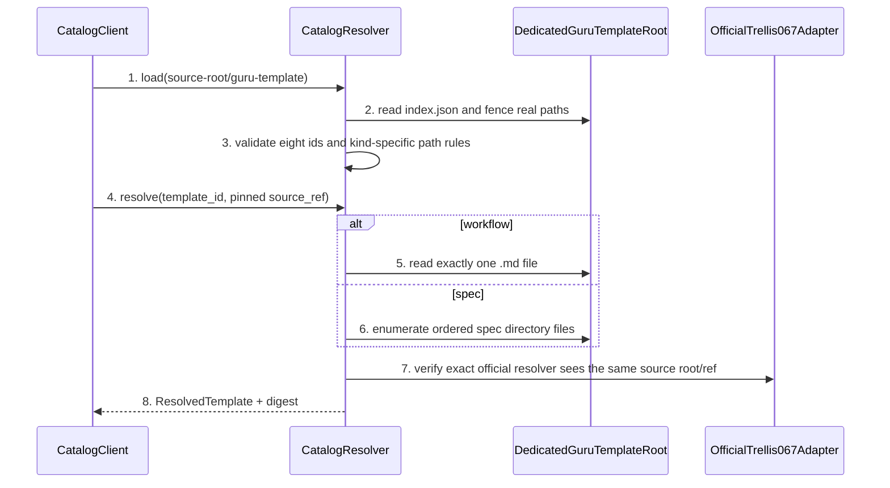

# Official Template Catalog Detailed Design

> `doc_type=repository-datasource` | `l2_status=v1`
> `chapter_status=ready_for_review_after_migration_exception`
> Overview owner: design-main §4 UNIT-marketplace-catalog | TECH-001

### UNIT-marketplace-catalog

## 1. 单元职责

承接 BHV-005、BHV-007。唯一拥有 dedicated registry root `guru-template/`、official `index.json` schema、Workflow/Spec 异构 path 解析和 source/content digest。被 UNIT-extension-manager 消费；不写目标项目、不拥有 Extension lifecycle，也不把 SDK bundled Guru 当 source 或 fallback。

`guru-template/index.json` 中的 `path` 一律相对传给 official CLI 的 registry source root。当前 release fixture 固定把 `guru-template/` subtree 作为 Git checkout root，source 直接指向该 repository root；不得追加 `.git` 或 `/guru-template` subdir，也不得把 monorepo root 与 `specs/...`、`workflows/...` 相对路径混用。

正向依赖：`pathlib/json/hashlib` 与 exact official marketplace adapter。反向禁止：不得依赖 ExtensionManager、GuruGate、target install-state、`packages/cli/src` bundled assets 或当前 fork CLI。Catalog只产生 typed preflight/resolve evidence；official CLI 的 staging、postcondition、publish、cleanup 和 nonzero normalization 由 UNIT-extension-manager 的 Guru wrapper拥有。

## 2. 行为定义

### 2.1 行为清单

| Behavior | BHV | Input | Output |
| --- | --- | --- | --- |
| LoadCatalog | BHV-005 | dedicated registry root | validated CatalogV1 |
| ResolveWorkflow | BHV-005, BHV-007 | workflow id + pinned source ref | one Markdown file + digest |
| ResolveSpec | BHV-005, BHV-007 | spec id + pinned source ref | canonical directory file set + digest |
| PreflightOfficialSource | BHV-007 | exact official package + pinned remote-compatible source/ref | read-only package/source/index/content evidence |
| ObserveOfficialInstall | BHV-007 | staged raw official run result | raw rc/stdout/stderr/tree digest；不判定 wrapper success |
| VerifyNoFallback | BHV-005 | official source/ref failure fixture | explicit failure, zero bundled Guru reads |

### 2.2 接口定义

```python
class TemplateKind(str, Enum):
    WORKFLOW = "workflow"
    SPEC = "spec"

@dataclass(frozen=True)
class CatalogEntry:
    template_id: str
    kind: TemplateKind
    relative_path: PurePosixPath

@dataclass(frozen=True)
class ResolvedTemplate:
    entry: CatalogEntry
    registry_root: Path
    source_ref: str
    files: tuple[PurePosixPath, ...]
    content_digest: str

class CatalogResolver(Protocol):
    def load(self, registry_root: Path) -> "CatalogV1": ...
    def resolve(self, catalog: "CatalogV1", template_id: str, source_ref: str) -> ResolvedTemplate: ...
    def verify_all(self, catalog: "CatalogV1", source_ref: str) -> tuple[ResolvedTemplate, ...]: ...
```

Official `index.json` entry 没有独立 Template version 字段；版本身份由 pinned source ref、catalog bytes 和 content digest 共同确定，不补造非官方必填字段。

## 3. 核心数据结构

| Field | Type / constraint | Owner |
| --- | --- | --- |
| registry_root | realpath-fenced `guru-template/` source root | CatalogResolver |
| source_ref | immutable tag/commit; branch-only source cannot produce release evidence | Release adapter |
| workflow path | non-empty relative path ending `.md`; exactly one regular file | CatalogEntry |
| spec path | non-empty relative directory; recursive canonical file set; no extra `spec/` wrapper | CatalogEntry |
| template id | stable unique ASCII id; four workflow + four spec ids | CatalogV1 |
| content_digest | SHA-256 over kind + source ref + ordered relative path + bytes | ResolvedTemplate |

稳定 id 集合：`guru-flutter-client`、`guru-go-backend`、`guru-h5-web`、`guru-ios-native` 四个 spec；`guru-client`、`guru-go`、`guru-h5`、`guru-ios` 四个 workflow。现有 Flutter id 不重命名。

### 3.1 错误枚举

| Error | Trigger | Retryable | Closure |
| --- | --- | --- | --- |
| `CatalogRootInvalid` | root missing、不是 selected dedicated root 或 source subdir 错配 | no | abort resolution |
| `CatalogSchemaInvalid` | version/type/field invalid | no | report JSON pointer |
| `TemplateIdDuplicate` | duplicate id | no | report all conflicting entries |
| `TemplatePathInvalid` | absolute/`..`/symlink escape/type mismatch | no | report entry id/path |
| `TemplateMissing` | resolved file/dir absent | no | report entry id |
| `SourceUnavailable` | official remote-compatible source/ref cannot be read | conditionally | retry only the same immutable remote ref; no file/local fallback |
| `OfficialPackageMismatch` | package name/version/binary realpath differs from exact release fixture | no | abort E2E before target mutation |
| `FallbackAttempted` | adapter exposes bundled Guru after official failure | no | hard E2E failure |
| `HermeticFixtureInvalid` | HTTPS smart Git、CA、advertised current ref或dedicated subdir contract不完整 | no | no official invocation; fixture cannot prove release |

## 4. 逐行为设计

### 4.1 Load/resolve workflow 与 spec



步骤：1) canonical root 必须是 selected `guru-template/` source root；2) JSON parse 后先验证 schema/version；3) workflow 与 spec 分支分别验证 file/dir；4) 排序使用 POSIX relative path；5) hash 包含 kind/source/path/bytes；6) official adapter 失败直接返回 `SourceUnavailable`，不查询 bundled Guru id；7) ExtensionManager 只收到 typed result/project-owned assertion，不重新解析 id。

### 4.2 Exact official 0.6.7 与无 fallback

E2E 在临时 npm prefix 安装 `@mindfoldhq/trellis@0.6.7`，先断言 package name/version 和 executable realpath 都来自该 prefix，并从 `PATH` 排除当前 repo/fork CLI。现场核实的 official 0.6.7 事实必须作为 wrapper contract，而不是被测试假设覆盖：spec marketplace download 失败时 `init` 会打印 `Falling back to blank templates...`、继续创建 blank Trellis scaffolding并最终可能返回 rc=0；workflow resolver failure则抛错。因而 raw official rc=0 不是 Guru Template 成功条件，错误 ref/index/path也不能假设 raw CLI必然 non-zero。

每个平台只在 Guru wrapper 创建的全新 staging project运行 raw official command：

```bash
trellis init -y --codex \
  --registry "$PINNED_GURU_SOURCE" --template "$SPEC_ID" \
  --workflow-source "$PINNED_GURU_SOURCE" --workflow "$WORKFLOW_ID"
```

Spec 的 `registry.spec.source/template` 必须按 official 行为持久化；non-native workflow 作为 marketplace/user-managed content验证 bytes/source fixture，但不得假设它进入 native workflow hash tracking。Raw command完成后，Extension wrapper必须按 expected Catalog source/content digest逐项验证 staging 中 spec tree、workflow bytes、registry source/template、non-native hash boundary以及不存在 blank/native Guru substitution；只有全部 postcondition匹配才可进入事务 publish。Raw rc=0 + missing/mismatched Guru bytes 归一为 wrapper non-zero `OfficialBlankFallback`，stage被清理且真实 target保持 byte-identical。Official resolver 的唯一 bundled workflow例外是显式请求 `native`；Guru id失败后读取/采用任何 bundled Guru仍是 `FallbackAttempted`。

### 4.3 Hermetic remote-compatible fixture

`official_067_e2e.sh` 使用计划中的 `guru-template/overlay/tests/https_git_fixture.py`，不得把 unsupported `file://`、bare local path、`local:`或 repo checkout path传给 official CLI。Fixture步骤固定：

1. 从 current candidate bytes创建 source commit，生成包含 commit short id + run nonce 的唯一 immutable tag；将该 tag push到本轮新建 bare repository，禁止复用上轮 bare remote/ref。
2. 用 Python stdlib TLS server + `git http-backend` 暴露 `/org/guru-fixture.git` smart HTTP；证书由本轮本地 CA签发。Official child只通过 `NODE_EXTRA_CA_CERTS`、`GIT_SSL_CAINFO`、`GIT_TERMINAL_PROMPT=0` 信任该 CA，不修改全局 Git/npm config。
3. 传给 official CLI 的 source 固定为 `https://127.0.0.1:${PORT}/org/guru-fixture#${TAG}`；不带 `.git`（official parser会自行追加），也不带 `/guru-template` subdir。Unknown HTTPS host按official 0.6.7 parser走 remote Git clone/fetch，checkout root本身就是 dedicated registry root。
4. 在任何 official invocation前执行 HTTPS `git ls-remote`，要求 `refs/tags/${TAG}` 精确指向本轮 source commit，并从 remote clone重新计算 index/content digest。未 advertised、指向旧 commit或服务日志没有smart-Git request均为 `HermeticFixtureInvalid`。
5. 成功、失败、signal路径都终止server并删除 cert、bare repo、clone、stage；cleanup failure保持 non-zero并报告路径，不能覆盖 primary failure。

该 helper和参数是本 slice 的 planned target；在脚本/测试真实实现并通过前，只能写“fixture contract pending”，不得声称已存在 hermetic official E2E。

### 4.4 失败收口

所有 schema/path/type/package/fallback 失败在首次解析点终止，不产生部分 Catalog。SourceUnavailable只可对同一 immutable HTTPS/Git source ref按bounded policy重试；不得换成本地路径、branch head或 bundled source。“尝试 bundled 再比较”不是合法降级。Raw official blank fallback保留为 observation并交给 Extension wrapper归一化，Catalog不得把 rc=0改写成 resolved success。

## 5. 状态 / 边界

N/A（无写状态）。同一 `(registry_root realpath, index bytes, source_ref)` 可进进程内只读 cache；任一 index/file metadata/bytes 变化使 cache key 失效。Cache 不是 SSOT，verify 必须重新读取文件。

Official 安装后的 Workflow/Spec 是项目拥有的 Template 内容。Catalog 不写 Extension ownership；Extension unapply 只撤销 Extension Pack，不删除 official 安装的 project-owned Template。切回 native workflow 由 official `trellis workflow` 明确执行。

## 6. 数据合同

- 输入 root 只能是 dedicated `guru-template/`，不能把 repo root、`packages/cli` 或 installed target 冒充同一 root。
- Workflow output 必须是一文件；Spec output 必须是目录文件集合，两者不得共享 “append `.md`” 或 “always recurse” 规则。
- SDK bundled Guru 不属于 source candidates；E2E 在 official source 不可用时断言无 bundled Guru path/read event。
- `content_digest` 交给 Extension install-state assertions 与 design-sync，Catalog 不写 ownership。
- Release fixture source必须是 official parser支持的 pinned HTTPS smart Git source；本地 checkout/file URL只能用于 fixture setup，不能作为被测 source。
- Raw official init rc/stdout/stderr 和 staging tree digest都保留；Catalog不把 rc=0推导为 Guru content success。

## 7. 测试映射

| BHV/path | Test | Command | Expected result |
| --- | --- | --- | --- |
| eight catalog entries | four workflow ids + four spec ids | `python3 -m unittest discover -s guru-template/overlay/verify/tests -p 'test_guru_catalog.py'` | stable unique ids; 4 files + 4 directory trees |
| dedicated source root | monorepo-root/subdir/independent-root fixtures | `python3 -m unittest discover -s guru-template/overlay/verify/tests -p 'test_guru_catalog.py'` | only path/source-root-consistent forms pass |
| digest drift/failure/no fallback | catalog negative matrix | `python3 -m unittest discover -s guru-template/overlay/verify/tests -p 'test_guru_catalog.py'` | exact error enum; no partial result or bundled read |
| HTTPS smart Git fixture | CA/server/current-tag/cleanup matrix | `python3 -m unittest discover -s guru-template/overlay/verify/tests -p 'test_https_git_fixture.py'` | official-compatible clone/fetch works; stale/unadvertised ref and cleanup failure block |
| exact official catalog | four-stack staged fixture | `bash guru-template/overlay/tests/official_067_e2e.sh --catalog` | exact package/binary, current unique HTTPS ref, dedicated source root and raw rc0 blank-fallback observation are asserted |

## 8. 不得补造清单

- 不得新增第二个 registry root、SDK fallback 或 workflow/spec 共用错误 path 规则。
- 不得从当前 fork CLI 生成 official E2E 绿色结果。
- 不得由 Catalog 写 target files/config/install-state。
- 不得把 missing source 当空 Catalog，也不得用 basename hash 替代 ordered relative-path hash。
- 不得把 `file://`、local path或 stale reused ref当作 official remote-compatible evidence。
- 不得把 raw official `init` rc=0当作 spec/template postcondition成功。

## 9. 不变量矩阵

| invariant_id | rule | owner | positive_case | negative_case | route_if_missing |
| --- | --- | --- | --- | --- | --- |
| INV-CATALOG-001 | official resolution failure must-not read bundled Guru | UNIT-marketplace-catalog | explicit `SourceUnavailable` | bundled Guru fixture returned | block catalog/release Gate |
| INV-CATALOG-002 | workflow/spec must-not use one homogeneous path rule | UNIT-marketplace-catalog | file vs directory branches | spec treated as `.md` or workflow recursed | block schema validation |
| INV-CATALOG-003 | resolved path must-not escape dedicated root | UNIT-marketplace-catalog | fenced relative path | absolute/`..`/symlink escape | block entry and report path |
| INV-CATALOG-004 | official E2E must use exact `@mindfoldhq/trellis@0.6.7` binary and a path-consistent dedicated source root | UNIT-marketplace-catalog | package/version/realpath/root assertions pass | current fork or monorepo-root path mismatch produces green | block release |
| INV-CATALOG-005 | official E2E source must use a hermetic HTTPS smart Git remote whose unique advertised ref resolves to the current candidate before invocation | UNIT-marketplace-catalog | local CA, smart HTTP log, ls-remote tag and recloned content digest all match current commit | file/local source, unadvertised tag, reused old remote/ref or stale content proves release | HermeticFixtureInvalid and block release |

当前状态保持 `ready_for_review_after_migration_exception`；未产生 method review evidence。
