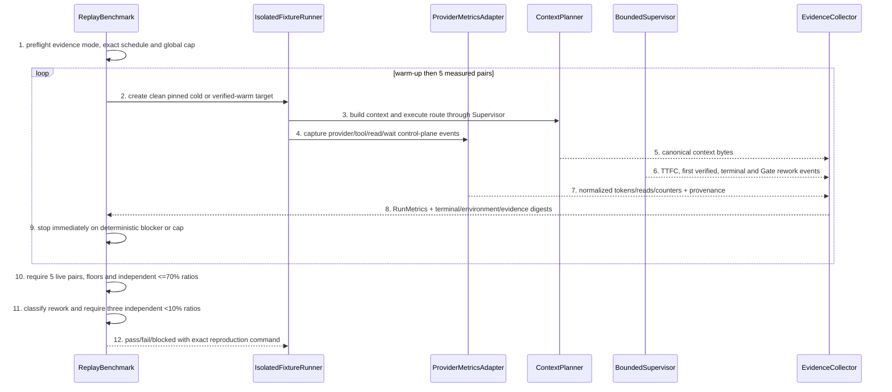

# End-to-end Replay And Release Benchmark Detailed Design

> `doc_type=usecase` | `l2_status=v1`
> `chapter_status=ready_for_review_after_migration_exception`
> Overview owner: design-main §4 UNIT-replay-benchmark | TECH-007

### UNIT-replay-benchmark

## 1. 单元职责

承接 BHV-001~BHV-007。唯一拥有 versioned replay fixture、live/recorded/synthetic evidence mode、cold/warm protocol、provider telemetry provenance、global live-run budget、statistics、small-baseline floor、Gate rework attribution 与 cross-unit release summary。它消费各 UNIT evidence，不替代单元测试、不修改 policy 或失败结果。

正向依赖：FixtureRunner、MonotonicClock、ContextManifest、Supervisor events、provider metrics adapter、Extension fixture。反向禁止：不得以单元测试绿、主观“更快”、recorded/synthetic trace 或 unknown metric=0 覆盖 live E2E red。

## 2. 行为定义

### 2.1 接口定义

```python
class EvidenceMode(str, Enum):
    LIVE_PROVIDER = "live_provider"
    RECORDED_TRACE = "recorded_trace"
    SYNTHETIC = "synthetic"

@dataclass(frozen=True)
class BenchmarkProtocol:
    protocol_version: str
    measured_pairs: Literal[5]
    discarded_warmups_per_mode: Literal[1]
    global_live_run_cap: int
    time_floor_ms: int
    context_bytes_floor: int
    input_token_floor: int
    relative_threshold: float
    gate_rework_ratio_limit: float
    max_model_cycles_by_route: Mapping[str, int]

@dataclass(frozen=True)
class MetricProvenance:
    adapter_id: str
    adapter_version: str
    adapter_digest: str
    provider: str
    model: str
    raw_event_schema: str
    normalization_rule_version: str
    raw_capture_digest: str

@dataclass(frozen=True)
class RunMetrics:
    evidence_mode: EvidenceMode
    ttfc_ms: int | None
    first_verified_result_ms: int
    terminal_elapsed_ms: int
    active_ms: int
    provider_wait_ms: int
    tool_wait_ms: int
    canonical_context_bytes: int
    provider_uncached_input_tokens: int
    provider_cached_input_tokens: int
    provider_total_input_tokens: int
    provider_output_tokens: int
    provider_total_tokens: int
    provider_token_semantics: str
    actual_read_count: int
    actual_read_bytes: int
    unique_read_count: int
    unique_read_bytes: int
    duplicate_read_count: int
    duplicate_read_bytes: int
    read_cache_hit_count: int
    read_cache_hit_bytes: int
    model_cycles: int
    tool_calls: int
    tool_failures: int
    wait_events: int
    confirmation_batches: int
    repair_rounds: int
    gate_invalidations: int
    business_diff_digest: str | None
    verification_digest: str
    provenance: MetricProvenance

@dataclass(frozen=True)
class GateReworkEventV1:
    event_id: str
    gate_id: str
    trigger_rule_id: str
    finding_key: str | None
    attribution: str
    active_ms: int | None
    total_input_tokens: int | None
    total_tokens: int | None
    model_cycles: int | None
    before_semantic_digest: str
    after_semantic_digest: str
    evidence_digest: str

class ReplayBenchmark(Protocol):
    def preflight(self, fixtures: tuple["ReplayFixture", ...], protocol: BenchmarkProtocol, mode: EvidenceMode) -> "RunSchedule": ...
    def run_cold(self, fixture: "ReplayFixture", protocol: BenchmarkProtocol) -> tuple[RunMetrics, ...]: ...
    def run_warm(self, fixture: "ReplayFixture", verified_summary: "ReusableSummary", protocol: BenchmarkProtocol) -> tuple[RunMetrics, ...]: ...
    def compare(self, cold: tuple[RunMetrics, ...], warm: tuple[RunMetrics, ...], rework: tuple[GateReworkEventV1, ...], protocol: BenchmarkProtocol) -> "ComparisonVerdict": ...
    def release_verdict(self, results: tuple["FixtureVerdict", ...]) -> "ReleaseVerdict": ...
```

## 3. 核心数据结构

### 3.1 Evidence mode 与 bounded live schedule

`LIVE_PROVIDER` 是唯一可证明当前 candidate 时间/token/read/cycle 成本的模式。`RECORDED_TRACE` 只重放 checked-in raw provider events 来验证 parser、normalization、math、错误分支；`SYNTHETIC` 只验证纯状态机/边界。两者即使全绿也只能返回 `NOT_LIVE_EVIDENCE`，不得写成 live、current efficiency 或 release performance proof。

Live efficiency proof 固定两个代表性 fixture：`lite-planning-loop` 与 `full-zero-implementation`。每个 fixture/mode 先各丢弃 1 次 warm-up，再执行 5 个有效 cold/warm pairs，所以无 mismatch 时总计 `2 fixtures × (2 warm-ups + 10 measured runs) = 24` 次 provider run。Protocol v2 的全局上限为 `30`；preflight 先计算完整 schedule，若 required runs 已超过 cap 则零调用返回 `LiveRunCapExceeded`，绝不偷偷减少 5 pairs。

只有 `EnvironmentMismatch` 可在剩余 6-run reserve 内重跑 pair。Identity/telemetry capability unavailable、mandatory metric unknown、terminal state mismatch、semantic fixture drift、hard-budget violation等确定性 blocker 一经出现立即停止后续 live call并返回 blocked/fail。到 cap 仍未获得每个 fixture 5 个有效 pair时返回 `SampleIncomplete + LiveRunCapExceeded`；partial samples不能 pass，也不能 cherry-pick。

All-intent/route failure branches 由 deterministic recorded/synthetic fixtures覆盖；它们证明 state/error closure，不冒充每个 route 都做了 5-pair live统计。新增 live efficiency fixture必须先提高显式 global cap或拆成独立 candidate run，不能让 suite 无界增长。

### 3.2 Cold/warm protocol

- Cold：clean target checkout、无 task-family summary/memory hit、空 process cache、固定 policy/template/source digest。
- Warm：新的 clean target checkout，只允许一个已验证且 family key/digest/policy current 的 reusable summary；同环境同 policy，声明 bounded input delta；不得继承 cold 的 source/build/process/network cache。
- Pair 顺序 alternating cold-first/warm-first；environment fingerprint includes OS/Python/model/provider/tool/adapter versions、repo base commit、policy/template/source digests。
- 每个 run 使用 deterministic fixture input 与 terminal expected state；外部网络必须 stub/pin。Provider queue、tool wait 和 active work 分开统计。

### 3.3 Metric semantics 与 provenance

时间点都从同一 accepted-intake monotonic origin 计算：`ttfc_ms` 是首次真实 code mutation；非 implementation intent 可为 null并带 route-declared N/A reason，implementation fixture 必填。`first_verified_result_ms` 是首次有 current test/check digest 支撑的业务结果，不是首次 assistant prose；`terminal_elapsed_ms` 是 intent-specific terminal state。`active_ms` 由 event interval union 计算并排除 provider/tool wait，不能用简单相减造成 overlapping wait double-count。

Token adapter 必须把 provider raw semantics 规范化为互斥的 uncached input、cache-read input 与 output：

```text
provider_total_input_tokens = uncached_input_tokens + cached_input_tokens
provider_total_tokens       = provider_total_input_tokens + output_tokens
```

若 provider 原始 `input_tokens` 已包含 cached 部分，adapter 必须先按 pin 的 schema拆分；若 raw `total_tokens` 存在则必须与 normalized total 一致，否则 `MetricSemanticsMismatch`。缺任一 component、只有估算值或语义不明确均为 `MetricUnknown`，绝不能记零。总 token 用作 Gate rework cost ratio，因为它同时覆盖重复读取输入与 Gate 生成/修复输出；total-input ratio 仍单独报告为诊断，不能用 output 抵消 input regression。

每个 completed filesystem/resource read 都计入 `actual_read_*`。Unique key 是 `(source_kind, repo-relative/resource id, content digest, byte range)`；本 run 再次出现同 key 计 duplicate。Cache hit 只能来自 adapter control-plane event 的明确 hit/bytes；provider 不暴露 hit/miss completeness 时是 unknown，不推断为 0。Model cycle、tool call/failure、wait event/count 与 wait duration都从同一 raw event capture派生。

`MetricProvenance` 是 live metric 的 mandatory sibling，绑定 installed adapter id/version/digest、provider/model、raw event schema、normalization rule 与 raw capture digest。Assistant summary、手填 JSON、task prose 和仅有 aggregate total 的日志都不是 telemetry authority。任一 mandatory metric缺 provenance或 raw capture digest不匹配时整 run blocked。

### 3.4 Statistics 与 <=70% rule

- Primary statistic：5 measured runs的 median；另报 min/max、p95-nearest-rank。Warm-up不进入统计。
- Baseline floors：每个适用 timepoint cold median >=10,000 ms；context >=32,768 bytes；provider total input >=4,096。任一 mandatory proxy低于 floor即 `BASELINE_TOO_SMALL`，必须增强 fixture，不能通过小分母营销节省。
- 对 implementation efficiency fixture，`ttfc_ms`、`first_verified_result_ms`、`terminal_elapsed_ms`、`canonical_context_bytes`、`provider_total_input_tokens` 各自满足 `warm_median / cold_median <= 0.70`。每项独立；禁止平均、加权或用 model cycles替代。
- Provider total tokens、actual/duplicate reads、cache hits、wait、tool/model counters完整报告并服从 policy hard budgets。每个 measured run 的 route-specific TTFC/first-verified/terminal/model/tool/confirmation/repair budget都必须通过，不只看 median。

### 3.5 Gate-caused rework attribution 与 <10% rule

Gate trigger后的工作不自动等于 Gate waste。每个 `GateReworkEventV1` 必须依据 bound Supervisor/Gate/review/tool events归入且只能归入一类：

| Attribution | Definition | Ratio treatment |
| --- | --- | --- |
| `useful_preventive_finding` | Gate发现 current contract/safety/test 的真实缺陷；修复有 semantic delta + current verification，finding消失 | 单独报告 prevented defect；不算 avoidable Gate numerator |
| `avoidable_false_positive` | canonical contract/test证明原状态正确；同 artifact/policy/inventory digest 后续清除 finding，期间没有 semantic product change | 计入 avoidable Gate numerator |
| `avoidable_gate_churn` | digest/evidence/identity/Gate plumbing迫使重复 review/reread/rewriting，但业务与 design semantics 未变 | 计入 avoidable Gate numerator |
| `agent_defect` | Gate正确阻断 Agent 自身漏测、越界或实现错误 | 归 Agent defect；不算 Gate waste，和 useful finding分别报告 |
| `semantic_scope_change` | 用户/requirement/accepted design semantics改变 | 本 pair失效并从头重跑；不得只从 numerator 排除来美化比率 |
| `environment_or_external` | provider outage、toolchain/network/environment变化 | pair无效；按 cap规则重跑或 block |
| `unknown` | 无法把 turn/read/token/time绑定到唯一 cause | `ReworkAttributionUnknown`，comparison blocked |

False positive 必须有同 digest/policy/inventory下的 contract/test反证；“reviewer后来改口”本身不是证据。Useful finding必须有稳定 FindingKey、修复 semantic delta 和 current verification；纯 prose change不算 useful。一个 provider turn混合多类工作且没有 event span边界时不得按主观比例拆账，直接 unknown。

对同一 live candidate 的 avoidable events，严格计算三条独立 release ratio：

```text
avoidable_gate_active_ms   / all_attributed_active_ms   < 0.10
avoidable_gate_total_tokens / all_attributed_total_tokens < 0.10
avoidable_gate_model_cycles / all_attributed_model_cycles < 0.10
```

三项都必须已知、denominator >0并各自严格小于10%；平均后低于10%不算通过。Total-token cost 而非 input-only被选为 release ratio，是因为 Gate churn既会重复输入也会生成额外输出；同时必须报告 `avoidable_gate_total_input_tokens / all_total_input_tokens`，任何 input hard-budget regression仍单独失败。Missing event、unknown attribution或 metric null直接 block，不按0处理。

### 3.6 错误枚举

| Error | Trigger | Closure |
| --- | --- | --- |
| `FixtureInvalid` | missing expected terminal state/privacy/source facts | no run |
| `EnvironmentMismatch` | cold/warm fingerprints differ | discard pair; rerun only within cap |
| `SampleIncomplete` | fewer than 5 valid pairs | blocked verdict |
| `LiveRunCapExceeded` | preflight schedule or attempted rerun exceeds global cap | no further provider call; blocked |
| `BaselineTooSmall` | any cold mandatory median below floor | invalid fixture, no relative pass |
| `MetricUnknown` / `MetricSemanticsMismatch` | mandatory metric absent or token/read/cache semantics cannot be normalized | immediate block, never zero |
| `MetricProvenanceMissing` | adapter/raw capture authority absent or digest mismatch | immediate block |
| `EvidenceModeMismatch` | recorded/synthetic result used as live proof | release performance block |
| `RelativeRegression` | any applicable warm/cold mandatory ratio >0.70 | fail fixture |
| `HardBudgetViolation` | any run exceeds route budget/confirmation limit | fail and stop live schedule |
| `ReworkAttributionUnknown` | event/cost cannot map to one cause | comparison blocked |
| `GateReworkRegression` | any of three avoidable Gate ratios >=0.10 | fail fixture/release |
| `ReleaseInvariantFailed` | drift, infinite loop, trace break, destructive unapply | release fail |

## 4. 逐行为设计

### 4.1 Fixture execution and comparison



### 4.2 Fixture inventory

| Fixture family | Evidence mode / intent | Primary BHV | Required branch |
| --- | --- | --- | --- |
| `lite-planning-loop` | live 5-pair implementation/lite | BHV-001, BHV-004, BHV-006 | TTFC/first verified/terminal separated; Overview stays current |
| `full-zero-implementation` | live 5-pair implementation/full | BHV-002, BHV-003, BHV-004 | stale risk/start attestation blocks before code |
| Review identity/convergence | recorded + deterministic | BHV-006 | same identity/prose-only change stalls; capability unavailable blocks before launch |
| Gate rework attribution | recorded + synthetic | BHV-001~006 | useful finding, false positive, churn, semantic change and unknown all classify exactly |
| Design sync | recorded + deterministic | BHV-005 | missing project SSOT/trace blocks |
| Installer crash/conflict | synthetic + exact official E2E | BHV-007 | crash recovery, rc0 blank fallback containment and user edit preservation |
| All-intent matrix | recorded/synthetic all intents × representative legal routes | BHV-001~003 | first-value semantics and route budgets respected; not labeled live efficiency proof |

### 4.3 失败收口

Any red fixture yields exact run/sample/metric/threshold, evidence path and reproduction command。No automatic rerun until green except an environment-mismatch pair within the global cap。Invalid baseline requires a stronger fixture；recorded/synthetic green only proves deterministic logic。Global cap exhaustion、unknown telemetry/attribution或 non-live evidence cannot be waived by prose。

## 5. 状态 / 边界

ReplayFixture immutable/versioned；BenchmarkRun and GateReworkEvent append-only。Cold/warm reuse boundary permits only verified summary, not build/process/network cache。Results bind protocol/fixture/evidence-mode/environment/policy/source/adapter/raw-capture digests。ReleaseVerdict is derived and cannot be overwritten manually。

## 6. 数据合同

- `ComparisonVerdict` includes raw samples、metric provenance、medians/floors/ratios、live schedule consumption、rework events and reasons。
- Sensitive sessions reduce to minimal facts/counts/digests；no full transcript。
- Unknown token/read/cache/wait/attribution stays null with reason and blocks；no byte/cycle/prose substitution。
- Business diff may be N/A for review/research/docs；intent-specific terminal output digest is mandatory。
- Recorded trace stores its original provider provenance but always carries `evidence_mode=recorded_trace` and current replay code digest；it never acquires a current live timestamp。

## 7. 测试映射

| Path | Command | Expected result |
| --- | --- | --- |
| metrics/statistics/cap/rework unit matrix | `python3 -m unittest discover -s guru-template/overlay/verify/tests -p 'test_replay_benchmark.py'` | exact timepoints/token semantics/read counters/provenance/floors/ratios/error closures |
| deterministic trace replay | `python3 guru-template/overlay/benchmarks/run_replay.py --protocol v2 --evidence-mode recorded-trace` | parser/math/all-intent failure branches green and verdict says NOT_LIVE_EVIDENCE |
| live release performance | `python3 guru-template/overlay/verify/guru_replay.py run --suite delivery-control --protocol v2 --evidence-mode live-provider --max-live-runs 30` | two fixtures each have real 5 pairs within cap; all applicable <=70%, hard budgets and three Gate rework ratios pass |

The replay CLI、provider adapter and fixtures are planned module targets；until implemented and the live command actually runs, status remains pending in `implement.md` and recorded/synthetic CI must not be reported as live proof。

## 8. 不得补造清单

- 不得用单次 run、partial pair、平均代理总分或 cherry-picked sample。
- 不得在 cold baseline低于 floor时宣称 <=70% pass。
- 不得把 unknown token/read/cache/wait/attribution记为 zero，或手填 provenance。
- 不得把 recorded/synthetic replay masquerade成 live provider evidence。
- 不得突破 global live-run cap、静默减少5 pairs或在确定性 blocker 后继续烧 token。
- 不得把 useful finding算 false positive，也不得用 semantic scope change只缩 numerator 美化 Gate cost。
- 不得让单元测试绿覆盖 hard-budget、drift、trace、unapply或 official E2E red。

## 9. 不变量矩阵

| invariant_id | rule | owner | positive_case | negative_case | route_if_missing |
| --- | --- | --- | --- | --- | --- |
| INV-REPLAY-001 | applicable TTFC, first-verified, terminal time, canonical context bytes and provider total input tokens must each independently meet warm/cold <=0.70 | UNIT-replay-benchmark | every applicable live median ratio passes | an average or model-cycle substitute hides one regression | fail fixture |
| INV-REPLAY-002 | a baseline below floor or fewer than five valid live pairs must-not produce a relative pass | UNIT-replay-benchmark | BASELINE_TOO_SMALL or SampleIncomplete blocks | tiny denominator or partial sample is marketed as saving | replace fixture or complete evidence |
| INV-REPLAY-003 | any hard budget, drift, trace, official-install or unapply failure must-not release | UNIT-replay-benchmark | all current deterministic and live release invariants are green | unit tests override a red end-to-end invariant | release fail |
| INV-REPLAY-004 | live metrics must include provider-adapter provenance, explicit cached-input semantics, uncached/cached/output/total tokens, actual/duplicate reads, cache hits and model/tool/wait counters without unknown-as-zero substitution | UNIT-replay-benchmark | raw capture normalizes every mandatory metric and digest | prose, aggregate-only telemetry or missing cache/read semantics is accepted | MetricUnknown or provenance block |
| INV-REPLAY-005 | avoidable Gate-caused active time, total token cost and model cycles must each remain strictly below ten percent with useful findings, false positives and semantic changes attributed independently | UNIT-replay-benchmark | all three known ratios are <0.10 and semantic-change pairs restart | ratios are averaged, unknown is zero, useful defects are false positives or semantic change shrinks only numerator | Gate rework block or fail |
| INV-REPLAY-006 | recorded or synthetic evidence and live schedules exceeding the global cap must-not masquerade as a real five-pair current provider proof | UNIT-replay-benchmark | two live fixtures complete five pairs within cap and CI traces remain labeled non-live | recorded trace is called live, pair count is reduced or provider calls continue past cap/blocker | block performance evidence |

当前状态保持 `ready_for_review_after_migration_exception`；未产生 method review evidence。
