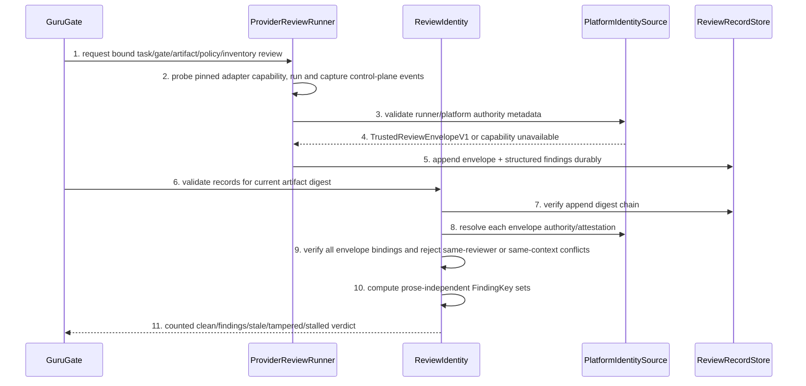

# Trusted Review Identity And Convergence Detailed Design

> `doc_type=usecase` | `l2_status=v1`
> `chapter_status=ready_for_review_after_migration_exception`
> Overview owner: design-main §4 UNIT-review-identity | TECH-005

### UNIT-review-identity

## 1. 单元职责

承接 BHV-006。唯一拥有 provider-scoped reviewer/context principals、不可替代的 independence predicate、`TrustedReviewEnvelopeV1`、trusted runner/platform metadata source、record durability/tamper detection、semantic finding fingerprint、route count 与 stagnation verdict。它消费 current digest，不选择 artifact inputs、不修改 findings；reviewer 的启动与 capture 只能经 Extension 安装并固定版本的 provider runner adapter。

正向依赖：PlatformIdentitySource、SemanticDigestService、append-only ReviewRecordStore。反向禁止：不得信任 worker self-report、run id、review prose 或 user-editable record fields作为 identity。

## 2. 行为定义

### 2.1 接口定义

```python
@dataclass(frozen=True)
class TrustedReviewerIdentity:
    provider: Literal["codex", "claude"]
    reviewer_id: str
    worker_id: str
    thread_or_channel_id: str
    context_id: str
    platform_attestation_ref: str

@dataclass(frozen=True)
class ReviewAuthority:
    authority_kind: Literal["platform_attestation", "extension_runner_capture"]
    authority_id: str
    adapter_id: str
    adapter_version: str
    adapter_digest: str
    executable_realpath: str
    executable_version: str

@dataclass(frozen=True)
class TrustedReviewEnvelopeV1:
    schema_version: Literal[1]
    envelope_id: str
    authority: ReviewAuthority
    trusted_identity: TrustedReviewerIdentity
    task_id: str
    gate: str
    artifact_digest: str
    policy_version: str
    policy_digest: str
    inventory_digest: str
    result: Literal["clean", "findings", "blocked"]
    max_severity: str
    findings_digest: str
    raw_capture_digest: str
    started_at: str
    completed_at: str

@dataclass(frozen=True)
class FindingKey:
    rule_id: str
    artifact_key: str
    location_anchor: str
    invariant_id: str | None
    evidence_digest: str
    semantic_category: str

def validate_review_identity(record: "ReviewRecordV2", current_digest: str, platform: "PlatformIdentitySource") -> "ReviewVerdict": ...
def fingerprint_finding(finding: "StructuredFinding") -> FindingKey: ...
def evaluate_convergence(history: tuple["ReviewRecordV2", ...], current_digest: str) -> "ConvergenceVerdict": ...

class ProviderReviewRunner(Protocol):
    def probe_capability(self, request: "ReviewRequest") -> "IdentityCapability": ...
    def run_and_capture(self, request: "ReviewRequest") -> TrustedReviewEnvelopeV1: ...
```

Independence is not full-tuple uniqueness. For records on the same gate, artifact digest and policy version, define `reviewer_principal=(provider, reviewer_id)` and `context_principal=(provider, context_id)`. Two trusted records are eligible to count as independent only when both principals differ. Equality of either principal is `IdentityDuplicate` for independence counting, even when `run_id`, `worker_id`, `thread_or_channel_id` or `platform_attestation_ref` differs. Worker/thread/attestation fields remain mandatory lineage and audit evidence, but changing them never substitutes for a distinct reviewer or context. `opposite` is a provider selection policy, not an identity value; it must resolve to platform-trusted metadata before record acceptance。

The one-time `delivery-control` bootstrap burn may consume a same-provider Codex check only under the exact user directive `关闭调用claude` and the task-local schema-v3 migration authorization. Its migration verifier accepts only the default official channel/session stores, run-derived channel/worker identity, one Codex check-only turn, and an invocation contract that binds the exact pre-launch digest, deterministic-result digest, provider tuple and directive. The final captured Worker message must parse and normalize to the exact selected implementation-review record, while the pre-launch index, post-worker index, current worktree and final burn CAS digests must remain equal. Its platform-issued thread/session id and raw channel/control-plane/session digests are still lineage evidence only: `independence_claim=none` and `trusted_review_envelope_eligible=false`. It is not a `TrustedReviewEnvelopeV1`, supplies neither `reviewer_id` nor `context_id`, cannot count toward normal route review policy, cannot authorize semantic-review cutover, and cannot be copied to another task, slice, digest, quote or burn.

## 3. 核心数据结构

`ReviewRecordV2` required: `schema_version, run_id, trusted_envelope, findings[], reviewed_artifacts[], record_prev_digest, record_digest`。Envelope 必须逐字段绑定 `task_id/gate/artifact_digest/policy_version/policy_digest/inventory_digest/result/max_severity/findings_digest`；`findings_digest` 是 canonical structured findings 的 typed digest，不能只 hash prose。Record digest covers canonical fields including envelope/findings but excludes storage newline。Append chain detects deletion/reorder/edit。

Finding fingerprint excludes message/title/prose/order. It uses stable rule id, manifest artifact key, heading/symbol anchor, invariant id, canonical evidence digest and semantic category。Location line number may be audit metadata but not fingerprint, because preceding edits shift lines。

### 3.1 错误枚举

| Error | Trigger | Closure |
| --- | --- | --- |
| `IdentityMissing` | trusted metadata absent | record not counted |
| `IdentityUntrusted` | source is worker/Agent text or unsupported provider | blocked/degraded |
| `IdentityCapabilityUnavailable` | installed adapter/provider version cannot expose runner-issued authority plus platform reviewer/context metadata outside assistant prose | block before launch; no manual/self-report fallback |
| `IdentityDuplicate` | same reviewer principal OR same context principal already counted for the current gate/digest/policy | audit only, count once |
| `EnvelopeBindingMismatch` | envelope task/gate/artifact/policy/inventory/result/severity/findings digest differs from request or parsed structured verdict | hard block, preserve raw capture |
| `RecordTampered` | canonical digest/append chain mismatch | hard block all later chain records |
| `ArtifactStale` | record digest differs current | stale/read-only |
| `FindingMalformed` | missing stable rule/location/evidence/category | findings/blocked, no clean |
| `ReviewStalled` | same FindingKey set over two repairs with no semantic artifact delta | STALLED terminal |

### 3.2 Trusted authority, runner capture and durable store

Identity authority is capability-specific:

| Source | Accepted fields | Trust result |
| --- | --- | --- |
| platform-issued immutable worker/thread/context metadata delivered in the provider event stream or signed attestation outside worker prose | provider, reviewer/worker id, thread/channel id, context id, attestation ref | trusted when the pinned adapter validates event schema/reference and binds its raw capture digest |
| Extension-managed provider runner | manifest/adapter id+version+digest, executable realpath/version, runner invocation id and captured event-stream digest | trusted only for the installed adapter boundary and only when its capability probe proves all required platform identity fields are available |
| interactive user TTY metadata | manual-review actor and TTY/session reference only | trusted for the manual actor; never invents a second model reviewer |
| task JSON, review output, assistant text, environment text supplied by a worker, `--as`, run id, provider label | none | untrusted/self-asserted |
| provider CLI/platform without the required immutable reviewer and context metadata | none | `IdentityCapabilityUnavailable`; required independent review blocks rather than degrading |

Retrying with the same trusted reviewer principal or the same trusted context principal remains one independence lineage regardless of a new run, worker, thread or process. Copied identity metadata remains untrusted. `PlatformIdentitySource` is the only adapter allowed to construct `TrustedReviewerIdentity`.

`guru_review_runner.py` 是计划中的 Extension asset。它在启动 reviewer 前固定 request 的 task/gate/artifact/policy/inventory digests，校验已安装 adapter 与 `extension-manifest.json` 的 hash/version/realpath，先执行 capability probe，再以 provider-specific structured event mode 启动进程。Adapter 只从进程控制面或平台 event stream 读取 provider-issued reviewer/worker/thread/context/attestation fields；assistant 输出中的同名 JSON、prompt 回显、`--as` 和环境变量一律不进入 identity。Runner 将结构化 verdict canonicalize 后计算 result/severity/findings digest，与启动前 request 一起写入 envelope，并保留 raw event capture digest。进程非零、event stream 不完整、required identity 缺失或 verdict/envelope 不一致均不产生可计数记录。

可行性边界是 fail closed，而不是补造统一 provider API：Codex/Claude adapter 只有在受支持且已 pin 的 CLI/platform 版本实际暴露所需 control-plane ids 时才返回 `capable`；否则在消费 review token 前返回 `IdentityCapabilityUnavailable`。Platform-signed attestation 可提供更强来源真实性；仅有本地 runner capture 时，信任边界是“阻止 worker prose 自报冒充”，不宣称抵御拥有 repo/runner credentials 的恶意本机操作者。

The record store uses one task/gate lock, writes a complete framed JSON line to a temporary or locked append descriptor, calls `flush` and `fsync`, then fsyncs the parent when the file is first created. Each row carries `record_prev_digest` and `record_digest`. A torn final row is reported and may be truncated only by explicit recovery; a corrupt middle row blocks all later rows. Readiness commands are read-only and never repair the log。Task JSON/JSONL hash chains provide framing、ordering、torn-write and accidental-edit detection only；它们不是 MAC/signature，不得描述为 malicious rewrite security。

Each finding has derived state `open|resolved|reopened`. `resolved` requires the finding key to disappear after a semantic artifact delta plus verification evidence; reappearance of the same key becomes `reopened` without resetting its first-seen ordinal. Two consecutive repair ordinals with the same open/reopened key set and no semantic delta produce `ReviewStalled`.

## 4. 逐行为设计

### 4.1 Record validation



Order: tamper chain → runner/platform authority → envelope task/gate/artifact/policy/inventory/result/severity/findings bindings → reviewer/context conflict filtering → convergence. A `clean` record containing findings or medium+ severity is malformed. Unsupported platform cannot be “manual independent”；required review 永远 block，只有 policy 明确标为 supplemental 的 evidence 才可保留为不计数 audit。

### 4.2 Convergence

For each current digest generation, compare structured FindingKey sets and artifact semantic digest between repair ordinals。Same set + no artifact semantic delta for two consecutive repairs → STALLED。Message rewrite, run id, line shift, reviewer identity change alone do not reset stagnation。New evidence_digest/rule/location/invariant or artifact semantic delta may continue within max repairs。

### 4.3 失败收口

Tamper blocks the chain from first corrupt record onward; preserve file and report offset/digest, do not rewrite history。Stale/duplicate records remain audit-visible but do not count。STALLED emits first unresolved finding and one recovery decision, not another automatic review。

## 5. 状态 / 边界

Records append-only per gate/task。Current review readiness is derived, not stored as mutable boolean。Legacy records lacking trusted identity remain visible stale/untrusted。Identity provider policy comes from DeliveryPolicy; ReviewIdentity only validates resolved metadata。

## 6. 数据合同

- PlatformIdentitySource is read-only and not user-editable task JSON。
- `run_id` is event identity only, never independence proof。
- `TrustedReviewEnvelopeV1` is issued only by the pinned runner/platform adapter and binds the complete review request plus canonical verdict；assistant prose cannot author or amend it。
- Hash-chain validity is durability evidence, not authenticity against a malicious local writer。
- Reviewer `message`/title/order excluded from FindingKey。
- Low/P3 follow-up remains a finding record but policy may not block; it cannot mutate planning digest itself。

## 7. 测试映射

| Path | Command | Expected result |
| --- | --- | --- |
| non-substitutable independence dimensions | `python3 -m unittest guru-template.overlay.tests.test_review_identity.ReviewIdentityTest.test_exact_key` | same reviewer with new worker/thread/run id counts once; different reviewer in the same context counts once; only trusted records with both reviewer and context principals distinct can provide two independent counts |
| self-report spoof | `test_worker_strings_are_untrusted` | blocked/untrusted |
| tamper chain | `test_edit_delete_reorder_detected` | first corrupt offset reported; later records ignored |
| stale digest/policy | `test_stale_record_not_counted` | audit visible, readiness false |
| prose-independent fingerprint | `test_message_and_line_shift_do_not_change_key` | equal FindingKey |
| semantic evidence change | `test_new_evidence_changes_key` | different key |
| stagnation | `test_two_no_delta_repairs_stall` | STALLED, no next review launch |
| authority | `test_only_platform_identity_adapter_can_attest` | worker/task/env identity strings are rejected |
| envelope binding | `test_trusted_envelope_binds_task_gate_artifact_policy_inventory_and_verdict` | any task/gate/artifact/policy/inventory/result/severity/findings mutation is `EnvelopeBindingMismatch` |
| runner capability | `test_provider_runner_requires_control_plane_identity_capability` | supported captured metadata is accepted; prose-only/unsupported provider blocks before launch |
| local threat boundary | `test_hash_chain_is_not_used_as_identity_authority` | a valid recomputed task JSON chain without runner/platform authority remains untrusted |
| durable append | `test_concurrent_append_is_framed_locked_and_fsynced` | no interleaving/loss; torn tail recoverable; corrupt middle blocked |
| finding lifecycle | `test_resolved_and_reopened_do_not_reset_history` | stable key preserves first-seen/repair history |
| error enum matrix | parameterized `test_error_enum_closure_matrix` | `IdentityMissing`, `IdentityUntrusted`, `IdentityCapabilityUnavailable`, `IdentityDuplicate`, `EnvelopeBindingMismatch`, `RecordTampered`, `ArtifactStale`, `FindingMalformed`, `ReviewStalled` each remains non-clean and cannot satisfy readiness |
| existing review policy | `bash guru-template/overlay/verify/tests/run_tests.sh` | route review regression green |

## 8. 不得补造清单

- 不得用新的 run id、worker id、thread id、attestation ref、不同文案或 line number 变化绕过相同 reviewer/context 冲突，或证明独立/新 finding。
- 不得信任 task-local Agent/worker 自报 identity。
- 不得把 `--as`、prompt/assistant JSON、环境变量或重算 hash chain 当作 `TrustedReviewEnvelopeV1` authority。
- 不得在 adapter capability unavailable 时启动昂贵 reviewer 后再降级为 self-report/manual independent。
- 不得修写 tampered history 来“恢复 clean”。
- 不得让 stale/duplicate/malformed record 满足 review count。

## 9. 不变量矩阵

| invariant_id | rule | owner | positive_case | negative_case | route_if_missing |
| --- | --- | --- | --- | --- | --- |
| INV-REVIEW-001 | records sharing a trusted reviewer principal or trusted context principal must-not count as independent | UNIT-review-identity | both provider-scoped reviewer and context principals differ | same reviewer with new worker/thread/run id, or different reviewer in the same context, counts twice | block readiness |
| INV-REVIEW-002 | prose-only finding changes must-not reset stagnation | UNIT-review-identity | evidence key stable | message rewrite appears new | STALLED |
| INV-REVIEW-003 | tampered/stale records must-not count as current clean | UNIT-review-identity | chain+digest valid | edited record accepted | hard review block |
| INV-REVIEW-004 | review record durability must-not be described as malicious-rewrite security or bypass lock/hash-chain/fsync | UNIT-review-identity | authority is validated separately while framed append detects torn, reordered or accidental edits | a recomputed task JSON chain authenticates a reviewer or a concurrent/torn write counts clean | hard review block |
| INV-REVIEW-005 | TrustedReviewEnvelopeV1 must bind trusted runner/platform authority plus task, gate, artifact, policy, inventory, result, severity and findings digest without self-reported identity fallback | UNIT-review-identity | pinned capable adapter captures platform control-plane identity and every envelope binding matches | assistant prose, `--as`, unsupported adapter or a mutated binding counts as independent clean | capability or envelope hard block |

当前状态保持 `ready_for_review_after_migration_exception`；未产生 method review evidence。
