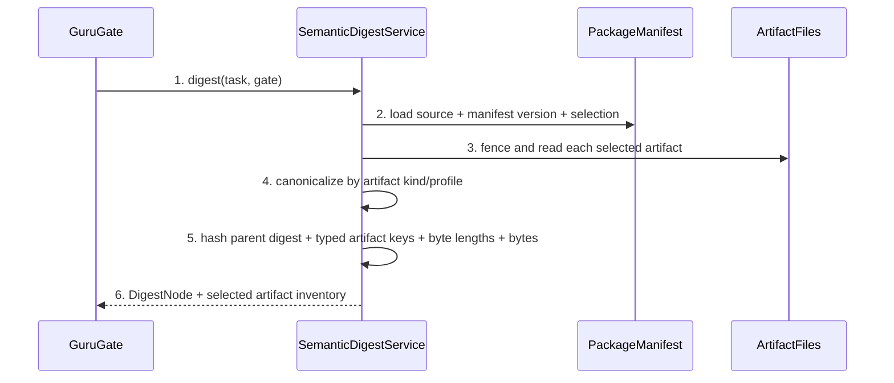

# Semantic Dependency Digest Detailed Design

> `doc_type=service` | `l2_status=pending` | L2 exception: design-main §9
> `chapter_status=ready_for_review_after_migration_exception`
> Overview owner: design-main §4 UNIT-semantic-digest | TECH-004

### UNIT-semantic-digest

## 1. 单元职责

承接 BHV-006。唯一拥有 artifact selection、per-artifact canonicalization、Full manifest version/source/closure、dependency digest 与 invalidation explanation。GuruGate/ReviewIdentity 消费结果；本单元不验证 reviewer identity、不写 review record、不把 execution evidence 纳入 planning digest。

正向依赖：task metadata、requirement/design manifest parser、stable section parser、hashlib。反向禁止：不得依赖 review prose、mtime、absolute workspace path、worker event 或 implementation review outcome。

## 2. 行为定义

### 2.1 接口定义

```python
class ArtifactKind(str, Enum):
    MARKDOWN_SECTION = "markdown_section"
    MARKDOWN_FILE = "markdown_file"
    CANONICAL_JSON = "canonical_json"
    CANONICAL_PACKAGE = "canonical_package"

@dataclass(frozen=True)
class ArtifactSelection:
    source: str
    manifest_version: int
    artifact_key: str
    kind: ArtifactKind
    repo_relative_path: PurePosixPath
    section_anchor: str | None
    canonicalization_profile: str

class SemanticDigestService(Protocol):
    def select(self, task_dir: Path, gate: Literal["requirements", "overview", "detail", "implement"]) -> tuple[ArtifactSelection, ...]: ...
    def canonicalize(self, artifact: ArtifactSelection, raw: bytes) -> bytes: ...
    def digest(self, task_dir: Path, gate: str) -> "DigestNode": ...
    def explain_invalidation(self, previous: "DigestNode", current: "DigestNode") -> "InvalidationResult": ...
```

## 3. 核心数据结构

### 3.1 Full manifest contract

`design-package/manifest.json` 必填 `schema_version=2`, `source=task.json.design_package`, overview explicit files, detail selection rule, ordered files, canonicalization profile, exclusions。Detail file set 必须与 design-main `chapter_target` 双向相等；未知 manifest version fail closed。Requirements source 是 `task.json.requirement_package/manifest.yaml` 的 canonical_root/excludes。

### 3.2 Per-artifact canonicalization

| Artifact | Selection | Canonicalization | Explicit exclusions |
| --- | --- | --- | --- |
| `prd.md` | whole task behavior extraction | UTF-8, BOM reject, CRLF→LF, remove trailing horizontal whitespace only, preserve heading/content order | none |
| requirement package | manifest canonical_root recursive ordered files | key=`requirements:<relpath>` + normalized bytes; YAML manifest itself included | `canonical_excludes` dirs/files |
| overview | design manifest overview explicit files | key/path + normalized Markdown bytes | README/nav |
| detail | chapter_target closure ordered by manifest | one key per chapter; normalized Markdown bytes; no cross-file concatenation ambiguity | README/nav, execution evidence |
| gate/scope JSON | explicit schema fields | parse JSON then `json.dumps(sort_keys=True,separators=(",",":"),ensure_ascii=False)` | timestamps/audit fields only if schema declares non-semantic |
| implement | `implement.md` + scope/policy semantic JSON | normalized Markdown + canonical JSON | mutable implementation/verification JSONL |

“语义”不意味着擅自重排 Markdown list/table；除 CRLF/trailing horizontal whitespace 外内容变化保留。未来 AST canonicalization 需要新 profile/version，不能静默改变 v2 digest。

### 3.3 Dependency graph

```text
requirements = H(profile, selected requirement keys+bytes)
overview     = H(requirements, selected overview keys+bytes)
detail       = H(overview, selected chapter keys+bytes)
implement    = H(detail, implement plan, canonical scope/policy)
```

### 3.4 Cross-gate invalidation matrix

Invalidation is declared by artifact key, never inferred from filename proximity:

| Changed semantic input | requirements confirmation | overview reviews | detail reviews/confirmation | implementation evidence |
| --- | --- | --- | --- | --- |
| requirement package or normative `prd.md` behavior | stale | stale | stale | stale |
| Overview-selected section/file | current | stale | stale | stale |
| Detail-only chapter or Lite `design.md` detail section | current | current | stale | stale |
| `implement.md` or canonical scope/policy | current | current | current | stale |
| append-only implementation/verification/review event | current | current | current | current; only the changed evidence stream advances |
| excluded README, trace projection, timestamp-only audit artifact | current | current | current | current |

The service emits the exact changed artifact keys and invalidated descendants. In particular, a Lite detail-only edit cannot invalidate Overview; a real Overview edit must invalidate Detail. Unknown artifact kinds fail closed instead of invalidating every Gate by default.

### 3.5 v1 to v2 evidence migration

这不是 record migration，而是单向 protocol cutover。V1 records are never rewritten in place, copied into V2, dual-written or auto-promoted. `guru_review_cutover.py` 只提供三个命令：

```text
guru_review_cutover.py plan --task-dir TASK --from v1 --to v2 --format json
guru_review_cutover.py activate --task-dir TASK --plan-file PLAN --expected-plan-digest DIGEST
guru_review_cutover.py status --task-dir TASK --format json
```

`plan` 严格只读，输出 `ReviewCutoverPlanV1`，绑定 task id、V1 store digest、每个 gate 的 V1 profile/digest/source inventory、候选 V2 profile/digest/inventory、policy digest、required runner capability verdict、delivery-control predecessor snapshot digest 与 semantic-review self snapshot digest。任一 source inventory 不可重现时标记 `legacy_unverifiable` 并阻止 activate；V1 clean 不等于 V2 clean。

`activate` 获取 task review-protocol lock，重新计算并 CAS 比较 plan 的全部 digest/capability/snapshot，随后向 `review-records/review-cutover-v2.jsonl` durable append 唯一 `V2_ACTIVATED` marker（framed hash chain、file fsync、首次创建 parent fsync）。Marker commit 是唯一 authority switch：之前只有 V1 writer/readiness authority；之后 V1 writer 返回 `ReviewProtocolFrozen`，只有 V2 records 可参与 readiness。它不修改 `task.json.guru_gates.review_runs`，不把 V1 rows 写入 V2 store，也不存在同时读两套 clean count 的窗口。

`status` 严格只读，只能返回 `V1_ACTIVE`、`V2_ACTIVE_PENDING_REVIEW`、`V2_READY` 或 `BLOCKED`，并分别给出 active authority、current digests、missing V2 reviews 与 first corruption/conflict。检测到 marker 后仍有 V1 write、多个 authority marker、V1/V2 混合 readiness 或 snapshot drift 必须 `BLOCKED`，不得自动修复或回退。

Semantic-review slice 的 bootstrap 固定为同一 snapshot 的交叉证明：先由现行 V1 adapter 对已完成的 `delivery-control` predecessor snapshot 与 `semantic-review` self snapshot 分别产生 legacy implementation review；冻结两者 target inventory/digest 后执行 `plan`/`activate`；再由 Extension-managed V2 provider runner 对完全相同的 predecessor/self snapshot 分别重新 review 并写 `TrustedReviewEnvelopeV1`。从 legacy review 开始到 V2 re-review 完成，任一 target/policy/inventory change 都使 bridge stale 并重启，不允许用旧 V1 clean 或 V1/V2 各一条拼成 readiness。只有两份 V2 current review 满足 policy 后，状态才能成为 `V2_READY` 并开放下游 slice。

### 3.6 错误枚举

| Error | Trigger | Closure |
| --- | --- | --- |
| `ManifestMissing` / `ManifestVersionUnknown` | Full package no/unknown manifest | block Gate |
| `ManifestSelectionMismatch` | design-main refs differ from manifest/chapter files | block with missing/orphan set |
| `ArtifactPathEscape` | absolute/`..`/symlink out of repo | block before read |
| `ArtifactMissing` | selected file absent | block |
| `CanonicalizationInvalid` | invalid UTF-8/BOM/ambiguous section/JSON parse | block, no fallback hash |
| `DigestVersionStale` | evidence digest profile differs | mark stale/read-only |
| `CutoverPlanStale` | V1/V2 digest, inventory, policy, capability or predecessor/self snapshot differs from plan | no activation; regenerate plan |
| `ReviewProtocolFrozen` | V2 marker committed后尝试 V1 write | reject write; preserve legacy bytes |
| `CutoverMixedAuthority` | dual writer/reader, multiple activation authority or mixed V1/V2 readiness detected | BLOCKED; explicit recovery evidence required |

## 4. 逐行为设计

### 4.1 Select/canonicalize/digest



Hash framing includes schema/profile, artifact key length/value and content length/value, preventing concatenation collision. Absolute path never enters key. Parent digest is typed by gate. `explain_invalidation` compares inventories and reports added/removed/changed artifact keys plus parent change; it never infers cause from file mtime。

### 4.2 Full/light selection

Full always follows `task.json.design_package` → `manifest.json` → design-main chapter closure; missing/corrupt package cannot fall back to `design.md`. Light selection uses a deterministic fence-aware Markdown block state machine before exact unique `§1`/`§2` ATX-heading selection. A fenced-code block opens only with a valid opener of at least three matching backticks or tildes with at most three leading spaces, and closes only with the same marker character and a run length at least as long as the opener. Heading-like lines inside an open fence are content and never section anchors; a shorter or opposite-marker fence does not close it. Only unfenced exact anchors delimit sections. Missing or duplicate unfenced anchors return `CanonicalizationInvalid` with no whole-file or regex fallback. Requirement package present means canonical package + prd are both selected; absence is only legacy behavior, not valid for this task.

### 4.3 失败收口

Any selection/canonicalization error returns no digest and prevents review/confirmation. Old v1 digest remains auditable stale; no conversion to v2 clean. Execution JSONL append never appears in selection and therefore cannot invalidate planning evidence。

Cutover error 同样不允许 fallback：activate CAS 失败时不写 marker；marker 已 durable 后 V1 永久 frozen。若 marker/log 中间损坏，`status` 只报告 `BLOCKED`，不通过自动回退 V1 恢复 readiness。

## 5. 状态 / 边界

DigestNode immutable fields: gate, profile/version, parent digest, artifact inventory `(key, content_digest)`, final digest. Cache key includes raw file stat as optimization but cache verification compares content digest; mtime is never final truth. Changing manifest selection invalidates affected gate/downstream by design。

## 6. 数据合同

- All JSON canonicalization field exclusions are schema allowlists, not name regexes。
- Package source/version/selection stored in DigestNode evidence for replay。
- Finding fingerprints/reviewer keys are ReviewIdentity responsibilities and excluded from artifact digest。
- Timestamp changes in normative Markdown remain semantic unless moved to an explicitly excluded audit artifact。
- Cutover plan/marker bind artifact and inventory digests but remain audit/control evidence；它们不进入 planning digest，避免 activation 自己使 review stale。

## 7. 测试映射

| Path | Command | Expected result |
| --- | --- | --- |
| artifact profiles | `python3 -m unittest guru-template.overlay.tests.test_semantic_digest.CanonicalizationTest` | stable typed canonical bytes |
| CRLF/trailing space | `test_allowed_format_noise_is_stable` | same v2 digest |
| Markdown/list semantic change | `test_content_reorder_changes_digest` | changed digest |
| Full manifest closure | `test_full_manifest_missing_or_orphan_chapter` | explicit mismatch error |
| requirement exclusions | `test_requirement_traceability_is_excluded` | trace audit change no requirements digest change |
| execution evidence | `test_execution_jsonl_never_changes_planning_digest` | all planning digests stable |
| path/UTF8/JSON failures | parameterized negative tests | exact error, no fallback digest |
| legacy | `test_v1_evidence_stays_stale` | no auto-upgrade |
| invalidation matrix | `test_cross_gate_invalidation_matrix` | only declared descendants stale; Lite detail leaves Overview current |
| fenced Light headings | `test_light_section_parser_ignores_fenced_heading_tokens` | parameterized backtick/tilde and longer-opener cases keep fenced `## §2` text inside Overview; the later unfenced exact `## §2` is the sole Detail anchor; a document with only a fenced counterfeit anchor fails `CanonicalizationInvalid` |
| migration audit | `test_v1_to_v2_is_read_only_and_audited` | v1 bytes unchanged; no silent clean promotion |
| cutover CLI/state | `python3 -m unittest discover -s guru-template/overlay/verify/tests -p 'test_review_cutover.py'` | plan is read-only; activate CAS-switches once; status exposes exactly one authority |
| unchanged bootstrap snapshots | same module `test_semantic_slice_legacy_then_v2_rereview_unchanged_snapshots` | predecessor/self receive legacy review then V2 re-review; any snapshot/policy/inventory drift blocks |
| no migration/dual readiness | same module `test_v1_is_frozen_without_migration_dual_write_or_mixed_readiness` | V1 bytes remain audit-only and cannot combine with V2 count |
| error enum matrix | parameterized `test_error_enum_closure_matrix` | digest errors plus `CutoverPlanStale`, `ReviewProtocolFrozen`, `CutoverMixedAuthority` return no current V2 readiness and never fall back |
| existing Gate | `bash guru-template/overlay/verify/tests/run_tests.sh` | digest/review regression green |

## 8. 不得补造清单

- 不得用 mtime、absolute path、basename-only key 或 unframed concatenation。
- 不得在 Full package failure 时回退 task-local design.md。
- 不得通过 prose regex 删除未声明的 “noise” 字段。
- 不得把 review/finding/worker execution evidence纳入 planning digest。
- 不得 auto-migrate/dual-write V1/V2、在 activation 后写 V1，或用 V1+V2 混合 count 宣称 ready。
- 不得让 semantic-review 用变化后的 self/predecessor snapshot 完成 bootstrap re-review。

## 9. 不变量矩阵

| invariant_id | rule | owner | positive_case | negative_case | route_if_missing |
| --- | --- | --- | --- | --- | --- |
| INV-DIGEST-001 | append-only execution evidence must-not change planning digests | UNIT-semantic-digest | JSONL append stable | review becomes stale | block digest rollout |
| INV-DIGEST-002 | Full selection failure must-not fall back to light design.md | UNIT-semantic-digest | package error blocks | pointer file hashed as detail | artifact error |
| INV-DIGEST-003 | canonicalization profile change must-not reuse older digest as current | UNIT-semantic-digest | v1 stale | v1 silently v2 clean | block evidence reuse |
| INV-DIGEST-004 | artifact/section boundary parsing and semantic changes must-not invalidate unrelated gates or preserve dependent gates | UNIT-semantic-digest | fence-aware unfenced section boundaries plus the declared artifact-key matrix invalidate only descendants | a fenced `## §2` splits Lite sections, Lite detail stales Overview, or Overview change leaves Detail current | block digest rollout |
| INV-DIGEST-005 | v1-to-v2 review cutover must freeze v1 and require managed-adapter v2 re-review of unchanged predecessor/self snapshots without auto-migration, dual write or mixed readiness | UNIT-semantic-digest | read-only plan and CAS activation switch one authority before current V2 reviews | V1 rows are promoted, V1 and V2 each contribute a clean, or changed bridge snapshots are accepted | block cutover and downstream slices |

当前状态保持 `ready_for_review_after_migration_exception`；未产生 method review evidence。
