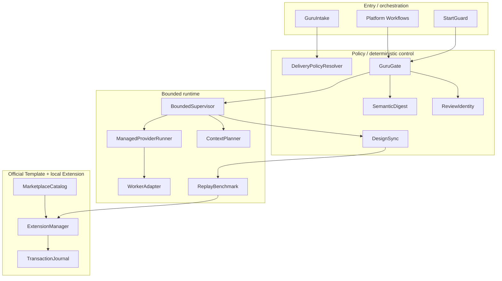
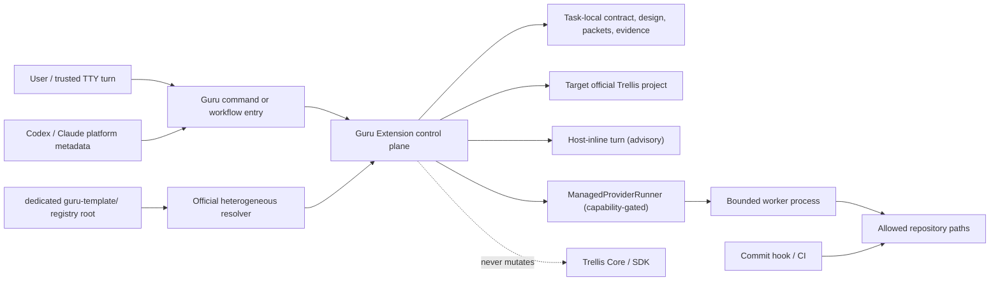
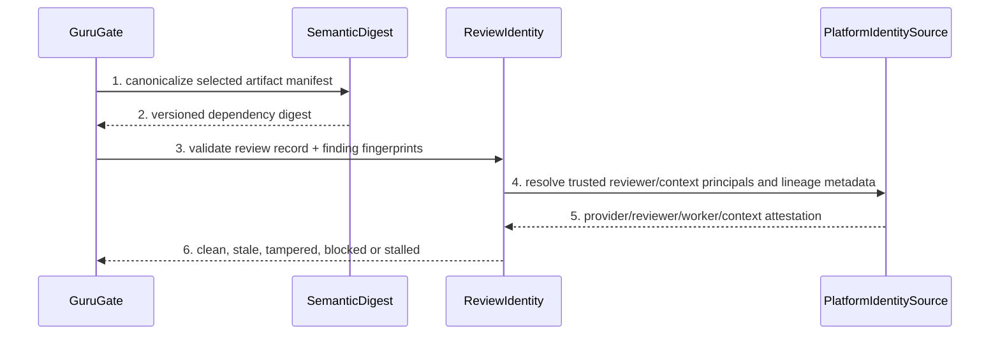
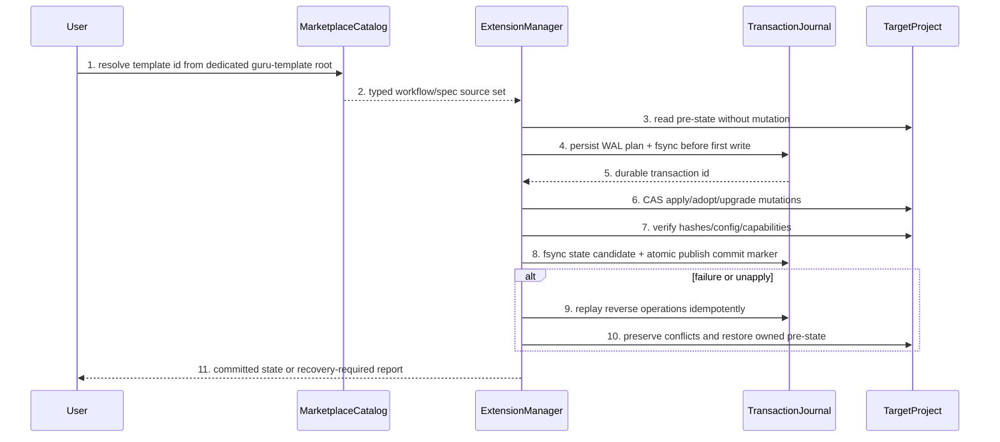

# Custom-first Guru Delivery Control Plane

## 1. 设计输入、约束与兼容决策

### 1.1 需求承接

| Capability | Priority | Requirement source | Architecture response |
| --- | --- | --- | --- |
| CAP-001 风险比例交付 | P0 | REQ-UC-001, REQ-UC-002, REQ-UC-003 | intent × execution_route 两轴策略、risk packet、可信确认、有限监督 |
| CAP-002 语义收敛 | P0 | REQ-UC-005, REQ-UC-006 | 规范化 artifact manifest、依赖 digest、独立 review identity |
| CAP-003 官方可撤销分发 | P0 | REQ-UC-007 | dedicated registry root、异构 resolver、durable Extension transaction |
| CAP-004 成本递减 | P1 | REQ-UC-004 | task-family fingerprint、context fence、cold/warm benchmark |
| CAP-005 跨产物一致 | P1 | REQ-UC-005 | project SSOT discovery、impact priority、REQ/BHV→UNIT→symbol→test trace |

### 1.2 硬约束

1. 功能阶段不修改 `packages/cli/src/**` 或 `packages/core/**`。
2. Template Registry 的唯一源根是仓库顶层 `guru-template/`；Workflow 与 Spec 使用异构路径 resolver，不假设同形目录。
3. 规则正文只存在于 Spec；Workflow/Skills/Agents 负责编排，Python 负责确定性状态、摘要、锁、事务和 Gate。
4. 用户确认、review identity 和 capability 不能由任意 Agent 字符串自报。
5. 所有 worker 循环有预算和终态；预算耗尽只能终止，绝不跳过 Gate。
6. full-chain 正式设计 SSOT 是本目录；任务内 `design.md` 仅为指针摘要。

### 1.3 显式假设与向后兼容

- 目录策略：task-local 版本内聚包。原因是本任务同时修正规范、Gate 与安装边界，尚未形成可发布项目版本；归档/发布时再迁移到项目级版本化设计，迁移不得改变 UNIT/BHV token。
- Python runtime：沿用仓库现有 Python 3 + 标准库风格；新增第三方依赖必须重新进入 TECH-002 决策。
- `backward_compatibility_required=yes`：仅保护现有稳定 Template id、现有 `apply.sh <target> <platform>` 参数入口和可读 legacy review/install records；不保护内部 Python symbol 或错误文案。
- confirmation ref：DEC-001 的用户原话 `好，接受` 仅确认 Custom-first/Core-zero/reversible/de-fork-later 产品边界；不等价于 requirements/detail Gate lifecycle confirmation。

## 2. 行为集合与架构回指

| Behavior | Requirement source | Core UC | Primary owner | Supporting owners |
| --- | --- | --- | --- | --- |
| BHV-001 | REQ-UC-001 | UC-01 | UNIT-delivery-policy | UNIT-bounded-supervisor, UNIT-replay-benchmark |
| BHV-002 | REQ-UC-002 | UC-02 | UNIT-start-guard | UNIT-delivery-policy, UNIT-replay-benchmark |
| BHV-003 | REQ-UC-003 | UC-03 | UNIT-bounded-supervisor | UNIT-delivery-policy, UNIT-start-guard, UNIT-replay-benchmark |
| BHV-004 | REQ-UC-004 | UC-04 | UNIT-context-reuse | UNIT-replay-benchmark |
| BHV-005 | REQ-UC-005 | UC-05 | UNIT-design-sync | UNIT-marketplace-catalog, UNIT-replay-benchmark |
| BHV-006 | REQ-UC-006 | UC-06 | UNIT-semantic-digest | UNIT-review-identity, UNIT-bounded-supervisor, UNIT-replay-benchmark |
| BHV-007 | REQ-UC-007 | UC-07 | UNIT-extension-manager | UNIT-marketplace-catalog, UNIT-replay-benchmark |

每个 BHV 通过上表回指一个核心 UC；UC 承接表再回指 owner/chapter，形成双向人审链。BHV 的 Given/When/Then、失败语义和 approved scope 仍以 `../prd.md` 为准。

## 3. 两轴选择与三种执行拓扑

### 3.1 Schema

```text
IntentKind = implementation | review | research | debug | docs | config | ops
ExecutionRoute = small_inline | micro_task | lite_task | full_chain
ExecutionTopology = host_inline | managed_single | managed_parallel
EnforcementMode = advisory | enforced

DeliverySelection {
  intent: IntentKind
  execution_route: ExecutionRoute
  risk: low | medium | high | unknown
  first_value_metric: first_code | first_verified_evidence | first_accepted_artifact
  write_capability: none | task_artifacts | scoped_repository
  required_artifacts: string[]
  terminal_conditions: string[]
}

ExecutionEnvelopeV1 {
  schema_version: 1
  envelope_id: string
  selection_generation: integer
  intent: IntentKind
  execution_route: ExecutionRoute
  topology: ExecutionTopology
  enforcement_mode: EnforcementMode
  write_capability: none | task_artifacts | scoped_repository
  task_id?: string
  slice_id?: string
  slice_packet_digest?: sha256
  risk_packet_digest?: sha256
  confirmation_attestation_digest?: sha256
  scope_fingerprint: sha256
  policy_snapshot_digest: sha256
  required_gate_ids: string[]
  budget_profile_id: string
  first_value_kind: first_scoped_code_diff | first_verified_evidence | first_accepted_artifact
  terminal_conditions: string[]
}
```

优先级规则：

1. 信任/安全与只读 intent 约束先于 route；`review`/纯 `research` 的 `write_capability=none`，即使 execution_route 为 Full 也不得写实现。
2. risk promotion 先于用户 route 偏好；high/unknown 中带高风险信号必须 `full_chain`。
3. Intent 决定允许动作、输出和 first-value 定义；ExecutionRoute 决定 artifact、预算、review/confirmation 强度；ExecutionTopology 只决定哪些预算能够由运行时硬执行。
4. Route 只能增加该 route 明确列出的 Gate，不能授予 intent 禁止的能力，也不能让 Inline/Micro/Lite 因存在 task 目录而继承 Full requirements/overview/detail/start/slice Gate。
5. N/A 必须显式：非 implementation intent 的 TTFC=`N/A`，改用 first verified evidence/artifact；纯 docs/research 没有 business code diff 要求。
6. `ExecutionEnvelopeV1` 是 selection 的不可变运行快照；可选字段只能按下表出现。字段缺失不能由 worker 猜测，字段多报也不能提升权限。

### 3.2 Intent × ExecutionRoute Matrix

| Intent | small_inline | micro_task | lite_task | full_chain | First value / N/A rule |
| --- | --- | --- | --- | --- | --- |
| implementation | 单文件可逆低风险改动 | bounded paths/max files | 单层有限设计 | 高风险/跨层完整链 | first scoped code diff |
| review | 单个 diff 机械/只读检查 | bounded snapshot review | 一个独立语义 review | 高风险跨包双 clean policy | first evidence-backed verdict；code diff N/A |
| research | 单一事实查询 | bounded source set | 多源比较与结论 | 架构/安全高风险研究包 | first verified source set；code diff N/A |
| debug | 明确根因的一点修复 | 复现+单 owner | 多组件 RCA | 重复失败/高风险全链 | first reproduction or scoped fix |
| docs | 单文档更正 | bounded docs set | 跨文档 SSOT 同步 | 版本化需求/设计治理 | first accepted artifact；code diff N/A |
| config | 单个可逆非敏感键 | bounded config patch | 多平台配置同步 | 权限/secret/runtime 高风险 | first dry-run plan |
| ops | 只读状态/诊断 | 本地可回滚操作 | 多步骤恢复演练 | 发布/迁移/数据损失风险 | first verified status or dry-run；code diff N/A |

不支持的组合不静默降级：例如 `review + scoped_repository write` 非法，必须拆为 review verdict 与后续 implementation intent；`ops + small_inline` 仅允许只读或明确可逆本地动作。

### 3.3 Route-specific envelope 与 Gate profile

| Route / capability | Allowed topology | Conditional envelope fields | Route-owned Gate/artifact minimum | First-value contract |
| --- | --- | --- | --- | --- |
| `small_inline`, writable | `host_inline` only; advisory | `task_id/slice_id/slice_packet/risk/confirmation` absent | ephemeral intent + normalized scope + final deterministic check；Full Gate forbidden | first scoped code diff, p95 target/hard policy value 120 s |
| `micro_task`, writable | `host_inline` advisory or `managed_single` enforced | `task_id` optional for persisted trace；all packet/risk/confirmation fields absent；`slice_id` absent | micro contract + explicit paths/max-files；0 confirmation；Full Gate forbidden | first scoped code diff within 300 s |
| `lite_task`, writable | `managed_single` preferred; `host_inline` is declared advisory fallback | `task_id` required；`slice_id` optional for one named unit；no slice packet；confirmation digest only when one current medium-risk decision batch exists；any high signal promotes Full | compact PRD + contract-impact design delta only + at most one semantic review；Full Overview/Detail/start packet Gate forbidden | first scoped code diff within 600 s |
| `full_chain`, writable | `managed_single` or `managed_parallel` after eligibility proof | `task_id` and selected `slice_id/slice_packet_digest` required；current risk packet required before repository write；confirmation digest required only while packet has unresolved required critical/high decisions | formal requirements + design package + implementation trace + selected risk slice packet + policy-required current reviews | after current confirmation/eligibility, first scoped code diff in selected slice within 900 s |
| any route, `write_capability=none` | route limits remain: Small host-only, Micro/Lite host-or-single, Full single-or-independent parallel fanout | task is optional below Full and required for Full evidence package；slice/packet/risk/confirmation are absent unless the read itself has a separately classified sensitive/high-risk decision；never includes implementation StartGuard | intent-specific read fence + evidence/artifact Gate only；no implementation start, writable slice packet, or TTFC | first verified evidence/verdict/source set; implementation code diff is N/A |

`required_gate_ids` is an exact allow-list generated from the intent×route matrix, not a minimum to which callers may append inherited Full gates. Route promotion creates a new selection generation and envelope; it never mutates a lower-route envelope in place. `FirstValueEventV1` binds `event_id/envelope_id/run_id-or-host-turn/metric/monotonic_elapsed_ms/evidence_ref/evidence_digest/scope_fingerprint/observer` and is accepted once. A managed runner emits it from an observed scoped diff/evidence/artifact event；`host_inline` can only self-report it as advisory telemetry.

### 3.4 Topology and capability truth

| Topology | Runtime owner | What can be enforced | Explicit limitation |
| --- | --- | --- | --- |
| `host_inline` | current host turn | policy selection, pre/post scope diff and controllable Gate/commit boundaries | cannot intercept or kill the host model cycle, count every tool/wait/read, or prove actual context bytes；all live counters are advisory/unknown |
| `managed_single` | BoundedSupervisor → ManagedProviderRunner → one WorkerAdapter | subprocess/lease deadline, structured cycle/tool/wait/read events, tool-proxy/context fence, cancellation and one-writer scope when the capability probe is present | a local probe is not platform-signed identity or token truth；missing capability downgrades the stated field to unavailable and blocks any hard-budget claim |
| `managed_parallel` | one Supervisor with independent ManagedProviderRunner leases | same per-worker controls plus max-live/starts, dependency eligibility and disjoint target locks | Full only for independent packets or read-only fanout；shared/overlapping targets, missing predecessor proof or provider gaps force managed single/blocked, never optimistic parallelism |

The planned provider boundary lives in `guru_provider_runner.py`: ManagedProviderRunner owns process/channel lifecycle, tool/read proxy wiring, event framing and cancellation；provider-specific WorkerAdapter only builds the provider command and translates raw events, and cannot change the envelope, fabricate capabilities or sign reviewer/user identity. Current `.trellis/scripts/guru/guru_supervise.py::run_implement_slices` only prints dispatch JSON for direct sub-agents, while its legacy channel path has timeout/wait but no v2 event/counter/read-proxy contract；neither is `managed_*` evidence. Official Trellis 0.6.7 `task.py start` only mutates lifecycle state and runs a non-blocking hook, so it also creates no managed execution. The §11 bootstrap root orchestrator remains a one-task audited dispatch exception, not a fourth topology and not proof of any v2 budget.

### 3.5 Conservative live budget mirror

`DeliveryPolicyV1` owns the exact machine values；the detail chapter defines counting and resume semantics. The default route rows are: Small `45/120/600 s` planning/first-value/terminal, `4` model cycles, `16` tool calls, `0` waits, `64/96 KiB` planned/observed context, `2` duplicate reads, `1` repair, `0/0` live/started workers, `60 s` idle, `2` no-progress cycles, `0` confirmations；Micro `120/300/1200 s`, `8/32/2`, `256/384 KiB`, `4`, `1`, `1/1`, `120 s`, `3`, `0`；Lite `240/600/2700 s`, `14/64/4`, `512/768 KiB`, `6`, `2`, `1/2`, `180 s`, `3`, `1`；Full `900/900/5400 s`, `32/144/8`, `1536/2304 KiB`, `12`, `3`, `2/4`, `300 s`, `4`, `2`. Read-only intents take the component-wise minimum with the read-only cap `300/300/1800 s`, `10/40/3`, `384/576 KiB`, `4`, `1`, `1/2`, `120 s`, `3`；confirmation keeps the lower route cap and is normally zero. Only `managed_*` with the required observed capabilities makes these hard live budgets；host-inline reports the same thresholds but never labels unknown counters enforced.

## 4. 归属判定与三问理由

| Owner | Behaviors | 为什么属于它 | 为什么不属于别人 | 是否需独立存在 |
| --- | --- | --- | --- | --- |
| UNIT-marketplace-catalog | BHV-005, BHV-007 | catalog schema、dedicated root 与异构 path resolution 的唯一 owner | Extension Manager 只管理 target lifecycle，不拥有官方 source catalog | 是，官方分发边界 |
| UNIT-extension-manager | BHV-007 | durable lifecycle、ownership、WAL、rollback 在此收口 | copy wrapper 和 catalog 不能持久化 target transaction | 是，数据损失边界 |
| UNIT-delivery-policy | BHV-001, BHV-002, BHV-003 | intent/route/topology/risk/budget 与 ExecutionEnvelope snapshot 单一拥有 | Workflow 文案和 Supervisor 不应复制数字、继承 Full Gate 或提升权限 | 是，所有入口共享 |
| UNIT-semantic-digest | BHV-006 | canonical artifact manifest 与依赖 digest 在此唯一计算 | Review 只消费 digest，不应选择 hash 输入 | 是，证据有效性边界 |
| UNIT-review-identity | BHV-006 | non-substitutable trusted reviewer/context principals、trust source、tamper/fingerprint 在此校验 | Digest、run id 和 worker/thread 变化都不能证明 reviewer 独立性 | 是，信任边界 |
| UNIT-bounded-supervisor | BHV-001, BHV-003, BHV-006 | run state、ManagedProviderRunner lease、observed budget counters、dirty snapshot 与 progress 由单 writer 管理 | Policy 只给预算，WorkerAdapter 不能自判能力/终态 | 是，防无限循环与假 enforcement |
| UNIT-start-guard | BHV-002, BHV-003 | START_READY、risk/confirmation CAS 与 lifecycle compensation 在此组合 | after_start 非阻塞，不能独自承担硬前置 | 是，去 fork 的安全桥 |
| UNIT-context-reuse | BHV-004 | planned context manifest、managed actual-read ledger、fence、deterministic trim 与 reuse validity 在此选择 | Memory 不是 repo truth；planned bytes 也不是 actual reads | 是，成本策略 owner |
| UNIT-design-sync | BHV-005 | impact priority、project SSOT discovery 与 trace closure 在此判定 | 各文档/代码自行判断会形成双 SSOT | 是，跨产物边界 |
| UNIT-replay-benchmark | BHV-001~BHV-007 | cold/warm、全 intent/route 和 install recovery 的发布证据在此聚合 | 单元测试不能证明系统级预算与可撤销 | 是，release gate |

实现依赖图按拓扑 eligibility 执行：Wave 1=`delivery-control` + `marketplace-catalog`；Wave 2=`semantic-review` + `extension-manager`；Wave 3=`bounded-context`；Wave 4=`design-sync-replay`。当前聚合事实为 6 个 slice packet、65 个唯一 target、56 个 invariant triple、target overlap=0；这些数字来自 packet JSON，不来自章节摘要。`guru_gate.py` 与 unified regression suite 由 Wave 1 `delivery-control` 唯一拥有，使 v2 Full/high decision inventory 在 Detail review/confirm 前即可 fail closed；`semantic-review` 只拥有 review identity/digest convergence，避免跨 slice 双重 ownership。完成必须有 current clean implementation review + deterministic/invariant/provider evidence，Supervisor 只消费 packet `depends_on` 的拓扑序、typed `PreTaskDirtySnapshotV1` 和 digest-bound read-only predecessor snapshots。Pre-task unrelated state 由 HEAD/index/worktree bytes+mode 与 submodule superproject gitlink/checked-out HEAD/dirty digest 固定，并在每次 launch/finalize 重读；path-only `dirty_state.unrelated` 不是权限，不能隐藏任何 mutation。由于 current `slice-plan` 不消费完成证据、`implement-slices` 只输出 dispatch JSON，且 legacy scope scan 会把前序 dirty output 误判 out-of-scope，本任务在 v2 Supervisor 落地前仅由 audited root orchestrator 对 eligible packet 做 exact dry-run 后直接隔离派发；这是 single-task bootstrap，不是产品能力、连续调度或并发证明。

## 5. 入口、页面流与系统边界

### 5.1 入口

- CLI/agent command：intake/envelope inspection、Gate status/check、slice-plan、Extension plan/apply/adopt/upgrade/status/verify/unapply、benchmark。
- Hook：可信平台 PreToolUse 可作 enforced 前置；official `after_start` 是 non-blocking compensated 检查。
- Host inline：Small/Micro 以及 Lite fallback 可在当前 host turn 内执行，但 live cycle/tool/wait/read/kill 只能 advisory；不得作为 managed hard-budget 证据。
- Managed worker：常规产品路径只能由 BoundedSupervisor 经 ManagedProviderRunner 在 current envelope、selected slice、有效 lock/CAS 和 capability probe 下启动；本任务在 BoundedSupervisor 尚待实现期间，只允许 start-guard 章节定义的 single-task bootstrap root orchestrator 按 current eligible packet + dry-run evidence 直接隔离派发，完成后永久失效。

### 5.2 页面流与路由

N/A。该能力没有 UI 页面、deep link、浏览器 route 或页面导航；“路由”仅指 ExecutionRoute。为防术语混淆，设计和实现不得把 execution route 记录到 UI/page 字段。

### 5.3 一句话架构

用户或平台入口经 GuruIntake 产生 intent×execution_route selection 与 route-specific ExecutionEnvelope，由 GuruGate 只校验 envelope 列出的 Gate；host-inline 在 advisory 边界内直接交付，managed 路径由 StartGuard（仅需要 official writable lifecycle 时）和 BoundedSupervisor→ManagedProviderRunner 在锁定 scope 内调度实现或只读工作，最终经 DesignSync、ReplayBenchmark 与 ExtensionManager 验证代码、证据和安装生命周期。

Project-current design SSOT 固定为 `guru-template/overlay/docs/delivery-control-plane.md`，由 task design package 提供本次 delta 并在最终 slice 同步生成；machine contracts 是 `guru-template/overlay/policy/delivery-policy.json` 和 `guru-template/overlay/extension-manifest.json`。四个平台 Workflow/Spec 只保留平台投影与链接，不复制整套控制面正文。SDK-bundled Guru 是冻结的 v1 compatibility snapshot，不属于 v2 mirror/fallback。当前 `82/77/5` bundled suite 通过 exact inventory/failure fingerprint 固定为非绿色 known debt；Custom-v2 以 frozen owner unchanged、Core-zero、mandatory v2 tests、官方 no-fallback E2E 和 source/manifest/installed digest closure 证明一致性，而 fork SDK/npm 仍须 legacy suite clean + raw mirror aligned。新增或变化的 legacy failure 仍阻塞；已知未变化/减少的 debt 不迫使本任务修改 Core，也不能证明 SDK readiness。

## 6. 架构总览（人审视图）

### 6.1 分层架构图



### 6.2 系统边界图



### 6.3 页面流图

N/A，依据见 §5.2。最小非 UI 行为链由 §6.8~§6.11 的 sequenceDiagram 承载，不用空页面图冒充完成。

### 6.4 核心 UC 表

| uc_id | uc_title | actor_or_trigger | source_refs | business_goal | priority_or_core_capability_refs |
| --- | --- | --- | --- | --- | --- |
| UC-01 | 解析 intent 与 execution route | user request | REQ-UC-001, BHV-001 | 得到合法 first-value、artifact、write capability 与 stop contract | CAP-001 P0 |
| UC-02 | 在执行前收口高风险 | high risk or scope expansion | REQ-UC-002, BHV-002 | current risk packet + trusted confirmation 后才允许 start | CAP-001 P0 |
| UC-03 | 在预算内自主闭环 | confirmed current scope | REQ-UC-003, BHV-003 | 有限执行到 terminal state，不重复确认 | CAP-001 P0 |
| UC-04 | 复用同类任务的有效 delta | matching task family | REQ-UC-004, BHV-004 | warm proxies 满足规则且不扫描无关历史 | CAP-004 P1 |
| UC-05 | 关闭 requirement/design/code/test 漂移 | contract-impact diff | REQ-UC-005, BHV-005 | project SSOT + task delta + symbol/test trace 闭合 | CAP-005 P1 |
| UC-06 | 复用证据并停止无进展 review | repeated Gate/review | REQ-UC-006, BHV-006 | current evidence reused，stale/tamper/stalled 准确区分 | CAP-002 P0 |
| UC-07 | 安装升级并完整撤销 Extension | lifecycle CLI | REQ-UC-007, BHV-007 | durable apply/upgrade/unapply 恢复 pre-state | CAP-003 P0 |

### 6.5 UC 承接表

| uc_id | api_or_background_entry_refs | bhv_refs | owner_refs | data_external_runtime_refs | index_refs |
| --- | --- | --- | --- | --- | --- |
| UC-01 | `intake`, workflow entry | BHV-001 | DeliveryPolicyResolver, GuruIntake | delivery-policy.json, gate-contract.json | UNIT-delivery-policy, UNIT-bounded-supervisor |
| UC-02 | `check-start`, `slice-plan` | BHV-002 | RiskPacketBuilder, ConfirmationAttestor, StartGuard | slice-packets, task status/pointer | UNIT-delivery-policy, UNIT-start-guard |
| UC-03 | supervisor implement/check entry | BHV-003 | BoundedSupervisor, StartGuard | run lock, delivery-events | UNIT-bounded-supervisor, UNIT-start-guard |
| UC-04 | phase context build | BHV-004 | ContextPlanner | repo/task/memory read fences | UNIT-context-reuse, UNIT-replay-benchmark |
| UC-05 | design-sync/final check | BHV-005 | DesignSync | project design SSOT, git/GitNexus, tests | UNIT-design-sync, UNIT-marketplace-catalog |
| UC-06 | digest/review Gate | BHV-006 | SemanticDigest, ReviewIdentity | canonical manifest, review records | UNIT-semantic-digest, UNIT-review-identity |
| UC-07 | plan/apply/adopt/upgrade/status/verify/unapply | BHV-007 | MarketplaceCatalog, ExtensionManager | target fs/config, transaction journal | UNIT-marketplace-catalog, UNIT-extension-manager |

### 6.6 BHV 架构回指核对

| BHV | UC source | Owner chapter | Sequence coverage |
| --- | --- | --- | --- |
| BHV-001 | UC-01 | `chapters/delivery-policy.md` | §6.8 |
| BHV-002 | UC-02 | `chapters/start-guard.md` | §6.8 |
| BHV-003 | UC-03 | `chapters/bounded-supervisor.md` | §6.8 |
| BHV-004 | UC-04 | `chapters/context-reuse.md` | §6.9 |
| BHV-005 | UC-05 | `chapters/design-sync.md` | §6.9 |
| BHV-006 | UC-06 | `chapters/semantic-digest.md`, `chapters/review-identity.md` | §6.10 |
| BHV-007 | UC-07 | `chapters/extension-manager.md` | §6.11 |

### 6.7 时序图策略表

| uc_id | strategy | sequence_section | merged_coverage | exemption_reason |
| --- | --- | --- | --- | --- |
| UC-01 | 合并 | §6.8 | UC-01, UC-02, UC-03 | N/A |
| UC-02 | 合并 | §6.8 | UC-01, UC-02, UC-03 | N/A |
| UC-03 | 合并 | §6.8 | UC-01, UC-02, UC-03 | N/A |
| UC-04 | 合并 | §6.9 | UC-04, UC-05 | N/A |
| UC-05 | 合并 | §6.9 | UC-04, UC-05 | N/A |
| UC-06 | 独立 | §6.10 | N/A | N/A |
| UC-07 | 独立 | §6.11 | N/A | N/A |

### 6.8 UC-01/UC-02/UC-03 路由、风险与有限执行

```mermaid
sequenceDiagram
    participant U as User
    participant I as GuruIntake
    participant P as DeliveryPolicyResolver
    participant G as GuruGate
    participant A as ConfirmationAttestor
    participant S as StartGuard
    participant B as BoundedSupervisor
    participant R as ManagedProviderRunner
    U->>I: 1. request + paths + intent hint
    I->>P: 2. classify(intent, risk signals, scope)
    P-->>I: 3. DeliverySelection + ExecutionEnvelopeV1
    I->>G: 4. validate only envelope.required_gate_ids
    alt envelope requires risk/confirmation
        G->>G: 5. validate current risk/slice packet digests
        G->>A: 6. validate required trusted attestation against task/scope/digest
        A-->>G: 7. current, absent-not-required, or invalidated
    end
    alt host_inline
        G-->>U: 8. advisory budget + exact scope/Gate boundary
        U-->>G: 9. self-reported FirstValueEvent + final scope/check evidence
    else managed writable lifecycle
        G->>S: 8. START_READY candidate + compare-and-set preconditions
        S->>B: 9. verified lifecycle result; no run creation
        B->>R: 10. launch envelope after capability + dirty snapshot checks
        R-->>B: 11. observed cycle/tool/wait/read/first-value events
        B-->>U: 12. terminal report or one recovery action
    else managed read-only
        G->>B: 8. no StartGuard; acquire read-only run lock
        B->>R: 9. launch read-only envelope
        R-->>B: 10. observed events and evidence
        B-->>U: 11. terminal report or one recovery action
    end
```

### 6.9 UC-04/UC-05 Context reuse 与设计同步

```mermaid
sequenceDiagram
    participant B as BoundedSupervisor
    participant C as ContextPlanner
    participant R as LiveRepository
    participant M as BoundedMemorySearch
    participant D as DesignSync
    B->>C: 1. plan_context(phase, scope, byte/file budget)
    C->>R: 2. discover repo/task/project-design truth
    C->>M: 3. search only matching task-family fence
    M-->>C: 4. versioned candidates or miss
    C-->>B: 5. deterministic planned ContextManifest
    B->>C: 6. managed ContextReadEvent stream or host actual_reads=unknown
    C-->>B: 7. observed read/duplicate ledger; never inferred from plan
    B->>D: 8. classify current diff with priority rules
    D->>R: 9. verify REQ/BHV→UNIT→symbol→test and SSOT drift
    D-->>B: 10. current verdict or first broken edge
```

### 6.10 UC-06 Digest 与独立 review



### 6.11 UC-07 Official install/upgrade/unapply



## 7. technology_decision_handoff[]

```yaml
technology_decision_handoff:
  - decision_id: TECH-001
    trigger_source: architecture_driver
    decision_point: Official Template registry root and heterogeneous path resolution
    candidates: [SDK bundled resolver, dedicated guru-template root with typed workflow/spec resolver]
    selected: dedicated guru-template root with typed workflow/spec resolver
    selection_status: accepted
    rationale: The official source must be independently installable; workflow is a Markdown file while spec is a directory tree, so one path rule cannot represent both. Cost is a typed resolver and E2E fixture.
    selected_stack_boundary: guru-template/index.json plus official marketplace loader
    runtime_component_boundary: MarketplaceCatalog reads source metadata; ExtensionManager consumes resolved outputs but does not resolve ids
    contract_boundary: template id/type/path/version/source hash are catalog-owned; target ownership is Extension-owned
    resilience_boundary: missing/duplicate/type-invalid entries fail closed; pinned local source is allowed only with a verified hash; no bundled fallback
    credential_strategy_boundary: N/A, local repository source only
    detail_expansion_targets: [repository-datasource + chapters/marketplace-catalog.md]
    compliance_basis: N/A
  - decision_id: TECH-002
    trigger_source: architecture_driver
    decision_point: Extension/control runtime dependency strategy
    candidates: [Python standard library typed modules, new third-party validation/transaction framework]
    selected: Python standard library typed modules
    selection_status: accepted
    rationale: Existing overlay runtime is stdlib Python and must install into official projects without dependency bootstrap. Cost is explicit schema validation code and focused tests.
    selected_stack_boundary: Python 3 stdlib dataclass/Enum/Protocol/json/hashlib/os/fcntl-or-platform lock adapter
    runtime_component_boundary: new guru_* deep modules under guru-template/overlay/verify; wrappers remain thin
    contract_boundary: public CLI payloads are versioned JSON; internal callers consume typed results
    resilience_boundary: parse/validation/I/O errors map to declared domain error enums and non-zero CLI outcomes
    credential_strategy_boundary: N/A; no secret values
    detail_expansion_targets: [usecase + chapters/extension-manager.md, usecase + chapters/delivery-policy.md]
    compliance_basis: N/A
  - decision_id: TECH-003
    trigger_source: technical_difficulty
    decision_point: Crash-safe Extension mutation and ownership recovery
    candidates: [in-memory reverse list, pre-state snapshot only, persistent write-ahead transaction journal]
    selected: persistent write-ahead transaction journal
    selection_status: accepted
    rationale: A crash can occur after the first target mutation and before install-state publish; only a journal persisted and fsynced before mutation can prove recovery order. Cost is recovery state and fsync overhead.
    selected_stack_boundary: task-local/target-local JSON journal + temp file fsync + directory fsync + os.replace
    runtime_component_boundary: ExtensionManager owns lifecycle; TransactionJournal owns durable operation records and commit marker
    contract_boundary: created/replaced/adopted file/config ownership and missing/null sentinels are explicit
    resilience_boundary: idempotent recovery, CAS preconditions, conflict preservation and rollback to last committed state
    credential_strategy_boundary: secret values are never journaled; only key paths and redacted references
    detail_expansion_targets: [usecase + chapters/extension-manager.md]
    compliance_basis: least mutation and user-data preservation
  - decision_id: TECH-004
    trigger_source: technical_difficulty
    decision_point: Semantic digest canonicalization and Full artifact selection
    candidates: [whole-file hash, mtime/path hash, versioned per-artifact canonical manifest]
    selected: versioned per-artifact canonical manifest
    selection_status: accepted
    rationale: Whole-file and mtime hashes caused unrelated review invalidation; canonical per-artifact selection makes dependency edges explicit. Cost is parser/version migration.
    selected_stack_boundary: UTF-8 bytes + LF normalization where artifact contract permits + stable namespace/path order + explicit parser version
    runtime_component_boundary: SemanticDigest selects and canonicalizes; GuruGate consumes digests
    contract_boundary: Full source/version/selection manifest is design/requirement package owned; execution evidence is excluded
    resilience_boundary: fenced-code content is inert to section selection; missing/duplicate unfenced headings, invalid manifests, missing files or path escape fail closed; v1 evidence remains stale/read-only
    credential_strategy_boundary: N/A
    detail_expansion_targets: [service + chapters/semantic-digest.md]
    compliance_basis: N/A
  - decision_id: TECH-005
    trigger_source: architecture_driver
    decision_point: Trusted confirmation and reviewer identity
    candidates: [Agent-authored strings, run-id uniqueness, platform/TTY-bound identity attestation]
    selected: platform/TTY-bound identity attestation
    selection_status: accepted
    rationale: Strings and run ids are forgeable by the executing Agent. Platform-trusted provider/reviewer/context principals plus worker/thread lineage and task/scope/digest binding preserve trust; same reviewer OR same context blocks independence, while changing worker/thread alone never creates it. Cost is platform capability degradation handling.
    selected_stack_boundary: trusted interactive TTY Gate write or platform user-turn/worker metadata; no self-signed evidence
    runtime_component_boundary: ConfirmationAttestor owns user confirmation; ReviewIdentity owns reviewer independence and tamper validation
    contract_boundary: attestation binds task id, scope fingerprint, artifact/risk digest, covered decision ids and trusted subject/channel
    resilience_boundary: any bound field change invalidates; worker/thread/run changes cannot evade a reviewer/context conflict; unsupported platform is blocked/degraded, never forged
    credential_strategy_boundary: N/A; no secret material
    detail_expansion_targets: [usecase + chapters/start-guard.md, usecase + chapters/review-identity.md]
    compliance_basis: least authority and explicit user intent
  - decision_id: TECH-006
    trigger_source: technical_difficulty
    decision_point: Single-run and lifecycle compare-and-set coordination
    candidates: [best-effort status check, task-local lock only, lock plus digest/status/pointer CAS]
    selected: lock plus digest/status/pointer CAS
    selection_status: accepted
    rationale: A check followed by a later write has a TOCTOU window; lock plus expected snapshots prevents stale start or parallel supervisors. Cost is stale-lock recovery.
    selected_stack_boundary: repo/task-local lock record with owner/run id, expected lifecycle hashes and typed PreTaskDirtySnapshotV1
    runtime_component_boundary: StartGuard owns lifecycle CAS; BoundedSupervisor owns run/dirty/predecessor CAS; ExtensionManager owns target transaction lock
    contract_boundary: task status, active-task pointer, previous/current run, artifact digest, HEAD/index/worktree bytes+mode and submodule gitlink/HEAD/dirty digest are compared before launch and finalize
    resilience_boundary: stale lock requires owner liveness/expiry evidence and explicit recovery; terminal transitions are idempotent; path-only unrelated declarations never authorize changed bytes
    credential_strategy_boundary: N/A
    detail_expansion_targets: [usecase + chapters/start-guard.md, controller + chapters/bounded-supervisor.md, usecase + chapters/extension-manager.md]
    compliance_basis: N/A
  - decision_id: TECH-007
    trigger_source: capability
    decision_point: Cold/warm delivery benchmark measurement
    candidates: [single run token count, repeated run with proxy bundle, subjective completion]
    selected: repeated cold/warm run with three mandatory observable proxies
    selection_status: accepted
    rationale: A single noisy run or a substituted metric cannot prove compounding. Repeated samples require planning time, canonical context bytes and provider uncached+cached input-token telemetry independently; missing telemetry blocks instead of becoming zero. Model cycles remain an additional hard budget. Cost is fixture runtime and provider telemetry availability.
    selected_stack_boundary: wall-clock monotonic duration, canonical context bytes/files, mandatory provider uncached+cached input-token telemetry, plus route-specific model-cycle hard budgets
    runtime_component_boundary: ReplayBenchmark owns sampling/statistics; ContextPlanner emits planned counters and managed observed-read counters separately
    contract_boundary: fixture id, environment fingerprint, cold/warm rule, sample count, statistic and pass/fail rationale are versioned
    resilience_boundary: missing mandatory proxy, floor violation or hard-budget outlier fails/blocks verdict; planned context is never substituted for actual reads and unknown is never zero
    credential_strategy_boundary: N/A
    detail_expansion_targets: [usecase + chapters/context-reuse.md, usecase + chapters/replay-benchmark.md]
    compliance_basis: N/A
  - decision_id: TECH-008
    trigger_source: architecture_driver
    decision_point: Route-specific execution topology and live-budget enforcement
    candidates: [host-inline policy only, reuse legacy channel dispatch as hard supervisor, capability-gated ManagedProviderRunner plus advisory host-inline]
    selected: capability-gated ManagedProviderRunner plus advisory host-inline
    selection_status: accepted
    rationale: Small work must not pay worker startup, while managed Lite/Full needs observable cycle/tool/wait/read events and cancellable leases. Current direct sub-agent dispatch is emitted as JSON and the legacy channel path lacks the v2 counter/read-proxy contract, so calling either hard enforcement would be false. Cost is a stdlib runner boundary, provider adapters and explicit degraded states.
    selected_stack_boundary: guru_provider_runner.py + provider WorkerAdapter + optional filesystem/tool/read proxy, with host-inline retained for low-risk fast paths
    runtime_component_boundary: DeliveryPolicy chooses topology/envelope; BoundedSupervisor owns counters/terminal state; ManagedProviderRunner owns process/lease/proxy/events; WorkerAdapter only translates provider commands/events
    contract_boundary: ProviderCapabilityReportV1 reports actively probed lifecycle/event/proxy/telemetry fields; no local report fabricates platform-signed user/reviewer identity or unavailable token telemetry
    resilience_boundary: unsupported capability is unavailable/advisory and blocks the corresponding hard-budget claim; managed_parallel requires independent packets, disjoint targets and eligible predecessor evidence
    credential_strategy_boundary: proxy credentials are ephemeral run-scoped handles and are never written to planning artifacts
    detail_expansion_targets: [usecase + chapters/delivery-policy.md, controller + chapters/bounded-supervisor.md, repository-datasource + chapters/context-reuse.md]
    compliance_basis: least authority and truthful capability reporting
```

## 8. 核心能力到架构承接矩阵

| capability_id | priority | difficulty_focus / complexity_source | architecture_response | scenario_refs | owner_units / owner_behaviors | quality / fallback / observability | technology_decision_refs | detail_index_refs |
| --- | --- | --- | --- | --- | --- | --- | --- | --- |
| CAP-001 | P0 | intent 与 route 混轴、风险/确认/预算交错 | two-axis selection + route envelope + truthful topology + attestation + supervisor CAS | UC-01, UC-02, UC-03 | UNIT-delivery-policy, UNIT-start-guard, UNIT-bounded-supervisor / BHV-001~003 | fail closed / one recovery action / observed policy+terminal events | TECH-002, TECH-005, TECH-006, TECH-008 | delivery-policy, start-guard, bounded-supervisor |
| CAP-002 | P0 | physical file churn 与身份伪造 | canonical digest + exact trusted identity + semantic fingerprint | UC-05, UC-06 | UNIT-semantic-digest, UNIT-review-identity / BHV-005, BHV-006 | current-only / stale read-only / invalidation reason | TECH-004, TECH-005 | semantic-digest, review-identity |
| CAP-003 | P0 | 异构官方源、崩溃和 ownership conflict | typed resolver + WAL/fsync/CAS lifecycle | UC-07 | UNIT-marketplace-catalog, UNIT-extension-manager / BHV-007 | pre-state equivalence / recovery_required / journal+hashes | TECH-001, TECH-003, TECH-006 | marketplace-catalog, extension-manager |
| CAP-004 | P1 | history scan、planned/actual 混淆与小基线比例失真 | context plan + managed observed-read fence + deterministic trim + repeated cold/warm stats | UC-04 | UNIT-context-reuse, UNIT-replay-benchmark / BHV-004 | <=70% with floor / no-match local-only / unknown blocks | TECH-007, TECH-008 | context-reuse, replay-benchmark |
| CAP-005 | P1 | project SSOT 与 task delta 混淆 | priority classifier + project discovery + executable trace | UC-05 | UNIT-design-sync / BHV-005 | no false no-doc-impact / first broken edge / drift verdict | TECH-001, TECH-004 | design-sync, marketplace-catalog |

`detail_wx6_readiness=pass:established_complete` 的候选依据是所有 P0/P1 均有 owner/UC/chapter；最终状态仍取决于 overview/detail review，不由本文件自封。

## 9. 详细设计承接索引

| chapter_target | detail_doc_type | owner_unit | BHV | module/symbol expansion target |
| --- | --- | --- | --- | --- |
| `chapters/marketplace-catalog.md` | `repository-datasource` | UNIT-marketplace-catalog | BHV-005, BHV-007 | `guru_catalog.py::CatalogResolver` |
| `chapters/extension-manager.md` | `usecase` | UNIT-extension-manager | BHV-007 | `guru_overlay.py::ExtensionManager` |
| `chapters/delivery-policy.md` | `usecase` | UNIT-delivery-policy | BHV-001, BHV-002, BHV-003 | `guru_delivery_policy.py::resolve_delivery_selection` |
| `chapters/semantic-digest.md` | `service` | UNIT-semantic-digest | BHV-006 | `guru_digest.py::SemanticDigestService` |
| `chapters/review-identity.md` | `usecase` | UNIT-review-identity | BHV-006 | `guru_review_identity.py::validate_review_identity` |
| `chapters/bounded-supervisor.md` | `controller` | UNIT-bounded-supervisor | BHV-001, BHV-003, BHV-006 | `guru_supervise.py::SupervisorStateMachine`, `guru_provider_runner.py::ManagedProviderRunner` |
| `chapters/start-guard.md` | `usecase` | UNIT-start-guard | BHV-002, BHV-003 | `guru_task.py::start_with_guard` |
| `chapters/context-reuse.md` | `repository-datasource` | UNIT-context-reuse | BHV-004 | `guru_context.py::ContextPlanner` |
| `chapters/design-sync.md` | `service` | UNIT-design-sync | BHV-005 | `guru_design_sync.py::DesignSyncService` |
| `chapters/replay-benchmark.md` | `usecase` | UNIT-replay-benchmark | BHV-001~BHV-007 | `guru_replay.py::ReplayBenchmark` |

L2豁免：service 理由：当前已安装 taxonomy 未提供 Python control-plane service L2；`semantic-digest` 与 `design-sync` 严格按通用 L1 八问、签名级接口、失败收口、成功/失败测试与不变量展开，后续 L2 建成时迁移，不在本任务补造平台规范。

### 9.1 详细设计执行基线

- `stack_profile_ref`: `builtin:python-stdlib-control-plane`（由 TECH-002 显式接受）。
- `project_profile_ref`: live repo `guru-template/overlay/verify/*.py` + `.trellis/spec/cli/backend/guru-overlay-gates.md`。
- `behavior_source_ref`: `../prd.md` + `../requirement-package/requirement-main.md`。
- `technology_handoff_ref`: 本文 §7 TECH-001~TECH-008。
- `trace_target_ref`: `../implement.md` + `../slice-packets/*.json`。

## 10. Risk Packet 与 Confirmation Attestation 架构合同

### 10.1 `RiskDecisionPacketV1`

必填：`schema_version, packet_id, task_id, owner_unit, intent, execution_route, risk, risk_reasons[], scope_fingerprint, artifact_digest, policy_version, decision_items[], invariant_ids[], created_at`。`decision_items[]` 每项含 `decision_id, severity, irreversible, prompt, recommended_choice, alternatives, impact, required`。Owner 是 RiskPacketBuilder（UNIT-delivery-policy）；slice packet 是实现切片/不变量机器 SSOT，不能被概要表替代。

### 10.2 `ConfirmationAttestationV1`

必填：`schema_version, attestation_id, task_id, confirmation_scope, covered_decision_ids[], scope_fingerprint, artifact_digest, risk_packet_digest, trusted_subject, trusted_channel, trusted_turn_or_tty_ref, issued_at, user_quote_hash`。Owner 是 ConfirmationAttestor（UNIT-start-guard）。可信来源仅为 Gate 的交互式 TTY 写入或平台提供的 user-turn identity；Agent 文本、worker 自报和复制的 user quote 不可信。

### 10.3 失效与复用

- 任一 `task_id/scope_fingerprint/artifact_digest/risk_packet_digest/policy_version/covered_decision_ids` 变化使 attestation 不 current。
- scope 缩小时只有被删决策与 artifact digest 均不变且 policy 明确允许，才可复用；scope 扩张一律重新 risk assessment。
- 同一 current tuple 可复用，不得重复询问；只对新增 required decision 产生增量 confirmation batch。
- Gate 写入使用 expected digest/status CAS；记录保存 invalidation reason，不覆盖历史 attestation。

## 11. 兼容、发布、回滚与历史流程例外

- `apply.sh` 只保留参数兼容并委托 ExtensionManager；不得保留第二套 copy/ownership 真源。
- Existing SDK Guru 仅作迁移期兼容，不得成为 resolver fallback；de-fork 是官方 fixture 等价后的独立任务。
- Extension journal/state 与 target mutation 同步恢复；冲突保留内容和 recovery state。
- Source/template/installed drift、Gate false-green 或 benchmark hard failure 均阻止发布。

### 11.1 P5/G7 历史顺序违反与补偿 checkpoint

已知事实：首版 10 个章节在 Overview 当前 digest 获得两条 clean review 之前一次性生成，违反 detail L1 的 P5 和 full-chain chapter_loop/G7。不得伪造历史、不得将 `chapter_status` 标成 `passed_by_method_evidence`。

迁移例外仅用于修复现存 planning artifact，不构成后续流程豁免。补偿顺序：

1. 本次先把 Overview 六件套、technology handoff 与索引修到 review-ready。
2. 由独立 review 产生当前 digest 的 Overview clean records；失败则回 Overview 修复。
3. Detail 以每批 1~3 章重新 review：catalog/extension；policy/start/supervisor；digest/identity；context/sync/replay。
4. 每批核对签名、错误、状态、sequence、测试、不变量与跨章依赖；记录真实 reviewer evidence 后才可把对应 chapter_status 改为 passed。
5. 最后执行跨章 checkpoint、slice packet consistency、detail deletion audit 与用户确认。

当前 `chapter_status=ready_for_review_after_migration_exception`，不是 G7 pass。

## 12. 未决问题与架构就绪自检

### 12.1 未决问题

无新的产品/范围选择。Review 仍需验证 module/symbol 命名、平台锁实现兼容性与所有异常枚举；若发现不可逆选择，必须回到 requirement/overview，不得在 detail 私自拍板。

### 12.2 G1~G9 自评

| Gate | Candidate status | Evidence / remaining condition |
| --- | --- | --- |
| G1 行为覆盖核心能力 | 满足候选 | CAP-001~005 与 BHV-001~007、REQ-UC-001~007 双向映射 |
| G2 唯一 owner 与依赖 | 满足候选 | §4 三问归属；详细章仍须 review 依赖正反面 |
| G3 外部/权限/数据合规 | 满足候选 | TECH-001/003/005 限定本地 source、无 secret、可信身份与最小 mutation |
| G4 详细索引覆盖 | 满足候选 | §9 10 个 owner 均有 chapter_target/doc_type/module target |
| G5 未决/执行基线/兼容 | 满足候选 | §1.3、§9.1、§12.1；lifecycle confirmation 仍 pending |
| G6 架构六件套 | 满足候选 | 一句话、分层图、系统边界图、页面流 N/A、核心 UC、UC 承接、时序策略均在 §5~§6 |
| G7 时序闭合 | 满足候选 | UC-01~07 全部映射到 §6.8~§6.11，无占位；需 review 与详细步骤一致性 |
| G8 技术决策承接 | 满足候选 | TECH-001~008 字段完整且 selection_status=accepted，均回指 §9 chapter |
| G9 核心能力架构承接 | 满足候选 | §8 全部 P0/P1 有 owner behavior/chapter；最终由 review 判定 |

结论：Overview 内容达到 candidate review-ready；由于 Overview/Detail clean records、chapter_loop method evidence、deletion audit、slice review 和用户确认尚未产生，不得宣称可编码或 START_READY。
