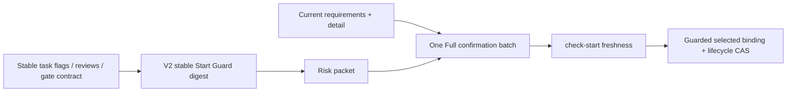
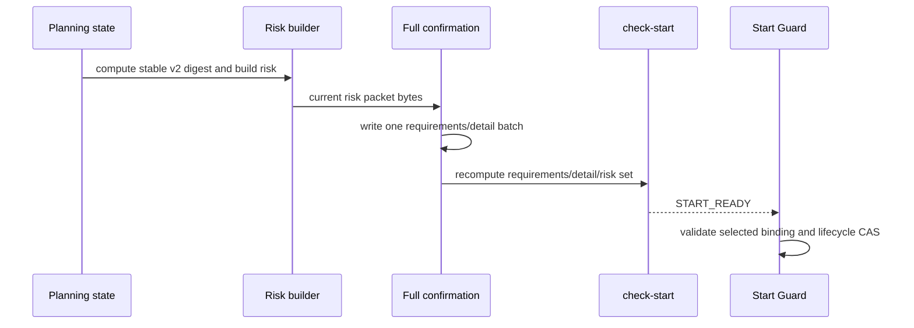

# Full/high Start Guard Binding Cycle Repair

## 1. Inputs And Hard Constraints

The defect is a cyclic dependency between the Start Guard digest and the Full
confirmation batch. The repair changes only v2 Start Guard digest composition;
all live confirmation, selected-risk, envelope, attestation, and lifecycle
checks remain at their current owning boundaries.

Hard constraints:

1. The parent is an umbrella and is never started.
2. This child is the only implementation SSOT.
3. `guru-risk-contract-v2` receives a stable Start Guard digest that excludes
   requirements/detail confirmation record contents.
4. `guru-risk-contract-v1` preserves its existing digest behavior.
5. `check-start` continues to recompute current requirements, detail, review
   readiness, and the complete risk-packet byte set.
6. Start Guard continues to validate selected risk, attestation, envelope, and
   lifecycle CAS.
7. No external signer, root launcher, external registry, or malicious-agent
   defense is introduced.
8. The known 38 mirror drifts block only sync/install/canary.

## 2. Behavior Ownership

| Behavior | Requirement | Primary owner | Supporting owner |
| --- | --- | --- | --- |
| BHV-001 | REQ-UC-001 | UNIT-stable-planning-binding | UNIT-binding-regression-release |
| BHV-002 | REQ-UC-002 | UNIT-full-confirmation-authority | UNIT-binding-regression-release |
| BHV-003 | REQ-UC-003 | UNIT-guarded-slice-activation | UNIT-stable-planning-binding |
| BHV-004 | REQ-UC-004 | UNIT-binding-regression-release | all units |

## 3. 归属理由与三问

| Owner | Why it owns the behavior | Why not another owner | Independent |
| --- | --- | --- | --- |
| UNIT-stable-planning-binding | owns v1/v2 Start Guard digest composition | confirmation validation must not define a pre-confirmation digest | yes |
| UNIT-full-confirmation-authority | owns current requirements/detail/risk-set batch freshness | Start Guard consumes this result but does not record the batch | yes |
| UNIT-guarded-slice-activation | owns selected artifact binding and lifecycle CAS | check-start does not mutate official lifecycle | yes |
| UNIT-binding-regression-release | owns the chronological cross-boundary proof | isolated unit fixtures cannot expose the hash cycle | yes |

## 4. Architecture And Data Flow





The repaired order is forward-only:

```text
A -> R -> C -> check-start -> guarded binding
```

Confirmation records are dynamic authorization evidence. They are verified
after risk creation and therefore cannot be inputs to `A`.

## 5. Shared Contracts

### 5.1 Versioned stable Start Guard digest

For `guru-risk-contract-v2`, the digest binds a schema discriminator,
`guru_chain`, `require_req_uc`, current review-run evidence, and the exact
gate-contract file digest. It excludes `guru_gates.requirements` and
`guru_gates.detail`.

For every non-v2 contract, the existing digest payload is preserved byte for
byte for compatibility.

### 5.2 Full batch freshness

`_full_confirmation_batch_inputs()` remains the source for current requirements
digest, current detail digest, sorted risk-packet filename/digest rows, and the
derived batch digest. `_full_confirmation_batch_problem()` compares both
requirements/detail records to that current recomputation.

The batch writer also builds one canonical `FullConfirmationProjectionV2` from
all existing confirmation metadata and dynamic batch inputs, computes a
domain-separated `confirmation_projection_digest`, and stores the same
projection digest in both requirements/detail records. The validator requires
the records to have the exact allowed field set, be identical except for their
gate-specific `artifact_digest`, match all constants/current inputs, and
recompute the stored projection digest. This replaces the integrity coverage
previously obtained accidentally by placing full confirmation records in the
pre-confirmation Start Guard digest; it does not make confirmation a risk input.

### 5.3 Guarded selected binding

`_artifact_binding()` compares the request to current slice/risk/envelope files,
then validates risk task/slice/route/detail/invariants/decisions and high-risk
attestation. It consumes the stable v2 digest but does not replace
`check-start` confirmation freshness validation.

### 5.4 Chronological regression

The regression uses the real risk builder, Full batch writer, Full batch
freshness validator/`check-start`, and Start Guard artifact binding in the
actual order. Only the official lifecycle side effect may be controlled.

## 6. Detailed Design 承接索引

| chapter_target | doc_type | Owner | BHV | Detail artifact |
| --- | --- | --- | --- | --- |
| stable v2 Start Guard digest | `usecase` | UNIT-stable-planning-binding | BHV-001 | [`chapters/stable-planning-binding.md`](chapters/stable-planning-binding.md) |
| Full confirmation freshness | `repository-datasource` | UNIT-full-confirmation-authority | BHV-002 | [`chapters/full-confirmation-authority.md`](chapters/full-confirmation-authority.md) |
| selected binding and lifecycle | `controller` | UNIT-guarded-slice-activation | BHV-003 | [`chapters/guarded-slice-activation.md`](chapters/guarded-slice-activation.md) |
| chronological regression | `usecase` | UNIT-binding-regression-release | BHV-004 | [`chapters/binding-regression-release.md`](chapters/binding-regression-release.md) |

## 7. Compatibility And Migration

- v2 risk packets generated under the old cyclic digest are stale and must be
  regenerated once.
- v1 Full digest behavior remains unchanged.
- Lite and Micro do not use the changed v2 Start Guard branch.
- No task or evidence migration protocol is added.
- Source/package mirror sync waits for the separate 38-drift owner resolution.

## 8. Failure Ownership

| Failure | Owner | Outcome |
| --- | --- | --- |
| v2 digest changes after confirmation | UNIT-stable-planning-binding | implementation block |
| requirements/detail/risk set stale | UNIT-full-confirmation-authority | check-start block |
| selected risk/attestation/envelope stale | UNIT-guarded-slice-activation | no official start |
| chronological fixture skips a real boundary | UNIT-binding-regression-release | regression invalid |
| v1/Lite/Micro behavior changes | UNIT-binding-regression-release | compatibility block |
| mirror still has 38 drifts | UNIT-binding-regression-release | sync/install/canary only |

## 9. 架构就绪自检

- **G1 Requirements closed**: BHV-001..BHV-004 each have one owner.
- **G2 Boundaries explicit**: stable digest, batch freshness, and guarded
  lifecycle are separate.
- **G3 Data flow explicit**: no post-risk confirmation input flows backward.
- **G4 Failure ownership explicit**: every drift maps to one boundary.
- **G5 Compatibility explicit**: v1/Lite/Micro behavior is preserved.
- **G6 Tests executable**: the chronological command order is fixed.
- **G7 Source/mirror boundary explicit**: source tests proceed; mirror release
  waits.
- **G8 No open architecture decision**: threat-model hardening is deferred and
  cannot reopen current planning.

Architecture readiness: ready for bounded review and child activation.
