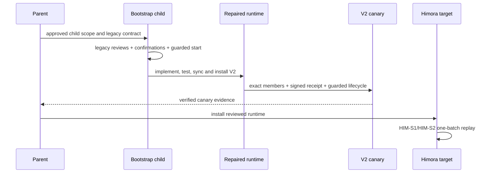

# Bootstrap Full Start Binding V2 Runtime

## 1. Inputs And Hard Constraints

The child implements the reviewed parent architecture but is activated under legacy Full v1/high because the broken Full v2 runtime cannot authorize its own repair.

Hard constraints:

1. Parent remains planning and is never started.
2. Child contract remains `guru-risk-contract-v1` with no V2 marker.
3. Child production edits begin only after its legacy requirements/detail confirmations and reviews authorize guarded start.
4. The delivered runtime implements forward-only `A2 -> R[i] -> C2/U2 -> E[i,action]`.
5. Signed receipt and external activation-registry trust state live outside task-writable artifacts.
6. A disposable V2 canary, not the child legacy start, proves the repaired runtime.
7. `guru-template/` remains source; package mirror is standard-sync generated inside child scope only after unrelated drift is isolated.
8. Runtime hard-denies the design parent at check-start, Start Guard and before-start hook.
9. `verification/mirror-baseline.json` owns the current 38-drift manifest; sync/install remain blocked until the named owner task publishes and this branch merges a reviewed zero-drift commit.
10. All `SDK-U1..SDK-U4` workers execute through one pre-repair installed v1 runtime. Before requirements confirmation/risk/start, a protected user key signs an external bootstrap-anchor subject containing the exact requirements digest, runtime-lock SHA, base commit and runtime tree; root-owned trust/registry state outside the workspace is the authority. Repaired source is never installed over the active child mid-run.
11. After all SDK slice checks, source-runtime final verification requires a signed audited legacy registration derived from the existing v1 start evidence and cannot authorize a new slice or V2 evidence.

## 2. Behavior Ownership

| Behavior | Requirement | Primary owner | Supporting owner |
| --- | --- | --- | --- |
| BHV-001 | REQ-UC-001 | UNIT-binding-regression-release | all units |
| BHV-002 | REQ-UC-002 | UNIT-stable-planning-binding | UNIT-full-confirmation-authority |
| BHV-003 | REQ-UC-003 | UNIT-full-confirmation-authority | UNIT-stable-planning-binding |
| BHV-004 | REQ-UC-004 | UNIT-full-confirmation-authority | UNIT-binding-regression-release |
| BHV-005 | REQ-UC-005 | UNIT-full-confirmation-authority | UNIT-guarded-slice-activation |
| BHV-006 | REQ-UC-006 | UNIT-guarded-slice-activation | UNIT-full-confirmation-authority |
| BHV-007 | REQ-UC-007 | UNIT-guarded-slice-activation | UNIT-binding-regression-release |
| BHV-008 | REQ-UC-008 | UNIT-guarded-slice-activation | UNIT-full-confirmation-authority |
| BHV-009 | REQ-UC-009 | UNIT-stable-planning-binding | UNIT-binding-regression-release |
| BHV-010 | REQ-UC-010 | UNIT-binding-regression-release | all units |

## 3. 归属理由与三问

| Owner | 为什么属于它 | 为什么不属于别人 | 是否独立 |
| --- | --- | --- | --- |
| UNIT-stable-planning-binding | owns A2 and authoritative version dispatch | confirmation evidence cannot choose planning identity | yes |
| UNIT-full-confirmation-authority | owns expected risk set, signed receipt and projections | activation consumes but cannot mint authorization | yes |
| UNIT-guarded-slice-activation | owns preimage, external registry and lifecycle CAS | Gate does not mutate official lifecycle | yes |
| UNIT-binding-regression-release | owns bootstrap isolation, real lifecycle, compatibility and install/canary proof | local unit tests cannot prove delivery reachability | yes |

## 4. Architecture And Delivery Flow

```mermaid
flowchart LR
  L["Legacy Full v1 child Gate"] --> I["Authorized SDK implementation"]
  I --> A["A2 StablePlanningArtifactV2"]
  A --> R["R[i] exact risk members"]
  R --> C["Signed receipt + C2/U2"]
  C --> E["E[i,action] + activation preimage"]
  E --> G["Guarded start / later preflight"]
  G --> V["Disposable V2 canary"]
  V --> H["HIM-S1/HIM-S2 replay"]
```





The bootstrap edge ends at delivery authorization. It is never interpreted as V2 security evidence.

## 5. Shared Contracts

### 5.1 Stable binding

A2 binds stable task/route/policy/selection/scope, artifact, decision, expected-slice and review inputs. It excludes all downstream confirmation, receipt, envelope, registry and lifecycle state.

### 5.2 Exact risk membership

One semantic validator requires expected and observed members to match exactly and is shared by confirm, check-start, Start Guard and later preflight.

### 5.3 Signed Full authorization

Canonical `ConfirmationSubjectV2` signs actor/time/via/turn/quote digest and explicit per-slice actions through an external provider. A deterministic grant digest derives batch id/digest and canonical/compatibility projection bytes. The task stores public receipt evidence only.

### 5.4 Activation

E[i,action] binds a precomputable activation preimage plus one exact authorized action-row projection. External V2 adoption before risk and monotonic activation sequence/predecessor CAS plus exact local snapshot prevent total-marker deletion downgrade.

### 5.5 Dispatch

Planning dispatch uses the task contract. In-progress dispatch requires an external V2 activation receipt or audited legacy registration. Absence, mixed evidence or registry/task divergence blocks.

### 5.6 Mirror baseline

The baseline manifest pins base/source/package digests, all 38 pre-existing paths and owner task `07-14-custom-first-guru-delivery-control`. Required resolution artifact is that owner's `verification/guru-mirror-zero-drift-baseline.json`, with reviewed commit, zero sync exit, source/package/output digests and review ids. Child start/source implementation may proceed, but sync/install cannot.

`guru_mirror_integration.py guarded-sync` is the only release-authorized sync entrypoint. Before invoking the standard sync command, it verifies the owner artifact schema, reviewed commit ancestry, recorded zero-drift output/tree digests and review ids, and proves the package tree still equals the merged baseline. After standard sync, it recomputes the reviewed child source delta, its canonical source-to-package mapping and the actual package delta. Exact equality writes `verification/mirror-integration-proof.json`; any extra, missing or content-divergent row deletes/refuses the proof and blocks release. `verify-proof` recomputes live inputs rather than trusting task-writable bytes, and is called by apply/install, V2 canary and source-runtime check-commit. Direct `pnpm sync:guru` may change files but cannot create a valid proof and therefore cannot release.

### 5.7 Parent hard denial and canary

One shared parent-role check is consumed by check-start, Start Guard and before-start hook. The installed-runtime canary uses exact `CANARY-SELECTED/CANARY-LATER` and an ephemeral signer/registry outside the task directory:

```bash
PYTHONDONTWRITEBYTECODE=1 python3 \
  guru-template/overlay/verify/tests/full_start_binding_v2_canary.py \
  --installed-runtime <installed-overlay> \
  --output .trellis/tasks/07-16-bootstrap-full-start-binding-v2-runtime/verification/v2-canary.json
```

PASS requires matching source/package/install digests, signed receipt and deterministic grant verification, external registry head `activation_finalized`, selected attempt `verified`, explicit selected/later implement/check authorization and no unexpected files. The evidence bundle retains harness/runtime manifests, full signed receipt/grant, complete signed registry chain/head, public keys/certificates, trust/revocation snapshot, attempt journal and action results, but destroys secret keys. It must pass:

```bash
PYTHONDONTWRITEBYTECODE=1 python3 \
  guru-template/overlay/verify/tests/full_start_binding_v2_canary.py \
  --verify-evidence .trellis/tasks/07-16-bootstrap-full-start-binding-v2-runtime/verification/v2-canary.json
```

Failure preserves the disposable workspace path; successful cleanup occurs only after offline self-verification.

### 5.8 Bootstrap runtime continuity

During planning, before requirements confirmation, `bootstrap-runtime-lock.json` records the installed `.trellis/scripts/guru` runtime path, base commit, Git tree digest, file count and v1 policy. Its exact SHA-256 is copied as `bootstrap_runtime_lock_sha256` in child `prd.md` and as a checked projection in `gate-contract.json`. Those task-local values and the legacy requirements confirmation are not trust roots.

Canonical `BootstrapRuntimeAnchorSubjectV1` contains domain/schema, repository namespace, audience `trellis-guru-bootstrap-v1:github.com/devSC/Trellis`, principal, provider/key id, event id, nonce, issued/not-before/expires times, task id/ref, exact current requirements artifact digest, runtime-lock SHA-256, base commit and installed runtime tree. Before requirements confirmation, the user signs this subject interactively with a passphrase/hardware-protected OpenSSH key that the agent cannot invoke. The public allowed-signers policy and the immutable subject/signature receipt are installed root-owned/read-only outside the workspace at the contract paths. The current unencrypted `~/.ssh/id_rsa` is rejected. Guarded start later records the original v1 start evidence separately.

Every SDK implement/check launch uses the named `bootstrap-worker-preflight`: verify root ownership/mode, trusted signer, SSH signature namespace, exact subject and single-assignment external registry record; take the expected requirements/lock/base/runtime values from that signed subject; then run installed-v1 `guru_gate.py check-implementation` and compare all task-local projections plus live `.trellis/scripts/guru` worktree. Only then may the installed-v1 supervisor dispatch the worker and append the external receipt digest and runtime digest used. The child never applies or installs repaired source into its own active worktree before all four slice checks are complete, so the new in-progress dispatcher cannot affect SDK-U2/U3/U4. Coordinated task-local rewrite cannot create a signature from the protected trusted key or replace root-owned registry state.

After all four slice checks and independent implementation review are current, the repaired source may execute `register-legacy-continuation` against the pinned v1 start evidence through an external signer/registry. Registration reruns `bootstrap-worker-preflight` and derives the original requirements/lock/base/runtime values from `BootstrapRuntimeAnchorReceiptV1`; neither current task-local confirmation nor lock can redefine them. The signed continuation receipt binds the bootstrap anchor receipt digest, repository/task namespace, legacy policy/version, original confirmation/start digests, completed slice/check inventory and permits only final source-runtime verification/check-commit. It cannot authorize implement, another slice, Binding V2 evidence or official start. New source `check-commit` requires this receipt plus a current mirror integration proof; absence remains `ActivationProvenanceUnknown`.

## 6. Detailed Design 承接索引

| chapter_target | doc_type | Owner | BHV | Detail artifact |
| --- | --- | --- | --- | --- |
| stable binding and dispatch | `usecase` | UNIT-stable-planning-binding | BHV-002, BHV-009 | [`chapters/stable-planning-binding.md`](chapters/stable-planning-binding.md) |
| risk set, receipt and projections | `repository-datasource` | UNIT-full-confirmation-authority | BHV-003, BHV-004, BHV-005 | [`chapters/full-confirmation-authority.md`](chapters/full-confirmation-authority.md) |
| preimage, registry and lifecycle | `controller` | UNIT-guarded-slice-activation | BHV-006, BHV-007, BHV-008 | [`chapters/guarded-slice-activation.md`](chapters/guarded-slice-activation.md) |
| bootstrap, regression and release | `usecase` | UNIT-binding-regression-release | BHV-001, BHV-009, BHV-010 | [`chapters/binding-regression-release.md`](chapters/binding-regression-release.md) |

## 7. Compatibility And Migration

- Bootstrap child is legacy Full v1 and never upgraded in place.
- Bootstrap SDK workers remain on the pinned installed v1 runtime; the repaired dispatcher is not loaded mid-run.
- Audited legacy registration is created only after all SDK slice checks for final source-runtime verification/check-commit and grants no new implementation.
- V2 planning tasks require explicit discriminator and complete V2 evidence.
- Pre-upgrade in-progress tasks require audited external legacy registration.
- Lite and Micro/Small retain isolated contracts and tests.
- Unknown, mixed or absent activation provenance blocks.

## 8. Failure Ownership

| Failure | Owner | Outcome |
| --- | --- | --- |
| parent start or child V2 marker | UNIT-binding-regression-release | bootstrap block |
| bootstrap worker runtime differs from pinned v1 lock | UNIT-binding-regression-release | worker/release block |
| A2/dispatch drift | UNIT-stable-planning-binding | risk/start block |
| risk/receipt/grant/projection failure | UNIT-full-confirmation-authority | no authorization |
| registry/snapshot/lifecycle drift | UNIT-guarded-slice-activation | no official/worker call |
| design parent reaches any start surface | UNIT-binding-regression-release | hard block |
| guarded-sync/proof, fixture, compatibility, mirror or canary failure | UNIT-binding-regression-release | release block |

## 9. 架构就绪自检

- **G1 Requirements closed**: BHV-001 through BHV-010 each have one primary owner.
- **G2 Bootstrap boundary explicit**: parent, child, repaired runtime, canary and target are separate.
- **G3 Data flow explicit**: delivery and runtime sequences are forward-only.
- **G4 Failure ownership explicit**: every failure maps to one owner.
- **G5 Compatibility explicit**: V2, legacy Full, Lite, Micro/Small and pre-upgrade paths are separated.
- **G6 Tests executable**: chronological lifecycle and negative matrix are in `implement.md`.
- **G7 Source/mirror boundary explicit**: the 38-drift manifest, owner, zero-drift artifact, guarded-sync verifier, exact generated-delta proof and apply/install/canary/check-commit consumers are named.
- **G8 No open architecture decision**: child waits for formal reviews, protected-user bootstrap anchor setup, confirmations and start approval; mirror sync/install has a deterministic external baseline blocker. Both are explicit operator prerequisites, not unresolved ownership choices.

Architecture readiness: evidence-ready for review, not authorized for start or implementation.
