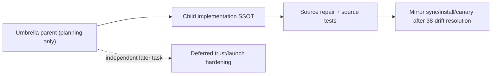
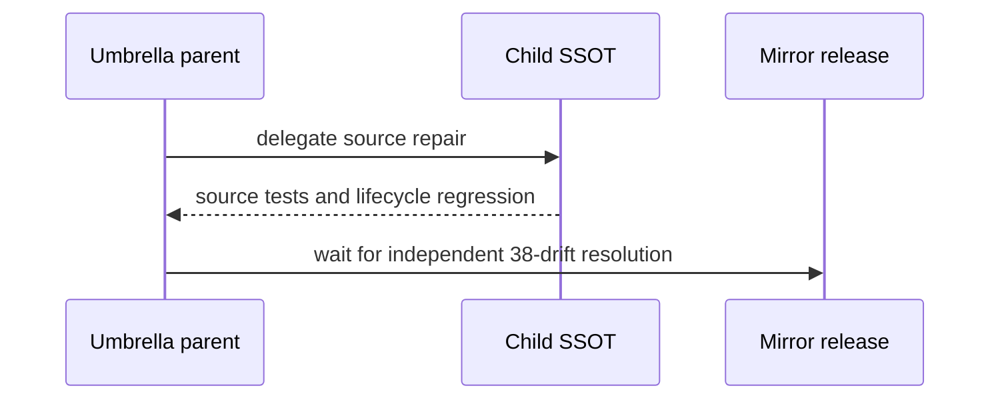

# Full/high Start Guard Cycle Repair Umbrella

## 1. Inputs And Hard Constraints

1. The parent is never started.
2. The linked child is the only implementation SSOT.
3. Current implementation is limited to the hash-cycle repair, preserved Gate
   strength, and chronological lifecycle regression.
4. Deferred external trust/launch hardening cannot block the child.
5. The 38 mirror drifts block only final sync/install/canary.

## 2. Behavior Ownership

| Behavior | Requirement | Primary owner | Supporting owner |
| --- | --- | --- | --- |
| BHV-001 | REQ-UC-001 | UNIT-child-implementation-delegation | UNIT-umbrella-integration |
| BHV-002 | REQ-UC-002 | UNIT-deferred-hardening-boundary | UNIT-parent-non-start |

## 3. 归属理由与三问

| Owner | Why it exists | Why not the parent runtime | Independent |
| --- | --- | --- | --- |
| UNIT-child-implementation-delegation | points all source work to the child | parent has no implementation deliverable | yes |
| UNIT-deferred-hardening-boundary | prevents rejected scope from returning as a blocker | current repair does not need a new trust system | yes |
| UNIT-parent-non-start | keeps umbrella lifecycle inert | official start belongs only to an implementation task | yes |
| UNIT-umbrella-integration | tracks child source proof and later release blocker | child owns detailed execution | yes |

## 4. Architecture And Data Flow

## 5. Shared Contracts

### 5.1 Child implementation authority

Only the linked child may start or edit production source.

### 5.2 Deferred hardening

Protected signers, root launchers, external monotonic receipts, and malicious
workspace-agent resistance are non-normative historical research here.

### 5.3 Mirror boundary

The 38 drifts do not block child source implementation/tests. They block only
sync/install/canary.

## 6. Detailed Design 承接索引

| chapter_target | doc_type | Owner | BHV | Detail artifact |
| --- | --- | --- | --- | --- |
| child implementation delegation | `usecase` | UNIT-child-implementation-delegation | BHV-001 | [`chapters/stable-planning-binding.md`](chapters/stable-planning-binding.md) |
| deferred hardening boundary | `repository-datasource` | UNIT-deferred-hardening-boundary | BHV-002 | [`chapters/full-confirmation-authority.md`](chapters/full-confirmation-authority.md) |
| parent non-start | `controller` | UNIT-parent-non-start | BHV-001 | [`chapters/guarded-slice-activation.md`](chapters/guarded-slice-activation.md) |
| umbrella integration | `usecase` | UNIT-umbrella-integration | BHV-001, BHV-002 | [`chapters/binding-regression-release.md`](chapters/binding-regression-release.md) |

## 7. Compatibility And Migration

No parent migration or runtime dispatch exists. Child compatibility is owned by
the child design.

## 8. Failure Ownership

| Failure | Owner | Outcome |
| --- | --- | --- |
| parent start attempted | UNIT-parent-non-start | block |
| source work routed to parent | UNIT-child-implementation-delegation | reroute to child |
| deferred threat model blocks child | UNIT-deferred-hardening-boundary | remove blocker |
| mirror drift blocks source tests | UNIT-umbrella-integration | keep only release block |

## 9. 架构就绪自检

- **G1** BHV-001/BHV-002 have owners.
- **G2** parent/child/deferred/release boundaries are explicit.
- **G3** source work has one forward path through the child.
- **G4** parent stays non-startable.
- **G5** no compatibility behavior is owned here.
- **G6** child owns executable tests.
- **G7** mirror drift is release-only.
- **G8** no open parent architecture decision remains.
