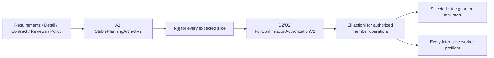

# Full Start Binding V2

## 1. Inputs And Hard Constraints

The current Full v2 flow has a cyclic artifact graph: risk packets bind a Start Guard digest containing requirements/detail confirmation records, while the confirmation batch must bind the risk packet set before writing those records. The design replaces this with four forward-only layers without weakening structure, review, confirmation, selected-slice, later-slice or lifecycle CAS enforcement.

Hard constraints:

1. No Trellis Core modification.
2. Full/high remains fail-closed and receives one user confirmation batch.
3. Confirmation-independent planning identity and dynamic authorization identity remain separate.
4. Every expected member must prove membership in the same confirmed risk member set; current SDK units, fixture members and Himora slices use distinct namespaces.
5. Legacy Full v1, Lite and Micro retain explicit version-owned behavior.
6. `guru-template/` remains source of truth; unrelated mirror drift is not absorbed.
7. The task-level `gate-contract.json.start_binding.version` selects Binding V2; downstream evidence cannot select or downgrade the algorithm.
8. A canonical confirmation record is a verified projection of a durable external authorization receipt, not its own trust root; raw TTY presence is not durable provenance.
9. The broken V2 runtime cannot authorize its own repair: this task is a non-started design/integration parent, implementation requires a separately approved legacy Full v1/high bootstrap child, and repaired-runtime V2 canary replay is mandatory.
10. `task_role=design_parent` and `delivery_bootstrap.start_this_parent_task=false` are runtime-enforced hard denials shared by check-start, Start Guard and the before-start hook; they are not operator conventions.
11. All bootstrap `SDK-U1..SDK-U4` workers remain on one pinned pre-repair installed v1 runtime. Before requirements confirmation/risk/start, a protected user signer creates a root-owned external bootstrap-anchor receipt binding requirements digest, runtime-lock SHA, base commit and runtime tree. Task-local confirmation/PRD/lock/contract are projections only; repaired source cannot replace the active child runtime mid-run. Audited legacy continuation is created only after all SDK slice checks for final source-runtime verification/check-commit and grants no new implementation.

## 2. Behavior Ownership

| Behavior | Requirement | Primary owner | Supporting owner |
| --- | --- | --- | --- |
| BHV-001 | REQ-UC-001 | UNIT-stable-planning-binding | UNIT-full-confirmation-authority |
| BHV-002 | REQ-UC-002 | UNIT-full-confirmation-authority | UNIT-stable-planning-binding |
| BHV-003 | REQ-UC-003 | UNIT-full-confirmation-authority | UNIT-guarded-slice-activation |
| BHV-004 | REQ-UC-004 | UNIT-full-confirmation-authority | UNIT-binding-regression-release |
| BHV-005 | REQ-UC-005 | UNIT-guarded-slice-activation | UNIT-full-confirmation-authority |
| BHV-006 | REQ-UC-006 | UNIT-guarded-slice-activation | UNIT-binding-regression-release |
| BHV-007 | REQ-UC-007 | UNIT-guarded-slice-activation | UNIT-full-confirmation-authority |
| BHV-008 | REQ-UC-008 | UNIT-stable-planning-binding | UNIT-binding-regression-release |
| BHV-009 | REQ-UC-009 | UNIT-binding-regression-release | all units |
| BHV-010 | REQ-UC-010 | UNIT-binding-regression-release | all units |

## 3. 归属理由与三问

| Owner | 为什么属于它 | 为什么不属于别人 | 是否需独立存在 |
| --- | --- | --- | --- |
| UNIT-stable-planning-binding | 唯一拥有 A2 payload、domain separation 和 v1/v2 dispatch | confirmation owner 不能反向选择 risk 的稳定输入 | 是，消除循环与兼容歧义 |
| UNIT-full-confirmation-authority | 唯一拥有 risk member set、C2/U2 和用户授权 projections | Start Guard 只能消费授权，不能定义用户确认 subject | 是，授权/证据边界 |
| UNIT-guarded-slice-activation | 唯一组合 selected member、envelope、锁和 lifecycle CAS | Gate 不执行 official lifecycle，Supervisor 不拥有 task status mutation | 是，生命周期安全边界 |
| UNIT-binding-regression-release | 唯一证明跨模块真实状态转换、legacy/Lite 和 source/mirror/install 一致 | 单元 owner 的局部测试不能证明端到端可达 | 是，发布裁决边界 |

## 4. Architecture And Data Flow



```mermaid
sequenceDiagram
  participant P as Planning artifacts
  participant R as Risk builder/validator
  participant U as Trusted authorization receipt provider
  participant C as Full confirmation
  participant E as Per-slice attestation/envelope
  participant G as check-start
  participant S as Start Guard
  participant W as Later slice worker
  P->>R: compute A2 + expected slices; build R[i] for every expected i
  R->>C: validated observed members equal expected members
  U->>C: signed terminal / trusted platform / signed external receipt
  C->>C: replay-verify receipt; atomically write C2/U2 + projections
  C->>E: issue E[selected,guarded_start] just in time
  E->>G: current task + batch/member bindings
  G->>R: revalidate every member and current inputs
  G->>C: revalidate authorization provenance and freshness
  G-->>S: START_READY
  S->>E: verify exact E[selected,guarded_start] row and selected member
  S->>S: lock + stable/authorization/lifecycle CAS + official start
  S-->>W: lifecycle is in_progress; no implicit worker authorization
  W->>E: verify selected implement/check or later implement/check E[i,action]
  W->>R: prove current i equals one expected C2 member
  W->>C: revalidate the same C2/U2 and provenance before launch
```

The time-order contract is `A2 -> R[] -> C2/U2 -> E[]`. No downstream event can be an input to A2.

## 5. Shared Contracts

### 5.1 Stable planning artifact

A2 is a canonical digest over domain/schema, task/route/policy/selection/scope, gate-contract bytes, requirements/detail artifact digests, decision inventory, the independently reviewed expected-slice inventory, effective review policy and current review evidence. It excludes requirements/detail confirmation records, risk bytes, batch metadata, attestation, envelope and lifecycle timestamps.

### 5.2 Risk member set

`ExpectedSliceInventoryV2` is derived from the reviewed implementation slice contract, is carried by `gate-contract.json`, and is bound by A2 before any risk packet exists. Every member binds A2, canonical filename/slice, matching slice packet, scope/policy, decision universe/set and invariants. The validator requires the canonical observed risk member IDs to equal the expected IDs exactly; missing, unexpected, duplicate or orphan members block. The set digest uses sorted member rows. Confirm, check-start, Start Guard and later-slice preflight consume one shared semantic validator.

### 5.3 Canonical authorization

`task.json.guru_gates.full_confirmation` is the single canonical Full v2 authorization projection. Its trust root is a durable `TrustedAuthorizationReceiptV2` that can be replay-verified independently from task-writable fields. Accepted receipt providers are an authenticated platform user-turn signer, a configured signer invoked from an interactive terminal, or a verifiable signed external attestation. A TTY check only constrains the acquisition channel; it does not become provenance until a configured trust provider signs the exact confirmation subject. A free-form agent-written quote, turn reference, actor string, source type, verifier name or reusable bearer token is never sufficient.

The signed `ConfirmationSubjectV2` contains: domain/schema, provider-asserted canonical repository namespace, audience exactly derived as `trellis-guru-full-start-v2:<repository_namespace>`, issuer/provider id, event id, one-time nonce, principal/confirmed-actor id, confirmed-at/issued-at/not-before/expires-at, task id/ref, route/policy/binding version, selection generation, A2, requirements/detail digests, expected-inventory digest, sorted risk-member rows/set digest, scope fingerprint, confirmation mode, via, turn-ref, user-quote digest and canonical `authorized_slice_actions`. The selected slice has separate `guarded_start`, `implement` and `check` rows; each later slice has explicit `implement` and `check` rows. No broad scalar action exists, and each E binds exactly one row and its digest rather than only the whole action-set digest.

After receipt verification, deterministic `AuthorizationGrantCoreV2` binds repository namespace, subject digest, receipt digest and an explicitly enumerated immutable authority-base payload. The base payload excludes `grant_digest`, `authorization_digest`, `batch_id`, `batch_digest`, projection digests and replay-time verifier observations. `grant_digest = H(domain || canonical grant core)`; authorization digest, batch id and batch digest are domain-separated derivations from it. Final canonical and requirements/detail projection bytes are deterministic derivations of core plus those outputs. Replay `verified_at` and verifier observations live in non-authoritative append-only verification evidence and never change projection bytes. At confirm and check-start, the verifier recomputes subject, receipt, grant and projections. An identical retry returns byte-identical output; changed actor/time/via/turn/quote/action/member or second batch requires a new receipt.

### 5.4 Activation

Attestation and envelope bind the same C2/U2, risk member set, per-slice authorized-action projection, activation preimage and selected risk digest. Start Guard validates before lock, inside lock, immediately before official start and after official return. Every later slice validates its explicit `implement` or `check` action plus full authorization and membership again before worker launch.

### 5.5 Version dispatch

The authoritative planning discriminator is the task-level `gate-contract.json.start_binding.version`, not a field chosen by risk, attestation or envelope evidence. Dispatch is exact:

| Lifecycle/route contract | Authoritative selection |
| --- | --- |
| any lifecycle + `task_role=design_parent` or `start_this_parent_task=false` | `PARENT_TASK_NOT_STARTABLE`; check-start/guard/hook hard block |
| planning + Full/high + `guru-risk-contract-v2` + `start_binding.version=2` | Binding V2; complete A2/R/C/E required |
| planning + Full + `guru-risk-contract-v2` + missing binding discriminator | `BindingMigrationRequired`; no legacy fallback |
| planning + Full + `guru-risk-contract-v1` + no binding discriminator | isolated legacy Full v1 two-stage flow |
| planning + Lite + no Full binding discriminator | Lite requirements-only flow |
| planning + Micro/Small + no Full binding discriminator | Micro/Small flow; any Full artifact is a mismatch |
| in_progress + externally registered V2 activation receipt + matching `activation_contract_snapshot.version=2` | V2 later-slice preflight |
| in_progress + externally registered audited legacy receipt | pre-upgrade legacy-only compatibility; no new slice or V2 authorization |
| in_progress + no external activation/legacy registration receipt | `ActivationProvenanceUnknown`; block pending one-time audited registration |
| any unknown, mixed, removed-marker or registry/task disagreement | block |

Planning dispatch never reads downstream evidence to select an algorithm. V2 adoption is externalized before A2 or risk generation: creating or migrating to a V2 task contract atomically appends a signed `binding_adopted` registry record containing repository namespace, task id/ref, binding version and contract digest. Every planning/check-start/guard dispatch queries the registry. Once adoption exists, reverting every task-local field to v1 still blocks.

Before official V2 start, the same registry appends a signed `activation_prepared` record for task id and precomputed activation-contract digest. Guarded start persists the exact snapshot, then appends `activation_finalized`, `failed`, `compensated` or `manual_recovery_required`. Each record has domain/schema, repository/task namespace, monotonic sequence, predecessor digest, canonical payload digest, state, attempt id, issued-at, provider/key id and signature. Provider CAS accepts only the current head; verification checks the complete signed chain, key status and head state, so replaying an older signed record cannot roll back. Pre-upgrade legacy continuation requires a separate audited signed registration. Absence never selects legacy in-progress.

Start Guard durably advances the local attempt journal through `prepared -> official_call_started -> official_returned -> verified` around the official call. `guru_task.py reconcile-start --task-dir <task> --attempt-id <id>` never invokes official start. For a registry head stuck at `activation_prepared`: unchanged planning state with no `official_call_started` appends `aborted_pre_call`; exact in-progress state with a durable returned/postcondition record appends `activation_finalized`; known post-call divergence runs one bounded compensation and appends its terminal result; any ambiguous call-started window appends or requires `manual_recovery_required`. New attempts are allowed only from explicit pre-call-aborted/failed/compensated terminal heads while task remains planning and all evidence is freshly validated.

### 5.6 Bootstrap delivery boundary

This task is the design/integration parent and is never passed to `task.py start`. After explicit user approval, a child task with `full_chain/high`, `guru-risk-contract-v1` and no V2 marker uses the satisfiable legacy order to implement the runtime/spec/tests in the isolated worktree. During planning it pins the pre-repair installed `.trellis/scripts/guru` manifest. Before requirements confirmation, the user signs a canonical subject binding repository/task, requirements digest, exact lock SHA-256, base commit and runtime tree with a protected external key, then installs trusted signer policy and the single-assignment receipt root-owned outside the workspace. Every SDK worker takes expected values from that verified receipt and compares the task-local confirmation/lock/contract and live runtime path/tree; repaired source is never installed into the active child before all slice checks complete. It may not claim the broken V2 Guard authorized its edits.

After all SDK slice checks and independent implementation review, the repaired source may register an audited legacy continuation from the existing v1 start evidence through the external signer/registry. Registration revalidates the original root-owned bootstrap anchor receipt rather than trusting current task-local confirmation/lock. That receipt permits only final source-runtime verification/check-commit, not another implement slice, V2 evidence or official start. After install to a disposable target, a V2 canary task exercises exact expected members, trusted receipt, check-start, guarded start and later-slice preflight. Parent integration and Himora sync remain blocked until the child implementation review and V2 canary are green.

The hard denial is implemented once and consumed by `guru_gate.py check-start`, `guru_task.py start_with_guard` and the before-start hook. A regression supplies otherwise-valid V2 evidence for this parent and asserts all three surfaces return `PARENT_TASK_NOT_STARTABLE`, no registry reservation occurs and official start is never invoked.

### 5.7 Disposable V2 canary

The installed-runtime canary creates a disposable task with `task_role=v2_canary`, Full/high, risk-policy v2, binding version 2 and exact members `CANARY-SELECTED/CANARY-LATER`. An ephemeral signer/trust directory and monotonic registry live outside the canary task directory. The replay command is:

```bash
PYTHONDONTWRITEBYTECODE=1 python3 \
  guru-template/overlay/verify/tests/full_start_binding_v2_canary.py \
  --installed-runtime <installed-overlay> \
  --output .trellis/tasks/07-16-bootstrap-full-start-binding-v2-runtime/verification/v2-canary.json
```

The harness registers binding adoption, generates real slice/risk packets, obtains one signed receipt, records confirmation, issues selected action envelopes, runs real check-start/artifact binding/guarded start plus selected implement/check preflight, finalizes activation, then proves `CANARY-LATER` implement/check authorization.

`v2-canary.json` is a self-contained public evidence bundle containing harness/runtime manifests and digests, canary contract/A2/member rows, complete signed receipt and grant core/derived projections, complete signed registry chain/current-head proof, public keys/certificate chain, trust-policy and revocation snapshots, durable start-attempt journal, selected/later action results, command/version and cleanup status. Secret keys are destroyed, not retained. PASS requires exact source/package/install digests, offline signature/grant/registry verification, registry head `activation_finalized`, selected attempt `verified`, selected and later implement/check authorized and no unexpected files. Independent replay uses:

```bash
PYTHONDONTWRITEBYTECODE=1 python3 \
  guru-template/overlay/verify/tests/full_start_binding_v2_canary.py \
  --verify-evidence .trellis/tasks/07-16-bootstrap-full-start-binding-v2-runtime/verification/v2-canary.json
```

The disposable workspace is removed only after a successful self-verification; failure preserves its path for diagnosis.

### 5.8 Enforced mirror integration

The child implements `guru_mirror_integration.py` as a read-only verifier plus guarded sync entrypoint. `guarded-sync` first verifies the named owner zero-drift artifact, reviewed commit ancestry, zero sync output/tree digests and review ids, then proves the package tree equals that merged baseline before invoking the standard `pnpm -C packages/cli sync:guru`. It computes the reviewed child source delta and canonical source-to-package mapping, compares that expected set and content to the actual package delta, and only then writes `verification/mirror-integration-proof.json`.

The proof is a cache, not a trust root: `verify-proof` recomputes owner, source, package, command/output and mapped-delta facts from live repository state. Apply/install, installed-runtime canary and repaired-source `check-commit` each require it. Direct standard sync without the wrapper cannot produce a valid proof and remains release-blocked. The bootstrap source `check-commit` additionally requires the post-slice audited legacy continuation receipt, so enforcing the new mirror contract cannot silently replace or self-lock an in-flight SDK worker.

## 6. Detailed Design 承接索引

| chapter_target | doc_type | Owner | BHV | Detail artifact |
| --- | --- | --- | --- | --- |
| stable binding/version dispatch | `usecase` | UNIT-stable-planning-binding | BHV-001, BHV-008 | [`chapters/stable-planning-binding.md`](chapters/stable-planning-binding.md) |
| risk-set/confirmation authority | `repository-datasource` | UNIT-full-confirmation-authority | BHV-002, BHV-003, BHV-004 | [`chapters/full-confirmation-authority.md`](chapters/full-confirmation-authority.md) |
| guarded/later-slice activation | `controller` | UNIT-guarded-slice-activation | BHV-005, BHV-006, BHV-007 | [`chapters/guarded-slice-activation.md`](chapters/guarded-slice-activation.md) |
| regression/compatibility/release | `usecase` | UNIT-binding-regression-release | BHV-008, BHV-009, BHV-010 | [`chapters/binding-regression-release.md`](chapters/binding-regression-release.md) |

The index uses only built-in v1 detail types, so no pending L2 exemption is required.

## 7. Compatibility And Migration

- Full v2 planning with legacy risk evidence blocks and regenerates A2/R/C/E once.
- Full v2 planning is selected only by `gate-contract.json.start_binding.version=2`; removing V2 evidence cannot change that selection.
- V2 adoption writes the external monotonic `binding_adopted` record before risk generation; task-local rollback cannot erase it.
- Pre-Binding-V2 planning tasks on `guru-risk-contract-v2` require explicit contract migration and fresh review/confirmation; they do not fall back.
- Legacy Full v1 preserves its two-stage requirements/detail confirmation path.
- V2 guarded start writes a task snapshot matching an external monotonic activation receipt; pre-upgrade tasks require an audited external legacy registration and cannot be classified by absence.
- The bootstrap child remains on its pinned installed v1 runtime through all SDK slice checks; its audited legacy continuation is post-slice, check/commit-only and cannot authorize new implementation.
- Lite retains one requirements confirmation bound to PRD/route/risk/scope.
- Micro/Small never inherit Full artifacts.
- Mixed or unknown versions fail closed and never auto-downgrade.
- Package integration is blocked by the child `verification/mirror-baseline.json` until the named owner publishes a reviewed zero-drift commit; post-merge generated delta must equal this child's reviewed source mapping.

## 8. Failure Ownership

| Failure | Owner | Outcome |
| --- | --- | --- |
| A2 input drift | UNIT-stable-planning-binding | risk/start stale |
| version/migration/downgrade mismatch | UNIT-stable-planning-binding | dispatch block |
| design parent start attempt | UNIT-binding-regression-release | hard block on all start surfaces |
| malformed/orphan/mixed risk set | UNIT-full-confirmation-authority | confirm/check-start block |
| expected/observed slice inventory mismatch | UNIT-full-confirmation-authority | confirm/check-start block |
| receipt unavailable/unverifiable | UNIT-full-confirmation-authority | no authorization |
| grant/batch/projection derivation mismatch | UNIT-full-confirmation-authority | no authorization |
| confirmation metadata/projection tamper | UNIT-full-confirmation-authority | live authorization block |
| cross-batch selected member | UNIT-guarded-slice-activation | no official start |
| later slice/action not authorized or activation registry/snapshot stale | UNIT-guarded-slice-activation | no worker launch |
| broken-runtime self-bootstrap attempted | UNIT-binding-regression-release | keep parent planning; child approval required |
| lifecycle/session/CAS race | UNIT-guarded-slice-activation | block or compensate |
| bootstrap runtime-lock drift, guarded-sync/proof failure, compatibility fixture, split-fixture false green or mirror drift | UNIT-binding-regression-release | release block |

## 9. 架构就绪自检 (Architecture Ready Self-Check)

- **G1 Requirements closed**: BHV-001 through BHV-010 each have one primary owner.
- **G2 Boundaries explicit**: A2, R, C2/U2 and E have one-way ownership.
- **G3 Data flow explicit**: flowchart and real lifecycle sequence are defined.
- **G4 Failure ownership explicit**: every drift, provenance failure and expected/observed membership mismatch maps to one primary Gate.
- **G5 Compatibility explicit**: Full v2, legacy Full v1, Lite and Micro are separated.
- **G6 Tests executable**: canonical happy path and negative matrix are in `implement.md`.
- **G7 Source/mirror boundary explicit**: child manifest pins 38 pre-existing drifts, owner/zero-drift prerequisite, guarded-sync verifier, exact generated-delta proof and all release consumers.
- **G8 No open architecture decision**: the approved legacy child exists and is planning; remaining work is parent/child review, protected-user external bootstrap anchor setup, child requirements/detail confirmation and separate child start approval.

Architecture readiness: evidence-ready for overview/detail review; parent is hard non-startable and the linked legacy child is planning but not authorized for start or production edits.
