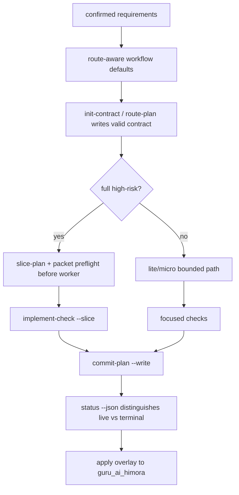

# Guru route-aware execution acceleration design

## §1 概要设计

### 1.1 Architecture Summary

本任务承接 `07-01-risk-based-gate-contract-routing`，目标是让已落地的 route-aware gate policy 在真实执行中变快。上一任务解决“gate 能不能放行/阻断”，本任务解决“agent 会不会仍按旧 workflow 跑重流程、contract 会不会手写出错、full slice 会不会启动 worker 后才发现 packet 缺失、commit 尾部会不会重新读大上下文”。

核心设计边界：

- Workflow / skill 文案必须和 `guru_gate.py` 的 route-aware policy 对齐，不能一边允许 `lite_task` 省 adversarial requirements，一边仍默认建议 `--adversarial requirements`。
- Contract 写入必须工具化，复用 `guru_contract.default_contract()` 和 validator，不让 agent 凭记忆手写 schema。
- Full-chain 加速只做 slice fail-fast 和可视化计划，不削弱 full Gate。
- `commit-plan`、`slice-plan`、worker status 都是 mutable evidence / runtime summary，不写入 digest-bearing planning contract。
- Source/template 先实现，最后通过 CLI apply 到 `guru_ai_himora` 做目标项目验证。

### 1.2 行为 owner 归属表

| BHV | owner | 归属理由 / 三问 |
| --- | --- | --- |
| BHV-001 | workflow templates + `client-small-iteration-dev` skill | 为什么属于它：慢路径来自 agent 看到旧 workflow 后默认跑 adversarial requirements；为什么不属于 `guru_gate.py`：gate 已能放宽，剩余问题是执行建议仍偏重；是否需独立存在：是，所有平台模板都必须同步。 |
| BHV-002 | `guru_gate.py init-contract` + `guru_contract.py` | 为什么属于它：contract schema 已由 `guru_contract.py` 拥有，生成命令应复用该 owner；为什么不属于 workflow 文案：文案不能保证 JSON 正确；是否需独立存在：是，后续 micro/lite/full 都复用。 |
| BHV-003 | `guru_gate.py` / `guru_supervise.py` preflight + `guru_review_record.py` packet reader | 为什么属于它：worker 启动前的 fail-fast 属于 runtime gate；为什么不属于 implementation worker：worker 启动后才发现缺 packet 已经太晚；是否需独立存在：是，高风险 full 的性能边界依赖它。 |
| BHV-004 | `guru_gate.py commit-plan --write` | 为什么属于它：commit-plan 的 decision model 已在 `guru_gate.py`，持久化应靠同一来源；为什么不属于 task 文档：手写 plan 会和 hook 决策漂移；是否需独立存在：是，commit 尾部需要可复用 JSON。 |
| BHV-005 | `guru_gate.py slice-plan` + `guru_review_record.py` packet reader + `guru_risk.py` dirty-scope helper | 为什么属于它：slice plan 是 packet/runtime 状态的只读聚合；为什么不属于 workflow 文案：需要读取真实 packets 和 dirty state；是否需独立存在：是，减少 full-chain 多 slice 前的上下文读取。 |
| BHV-006 | `guru_supervise.py status --json` / cleanup helper | 为什么属于它：live/terminal worker 判断属于 channel runtime；为什么不属于 commit gate：commit gate 只消费结果，不清理进程；是否需独立存在：是，避免 stale waiter 拖慢收口。 |
| BHV-007 | CLI build/apply path + target overlay verification | 为什么属于它：source 能力必须安装到目标 repo 才会影响真实会话；为什么不属于 source tests：source tests 不能证明 target 已刷新；是否需独立存在：是，`guru_ai_himora` 是本轮性能问题的实际受影响项目。 |

### 1.3 Flow



### 1.4 详细设计承接索引

| chapter_target | doc_type | 承接行为 | owner |
| --- | --- | --- | --- |
| `design.md#UNIT-route-aware-workflow-defaults` | workflow-template | BHV-001 | workflow templates + `client-small-iteration-dev` |
| `design.md#UNIT-contract-command` | gate-runtime | BHV-002 | `guru_gate.py`, `guru_contract.py` |
| `design.md#UNIT-full-slice-preflight` | gate-runtime | BHV-003 | `guru_gate.py`, `guru_supervise.py`, `guru_review_record.py` |
| `design.md#UNIT-commit-plan-write` | gate-runtime | BHV-004 | `guru_gate.py` |
| `design.md#UNIT-slice-plan` | runtime-summary | BHV-005 | `guru_gate.py`, `guru_review_record.py`, `guru_risk.py` |
| `design.md#UNIT-worker-status-cleanup` | channel-runtime | BHV-006 | `guru_supervise.py` |
| `design.md#UNIT-target-overlay-install` | platform-integration | BHV-007 | built CLI + target overlay |

### 1.5 Compatibility

- Missing or invalid `gate-contract.json` still falls back to strict full-chain policy.
- `full_chain` remains strict; this task does not reduce required reviews, digest checks, staged-scope checks, or implementation review digest checks.
- `task.json.guru_chain=light` remains legacy artifact shape; route remains `lite_task`.
- OCR remains optional and is not introduced as a default completion gate.
- Existing `commit-plan` stdout schema remains stable when `--write` is added.

## §2 详细设计

### 数据合同

本任务的类型专属设计对象是 Guru gate runtime 的 CLI/JSON 合同，而不是 Flutter Widget、页面导航或业务 UI。所有新增可写产物都必须是 task-local mutable evidence 或 overlay-managed runtime 文件，不能写入 digest-bearing planning snapshot。

合同清单：

- `gate-contract.json`: 由 `guru_contract.py` 生成和校验，承接 BHV-002。
- `commit-plan.json`: 由 `guru_gate.py commit-plan --write` 写入，承接 BHV-004。
- `slice-plan` stdout JSON: 只读聚合 slice packet、dirty scope 和 recommended command，承接 BHV-005。
- `guru_supervise.py status --json`: 区分 live/terminal worker 与 cleanup 可用性，承接 BHV-006。

边界：这些合同只能加速 route-aware 执行和减少重复上下文读取，不能降低 `full_chain` 的 review、digest、packet preflight、人工确认和 commit hook 要求。

### UNIT-route-aware-workflow-defaults

#### 单元职责

承接 BHV-001。负责让 Guru workflow / skill 的默认执行建议和 route-aware gate policy 一致，避免 `lite_task` 或 `adversarial_enabled=false` 仍被文案引导去跑 `--adversarial requirements`。

#### 行为定义

行为清单：

- BHV-001: workflow/status/skill 文案必须按 route 说明 requirements review 默认路径；`full_chain` 且 `adversarial_enabled=true` 才默认 adversarial requirements。

#### 核心数据结构

无新增 runtime 数据结构。该单元只修改 Markdown/workflow 文案，引用既有 `gate-contract.json.route` 和 `.trellis/config.yaml guru.supervision.adversarial_enabled`。

#### 逐行为设计

- BHV-001: 将“结构 Gate 通过后默认先运行 `guru_supervise.py --adversarial requirements`”改为 route-aware 文案：`full_chain` 走 strict default；`lite_task` 走 bounded review；`micro_task/small_inline` 不要求 requirements adversarial review；`adversarial_enabled=false` 不默认 spawn adversarial worker。

#### 状态/边界

不新增 Trellis status，不改变 confirm requirements 的人工边界。

#### 类型专属章节

Workflow text must remain platform-parallel across client/go/h5/ios. Client skill text must name route policy but not become a second gate authority.

#### 失败收口

如果 workflow 仍出现 unconditional `--adversarial requirements` default，视为 BHV-001 未完成。

#### 测试映射

- Grep regression: no unconditional default adversarial requirements wording remains in Guru workflow templates.
- Verify tests: route-aware policy fixtures still pass.

#### 不得补造清单

不得补造声明：不得通过文案暗示 `lite_task` 可以绕过 blocked/medium+ evidence 或人工确认。

### UNIT-contract-command

#### 单元职责

承接 BHV-002。负责提供稳定命令创建/更新 `gate-contract.json`，避免 agent 手写 JSON。

#### 行为定义

行为清单：

- BHV-002: `init-contract` 或等价命令用 `guru_contract.default_contract()` 创建合同，写入前必须 validate，拒绝 high-risk downgrade。

#### 核心数据结构

输入参数：

```text
task_dir, --route, --risk, --allowed-path*, --forbidden-pattern*, --max-files, --reason*, --risk-flag*
```

输出文件：

```text
<task_dir>/gate-contract.json
```

#### 逐行为设计

- BHV-002: 命令解析 route/risk/scope 参数；调用 `guru_contract.default_contract(route, risk, created_by="init-contract")`；填充 scope/assessment；调用 `validate_contract()`；无问题后原子写入。

#### 状态/边界

对已有 contract 的覆盖必须显式且可追踪；第一版可选择默认覆盖但 stdout 必须报告 old route/new route。

#### 类型专属章节

Python CLI command uses stdlib argparse only. JSON writing uses existing `guru_contract.write_contract()`.

#### 失败收口

invalid route/risk、high-risk downgrade、micro_task 缺 allowed paths/max_files 时命令必须 non-zero 且不写 partial file。

#### 测试映射

- Generate valid micro/lite/full contracts.
- Reject `--risk high --route lite_task`.
- Reject malformed micro scope.

#### 不得补造清单

不得补造声明：不得在 `guru_gate.py` 中复制一份 contract schema；必须复用 `guru_contract.py`。

### UNIT-full-slice-preflight

#### 单元职责

承接 BHV-003。负责在 high-risk full implementation worker 启动前暴露 slice packet 缺失/多义问题。

#### 行为定义

行为清单：

- BHV-003: high-risk full task 命中 packet-required surfaces 时，无 packet 或 packet 多义必须在 worker launch 前 fail-fast。

#### 核心数据结构

读取：

- `gate-contract.json`
- `slice-packets/*.json`
- `guru_risk` high-risk signals
- current dirty paths

输出 blocking reason:

```text
PACKET_REQUIRED_BEFORE_IMPLEMENT
PACKET_AMBIGUOUS
PACKET_INVALID
SCOPE_INVALID
```

#### 逐行为设计

- BHV-003: 在 `check-implementation` 或 `implement-check --dry-run` 路径加入 preflight；route=full_chain 且 risk/high-risk signals 要求 packet 时，先列 packet；缺失则阻断；多 packet 无 `--slice` 继续使用 existing ambiguous 语义。

#### 状态/边界

不要求所有 full task 都有 packet，只要求 high-risk full surfaces 有 packet。避免 over-block 文档-only full tasks。

#### 类型专属章节

Preflight must run before channel worker starts and before repairable loop starts.

#### 失败收口

无法读取 packet 或 dirty scope 时 fail-closed，输出 recovery command，不启动 worker。

#### 测试映射

- high/full + no packets -> packet required.
- high/full + multiple packets and no `--slice` -> ambiguous.
- non-high full -> no packet requirement.

#### 不得补造清单

不得补造声明：implementation worker 不得创建或倒推 packet/invariants。

### UNIT-commit-plan-write

#### 单元职责

承接 BHV-004。负责把现有 `commit-plan` 输出持久化为 task-local mutable evidence。

#### 行为定义

行为清单：

- BHV-004: `commit-plan --write` 写 `<task_dir>/commit-plan.json`，stdout JSON schema 仍保持现有字段。

#### 核心数据结构

输出 JSON 复用现有 commit-plan payload，新增可选 `written_path` 只在 stdout 顶层兼容时添加，或仅通过 stderr/report 输出写入路径。

#### 逐行为设计

- BHV-004: 调用现有 `_commit_plan_payload()`；如 `--write` 且 task_dir 可定位，写入 `commit-plan.json`；direct no-task path 不写或要求显式 output path。

#### 状态/边界

`commit-plan.json` 是 mutable evidence，不参与 detail digest，不应混入 implementation commit。

#### 类型专属章节

JSON file write uses atomic temp + replace, preserving UTF-8 and deterministic indentation.

#### 失败收口

无法定位 task_dir 或写文件失败时 command non-zero；stdout 不输出伪成功。

#### 测试映射

- `commit-plan --write` creates file.
- stdout still parses as JSON.
- writing plan does not modify `design.md` / `implement.md`.

#### 不得补造清单

不得补造声明：不得把 commit-plan 写入 `implement.md` 或 `task.json.guru_gates`。

### UNIT-slice-plan

#### 单元职责

承接 BHV-005。负责只读汇总 full-chain slice packets 和 dirty-scope 状态，减少 agent 读全量文档。

#### 行为定义

行为清单：

- BHV-005: `slice-plan` 输出 slice ids、target paths、risk、checks、provider、dirty-scope preflight 和下一条 recommended command。

#### 核心数据结构

输出：

```json
{
  "schema_version": 1,
  "task_dir": ".trellis/tasks/...",
  "slices": [],
  "blocking_reasons": []
}
```

#### 逐行为设计

- BHV-005: 读取 `slice-packets/*.json`；逐个 load/validate；计算 dirty scope 是否 clean/isolated/invalid；生成 `guru_supervise.py implement-check <task> --slice <id>` 命令。

#### 状态/边界

只读，不启动 worker，不修改 packet。

#### 类型专属章节

For zero packets, output empty slices with blocking reason if route/risk requires packet; otherwise report no slices.

#### 失败收口

packet invalid 或 dirty out of scope 不隐藏为 recommended runnable；必须放入 blocking reasons。

#### 测试映射

- zero packet task.
- one packet task.
- multiple packet task.
- dirty out-of-scope task.

#### 不得补造清单

不得补造声明：不得自动生成 packet 或修改 `dirty_state.unrelated`。

### UNIT-worker-status-cleanup

#### 单元职责

承接 BHV-006。负责将 channel worker status 输出为机器可读 live/terminal 分类，并给出单条 cleanup 动作。

#### 行为定义

行为清单：

- BHV-006: terminal `done|killed|error` worker 不得显示为 live blocker；JSON status 包含 `live_workers`、`terminal_workers`、`cleanup_available`、`blocking`。

#### 核心数据结构

输出：

```json
{
  "schema_version": 1,
  "live_workers": 0,
  "terminal_workers": 0,
  "cleanup_available": false,
  "blocking": false
}
```

#### 逐行为设计

- BHV-006: 复用 channel events 状态；区分 active process/waiter 和 terminal event；cleanup command 只处理已终止且无 active writer 的残留。

#### 状态/边界

First implementation may only add `status --json` and report cleanup command; actual cleanup subcommand can be a follow-up if runtime risk is too high.

#### 类型专属章节

Channel event parsing must tolerate missing files and malformed rows by returning blocking reason, not traceback.

#### 失败收口

无法证明无 active writer 时不得 cleanup；status 应 fail-closed 或 mark blocking unknown。

#### 测试映射

- no workers.
- live worker.
- terminal done worker.
- terminal killed/error worker.

#### 不得补造清单

不得补造声明：不得 kill unknown processes based only on name matching.

### UNIT-target-overlay-install

#### 单元职责

承接 BHV-007。负责将 source/template 更新安装到 `guru_ai_himora` 并验证目标项目确实获得新能力。

#### 行为定义

行为清单：

- BHV-007: source validation green 后 build CLI，apply Guru overlay 到 target，验证新命令和 route-aware workflow text 存在。

#### 核心数据结构

Target repo:

```text
/Users/devSC/Documents/JobProject/guru_ai_himora
```

#### 逐行为设计

- BHV-007: 记录 target git status before；run build；run `guru apply flutter`; verify target files; run target diff check; report changed paths.

#### 状态/边界

Preserve target unrelated dirty work. Do not stage/commit target changes unless user explicitly asks.

#### 类型专属章节

Target install must not touch Himora UI freeze surfaces except overlay-managed `.trellis`, `.agents`, `.claude` files.

#### 失败收口

Build/apply failure reports exact command and stderr excerpt; do not claim target is updated.

#### 测试映射

- target `rg "commit-plan|init-contract|slice-plan"` finds expected runtime.
- target workflow no longer has unconditional adversarial requirements default.
- target `git diff --check` passes.

#### 不得补造清单

不得补造声明：不得 silently edit Himora product UI files during overlay install.
