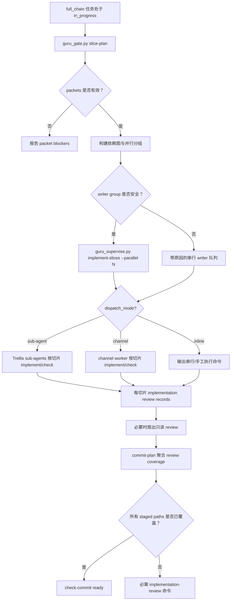

# Guru 路由感知并行切片监督加固设计

## §1 概要设计

### 1.1 设计摘要

在现有 Guru packet、平台 sub-agent 与可选 channel runtime 之上增加一个路由感知、dispatch-mode aware 的 full-chain 切片调度器：

1. 保持 `guru_gate.py slice-plan` 只读，但把它的 JSON 扩展为可执行调度 payload。
2. 增加有界 dispatcher，例如 `guru_supervise.py implement-slices`，读取 plan 并按 `codex.dispatch_mode` / 平台能力选择后端：当前项目默认输出或启动 Trellis sub-agent；仅在配置或显式选择 channel 时通过官方 `trellis channel` worker 启动安全分组。
3. 只有在可证明安全时才并行化 writer 切片；否则 writer 切片串行执行，同时在安全时仍可扇出只读检查/review。
4. 将 commit coverage 从“最新 implementation review row”改为“review set 覆盖 staged target paths”。
5. 保持 micro/lite 行为的 route-aware 边界，避免低风险任务承担 full-chain 切片开销。

### 1.2 行为 owner 归属表

| Behavior | Owner | Rationale |
| --- | --- | --- |
| BHV-001 | `guru_gate.py` `slice-plan` | 为什么属于它：gate 负责只读 readiness 与 blocker 报告。为什么不属于别人：supervisor 应执行 plan，而不是临时重新计算 gate policy。是否需独立存在：需要，操作者在 spawn worker 前需要只读预览。 |
| BHV-002 | `guru_supervise.py` dispatcher / 平台 dispatch adapter | 为什么属于它：supervisor 负责生成切片调度计划，平台 adapter 负责按 dispatch mode 执行 sub-agent 或 channel worker。为什么不属于别人：`guru_gate.py` 必须在 planning 中保持只读。是否需独立存在：需要，执行与诊断应分离。 |
| BHV-003 | `guru_supervise.py` dispatcher 加 `guru_review_record.py` packet validation | 为什么属于它：writer 安全取决于 packet target paths、dirty scope 和 runtime worker 启动。为什么不属于别人：commit gate 太晚才能发现坏状态。是否需独立存在：需要，不安全的并行写入必须在 spawn 前阻止。 |
| BHV-004 | `guru_supervise.py implementation-review` 与 deterministic check runner | 为什么属于它：这些路径是 check-only，且已绑定目标 packet。为什么不属于别人：主会话应协调，而不是手工运行每个只读检查。是否需独立存在：需要，它能在不引入写入竞争的情况下提速。 |
| BHV-005 | `guru_gate.py commit-plan` / `check-commit` | 为什么属于它：commit gate 负责 staged scope 授权。为什么不属于别人：单个 worker 不能授权整个 staged scope。是否需独立存在：需要，多切片 commit 需要聚合证明。 |
| BHV-006 | dispatch status adapter 与可选 `guru_supervise.py status` | 为什么属于它：dispatcher 负责 worker 生命周期观察与清理命令；channel 后端复用现有 status，sub-agent 后端输出主会话可执行的派发/等待报告。为什么不属于别人：commit-plan 应消费状态摘要，而不是抓取进程列表。是否需独立存在：需要，卡住的 worker 是直接耗时来源。 |
| BHV-007 | `guru_contract.py` / `guru_risk.py` / `guru_gate.py` route policy | 为什么属于它：route policy 决定何时应用 full-chain packet 要求。为什么不属于别人：dispatcher 不应意外提升 micro/lite 任务。是否需独立存在：需要，route-aware 行为是兼容性边界。 |
| BHV-008 | `.trellis/workflow.md`、platform dispatch templates、`.codex/agents/*`、`.trellis/agents/*` | 为什么属于它：dispatch mode、平台 sub-agent 与 channel worker 上下文是集成合同。为什么不属于别人：runtime 命令无法在 spawn 后修复缺失的 prompt context。是否需独立存在：需要，Codex pull-based sub-agent 需要 `Active task:` 行。 |
| BHV-009 | `guru_gate.py commit-plan`、workflow docs、Guru workflow templates | 为什么属于它：commit-tail 紧凑性是 workflow 合同。为什么不属于别人：worker 不应决定不可逆 git 行为。是否需独立存在：需要，commit tail 曾多次加载过多上下文。 |

### 1.3 流程



### 1.4 详细设计承接索引

| chapter_target | doc_type | 承接行为 | owner |
| --- | --- | --- | --- |
| `design.md#UNIT-slice-plan-scheduler` | runtime-control-flow | BHV-001, BHV-007 | `guru_gate.py` |
| `design.md#UNIT-parallel-slice-dispatcher` | runtime-control-flow | BHV-002, BHV-003, BHV-004, BHV-006 | `guru_supervise.py` |
| `design.md#UNIT-worker-isolation-policy` | evidence-contract | BHV-003, BHV-006 | `guru_supervise.py`, `guru_review_record.py` |
| `design.md#UNIT-review-coverage-aggregation` | evidence-contract | BHV-004, BHV-005 | `guru_gate.py`, `guru_review_record.py` |
| `design.md#UNIT-route-and-platform-parity` | config-contract | BHV-007, BHV-008, BHV-009 | workflows, templates, `.trellis/agents/*` |
| `design.md#UNIT-tests` | validation | BHV-001 through BHV-009 | overlay verify tests and CLI tests |

### 1.5 兼容性

- 现有单切片 `implement-check --slice <id>` 仍然有效。
- 现有 `slice-plan` consumer 仍然兼容，因为新增字段是 additive。
- 缺失或无效合同继续保持严格 full-chain 行为。
- Micro/lite 路由保持当前有限策略，除非自身合同要求，否则不需要切片包。
- Dispatcher 默认提供 dry-run 友好的显式命令，并使用有界并发。

### 1.6 回滚

回滚时可以禁用新的 dispatcher，同时保留扩展后的只读 `slice-plan` 输出。如果 review aggregation 引入 commit 风险，则回退为要求对完整 staged index 运行 `implementation-review --staged`，直到 aggregate coverage 修复。

## §2 详细设计

### 1. 单元职责

| UNIT | 职责 | 依赖关系 | 承接行为 |
| --- | --- | --- | --- |
| UNIT-slice-plan-scheduler | 为只读 `slice-plan` 增加 dependency、parallel-group、blocker 和安全命令元数据。 | 读取 gate contract、slice packets、dirty scope 和 route policy。不 spawn worker，不写文件。 | BHV-001, BHV-007 |
| UNIT-parallel-slice-dispatcher | 增加 dispatch-mode aware 的有界执行入口，消费 `slice-plan` 并为可运行分组输出或启动匹配后端的 worker。 | 依赖 `slice-plan`、`codex.dispatch_mode`、平台 sub-agent 能力、可选 channel plan builder 和 worker status。 | BHV-002, BHV-003, BHV-004, BHV-006 |
| UNIT-worker-isolation-policy | 判断切片能否作为 writer、read-only reviewer 或 serial-only item 并发运行。 | 读取 packet `target_paths`、`dirty_state`、deterministic checks、dependency metadata 和 status JSON。 | BHV-003, BHV-006 |
| UNIT-review-coverage-aggregation | 用 clean slice/staged review records 的 target-path coverage 替代 latest-row-only commit authorization。 | 读取 `review-records/implementation-reviews.jsonl`、staged paths、target digests 和 commit contract。 | BHV-004, BHV-005 |
| UNIT-route-and-platform-parity | 保持 route policy、dispatch mode、worker prompt context 在 platform sub-agents 与 channel runtime 之间一致。 | 读取 `.trellis/workflow.md`、platform integration specs、`.codex/agents/*`、`.trellis/agents/*` 和 Guru workflow templates。 | BHV-007, BHV-008, BHV-009 |
| UNIT-tests | 覆盖 scheduling、dispatch、safety fallback、review aggregation、route compatibility 和 prompt/context parity。 | 使用 Guru overlay verify tests、TypeScript tests、Python compile 和 template sync checks。 | BHV-001, BHV-002, BHV-003, BHV-004, BHV-005, BHV-006, BHV-007, BHV-008, BHV-009 |

### 2. 失败收口

| Failure class | 收口规则 | Owner |
| --- | --- | --- |
| Invalid or stale slice packet | `slice-plan` 报告 blockers，dispatcher 拒绝 spawn 该切片。 | `guru_gate.py` / `guru_supervise.py` |
| Unsafe writer parallelism | 将分组降级为串行执行，并输出明确 blocker reasons。 | `guru_supervise.py` |
| Worker 失败或状态卡住 | 停止依赖分组，保留无关只读状态可见性，并在 commit planning 前要求 cleanup/resume evidence。 | `guru_supervise.py status` |
| 缺少 review 覆盖 | `commit-plan` / `check-commit` 报告未覆盖的 staged paths 和精确 review commands。 | `guru_gate.py` |
| 路由不匹配 | 保持已选择的 micro/lite/full 行为不变，并以 route-policy guidance 失败，而不是静默升降级任务。 | `guru_contract.py` / `guru_risk.py` |

### UNIT-slice-plan-scheduler

#### 单元职责

为 full-chain 切片任务生成 additive 的只读调度 payload。

#### 行为定义

##### 行为清单

| 行为 | 简述 | 承接 BHV |
| --- | --- | --- |
| EmitParallelGroups | 创建稳定的 `parallel_groups`，包含可运行 slice ids 与原因。 | BHV-001 |
| PreserveReadOnlyPlan | `slice-plan` 绝不写 packet、review、task 或 contract 文件。 | BHV-001 |
| RespectRoutePolicy | 只在 route/risk policy 要求时才要求 packet。 | BHV-007 |

#### 核心数据结构

```json
{
  "schema_version": 2,
  "route": "full_chain",
  "risk": "high",
  "parallel_groups": [
    {
      "group_id": "g1",
      "mode": "writer|read_only|serial",
      "slice_ids": ["UNIT-a", "UNIT-b"],
      "max_parallel": 2,
      "blocking_reasons": []
    }
  ],
  "slices": [
    {
      "slice_id": "UNIT-a",
      "target_paths": [],
      "depends_on": [],
      "parallel_safe": true,
      "parallel_mode": "writer",
      "parallel_blockers": [],
      "recommended_commands": {
        "implement_check": "...",
        "implementation_review": "..."
      }
    }
  ]
}
```

#### 逐行为设计

`EmitParallelGroups` 按依赖顺序排序切片，并对互不重叠的可运行切片分组。存在未解决依赖、无效 packet、范围外脏变更或目标路径重叠的切片保留在 `serial` 或 blocked 状态。

`PreserveReadOnlyPlan` 复用现有 `slice-plan` 命令语义：只向 stdout 输出 JSON，以 exit 0 返回诊断 payload，并在 JSON 中携带 blockers。

`RespectRoutePolicy` 将 route 与 packet-required 逻辑委托给现有 `guru_risk.full_chain_packet_required(...)` 和 contract helpers。它不会提升 micro/lite 任务。

#### 状态/边界管理

`slice-plan` 读取任务产物与工作树状态，不写任何内容。

#### 数据合同

`parallel_groups` 在 dispatcher spawn 前重新校验前都只是 advisory。Dispatcher 不能信任陈旧 plan 输出，必须重新读取当前磁盘状态。

#### 测试映射

- Zero、one、multiple packet fixtures。
- 多个互不重叠的 packet 产生一个 writer group。
- 目标路径重叠产生 serial/blocker metadata。
- Micro/lite 路由不要求 packet。

#### 不得补造清单

- 不得从 `slice-plan` 写入 packet 文件。
- 不得仅因 packet 文件名不同就把 ambiguous packets 标记为 safe。

### UNIT-parallel-slice-dispatcher

#### 单元职责

按当前 dispatch mode 以有界并发运行或输出安全切片分组。当前项目默认 `sub-agent`；channel 仅作为配置或显式选择的 durable worker 后端。

#### 行为定义

##### 行为清单

| 行为 | 简述 | 承接 BHV |
| --- | --- | --- |
| DispatchBoundedGroup | 从当前分组启动最多 `--parallel N` 个安全 worker。 | BHV-002 |
| SelectDispatchBackend | 根据 `codex.dispatch_mode`、CLI `--backend` 和平台能力选择 `sub-agent`、`channel` 或 `inline` 后端。 | BHV-002, BHV-008 |
| FanoutReadOnlyReview | 不需要 writer worker 时启动只读 review/check jobs。 | BHV-004 |
| PollAndResume | 使用 worker status JSON 等待、清理或推进分组。 | BHV-006 |
| SerialFallback | 当 writer 隔离无法证明时回退到串行执行。 | BHV-003 |

#### 核心数据结构

```python
class SliceDispatchItem(TypedDict):
    slice_id: str
    mode: Literal["writer", "read_only", "serial"]
    command: list[str]
    target_paths: list[str]
    blockers: list[str]
```

#### 逐行为设计

`DispatchBoundedGroup` 调用与 `implement-check --slice` 相同的内部 run-plan builder，但用 dispatcher loop 包装多个 item。它遵守 CLI `--parallel`；channel 后端还遵守 `.trellis/config.yaml channel.worker_guard.max_live_workers` 和现有 channel worker guard failures；sub-agent 后端遵守平台 Agent 工具的并发/上下文隔离能力。

`SelectDispatchBackend` 默认读取 `.trellis/config.yaml codex.dispatch_mode`。当值为 `sub-agent` 时，dispatcher 生成 Trellis sub-agent 派发 brief，主会话使用平台 Agent 工具并行启动 `trellis-implement` / `trellis-check`；当值为 `channel` 时，dispatcher 使用官方 channel plan builder；当值为 `inline` 或后端不可用时，dispatcher 输出串行命令和原因，不伪装并发。

`FanoutReadOnlyReview` 在代码已经存在时使用 `implementation-review --slice <id>` 或确定性 check jobs。它不得运行 implement worker。

`PollAndResume` 消费后端状态摘要。Channel 后端使用 `guru_supervise.py status --json`，而不是 `ps` 或手工抓取 channel 状态；sub-agent 后端使用主会话可见的派发结果与 worker final status，不伪造 channel events。

`SerialFallback` 输出分组必须串行的原因：目标重叠、依赖未 clean、脏变更范围无效、资源锁或缺失 packet。

#### 状态/边界管理

Dispatcher 只写 worker 产生的现有可变 evidence：implementation review records、worker events，以及可选 dispatch evidence。它不编辑 `prd.md`、`design.md` 或 `implement.md`。

#### 数据合同

每个 spawned prompt 都包含 active task path、slice id、allowed write set 和 nested-dispatch guard。Sub-agent 后端必须以 `Active task: <path>` 开头；channel 后端的 worker 名称包含 action、provider、slice id 和 run id，以便 status 关联。

#### 测试映射

- `--dry-run` 显示精确 dispatch backend、sub-agent brief 或 channel commands、group decisions，且不创建 channel / 不启动 sub-agent。
- 即使有更多可运行切片，`--parallel 2` 也只启动两个 worker。
- 当前项目 `codex.dispatch_mode: sub-agent` 时，不默认创建 channel。
- 存在 terminal workers 的 status 不阻塞下一个分组。
- 某个 worker 失败会停止依赖分组，但允许无关只读状态继续报告。

#### 不得补造清单

- 不得在 channel worker 内 spawn 直接平台 sub-agent。
- 不得在 `sub-agent` mode 下隐式改走 channel。
- 不得把 worker failures 隐藏在 advisory 输出后面。

### UNIT-worker-isolation-policy

#### 单元职责

保护共享 checkout 与 review digests，避免不安全并行写入。

#### 行为定义

##### 行为清单

| 行为 | 简述 | 承接 BHV |
| --- | --- | --- |
| CheckPathDisjointness | Writer slices 必须拥有互不重叠的 `target_paths`。 | BHV-003 |
| CheckDirtyIsolation | 脏路径必须干净、位于 target paths 内，或由 packet 声明为 unrelated。 | BHV-003 |
| CheckResourceLocks | 共享锁的 tests/build commands 会强制 serial 或 read-only grouping。 | BHV-003 |
| SurfaceLifecycleBlockers | Live/stuck workers 是显式 blockers 或 wait targets。 | BHV-006 |

#### 核心数据结构

| Field | Meaning |
| --- | --- |
| `parallel_safe` | Dispatcher 可以按声明模式并发运行该切片。 |
| `parallel_mode` | `writer`、`read_only` 或 `serial`。 |
| `parallel_blockers` | 稳定 blocker codes 与人类可读原因。 |
| `resource_locks` | 从 deterministic commands 推断的可选锁名，例如 Flutter pub/test startup。 |

#### 逐行为设计

路径互斥使用规范化 POSIX paths，并将目录前缀关系视为重叠。Dirty isolation 复用 `_dirty_scope_for_packet`。Resource locks 初始保持保守：宽泛 package manager、generated build runner 或非 target-scoped test commands 可以强制串行执行。

#### 状态/边界管理

隔离会检查两次：plan 阶段一次，spawn 前立即再检查一次。

#### 数据合同

如果切片不适合 parallel writer mode，只要能在不修改文件的情况下计算 target digest，它仍然可以进入 read-only review。

#### 测试映射

- 目录前缀重叠会阻止 writer parallelism。
- target paths 外的 dirty file 会阻止 writer parallelism。
- 已完成前序切片留下的 dirty file 只有在当前 packet 将其声明为 unrelated 或 dependency-clean 时才可接受。
- Resource-lock conflict 会串行化其他方面互不重叠的切片。

#### 不得补造清单

- 不得只根据 slice 数量推断“safe”。
- 不得因为稍后的 commit-plan 可能捕获问题，就忽略范围外脏路径。

### UNIT-review-coverage-aggregation

#### 单元职责

让 commit authorization 证明所有 staged implementation paths，而不是只证明最新 clean record。

#### 行为定义

##### 行为清单

| 行为 | 简述 | 承接 BHV |
| --- | --- | --- |
| LoadReviewSet | 读取任务所有有效 clean implementation review rows。 | BHV-005 |
| MatchStageCoverage | 将 staged code paths 映射到已 review 的 target paths 和当前 digests。 | BHV-005 |
| RecommendMissingReviews | 输出精确缺失的 `implementation-review --slice/--staged` 命令。 | BHV-004, BHV-005 |

#### 核心数据结构

```json
{
  "review_coverage": {
    "covered_stage_paths": [],
    "uncovered_stage_paths": [],
    "covering_reviews": [
      {"run_id": "...", "slice_id": "UNIT-a", "target_paths": []}
    ]
  }
}
```

#### 逐行为设计

`LoadReviewSet` 通过现有 verdict validation 过滤记录。`MatchStageCoverage` 为每组 review target 计算 digest，并验证每个 staged path 至少属于一个当前 clean review。`RecommendMissingReviews` 在 packet ownership 已知时优先推荐 slice-specific review；只有 cross-slice staged target 是有意行为时才推荐 staged review。

#### 状态/边界管理

任务/workspace 产物仍排除在 implementation commits 之外。混合任务产物仍需拆分处理。

#### 数据合同

Latest row 只能满足自身 target 的覆盖。它不再是所有 staged paths 的全局授权。

#### 测试映射

- Slice B 的最新 clean review 不覆盖 slice A 的 staged path。
- 两个 clean slice reviews 可以共同覆盖 multi-slice staged scope。
- 某个切片中的 stale digest 只阻塞该切片路径，并推荐匹配的 review 命令。

#### 不得补造清单

- 不得把 task artifacts 变成已 review 的 implementation paths。
- 不得让高风险切片的 packet coverage 出现宽泛目标 `"."`。

### UNIT-route-and-platform-parity

#### 单元职责

保持 route behavior、dispatch mode、platform sub-agent context 和 commit-tail compactness 在 workflow 与 template surface 之间一致。

#### 行为定义

##### 行为清单

| 行为 | 简述 | 承接 BHV |
| --- | --- | --- |
| RouteBoundedParallelism | 只对要求 packet 的路由应用 parallel slice scheduling。 | BHV-007 |
| DispatchModeSelection | 根据配置和 CLI override 选择 sub-agent、channel 或 inline 后端。 | BHV-008 |
| PreserveActiveTaskPrelude | 保留平台 sub-agent 的 `Active task: <path>` 首行 guidance。 | BHV-008 |
| AvoidNestedDispatch | Worker prompts 明确自己已经是 worker，不得再 spawn implement/check。 | BHV-008 |
| CompactCommitTail | `commit-plan` 后只加载下一步所需的 gate/status/plan evidence。 | BHV-009 |

#### 核心数据结构

路由兼容性保存在 `gate-contract.json`；dispatch mode 保存在 `.trellis/config.yaml`；平台一致性保存在 workflow/template text、`.codex/agents/*` 和 `.trellis/agents/*`。

#### 逐行为设计

路由策略使用现有 contract route names。如果 `Active task:` 规则文本变化，平台变更必须检查 `.trellis/workflow.md`、Guru workflow templates 和平台调度协议。

#### 状态/边界管理

Channel worker definitions 与 platform sub-agent files 是不同执行面。本任务按 dispatch mode 选择执行后端：当前项目优先 direct Trellis sub-agent；只有 channel 后端被选择时才通过 Guru supervisor 和 `.trellis/agents/*` 改变 channel runtime 行为。

#### 数据合同

Dispatcher 必须报告哪条 route policy 使 slice scheduling 生效或失效，以及哪个 dispatch mode/backend 被选中。

#### 测试映射

- Micro/lite tasks 在 route fixtures 中保持 packet-free。
- `codex.dispatch_mode: sub-agent` fixture 不创建 channel，并输出 sub-agent dispatch brief。
- `codex.dispatch_mode: channel` fixture 使用 channel backend。
- Codex pull-based prompt 仍包含 active task guidance。
- Commit-plan 停止规则出现在 workflow/template text 中。

#### 不得补造清单

- 当只有 channel runtime behavior 变化时，不得编辑 platform-specific agent files。
- 当当前项目配置为 `sub-agent` 时，不得把 channel 当成默认后端。
- 不得要求 micro/lite 用户在实现后回填 full PRD/overview/detail。

### UNIT-tests

#### 单元职责

证明 scheduler、dispatcher、route boundaries、review coverage、worker status 和 template sync behavior。

#### 行为定义

##### 行为清单

| 行为 | 简述 | 承接 BHV |
| --- | --- | --- |
| VerifyPlanSchema | 验证 additive `slice-plan` schema。 | BHV-001 |
| VerifyDispatchSafety | 验证有界并发和串行回退。 | BHV-002, BHV-003, BHV-006 |
| VerifyReviewCoverage | 验证 multi-review commit coverage。 | BHV-004, BHV-005 |
| VerifyDispatchModeParity | 验证 micro/lite/full route behavior、dispatch mode selection 和 prompt docs。 | BHV-007, BHV-008, BHV-009 |

#### 核心数据结构

Fixture 应包含 high-risk full-chain 的 0、1、2 个独立 packet，以及 2 个重叠 packet。

#### 逐行为设计

保持 shell fixtures 小而确定。尽可能使用 dry-run。对 review coverage aggregation 使用聚焦 Python snippets。

#### 状态/边界管理

测试不得要求真实 provider calls。除非现有 test harness 已 mock，否则 channel spawn behavior 应 dry-run 或 stub。

#### 数据合同

当前 sync checks 要求一致的 template/source copies 必须保持字节级对齐。

#### 测试映射

- Guru overlay verify shell tests。
- 对所有已变更 Python scripts 运行 `python3 -m py_compile`。
- 运行 `pnpm --filter @devsc/trellis run sync:guru:check`。
- 对 bundled templates/workflow parity 运行相关 TypeScript tests。

#### 不得补造清单

- 不得通过禁用 worker guards 或绕过 contract validation 来让测试通过。
