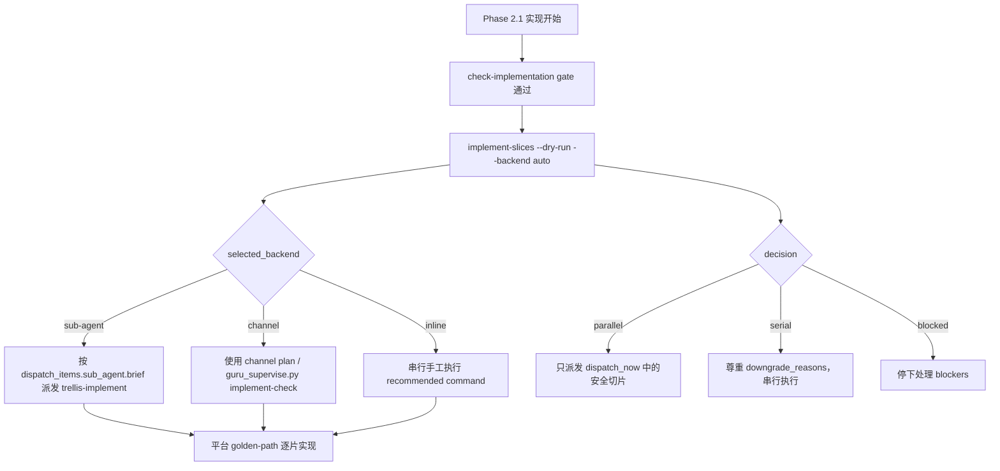

# H5/Go/iOS Guru workflow slice dispatcher parity 设计

## §1 概要设计

### 1.1 设计摘要

本任务将 Flutter/client workflow 已落地的 Phase 2.1 dispatcher 前置入口推广到 H5、Go、iOS workflow。变更是文档/模板合同层，不改运行时脚本：

1. 在 H5、Go、iOS 的 Phase 2.1 实现段开头加入统一前置命令：
   `python3 .trellis/scripts/guru/guru_supervise.py implement-slices <task-dir> --dry-run --backend auto`。
2. 明确主会话必须根据 dry-run JSON 的 `selected_backend`、`decision`、`dispatch_items`、`dispatch_now`、`deferred_slices` 行动。
3. 保留 `sub-agent`、`channel`、`inline` 三种后端语义和 nested-dispatch guard。
4. 不改平台实现顺序、领域 skill、golden-path 约束。
5. 同步 source template 与 `guru-template` mirror，并用 `sync:guru:check` 验证无漂移。
6. 追加修正 H5、Go、iOS、client 的 `[workflow-state:in_progress]` breadcrumb，避免 per-turn 注入内容继续写 channel-first。
7. 同步更新 bundled Guru workflow 测试，避免测试继续把 ordinary `in_progress` 锁定到旧的 channel-first breadcrumb。

### 1.2 行为 owner 归属表

| 行为 | Owner | Rationale |
| --- | --- | --- |
| BHV-001 H5 workflow 先读取 dispatcher plan | `packages/cli/src/templates/guru/workflows/guru-h5.md` + `guru-template/workflows/guru-h5-workflow.md` | 为什么属于它：H5 workflow 是 H5 Phase 2.1 主会话行为的 source of truth。为什么不属于别人：运行时脚本已具备能力，H5 platform skill 只负责领域实现口径。是否需独立存在：需要，H5 安装模板必须自己携带入口合同。 |
| BHV-002 Go workflow 先读取 dispatcher plan | `packages/cli/src/templates/guru/workflows/guru-go.md` + `guru-template/workflows/guru-go-workflow.md` | 为什么属于它：Go workflow 承接 Go 平台实现顺序与调度入口。为什么不属于别人：Go writing/review skill 不应决定主会话调度后端。是否需独立存在：需要，Go 模板不能依赖 Flutter/client 文案间接推断。 |
| BHV-003 iOS workflow 先读取 dispatcher plan | `packages/cli/src/templates/guru/workflows/guru-ios.md` + `guru-template/workflows/guru-ios-workflow.md` | 为什么属于它：iOS workflow 承接 iOS 平台实现顺序与调度入口。为什么不属于别人：iOS skill 只负责 Swift/iOS 实现规范，不负责 dispatcher 启动顺序。是否需独立存在：需要，iOS 模板安装后必须自洽。 |
| BHV-004 dispatch-mode aware 与安全降级 | 三个平台 Phase 2.1 实现段 | 为什么属于它：Phase 2.1 是实现派发入口。为什么不属于别人：`guru_supervise.py` 只输出计划，主会话是否遵循计划由 workflow 约束。是否需独立存在：需要，防止回到 channel-first 或手工分支。 |
| BHV-005 保留平台领域实现口径 | 三个平台 Phase 2.1 实现段 | 为什么属于它：平台 golden-path 直接写在 workflow 领域段。为什么不属于别人：dispatcher 不能拥有 H5/Go/iOS 领域规则。是否需独立存在：需要，统一入口不能牺牲平台约束。 |
| BHV-006 模板镜像一致 | `sync-guru-template` contract | 为什么属于它：package source 与 bundled mirror 是安装输入。为什么不属于别人：目标项目安装只消费打包模板，不能修复源侧漂移。是否需独立存在：需要，否则目标 repo 会拿到旧 workflow。 |
| BHV-007 workflow-state:in_progress breadcrumb dispatch-mode aware | `packages/cli/src/templates/guru/workflows/guru-{client,h5,go,ios}.md` + `guru-template/workflows/guru-{client,h5,go,ios}-workflow.md` | 为什么属于它：`[workflow-state:in_progress]` 是每轮注入主会话的 runtime breadcrumb。为什么不属于别人：`guru_supervise.py` 已输出 dispatcher plan，但 breadcrumb 旧文案会把主会话带回 channel-first。是否需独立存在：需要，Phase 2.1 正文修好但 breadcrumb 仍错会继续复发。 |
| BHV-008 bundled workflow regression test dispatch-mode aware | `packages/cli/test/guru/guru-bundled.test.ts` | 为什么属于它：该测试是 bundled Guru workflow 的回归合同，当前仍断言 old channel-first breadcrumb。为什么不属于别人：workflow 文案改动必须由对应回归测试同步承接，否则测试红灯会阻断提交。是否需独立存在：需要，防止后续把 ordinary `in_progress` 再锁回 channel。 |

### 1.3 流程

### 1.4 详细设计承接索引

| chapter_target | doc_type | 承接行为 | owner |
| --- | --- | --- | --- |
| `design.md#UNIT-workflow-dispatcher-wording` | workflow-contract | BHV-001, BHV-002, BHV-003, BHV-004 | workflow templates |
| `design.md#UNIT-workflow-state-breadcrumb-dispatcher-wording` | workflow-contract | BHV-007 | workflow-state blocks |
| `design.md#UNIT-platform-golden-path-preservation` | workflow-contract | BHV-005 | workflow templates |
| `design.md#UNIT-template-mirror-sync` | validation-contract | BHV-006 | sync:guru |
| `design.md#UNIT-tests` | validation | BHV-001..BHV-008 | focused checks |

### 1.5 兼容性

- Existing H5/Go/iOS tasks continue to use the same platform implementation/review skills.
- Runtime dispatcher behavior is unchanged.
- Existing `channel` users still work when `codex.dispatch_mode=channel` or `--backend channel` is explicitly selected.
- Existing `inline` users get clearer serial/manual instructions.
- Flutter/client Phase 2.1 workflow remains the baseline and does not need behavioral change; client `[workflow-state:in_progress]` breadcrumb now changes because user explicitly expanded scope.

### 1.6 回滚

If the wording causes confusion or breaks a target workflow, rollback is limited to the eight workflow template files. Runtime gate/supervisor code remains untouched.

## §2 详细设计

### 数据合同（类型专属章节）

本任务类型是 `workflow-template parity`。专属约束如下：

- 变更面是 Guru workflow 模板，不是 runtime Python/TypeScript。
- 入口语义必须从 `implement-slices --dry-run --backend auto` 的 report 派生，而不是手写 channel/sub-agent 分支。
- 文案必须能被主会话执行，也必须对可能看到 breadcrumb/prompt 的 sub-agent 安全：worker 自豁免，不再嵌套 spawn implement/check。
- 平台领域段落是 workflow 模板的一部分，不允许为了统一 dispatcher 入口而删减。

本任务消费的核心数据合同是 `implement-slices --dry-run` JSON report；workflow 文案必须把该 report 作为主会话 dispatch 决策输入，而不是重新计算或猜测调度状态。

### UNIT-workflow-dispatcher-wording

#### 单元职责

统一 H5、Go、iOS Phase 2.1 的第一段 dispatch 文案，使其先读取 `implement-slices` dry-run plan，再派发 worker。

#### 行为定义

| 行为 | 简述 | 承接 BHV |
| --- | --- | --- |
| AddDryRunPrelude | 在 Phase 2.1 dispatch 段开头加入 `implement-slices <task-dir> --dry-run --backend auto`。 | BHV-001, BHV-002, BHV-003 |
| BindActionsToPlan | 要求主会话按 dry-run report 的 backend/decision/items 行动。 | BHV-004 |
| PreserveBackendTerms | 使用 `sub-agent`、`channel`、`inline` 现有术语，不引入新后端名。 | BHV-004 |

#### 核心数据结构

本单元消费 `implement-slices --dry-run` report 中的既有字段，不新增 schema：

| Field | 用途 |
| --- | --- |
| `selected_backend` | 决定走 `sub-agent`、`channel` 或 `inline`。 |
| `decision` | 决定并行、串行或阻断。 |
| `dispatch_items` | 每个 slice 的 sub-agent brief / channel command / manual command。 |
| `dispatch_now` | 本轮可立即派发的 slice ids。 |
| `deferred_slices` | 因并发预算或串行降级暂缓的 slice ids。 |
| `downgrade_reasons` | 串行或阻断原因，主会话必须报告而不是绕过。 |

#### 逐行为设计

`AddDryRunPrelude` 以 Flutter/client workflow 的 Phase 2.1 语义为基线，替换 H5/Go/iOS 中“主会话先按 `codex.dispatch_mode` 选择后端”的泛化句。

`BindActionsToPlan` 明确以下字段是执行依据：

- `selected_backend`
- `decision`
- `dispatch_items`
- `dispatch_now`
- `deferred_slices`
- `downgrade_reasons`

`PreserveBackendTerms` 保持：

- `sub-agent`：按返回的 `trellis-implement` brief 派发平台 sub-agent。
- `channel`：才使用官方 channel worker / `guru_supervise.py implement-check`。
- `inline`：串行手工执行 recommended commands。

#### 状态/边界管理

- Phase 2.1 正文改动不依赖 `[workflow-state:*]`；BHV-007 单独覆盖 `[workflow-state:in_progress]` breadcrumb。
- 不新增 task status。
- 不改 platform marker blocks。
- 不改 runtime parser。

#### 类型专属章节

Workflow contract 变更分两类：Phase 2.1 实现段 dispatch prelude，以及用户追加确认的 `[workflow-state:in_progress]` breadcrumb parity。仍不改 platform marker blocks、task status writer、workflow parser 或 install/update 机制。

### UNIT-workflow-state-breadcrumb-dispatcher-wording

#### 单元职责

将 H5、Go、iOS、client 的 `[workflow-state:in_progress]` per-turn breadcrumb 从 channel-first 改为 dispatch-mode aware，使 active task 每轮提示与 Phase 2.1 正文一致。

#### 行为定义

| 行为 | 简述 | 承接 BHV |
| --- | --- | --- |
| ReplaceChannelDefaultBreadcrumb | 删除“默认用官方 trellis channel”措辞。 | BHV-007 |
| AddBreadcrumbDryRunPrelude | 在 breadcrumb 中加入 `implement-slices <task-dir> --dry-run --backend auto`。 | BHV-007 |
| KeepBreadcrumbSafeForSubagents | 明确 worker 自豁免，不嵌套 spawn implement/check。 | BHV-007 |
| PreservePlatformEvidenceReminder | 保留各平台验证证据缺失不得 commit、设计缺陷回 Phase 1 的提示。 | BHV-007 |

#### 核心数据结构

breadcrumb 消费与 Phase 2.1 相同的 dry-run report 字段，但只做短提示：

| Field | breadcrumb 用途 |
| --- | --- |
| `selected_backend` | 决定 `sub-agent`、`channel` 或 `inline`。 |
| `dispatch_now` | 本轮可派发切片。 |
| `deferred_slices` | 后续轮次处理切片。 |
| `decision` | `serial|blocked` 时不得强并行。 |

#### 状态/边界管理

- 只修改 `[workflow-state:in_progress]` block body，不改 block marker。
- 不改 `in_progress-channel` / `in_progress-sub-agent` / `in_progress-inline` 的状态名或 hook parser。
- breadcrumb 必须可被 sub-agent 安全读取：若 worker 看到该提示，应知道自己已被调度，不再嵌套 spawn implement/check。

#### 失败收口

- 如果 `sync:guru:check` 失败，补齐 source/mirror。
- 如果任一 breadcrumb 仍含“默认用官方 trellis channel”，视为未收口。
- 如果 breadcrumb 删除平台验证证据提醒，恢复。

#### 失败收口

- 如果 `decision=blocked`，主会话必须停下处理 `slice_plan_blocking_reasons` / `downgrade_reasons`。
- 如果 `decision=serial`，主会话只能串行执行 `dispatch_now` / recommended commands，不得自行并行。
- 如果 `selected_backend=inline`，主会话必须加载本平台实现规范后手工执行，不得 spawn sub-agent。

#### 不得补造清单

- 不得写成 channel-first。
- 不得让 worker 自己再运行 `implement-slices` 并 spawn 子 worker。
- 不得暗示 `--dry-run` 会实际执行 slice。

### UNIT-platform-golden-path-preservation

#### 单元职责

确保统一 dispatch 入口时保留平台实现语义。

#### 行为定义

| 行为 | 简述 | 承接 BHV |
| --- | --- | --- |
| PreserveH5Rules | 保留 H5 自底向上实现顺序和 server/client 边界。 | BHV-005 |
| PreserveGoRules | 保留 Go 分层、ServeMux、错误链和生命周期约束。 | BHV-005 |
| PreserveIOSRules | 保留 iOS DDD、FactoryKit、Repository、ViewModel 和持久化边界。 | BHV-005 |

#### 核心数据结构

本单元不新增数据结构，只保护现有 workflow 文本中的平台语义段：

| Platform | 必须保留的语义 |
| --- | --- |
| H5 | `h5-implementation-guru-writing`、自底向上七类实现顺序、server/client 边界、metadata/SEO、样式隔离。 |
| Go | `go-implementation-guru-writing`、自下而上分层顺序、ServeMux、错误链、生命周期、secret 引用规则。 |
| iOS | `ios-implementation-guru-writing`、DDD 顺序、FactoryKit、Repository 接口/实现归属、ViewModel、WCDBSwift。 |

#### 逐行为设计

修改只触碰 Phase 2.1 dispatch 前置句，不删除后续平台领域段落。若需要重排长句，只允许保持同等或更强约束。

#### 状态/边界管理

平台 skill 名称必须保持：

- `h5-implementation-guru-writing`
- `go-implementation-guru-writing`
- `ios-implementation-guru-writing`

#### 类型专属章节

平台 workflow 类型专属约束是“先统一 dispatcher 入口，再保留平台领域执行口径”。因此每个平台只改 dispatch prelude，不把其他平台的 test/build 命令或层级 taxonomy 移植过来。

#### 失败收口

- 如果 diff 删除平台 skill 名称，恢复。
- 如果 diff 删除实现顺序，恢复。
- 如果 diff 把平台验证命令换成其他平台命令，恢复。

#### 不得补造清单

- 不把 H5 的 doc_type 七类迁移到 Go/iOS。
- 不把 Flutter/client 的 analyze/test 文案直接复制到 Go/iOS。
- 不新增未验证的平台测试命令。

### UNIT-template-mirror-sync

#### 单元职责

保证 source template 与 bundled mirror 一致。

#### 行为定义

| 行为 | 简述 | 承接 BHV |
| --- | --- | --- |
| UpdateSourceTemplates | 修改 `packages/cli/src/templates/guru/workflows/guru-{h5,go,ios}.md`。 | BHV-006 |
| UpdateBundledMirror | 修改 `guru-template/workflows/guru-{h5,go,ios}-workflow.md`。 | BHV-006 |
| VerifyNoDrift | 跑 `sync:guru:check`。 | BHV-006 |

#### 核心数据结构

| Pair | Source | Mirror |
| --- | --- | --- |
| Client | `packages/cli/src/templates/guru/workflows/guru-client.md` | `guru-template/workflows/guru-client-workflow.md` |
| H5 | `packages/cli/src/templates/guru/workflows/guru-h5.md` | `guru-template/workflows/guru-h5-workflow.md` |
| Go | `packages/cli/src/templates/guru/workflows/guru-go.md` | `guru-template/workflows/guru-go-workflow.md` |
| iOS | `packages/cli/src/templates/guru/workflows/guru-ios.md` | `guru-template/workflows/guru-ios-workflow.md` |
| Regression test | `packages/cli/test/guru/guru-bundled.test.ts` | N/A |

#### 逐行为设计

优先手动保持八个文件的对应段落一致；若发现镜像生成脚本支持同步，可运行 `sync:guru` 后再复查 diff。最终以 `sync:guru:check` 为验收。

#### 状态/边界管理

本任务不安装到目标项目；安装由一键安装 wrapper 或后续 operator 命令处理。

#### 类型专属章节

Template mirror 变更属于 packaging/install 输入合同。最终以 `sync:guru:check` 作为机器判定，不以人工肉眼比较作为唯一判定。

#### 失败收口

- `sync:guru:check` 失败时停止，不提交。
- 若 source/mirror 只有单面改动，补齐另一面或运行同步脚本。
- 若同步脚本产生额外非目标文件变更，检查后只保留本任务范围内必要变更。

#### 不得补造清单

- 不只改目标项目 `.trellis/workflow.md`。
- 不提交只改一面的镜像漂移。

### UNIT-tests

#### 单元职责

用聚焦验证证明 workflow parity 已收口。

#### 行为定义

| 行为 | 简述 | 承接 BHV |
| --- | --- | --- |
| VerifyWorkflowWording | 用字符串检查证明 H5、Go、iOS、client workflow 均先运行 dispatcher dry-run，且不再 channel-first。 | BHV-001, BHV-002, BHV-003, BHV-004, BHV-007 |
| VerifyPlatformRules | 用平台 guard terms 检查证明 H5、Go、iOS golden-path 未被统一文案削弱。 | BHV-005 |
| VerifyMirrorSync | 用 `sync:guru:check` 和 diff check 证明 source/mirror 无漂移。 | BHV-006 |
| VerifyBundledRegressionTest | 用 targeted Vitest 证明 bundled Guru workflow regression test 已从 channel-first 改为 dispatcher-plan-first。 | BHV-008 |

#### 测试映射

- `rg -n "implement-slices <task-dir> --dry-run --backend auto" packages/cli/src/templates/guru/workflows/guru-{h5,go,ios}.md guru-template/workflows/guru-{h5,go,ios}-workflow.md`
- `rg -n "implement-slices <task-dir> --dry-run --backend auto" packages/cli/src/templates/guru/workflows/guru-{client,h5,go,ios}.md guru-template/workflows/guru-{client,h5,go,ios}-workflow.md`
- `! rg -n "默认用官方 trellis channel" packages/cli/src/templates/guru/workflows/guru-{client,h5,go,ios}.md guru-template/workflows/guru-{client,h5,go,ios}-workflow.md`
- `pnpm --dir packages/cli exec vitest run test/guru/guru-bundled.test.ts -t "routes ordinary in_progress through dispatcher plan while preserving rollback modes"`
- `pnpm --filter @devsc/trellis run sync:guru:check`
- `git diff --check && git diff --cached --check`
- 若 staging implementation diff：`python3 .trellis/scripts/guru/guru_supervise.py implementation-review <task-dir> --staged`
- `python3 .trellis/scripts/guru/guru_gate.py commit-plan <task-dir>`

#### 核心数据结构

测试只读取文本与现有 Git/Guru gate 输出，不新增 fixture schema。

#### 类型专属章节

验证类型是 workflow-template parity check：字符串检查必须与镜像同步、平台约束人工复核和 Guru gate 组合使用。

#### 失败收口

- 任何验证失败都回到对应 slice 修文案。
- 如果 commit-plan 报 staged scope 混入无关文件，拆分 stage，不扩大本任务 scope。

#### 不得补造清单

- 不把 “rg 找到字符串” 当成唯一验收；还必须人工确认平台 golden-path 未被删。
- 不在 planning 阶段运行 implementation review。
