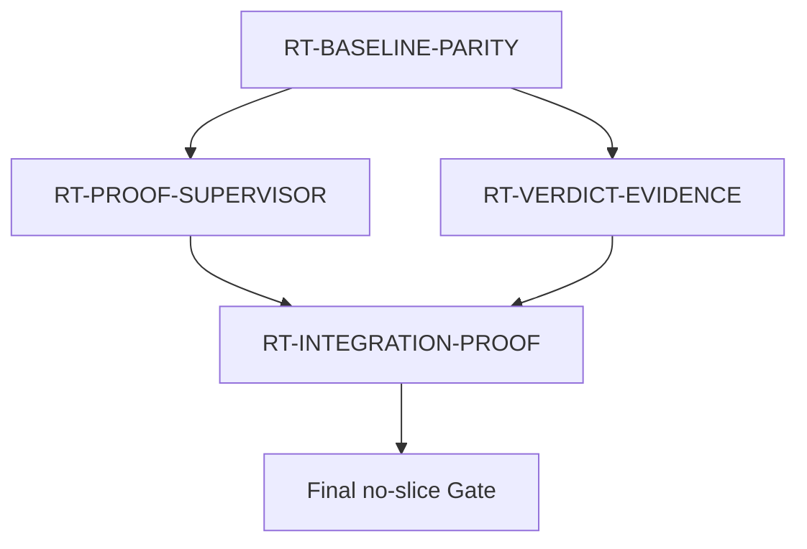
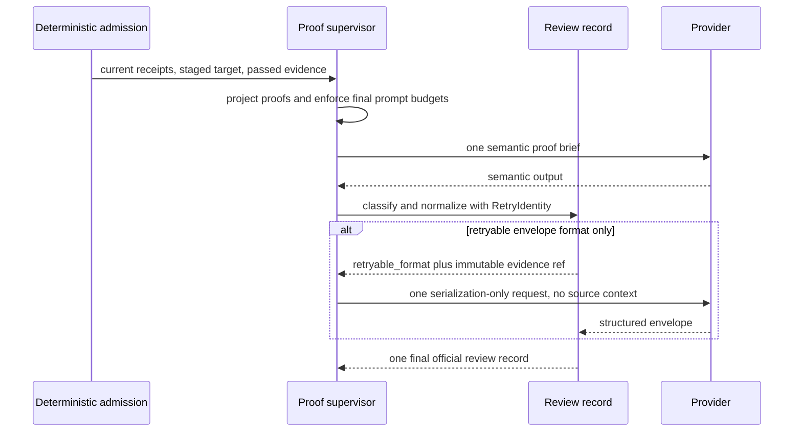

# Guru Integration Proof Context Runtime Optimization

## 1. Inputs And Hard Constraints

The change uses the existing Python `implementation-review` lifecycle and does
not add a TypeScript command, provider, receipt schema, or full-context fallback.
Only Full/high schema-v2 Integration review is eligible. Existing lower routes,
ordinary v2 review, append-only history, provider policy, and commit Gates remain
authoritative.

## 2. Behavior Ownership

| Behavior | Primary owner | Supporting evidence |
| --- | --- | --- |
| BHV-001 | UNIT-proof-supervisor | UNIT-integration-proof verifies final projection |
| BHV-002 | UNIT-proof-supervisor | UNIT-integration-proof records real metrics |
| BHV-003 | UNIT-proof-supervisor | UNIT-verdict-evidence separates formatting calls |
| BHV-004 | UNIT-verdict-evidence | UNIT-proof-supervisor orchestrates one retry |
| BHV-005 | UNIT-integration-proof | existing Gate helpers remain the runtime authority |
| BHV-006 | UNIT-proof-supervisor | all units preserve their scoped compatibility boundary |
| BHV-007 | UNIT-baseline-parity | UNIT-integration-proof generates exact package peers |
| BHV-008 | UNIT-integration-proof | both ordinary units expose counters and proofs |

Each behavior has one primary design owner. Supporting units verify or consume a
frozen contract but do not become a second mutable owner.

## 3. Ownership Rationale And Three Questions (归属理由与三问)

| Primary owner | Why it owns the behavior | Why not another owner | Independent value |
| --- | --- | --- | --- |
| UNIT-baseline-parity | restores canonical authority from current execution bytes | feature children must not absorb historical drift | yes, behavior-preserving parity commit |
| UNIT-proof-supervisor | owns admission, projection, prompt assembly, budgets, and provider orchestration | review-record must not dispatch or inspect source | yes, reversible context optimization |
| UNIT-verdict-evidence | owns identity, classification, immutable artifacts, and official normalization | supervisor must not create a second schema writer | yes, independently testable evidence contract |
| UNIT-integration-proof | owns generated peers and combined lifecycle proof | ordinary children cannot certify their composition | yes, Integration-last commit/receipt |

## 4. Architecture And Data Flow





## 5. Shared Contracts

The frozen values are `IntegrationProofBundle`, `OrdinaryReceiptProof`,
`GeneratedPeerProof`, `RetryIdentity`, and `VerdictEnvelope`. The frozen
cross-child operations are `build_retry_identity`,
`classify_retryable_format_failure`, `append_format_retry_evidence`, and
`normalize_retry_verdict`, exactly as specified in `../design.md`.

The final prompt budget is measured after complete serialization:

```text
payload_bytes = len(prompt.encode("utf-8"))
estimated_tokens = ceil(payload_bytes / 3)
payload_bytes <= 98304
estimated_tokens <= 25000
```

Either failure blocks before channel/provider creation. A formatting-only call
does not increment semantic-reviewer count and receives no files or JSONLs.
Because both limits apply, 75000 bytes is the largest passing prompt; 75001
bytes fails the token estimate and 98304 bytes also fails the token estimate.

The aggregate current-runtime `slice-plan` remains conservative because it sees
the serial baseline evolution and Integration coverage union. After baseline,
the coordinator dispatches only the disjoint proof-supervisor and
verdict-evidence parent packets into isolated worktrees. Child task directories
are allocation records, not independent lifecycle authorities; the parent task
alone is started and the control worktree alone publishes formal evidence.

## 6. Detailed Design Handoff Index (承接索引)

| chapter_target | doc_type | Owner | BHV | Detail artifact |
| --- | --- | --- | --- | --- |
| canonical source restoration | `controller` | UNIT-baseline-parity | BHV-007 | [`chapters/baseline-parity.md`](chapters/baseline-parity.md) |
| proof projection and provider admission | `usecase` | UNIT-proof-supervisor | BHV-001, BHV-002, BHV-003, BHV-006 | [`chapters/proof-supervisor.md`](chapters/proof-supervisor.md) |
| append-only retry evidence and normalization | `repository-datasource` | UNIT-verdict-evidence | BHV-004 | [`chapters/verdict-evidence.md`](chapters/verdict-evidence.md) |
| package generation and combined proof | `usecase` | UNIT-integration-proof | BHV-005, BHV-008 | [`chapters/integration-proof.md`](chapters/integration-proof.md) |

## 7. Compatibility And Rollback

- Baseline changes canonical bytes only and preserves current package behavior.
- Ordinary children own disjoint canonical files and can be reverted separately.
- Integration owns only the bounded Shell test and seven exact package peers.
- Retry evidence already written is immutable history and is never deleted.
- Revert Integration first, then the responsible ordinary child. Keep baseline
  parity unless all descendants are reverted.

## 8. Failure Ownership

| Failure | Owner | Outcome |
| --- | --- | --- |
| package/canonical mismatch after baseline | UNIT-baseline-parity | stop before runtime children |
| stale receipt, unsafe overlap, over-budget prompt, duplicate semantic read | UNIT-proof-supervisor | block before provider dispatch |
| identity drift, unsafe artifact, retry overflow, invalid normalization | UNIT-verdict-evidence | reject retry and fail closed |
| peer mismatch, compatibility failure, repeated full regression | UNIT-integration-proof | route to real owner and rerun Integration |
| unrelated route, schema, provider, or TypeScript change | parent boundary | out-of-scope hard stop |

## 9. Architecture Readiness Self-Check (架构就绪自检)

- G1: BHV-001..BHV-008 are closed and testable.
- G2: every behavior and mutable path has one primary owner.
- G3: baseline, ordinary runtime, and Integration boundaries are explicit.
- G4: proof and retry data flow is explicit and acyclic.
- G5: failures route to one owner before any fallback.
- G6: focused and final deterministic checks are executable.
- G7: legacy routes, schemas, provider policy, and history remain compatible.
- G8: no architecture or product decision remains open.

Architecture readiness: ready for two independent current-digest reviews.
