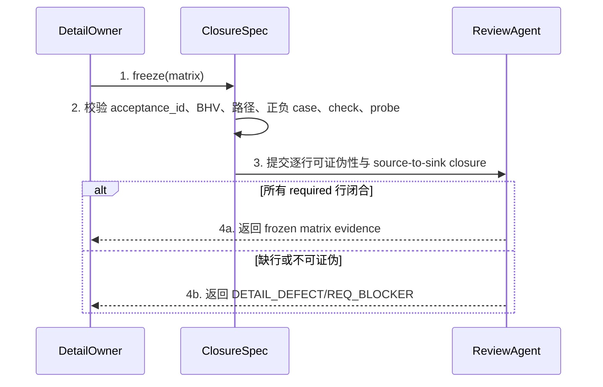

# CH-01 Acceptance Closure 详细设计

> doc_type: `evidence-contract` | l2_status: `task-local-v1`
> 承接索引: `design-main.md` 第 7 节 `CH-01 acceptance closure` | 返回: [design-main](../design-main.md)
> 技术决策: TD-001 | 规划标记: `runtime_acceptance_required=true`
> 本章的接口均为 Skill/workflow 合同记法，不要求新增运行时 class、parser 或 task/Gate schema。

## 1. 单元职责

### UNIT-acceptance-closure-contract

本单元承接 BHV-001、BHV-005、BHV-006，冻结 Acceptance Closure Matrix，并把执行结果追加到既有 `verification-evidence.jsonl`。`ClosureSpec` 唯一拥有完整 ledger/reconciliation currentness、调和 register 和 `AcceptanceResolution`；`EvidenceLedger` 唯一拥有 append history、稳定 position 与 raw snapshot identity。两者不引入中间 currentness owner。

本单元被 `ImplementAgent`、`ReviewAgent`、`RepairSkill` 和 `FinishSkill` 读取。执行者只能 append；`ClosureSpec` 独占 ledger replay，以及从 current/linked-active TaskRef 定位、append并完整重放 exact `<task_dir>/retrospective-reconciliation.jsonl`。每次 resolution 绑定 ledger/register snapshots，使 journal missing/corrupt、unreadable row或未调和 attempt 在 ID 过滤前阻断。consumer 只取得同一个 `AcceptanceResolution`。

## 2. 行为定义

### 2.1 行为清单

| 行为 | 简述 | 承接 |
| --- | --- | --- |
| `freezeAcceptanceClosure` | 在 Detail/`implement.md` 冻结每个验收目标的 source-to-sink、可证伪检查和 runtime probe | BHV-005 |
| `appendAcceptanceEvidence` | 向既有 mutable ledger 追加脱敏的技术或 runtime 证据，不回写冻结矩阵 | BHV-001, BHV-006 |
| `resolveCurrentAcceptance` | 按 baseline binding 和追加顺序计算每行 current 结论及任务级对外结论 | BHV-001, BHV-005 |
| `recordFailureRetrospective` | 为 post-implementation failure 记录根因、漏检 Gate、false-green 原因，以及“明确回写”或“无需回写理由”二选一的预防处置 | BHV-006 |

### 2.2 接口定义

以下是合同签名，不是待新增的代码类型：

```text
ClosureSpec.freeze(matrix: AcceptanceClosureMatrix) -> FrozenClosureMatrix
EvidenceLedger.append(row: VerificationEvidenceRow) -> LedgerAppendResult
EvidenceLedger.readAllInAppendOrder() -> LedgerReadSnapshot
ClosureSpec.initializeReconciliationJournal(task_ref: TaskRef) -> RetrospectiveReconciliationSnapshot
ClosureSpec.readReconciliationJournal(task_ref: TaskRef) -> RetrospectiveReconciliationSnapshot
ClosureSpec.appendReconciliationEvent(task_ref: TaskRef, event: ReconciliationJournalEvent) -> RetrospectiveReconciliationSnapshot
ClosureSpec.resolveCurrent(matrix: FrozenClosureMatrix, ledger_snapshot: LedgerReadSnapshot, reconciliation_snapshot: RetrospectiveReconciliationSnapshot, baseline: BaselineBinding) -> AcceptanceResolution
BreakLoopSkill.buildRetrospectiveEvidence(input: FailureRetrospectiveInput) -> FailureRetrospectiveDraft
ClosureSpec.validateRetrospective(draft: FailureRetrospectiveDraft) -> RetrospectiveValidation
RepairSkill.completeRepairRetrospective(input: FailureRetrospectiveInput, draft: FailureRetrospectiveDraft, validation: RetrospectiveValidation) -> FailureRetrospectiveRecord
ClosureSpec.reconcileRetrospectiveAppend(attempt_id: string, ledger_snapshot: LedgerReadSnapshot, reconciliation_snapshot: RetrospectiveReconciliationSnapshot) -> RetrospectiveAppendReconciliation
```

依赖方向固定为 executor 只能 append；`ClosureSpec` 读取完整 ledger + durable reconciliation snapshots 并生成 resolution；consumer 只读该对象。`EvidenceLedger` 不解释 planning/register，consumer 不得按 ID/status 直读或丢失 provenance/debt/reconciliation。`BreakLoopSkill` 只产草稿；`ClosureSpec` 校验复盘并拥有 attempt register transitions；最终 record 的唯一写 owner 仍是 `RepairSkill`。

## 3. 核心数据结构

### 3.1 数据模型

| 结构 | 必填字段 | 约束 |
| --- | --- | --- |
| `AcceptanceClosureRow` | `acceptance_id`, `bhv_refs`, `user_outcome`, `allowed_terminal_states`, `entrypoint`, `target_environment`, `authority_fingerprint`, `source_to_sink`, `positive_case`, `negative_cases`, `falsifiable_check`, `runtime_probe`, `evidence_owner`, `slice_refs`, `required` | digest-bearing planning contract；一行只描述一个可独立判定的验收目标 |
| `BaselineBinding` | `task_id`, `requirements_digest`, `overview_digest`, `detail_digest`, `implementation_snapshot` | current evidence 必须与当前适用 baseline 一致；未触及的上游 digest 可复用 |
| `LedgerAppend` | `append_position`, `raw_record`, `parse_outcome`, `readable_identity_components`, `readable_baseline_components`, `parsed_row?`, `parse_errors` | 只是在读取既有 ledger 时使用的 contract-level raw envelope，不新增持久 schema/parser；必须在按 acceptance ID 或 status 过滤前保留每个 append 及其稳定位置 |
| `LedgerSnapshotRef` | `artifact_ref`, `append_count`, `last_append_position`, `content_digest` | 绑定本次读取的完整 raw ledger bytes；空 ledger 的 count 为 0、last position 为 null；任一物理 append 必须改变 count/last position/content digest，旧 reference 不得代表新前缀 |
| `LedgerReadSnapshot` | `ledger_snapshot_ref`, `appends` | `appends` 必须覆盖 `artifact_ref` 在 `content_digest` 对应时刻的全部 raw append，数量/最后位置与 ref 一致；不得接受按 ID/status 过滤的 snapshot 或 ledger prefix |
| `LedgerAppendRef` | `artifact_ref`, `append_position`, `append_digest` | `deriveLedgerAppendRef(full_snapshot, exact_position)` 在过滤前独立计算；digest=该位置完整含换行 raw append bytes 小写 SHA-256。journal ref禁止参与推导；position区分同字节 rows |
| `VerificationEvidenceRow` | `acceptance_id`, `status`, `baseline_binding`, `environment`, `steps_or_command`, `expected`, `actual`, `evidence_refs`, `recorded_at`, `recorded_by`；correction row 另需 `corrects_append_position` | 追加到既有 `verification-evidence.jsonl`；`corrects_append_position` 只能指向同一 ledger 中更早的一个 exact append position；correction 必须精确保留目标 append 中所有可解析 identity/baseline 分量，只能补全不可解析分量；只存最小脱敏摘要和 artifact reference |
| `CorrectionDebt` | `debt_append_position`, `reason`, `readable_identity_components`, `readable_baseline_components`, `selected_correction_append_position?`, `validation_result`, `required_action` | 每个坏 append 一个 persistent debt；普通 later row 不关闭，newest exact-pointer correction invalid 时仍保持 open |
| `AcceptanceResolution` | `baseline_binding`, `ledger_snapshot_ref`, `reconciliation_snapshot_ref`, `open_correction_debts`, `open_retrospective_reconciliations`, `row_results`, `selected_evidence_refs`, `blocking_evidence_refs`, `task_result`, `blocking_acceptance_ids`, `next_probe` | CH-01 唯一 result；consumer 不得投影丢字段。先校验两份 snapshot 与所有 open blockers，再按 position 选/验 newest current row。`accepted` 要求两类 open 列表都空且全部 selected rows 为 current pass；unresolved retrospective 时 `next_probe=null` |
| `FailureRetrospectiveRecord` | `acceptance_id`, `direct_cause`, `earliest_missed_gate`, `false_green_reason`, `falsifiable_regression`, `prevention_disposition`, `affected_evidence`, `retrospective_artifact_ref`, `pending_evidence_row`, `accepted_append_ref` | pending row 复用 `VerificationEvidenceRow`：同 ID/current baseline、pending、refs 含 artifact；append accepted 才取 ref/完成 record；不新增 schema/status |
| `RetrospectiveAppendAttempt` | `attempt_id`, `acceptance_id`, `baseline_binding`, `retrospective_artifact_ref`, `exact_row_digest`, `pre_append_ledger_snapshot_ref`, `retry_ordinal`, `retry_of?` | append 前持久化；ordinal 仅 0/1；同 ID chain 有 open entry 时禁止并行 prepare；不写 evidence JSONL/raw row |
| `ReconciliationJournalEvent` | `event_position`, `previous_event_digest`, `attempt_id`, `event_kind`, `attempt?`, `state`, `ledger_snapshot_ref?`, `accepted_append_ref?`, `record_ref?`, `closes_attempt_ids?`, `reason?`, `recorded_at`, `recorded_by` | `journal-root-v1`：首行 position=1/previous digest=null；后续 previous digest=前一条完整含换行 UTF-8 event-line bytes 的小写 SHA-256。record-bound closes IDs 精确等于 ordinal-0 或 0+1 chain，同 acceptance/baseline/row；无 raw payload |
| `RetrospectiveReconciliationEntry` | `attempt`, `state`, `reconciliation_snapshot_ref?`, `accepted_append_ref?`, `record_ref?`, `reason?` | journal replay 派生；**任一 `record_ref=null` entry 不论 state 均为 blocker**。只有 full-replay-acknowledged `record-bound` event 同时含 append/ref 才关闭；不可删除/绕过 |
| `RetrospectiveReconciliationSnapshot` | `artifact_ref`, `event_count`, `last_event_position`, `last_event_digest`, `content_digest`, `entries` | 空文件 count=0且两项 last=null。非空四项须等于 full replay：last digest=末行完整含换行 bytes 小写 SHA-256；content digest=完整 file bytes 小写 SHA-256。每个含 retrospective ref 的 ledger append须按 acceptance/baseline/row digest及独立 `LedgerAppendRef` 唯一匹配 chain；零/多匹配均 corrupt |
| `RetrospectiveAppendReconciliation` | `outcome`, `matched_append_position?`, `accepted_append_ref?`, `reason` | 先证明 current ledger prefix 精确等于 pre-boundary，再只查 suffix：ordinal-0 唯一 exact match=`committed`；零=`absent`；boundary drift、历史-only/non-unique/unreadable 或 ordinal-1 missing ack=`ambiguous` |

`VerificationEvidenceRow.status` 只允许 `implementation_verified`、`runtime_acceptance_pending`、`runtime_acceptance_failure`、`runtime_acceptance_pass`。`accepted` 是任务级证据/报告结论，不写入 `task.json.status`，也不增加 lifecycle state。

#### Acceptance Closure Matrix

| acceptance_id | BHV | 用户结果/允许终态 | 入口与目标环境 | 权威 fingerprint 与 source-to-sink | 正/负向可证伪检查 | runtime probe / owner / evidence | Slice |
| --- | --- | --- | --- | --- | --- | --- | --- |
| `ACC-RUNTIME-001` | BHV-001 | 技术验证绿但缺 current runtime pass 时保持 active；全部 required current pass 后才 `accepted` | fresh Full task 的 verification/finish-work；实际 Guru agent session | planning marker -> required matrix rows -> `verification-evidence.jsonl` latest current rows -> `FinishSkill` archive decision | 正：全 pass 允许继续；负：missing/pending/failure/stale 任一存在时必须停在 archive 前 | 在 disposable Full task 形成 technical green 后故意保留一行 pending，再补 pass；owner=`FinishSkill` + User/QA；保留任务状态、ledger rows、finish 输出 | Slice A, Slice D, Integration |
| `ACC-REPAIR-002` | BHV-002, BHV-003, BHV-006 | Character Chat 同目标实现缺陷只回 Phase 2，补复盘后重发同一 probe | source session `019f666f-832a-7eb2-a460-abdcef26a649` 的结构化 `detail.userRole` 场景；fresh repair session | API `detail.userRole` -> DTO -> Repository -> UseCase -> Controller -> UI label；规划 BHV/Detail 保持 current | 正：完整链输出角色标签；负：DTO 丢字段时回归检查失败且路由 `IMPLEMENT_DEFECT`，不重跑 Requirements/Overview/Detail | 用脱敏 fixture/trace 重放旧错误与修复后路径；owner=`RepairSkill` + `ReviewAgent`；保留分类、受影响证据、复盘记录 | Slice A, Slice B, Slice C, Integration |
| `ACC-ROUTE-003` | BHV-003, BHV-004, BHV-005 | runtime 可推翻错误规划模型，但 reviewer 只能路由最早 owner，不改写产品语义 | 五类 defect table-top/fresh agent scenario | runtime row + external fingerprint + source-to-sink matrix -> `ReviewAgent` classification -> `GuruWorkflow` maximum rollback | 正：五类分别命中唯一最大回退；负：实现 bug 不得回 Requirements，material change 不得降级为实现修复 | 逐类执行 `IMPLEMENT_DEFECT`/`PROCESS_DEFECT`/`DETAIL_DEFECT`/`OVERVIEW_DEFECT`/`REQ_BLOCKER` 场景；owner=`ReviewAgent`; 保留分类理由和 currentness refresh 集合 | Slice B, Slice C, Integration |
| `ACC-ARCHIVE-004` | BHV-007 | archived legacy task 只建立 linked repair task并披露限制，不声称原地 reopen/机器继承 | archived Full baseline 的 fresh repair request | archived acceptance ID/digests/receipts -> affinity check -> linked task reference；无 script capability | 正：输出可支持的 linked path；负：任何 reopen、自动继承或 script edit 承诺必须阻断 | read-only archived scenario；owner=`GuruWorkflow`; 保留 linked reference、限制说明和 forbidden-path audit | Slice C, Slice D, Integration |
| `ACC-PARITY-005` | BHV-008 | source 与每个安装消费者具有相同 acceptance/repair/completion 语义，且禁止路径零改动 | source/package mirror review，及获授权后的 disposable target install | canonical Skill/workflow/spec/TOML -> mapped package templates -> installed consumer | 正：状态词、affinity、rollback、wrong-SSOT、archive guard 全匹配；负：缺镜像/漂移/任一 forbidden path 变化即失败 | byte/normalized clause parity + disposable installed-file inspection；owner=`TemplateMirror` + `ReviewAgent`; 保留 path map、diff、安装版本与检查结果 | Integration |

### 3.2 错误类型表

| 错误名 | 错误码/枚举 | 语义 | 上抛/收口位置 |
| --- | --- | --- | --- |
| `ClosureContractError.missingRow` | `missing_acceptance_row` | required BHV/用户结果没有矩阵行 | `ClosureSpec.freeze` 阻断 Detail |
| `ClosureContractError.unfalsifiable` | `unfalsifiable_check` | 检查不能在已知错误实现上失败 | `ClosureSpec.freeze` 路由 `DETAIL_DEFECT` |
| `EvidenceError.invalidStatus` | `invalid_acceptance_status` | 使用了合同外状态或把状态写入 lifecycle schema | `EvidenceLedger.append` 拒绝追加并路由 `PROCESS_DEFECT` |
| `EvidenceError.privacyUnsafe` | `unsafe_evidence_payload` | evidence 含 secret、token、PII、完整响应体或用户内容 | `EvidenceLedger.append` 拒绝追加，要求最小化/脱敏 |
| `EvidenceError.staleBinding` | `stale_baseline_binding` | row 与当前受影响 baseline 不一致 | `ClosureSpec.resolveCurrent` 标记 non-current，不伪造 pass |
| `EvidenceError.newerFailure` | `newer_runtime_failure` | pass 之后存在更新的 failure/pending | `ClosureSpec.resolveCurrent` 返回 failure/pending 并给出同一 probe |
| `EvidenceError.unreadableAppend` | `unreadable_evidence_append` | ledger append 无法解析出 `acceptance_id` 或 baseline binding，且不存在有效的 later exact-position correction | `ClosureSpec.resolveCurrent` 阻断整个求值，不跳过坏行 |
| `EvidenceError.invalidCurrentAppend` | `invalid_current_evidence_append` | 任一可识别的 current-baseline append malformed、字段不完整或 status 不支持，形成未关闭 correction debt | `ClosureSpec.resolveCurrent` 要求 exact-position correction；普通 later row 不清债 |
| `EvidenceError.invalidCorrection` | `invalid_evidence_correction` | correction 缺少/错误指向 append position、指向自身/未来/非坏行、改变目标中可解析的 acceptance ID/baseline 分量，或同一目标的 newest correction 自身无效 | `ClosureSpec.resolveCurrent` 阻断并要求追加新的 exact-position correction；不得回退到更早 correction/pass |
| `EvidenceError.snapshotMismatch` | `ledger_snapshot_mismatch` | snapshot ref 与完整 appends 的 count/last position/content digest 不一致，或 consumer 复用 append 后的旧 resolution | `ClosureSpec.resolveCurrent` / consumer precheck 阻断；重新完整读取并生成新 resolution |
| `RetrospectiveError.incomplete` | `incomplete_retrospective` | 复盘五字段不完整 | `recordFailureRetrospective` 保持 repair 未关闭 |
| `RetrospectiveError.reconciliationOpen` | `retrospective_reconciliation_open` | durable attempt 未形成 record，或 ledger/register snapshot 不一致 | `ClosureSpec.resolveCurrent` 返回 blocker、`next_probe=null`，Finish/Workflow 不得旁路 |
| `RetrospectiveError.retryExhausted` | `retrospective_append_ambiguous` | retry ordinal 1 再丢 ack，或 boundary/prefix/match 无法唯一证明 | `PROCESS_DEFECT`；continuation open，无第三次自动 retry/record/decision/probe |
| `RetrospectiveError.registerUnavailable` | `reconciliation_register_unavailable` | exact journal missing、非文件、无法读取，或 fresh resolver 没有 current/linked-active `TaskRef` | fail closed `PROCESS_DEFECT`；不得把 missing 当 empty、从 snapshot 内 ref 猜路径或继续 row selection |
| `RetrospectiveError.registerCorrupt` | `reconciliation_register_corrupt` | 非 root/gap/hash/transition/snapshot mismatch，或 retrospective ledger append 无唯一 surviving journal chain | fail closed `PROCESS_DEFECT`；不跳过、截断、覆盖或从 prefix 构造 empty/current snapshot |

## 4. 逐行为设计

### 4.1 `freezeAcceptanceClosure`

- 函数签名：`ClosureSpec.freeze(matrix: AcceptanceClosureMatrix) -> FrozenClosureMatrix`
- 行为简述：承接 BHV-005；把验收边界从“改了几层”改为用户结果的完整 acceptance path。
- 输入参数：

| 参数 | 类型 | 取值域/约束 | 必填 |
| --- | --- | --- | --- |
| `matrix` | `AcceptanceClosureMatrix` | 每个 required 行唯一 `acceptance_id`，覆盖 REQ-001 最小字段 | 是 |

- 输出：

| 返回值/发射值 | 类型 | 语义 |
| --- | --- | --- |
| `frozenMatrix` | `FrozenClosureMatrix` | Detail digest-bound、可供 writer/reviewer/finish 只读消费的合同 |



流程详述：

1. `DetailOwner` 将每个 required 用户结果映射到唯一 `acceptance_id`，传给 `ClosureSpec.freeze`.
2. `ClosureSpec` 校验每行的权威 fingerprint、source-to-sink、正负 case、会在旧错误上失败的 check、runtime probe 与 evidence owner。
3. `ReviewAgent` 只读抽查外部字段到最终可见结果，不按 diff 层数缩小路径。
4. 全部闭合时返回 frozen evidence；语义缺失路由 Requirements owner，合同/检查缺失路由 Detail owner，均不在本单元补造。

异常处理：

| 异常情况 | 处置 | 错误转换位置 |
| --- | --- | --- |
| BHV 无矩阵行 | 阻断 Detail，补回同一 Detail package | `ClosureSpec.freeze` -> `missing_acceptance_row` |
| 用户结果语义未确认 | 停止并路由 `REQ_BLOCKER` | `ReviewAgent` semantic route |
| deterministic check 只证明 happy helper | 标记 `DETAIL_DEFECT`，要求旧错误可失败的 probe | `ReviewAgent` closure audit |

### 4.2 `appendAcceptanceEvidence`

- 函数签名：`EvidenceLedger.append(row: VerificationEvidenceRow) -> LedgerAppendResult`
- 行为简述：承接 BHV-001、BHV-006；追加技术、pending、failure 或 pass 证据，不覆盖历史、不改规划。
- 输入参数：

| 参数 | 类型 | 取值域/约束 | 必填 |
| --- | --- | --- | --- |
| `row` | `VerificationEvidenceRow` | status 在允许集合；baseline 完整；evidence 最小且脱敏 | 是 |

- 输出：

| 返回值/发射值 | 类型 | 语义 |
| --- | --- | --- |
| `appendResult` | `LedgerAppendResult` | 追加位置、接受/拒绝结果和追加后的 snapshot ref；不包含 lifecycle mutation |

```mermaid
sequenceDiagram
  participant Actor as Agent/User/QA
  participant EL as EvidenceLedger
  participant Store as verification-evidence.jsonl
  Actor->>EL: 1. append(row)
  EL->>EL: 2. 校验 status、binding、最小证据与脱敏
  alt 合同有效
    EL->>Store: 3a. append-only 写一行
    Store-->>Actor: 4a. 返回 artifact reference
  else 状态/隐私/绑定结构无效
    EL-->>Actor: 3b. 拒绝并返回精确错误
  end
```

流程详述：

1. 执行者提交 acceptance row、当前 baseline、环境、步骤、预期、实际和 artifact refs。
2. `EvidenceLedger` 校验状态词，不接受 `COMMIT_READY` 作为用户验收，也不接受把 `accepted` 写成 `task.json.status`。
3. 合法 row 只追加，不覆盖既有 failure/pass；用于修复 unreadable/malformed append 的 correction row 必须以 `corrects_append_position` 指向同一 ledger 中更早的 exact append position，并携带完整 identity、binding、status 和 evidence 字段。`EvidenceLedger.append` 只做可由 row/target 判定的 pointer、结构、脱敏和可解析分量相等检查；`ClosureSpec.resolveCurrent` 再按 frozen matrix/current baseline 做 authoritative validation。目标 append 中任何可解析的 `acceptance_id` 或 baseline component 都必须逐字段完全相等；不可解析的 acceptance ID 必须补成 frozen matrix 中的 ID。若 target 已可解析的 baseline 分量都与 current baseline 一致，则缺失分量必须由 current baseline 补全；若任一已可解析分量与 current baseline 冲突，则 correction 必须保留该分量并补成完整 stale binding，关闭全局 debt 后只作为 stale history，不参与 current evidence selection。
4. 每个成功的物理 append 都返回新的 `LedgerSnapshotRef`，其 append count、last position 和 exact raw-content digest 与前一 snapshot 不同；基于旧 ref 的所有 `AcceptanceResolution` 立即 stale。无效且未落盘的 row 返回精确错误并保持 snapshot 不变。correction 不删除或重写被指向行，也不更改冻结矩阵。

异常处理：

| 异常情况 | 处置 | 错误转换位置 |
| --- | --- | --- |
| 未知 status | 拒绝追加并路由 `PROCESS_DEFECT` | `EvidenceLedger.append` |
| 证据含敏感内容 | 拒绝，要求最小脱敏 artifact | `EvidenceLedger.append` |
| baseline 字段缺失 | 追加失败，不将 row 视为 current | `EvidenceLedger.append` |
| correction pointer 缺失、非更早位置、目标错误或改写目标可解析 identity/baseline | 拒绝作为 correction；原坏 append 继续阻断 | `EvidenceLedger.append` |

### 4.3 `resolveCurrentAcceptance`

- 函数签名：`ClosureSpec.resolveCurrent(matrix, ledger_snapshot, reconciliation_snapshot, baseline) -> AcceptanceResolution`
- 行为简述：承接 BHV-001、BHV-005、BHV-006；统一解析完整 ledger、durable reconciliation register、debt/current rows，输出双-snapshot canonical result。
- 输入参数：

| 参数 | 类型 | 取值域/约束 | 必填 |
| --- | --- | --- | --- |
| `matrix` | `FrozenClosureMatrix` | 当前 Detail digest-bound 矩阵 | 是 |
| `ledger_snapshot` | `LedgerReadSnapshot` | 未按 acceptance ID/status 预过滤的完整 ledger、snapshot ref 与每个 raw append 的稳定位置/parse outcome | 是 |
| `reconciliation_snapshot` | `RetrospectiveReconciliationSnapshot` | 未过滤的完整 attempt register；每项含 pre-boundary、retry ordinal 与 state | 是 |
| `baseline` | `BaselineBinding` | 当前受影响 baseline | 是 |

- 输出：

| 返回值/发射值 | 类型 | 语义 |
| --- | --- | --- |
| `resolution` | `AcceptanceResolution` | baseline、ledger/register refs、两类 open blockers、row/refs/task/blocking IDs；仅无 reconciliation blocker 时可有 `next_probe` |

```mermaid
sequenceDiagram
  participant Consumer as Finish/Coordinator trigger
  participant CS as ClosureSpec
  participant EL as EvidenceLedger
  participant RR as ReconciliationRegister
  Consumer->>CS: 1. Request fresh resolution for current baseline
  CS->>EL: 2. readAllInAppendOrder()
  EL-->>CS: 3. 返回完整 LedgerReadSnapshot
  CS->>RR: 4. locate exact journal from TaskRef; strict full replay
  RR-->>CS: 5. RetrospectiveReconciliationSnapshot or PROCESS_DEFECT
  CS->>CS: 6. validate snapshots + replay blockers/rows
  alt open retrospective reconciliation
    CS-->>Consumer: 7a. blocked + next_probe=null
  else 两类 blockers 为空且 required newest=current pass
    CS-->>Consumer: 7b. provenance-bound task_result=accepted
  else unreadable/invalid/missing/pending/failure/stale
    CS-->>Consumer: 7c. provenance-bound block + debt/row/ID + probe
  end
```

流程详述：

1. Setup 为 current active `TaskRef` 初始化 exact 空 journal并完整 reread；其 `journal-root-v1` identity 为 count=0、两项 last=null、content digest=空 bytes SHA-256。Resolver 只按 TaskRef 定位，永不自动创建或从 `artifact_ref` 猜路径；missing 不是 empty。
2. 每次 transition append 一条完整换行 event。首行必须 position=1/previous digest=null；后续 previous digest 必须等于前一完整 event-line bytes 的小写 SHA-256。完整 replay 验证 root、逐行 chain/transition、snapshot 与唯一 last 后才 ack；非 root prefix、malformed/gap/duplicate均 `PROCESS_DEFECT`。
3. 双 snapshot 完整读取后，先以 `deriveLedgerAppendRef(full_snapshot, position)` 独立推导 ref，再执行 correlation；journal ref不得作为输入。零/多/复用 chain/cross-position/ref mismatch（含旧合法 prefix/空回滚）均 corrupt/null probe；任一 `record_ref=null` entry也保持 open。
4. 两类 open blocker 都空才按 position 选择/校验每个 required ID 的 newest current effective append。顺序为 register invalid > open reconciliation > correction debt > `failure > stale > missing > pending > implementation_verified`；前两类无 probe，全部 current pass 才 `accepted`。
5. resolution 保留 baseline、双 refs、两类 blockers、rows/selected/blocking refs/task/IDs/probe；consumer不得重排或投影。任一 ledger append、journal event或 baseline change使整份对象 stale。

异常处理：

| 异常情况 | 处置 | 错误转换位置 |
| --- | --- | --- |
| required ID 无 row | 返回 `runtime_acceptance_pending` 和原 probe | `ClosureSpec.resolveCurrent` |
| pass stale | 保留历史，返回 pending 并要求重跑 probe | `ClosureSpec.resolveCurrent` |
| 新 failure 晚于 pass | 返回 failure，进入 repair continuation | `ClosureSpec.resolveCurrent` |
| append 无法解析 ID/binding | 阻断并报告 exact append position，直到 later valid correction 显式指向该位置 | `ClosureSpec.resolveCurrent` |
| correction 缺失/错误，或同一目标的 newest correction 无效 | 原坏 append 继续阻断；追加新的 exact-position correction，不回退更早 correction/pass | `ClosureSpec.resolveCurrent` |
| correction 改写 target 可解析的 ID/baseline，或以另一个 ID/stale binding 关闭 current debt | 判定 selected correction invalid，保持原 debt open；不得暴露旧 pass | `ClosureSpec.resolveCurrent` |
| 任一 current append malformed/incomplete/unsupported | 在该 exact position 保持 correction debt；普通 later pass 不清债，必须显式 correction | `ClosureSpec.resolveCurrent` |
| snapshot ref 与完整 appends 不一致 | 阻断全部 current result，重新读取完整 ledger；不得从 prefix 生成 resolution | `ClosureSpec.resolveCurrent` |
| register 有未调和 attempt | 不论 ledger newest row/pass 均阻断，`next_probe=null`；先恢复 record 或保持 process blocker | `ClosureSpec.resolveCurrent` |
| exact register missing/unreadable/corrupt | `PROCESS_DEFECT` 且 `next_probe=null`；不得初始化替代、跳过坏 event 或从 prefix/later pass 继续 | `ClosureSpec.readReconciliationJournal` |
| resolution 后有 append/register update | 旧 resolution stale；重新生成后才允许 consumer 作 current 决定 | consumer precheck |

### 4.4 `recordFailureRetrospective`

- 函数签名：`RepairSkill.completeRepairRetrospective(input: FailureRetrospectiveInput, draft: FailureRetrospectiveDraft, validation: RetrospectiveValidation) -> FailureRetrospectiveRecord`
- 行为简述：承接 BHV-006；确保修复不仅改代码，还解释为什么原 Skill/流程/测试产生 false green。
- 输入参数：

| 参数 | 类型 | 取值域/约束 | 必填 |
| --- | --- | --- | --- |
| `input` | `FailureRetrospectiveInput` | 已有 failure row/current baseline/target environment、已证实根因、missed Gate、false-green 原因、regression，以及 writeback owner+验证或 no-writeback reason+evidence refs 二选一 | 是 |

- 输出：

| 返回值/发射值 | 类型 | 语义 |
| --- | --- | --- |
| `record` | `FailureRetrospectiveRecord` | 仅 accepted ack，或 pre-boundary-correlated committed reconciliation 恢复 `accepted_append_ref` 后返回 |

```mermaid
sequenceDiagram
  participant RS as RepairSkill
  participant BL as BreakLoopSkill
  participant CS as ClosureSpec
  participant EL as EvidenceLedger
  participant RR as ReconciliationRegister
  RS->>BL: 1. failure + root cause + green evidence
  BL-->>RS: 2. retrospective draft
  RS->>CS: 3. validate fields, disposition, binding, scope
  alt 完整
    CS-->>RS: 4a. validation=valid
    RS->>CS: 5a. prepare row + attempt
    CS->>RR: 6a. append prepared event to exact task journal
    RR-->>CS: 7a. full replay + unique-last-event acknowledgment
    RS->>EL: 8a. append row
    alt append accepted
      EL-->>RS: 9a. accepted ack + new snapshot
      RS->>RS: 10a. build canonical record/ref
      RS->>CS: 11a. bind record + accepted_append_ref
      CS->>RR: 12a. append record-bound event; full-replay ack closes
    else append explicitly rejected
      EL-->>RS: 9b. error + unchanged snapshot
      RS->>CS: 10b. mark rejected; no record/open
    else acknowledgment missing
      RS->>CS: 9c. reconcile durable attempt
      CS->>EL: 10c. readAllInAppendOrder
      CS->>RR: 11c. read attempt + pre-boundary
      alt ordinal-0, exact prefix, unique exact suffix match
        CS-->>RS: 12c. committed + accepted_append_ref
        RS->>RS: 13c. build canonical record/ref
        RS->>CS: 14c. bind both refs
        CS->>RR: 15c. append record-bound event; full-replay ack closes
      else ordinal-0, exact prefix, zero suffix match
        CS-->>RS: 12d. absent + one retry permit
        RS->>CS: 13d. persist ordinal-1 attempt on reconciled boundary before retry
      else boundary drift/history-only/non-unique/unreadable or ordinal-1 missing ack
        CS-->>RS: 12e. ambiguous PROCESS_DEFECT; no third retry/record/decision/probe
      end
    end
  else 不完整
    CS-->>RS: 4c. validation=invalid + 精确缺口
    RS->>RS: 5c. 保持 repair 未关闭
  end
```

流程详述：

1. `RepairSkill` 把同 ID failure、复现、根因交给只产草稿的 `BreakLoopSkill`。
2. 草稿含根因、missed Gate、false-green、falsifiable regression 及恰好一个 disposition：owned/verified writeback，或说明现有合同已覆盖且有 refs 的 no-writeback。
3. `ClosureSpec` 校验证据、binding、owner/scope，并在 ledger append 前向 exact task journal 追加 ordinal-0 prepared event（exact row identity + pre-append ledger snapshot ref）。只有完整 strict reread证明 event 是连续 digest chain 的唯一合法 last event才返回 acknowledgment；无此 ack 不得 append。
4. Ledger accepted/`committed` 只提供 append ref。Repair 构造 record/ref，ClosureSpec 追加 `record-bound` event，含两 refs及精确 `closes_attempt_ids`（无 retry 为 ordinal-0；有 retry 为 0+1）；replay 将同一 record_ref绑定 chain 全部 entries后才关闭。遗漏/额外/跨 chain ID 判 corrupt/open。First absent仅一次 ordinal-1；其他/二次 missing ambiguous。Record-bound 前 block/null probe。

异常处理：

| 异常情况 | 处置 | 错误转换位置 |
| --- | --- | --- |
| 根因仍是假设 | 返回 `incomplete_retrospective`，先补最小复现 | `ClosureSpec.validateRetrospective` |
| prevention disposition 只写 TODO、两个分支都填或都不填 | 保持未关闭；要求 writeback owner+验证或 no-writeback reason+evidence refs 恰好一个完整分支 | `ClosureSpec.validateRetrospective` |
| prevention 需要 forbidden script | 停止并请求新授权，不扩展本任务 | `RepairSkill` scope boundary |
| row 非法或 explicit rejected | `retrospective_append_rejected`；snapshot 不变，不完成 record | `EvidenceLedger.append` + `RepairSkill` |
| acknowledgment missing/indeterminate | durable blocker；pre-boundary suffix 得 committed/ref+record、first absent/one retry 或 ambiguous/`PROCESS_DEFECT`；第二次 missing ack 无第三次 retry | `ClosureSpec` + `GuruWorkflow` |
| journal event append/reread 无 ack，或 fresh session 无法完整发现/replay journal | `reconciliation_register_unavailable|corrupt`，不执行 ledger append/record/probe/Finish；保留现场并修复 process artifact | `ClosureSpec` |

## 5. 状态管理

| 状态/数据 | 初始态 | 唯一写 owner | 读取者 | 转移/更新 |
| --- | --- | --- | --- | --- |
| `FrozenClosureMatrix` | Detail 未冻结 | `ClosureSpec` | Implement/Review/Repair/Finish | Detail confirm 后只读；修改需回 Detail Gate |
| `LedgerReadSnapshot` / `VerificationEvidenceRow[]` | 可为空 | `EvidenceLedger` append-only | `ClosureSpec` | 完整 raw append-order 读取；只追加，不覆盖历史；任一 append 产生新 snapshot ref |
| exact reconciliation journal/snapshot | setup acknowledged empty | `ClosureSpec` append-only events | consumers via CH-01 | prepare ack before append；append ref alone stays open；only acknowledged `record-bound` with append+record refs closes；missing/corrupt/ambiguous blocks |
| `AcceptanceResolution` | missing | `ClosureSpec` 计算 | Implement/Review/Repair/Finish/GuruWorkflow | 绑定 baseline + ledger/register refs；任一 append/register/baseline change 后 stale |
| 单行 runtime result | missing | 实际执行者经 `EvidenceLedger` | `ClosureSpec`（Finish/Repair 只经 resolution 消费） | missing -> pending -> pass 或 failure；修复后 failure -> pending -> pass |
| 任务级 acceptance result | `implementation_verified` 或 pending | `ClosureSpec` 计算，`FinishSkill` 消费其 archive 决定 | User/QA/GuruWorkflow | 仅所有 required latest current pass -> `accepted` |
| retrospective | missing | `RepairSkill`（BL 草稿，CS 校验/register/调和） | Finish/Review | accepted/unique suffix-committed -> record；rejected/absent -> open；ambiguous -> PROCESS_DEFECT/open |

`ClosureSpec` 不写 `task.json.status`。`EvidenceLedger` 不决定 archive。`FinishSkill` 不能覆盖 row 或改变 frozen matrix。

## 6. Widget 设计

N/A：本任务没有 Flutter page-entry、Widget、路由或 UI 展示面；本章只定义 Skill/workflow 与 task-local evidence 合同。

## 7. 测试映射

| BHV/行为 | 测试层 | 测试点 |
| --- | --- | --- |
| BHV-005 / `freezeAcceptanceClosure` 成功 | integration/document contract | 每个 required 用户结果都有完整 matrix 行，source-to-sink 含外部权威到终态 |
| BHV-005 / `freezeAcceptanceClosure` 失败 | unit/static contract | 缺 negative case、旧错误不可失败或缺 runtime probe 时判 `DETAIL_DEFECT` |
| BHV-001 / `appendAcceptanceEvidence` 成功 | unit/JSONL fixture | 允许四种 row status，append 后历史行仍存在 |
| BHV-001 / `appendAcceptanceEvidence` 失败 | unit/JSONL fixture | 未知 status、敏感 payload、缺 binding 被拒绝且不污染 ledger |
| BHV-001 / `resolveCurrentAcceptance` pending | integration | technical green 但缺 current pass 时返回 blocking ID/next probe，不返回 accepted |
| BHV-001 / canonical blocker order | table-driven integration | retrospective reconciliation > correction debt > failure > stale > missing > pending > implementation_verified；reconciliation blocker 的 `next_probe=null` |
| BHV-001 / `resolveCurrentAcceptance` failure | integration | 更晚 failure 压过更早 pass，进入 repair continuation |
| BHV-001 / `resolveCurrentAcceptance` unreadable append visibility | integration/JSONL fixture | 更早 pass 后追加 identity/baseline-unreadable raw append；完整 ledger 读取必须观察该位置并建立全局 debt，不能由按 ID 读取过滤 |
| BHV-001 / `resolveCurrentAcceptance` invalid newest append | integration/JSONL fixture | 更早 pass 后追加 malformed/incomplete/unsupported current row 时阻断；普通 later row 或错误 pointer 不能解锁；只有 later row 以 `corrects_append_position` 绑定 exact bad append 且自身完整时恢复求值，不回看旧 pass |
| BHV-001 / `resolveCurrentAcceptance` correction identity/baseline mismatch | negative JSONL fixture | ACC-A current invalid append 后，指向该位置的 ACC-B correction 或 stale/different-baseline correction 必须 invalid；partially readable stale target 只能补成 matching stale history；ACC-A 旧 pass 不得重新暴露 |
| BHV-001 / `resolveCurrentAcceptance` snapshot provenance | integration/JSONL fixture | resolution 绑定完整 ledger 与 reconciliation snapshot refs；任一不一致不产 current result |
| BHV-001 / stale resolution after append/update | negative integration fixture | 任意 ledger append 或 register state/record update 使旧 resolution stale，必须完整重算 |
| BHV-001 / `resolveCurrentAcceptance` pass | integration/manual | 所有 required IDs 的 exact newest current-baseline append 经校验都是完整 pass 后才输出 accepted |
| BHV-006 / `recordFailureRetrospective` writeback 成功 | document contract | 五字段与 owned prevention evidence 完整；合法 current `runtime_acceptance_pending` row 引用 retrospective artifact，accepted append 后才完成 record |
| BHV-006 / `recordFailureRetrospective` no-writeback 成功 | document contract | evidence-backed no-writeback 完整；同一合法 pending row 获 accepted acknowledgment，且不补造 source change |
| BHV-006 / committed-but-unacknowledged fresh-session restart | negative workflow fixture | 丢弃全部内存后，仅由 current TaskRef 重新发现 exact journal；prepared/unknown attempt 未调和时，Finish 看到已落盘 pending/later pass 仍不得给 `next_probe`/accepted；recover record 后才 fresh resolve |
| BHV-006 / append-ack to record-bound crash | negative workflow fixture | ledger accepted/committed ref 已知但 record-bound event 未 ack 时崩溃；fresh Finish 即使看到 later pass仍 block/null probe，直到含 append+record refs 的 event 完整 replay |
| BHV-006 / retry-chain record-bound | table-driven fixture | ordinal-1成功的 record-bound 精确关闭 ordinal-0+1；漏 ancestor、额外或跨 ID/baseline attempt 保持 open/corrupt |
| BHV-006 / register missing or corrupt | negative JSONL fixture | 已初始化 journal 被删除，或有 partial line/position gap/digest mismatch；fresh resolve 必须 `PROCESS_DEFECT`/null probe，不得视为 empty、跳坏行或暴露 later pass |
| BHV-006 / journal root and prefix truncation | negative JSONL fixture | 首个 surviving event position 非 1、previous digest 非 null，或 SHA-256 不匹配 exact 前行 bytes 时必须 corrupt/null probe；不得把截断 prefix 当完整 chain |
| BHV-006 / root-valid rollback correlation | negative dual-snapshot fixture | accepted pending row后将 journal回滚到更早合法 prefix或空；另测 cross-position/ref mismatch及重复同字节 row。独立 ledger ref无唯一 chain必须 corrupt/null probe，later pass不得 accepted |
| BHV-006 / pre-existing identical row | negative JSONL fixture | pre-boundary 已有同字节 row、attempt append 未落盘时不得 committed；只查 boundary 后 suffix |
| BHV-006 / bounded retry | table-driven fixture | ordinal-0 absent 仅允许一次新 boundary retry；ordinal-1 missing ack、boundary drift或 non-unique match -> ambiguous/PROCESS_DEFECT，无第三次 append |
| BHV-006 / concurrent attempt serialization | negative workflow fixture | same acceptance ID 有 prepared/unknown/absent-retryable entry 时拒绝第二个 ordinal-0 attempt |

## 8. 不得补造清单

- 不新增 `verification-evidence.jsonl` parser、schema validator、retrospective 专用 row/status 或 task/Gate lifecycle state；复盘引用只能进入合法的既有 `runtime_acceptance_pending` row。
- 不把 `runtime_acceptance_required=true` 写进 `task.json` 或 `gate-contract.json` schema。
- 不把 `implementation_verified`、`COMMIT_READY`、测试全绿或 clean Review 等同于 `accepted`。
- 不由 `EvidenceLedger` 决定产品语义、缺陷分类、最大回退或 archive。
- 不允许 consumer 用 acceptance-ID-filtered read 代替完整 raw append-order replay，也不允许 correction 改写 target 中可解析的 identity/baseline 分量。
- 不允许 consumer 定义丢失 ledger/register refs、两类 open blockers、rows、selected/blocking refs 的私有 resolution，也不允许 append/register update 后局部修补旧 resolution。
- 不从 snapshot 内 `artifact_ref` 猜 register，不把 missing/corrupt journal 当 empty或跳过坏 event；resolver 不自动初始化。
- 不把 pre-boundary 历史 identical row 当作本次 committed，不允许无 durable attempt 的 append、无限 retry 或未调和时 normal Finish/Workflow 旁路。
- 不保存 secret、token、PII、完整请求/响应体或用户生成内容；只保存脱敏摘要与 artifact reference。
- 不决定 archived task reopen/机器 baseline inheritance；该能力明确不在本任务。
- 不在 `no_writeback_required` 有充分 evidence 时补造 Skill/workflow/spec 修改，也不以空泛“无需回写”逃避已有缺口。
- 不修改或要求修改任何 Trellis/Guru/CLI Python、shell、TypeScript script。

## 9. 不变量矩阵

| invariant_id | rule（负向/排除约束） | owner | positive_case | negative_case | route_if_missing |
| --- | --- | --- | --- | --- | --- |
| `INV-ACC-001` | must-not 在 reconciliation/correction blocker 非空或 required row 非 current pass 时报告 `accepted` | `ClosureSpec` | dual-snapshot replay 无 open blockers，newest effective current rows 全 pass | unacknowledged retrospective pending 后 later pass 绕过 register，或坏 append 被普通 pass 解锁 | `DETAIL_DEFECT` |
| `INV-ACC-002` | must-not 先过滤 valid/acceptance-ID rows、跳过损坏 append、向前搜索、回退到更早 correction/pass，或让 correction 改写 target 可解析的 identity/baseline；correction must-not 删除/覆盖历史 | `EvidenceLedger` + `ClosureSpec` | 完整 raw ledger 中每个坏 append 先按 append position 选择 newest exact-pointer correction，校验 pointer、完整性和 parseable-component equality，再选择/校验 newest effective current-baseline row | ACC-A 坏行后由 ACC-B/stale correction 关闭 debt，或无 pointer 新 pass、错误 pointer、更新 invalid correction仍返回 accepted | `PROCESS_DEFECT` |
| `INV-ACC-003` | must-not 让 mutable evidence 回写或改变 digest-bearing matrix | `ClosureSpec` | matrix 只读，results append-only | runtime failure 直接改 matrix 文案 | `DETAIL_DEFECT` |
| `INV-ACC-004` | must-not 把接受状态写成新 lifecycle state | `GuruWorkflow` | 现有 `task.json.status` 保持不变 | `task.json.status=accepted` | `PROCESS_DEFECT` |
| `INV-ACC-005` | must-not 以局部 layer green 替代 source-to-sink Integration/runtime evidence | `ReviewAgent` | 旧错误 fixture 在完整链失败 | 只验证 DTO helper 返回值 | `IMPLEMENT_DEFECT` |
| `INV-ACC-006` | must-not 在 evidence 中保存敏感/完整 payload | `EvidenceLedger` | 脱敏摘要 + artifact reference | token、PII、完整响应体 | `PROCESS_DEFECT` |
| `INV-ACC-007` | must-not 无 acknowledged prepared event与 acknowledged `record-bound` append+record refs关闭；append ref/committed alone must block；must-not pre-boundary match/unbounded retry | `ClosureSpec` + `RepairSkill` | prepared ack -> append/committed ref -> Repair record/ref -> record-bound ack；first absent -> ordinal-1 | crash after ledger ack before record-bound 后 later pass发 probe/accepted | `PROCESS_DEFECT` |
| `INV-ACC-008` | must-not 从 missing/corrupt/filtered/prefix ledger/register 生成 resolution，或信任 journal ref自证 correlation | `ClosureSpec` | exact snapshot byte bindings + independently ledger-derived append ref | 接受旧合法/empty rollback、cross-position或重复 row复用 chain | `PROCESS_DEFECT` |

## 10. 批内方法证据

- §1-§9/合同八问/Widget N/A 完整。`resolveCurrentAcceptance` 固定 full
  replay -> debt/correction -> newest row -> provenance result；anti-fallback、
  snapshot invalidation和record-bound顺序不可交换。
- ClosureSpec 独占 frozen/currentness/journal；Ledger只 append/raw snapshot，
  BreakLoop只产草稿，Repair独占record；consumer只读canonical result，无 owner环。
- Evidence 合规；批内 review `findings=0/repair_iterations=0`。
- `chapter_status=passed_by_method_evidence`
