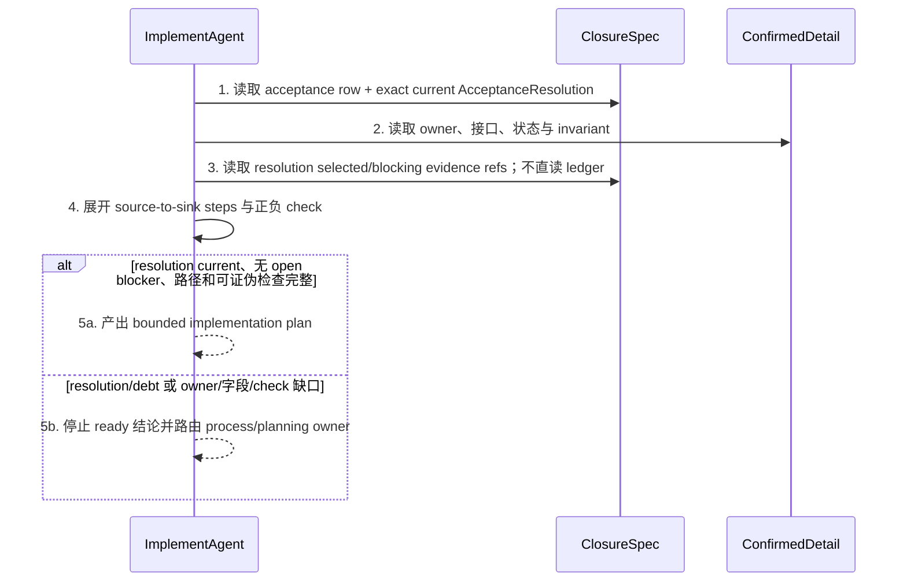
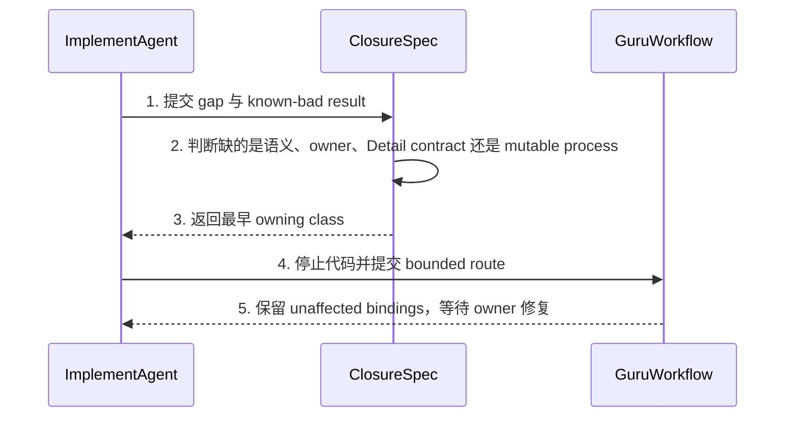
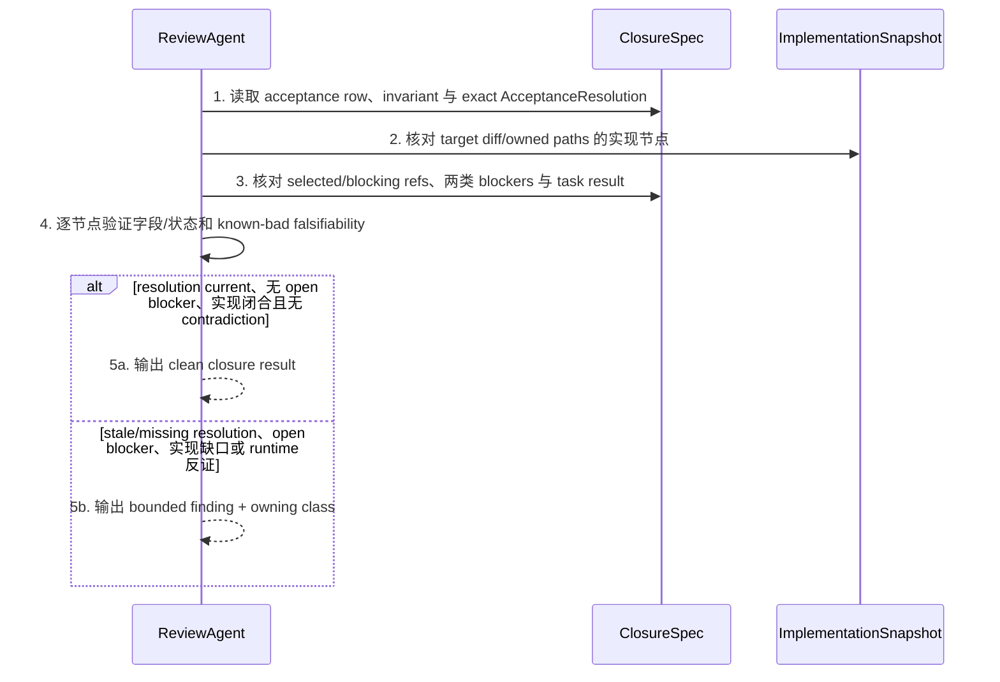
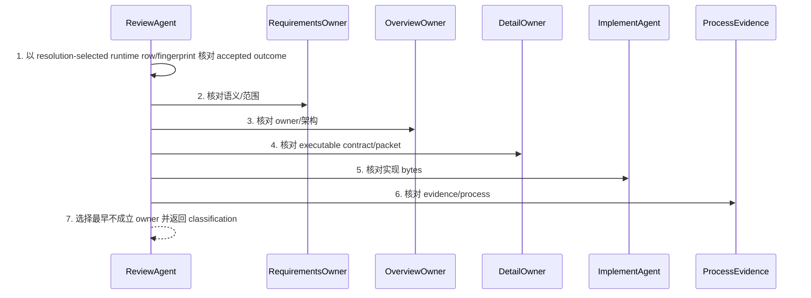
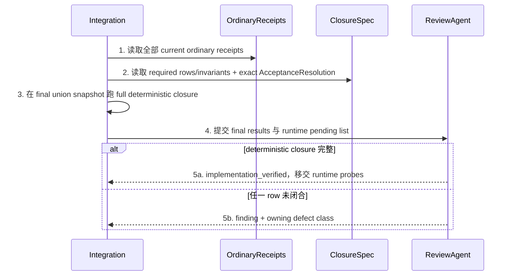

# CH-02 Implementation And Review Closure 详细设计

> doc_type: `agent-contract` | l2_status: `task-local-v1`
> 承接索引: `design-main.md` 第 7 节 `CH-02 implementation and review closure` | 返回: [design-main](../design-main.md)
> 技术决策: TD-004
> 本章的 usecase 是现有 writer/reviewer agent 合同，不要求新增运行时 class、stream library 或 executable validator。

## 1. 单元职责

### UNIT-implementation-review-closure

本单元承接 BHV-004、BHV-005，定义 `ImplementAgent` 与 `ReviewAgent` 如何消费 `UNIT-acceptance-closure-contract`：实现前沿 acceptance path 规划，review 时做有界 source-to-sink closure，在 runtime 证据与当前规划冲突时路由最早 owner。

`ImplementAgent` 写实现闭合计划/结果；`ReviewAgent` 写 finding/classification。两者只读 planning、packet 和 CH-01 从完整 ledger + reconciliation register 解析的 exact `AcceptanceResolution`；不直接读取/过滤 ledger/register或选择 row。它们不改产品语义/planning，也不替代 Finish。

## 2. 行为定义

### 2.1 行为清单

| 行为 | 简述 | 承接 |
| --- | --- | --- |
| `planAcceptancePath` | 实现前把 matrix 行展开成字段/状态从权威 source 到用户终态的闭合计划 | BHV-005 |
| `stopOnUnfalsifiablePlan` | packet/Detail/check 无法证伪目标时停止扩写代码并路由 planning owner | BHV-004, BHV-005 |
| `auditAcceptancePath` | reviewer 以用户结果而非 diff 层数为边界执行有界 closure audit | BHV-004, BHV-005 |
| `routeRuntimeContradiction` | runtime 反证当前 SSOT 时判定最早 defect owner，不由 reviewer 改写语义 | BHV-004 |
| `closeIntegrationOutcome` | Integration 验证 ordinary receipts 之外的最终 source-to-sink 结果 | BHV-005 |

### 2.2 接口定义

以下签名是 agent 输入/输出合同记法：

```text
ImplementAgent.planAcceptancePath(input: ClosurePlanningInput) -> ImplementationClosurePlan
ImplementAgent.stopOnUnfalsifiablePlan(input: ClosureGapInput) -> PlanningOwnerRoute
ReviewAgent.auditAcceptancePath(input: ClosureReviewInput) -> ClosureReviewResult
ReviewAgent.routeRuntimeContradiction(input: RuntimeContradictionInput) -> DefectClassification
ReviewAgent.closeIntegrationOutcome(input: IntegrationClosureInput) -> IntegrationClosureResult
```

依赖固定为 agents -> CH-01 exact result + planning：原样读取 baseline、ledger/register refs、两类 blockers、rows/refs/task，不另走 filtered reader/私有 projection或自行选 valid rows。不调用 scripts/UI/另一 reviewer。

## 3. 核心数据结构

### 3.1 数据模型

| 结构 | 字段 | 约束 |
| --- | --- | --- |
| CH-01 `AcceptanceResolution`（精确导入） | `baseline_binding`, `ledger_snapshot_ref`, `reconciliation_snapshot_ref`, `open_correction_debts`, `open_retrospective_reconciliations`, `row_results`, `selected_evidence_refs`, `blocking_evidence_refs`, `task_result`, `blocking_acceptance_ids`, `next_probe` | 不重定义/投影；由 CH-01 对完整双 snapshots 求值，保留全部字段 |
| `ClosurePlanningInput` | `acceptance_row`, `acceptance_resolution`, `confirmed_detail`, `slice_packet`, `known_failure_fixture`, `owned_paths` | row 来自 matrix；result 绑定同一 baseline/双 snapshots；owned paths 不扩张 |
| `AcceptancePathStep` | `ordinal`, `component`, `input_field_or_state`, `operation`, `output_field_or_state`, `failure_branch`, `evidence` | 每步有真实 owner/调用对象，字段转换不可写成“处理数据” |
| `ImplementationClosurePlan` | `acceptance_id`, `path_steps`, `focused_checks`, `integration_check`, `runtime_probe`, `unverified_items` | focused check 必须在已知错误实现上失败；runtime-only 项明确 evidence owner |
| `ClosureReviewInput` | `acceptance_row`, `acceptance_resolution`, `planning_inputs`, `target_diff`, `implementation_evidence`, `evidence_refs`, `review_policy` | resolution 必须 current 且保留 open-debt 状态；reviewer 不直接读取/选择 ledger rows |
| `ClosureReviewResult` | `acceptance_id`, `acceptance_resolution`, `path_result`, `finding`, `finding_class`, `affected_bindings`, `bounded_next_check` | `acceptance_resolution` 为输入的 exact CH-01 object，不得缩成私有 ref；reviewer 输出 finding，不直接写 receipt/SSOT |
| `RuntimeContradictionInput` | `user_outcome`, `authority_fingerprint`, `acceptance_resolution`, `selected_failure_evidence_ref`, `requirements`, `overview`, `detail`, `implementation_snapshot`, `process_evidence` | failure ref 必须属于同一 resolution 的 selected/blocking refs；从 resolution-selected runtime 事实向最早 owner 比对 |
| `DefectClassification` | `class`, `evidence`, `maximum_rollback`, `required_refresh`, `preserved_evidence` | class 只能是既有五类或 environment/fixture-only route |
| `IntegrationClosureInput` | `ordinary_receipts`, `final_union_snapshot`, `cross_slice_invariants`, `acceptance_resolution`, `deterministic_results` | ordinary pass 不能替代 final closure；任一 open blocker 或 stale result 阻断 receipt |

实现者/审查者会话内状态为 `not_loaded -> closure_loaded -> path_checked -> ready|blocked|routed`。公开结果通过既有 agent output/review evidence 传递，不新增 `BehaviorSubject`、schema 字段或隐藏状态流。

### 3.2 错误类型表

| 错误名 | 错误码/枚举 | 语义 | 上抛/收口位置 |
| --- | --- | --- | --- |
| `ClosurePlanError.matrixMissing` | `acceptance_matrix_missing` | runtime-required/跨层目标没有 frozen row | writer 停止，路由 `DETAIL_DEFECT` |
| `ClosurePlanError.pathGap` | `source_to_sink_gap` | 任一字段/状态转换没有 owner 或 evidence | writer 停止，按上游事实路由 Detail/Overview |
| `ClosurePlanError.unfalsifiableCheck` | `unfalsifiable_check` | check 在已知错误实现上仍会通过 | writer 停止，路由 `DETAIL_DEFECT` 或 `PROCESS_DEFECT` |
| `ClosureReviewError.unboundedScope` | `unbounded_review_scope` | reviewer 从具体 acceptance row 扩张为全仓审计 | review 阻断并收窄至 row path |
| `ClosureReviewError.semanticMutation` | `reviewer_semantic_mutation` | reviewer 直接改 Requirements/Overview/Detail 语义 | review 阻断，路由对应 owner |
| `ClosureReviewError.runtimeIgnored` | `runtime_evidence_ignored` | 以 packet 未声明或 SSOT 已确认拒绝 current failure | review 阻断，重新执行 classification |
| `ClosureReviewError.currentResolutionMissing` | `acceptance_resolution_missing` | CH-01 result 缺失，或 current baseline/任一 snapshot 不一致 | 停止 ready/clean，路由 `PROCESS_DEFECT` |
| `ClosureReviewError.blockerIgnored` | `acceptance_blocker_ignored` | consumer 直读 evidence/register或忽略任一 blocker | receipt 阻断，不得回退旧 pass |
| `ClosureReviewError.resolutionFieldLoss` | `acceptance_resolution_projection_loss` | consumer 私有 ref/projection 丢失 CH-01 任一 canonical provenance/debt/selected/blocking/next-probe 字段 | current ready/clean/Integration receipt 阻断，改为消费 exact CH-01 object |
| `ClosureReviewError.snapshotStale` | `stale_review_snapshot` | review inputs 与 current binding 不一致 | 当前 review 不可复用 |
| `ClosureReviewError.integrationIncomplete` | `integration_closure_incomplete` | ordinary green 但最终用户结果或 required row 未闭合 | Integration 保持失败/pending |

## 4. 逐行为设计

### 4.1 `planAcceptancePath`

- 函数签名：`ImplementAgent.planAcceptancePath(input: ClosurePlanningInput) -> ImplementationClosurePlan`
- 行为简述：承接 BHV-005；在写代码前完成权威 source 到用户终态的字段/状态传播计划。
- 输入参数：

| 参数 | 类型 | 取值域/约束 | 必填 |
| --- | --- | --- | --- |
| `input` | `ClosurePlanningInput` | current frozen row + confirmed Detail + selected packet + bounded owned paths | 是 |

- 输出：

| 返回值/发射值 | 类型 | 语义 |
| --- | --- | --- |
| `plan` | `ImplementationClosurePlan` | 可直接实现的 path steps、focused/Integration checks 和 runtime probe |



流程详述：

1. `ImplementAgent` 以 `acceptance_id` 读取 frozen row，不从当前 diff 猜验收范围。
2. 对 row 中每个 source-to-sink 节点读取 Detail owner、输入、输出、错误和状态写 owner。
3. 原样读取 CH-01 双-snapshot result；核对全部字段并消费 refs、两类 blockers、rows/task/next probe，不自行读 ledger/register或定义私有 ref。
4. 逐步记录真实组件、字段/状态输入输出、失败分支、focused check、Integration check 和 runtime probe。
5. 完整时限制写入到 packet/owned paths；任一缺口时发出 planning owner route，不在代码中补造合同。

异常处理：

| 异常情况 | 处置 | 错误转换位置 |
| --- | --- | --- |
| matrix row 缺失 | 停止写入，路由 `DETAIL_DEFECT` | `ImplementAgent.planAcceptancePath` |
| current result 缺失/stale 或存在任一 open blocker | 停止 current-ready，按 CH-01 process route 修复；不复用旧 pass | resolution precheck |
| 外部字段 fingerprint 未确认 | 停止并按语义/合同归属路由 Requirements 或 Detail | path step validation |
| path 节点超出 owned paths | 不扩 scope，交由对应 slice/Integration owner | packet ownership check |

### 4.2 `stopOnUnfalsifiablePlan`

- 函数签名：`ImplementAgent.stopOnUnfalsifiablePlan(input: ClosureGapInput) -> PlanningOwnerRoute`
- 行为简述：承接 BHV-004、BHV-005；避免“测试很多但无法证明用户结果”的 false green。
- 输入参数：

| 参数 | 类型 | 取值域/约束 | 必填 |
| --- | --- | --- | --- |
| `input` | `ClosureGapInput` | acceptance ID、缺口类型、known-bad outcome、当前 owner evidence | 是 |

- 输出：

| 返回值/发射值 | 类型 | 语义 |
| --- | --- | --- |
| `route` | `PlanningOwnerRoute` | `REQ_BLOCKER`、`OVERVIEW_DEFECT`、`DETAIL_DEFECT` 或 `PROCESS_DEFECT` 及唯一修复动作 |



流程详述：

1. writer 在执行写入前记录哪一个 acceptance path step 或 check 无法证伪目标。
2. `ClosureSpec` 区分产品语义缺失、Overview owner 缺失、Detail/packet 缺失或仅 mutable evidence 缺失。
3. 返回最早 owner defect class，不允许用实现猜测补齐。
4. `ImplementAgent` 锁定 product code writes，向 `GuruWorkflow` 提交一条 bounded route。
5. Workflow 只使依赖缺口的 bindings 失效；未受影响 evidence 仍按 currentness 规则复用。

异常处理：

| 异常情况 | 处置 | 错误转换位置 |
| --- | --- | --- |
| writer 无法证明 owner | 升级 semantic review，不猜测 | `ClosureSpec` |
| gap 仅是未运行 declared check | 路由 `PROCESS_DEFECT`，不改 Detail | `ClosureSpec` |
| check 设计本身不会失败 | 路由 `DETAIL_DEFECT` | `ClosureSpec` |

### 4.3 `auditAcceptancePath`

- 函数签名：`ReviewAgent.auditAcceptancePath(input: ClosureReviewInput) -> ClosureReviewResult`
- 行为简述：承接 BHV-004、BHV-005；reviewer 以 frozen user outcome 做有界 source-to-sink audit。
- 输入参数：

| 参数 | 类型 | 取值域/约束 | 必填 |
| --- | --- | --- | --- |
| `input` | `ClosureReviewInput` | current snapshot 的 exact bounded inventory | 是 |

- 输出：

| 返回值/发射值 | 类型 | 语义 |
| --- | --- | --- |
| `result` | `ClosureReviewResult` | clean 或有证据锚点的 finding/classification；不直接改文件/receipt |



流程详述：

1. reviewer 加载 matrix row/invariant 与 CH-01 基于完整 ledger/register 生成的 exact result；保留全部字段，不按 ID 直读或定义私有 ref。
2. 核对 target diff 中该 path 的受影响节点，同时读取未改但决定用户结果的相邻合同。
3. 核对 known-bad/Integration/runtime currentness；任一 open blocker、字段缺失或 ledger/register 后续变化都阻断 clean，即使另有 later pass。
4. 每个节点验证输入字段、转换、输出状态、failure closure 和 evidence；不因 diff 只改一层而跳过路径。
5. 完整时输出 clean；缺口时只报告与该 row 直接相关的 finding，禁止扩张为全仓开放式审计。

异常处理：

| 异常情况 | 处置 | 错误转换位置 |
| --- | --- | --- |
| context 超界/含 wildcard | 阻断 review，要求 exact inventory | review precheck |
| CH-01 result 缺失/stale、任一 snapshot 不一致或 blocker 非空 | 阻断 clean并路由 `PROCESS_DEFECT`；不得自行选 pass | resolution precheck |
| CH-01 resolution 被私有投影或生成后有新 append | 阻断 current clean receipt；完整重取 exact CH-01 resolution，不做局部字段补丁 | resolution precheck |
| ordinary check 通过但 Integration 缺终态 | `integration_closure_incomplete` | `ReviewAgent.auditAcceptancePath` |
| runtime row 反证 packet | 进入 `routeRuntimeContradiction` | `ReviewAgent.auditAcceptancePath` |

### 4.4 `routeRuntimeContradiction`

- 函数签名：`ReviewAgent.routeRuntimeContradiction(input: RuntimeContradictionInput) -> DefectClassification`
- 行为简述：承接 BHV-004；真实 runtime evidence 可以反证错误模型，但 reviewer 不能自行改模型。
- 输入参数：

| 参数 | 类型 | 取值域/约束 | 必填 |
| --- | --- | --- | --- |
| `input` | `RuntimeContradictionInput` | current CH-01 resolution 的 selected failure、authority fingerprint、完整 planning/implementation/process evidence | 是 |

- 输出：

| 返回值/发射值 | 类型 | 语义 |
| --- | --- | --- |
| `classification` | `DefectClassification` | 最早 owner、最大回退、刷新/保留集合 |



流程详述：

1. reviewer 确认 failure ref 属于同一 exact result、两类 blocker 均空且 authority fingerprint 同 goal；不另选 row。
2. Requirements 未声明/冲突或用户结果 material change 时选择 `REQ_BLOCKER`。
3. 语义正确但 owner/架构错误时选择 `OVERVIEW_DEFECT`。
4. Overview 正确但 Detail/packet/check 合同错误时选择 `DETAIL_DEFECT`。
5. 规划正确但实现 bytes 偏离时选择 `IMPLEMENT_DEFECT`。
6. 实现正确但 mutable evidence、fixture 或执行步骤错误时选择 `PROCESS_DEFECT` 或 environment/fixture-only route。若错误 fixture/check 已冻结在 confirmed packet 或 digest-bearing plan 中，分类保持 `PROCESS_DEFECT`，但只有修正该 plan 时才回 Detail；若 planning/implementation 均正确、仅目标环境配置或运行 fixture 错误，则留在 current verification step。
7. 返回最大回退和受影响 binding；整个过程中 reviewer 不修改任一 owner artifact。

异常处理：

| 异常情况 | 处置 | 错误转换位置 |
| --- | --- | --- |
| fingerprint 不足 | 返回 evidence required，不猜 defect class | classification precheck |
| selected row 不属于 current result，或任一 blocker open | 返回 process repair，不猜 class/复用 pass | resolution precheck |
| 用户提出 material change | `REQ_BLOCKER`，不得作为 same-goal implementation repair | Requirements comparison |
| runtime 与 SSOT 冲突 | 不丢弃任一方，路由最早 owner | final classification |

### 4.5 `closeIntegrationOutcome`

- 函数签名：`ReviewAgent.closeIntegrationOutcome(input: IntegrationClosureInput) -> IntegrationClosureResult`
- 行为简述：承接 BHV-005；ordinary receipt 证明局部质量，Integration 证明合并后的最终用户结果。
- 输入参数：

| 参数 | 类型 | 取值域/约束 | 必填 |
| --- | --- | --- | --- |
| `input` | `IntegrationClosureInput` | 全部 current ordinary receipts + union snapshot + cross-slice invariants + final checks | 是 |

- 输出：

| 返回值/发射值 | 类型 | 语义 |
| --- | --- | --- |
| `result` | `IntegrationClosureResult` | 每个 acceptance row 的 deterministic closure 与剩余 runtime probe |



流程详述：

1. Integration 验证每个 ordinary receipt 与当前 union snapshot 的绑定；stale receipt 不复用。
2. 读取 required rows/invariants 与 CH-01 exact result；missing/stale、字段缺失或任一 open blocker 时不得产生 current Integration receipt。
3. 运行 Integration-owned full checks，闭合 source-to-sink 最终结果；不重跑普通 slice 的同一 focused command 充数。
4. 向 reviewer 提交逐 row 结果和仍需 target runtime 的 probe 列表。
5. deterministic closure 完整只允许报告 `implementation_verified`/runtime pending；缺口返回 owner route，不允许普通 green 替代。

异常处理：

| 异常情况 | 处置 | 错误转换位置 |
| --- | --- | --- |
| ordinary receipt stale | 阻断 Integration，刷新受影响 receipt | snapshot binding check |
| acceptance result missing/stale/open blocker | 阻断 Integration receipt，先完成 CH-01 process repair | resolution binding check |
| final check 不覆盖旧错误 | `DETAIL_DEFECT`/`PROCESS_DEFECT` | Integration closure audit |
| deterministic green 但 runtime required | 报告 pending，交给 CH-04 | Integration output |

## 5. 状态管理

| 状态 | 唯一写 owner | 初始态 | 转移 | 对外只读消费 |
| --- | --- | --- | --- | --- |
| `ImplementationClosurePlan.state` | `ImplementAgent` | `not_loaded` | `closure_loaded -> path_checked -> ready|blocked|routed` | ReviewAgent |
| `ClosureReviewResult.state` | `ReviewAgent` | `not_reviewed` | `context_bound -> path_audited -> clean|finding|routed` | GuruWorkflow/RepairSkill |
| `DefectClassification` | `ReviewAgent` | none | evidence sufficient -> one owning class | GuruWorkflow |
| `IntegrationClosureResult` | Integration reviewer | `not_started` | receipts_current -> checks_run -> verified|blocked | FinishSkill/User |

状态生命周期只覆盖单次 agent invocation/current snapshot；新 snapshot 重新绑定后产生新 result。没有跨 invocation 的可变 `BehaviorSubject`，无需 dispose；持久证据仍写入现有 mutable evidence/review records，由 coordinator 管理。

## 6. Widget 设计

N/A：本章没有 page-entry、Widget 或 UI state；用户可见终态是 acceptance path 的 sink，不是本任务要实现的页面。

## 7. 测试映射

| BHV/行为 | 测试层 | 测试点 |
| --- | --- | --- |
| BHV-005 / `planAcceptancePath` 成功 | document contract/integration | `detail.userRole` 从 API -> DTO -> Repository -> UseCase -> Controller -> UI label 每步含字段与 evidence |
| BHV-005 / writer filtered-ledger bypass | negative evidence scenario | identity-unreadable global debt 存在但同 ID 有 later pass；writer 没有 current CH-01 resolution 或自行按 ID 选 pass 时不得 ready |
| BHV-005 / `acceptance_matrix_missing` | negative document contract | runtime-required row 缺失时停止代码并路由 `DETAIL_DEFECT` |
| BHV-005 / `source_to_sink_gap` | negative document contract | DTO mapping/owner/evidence 任一缺口时停止代码，并按最早 planning owner 路由 |
| BHV-005 / `path_node_exceeds_owned_paths` | negative document contract | source-to-sink 节点超出 packet owned paths 时不得扩张写 scope，必须阻断并路由对应 slice/Integration owner |
| BHV-005 / `unfalsifiable_check` | negative document contract | check 在 legacy bug 上仍绿；confirmed packet/plan 的错误 check 记 `PROCESS_DEFECT`，只有 plan 需改时回 Detail |
| BHV-004 / `stopOnUnfalsifiablePlan` | unit/scenario | 语义缺失、owner 缺失、Detail check 缺失、仅 evidence 未跑分别路由正确 owner |
| BHV-004/BHV-005 / `auditAcceptancePath` 成功 | semantic review scenario | diff 仅改 DTO，review 仍检查最终 UI label 和 Integration/runtime evidence |
| BHV-004/BHV-005 / reviewer blocker bypass | negative semantic review | CH-01 有 correction/reconciliation blocker时，即使 targeted ID有 later pass也不得 clean |
| BHV-004/BHV-005 / stale resolution after append | negative semantic review | exact resolution 生成后追加 unrelated/failure/unreadable row；writer/reviewer/Integration 必须判旧 snapshot stale并取得新完整 resolution |
| BHV-004/BHV-005 / private resolution projection | negative document contract | 丢失任一 snapshot、blocker、row/refs或 next probe 的 projection 不得 ready/clean |
| BHV-004 / `unbounded_review_scope` | negative semantic review | exact acceptance inventory 被扩张为全仓 wildcard 时阻断并收窄 |
| BHV-004 / `runtime_evidence_ignored` | negative semantic review | packet 未声明关键 check 时不能用“undeclared”忽略 current runtime failure |
| BHV-004 / `stale_review_snapshot` | negative semantic review | review input 与 current digest/snapshot 不一致时结果不可复用 |
| BHV-004 / `fingerprint_insufficient` | negative classification scenario | runtime row 或 authority fingerprint 无法绑定 current acceptance goal 时只返回 evidence required，不猜 defect class 或 rollback |
| BHV-004 / `routeRuntimeContradiction` 五类 | table-driven scenario | 五类输入分别返回唯一 defect class、最大回退、刷新/保留集合 |
| BHV-004 / `reviewer_semantic_mutation` | negative scenario | reviewer 尝试直接改 Requirements/Overview/Detail 时阻断并路由唯一 owner |
| BHV-005 / `closeIntegrationOutcome` 成功 | integration | union snapshot 上旧 DTO 漏字段 fixture 必须失败、修复后最终 label 通过 |
| BHV-005 / `integration_closure_incomplete` | negative integration | ordinary receipts green 但 union sink/required row 未闭合时 Integration 保持 blocked |
| BHV-005 / `closeIntegrationOutcome` pending | integration/manual | deterministic green 但 runtime-required row 无 pass 时只报告 pending |

## 8. 不得补造清单

- 不由 writer 在实现代码中补造缺失的 Requirement、owner、Detail、packet、invariant 或 check 语义。
- 不由 reviewer 直接编辑 SSOT、实现 bytes、receipt 或 acceptance evidence。
- writer/reviewer/Integration 不读 ledger/register或选 row；原样消费 CH-01 dual-snapshot result，不过滤 blocker/provenance。
- 不因 diff 只修改一层而跳过完整 acceptance path，也不把具体 row 扩张为全仓开放式审计。
- 不运行与 acceptance row 无关的额外 test；关键 undeclared check 缺失时先路由 planning owner。
- 不启动第二 semantic reviewer 覆盖同一 current snapshot。
- 不把 ordinary focused pass 当成 Integration 或 runtime pass。
- 不改变现有 provider、snapshot、packet、Integration、commit 或 task lifecycle 规则。
- 不修改任何 Trellis/Guru/CLI script。

## 9. 不变量矩阵

| invariant_id | rule（负向/排除约束） | owner | positive_case | negative_case | route_if_missing |
| --- | --- | --- | --- | --- | --- |
| `INV-REV-001` | must-not 以 diff layer count 决定是否检查跨层验收 | `ReviewAgent` | 单层 diff 仍走完整 row path | DTO diff 只审 DTO unit test | `IMPLEMENT_DEFECT` |
| `INV-REV-002` | must-not 接受不能在 known-bad implementation 上失败的 check | `ImplementAgent` | legacy DTO fixture 失败 | helper happy-path 始终通过 | `DETAIL_DEFECT` |
| `INV-REV-003` | must-not 因 packet 未声明关键 check 而忽略 current runtime failure | `ReviewAgent` | 路由 planning gap | 把 failure 标为 packet-external | `PROCESS_DEFECT` |
| `INV-REV-004` | must-not 由 reviewer 改写产品/架构/Detail 语义 | `ReviewAgent` | 输出 owning finding | reviewer 直接修 prd/design | `REQ_BLOCKER` |
| `INV-REV-005` | must-not 让 ordinary receipt 替代 Integration final outcome | Integration reviewer | union snapshot closure | 四个 ordinary green 即 Accepted | `IMPLEMENT_DEFECT` |
| `INV-REV-006` | must-not 复用绑定组件已变化的 sibling evidence | `ReviewAgent` | 只复用 binding 相等 receipt | target/invariant/check 变化后仍复用 | `PROCESS_DEFECT` |
| `INV-REV-007` | must-not 对同一 snapshot 启动第二 semantic reviewer | `GuruWorkflow` | 一个 current reviewer | 重复 review 以求不同结论 | `PROCESS_DEFECT` |
| `INV-REV-008` | must-not 在 CH-01 result 缺失/stale/字段不全、ledger/register ref 不一致或任一 blocker 非空时产出 current-ready/clean/Integration receipt；不得用 filtered evidence/private ref替代 | agents | baseline、双 refs、两类 blockers、rows/refs/task/IDs/probe完整 current且 blockers empty | unreadable debt/open attempt被 filter/旧 prefix/private projection隐藏仍 green | `PROCESS_DEFECT` |

## 10. 批内方法证据

- 骨架：§1-§9 完整，Widget 设计有 N/A 依据。
- 合同八问：每个行为均有 BHV、输入输出、错误、状态、正反依赖、失败收口、结果、测试与不得补造。
- 粒度抽查：`routeRuntimeContradiction` 明确从 runtime/fingerprint 依次核对 Requirements、Overview、Detail、implementation、process，并返回唯一 owner/rollback。
- task-local dependency 核对：agent contract 原样只读 CH-01 `ClosureSpec` 的 exact current `AcceptanceResolution`、confirmed planning 和 bounded implementation snapshot；writer/reviewer 不直读 ledger、自算 currentness或定义私有 resolution ref，result 各有唯一 owner，且无反向 planning/evidence 写入。
- 合规：runtime evidence 只按 CH-01 的最小化、脱敏和 baseline-binding 合同读取。
- 批内自动 review：`findings=2`，`repair_iterations=1`，`open_findings=0`；已为 owned-path 越界和 fingerprint 不足补齐 known-bad falsifier。
- domain checkpoint：五章目录级 owner/依赖闭合已完成；CH-02 只消费 CH-01 contract/evidence，向 CH-03/Integration 输出 classification/result，不反向写上游。
- `chapter_status=passed_by_method_evidence`
