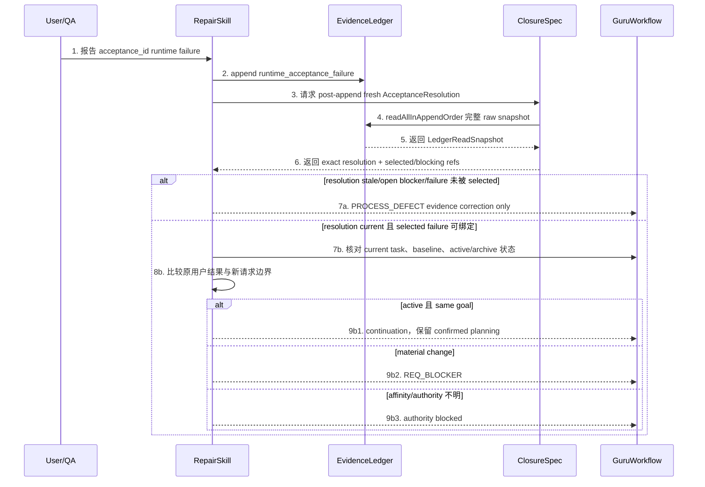
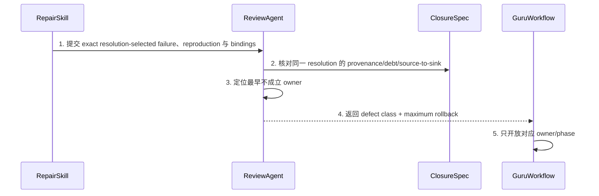
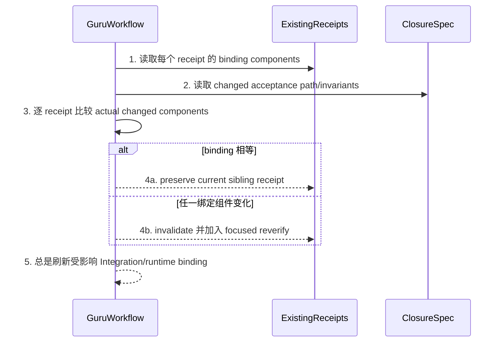
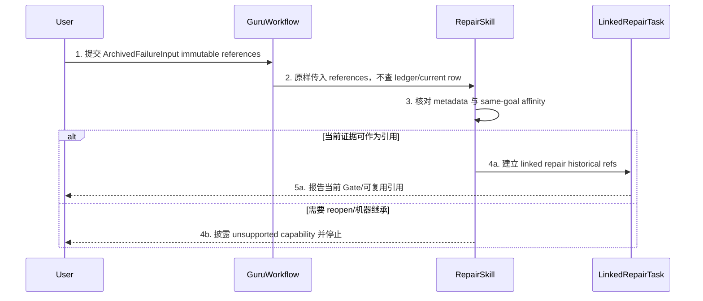

# CH-03 Same-Goal Repair Continuation 详细设计

> doc_type: `workflow-contract` | l2_status: `task-local-v1`
> 承接索引: `design-main.md` 第 7 节 `CH-03 same-goal repair continuation` | 返回: [design-main](../design-main.md)
> 技术决策: TD-003
> 本章扩展现有 `guru-bug-fast-path`、`trellis-break-loop` 与 Guru workflow 合同，不新增 reopen command、task lifecycle state 或 script controller。

## 1. 单元职责

### UNIT-repair-continuation

本单元承接 BHV-002、BHV-003、BHV-004、BHV-006、BHV-007。`RepairSkill` 拥有 same-goal/continuation 与最终 retrospective record；`GuruWorkflow` 拥有 phase routing；`ClosureSpec` 从完整 ledger + durable reconciliation register 生成 `AcceptanceResolution` 并独占 attempt transitions；`ReviewAgent` 只分类 resolution-selected failure；`BreakLoopSkill` 只产草稿。

本单元依赖 CH-01 exact dual-snapshot `AcceptanceResolution`、append-only ledger、exact `<task_dir>/retrospective-reconciliation.jsonl` 与 CH-02 classification。Repair 只请求 ClosureSpec 追加并完整 reread journal event；prepared event 获 unique-last-event ack 后才可 append evidence。Repair 不读 journal/ledger或选 row；每次 append/event 后等待 CH-01 整份重算。

## 2. 行为定义

### 2.1 行为清单

| 行为 | 简述 | 承接 |
| --- | --- | --- |
| `openSameGoalContinuation` | 先追加 runtime failure，再用 acceptance goal 而非文件/错误文案判断任务亲和 | BHV-002, BHV-003 |
| `classifyMaximumRollback` | 根据最早 owning defect 选择最大必要回退，不默认重启 Full | BHV-003, BHV-004 |
| `refreshAffectedEvidence` | 只使依赖变化 artifact/binding 的证据失效，保留 current sibling evidence | BHV-002, BHV-003 |
| `completeRepairRetrospective` | 修复后强制闭合根因、漏检 Gate、false-green、regression，以及 owned writeback 或 evidence-backed no-writeback reason | BHV-006 |
| `routeArchivedFailure` | 对 archived baseline 建立 linked repair path 并如实披露 no-script 限制 | BHV-007 |

### 2.2 接口定义

以下签名是 Skill/workflow 合同记法：

```text
RepairSkill.openSameGoalContinuation(input: RuntimeFailureInput) -> ContinuationDecision
ReviewAgent.classifyMaximumRollback(input: DefectEvidenceInput) -> DefectRoute
GuruWorkflow.refreshAffectedEvidence(input: BindingChangeSet) -> EvidenceRefreshPlan
RepairSkill.completeRepairRetrospective(input: FailureRetrospectiveInput, draft: FailureRetrospectiveDraft, validation: RetrospectiveValidation) -> FailureRetrospectiveRecord
GuruWorkflow.routeArchivedFailure(input: ArchivedFailureInput) -> LinkedRepairDecision
```

依赖方向是 Repair -> CH-01 exact dual-snapshot result + append + classification，Workflow -> owner artifacts + class。Repair append failure 后触发 fresh result，只消费 refs/blockers；不读 ledger/register或选 row。planning owners 按上游到下游恢复 currentness。

## 3. 核心数据结构

### 3.1 数据模型

| 结构 | 字段 | 约束 |
| --- | --- | --- |
| `RuntimeFailureInput` | `acceptance_id`, `original_user_outcome`, `reported_actual`, `environment`, `steps`, `evidence_refs`, `current_task`, `baseline_binding` | 必须先形成 append-only failure row；实际与 evidence 最小脱敏 |
| `SameGoalAffinity` | `same_bhv_or_ac`, `new_product_behavior`, `permission_or_data_expansion`, `external_contract_change`, `material_scope_change`, `decision`, `evidence` | 仅 `same_bhv_or_ac=true` 且四个 change indicator 全为 false 时是 same-goal；任一 change indicator=true 或 `same_bhv_or_ac=false` 即转 Requirements；文件变化不改变 goal |
| `ContinuationDecision` | `task_affinity`, `acceptance_resolution`, `failure_row_ref`, `next_phase`, `preserved_planning`, `blocking_evidence` | `acceptance_resolution` 必须是 failure append 后 CH-01 对新完整 snapshot 生成的 exact object；active same-goal 且 selected failure current 才能进入 bounded continuation |
| `DefectEvidenceInput` | `acceptance_resolution`, `selected_failure_evidence_ref`, `minimum_reproduction`, `authority_fingerprint`, `requirements`, `overview`, `detail`, `implementation_snapshot`, `process_evidence` | exact resolution current、字段完整、两类 open blockers 为空；failure ref 属于 selected/blocking refs |
| `DefectRoute` | `class`, `maximum_rollback`, `owner`, `required_refresh`, `preserved_evidence`, `reason` | class 来自 evidence；不得由 route 反推原因 |
| `BindingChangeSet` | `changed_artifacts`, `changed_target_bytes`, `changed_invariants`, `changed_inputs`, `changed_checks`, `changed_policy`, `changed_supervisor` | 仅实际变化的绑定组件使 receipt stale |
| `EvidenceRefreshPlan` | `invalidate`, `preserve`, `reverify`, `integration_refresh`, `runtime_probe` | 每项列 exact artifact/receipt ID 和理由 |
| `FailureRetrospectiveInput` | CH-01 canonical fields + `repair_diff`, `review_result`, `runtime_resume_condition_ref` | exact CH-01 input；resume ref 不授予 Repair probe authority |
| `FailureRetrospectiveRecord` | exact CH-01 canonical record fields | 直接复用 CH-01；含 ID、affected evidence、artifact ref、完整 pending row 与 accepted append ref，不做私有投影 |
| `RetrospectiveAppendAttempt` / register | CH-01 exact fields | ClosureSpec 从 current/linked-active TaskRef 定位 exact journal，append attempt ID、pre-ledger boundary、ordinal(0|1)与 digest/ID/binding/artifact event并 strict full-replay ack；open/corrupt/missing 是所有 normal resolution blocker |
| `ArchivedFailureInput` | `original_acceptance_id`, `archived_task_ref`, `artifact_digests`, `receipt_refs`, `new_failure_artifact_ref`, `requested_capability` | 全部是 caller-supplied immutable historical references；不读取 ledger、不声称 current inheritance |
| `LinkedRepairDecision` | `linked_task_required`, `reusable_references`, `current_gate_limits`, `deferred_script_capability`, `next_phase` | 真正 reopen/机器继承始终 deferred |

#### Maximum Rollback Table

| defect class | maximum rollback | owner action | required refresh | preserved by default |
| --- | --- | --- | --- | --- |
| `IMPLEMENT_DEFECT` | Phase 2 implementation/check | 修受影响 source/test | affected slice review、Integration、runtime receipt | Requirements、Overview、Detail、current sibling receipts |
| `PROCESS_DEFECT` | current evidence/process；仅 planning/packet 改变时回 Detail | 修 mutable evidence/fixture/执行步骤；或由 Detail owner 修 plan | affected evidence；若 Detail 改则刷新其 downstream | 未变化 planning 与独立 receipts |
| `DETAIL_DEFECT` | Phase 1 Detail | 修 affected chapter/packet/plan | Detail review/confirm、affected slices、Integration、runtime | Requirements、Overview |
| `OVERVIEW_DEFECT` | Phase 1 Overview + affected Detail | 修 owner/架构，再按顺序修 Detail | Overview review、affected Detail/downstream | Requirements |
| `REQ_BLOCKER` / material change | Phase 1 Requirements affected Full chain | Requirements owner 确认新语义/范围 | affected Requirements -> Overview -> Detail -> implementation/runtime | 仅经 binding 证明独立的 evidence |
| environment/fixture-only | current verification step | 修环境/fixture evidence | 当前 verification/runtime probe | 产品 planning/implementation |

Fixture discriminator 是确定性的：confirmed packet 或 digest-bearing plan
中声明的 fixture/check contract 本身错误或不完整时，分类为
`PROCESS_DEFECT`；只有实际修正该 packet/plan 时才回 Detail。若 packet/plan
和 implementation 都正确，仅 target environment 配置或执行时 fixture
错误，则走 environment/fixture-only，留在 current verification step，
只刷新该输入和受影响 runtime probe。

### 3.2 错误类型表

| 错误名 | 错误码/枚举 | 语义 | 上抛/收口位置 |
| --- | --- | --- | --- |
| `ContinuationError.failureNotRecorded` | `failure_row_missing` | 未先保存 runtime failure 就开始修复 | `openSameGoalContinuation` 阻断 |
| `ContinuationError.resolutionUnavailable` | `post_append_resolution_unavailable` | post-append result 缺失/字段缺失/stale/任一 blocker open，或 failure ref 未 selected | `PROCESS_DEFECT` evidence correction，不分类/修复 |
| `ContinuationError.goalChanged` | `material_goal_change` | 新行为、权限/数据/外部合同或范围变化 | 路由 `REQ_BLOCKER` |
| `ContinuationError.affinityUnproven` | `task_affinity_unproven` | current task/baseline/acceptance ID 对不上 | authority blocked，先核实 live task |
| `ContinuationError.rootCauseUnproven` | `root_cause_unproven` | 只有症状/假设，没有最小复现和控制点 | diagnostics only，不做 repair |
| `ContinuationError.overRollback` | `unnecessary_full_restart` | 实现 defect 被默认送回 Requirements | 修正为 evidence-proven maximum rollback |
| `ContinuationError.underRollback` | `owning_artifact_not_repaired` | upstream defect 被降级为代码 patch | 回到最早 owner |
| `ContinuationError.falseCurrent` | `forged_current_evidence` | stale digest/receipt 被宣称 current | 阻断，真实刷新 |
| `ContinuationError.unsupportedReopen` | `archived_reopen_unsupported` | 当前 no-script 能力无法原地 reopen/继承 | 建 linked task并披露限制 |
| `ContinuationError.forbiddenScript` | `forbidden_script_scope` | repair 方案要求 Python/shell/CLI TS/Guru script 改动 | 停止并请求新的明确授权 |
| `ContinuationError.reconciliationOpen` | `retrospective_reconciliation_open` | durable attempt 未调和/record 未完成 | CH-01 blocks、`next_probe=null`；Finish/Workflow 不得按 ledger row 旁路 |
| `ContinuationError.retryExhausted` | `retrospective_append_ambiguous` | pre-boundary drift/history-only/non-unique/unreadable，或 ordinal-1 再丢 ack | `PROCESS_DEFECT` open；无第三次自动 retry/record/decision/probe |

## 4. 逐行为设计

### 4.1 `openSameGoalContinuation`

- 函数签名：`RepairSkill.openSameGoalContinuation(input: RuntimeFailureInput) -> ContinuationDecision`
- 行为简述：承接 BHV-002、BHV-003；保存失败事实，冻结原 acceptance goal，并决定是否能在活动 Full task 内继续。
- 输入参数：

| 参数 | 类型 | 取值域/约束 | 必填 |
| --- | --- | --- | --- |
| `input` | `RuntimeFailureInput` | acceptance ID、current task/baseline、环境、步骤、实际、证据 | 是 |

- 输出：

| 返回值/发射值 | 类型 | 语义 |
| --- | --- | --- |
| `decision` | `ContinuationDecision` | active same-goal continuation、Requirements route 或 authority blocker |



流程详述：

1. 用户/QA 提交原 `acceptance_id` 的目标环境、步骤、预期、实际和脱敏证据。
2. `RepairSkill` 在任何修复前向 `EvidenceLedger` 追加 `runtime_acceptance_failure`，保留失败历史；该 append 立即使所有旧 resolution stale。
3. Repair 触发 CH-01 从完整 ledger/register snapshots 生成 exact result，不直接读取/选行/定义私有 ref。
4. result 缺失/stale/字段缺失/任一 blocker open，或 failure不属于 refs时，先走 process correction，禁止分类/生产修复。
5. resolution current 后才核对 live task、baseline binding 和是否仍 active；不从记忆/相似任务名推断。随后比较原 BHV/AC/用户结果，检查是否新增行为、权限、数据边界、外部合同或 material scope。
6. active same-goal 返回 continuation；material change 返回 Requirements；authority 不足只要求一个核实动作，不开始实现。任何后续 append 再次使该 resolution stale。

异常处理：

| 异常情况 | 处置 | 错误转换位置 |
| --- | --- | --- |
| acceptance ID 不存在 | 阻断并请求绑定正确目标 | `RepairSkill` affinity check |
| failure evidence 不足 | 记录 pending evidence request，不猜 root cause | `RepairSkill` |
| post-append result 缺失/stale/open blocker/field loss | 保持 `PROCESS_DEFECT` evidence repair，不分类 | resolution precheck |
| archived task | 转 `routeArchivedFailure` | `GuruWorkflow` |

### 4.2 `classifyMaximumRollback`

- 函数签名：`ReviewAgent.classifyMaximumRollback(input: DefectEvidenceInput) -> DefectRoute`
- 行为简述：承接 BHV-003、BHV-004；以证据选择最早 owner，并固定最大必要回退。
- 输入参数：

| 参数 | 类型 | 取值域/约束 | 必填 |
| --- | --- | --- | --- |
| `input` | `DefectEvidenceInput` | exact current resolution、resolution-selected failure ref、最小复现、fingerprint、各层 current artifacts、process evidence | 是 |

- 输出：

| 返回值/发射值 | 类型 | 语义 |
| --- | --- | --- |
| `route` | `DefectRoute` | class、owner、rollback、refresh/preserve 集合 |



流程详述：

1. 仅 exact post-append result current、两类 blockers 空、selected failure 可绑定且复现有证据时提交 classification。
2. `ReviewAgent` 原样消费同一 resolution，使用 CH-02 的 runtime contradiction 路径核对 Requirements -> Overview -> Detail -> implementation -> process；不直读 ledger 或另选 failure。
3. 选择最早不成立 owner，并验证实现 bug 不误回 Requirements、material change 不降级。
4. 返回表中唯一最大回退、required refresh 和默认 preserved evidence。
5. `GuruWorkflow` 只开放对应 phase/owner；任何现有 digest/snapshot Gate 判 stale 的证据必须真实刷新。

异常处理：

| 异常情况 | 处置 | 错误转换位置 |
| --- | --- | --- |
| root cause 只有推测 | 返回 diagnostics required | classification precheck |
| result stale/open blocker/field loss/failure ref 不属于 refs | 返回 process correction，不猜 class | resolution precheck |
| 多类都有 finding | 取最早上游 owner，列出下游 dependent refresh | `ReviewAgent` |
| environment-only | 留在 verification step，不改产品语义 | `ReviewAgent` |

### 4.3 `refreshAffectedEvidence`

- 函数签名：`GuruWorkflow.refreshAffectedEvidence(input: BindingChangeSet) -> EvidenceRefreshPlan`
- 行为简述：承接 BHV-002、BHV-003；以实际 binding 变化而不是“发生过 bug”决定证据失效范围。
- 输入参数：

| 参数 | 类型 | 取值域/约束 | 必填 |
| --- | --- | --- | --- |
| `input` | `BindingChangeSet` | exact changed artifacts/bytes/invariants/inputs/checks/policy/supervisor | 是 |

- 输出：

| 返回值/发射值 | 类型 | 语义 |
| --- | --- | --- |
| `plan` | `EvidenceRefreshPlan` | invalidate/preserve/reverify/Integration/runtime 集合 |



流程详述：

1. 读取 receipt 绑定的 target bytes、invariants、requirements/design inputs、checks、policy/provider 和 supervisor digest。
2. 从 classification/repair diff 得到实际变化的 acceptance path 与 binding components。
3. 对每个 receipt 逐组件比较，不以同任务/同目录/同 wave 自动全失效或全复用。
4. 全等且不依赖受影响 artifact 的 sibling receipt 保持 current；任一实际组件变化才列入 invalidate/reverify。
5. 受影响 union snapshot 的 Integration 和 runtime receipt 必须刷新；不得用旧最终证据覆盖新 bytes。

异常处理：

| 异常情况 | 处置 | 错误转换位置 |
| --- | --- | --- |
| v1/缺 binding receipt | 不复用，列入 reverify | receipt comparison |
| 无法证明独立 | fail closed 为 affected | `GuruWorkflow` |
| stale 被标 current | `forged_current_evidence` 阻断 | evidence plan review |

### 4.4 `completeRepairRetrospective`

- 函数签名：`RepairSkill.completeRepairRetrospective(input: FailureRetrospectiveInput, draft: FailureRetrospectiveDraft, validation: RetrospectiveValidation) -> FailureRetrospectiveRecord`
- 行为简述：承接 BHV-006；修复后的同一 continuation 必须解释为什么第一次交付有 bug，并落实预防。
- 输入参数：

| 参数 | 类型 | 取值域/约束 | 必填 |
| --- | --- | --- | --- |
| `input` | `FailureRetrospectiveInput` | CH-01 exact input + current repair/review evidence；resume ref 非 probe authority | 是 |

- 输出：

| 返回值/发射值 | 类型 | 语义 |
| --- | --- | --- |
| `record` | `FailureRetrospectiveRecord` | exact CH-01 record；accepted ack 或 boundary-correlated committed recovery 后返回，不路由 probe |

```mermaid
sequenceDiagram
  participant RS as RepairSkill
  participant BL as BreakLoopSkill
  participant CS as ClosureSpec
  participant EL as EvidenceLedger
  participant RR as ReconciliationRegister
  participant GW as GuruWorkflow
  participant U as User/QA
  RS->>BL: 1. 提交 confirmed root cause 和旧 green evidence
  BL-->>RS: 2. 生成 missed Gate/false-green/regression/prevention disposition 草稿
  RS->>CS: 3. 校验五字段、二选一 prevention 分支及允许路径
  alt 完整且 current
    CS-->>RS: 4a. validation=valid
    RS->>CS: 5a. prepare pending row attempt
    CS->>RR: 6a. append ordinal-0 event to exact task journal
    RR-->>CS: 7a. full replay + unique-last-event ack
    RS->>EL: 8a. append pending row
    alt append accepted
      EL-->>RS: 9a. accepted ack + changed snapshot
      RS->>RS: 10a. build canonical record/ref
      RS->>CS: 11a. bind record + append refs
      CS->>RR: 12a. record-bound refs + exact chain IDs; replay ack
      GW->>CS: 13a. fresh dual-snapshot resolution
      CS-->>GW: 14a. exact result + canonical next_probe
      GW-->>U: 15a. next_probe
    else append explicitly rejected
      EL-->>RS: 9b. exact error + unchanged snapshot
      RS->>CS: 10b. mark rejected; no record/open
    else acknowledgment missing
      GW->>CS: 9c. normal resolution observes blocker/no probe
      CS->>EL: 10c. complete ledger
      CS->>RR: 11c. attempt + pre-boundary
      alt ordinal-0/exact prefix/unique exact suffix match
        CS-->>RS: 12c. committed + accepted_append_ref
        RS->>RS: 13c. build canonical record/ref
        RS->>CS: 14c. bind both refs
        CS->>RR: 15c. record-bound refs + exact chain IDs; then resolve
      else ordinal-0/exact prefix/zero suffix match
        CS-->>RS: 12d. absent + one retry permit
        RS->>CS: 13d. persist ordinal-1 on reconciled boundary before retry
      else boundary drift/history-only/non-unique/unreadable or retry ack missing
        CS-->>GW: 12e. ambiguous PROCESS_DEFECT; no third retry/record/decision/probe
      end
    end
  else 缺字段/超 scope
    CS-->>RS: 4c. validation=invalid + 精确缺口
    RS->>RS: 5c. 保持 continuation 未关闭
  end
```

流程详述：

1. `RepairSkill` 提供已确认直接根因、修复 diff 和旧测试/Review 为何仍 green 的证据。
2. `BreakLoopSkill` 作为 helper 生成最早可捕获 Gate、可在旧错误上失败的 regression，以及 owned Skill/workflow/spec writeback 草稿或 evidence-backed no-writeback reason，不写 closure state。
3. `RepairSkill` 请求 `ClosureSpec` 校验二选一分支：writeback 必须对应明确 source/consumer owner 与验证且不需要 forbidden script；no-writeback 必须解释现有合同和 regression 已覆盖何种复发路径并附 evidence refs。
4. ClosureSpec重放 root-v1，从完整 ledger/position独立 `deriveLedgerAppendRef` 后 correlation；journal ref不得参与推导。零/多/cross-position/重复 row复用 chain或旧 prefix/空回滚均阻断。Accepted/committed 只给 ref；record-bound 双 refs与精确 0或0+1 IDs经 ack才关闭；仅一次 retry。

异常处理：

| 异常情况 | 处置 | 错误转换位置 |
| --- | --- | --- |
| 只写代码根因 | 要求补 earliest missed Gate/false-green/prevention disposition | `ClosureSpec` |
| regression 不能在旧实现失败 | 返回 `DETAIL_DEFECT` | `ClosureSpec` |
| writeback/no-writeback 两分支都填、都不填或 no-writeback 理由无 evidence | 保持未关闭并返回精确缺口 | `ClosureSpec` |
| prevention 越过 allowed paths | 停止并请求 scope authorization | `RepairSkill` |
| pending row 非法或 explicit rejected | `retrospective_append_rejected`；snapshot 不变、no record/open | `EvidenceLedger.append` + `RepairSkill` |
| acknowledgment missing/indeterminate | durable blocker；suffix 得 committed/recover、first absent/one retry 或 ambiguous；second missing 无第三次 retry | `ClosureSpec` + `GuruWorkflow` |

### 4.5 `routeArchivedFailure`

- 函数签名：`GuruWorkflow.routeArchivedFailure(input: ArchivedFailureInput) -> LinkedRepairDecision`
- 行为简述：承接 BHV-007；历史任务不能假装仍 active，只能按当前能力建立 linked repair path。
- 输入参数：

| 参数 | 类型 | 取值域/约束 | 必填 |
| --- | --- | --- | --- |
| `input` | `ArchivedFailureInput` | 原 acceptance ID、archived ref、digests/receipts、脱敏 new-failure artifact ref、请求能力；均由 caller 提供 | 是 |

- 输出：

| 返回值/发射值 | 类型 | 语义 |
| --- | --- | --- |
| `decision` | `LinkedRepairDecision` | linked task 需求、可引用证据、当前 Gate 限制和唯一下一步 |



流程详述：

1. 用户提交 archived task 和原 acceptance ID，不将历史 task 标回 active。
2. `GuruWorkflow` 把 caller-supplied digests、receipts 与 new-failure artifact ref 原样交给 `RepairSkill`；Repair 只核对 reference metadata 与 same-goal affinity，不读取 archived/current ledger，也不把 reference 当 current row。
3. 可支持时，linked task/child 只保存 immutable historical refs，并从当前 workflow 允许的 phase 继续。若 linked active task 随后 append failure，必须按 §4.1 让旧 resolution stale 并取得 fresh CH-01 resolution 后才能 affinity/classification/repair。
4. 需要 in-place reopen、自动 baseline inheritance 或 script enforcement 时明确 deferred，要求另行授权；不伪造机器能力。

异常处理：

| 异常情况 | 处置 | 错误转换位置 |
| --- | --- | --- |
| 历史 artifact 不可定位 | 请求最小 reference，不声称复用 | archived evidence check |
| current Gate 仍要求 Full | 如实执行/报告，不承诺跳过 | `GuruWorkflow` |
| 提议改 script | `forbidden_script_scope`，停止 | scope audit |

## 5. 状态管理

| 状态 | 唯一写 owner | 初始态 | 允许转移 |
| --- | --- | --- | --- |
| `RepairContinuation.state` | `RepairSkill` | `failure_reported` | `failure_recorded -> post_append_resolution_current -> affinity_checked -> reproduced -> classified -> repair_ready -> repaired -> reviewed -> runtime_reprobe -> pass|failure`；resolution blocker 时留在 evidence repair |
| `DefectRoute` | `ReviewAgent` | none | evidence sufficient -> exactly one earliest class |
| `WorkflowResumePoint` | `GuruWorkflow` | current phase | classification -> verification/Phase 2/Detail/Overview/Requirements |
| `EvidenceRefreshPlan` | `GuruWorkflow` | none | binding diff -> preserve/invalidate/reverify |
| exact reconciliation journal | `ClosureSpec` events | setup acknowledged empty | prepared ack -> append ref remains open -> acknowledged record-bound append+record refs closes；missing/corrupt/ambiguous open |
| `FailureRetrospectiveRecord` | `RepairSkill`（BL 草稿，CS 校验/register/调和） | missing | accepted/unique suffix-committed -> record；其他 open |
| `LinkedRepairDecision` | `GuruWorkflow` | archived unsupported | references checked -> linked path 或 capability blocked |

Repair continuation 只在活动 task 内保留状态；archived 情形创建 linked reference，不修改历史 lifecycle。任何新的 runtime failure 都追加新 row，不能覆盖前一 failure。

## 6. Widget 设计

N/A：本章是 operator workflow，没有 app page、Widget、route 或 UI controller。

## 7. 测试映射

| BHV/行为 | 测试层 | 测试点 |
| --- | --- | --- |
| BHV-002 / `openSameGoalContinuation` 成功 | integration/scenario | active task + 同 acceptance ID + 无 material change -> Phase 2 continuation |
| BHV-002 / `failure_row_missing` | negative scenario | failure 未追加就请求 repair 时阻断，且不产生实现写入 |
| BHV-002 / post-append resolution | integration/JSONL scenario | failure append 使旧 resolution stale；CH-01 完整重算后，Repair 只消费 resolution-selected failure |
| BHV-002 / resolution blocker | negative scenario | post-append result missing/stale/field-loss/open blocker或 failure 未 selected时，只走 process correction |
| BHV-002 / `task_affinity_unproven` | negative scenario | task/baseline/acceptance ID 任一无法绑定时只请求 authority evidence |
| BHV-002 / `material_goal_change` | negative scenario | 新增 multi-role selection/persistence 或任一 change indicator=true -> `REQ_BLOCKER` |
| BHV-003 / `classifyMaximumRollback` | table-driven scenario | 六类 route 精确匹配 Maximum Rollback Table |
| BHV-003 / `unnecessary_full_restart` | negative scenario | DTO 丢 `detail.userRole` 不得回 Requirements/Overview/Detail |
| BHV-003 / `owning_artifact_not_repaired` | negative scenario | Detail 明确写 legacy field 时不得只 patch code |
| BHV-003 / fixture discriminator | table-driven scenario | confirmed packet/check 错误 -> `PROCESS_DEFECT` 且仅 plan 改时回 Detail；target-environment fixture 错误 -> current verification step |
| BHV-002/BHV-003 / `refreshAffectedEvidence` | unit/scenario | sibling binding 全等保留；target/invariant/check 任一变化则失效 |
| BHV-003 / `forged_current_evidence` | negative scenario | 任一 changed binding 后旧 digest/receipt 不得继续标 current |
| BHV-006 / `completeRepairRetrospective` writeback 成功 | document contract | Character Chat 记录 DTO field lost -> Repository absent -> UseCase unresolved -> Controller loading、missed cross-layer Gate、旧 tests gap、new regression、owned prevention writeback |
| BHV-006 / `completeRepairRetrospective` no-writeback 成功 | document contract | 根因与 regression 完整、现有合同已覆盖复发路径时记录明确 no-writeback reason 和 evidence refs，不补造 source change |
| BHV-006 / post-retrospective probe ownership | negative workflow scenario | retrospective append 后 Repair 不 permit/select/reissue probe；Workflow fresh resolve 后只报告 CH-01 `next_probe` |
| BHV-006 / retrospective append rejected | negative workflow scenario | explicit rejection -> unchanged/no record/open/no probe |
| BHV-006 / committed-unacknowledged interruption | negative workflow scenario | pending 已落盘但 durable attempt open时 Finish/Workflow 不得给 probe/accepted；recover record 后才 fresh resolve |
| BHV-006 / pre-existing identical row | negative JSONL scenario | pre-boundary identical row不属于 attempt suffix，不得 committed |
| BHV-006 / bounded retry | table-driven scenario | first absent仅一次新 boundary ordinal-1；second missing/boundary drift/non-unique -> ambiguous，无第三次 append |
| BHV-006 / fresh-session register discovery | negative workflow scenario | 清空内存后由 TaskRef 重读 exact journal；open attempt、missing/corrupt/partial event 均阻断 later pass/Finish且 null probe |
| BHV-006 / append-ack record crash | negative workflow scenario | accepted/committed ref 后、record-bound event ack 前崩溃；fresh Finish + later pass 仍 block/null probe |
| BHV-006 / retry-chain closure | table-driven scenario | ordinal-1成功必须以 exact 0+1 closes IDs绑定两 entry；漏 ancestor/额外/跨 chain均 open/corrupt |
| BHV-006 / `root_cause_unproven` | negative contract | 只有症状/假设或只写“修复字段”不得进入 repair-ready/关闭 continuation |
| BHV-006 / `retrospective_regression_false_green` | negative contract | retrospective regression 在 legacy/旧错误实现上仍 green 时 closure 保持 incomplete，并路由 `DETAIL_DEFECT` |
| BHV-007 / `routeArchivedFailure` | integration/manual | 产生 linked reference + current limits，不修改 archived status |
| BHV-007 / archived reference ownership | negative scenario | Repair 不 direct-read ledger；caller-supplied refs 保持 non-current，linked active ledger append 后必须先 fresh CH-01 resolution |
| BHV-007 / `archived_reopen_unsupported` | negative scenario | in-place reopen/auto inheritance 请求转 linked path + capability limit |
| BHV-007 / `forbidden_script_scope` | negative static | script edit proposal 必须阻断并要求新授权 |

## 8. 不得补造清单

- 不把相似错误文案、相同文件或 changed snapshot 当成 same acceptance goal 证据。
- 不在有充分 no-writeback evidence 时补造 Skill/workflow/spec 变更，也不以无 evidence 的“无需回写”关闭复盘。
- 不在 root cause 未确认时做生产 repair，不堆叠“看起来合理”的 patch。
- 不由 Repair/Review 直接读取 ledger、按 acceptance ID/status 选择 failure/pass、定义私有 resolution ref，或在 append 后复用旧 resolution。
- 不允许无 durable attempt append、用 pre-boundary history 伪造 committed、open attempt 时旁路 CH-01，或 absent 无限 retry。
- 不因 implementation defect 重跑 Requirements/Overview/Detail。
- 不把 material requirement change、Overview/Detail defect 降级成代码修复。
- 不伪造 current digest、receipt、review、confirmation 或 baseline inheritance。
- 不使所有 sibling evidence 自动失效，也不在 binding 变化后无条件复用。
- 不原地 reopen archived task，不承诺机器级 baseline inheritance。
- 不自动创建 task/child；实际 lifecycle action仍需对应用户授权。
- 不修改或调用方案来修改任何 Trellis/Guru/CLI Python、shell、TypeScript script。

## 9. 不变量矩阵

| invariant_id | rule（负向/排除约束） | owner | positive_case | negative_case | route_if_missing |
| --- | --- | --- | --- | --- | --- |
| `INV-REP-001` | must-not 在 failure row 追加前开始修复 | `RepairSkill` | failure preserved first | 直接改代码后补记录 | `PROCESS_DEFECT` |
| `INV-REP-010` | must-not 在 failure append 后 exact CH-01 dual-snapshot result current、两类 blockers空且选中 failure前分类/修复；Repair/Review不得直读 ledger/register | `RepairSkill` + `ReviewAgent` | append stales旧对象；新完整 result selects failure后分类 | 用旧/filtered/field-losing result直接回 Phase 2 | `PROCESS_DEFECT` |
| `INV-REP-002` | must-not 让文件/snapshot 变化重置 same-goal affinity | `RepairSkill` | 原 BHV/AC 保持 | 改了 DTO 就当新需求 | `PROCESS_DEFECT` |
| `INV-REP-003` | must-not 对 `IMPLEMENT_DEFECT` 回滚到 Requirements/Overview/Detail | `GuruWorkflow` | resume Phase 2 | 重新跑 Full requirements | `PROCESS_DEFECT` |
| `INV-REP-004` | must-not 把 upstream defect 降级为 implementation patch | `ReviewAgent` | 最早 owner route | 错误 Detail 仍只改代码 | `DETAIL_DEFECT` |
| `INV-REP-005` | must-not 伪造 stale evidence 为 current | `GuruWorkflow` | refresh changed binding | 手工声称旧 receipt current | `PROCESS_DEFECT` |
| `INV-REP-006` | must-not 使 binding 相等的独立 sibling receipt 无故失效 | `GuruWorkflow` | preserve exact-equal sibling | 因同 task bug 全部重审 | `PROCESS_DEFECT` |
| `INV-REP-007` | must-not 以 append ref/committed alone关闭；必须 prepared ack + acknowledged record-bound append+record refs；must-not history/missing-empty/unbounded retry/probe routing | `ClosureSpec` + `RepairSkill` + `GuruWorkflow` | TaskRef replay；append ref remains open；record/ref then record-bound ack；first absent one retry | crash between append ack and record-bound 后 later pass accepted | `PROCESS_DEFECT` |
| `INV-REP-008` | must-not 声称 archived task 原地 reopen/机器继承 | `GuruWorkflow` | linked task + limits | 改历史 status/伪造 baseline | `REQ_BLOCKER` |
| `INV-REP-009` | must-not 越过 no-script scope | `RepairSkill` | only allowed Markdown/TOML paths | 修改 `.py`/`.sh`/CLI TS | `REQ_BLOCKER` |

## 10. 批内方法证据

- §1-§9/合同八问/Widget N/A 完整；continuation 覆盖 append/re-resolve/
  affinity，rollback 覆盖 reproduction/SSOT owner/phase refresh。
- ClosureSpec 独占 journal/currentness，BreakLoop 只产草稿，Repair 独占
  record/continuation；evidence 脱敏。批内 review `1/1/0`，known-bad可证伪。
- `chapter_status=passed_by_method_evidence`
