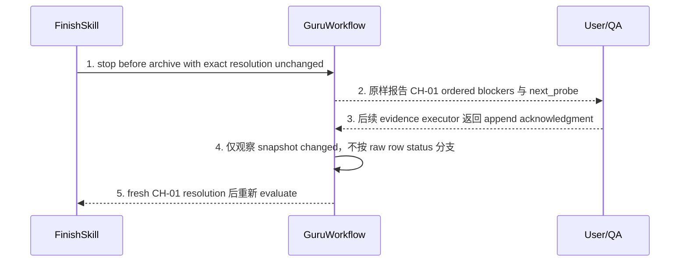
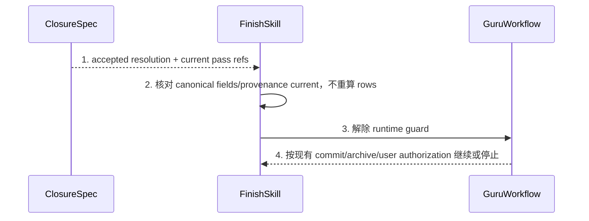
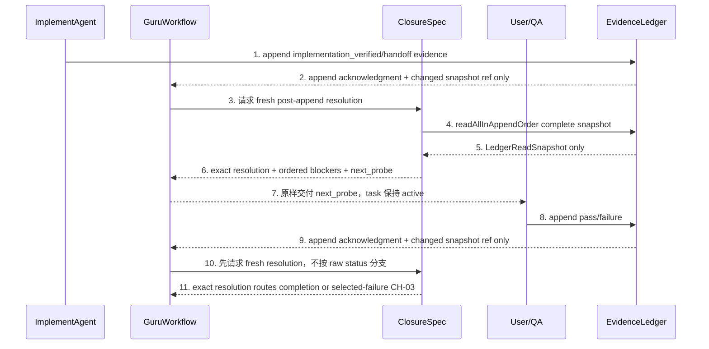

# CH-04 Runtime Completion Guard 详细设计

> doc_type: `workflow-contract` | l2_status: `task-local-v1`
> 承接索引: `design-main.md` 第 7 节 `CH-04 runtime completion guard` | 返回: [design-main](../design-main.md)
> 技术决策: TD-001, TD-002, TD-005
> 本章只定义 `FinishSkill`/Guru workflow 的 agent 行为合同；所有 Trellis scripts 保持不变，因此不声称 direct script invocation 被机器阻断。

## 1. 单元职责

### UNIT-runtime-completion

本单元承接 BHV-001。`FinishSkill` 只拥有本次 archive allow/block；它把 current/linked-active `TaskRef` 交给 CH-01，后者从 exact `<task_dir>/retrospective-reconciliation.jsonl` 完整重放 register并生成 fresh `AcceptanceResolution`。Finish 不读 ledger/journal或选 row；open、missing或corrupt register 时必须 block且不得报告 probe。

本单元不写 runtime evidence、不改 `task.json.status`、不覆盖 failure/pass、不重新分类 defect，也不引入未声明的中间 owner。它只在 agent/Skill/workflow 控制面阻止自身 archive 动作；若用户绕过 Skill 直接运行未改的 lifecycle script，本任务不能提供 script-level fail-closed 保证。

## 2. 行为定义

### 2.1 行为清单

| 行为 | 简述 | 承接 |
| --- | --- | --- |
| `evaluateRuntimeCompletion` | 在 finish-work 开始前解析 marker、required rows 和 current runtime evidence | BHV-001 |
| `blockPrematureArchive` | missing/pending/failure/stale 任一存在时保持 active并报告 exact row/probe | BHV-001 |
| `allowAcceptedArchive` | 仅全部 required rows current pass 且无更新 failure 时允许继续现有 archive flow | BHV-001 |
| `preserveActiveTaskUntilAcceptance` | 技术绿后把任务保持为 active runtime handoff，而不是先 archive 再 reopen | BHV-001 |

### 2.2 接口定义

以下签名是 Skill/workflow 合同记法：

```text
FinishSkill.evaluateRuntimeCompletion(input: FinishAcceptanceInput) -> FinishAcceptanceDecision
FinishSkill.blockPrematureArchive(input: FinishBlockingView) -> FinishStopResult
FinishSkill.allowAcceptedArchive(input: AcceptanceResolution) -> ArchiveContinuation
GuruWorkflow.preserveActiveTaskUntilAcceptance(input: RuntimeHandoffInput) -> RuntimeHandoffResult
```

依赖是 Finish -> CH-01 exact result + current task。Finish 只触发；ClosureSpec 独占 ledger/register read、blocker replay和 row selection。Finish 不过滤/定义私有 ref或调用 Repair/planning/script owners；Workflow 只报告决定。

## 3. 核心数据结构

### 3.1 数据模型

| 结构 | 字段 | 约束 |
| --- | --- | --- |
| `FinishAcceptanceInput` | `current_task`, `planning_markers`, `frozen_matrix`, `current_baseline`, `acceptance_resolution`, `requested_action` | `acceptance_resolution` 是 CH-01 刚从完整 snapshot 生成的 exact canonical object；`requested_action=finish_work/archive` 才进入 guard |
| `FinishBlockingView` | `acceptance_resolution` | 只携带 CH-01 exact canonical object；不得复制后重排 blocking fields、重新选择/验证 row 或删除 global debt |
| `FinishAcceptanceDecision` | `acceptance_resolution`, `reporting_status`, `archive_allowed`, `blocking_rows`, `next_action`, `capability_limit` | 保留 exact result；仅 current `accepted` 且两类 blockers 空时 allow |
| `FinishStopResult` | `acceptance_resolution`, `task_remains_active`, `blocking_acceptance_ids`, `blocking_evidence_refs`, `open_correction_debts`, `open_retrospective_reconciliations`, `next_probe`, `evidence_needed` | 顺序/probe 来自 CH-01；reconciliation open 时 probe 必为 null |
| `ArchiveContinuation` | `acceptance_resolution`, `reporting_status`, `current_pass_refs`, `continue_existing_archive_flow` | pass refs 原样来自 resolution.selected_evidence_refs；不直接执行 archive；生命周期动作仍遵循现有授权/流程 |
| `RuntimeHandoffInput` | `current_task`, `current_baseline`, `frozen_matrix`, `implementation_verified_append_result`, `evidence_owners` | 只把 append acknowledgment/snapshot-change signal 交给 workflow；不携带 raw row 或私有 probe selection |
| `RuntimeHandoffResult` | `acceptance_resolution`, `task_state_expectation`, `reporting_status`, `handoff_owner`, `next_probe`, `resume_condition` | exact resolution、ordered blockers 与 `next_probe` 原样保留；task 预期保持现有 active/in_progress |

### 3.2 错误类型表

| 错误名 | 错误码/枚举 | 语义 | 上抛/收口位置 |
| --- | --- | --- | --- |
| `FinishGuardError.markerWithoutMatrix` | `runtime_matrix_missing` | marker 要求 runtime acceptance 但无 frozen rows | `evaluateRuntimeCompletion` 阻断并路由 `DETAIL_DEFECT` |
| `FinishGuardError.notAccepted` | `runtime_acceptance_blocked` | CH-01 exact resolution 报告 debt、missing/pending/failure/stale/implementation_verified 任一 blocker | `blockPrematureArchive` 原样返回 ordered blockers 与 `next_probe` |
| `FinishGuardError.resolutionMissingOrStale` | `acceptance_resolution_not_current` | CH-01 result 缺失/字段丢失/双 snapshot stale，或 ledger/register 后续变化 | 阻断 archive；触发完整重算 |
| `FinishGuardError.registerUnavailable` | `reconciliation_register_unavailable_or_corrupt` | CH-01 无法从 current TaskRef 定位/strict replay exact journal | 阻断 archive，`next_probe=null`；不得把 missing 当 empty或用 later pass降级 |
| `FinishGuardError.falseAccepted` | `premature_accepted_claim` | 用 technical green/COMMIT_READY/旧 pass 声称 accepted | finish-work 阻断并纠正报告状态 |
| `FinishGuardError.directScriptLimit` | `script_level_guard_unavailable` | agent contract 无法阻止绕过 Skill 的直接脚本调用 | 披露 capability limit，不伪造 enforcement |

## 4. 逐行为设计

### 4.1 `evaluateRuntimeCompletion`

- 函数签名：`FinishSkill.evaluateRuntimeCompletion(input: FinishAcceptanceInput) -> FinishAcceptanceDecision`
- 行为简述：承接 BHV-001；在任何 archive 动作前读取 marker、matrix、baseline 和全部 required current rows。
- 输入参数：

| 参数 | 类型 | 取值域/约束 | 必填 |
| --- | --- | --- | --- |
| `input` | `FinishAcceptanceInput` | current active task + planning artifacts + current evidence | 是 |

- 输出：

| 返回值/发射值 | 类型 | 语义 |
| --- | --- | --- |
| `decision` | `FinishAcceptanceDecision` | archive allowed/blocked、报告状态、blocking rows、唯一下一动作 |

```mermaid
sequenceDiagram
  participant FS as FinishSkill
  participant CT as CurrentTaskContext
  participant CS as ClosureSpec
  participant EL as EvidenceLedger
  participant RR as ReconciliationRegister
  FS->>CT: 1. 读取 current task 与 planning markers
  FS->>CS: 2. 触发 frozen matrix/current baseline 的 fresh resolution
  CS->>EL: 3. readAllInAppendOrder 完整 raw snapshot
  EL-->>CS: 4. 返回 LedgerReadSnapshot + snapshot ref
  CS->>RR: 5. locate exact journal from TaskRef; strict full replay
  CS->>CS: 6. validate both + replay blockers + select rows
  CS-->>FS: 7. exact AcceptanceResolution
  alt resolution current、两类 blockers 空且 task_result=accepted
    FS->>FS: 8a. allow archive continuation
  else stale/field loss/open blocker/missing/pending/failure
    FS->>FS: 8b. block; reconciliation open means next_probe=null
  end
```

流程详述：

1. `FinishSkill` 读取 live current task，确认是否在 PRD/Detail/`implement.md` 声明 `runtime_acceptance_required=true`。
2. marker 为 true 时向 CH-01 提交 frozen matrix/current baseline 并触发 fresh resolution；marker 无 matrix 是 planning defect。Finish 不取得可按 ID 选择的 raw rows。
3. `ClosureSpec` 独占双 snapshot：校验非空 journal snapshot byte bindings，并从完整 ledger/position独立 `deriveLedgerAppendRef` 后 correlation；journal ref不参与推导。旧合法/空回滚、cross-position/重复 row复用 chain或任一 null record均 corrupt/open/null probe。
4. Finish 只检查字段完整、baseline/双 snapshot current、两类 open blockers 与 task result；不重演算法或另建私有 state。
5. `accepted` 且两类 blockers 空时才继续；否则按 exact blockers/refs/probe 阻断。append/register/baseline change 均使对象 stale。

异常处理：

| 异常情况 | 处置 | 错误转换位置 |
| --- | --- | --- |
| current task 不可定位 | 停止 lifecycle action，先核实 task authority | task context precheck |
| marker true 但 matrix 缺失 | 阻断并路由 Detail | `FinishSkill` |
| evidence 读取或 correction 求值失败 | CH-01 阻断并返回 exact debt/action；Finish 不重演或降级该结论 | CH-01 resolution |
| consumer 只能取得按 ID 过滤后的 rows 或私有 resolution | 阻断并路由 `DETAIL_DEFECT`；不能声称完整 ledger currentness 已求值 | CH-01 dependency precondition |
| result 字段缺失或 ledger/register 后续变化 | 阻断 archive并触发完整重算；不得以私有 row/register 状态继续 | resolution precheck |

### 4.2 `blockPrematureArchive`

- 函数签名：`FinishSkill.blockPrematureArchive(input: FinishBlockingView) -> FinishStopResult`
- 行为简述：承接 BHV-001；在 required runtime evidence 不完整时停止当前 finish-work 的 archive 分支。
- 输入参数：

| 参数 | 类型 | 取值域/约束 | 必填 |
| --- | --- | --- | --- |
| `input` | `FinishBlockingView` | 只含 exact CH-01 resolution；字段、blocking 顺序与 next probe 均不得复制后重排或重选 | 是 |

- 输出：

| 返回值/发射值 | 类型 | 语义 |
| --- | --- | --- |
| `stop` | `FinishStopResult` | task remains active，并原样保留 resolution、ordered blockers、next probe 与证据需求 |



流程详述：

1. `FinishSkill` 不排序、不挑 blocking ID，也不从 matrix/ledger 重建 probe；它只把 exact resolution 原样交给 `GuruWorkflow` 并终止本次 archive continuation。
2. `GuruWorkflow` 原样展示 CH-01 已排序的 `blocking_acceptance_ids`、对应 refs/debts 与唯一 `next_probe`，不改变其优先级或状态语义。
3. User/QA/agent 按该 next action 追加 evidence；ledger 只返回 append acknowledgment 与新 snapshot ref，不向 workflow 返回可用于 pass/failure 路由的 raw row。
4. snapshot 改变后，`GuruWorkflow` 先触发 CH-01 对完整新 snapshot 生成 fresh exact resolution，再仅按该 resolution 的 `task_result`/selected failure 进入 completion 或 CH-03。
5. 禁止缓存旧 allow/deny、ordered blockers 或 next probe。

异常处理：

| 异常情况 | 处置 | 错误转换位置 |
| --- | --- | --- |
| 多行 blocking | 原样报告 CH-01 ordered list 与 next_probe；Finish/Workflow 不排序 | `ClosureSpec` |
| 用户暂不能运行 | 任务保持 active，明确 handoff owner | `GuruWorkflow` |
| 直接 script 已被外部运行 | 如实报告 agent guard 未能阻断，不声称 task history 可自动恢复 | capability boundary |

### 4.3 `allowAcceptedArchive`

- 函数签名：`FinishSkill.allowAcceptedArchive(input: AcceptanceResolution) -> ArchiveContinuation`
- 行为简述：承接 BHV-001；all-pass 只解除 runtime guard，不等于自动获得 commit/archive 等其他授权。
- 输入参数：

| 参数 | 类型 | 取值域/约束 | 必填 |
| --- | --- | --- | --- |
| `input` | CH-01 `AcceptanceResolution` | exact object current、字段完整、两类 open blockers 为空且 `task_result=accepted` | 是 |

- 输出：

| 返回值/发射值 | 类型 | 语义 |
| --- | --- | --- |
| `continuation` | `ArchiveContinuation` | reporting status accepted + 允许继续既有 finish/archive flow |



流程详述：

1. 接收 CH-01 计算的 exact accepted resolution；pass refs 必须原样来自 `selected_evidence_refs`。
2. 只核对字段完整、baseline/双 snapshot current、两类 blockers 为空且 task result accepted；任何后续 append/register update 都回 fresh resolution。
3. 只解除 runtime acceptance guard并允许报告 `accepted`。
4. 其余 quality、commit、archive、用户授权仍按现有 workflow；本行为不自动执行 lifecycle action。

异常处理：

| 异常情况 | 处置 | 错误转换位置 |
| --- | --- | --- |
| canonical fields/pass refs 不完整 | 回 `blockPrematureArchive` 并重取 exact CH-01 resolution | resolution precheck |
| evidence 在决定后更新 | 旧 decision stale，重新 evaluate | currentness check |
| 其他 Gate/授权未满足 | 按现有 workflow 停止，不归因 runtime | `GuruWorkflow` |

### 4.4 `preserveActiveTaskUntilAcceptance`

- 函数签名：`GuruWorkflow.preserveActiveTaskUntilAcceptance(input: RuntimeHandoffInput) -> RuntimeHandoffResult`
- 行为简述：承接 BHV-001；技术验证后不先归档，直接在同一 active task 等待 target runtime。
- 输入参数：

| 参数 | 类型 | 取值域/约束 | 必填 |
| --- | --- | --- | --- |
| `input` | `RuntimeHandoffInput` | current task/baseline/matrix、implementation_verified append result 与 owners；无 raw row/probe selection | 是 |

- 输出：

| 返回值/发射值 | 类型 | 语义 |
| --- | --- | --- |
| `handoff` | `RuntimeHandoffResult` | exact fresh resolution、active expectation、owner、canonical next_probe 和 resume condition |



流程详述：

1. deterministic checks/review 绿后 evidence executor 只 append `implementation_verified` 或完整 handoff evidence，不称用户验收完成；ledger 返回 acknowledgment/snapshot change，不返回语义 row 给 workflow。
2. `GuruWorkflow` 观察 append 后必须先触发 CH-01 完整重算；required IDs、pending 语义、ordered blockers 与 probe 都只从 exact resolution 取得。
3. 把 resolution-owned environment/action、`next_probe` 和 evidence owner 原样交给 User/QA，任务预期保持现有 active/in_progress。
4. User/QA/agent 追加 pass/failure，不回写矩阵；新 append 再次使旧 resolution stale。
5. workflow 再取得 fresh resolution 后才路由：resolution-selected failure 进入 `UNIT-repair-continuation`，其他 `task_result` 进入本章 evaluate；不得依据 append payload/acknowledgment 直接分支。

异常处理：

| 异常情况 | 处置 | 错误转换位置 |
| --- | --- | --- |
| 无明确 runtime owner | 阻断 handoff，补 owner | `GuruWorkflow` |
| probe 不可执行/不可证伪 | `DETAIL_DEFECT` | ClosureSpec |
| 任务已 archived | 转 CH-03 archived fallback | current task check |

## 5. 状态管理

| 状态/结果 | 唯一写 owner | 初始态 | 允许转移 |
| --- | --- | --- | --- |
| `FinishAcceptanceDecision` | `FinishSkill` | `not_evaluated` | `evaluating -> blocked|allowed`；evidence 更新后旧决定 stale |
| `reporting_status` | `ClosureSpec` 计算，`FinishSkill` 报告 | `implementation_verified` | pending/failure/pass；all current pass -> accepted |
| `archive_allowed` | `FinishSkill` | false | 仅 accepted resolution -> true |
| runtime evidence | actual executor 经 EvidenceLedger | missing/pending | pass 或 failure；repair 后再 pending/pass |
| task lifecycle status | 现有 lifecycle owner | 现有 active/in_progress | 本章不新增/写状态；只阻止 `FinishSkill` 自身继续 archive |

明确 enforcement boundary：Skill/workflow 约束 agent 自身行为；未改脚本仍可能被用户直接调用。本章必须报告这个限制，不能把 agent guard 描述为机器 Gate。

## 6. Widget 设计

N/A：本章没有应用 UI；对用户的输出是 finish-work 文本状态、blocking acceptance ID 和下一 probe。

## 7. 测试映射

| BHV/行为 | 测试层 | 测试点 |
| --- | --- | --- |
| BHV-001 / `evaluateRuntimeCompletion` all-pass | integration/scenario | 全部 required latest current pass -> archive guard allowed |
| BHV-001 / `runtime_matrix_missing` | negative document contract | runtime-required marker 已存在但 frozen matrix 缺失时阻断 Finish/archive，并路由 `DETAIL_DEFECT` |
| BHV-001 / missing row | negative scenario | 无 row -> pending + exact acceptance ID/probe |
| BHV-001 / pending row | negative scenario | pending -> task remains active，不 archive |
| BHV-001 / failed row | negative scenario | latest failure -> CH-03，不 archive |
| BHV-001 / stale pass | negative scenario | baseline mismatch -> 旧 pass 不复用，重跑原 probe |
| BHV-001 / newer failure | negative scenario | pass 后更新 failure/pending -> blocked |
| BHV-001 / unreadable append visibility | negative JSONL scenario | older pass -> identity/baseline-unreadable raw append；按 ID filtered reader 会漏行，full-ledger reader 必须建 global debt 并阻断 |
| BHV-001 / readable-invalid debt | negative JSONL scenario | older pass -> readable unsupported/incomplete current append -> normal later pass 无 pointer，仍因 exact debt open 阻断 |
| BHV-001 / wrong correction | negative JSONL scenario | missing/wrong pointer、指向非 debt、自身/未来位置均不清债 |
| BHV-001 / invalid newest correction | negative JSONL scenario | 同一 debt 多个 corrections 只选 newest 后校验；newest invalid 时不得 fallback 到更早 correction/pass |
| BHV-001 / correction identity/baseline mismatch | negative JSONL scenario | ACC-A current bad append 被 ACC-B 或 stale/different-baseline correction 指向时仍阻断；partially readable stale target 只能补成 matching stale history，不得暴露 ACC-A 旧 pass |
| BHV-001 / corrected debt termination | positive JSONL scenario | later complete correction 精确指向 bad append，保留全部历史并关闭该 debt；全部 debts 关闭后才选 newest effective current row |
| BHV-001 / exact resolution consumption | negative workflow scenario | 丢失 ledger/register refs、任一 blocker、rows/selected/blocking/next-probe 的 projection 不得 allow archive |
| BHV-001 / append after accepted resolution | negative workflow scenario | CH-01 返回 accepted 后新增 unrelated/pending/failure/unreadable append，旧 resolution 与 allow decision 均 stale，必须重算 |
| BHV-001 / consumer-side blocker reselection | negative workflow scenario | Finish/Workflow 不得按 status 重排 blockers、挑 acceptance ID 或从 matrix 重建 probe；只展示 CH-01 ordered list/next_probe |
| BHV-001 / raw append routing | negative workflow scenario | ledger append 只返回 acknowledgment/snapshot change；Workflow 必须 fresh resolve 后才按 canonical task_result/selected failure 路由 |
| BHV-006 / unresolved retrospective Finish bypass | negative workflow scenario | committed pending/later pass 已在 ledger但 register attempt open时，Finish 仍 block、`next_probe=null`，直到 record recovery + fresh resolution |
| BHV-006 / fresh-session register discovery | negative workflow scenario | 丢弃内存后，Finish 仅以 current TaskRef 触发 CH-01；exact journal 的 open attempt 仍被发现，missing/partial/corrupt event 也 block/null probe，later pass不得 accepted |
| BHV-006 / append-ack record-bound crash | negative workflow scenario | accepted/committed ref 后、record-bound event ack 前崩溃；fresh Finish 即使 ledger 有 later pass仍 block/null probe |
| BHV-001 / false accepted | static/semantic review | `COMMIT_READY`/tests green/implementation review 不得输出 accepted |
| BHV-001 / `allowAcceptedArchive` | integration/manual | runtime guard 解除但没有 commit/archive 授权时仍停在既有 Gate |
| BHV-001 / `preserveActiveTaskUntilAcceptance` | workflow scenario | technical green 后同一 task 保持 active，User/QA 回传 row |
| BHV-001 / `runtime_handoff_owner_missing` | negative workflow scenario | runtime handoff 未声明明确 evidence owner 时阻断 handoff，不追加可冒充有效移交的 pending evidence |
| BHV-001 / script boundary | negative documentation test | 文档必须明确 direct script invocation 非 fail-closed |

## 8. 不得补造清单

- 不新增 `accepted` lifecycle status 或修改 `task.json` schema。
- 不把 tests/review/COMMIT_READY/implementation_verified 当成 runtime pass。
- 不只查任意一条 pass；必须核对 required set、current binding 和更新 row。
- 不由 Finish 读取/筛选 ledger/register、猜 journal path、replay blocker、选择 row，或定义私有 resolution；只能传 TaskRef并消费完整 CH-01 object。
- 不由 Finish/Workflow 重新排序 blocking rows、挑一个 acceptance ID/probe，或按 ledger append 的 raw status 直接路由；ordered blockers、`next_probe` 与 selected failure 只来自 fresh CH-01 resolution。
- 不允许预过滤、later pass/correction 或私有状态清除 correction debt/open retrospective reconciliation；两类 blockers 全关前不得构造 pass set。
- 不在 missing/pending/failure/stale 时执行 `FinishSkill` 的 archive 分支。
- 不自动运行用户/QA 的 target-runtime probe，不伪造 manual receipt。
- 不自动获得 commit、push、merge、archive、install 或 finish-work 授权。
- 不声称 Skill/workflow guard 能阻止用户直接调用未改脚本。
- 不修改任何 Trellis/Guru/CLI script。

## 9. 不变量矩阵

| invariant_id | rule（负向/排除约束） | owner | positive_case | negative_case | route_if_missing |
| --- | --- | --- | --- | --- | --- |
| `INV-FIN-001` | must-not 在 result缺失/stale、register invalid、任一 record_ref-null/blocker或 required非pass时 archive；Finish must-not direct-read/select | `FinishSkill` | exact replay shows acknowledged record-bound refs/no blockers，Finish消费 accepted | crash after append ack before record-bound，fresh Finish用later pass归档 | `PROCESS_DEFECT` |
| `INV-FIN-002` | must-not 用 technical green 或 `COMMIT_READY` 报告 accepted | `FinishSkill` | status=implementation_verified | tests green -> accepted | `PROCESS_DEFECT` |
| `INV-FIN-003` | must-not 忽略 pass 之后的更新 failure/pending | `ClosureSpec` | latest row wins | 读取第一条 pass 即结束 | `PROCESS_DEFECT` |
| `INV-FIN-004` | must-not 在 runtime handoff 前 archive active Full task | `GuruWorkflow` | active until evidence | technical green 即 archive | `PROCESS_DEFECT` |
| `INV-FIN-005` | must-not 将 runtime guard 解除解释为其他 lifecycle 授权 | `GuruWorkflow` | 继续现有 Gate | 自动 commit/archive | `PROCESS_DEFECT` |
| `INV-FIN-006` | must-not 声称本任务提供 script-level fail-closed | `FinishSkill` | 明确 agent contract limit | 声称 direct script 被阻断 | `REQ_BLOCKER` |
| `INV-FIN-007` | must-not 让 Finish/Workflow 重排 blocker、重选 ID/probe，或按 raw append 路由 | `ClosureSpec` + `GuruWorkflow` | append acknowledgment 只触发 fresh CH-01；consumer 原样展示 ordered blockers/next_probe | Finish 按 status 排序或 Workflow 从 ledger 新 row 直接选 pass/failure 分支 | `DETAIL_DEFECT` |

## 10. 批内方法证据

- 骨架：§1-§9 完整，Widget 设计有 N/A 依据。
- 合同八问：四个行为均具备 BHV、输入输出、错误、状态、依赖、失败收口、事件、测试和负向 invariant。
- 粒度抽查：`evaluateRuntimeCompletion` 从 marker/current task、触发 CH-01 fresh full-snapshot resolution、exact canonical result precheck 到 allow/block 输出完整；raw read、persistent debt、correction 与 row selection/validation 全部保留在 CH-01 owner 内。
- task-local dependency 核对：Finish contract 只依赖 exact CH-01 `AcceptanceResolution` 和 current task context；Finish 可触发但不执行 raw-ledger currentness，唯一写本次 archive decision，且无私有 resolution、反向写入或 owner 环。
- enforcement：显式限定为 agent/Skill/workflow，不声称 script Gate。
- 批内自动 review：`findings=2`，`repair_iterations=1`，`open_findings=0`；已为 marker-without-matrix 和 no-runtime-owner 分支补齐 known-bad falsifier。
- `chapter_status=passed_by_method_evidence`
