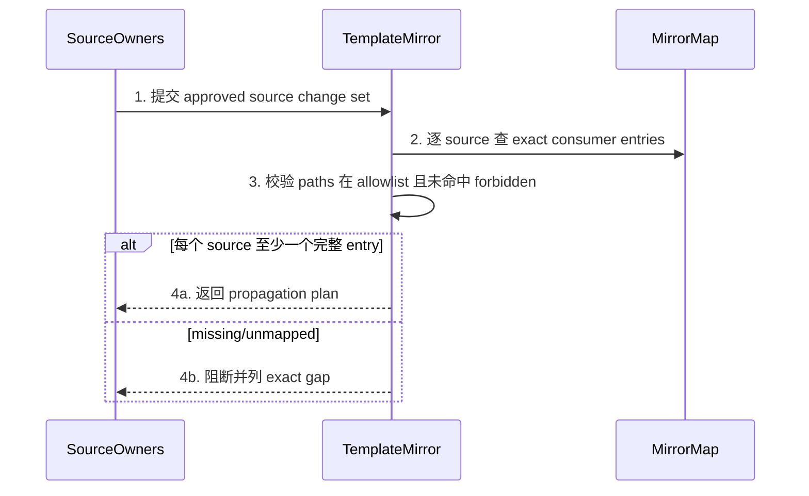
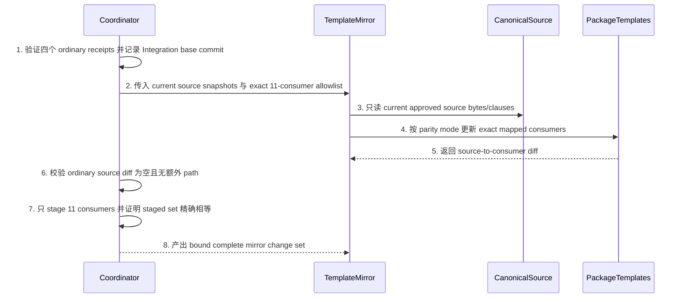
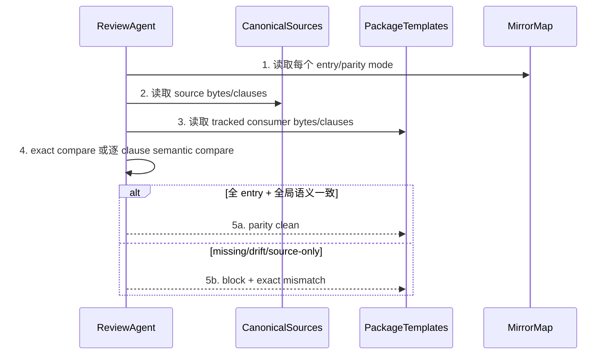
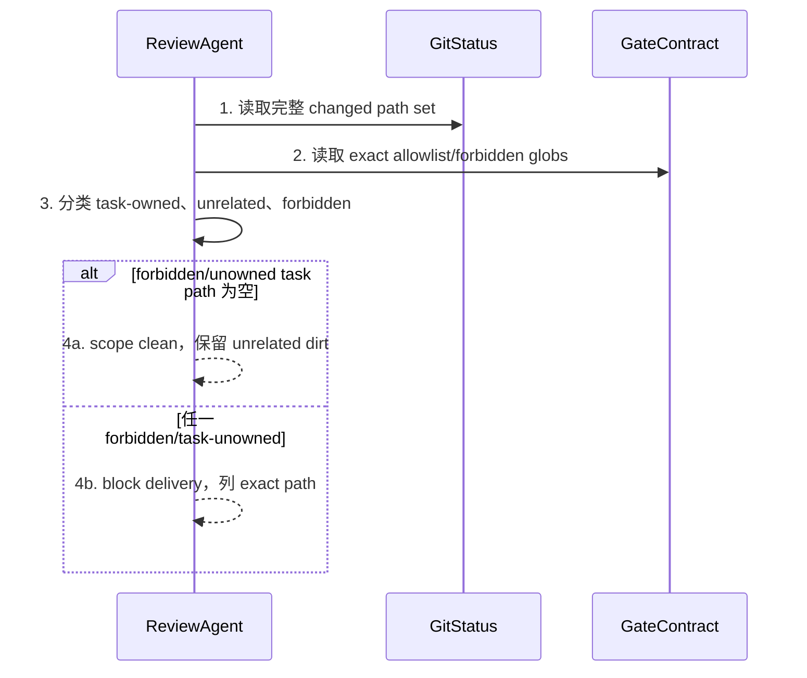
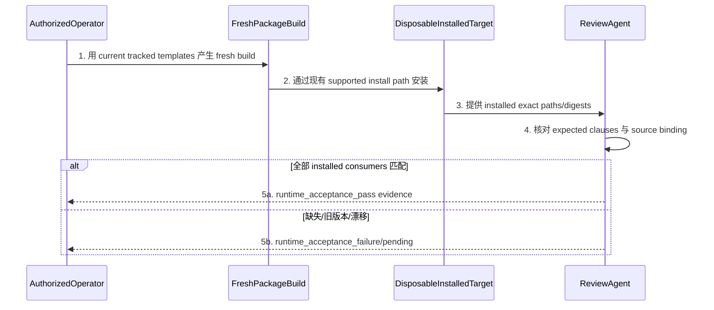

# CH-05 Template Parity And Forbidden Scope 详细设计

> doc_type: `template-parity` | l2_status: `task-local-v1`
> 承接索引: `design-main.md` 第 7 节 `CH-05 template parity and forbidden scope` | 返回: [design-main](../design-main.md)
> 技术决策: TD-005, TD-006
> `packages/cli/dist/**` 是 ignored build output，不是本任务 source owner；runtime probe 必须通过 fresh package build/install 验证实际消费者，而不能把 source-template parity 当成已安装证明。

## 1. 单元职责

### UNIT-template-parity

本单元承接 BHV-007、BHV-008。`TemplateMirror` 唯一拥有 canonical source contract 到 exact tracked consumer 的传播；前六条边从 package-template source 生成 checkout-local consumer，后五条边从 `guru-template/**` source 生成 Guru package consumer。各 canonical source owner 仍只写自己的 Skill/workflow/spec/TOML；`ReviewAgent` 只读验证 exact/semantic parity、changed-path scope 和 fresh installed consumer。

本单元依赖 `UNIT-acceptance-closure-contract` 的 `ACC-PARITY-005` 和 `UNIT-repair-continuation` 的 no-script/archived capability boundary。它不把 package mirror 变成第二 SSOT，不写 canonical source owner 的内容，不修改 ignored `dist` 作为交付手段，也不修改或绕过任何 sync/install/Gate/lifecycle script。

当前 installed supervisor 会把 Integration packet 的 22 个
`target_paths` 全部交给 implementation dispatch，不能 enforce 本单元的
11-consumer-only 写边界。脚本禁止变更，因此 Integration 不由该
supervisor dispatch；它由 coordinator 在 ordinary commits/receipts
全部 current 后，于 clean disposable control worktree 中手工传播。
supervisor 只能在 exact consumer-only staging 完成后参与只读 semantic
review。这里的保护是 agent/process containment，不声称 script-level
fail-closed。

## 2. 行为定义

### 2.1 行为清单

| 行为 | 简述 | 承接 |
| --- | --- | --- |
| `resolveMirrorMap` | 为每个 approved canonical source 列出 exact tracked consumers 和 parity mode | BHV-008 |
| `propagateApprovedContract` | 只把已确认 source 语义传播到 mapped tracked consumers，不反向改 source | BHV-008 |
| `verifySemanticParity` | 检查状态词、dual-snapshot/reconciliation、affinity、rollback、wrong-SSOT、runtime guard 和 no-script 条款 | BHV-008 |
| `auditForbiddenScope` | 检查完整 changed-path set，任一 script/CLI TS/Python/shell 改动即阻断 | BHV-007, BHV-008 |
| `verifyInstalledConsumer` | 在获授权的 disposable target 对 fresh build/install 结果做实际文件语义检查 | BHV-008 |

### 2.2 接口定义

以下签名是 coordinator/reviewer 合同记法：

```text
TemplateMirror.resolveMirrorMap(input: CanonicalChangeSet) -> MirrorPropagationPlan
TemplateMirror.propagateApprovedContract(input: MirrorPropagationPlan) -> MirrorChangeSet
ReviewAgent.verifySemanticParity(input: ParityReviewInput) -> ParityReviewResult
ReviewAgent.auditForbiddenScope(input: ChangedPathSet) -> ScopeAuditResult
ReviewAgent.verifyInstalledConsumer(input: InstalledConsumerInput) -> InstalledConsumerResult
```

依赖方向是 `TemplateMirror -> approved canonical sources`，`ReviewAgent -> source + tracked consumers + build/install evidence`。不依赖 Requirements/Overview/Detail 写 API，不写 `ClosureSpec`/`EvidenceLedger`，不调用另一个 contract owner 回写 source，也不运行未知或修改过的 install script。

## 3. 核心数据结构

### 3.1 数据模型

| 结构 | 字段 | 约束 |
| --- | --- | --- |
| `MirrorMapEntry` | `canonical_source`, `tracked_consumers`, `parity_mode`, `required_clauses`, `generated_runtime_surface` | 路径 exact、无 wildcard；one-way source -> consumers |
| `CanonicalChangeSet` | `approved_sources`, `source_digests`, `changed_semantics`, `detail_refs` | 只接收 Detail-confirmed source scope |
| `MirrorPropagationPlan` | `entries`, `integration_base_commit`, `ordinary_receipt_targets`, `integration_owned_paths`, `read_paths`, `forbidden_paths`, `expected_parity_checks` | base commit 绑定四个 current ordinary receipts；owned paths 精确等于 11 consumers |
| `MirrorChangeSet` | `source_to_consumer_diff`, `unmapped_sources`, `missing_consumers`, `changed_paths`, `staged_path_set`, `ordinary_source_diff` | missing/unmapped、source diff、extra path 或 staged set 不相等均阻断并废弃 worktree |
| `ParityReviewInput` | `mirror_map`, `source_snapshot`, `consumer_snapshot`, `normalized_clauses`, `changed_paths` | exact mode 用 byte compare；semantic mode 用逐条 clause compare |
| `ParityReviewResult` | `per_entry`, `vocabulary_match`, `affinity_match`, `rollback_match`, `wrong_ssot_match`, `finish_guard_match`, `no_script_archived_match`, `scope_clean` | `finish_guard_match` 明确含 exact journal locator/full replay/missing-corrupt fail-close；六类语义 match 与独立 `scope_clean` 全 true 才 clean |
| `InstalledConsumerInput` | `package_version_or_build_digest`, `fresh_build_evidence`, `disposable_target`, `installed_paths`, `expected_clauses` | 必须是 fresh output；ignored dist 预存文件不算 |
| `InstalledConsumerResult` | `installed_digest`, `per_path_clause_result`, `source_binding`, `environment`, `evidence_refs` | 绑定 fresh package build 和 target |

#### Source To Consumer Mirror Map

| canonical source | tracked consumer templates | parity mode | required clauses / generated runtime surface |
| --- | --- | --- | --- |
| `packages/cli/src/templates/codex/agents/trellis-implement.toml` | `.codex/agents/trellis-implement.toml` | generated semantic wrapper parity | matrix pre-read、unfalsifiable route、affected evidence reuse |
| `packages/cli/src/templates/codex/agents/trellis-check.toml` | `.codex/agents/trellis-check.toml` | generated semantic wrapper parity | bounded source-to-sink review、wrong-SSOT classification |
| `packages/cli/src/templates/common/skills/check.md` | `.agents/skills/trellis-check/SKILL.md` | generated Skill parity | acceptance-path closure、exact journal locator/replay、dual-snapshot blockers、Integration/runtime distinction |
| `packages/cli/src/templates/common/commands/finish-work.md` | `.agents/skills/trellis-finish-work/SKILL.md` | generated Skill parity | TaskRef discovery、missing/corrupt fail-close、record-ref-null stop、required pass |
| `packages/cli/src/templates/common/skills/break-loop.md` | `.agents/skills/trellis-break-loop/SKILL.md` | generated Skill parity | five retrospective fields、same-goal affinity、maximum rollback |
| `packages/cli/src/templates/markdown/spec/guides/cross-layer-thinking-guide.md.txt` | `.trellis/spec/guides/cross-layer-thinking-guide.md` | exact generated parity | acceptance path、exact journal event contract、dual-snapshot/reconciliation、known-bad falsifiability |
| `guru-template/workflows/guru-client-workflow.md` | `packages/cli/src/templates/guru/workflows/guru-client.md` | exact body parity unless packaging header differs | TaskRef/full replay、record-bound closure、durable blocker/bounded retry、routing、archived/no-script |
| `guru-template/overlay/agents-skills/flutter-implementation-guru-writing/SKILL.md` | `packages/cli/src/templates/guru/overlay/agents-skills/flutter-implementation-guru-writing/SKILL.md` | exact byte parity | writer closure contract |
| `guru-template/overlay/agents-skills/flutter-implementation-guru-review/SKILL.md` | `packages/cli/src/templates/guru/overlay/agents-skills/flutter-implementation-guru-review/SKILL.md` | exact byte parity | reviewer closure/wrong-SSOT contract |
| `guru-template/overlay/agents-skills/guru-bug-fast-path/SKILL.md` | `packages/cli/src/templates/guru/overlay/agents-skills/guru-bug-fast-path/SKILL.md` | exact byte parity | same-goal/rollback/pre-boundary/one-retry/record-bound contract |
| `guru-template/specs/guru-flutter-client/harness/implementation/implementation-trace-contract.md` | `packages/cli/src/templates/guru/specs/guru-flutter-client/harness/implementation/implementation-trace-contract.md` | exact byte parity | Acceptance Matrix、exact journal path/event snapshot、dual-snapshot currentness |

前六个 canonical sources 被 live Trellis configurator 消费，生成
checkout-local tracked consumers；后五个 canonical sources 被
`sync:guru` 消费，生成 Guru package mirrors。Integration 只拥有表中 11
个 consumer paths，fresh build/install evidence 才证明真实 target 的
installed files。`getAllCodexSkills()` 只读取 `codex-skills/`，因此静态
`packages/cli/src/templates/codex/skills/{check,finish-work,break-loop}` 不在
live source-to-install chain 中，也不得计入 source、consumer 或 parity
通过数。

### 3.2 错误类型表

| 错误名 | 错误码/枚举 | 语义 | 上抛/收口位置 |
| --- | --- | --- | --- |
| `ParityError.unmappedSource` | `canonical_source_unmapped` | approved source change 没有 mirror map entry | `resolveMirrorMap` 阻断 |
| `ParityError.missingConsumer` | `tracked_consumer_missing` | map 中 consumer 文件不存在/未更新 | `propagateApprovedContract` 阻断 |
| `ParityError.sourceOnly` | `source_only_change` | 只改 canonical source，tracked consumer 仍旧 | `verifySemanticParity` 阻断 |
| `ParityError.semanticDrift` | `consumer_semantic_drift` | 状态/affinity/rollback/wrong-SSOT/finish guard 任一漂移 | `verifySemanticParity` 阻断 |
| `ParityError.reverseOwnership` | `mirror_became_ssot` | 从 tracked consumer 反推或覆盖 canonical policy | `TemplateMirror` 阻断 |
| `ParityError.containmentUnproven` | `consumer_scope_unproven` | base/receipt stale、ordinary source diff 非空、额外 path 或 staged set 不等于 11-consumer allowlist | coordinator 废弃 disposable worktree |
| `ParityError.forbiddenPath` | `forbidden_path_changed` | changed set 命中 gate-contract forbidden glob | `auditForbiddenScope` 阻断 delivery |
| `ParityError.staleDist` | `stale_generated_runtime` | 用预存 ignored dist 证明安装态 | `verifyInstalledConsumer` 拒绝证据 |
| `ParityError.installUnproven` | `installed_consumer_unproven` | 无 fresh build/install/path evidence | runtime acceptance pending |

## 4. 逐行为设计

### 4.1 `resolveMirrorMap`

- 函数签名：`TemplateMirror.resolveMirrorMap(input: CanonicalChangeSet) -> MirrorPropagationPlan`
- 行为简述：承接 BHV-008；在实现前冻结 source 到所有 tracked consumer 的精确映射。
- 输入参数：

| 参数 | 类型 | 取值域/约束 | 必填 |
| --- | --- | --- | --- |
| `input` | `CanonicalChangeSet` | Detail-confirmed source paths/digests/semantics | 是 |

- 输出：

| 返回值/发射值 | 类型 | 语义 |
| --- | --- | --- |
| `plan` | `MirrorPropagationPlan` | exact entries、owned/read/forbidden paths 和 parity method |



流程详述：

1. 只接受 Detail-confirmed canonical source paths，不接受实现 worker 临时扩 scope。
2. 对每个 source 从本章 mapping table 取 tracked consumers、parity mode 和 required clauses。
3. 用 gate-contract exact allowlist/forbidden globs 检查所有 planned paths；目录 entry 展开到实际文件。
4. mapping 完整才返回 plan；缺 consumer 不在实现期猜测或忽略。

异常处理：

| 异常情况 | 处置 | 错误转换位置 |
| --- | --- | --- |
| source 不在表 | 阻断 Detail/Integration，补显式映射 | `TemplateMirror` |
| consumer path 不存在 | 阻断，核实 package template structure | `TemplateMirror` |
| planned path 命中 script/TS/Python/shell | 停止并请求新授权 | scope audit |

### 4.2 `propagateApprovedContract`

- 函数签名：`TemplateMirror.propagateApprovedContract(input: MirrorPropagationPlan) -> MirrorChangeSet`
- 行为简述：承接 BHV-008；source owner 完成后，Integration 只编辑 mapped tracked consumers。
- 输入参数：

| 参数 | 类型 | 取值域/约束 | 必填 |
| --- | --- | --- | --- |
| `input` | `MirrorPropagationPlan` | current source digests + exact mapped consumers | 是 |

- 输出：

| 返回值/发射值 | 类型 | 语义 |
| --- | --- | --- |
| `changes` | `MirrorChangeSet` | 每个 source/consumer diff、missing/unmapped 和 complete changed set |



流程详述：

1. ordinary slices 按 A-D 顺序完成 serial staging/review/commit/receipt；coordinator 验证四个 receipt current，并把最后一个 accepted ordinary commit 记录为 `integration_base_commit`。
2. 从该 commit 创建 clean disposable control worktree；当前 dirty checkout 不进入 allowlist，也不作为 Integration 基线。
3. 读取 source owner 已完成且 current 的 bytes/required clauses；TemplateMirror 不改 source。
4. exact mode 使 tracked consumer 与 source bytes 一致；semantic mode 在平台 wrapper 中逐条落同一行为。
5. 为每个 entry 记录 source-to-consumer diff 和 changed clauses，缺失项留 blocker。
6. stage 前证明 11 个 ordinary canonical sources 相对 `integration_base_commit` 无 Integration 新增 diff，且完整 changed path set 没有额外路径。
7. coordinator 仅 stage exact `integration_owned_paths`，再证明 staged path set 与 11-consumer allowlist 集合相等，不接受 subset、superset、rename 或未跟踪旁路。
8. 完整且绑定 base/receipts 的 change set 才交给 parity/scope review；installed supervisor 不参与 implementation dispatch，只可在该 staging 后做只读 semantic review。
9. 任一 source/extra path、stale receipt/base、missing consumer 或 staged-set mismatch 都不得在原 worktree 中“顺手修”；废弃整个 disposable worktree，从 accepted ordinary commits 重新创建。

异常处理：

| 异常情况 | 处置 | 错误转换位置 |
| --- | --- | --- |
| source digest 在传播中变化 | 旧 plan stale，重新读取 current source | `TemplateMirror` |
| semantic wrapper 无法表达 source 条款 | 阻断，回 Detail/owner，不删语义 | `TemplateMirror` |
| mirror 传播触及 source/额外 path | `consumer_scope_unproven`，废弃 disposable worktree 并从 accepted ordinary commits 重建 | coordinator containment audit |
| staged set 不是 exact 11 consumers | 清空该 disposable attempt，不提交、不补 stage；重建后重做 | coordinator containment audit |
| current supervisor 被用于 Integration implementation dispatch | 阻断；它只允许在 consumer-only staging 后做只读 review | capability audit |

### 4.3 `verifySemanticParity`

- 函数签名：`ReviewAgent.verifySemanticParity(input: ParityReviewInput) -> ParityReviewResult`
- 行为简述：承接 BHV-008；逐 entry 证明 source 与 tracked consumer 的行为一致，而不是只看关键词出现。
- 输入参数：

| 参数 | 类型 | 取值域/约束 | 必填 |
| --- | --- | --- | --- |
| `input` | `ParityReviewInput` | current source/mirror snapshots、map、normalized clauses、changed paths | 是 |

- 输出：

| 返回值/发射值 | 类型 | 语义 |
| --- | --- | --- |
| `result` | `ParityReviewResult` | per-entry exact/semantic result 和六类全局语义结果 |



流程详述：

1. reviewer 用本章 exact map，不用 wildcard 或“相关模板”。
2. exact mode 逐 byte 比较；semantic mode 对状态 vocabulary、same-goal affinity、maximum rollback、wrong-SSOT、runtime guard、no-script/archived boundary 逐项比较。
3. 对每个 consumer 记录 source anchor 和 consumer anchor，不接受只匹配单词的 false positive。
4. 汇总 source-only、missing、drift；同时确认 tracked consumer 没有更强/更弱的另一套生命周期。
5. 只有全部 entry 和全局语义一致才 clean；否则 delivery/review-ready 阻断。

异常处理：

| 异常情况 | 处置 | 错误转换位置 |
| --- | --- | --- |
| exact file byte mismatch | block，更新 mapped consumer或证明 packaging-only header exception | parity review |
| semantic wrapper 漏 negative rule | `semanticDrift`，block | parity review |
| consumer 缺失/弱化 no-script 或 archived capability limitation，或未产出 `no_script_archived_match` | `semanticDrift`，block；`scope_clean=true` 不能覆盖该缺口 | parity review |
| 只改 source | `sourceOnly`，block | parity review |

### 4.4 `auditForbiddenScope`

- 函数签名：`ReviewAgent.auditForbiddenScope(input: ChangedPathSet) -> ScopeAuditResult`
- 行为简述：承接 BHV-007、BHV-008；对完整 changed set 做 no-script 审计，不只查几个目录。
- 输入参数：

| 参数 | 类型 | 取值域/约束 | 必填 |
| --- | --- | --- | --- |
| `input` | `ChangedPathSet` | staged、unstaged、untracked 中本任务实际改动的 exact paths | 是 |

- 输出：

| 返回值/发射值 | 类型 | 语义 |
| --- | --- | --- |
| `result` | `ScopeAuditResult` | allowed/forbidden/unowned 分类和 zero-script 结论 |



流程详述：

1. 分别读取 staged、unstaged、untracked 和 dirty submodule，不把 staged diff 当全部 truth。
2. 用 gate-contract allowlist 和 forbidden patterns 检查本任务实际改动；`**/*.py`、`**/*.sh` 和 `packages/cli/src/**/*.ts` 全局扫描。
3. 将既有 unrelated dirt 与本任务 changed paths 分开；不 stage/revert/clean unrelated work。
4. 本任务 forbidden/unowned 为空才报告 zero script changes；任一命中阻断，不靠“没改核心逻辑”豁免。

异常处理：

| 异常情况 | 处置 | 错误转换位置 |
| --- | --- | --- |
| path ownership 不明 | 阻断提交，核实来源 | changed-path classification |
| forbidden path 是生成副作用 | 仍阻断，不提交；调整执行方法 | scope audit |
| unrelated dirt 存在 | 报告并保留，不纳入 task pass/fail | dirty-worktree handling |

### 4.5 `verifyInstalledConsumer`

- 函数签名：`ReviewAgent.verifyInstalledConsumer(input: InstalledConsumerInput) -> InstalledConsumerResult`
- 行为简述：承接 BHV-008；fresh build/install 后检查真正 target 中的 Skill/workflow/spec/TOML，而不是只看 tracked template。
- 输入参数：

| 参数 | 类型 | 取值域/约束 | 必填 |
| --- | --- | --- | --- |
| `input` | `InstalledConsumerInput` | fresh build digest、disposable target、installed paths、expected clauses | 是 |

- 输出：

| 返回值/发射值 | 类型 | 语义 |
| --- | --- | --- |
| `result` | `InstalledConsumerResult` | installed digest、逐 path clause 结果、source binding 和 evidence refs |



流程详述：

1. 仅在另行获得运行/安装授权后，从 current tracked templates 产生 fresh package build；记录 package version/digest。
2. 用仓库现有 supported install path 安装到 disposable target；本任务不改 install/sync script。
3. 从 target 读取实际 installed Skill/workflow/spec/TOML paths 和 digests。
4. 对照 source binding 与 required clauses；预存 ignored `packages/cli/dist` 文件不能作为 fresh evidence。
5. 全部实际消费者匹配才为 `ACC-PARITY-005` pass；未执行安装保持 pending，缺失/漂移记录 failure。

异常处理：

| 异常情况 | 处置 | 错误转换位置 |
| --- | --- | --- |
| 未获安装授权 | 保持 runtime pending，不代跑 | operator boundary |
| build digest 不绑定 current templates | evidence stale，重建 | installed review precheck |
| target 中缺 path/旧条款 | runtime failure，回 Integration mirror scope | installed review |

## 5. 状态管理

| 状态 | 唯一写 owner | 初始态 | 允许转移 |
| --- | --- | --- | --- |
| `MirrorPropagationPlan` | `TemplateMirror` | unmapped | mapped -> scope_checked -> ready|blocked |
| `MirrorChangeSet` | `TemplateMirror` | source_current/mirrors_pending | propagated -> complete|missing |
| `ParityReviewResult` | `ReviewAgent` | not_reviewed | context_bound -> compared -> clean|drift |
| `ScopeAuditResult` | `ReviewAgent` | unknown | changed_set_loaded -> clean|forbidden |
| `InstalledConsumerResult` | `ReviewAgent`（authorized operator 只提供 `InstalledConsumerInput` evidence） | pending | fresh_build -> installed -> pass|failure |

TemplateMirror 不写 source state；ReviewAgent 不写 mirror/source bytes；ignored dist 是 build output，不是持久 state owner。

## 6. Widget 设计

N/A：本章没有应用 UI；installed consumer 是文件/agent contract，不是 Widget。

## 7. 测试映射

| BHV/行为 | 测试层 | 测试点 |
| --- | --- | --- |
| BHV-008 / `resolveMirrorMap` 成功 | static/document contract | 11 个 canonical sources 各有 exact tracked consumers/parity mode |
| BHV-008 / unmapped source | negative static | 任一 approved source 无 entry 时阻断 |
| BHV-008 / missing consumer | negative static | 任一 mapped consumer 缺失或未更新 -> `tracked_consumer_missing` |
| BHV-008 / `propagateApprovedContract` | integration/static | ordinary receipts/base current；exact mirrors byte match；semantic wrappers 六类条款齐全；staged set 精确等于 11 consumers |
| BHV-008 / source-only | negative static | source changed、consumer unchanged -> block |
| BHV-008 / semantic drift | semantic review | consumer 缺 same-goal/rollback/wrong-SSOT/finish guard/no-script+archived 任一项，或 finish guard 未含 exact path/full replay/missing-corrupt fail-close -> block；`scope_clean` 不得代替 |
| BHV-008 / mirror became SSOT | negative ownership audit | Integration 尝试从 consumer 反推或覆盖 canonical source -> abandon disposable worktree，`mirror_became_ssot` |
| BHV-008 / consumer scope unproven | negative containment audit | source/extra path diff、stale base/receipt、或 staged set 非 exact allowlist -> abandon disposable worktree，`consumer_scope_unproven` |
| BHV-007/BHV-008 / `auditForbiddenScope` | static/git | staged/unstaged/untracked/dirty submodule 分类；task forbidden paths 必须为空 |
| BHV-007 / script pressure | negative static | `.py`/`.sh`/CLI TS/verify/hooks/apply path 变化 -> block/request new authorization |
| BHV-008 / `verifyInstalledConsumer` pass | manual/integration | fresh build/install target 中实际 consumer clauses 与 current source 绑定 |
| BHV-008 / stale dist | negative integration | 只读取预存 ignored dist -> evidence rejected |
| BHV-008 / install unproven | negative integration | 无 fresh build digest、target path 或 source binding -> `installed_consumer_unproven` |
| BHV-008 / no install authorization | manual | 保持 runtime pending，不伪造 pass；operator 不成为 result co-owner |

## 8. 不得补造清单

- 不把 tracked consumer 或 ignored dist 变成 canonical semantic owner。
- 不只更新 source 而漏 tracked consumer，也不只更新 consumer 反推 source。
- 不用 keyword presence 代替 exact/semantic clause review。
- 不把 tracked template parity 宣称为已安装 target 的 runtime pass。
- 不编辑/提交 ignored `packages/cli/dist/**` 作为 source fix。
- 不自动运行 build/install/sync；需运行时遵循后续授权且不得修改其 scripts。
- 不使用当前 installed supervisor dispatch Integration implementation；它的
  22-path 写面不能证明 consumer-only containment。
- 不修改任何 `.py`、`.sh`、`packages/cli/src/**/*.ts`、verify/hooks/apply/lifecycle/Gate script。
- 不 stage、revert、clean 或吸收 unrelated dirty work。
- 不把 coordinator 手工校验伪称为 script-level fail-closed，也不在
  containment 失败后保留或修补该 disposable worktree。
- 不承诺 archived in-place reopen 或 machine baseline inheritance。

## 9. 不变量矩阵

| invariant_id | rule（负向/排除约束） | owner | positive_case | negative_case | route_if_missing |
| --- | --- | --- | --- | --- | --- |
| `INV-PAR-001` | must-not 交付 source-only contract change | `TemplateMirror` | every mapped consumer current | source 新条款、package 旧条款 | `IMPLEMENT_DEFECT` |
| `INV-PAR-002` | must-not 让 mirror 成为反向 policy owner | `TemplateMirror` | source -> consumer only | 从 tracked consumer 改 source 语义 | `DETAIL_DEFECT` |
| `INV-PAR-003` | must-not 用关键词替代六类 parity | `ReviewAgent` | 验证 snapshot byte binding、ledger独立 derive ref、rollback/mismatch fixtures及 record-bound chain | keyword pass、journal ref自证、旧/空回滚或cross-position复用 | `PROCESS_DEFECT` |
| `INV-PAR-004` | must-not 用 tracked/ignored template parity 冒充 installed runtime pass | `ReviewAgent` | fresh build/install evidence | 读取旧 dist 即 pass | `PROCESS_DEFECT` |
| `INV-PAR-005` | must-not 允许任一 forbidden path 进入 task delivery | `ReviewAgent` | task forbidden set empty | `.py`/`.sh`/CLI TS changed | `REQ_BLOCKER` |
| `INV-PAR-006` | must-not 让 Integration 写 ordinary source-owned paths | `TemplateMirror` | coordinator 提供 current ordinary receipts/base；changed/staged path set 精确等于 11 consumers；ordinary source diff 为空 | Integration 重写 canonical source、出现额外 path、staged set 不相等或使用 22-path supervisor implementation dispatch | `PROCESS_DEFECT`；废弃 disposable worktree |
| `INV-PAR-007` | must-not 在未获安装授权时伪造 installed evidence | authorized operator | status pending | agent 自报 target pass | `PROCESS_DEFECT` |

## 10. 批内方法证据

- 骨架：§1-§9 完整，Widget 设计有 N/A 依据。
- 合同八问：五个行为均覆盖 BHV、输入输出、错误、状态、依赖、失败、后置、测试和负向 invariant。
- 粒度抽查：`verifyInstalledConsumer` 从 fresh build binding、supported install、installed path digest、clause comparison 到 pass/failure/pending 完整。
- task-local dependency 核对：Template parity 只依赖 canonical source、exact consumer map 与 review/install evidence；`TemplateMirror` 唯一写 propagation plan/change set，`ReviewAgent` 唯一写 parity/scope/installed results，无反向 source ownership 或 owner 环。
- parity：明确区分 canonical source、tracked consumers、ignored build output 与 actual installed target。
- 批内自动 review：`findings=0`，`repair_iterations=0`。
- domain checkpoint：五个 UNIT 的状态 owner 唯一；依赖为 CH-01 contract -> CH-02/03/04/05 consumers，CH-03 消费 CH-02 classification，CH-04 消费 CH-01/CH-03 route，单向无环。
- data checkpoint：TD-001 冻结 `<task_dir>/verification-evidence.jsonl` 与 `<task_dir>/retrospective-reconciliation.jsonl`；CH-01独占后者 append/replay，所有 source/consumer 必须保持 locator、event snapshot和fail-close parity；无网络/缓存决策。
- presentation checkpoint：N/A，无 page/controller；operator 输出与 Overview §5.7 sequences 一致。
- cross-cutting checkpoint：CH-05 的 source/package/install parity 覆盖全部 consumer；无权限/SDK/第三方域名，evidence 合规回指 CH-01。
- `chapter_status=passed_by_method_evidence`
