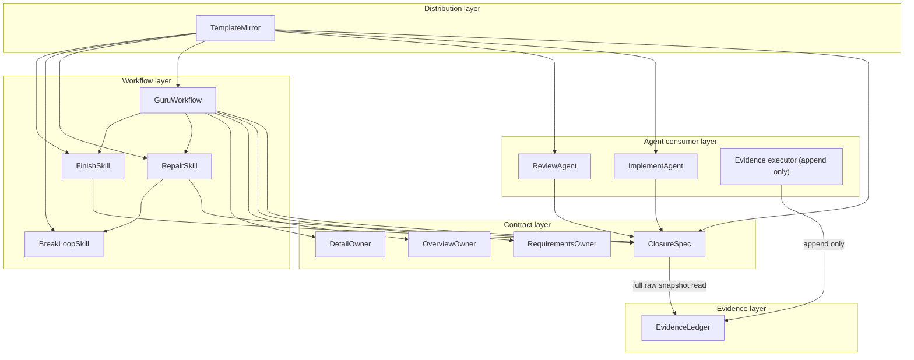
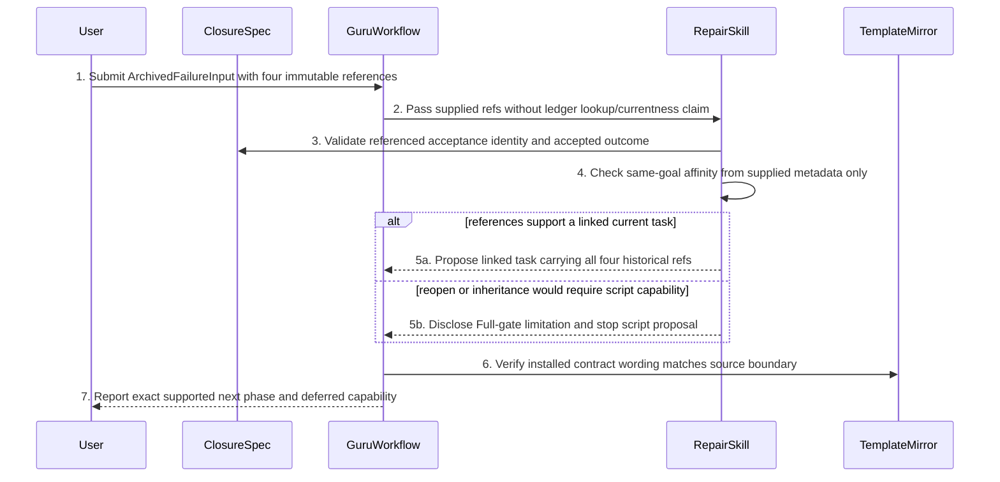
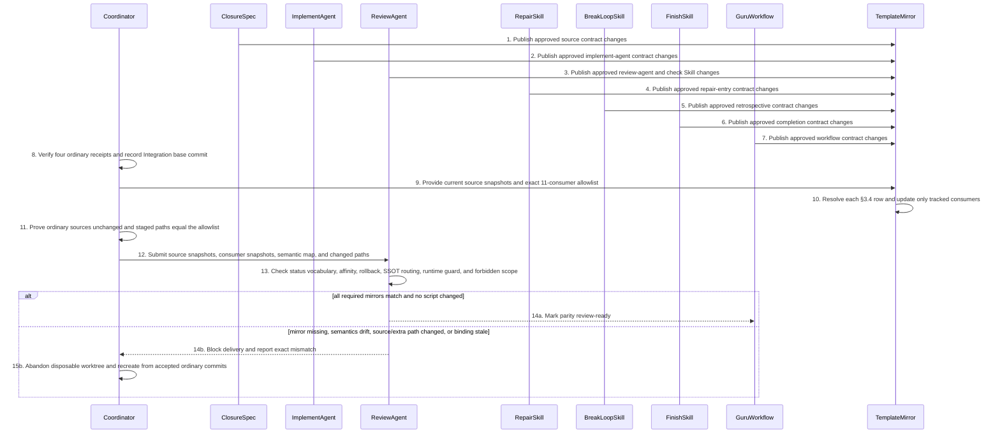

# Guru Runtime Acceptance and Full Repair Continuation Overview

> Execution mode: one-shot Overview delivery
> Chain: Full
> Requirements source: task `prd.md`, requirements digest `19002b6e5fef10bc2763d58897db218b9229f9aede771acfef17742d4a534e8d`
> Implementation boundary: Skill/workflow/spec/agent instruction/template only; all Trellis scripts are forbidden

## 1. Design Constraints And Inputs

### 1.1 Confirmed capability inputs

| Capability | Priority | Requirement trace | Architecture outcome |
| --- | --- | --- | --- |
| Acceptance-path closure before completion | P0 | REQ-001, REQ-002, BHV-001, BHV-005 | Frozen closure contract plus current runtime evidence |
| Same-goal bounded repair continuation | P0 | REQ-003, REQ-007, REQ-008, BHV-002, BHV-003 | Defect-class routing with maximum necessary rollback |
| Runtime evidence may falsify an incomplete planning baseline | P0 | REQ-004, BHV-004 | Upstream defect route without reviewer-authored product semantics |
| Runtime-required task remains active until accepted | P0 | REQ-005, REQ-006, BHV-001 | Finish Skill checks current runtime evidence before archive |
| Post-failure prevention disposition | P1 | REQ-009, BHV-006 | Mandatory root-cause and missed-Gate retrospective with either an owned writeback or an evidence-backed no-writeback reason |
| Archived-task honest fallback | P1 | REQ-008, BHV-007 | Linked repair task with no false baseline-inheritance claim |
| Source/template parity under no-script scope | P0 | REQ-010, BHV-008 | Mirrored agent contracts and explicit forbidden-path audit |

### 1.2 Technical baseline

This task changes Trellis/Guru development contracts, not a Flutter product runtime. Flutter page/state-management/DI/network/storage slots are therefore N/A. The applicable technical surfaces are Markdown Skills/workflows/specs, Codex TOML agent instructions, task-local JSONL evidence conventions, and packaged Markdown/TOML mirrors.

The overview still applies the common dependency law: a consumer Skill depends on the contract it reads; a contract never depends on a downstream consumer. Template mirrors derive from source contracts and do not become a second semantic owner.

Detail writing and review for this CLI/framework source-maintenance task use
[`research/framework-source-maintenance-detail-profile.md`](../research/framework-source-maintenance-detail-profile.md)
as the explicitly confirmed task-local bootstrap contract. It defines
`evidence-contract`, `agent-contract`, `workflow-contract`, and
`template-parity` types. The installed CLI/backend/unit-test specs remain the
repository convention sources; Flutter source templates remain consumer
compatibility inputs only. The machine Detail Gate does not parse this
task-local taxonomy, so structural Gate success cannot substitute for the two
independent semantic reviews.

### 1.3 Hard constraints

1. No `.trellis/scripts/**`, Guru verify/hooks/apply, CLI TypeScript, Python, or shell file may change.
2. Existing Full route, packet ownership, semantic reviewer, snapshot binding, Integration regression, and commit rules remain at least as strict.
3. Acceptance evidence statuses are reporting/evidence values, not new task lifecycle states.
4. `runtime_acceptance_required=true` is a planning marker, not a new task/Gate schema field.
5. Existing `verification-evidence.jsonl` is reused; this design does not add a parser or validator.
6. Skill/workflow compliance is not described as script-level fail-closed enforcement.
7. The task remains planning-only until Full Detail confirmation and guarded start complete.

### 1.4 Explicit assumptions

| Assumption | Basis | Impact | Validation point |
| --- | --- | --- | --- |
| Runtime-required Full work can remain `in_progress` while awaiting user/QA evidence | Existing lifecycle permits an active task to remain unarchived | Avoids reopen without lifecycle changes | Detail runtime-completion chapter and finish-work scenario review |
| Existing JSONL evidence accepts the documented runtime rows as conventions | Current Skills already use task-local mutable evidence without requiring a new parser here | Enforcement is agent/workflow level | Detail acceptance chapter and contract scenario checks |
| Archived tasks cannot inherit a machine-verified baseline without script support | No current reopen command or dependency-aware inheritance exists | Historical fallback may still traverse current Full gates | BHV-007 review and archived scenario |

No assumption introduces an unconfirmed product behavior. All three restate the confirmed no-script capability boundary.

## 2. Behavior Set

### BHV-001 Runtime-required Full completion

Given technical implementation evidence is green, when any required runtime acceptance row is missing, pending, stale, or failed, then the task remains active and cannot be reported Accepted or archived.

### BHV-002 Same-goal implementation repair continuation

Given the accepted user outcome is unchanged, when runtime evidence exposes an implementation defect, then resume Phase 2 and refresh only affected implementation, review, Integration, and runtime evidence.

### BHV-003 Maximum rollback by owning defect

Given a runtime failure has been reproduced and classified, when its highest
owner is process, Detail, Overview, or Requirements, then resume only at that
maximum necessary level and preserve current independent evidence. A
`PROCESS_DEFECT` remains at the current evidence/process owner unless the
packet or digest-bearing plan must change, in which case it returns to Detail.
An environment/fixture-only failure remains at the current verification step
and may not rewrite product planning or implementation.

### BHV-004 Runtime evidence contradicts planning SSOT

Given packet-local evidence is green, when target-runtime evidence disproves the declared user outcome, then route to the earliest owning defect class without ignoring reality or allowing the reviewer to invent product semantics.

### BHV-005 Acceptance-path-driven cross-layer verification

Given a user outcome crosses an external contract and several logical layers, when writer/reviewer verifies it, then trace source-to-sink regardless of how many layers the diff itself changes.

### BHV-006 Post-implementation failure retrospective

Given a post-implementation failure is reported, when repair continuation starts, then record direct cause, earliest missed Gate, false-green reason, falsifiable regression, and a prevention disposition containing either an owned Skill/workflow/spec writeback or an explicit evidence-backed reason that no writeback is required.

### BHV-007 Archived-task and no-script boundary

Given the original task is archived and scripts are forbidden, when same-goal
repair is requested, then create a linked repair task that explicitly references
the original `acceptance_id`, artifact digest, receipt, and sanitized new-failure artifact ref,
and disclose current Gate limits instead of claiming in-place reopen or machine
baseline inheritance.

### BHV-008 Source and installed-template parity

Given an approved source Skill/workflow/spec/agent contract changes, when its packaged install mirrors are synchronized and reviewed, then every installed consumer receives the same acceptance, repair, completion, and no-script semantics or delivery remains blocked.

### 2.1 Behavior coverage

| Behavior | Trigger | Primary state/result | Failure closure |
| --- | --- | --- | --- |
| BHV-001 | Technical verification finishes or finish-work begins | runtime pending/pass/accepted reporting | Stop archive and identify the exact row/probe |
| BHV-002 | Same-goal runtime failure | affected repair continuation | Escalate only if evidence proves an upstream defect |
| BHV-003 | Root-cause classification completes | selected maximum rollback, including Detail only for process-owned packet/plan change and current verification for environment/fixture-only failure | Refresh only affected bindings; never forge current evidence or rewrite product planning for an environment fault |
| BHV-004 | Runtime contradicts current packet/design | owning defect route | Pause downstream work until owner artifact is repaired |
| BHV-005 | Accepted behavior crosses boundaries | closure audit result | Missing falsifiable check routes to planning owner |
| BHV-006 | User/QA post-implementation failure | retrospective record | Missing writeback evidence or missing no-writeback reason blocks final acceptance |
| BHV-007 | Archived baseline or script-required proposal | linked fallback carrying caller-supplied immutable original `acceptance_id`, artifact digest, receipt, and new-failure artifact ref, or scope stop | Request separate authorization for any script capability |
| BHV-008 | Approved source contract changes | source/template parity result | Any missing or semantically drifting installed mirror blocks delivery |

## 3. Ownership Decisions

### 3.1 Behavior and state ownership

| Behavior/state | Unique write owner | Read/support owners | 为什么属于它 | 为什么不属于别人 | 是否需独立存在 |
| --- | --- | --- | --- | --- | --- |
| BHV-001 acceptance completion rule | `FinishSkill` | `GuruWorkflow`, `ClosureSpec` | Finish decides whether its own archive action may proceed after consuming one fresh CH-01 `AcceptanceResolution` | Matrix/resolution ownership must not decide lifecycle action, and Finish must not resolve ledger rows itself | Completion needs one consumer-level decision owner |
| BHV-002 same-goal continuation | `RepairSkill` | `GuruWorkflow`, `ReviewAgent`, `ClosureSpec` | Repair Skill owns affinity and bounded repair entry after consuming the CH-01-selected failure | Reviewer classifies evidence but does not orchestrate work; Repair must not choose a current ledger row | Repair entry must remain distinct from generic review |
| BHV-003 maximum rollback | `GuruWorkflow` | `RepairSkill`, `ReviewAgent` | Workflow owns phase transitions and allowed resume point | Repair Skill cannot redefine Full phases | One phase-routing authority prevents competing rollback rules |
| BHV-004 runtime-vs-SSOT route | `ReviewAgent` | `RepairSkill`, `ClosureSpec` | Reviewer owns semantic defect classification from the failure selected by one current `AcceptanceResolution` | Writer cannot approve its own planning baseline, and reviewer cannot choose evidence rows | Independent review protects both SSOT and observed reality |
| BHV-005 acceptance closure contract | `ClosureSpec` | `ImplementAgent`, `ReviewAgent`, `RepairSkill`, `FinishSkill` | Spec owns reusable source-to-sink/falsifiability rules and the only full-ledger currentness resolution | Individual consumers must consume, not fork, the contract or resolve by acceptance ID | A stable shared contract and result prevent consumer drift and hidden global debt |
| BHV-006 retrospective record | `RepairSkill` | `BreakLoopSkill`, `ClosureSpec` | Repair owns canonical record completion after append acceptance is proven | Finish only consumes CH-01 blockers/result | Root cause and disposition need one repair-session owner |
| BHV-007 archived/no-script boundary | `GuruWorkflow` | `RepairSkill` | Workflow owns supported lifecycle and capability wording | Templates cannot create lifecycle capabilities | One honest capability boundary prevents false guarantees |
| BHV-008 source/template parity | `TemplateMirror` | `ReviewAgent`, `GuruWorkflow` | Mirror owner propagates approved source semantics to installed consumers | Individual installed templates must not become independent owners | One derivation direction prevents source/install drift |
| Acceptance Closure Matrix | `ClosureSpec` | `ImplementAgent`, `ReviewAgent`, `FinishSkill`, `GuruWorkflow` | It is the frozen required-row and baseline contract | Mutable evidence must not rewrite it, and the ledger cannot infer a wholly missing required row | Separates planned acceptance from observed execution |
| Runtime evidence appends and snapshot identity | `EvidenceLedger` | `ClosureSpec` | Append-only ledger owns durable order and a complete raw snapshot identity | The ledger does not interpret planning semantics or expose an ID-filtered currentness shortcut to consumers | One evidence channel avoids competing history and snapshot truth |
| Retrospective reconciliation register | `ClosureSpec` | `RepairSkill`, `FinishSkill`, `GuruWorkflow` | ClosureSpec owns durable attempt-before-append state, pre-ledger boundary, bounded retry and reconciliation meaning | Ledger cannot infer whether an unacknowledged row belongs to an attempt; Repair/Finish cannot self-clear it | Interruption-safe blocker prevents historical-row misattribution and Finish bypass |
| `AcceptanceResolution` | `ClosureSpec` | `ImplementAgent`, `ReviewAgent`, `RepairSkill`, `FinishSkill`, `GuruWorkflow` | Only ClosureSpec replays complete ledger + reconciliation snapshots, closes blockers, selects rows and binds both refs/current baseline | No consumer may project away provenance/debt/reconciliation or select rows | One result prevents old-prefix/register bypass and consumer-specific currentness |
| Source/template semantic parity | `TemplateMirror` | `ReviewAgent` | Mirror owner copies approved source semantics to installed consumers | Individual installed templates are not source owners | Installation parity needs one derivation direction |
| Confirmed requirements semantics | `RequirementsOwner` | `ReviewAgent`, `GuruWorkflow` | Requirements owner alone may change accepted behavior and scope | Overview/Detail/reviewer cannot invent product semantics | Upstream repair needs a unique semantic owner |
| Overview ownership model | `OverviewOwner` | `ReviewAgent`, `GuruWorkflow` | Overview owner alone changes component ownership and chapter handoff | Detail cannot repair an incorrect architecture boundary locally | Architecture rollback needs a unique owner |
| Detail and packet contract | `DetailOwner` | `ReviewAgent`, `ImplementAgent`, `GuruWorkflow` | Detail owner alone changes executable contracts and packet inputs | Implementer must consume rather than repair planning in code | Detail rollback needs a unique owner |

`BreakLoopSkill` is a named helper consumed by `RepairSkill`; it does not independently write workflow phase or evidence state.

### 3.2 Canonical artifact mapping

| Logical owner | Canonical source/artifact |
| --- | --- |
| `ClosureSpec` | `packages/cli/src/templates/markdown/spec/guides/cross-layer-thinking-guide.md.txt` plus `guru-template/specs/guru-flutter-client/harness/implementation/implementation-trace-contract.md` |
| `ImplementAgent` | `packages/cli/src/templates/codex/agents/trellis-implement.toml` plus the Guru Flutter implementation writing Skill |
| `ReviewAgent` | `packages/cli/src/templates/codex/agents/trellis-check.toml`, `packages/cli/src/templates/common/skills/check.md`, and the Guru Flutter implementation review Skill |
| `RepairSkill` | `guru-template/overlay/agents-skills/guru-bug-fast-path/SKILL.md` |
| `BreakLoopSkill` | `packages/cli/src/templates/common/skills/break-loop.md` |
| `FinishSkill` | `packages/cli/src/templates/common/commands/finish-work.md` |
| `GuruWorkflow` | `guru-template/workflows/guru-client-workflow.md` |
| `EvidenceLedger` | task-local `verification-evidence.jsonl` convention, appended by the active task coordinator |
| Retrospective reconciliation register | exact `<task_dir>/retrospective-reconciliation.jsonl`; for archived-origin repair, `<task_dir>` is the linked active repair task. `ClosureSpec` initializes/updates and completely replays this sanitized append-only journal |
| `TemplateMirror` | generated checkout consumers under `.agents/skills/**`, `.codex/agents/**`, `.trellis/spec/guides/**`, plus matching Guru package consumers under `packages/cli/src/templates/guru/**` |
| `RequirementsOwner` | current task `prd.md` and its Requirements Gate |
| `OverviewOwner` | current `design-package/design-main.md` and Overview Review Gate |
| `DetailOwner` | current `design-package/chapters/*.md`, `implement.md`, packets, and Detail Review Gate |

Logical names are review labels for existing artifacts, not new runtime classes or services. `RepairSkill` owns continuation; `BreakLoopSkill` supplies retrospective analysis and never owns routing.

### 3.3 Dependency-law check

- `ClosureSpec` has no dependency on consumers. It alone reads the complete
  ledger and durable reconciliation register, resolves both snapshots, and
  emits `AcceptanceResolution`.
- `ImplementAgent`, `ReviewAgent`, `RepairSkill`, and `FinishSkill` depend on the
  exact CH-01 object; none may drop reconciliation fields or resolve by ID/status.
- `EvidenceLedger` receives append-only evidence, returns one complete raw
  snapshot plus its identity, and has no dependency on completion policy. Every
  append changes the snapshot identity and makes every prior resolution stale.
- From current/linked-active TaskRef, `ClosureSpec` alone locates exact
  `<task_dir>/retrospective-reconciliation.jsonl`; `artifact_ref` only validates
  identity. Setup acknowledges the empty journal; missing/corrupt later blocks.
- A sanitized prepared event must survive full replay as unique last event
  before ledger append. Every event stales resolution; open attempts block
  Finish/Workflow despite pending/later pass.
- `FinishSkill` may trigger a fresh full-ledger resolution before archive, but
  only `ClosureSpec` replays debt and selects rows. Finish owns only allow/block.
- `RepairSkill` consumes the resolution-selected failure after its append; it
  never chooses a failure/pass row directly. Missing/stale resolution or open
  debt routes evidence correction before semantic classification.
- `GuruWorkflow` owns phase routing and references consumer responsibilities without implementing them.
- `TemplateMirror` derives tracked consumers from source owners; no reverse dependency exists.
- The installed `.trellis` supervisor is not a `TemplateMirror` write owner and
  cannot enforce this task's consumer-only Integration boundary: its current
  dispatch surface grants every packet `target_path`, including the 11 ordinary
  canonical sources. Because scripts are forbidden, Integration propagation is
  coordinator-only in a clean disposable control worktree after all four
  ordinary commits and receipts are current. The supervisor may be used only
  for read-only semantic review after exact consumer-only staging, never to
  dispatch Integration implementation.

No owner writes another owner's state, and no template mirror becomes an alternative semantic SSOT.

### 3.4 Parity source-to-consumer handoff

The Overview freezes the exact source ownership edges below. Detail may add
checks and parity modes, but it may not replace a source or promote a consumer
to semantic owner.

| Logical source owner | Canonical source | Tracked consumer templates |
| --- | --- | --- |
| `ImplementAgent` | `packages/cli/src/templates/codex/agents/trellis-implement.toml` | `.codex/agents/trellis-implement.toml` |
| `ReviewAgent` | `packages/cli/src/templates/codex/agents/trellis-check.toml` | `.codex/agents/trellis-check.toml` |
| `ReviewAgent` | `packages/cli/src/templates/common/skills/check.md` | `.agents/skills/trellis-check/SKILL.md` |
| `FinishSkill` | `packages/cli/src/templates/common/commands/finish-work.md` | `.agents/skills/trellis-finish-work/SKILL.md` |
| `BreakLoopSkill` | `packages/cli/src/templates/common/skills/break-loop.md` | `.agents/skills/trellis-break-loop/SKILL.md` |
| `ClosureSpec` | `packages/cli/src/templates/markdown/spec/guides/cross-layer-thinking-guide.md.txt` | `.trellis/spec/guides/cross-layer-thinking-guide.md` |
| `GuruWorkflow` | `guru-template/workflows/guru-client-workflow.md` | `packages/cli/src/templates/guru/workflows/guru-client.md` |
| `ImplementAgent` | `guru-template/overlay/agents-skills/flutter-implementation-guru-writing/SKILL.md` | `packages/cli/src/templates/guru/overlay/agents-skills/flutter-implementation-guru-writing/SKILL.md` |
| `ReviewAgent` | `guru-template/overlay/agents-skills/flutter-implementation-guru-review/SKILL.md` | `packages/cli/src/templates/guru/overlay/agents-skills/flutter-implementation-guru-review/SKILL.md` |
| `RepairSkill` | `guru-template/overlay/agents-skills/guru-bug-fast-path/SKILL.md` | `packages/cli/src/templates/guru/overlay/agents-skills/guru-bug-fast-path/SKILL.md` |
| `ClosureSpec` | `guru-template/specs/guru-flutter-client/harness/implementation/implementation-trace-contract.md` | `packages/cli/src/templates/guru/specs/guru-flutter-client/harness/implementation/implementation-trace-contract.md` |

Every row is one-way `canonical source -> tracked consumer`. The first six rows
are package-template sources consumed by live Trellis configurators to generate
repository-local files. The final five rows are Guru overlay sources consumed
by `sync:guru` to generate package mirrors. The static
`packages/cli/src/templates/codex/skills/{check,finish-work,break-loop}` files
are not read by `getAllCodexSkills()` and are not tracked consumers for this
task. Ignored `packages/cli/dist/**`, installed target files, and compatibility
templates outside the exact table are runtime/build evidence, not additional
source owners.

## 4. Page Flow And Routes

N/A. This task has no application UI, route, deep link, page parameter, or navigation behavior. Its operator flow is represented by the use cases and sequence diagrams below. Adding visible UI would be a material scope change and return to Requirements.

## 5. Architecture Overview

### 5.1 One-sentence architecture

The user enters through Full verification or runtime feedback; executors append only to `EvidenceLedger`; `ClosureSpec` alone resolves complete ledger + reconciliation snapshots into one result; all consumers preserve it, and Finish permits archive only after fresh all-pass/no-blocker while TemplateMirror propagates the contract.

### 5.2 Layered architecture



Arrows mean “depends on/consumes” except the two explicitly labelled evidence operations. `Evidence executor` is an actor role, not a new state owner: it may only append. `ClosureSpec` is the only raw-ledger reader/currentness owner. `TemplateMirror` consumes approved source contracts for distribution; tracked consumers do not write back to source owners.

### 5.3 Page-flow view

N/A for the same reason as §4. Operator state transitions are shown in §5.7 sequences.

### 5.4 Core use cases

| uc_id | uc_title | actor_or_trigger | source_refs | goal | priority |
| --- | --- | --- | --- | --- | --- |
| UC-001 | Complete runtime-required Full acceptance | User/QA runtime execution | BHV-001, BHV-005 | All required current rows pass before Accepted | P0 |
| UC-002 | Continue a same-goal implementation repair | User/QA failure feedback | BHV-002, BHV-003 | Repair resumes at Phase 2 without repeated planning | P0 |
| UC-003 | Route a falsified baseline or verification-only failure | Runtime evidence plus semantic review | BHV-003, BHV-004, BHV-005 | Earliest owning artifact is repaired, or environment/fixture-only evidence stays at the current verification step, and only affected downstream evidence is refreshed | P0 |
| UC-004 | Prevent premature archive | finish-work invocation | BHV-001 | Pending/failed/stale runtime work remains active | P0 |
| UC-005 | Handle archived task without script claims | Failure on archived baseline | BHV-007 | Linked repair carries caller-supplied immutable original `acceptance_id`, artifact digest, receipt, and new-failure artifact ref while disclosing current limitations | P1 |
| UC-006 | Prevent recurrence after runtime failure | Repair completion | BHV-006 | Root cause and missed-Gate prevention are durable through either an owned writeback or an evidence-backed no-writeback reason | P1 |
| UC-007 | Distribute approved contracts without mirror drift | Any mapped source contract change | BHV-008 | Every exact source-owner edge in §3.4 reaches its tracked consumer with semantically identical behavior | P0 |

### 5.5 UC handoff

| uc_id | page_refs | bhv_refs | owner_refs | index_refs |
| --- | --- | --- | --- | --- |
| UC-001 | N/A | BHV-001, BHV-005 | `ClosureSpec`, `ImplementAgent`, `ReviewAgent`, `EvidenceLedger`, `FinishSkill` | `CH-01 acceptance closure`; `CH-02 implementation and review closure`; `CH-04 runtime completion guard` |
| UC-002 | N/A | BHV-002, BHV-003 | `RepairSkill`, `GuruWorkflow`, `ClosureSpec`, `EvidenceLedger` | `CH-01 acceptance closure`; `CH-03 same-goal repair continuation` |
| UC-003 | N/A | BHV-003, BHV-004, BHV-005 | `ReviewAgent`, `ClosureSpec`, `EvidenceLedger`, `RequirementsOwner`, `OverviewOwner`, `DetailOwner`, `GuruWorkflow` | `CH-01 acceptance closure`; `CH-02 implementation and review closure`; `CH-03 same-goal repair continuation` |
| UC-004 | N/A | BHV-001 | `FinishSkill`, `ClosureSpec`, `EvidenceLedger`, `GuruWorkflow` | `CH-01 acceptance closure`; `CH-04 runtime completion guard` |
| UC-005 | N/A | BHV-007 | `ClosureSpec`, `EvidenceLedger`, `GuruWorkflow`, `RepairSkill` | `CH-01 acceptance closure`; `CH-03 same-goal repair continuation`; `CH-05 template parity and forbidden scope` |
| UC-006 | N/A | BHV-006 | `RepairSkill`, `BreakLoopSkill`, `ClosureSpec` | `CH-03 same-goal repair continuation`; `CH-01 acceptance closure` |
| UC-007 | N/A | BHV-008 | `ClosureSpec`, `ImplementAgent`, `ReviewAgent`, `RepairSkill`, `BreakLoopSkill`, `FinishSkill`, `GuruWorkflow`, `TemplateMirror` | `CH-05 template parity and forbidden scope` |

### 5.6 Sequence strategy

| uc_id | strategy | sequence_section | merged_coverage | exemption_reason |
| --- | --- | --- | --- | --- |
| UC-001 | 合并 | §5.7.1 | UC-001, UC-004 | N/A |
| UC-002 | 合并 | §5.7.2 | UC-002, UC-006 | N/A |
| UC-003 | 独立 | §5.7.3 | N/A | N/A |
| UC-004 | 合并 | §5.7.1 | UC-001, UC-004 | N/A |
| UC-005 | 独立 | §5.7.4 | N/A | N/A |
| UC-006 | 合并 | §5.7.2 | UC-002, UC-006 | N/A |
| UC-007 | 独立 | §5.7.5 | N/A | N/A |

### 5.7 Sequence diagrams

#### 5.7.1 Runtime acceptance and archive decision

```mermaid
sequenceDiagram
  participant CS as ClosureSpec
  participant IA as ImplementAgent
  participant RA as ReviewAgent
  participant EL as EvidenceLedger
  participant RR as ReconciliationRegister
  participant U as User/QA
  participant FS as FinishSkill
  participant GW as GuruWorkflow
  IA->>CS: 1. Consume frozen row and one current AcceptanceResolution
  IA->>RA: 2. Submit closure-bound implementation evidence
  RA->>CS: 3. Consume the same resolution and verify source-to-sink closure
  RA->>EL: 4. Append implementation_verified only
  GW->>CS: 5. Trigger fresh handoff resolution after the append
  CS->>EL: 6. readAllInAppendOrder for one complete raw snapshot
  EL-->>CS: 7. Return appends plus LedgerSnapshotRef only
  CS->>RR: 8. Read complete durable reconciliation snapshot
  CS-->>GW: 9. Return dual-snapshot resolution with blockers/next_probe
  GW-->>U: 10. Report canonical result unchanged
  U->>EL: 11. Append runtime pass or failure with current baseline
  FS->>CS: 12. Trigger fresh pre-archive resolution
  CS->>EL: 13. Read complete ledger snapshot
  CS->>RR: 14. Read complete reconciliation snapshot
  CS->>CS: 15. Replay both blocker sets and rows
  CS-->>FS: 16. Return exact canonical result
  alt no reconciliation/debt and every required row passes
    FS->>GW: 17a. Allow Accepted and archive continuation
  else any open reconciliation/debt/row blocker
    FS->>GW: 17b. Stop before archive with exact resolution
    GW-->>U: 18b. Report blockers; probe null when reconciliation open
  end
```

Writer/reviewer bind to one frozen `ClosureSpec`. Every handoff/pre-archive
resolution reads both complete snapshots. ClosureSpec alone owns currentness,
blocker order and `next_probe`; open retrospective reconciliation yields no
probe or Accepted even if ledger has a later pass. Ledger owns append history;
Finish owns only allow/block. Any append or register update stales the result.

#### 5.7.2 Same-goal implementation repair and retrospective

```mermaid
sequenceDiagram
  participant U as User/QA
  participant EL as EvidenceLedger
  participant RS as RepairSkill
  participant RR as ReconciliationRegister
  participant CS as ClosureSpec
  participant RA as ReviewAgent
  participant GW as GuruWorkflow
  participant IA as ImplementAgent
  U->>EL: 1. Append runtime_acceptance_failure
  RS->>CS: 2. Request fresh resolution after the append
  CS->>EL: 3. Read the complete raw ledger snapshot
  EL-->>CS: 4. Return all appends plus LedgerSnapshotRef
  CS-->>RS: 5. Return AcceptanceResolution with selected failure or process blocker
  alt resolution stale/open blocker/no selected current failure
    RS->>GW: 6a. Route PROCESS_DEFECT evidence correction only
  else resolution current and selected failure matches the goal
    RS->>RA: 6b. Submit the exact resolution-selected failure for classification
    RA->>CS: 7b. Consume the same resolution and frozen closure contract
    RA-->>RS: 8b. Confirm IMPLEMENT_DEFECT and affected dependencies
    RS->>GW: 9b. Request Phase 2 resume with unaffected receipts preserved
    GW-->>IA: 10b. Dispatch affected implementation scope only
    IA->>RA: 11b. Submit falsifiable regression and affected Integration closure
    RA->>EL: 12b. Append current reviewed verification result only
    RS->>CS: 13b. Prepare exact pending row attempt
    CS->>RR: 14b. Persist ordinal-0 + pre-ledger snapshot ref
    RR-->>RS: 15b. durable prepared signal
    RS->>EL: 16b. Append CH-01 pending row
    alt retrospective append accepted
      EL-->>RS: 17b. accepted ack + changed snapshot
      RS->>RS: 18b. build canonical record/ref
      RS->>CS: 19b. bind record + accepted_append_ref
      CS->>RR: 20b. record-bound refs + exact chain IDs; full-replay ack
      GW->>CS: 21b. Resolve complete ledger + register snapshots
      CS-->>GW: 22b. resolution + canonical next_probe
      GW-->>U: 23b. next_probe
    else append explicitly rejected
      EL-->>RS: 17c. exact error + unchanged snapshot
      RS->>CS: 18c. mark rejected; no record/open/probe
    else acknowledgment missing
      GW->>CS: 17d. Normal resolve sees durable blocker/no probe
      CS->>EL: 18d. Read complete ledger for reconciliation
      CS->>RR: 19d. Read attempt + exact pre-boundary
      alt ordinal-0 + exact prefix + unique exact suffix match
        CS-->>RS: 20d. committed + accepted_append_ref
        RS->>RS: 21d. build canonical record/ref
        RS->>CS: 22d. record-bound refs + ordinal-0 chain IDs
        CS->>RR: 23d. full-replay ack; then fresh resolve/probe
      else ordinal-0 + exact prefix + zero suffix match
        CS-->>RS: 20e. absent + one retry permit
        RS->>CS: 21e. prepare ordinal-1 on reconciled snapshot before retry
      else boundary drift/history-only/non-unique/unreadable or retry ack missing
        CS-->>GW: 20f. ambiguous PROCESS_DEFECT; no third retry/record/decision/probe
      end
    end
  end
```

Steps 1-5 require a fresh selected failure. ClosureSpec TaskRef-locates/strict-
replays the exact journal and full-reread acknowledges prepared before append;
fresh sessions do the same, while missing/corrupt is `PROCESS_DEFECT`. Only the
verified pre-boundary suffix may recover ordinal-0 committed; zero permits one
new-boundary retry, all other/missing-retry outcomes are `ambiguous`. Every
entry without `record_ref` blocks regardless of state; only an acknowledged
`record-bound` event carrying both refs and exact ordinal-0 or 0+1 retry-chain
IDs closes every chain entry; missing/extra/cross-chain ID stays blocking.

#### 5.7.3 Upstream planning defect routing

```mermaid
sequenceDiagram
  participant U as User/QA
  participant EL as EvidenceLedger
  participant RA as ReviewAgent
  participant CS as ClosureSpec
  participant EE as EvidenceExecutor
  participant RQ as RequirementsOwner
  participant OV as OverviewOwner
  participant DT as DetailOwner
  participant GW as GuruWorkflow
  participant RS as RepairSkill
  RA->>CS: 1. Consume current AcceptanceResolution and its selected failure
  CS-->>RA: 2. Return baseline/snapshot/debt/selected evidence provenance
  alt resolution missing/stale or any open blocker
    RA->>GW: 3a. Route PROCESS_DEFECT before semantic classification
    GW->>EE: 4a. Request exact evidence correction or fresh full replay
    EE->>EL: 5a. Append correction/process evidence only
  else REQ_BLOCKER or material requirement change
    RA->>RQ: 3b. Route accepted semantics and scope repair
    RQ->>OV: 4b. Rebuild affected architecture after Requirements is current
    OV->>DT: 5b. Rebuild affected Detail/packets after Overview is current
  else OVERVIEW_DEFECT
    RA->>OV: 3c. Route ownership or architecture repair
    OV->>DT: 4c. Refresh affected Detail/packets after Overview is current
  else DETAIL_DEFECT
    RA->>DT: 3d. Route executable contract or packet repair
  else PROCESS_DEFECT with packet or digest-bearing plan change
    RA->>DT: 3e. Route packet or plan repair to Detail owner
  else PROCESS_DEFECT limited to mutable evidence
    RA->>GW: 3f. Route exact evidence correction without planning change
    GW->>EE: 4f. Append corrected evidence
    EE->>EL: 5f. Persist append-only correction
  else PROCESS_DEFECT limited to execution process
    RA->>GW: 3g. Route correction to the current process owner without phase rollback
    GW->>RS: 4g. Correct or rerun the bounded verification process
    RS->>EL: 5g. Append the resulting current process evidence only
  else Environment/fixture-only failure
    RA->>GW: 3h. Remain at current verification step; preserve planning and implementation
    GW->>EE: 4h. Append corrected environment or fixture evidence
    EE->>EL: 5h. Persist append-only evidence
  else IMPLEMENT_DEFECT
    RA->>GW: 3i. Preserve planning and resume Phase 2
  end
  opt Requirements touched
    RQ-->>GW: 5. Report Requirements current after affected-chain repair
  end
  opt Overview touched
    OV-->>GW: 6. Report Overview current after architecture repair
  end
  opt Detail or packet touched
    DT-->>GW: 7. Report Detail and packet bindings current after repair
  end
  opt changed dependencies require refresh evidence
    GW->>EL: 8. Append refresh evidence only for changed dependencies
  end
  GW->>CS: 9. Request fresh resolution after any append or artifact change
  CS->>EL: 10. Read the complete new raw snapshot
  EL-->>CS: 11. Return appends plus LedgerSnapshotRef only
  CS-->>GW: 12. Return exact resolution with blocker or canonical next_probe
  GW-->>U: 13. Report that resolution action unchanged
```

The reviewer consumes one CH-01 `AcceptanceResolution`, never a self-selected
ledger row, before choosing the earliest owner. Missing/stale provenance or
open blocker is repaired before semantic classification. `PROCESS_DEFECT` has the two confirmed maximum-rollback
forms, while environment/fixture-only failure is a verification route rather
than a new product defect class. Each planning branch restores currentness in
upstream-to-downstream order; untouched owners and independent sibling evidence
remain reusable when their bindings still match. Any evidence append or artifact
change invalidates the consumed resolution; CH-01 must resolve the new complete
snapshot before another Review/Repair/Finish decision or probe handoff. An
environment/fixture correction therefore cannot reissue its prior probe until
steps 9-13 return the fresh canonical `next_probe`; executing that probe then
re-enters §5.7.1/§5.7.2 and any resulting append again requires fresh resolution.

#### 5.7.4 Archived-task no-script fallback



This sequence never claims in-place reopen or machine-verified baseline
inheritance. `ArchivedFailureInput` carries the original `acceptance_id`,
artifact digest, receipt reference, and sanitized new-failure artifact reference
as caller-supplied immutable history; Repair does not read a ledger or select a
current row from them. Those references do not become current until the linked
task's current Gate validates them. If the linked active task later appends the
failure to its own ledger, that append stales its prior resolution and §5.7.2
must obtain a fresh CH-01 resolution before affinity, classification, or repair.
Any script-enabled improvement becomes a separately authorized future task.

#### 5.7.5 Source and installed-template parity



Parity has an explicit requirement behavior, use case, and exact §3.4 mapping.
Each logical publisher above refers to its canonical source path in that table;
no source owner publishes another owner's contract. `TemplateMirror` derives
tracked consumers from those sources and never treats packaged or installed
files as an independent policy source. Steps 8-15 are agent/process containment,
not script-level fail-closed enforcement. The coordinator stages only the exact
11 consumers; any ordinary-source or other-path mutation invalidates the whole
disposable Integration worktree rather than being repaired in place.

## 6. Technology Decision Handoff

### TD-001 Acceptance and reconciliation storage

- `decision_id`: TD-001
- `decision_point`: Runtime acceptance evidence plus interruption-safe retrospective reconciliation storage
- `candidates`: existing evidence ledger alone; new runtime parser; existing ledger plus an exact task-local sanitized control journal
- `selected`: existing `<task_dir>/verification-evidence.jsonl` plus exact `<task_dir>/retrospective-reconciliation.jsonl`; archived-origin work uses the linked active repair task directory
- `rationale`: ledger rows stay schema-compatible while the separately discoverable append-only journal durably blocks unacknowledged attempts without script changes
- `detail_expansion_targets`: `CH-01 acceptance closure`; `CH-03 same-goal repair continuation`; `CH-04 runtime completion guard`; `CH-05 template parity and forbidden scope`
- `compliance_basis`: Both artifacts contain only sanitized identifiers/digests/refs; no secrets, tokens, PII, complete bodies, user content, or raw retrospective row enters the register

### TD-002 Runtime task lifetime

- `decision_id`: TD-002
- `decision_point`: How to receive post-implementation runtime feedback
- `candidates`: keep runtime-required task active; archive then reopen
- `selected`: keep task active until current runtime pass
- `rationale`: prevents reopen with existing lifecycle and preserves the current baseline
- `detail_expansion_targets`: `CH-04 runtime completion guard`
- `compliance_basis`: N/A; no permission or data collection change

### TD-003 Repair routing

- `decision_id`: TD-003
- `decision_point`: How to choose the repair resume phase
- `candidates`: always restart Full; ad hoc agent choice; existing defect-class maximum rollback
- `selected`: existing defect classes plus maximum rollback table
- `rationale`: bounded reuse without weakening true upstream refresh
- `detail_expansion_targets`: `CH-03 same-goal repair continuation`
- `compliance_basis`: N/A

### TD-004 Runtime contradiction handling

- `decision_id`: TD-004
- `decision_point`: Conflict between target-runtime evidence and confirmed SSOT
- `candidates`: always reject runtime evidence; let reviewer rewrite SSOT; route to earliest owning defect
- `selected`: route to earliest owning defect
- `rationale`: preserves product authority while allowing reality to falsify an incomplete model
- `detail_expansion_targets`: `CH-02 implementation and review closure`
- `compliance_basis`: Runtime evidence must remain desensitized and minimally scoped

### TD-005 Enforcement level

- `decision_id`: TD-005
- `decision_point`: Runtime acceptance enforcement mechanism
- `candidates`: script-level Gate; Skill/workflow contract
- `selected`: Skill/workflow contract
- `rationale`: the user explicitly forbids every Trellis script change
- `detail_expansion_targets`: `CH-04 runtime completion guard`; `CH-05 template parity and forbidden scope`
- `compliance_basis`: N/A

### TD-006 Distribution parity

- `decision_id`: TD-006
- `decision_point`: How installed consumers receive the same behavior
- `candidates`: source-only edits; current-supervisor Integration dispatch over all 22 review paths; source plus explicit packaged mirrors reconciled by a coordinator with an exact 11-consumer allowlist
- `selected`: source plus explicit packaged mirrors through coordinator-only consumer reconciliation in a clean disposable control worktree
- `rationale`: source-only wording would not change installed targets, while the current installed supervisor grants all 22 review paths and cannot enforce consumer-only writes; the no-script constraint therefore requires base-commit binding, exact staged-path equality, and worktree abandonment on any source or extra-path mutation
- `detail_expansion_targets`: `CH-05 template parity and forbidden scope`
- `compliance_basis`: N/A

### TD-007 CLI/framework Detail review profile

- `decision_id`: TD-007
- `decision_point`: How this CLI source-maintenance Full task obtains a truthful Detail taxonomy and semantic review baseline when no installed CLI harness profile exists
- `candidates`: install Flutter project specs; self-waive the Detail review EX precondition; open a second Full task; use a task-local framework bootstrap profile and later promote it only after separate authorization
- `selected`: task-local framework bootstrap profile with maximum rollback limited to Overview plus affected Detail
- `rationale`: the user explicitly confirmed the missing profile as a same-goal `PROCESS_DEFECT`; this preserves confirmed Requirements, avoids a second Full chain, does not pretend Flutter templates are installed CLI SSOT, and leaves permanent repo-local spec/Skill promotion separately gated
- `detail_expansion_targets`: `CH-01 acceptance closure`; `CH-02 implementation and review closure`; `CH-03 same-goal repair continuation`; `CH-04 runtime completion guard`; `CH-05 template parity and forbidden scope`
- `validation_obligation`: apply the task-local profile's Full/high planning audit across all five indexed chapters and the slice packets; this is not an additional chapter target
- `compliance_basis`: no production data, external permission, secret, domain, or runtime collection behavior is introduced

No decision is left unselected, and no secret value is stored.

## 7. Detailed Design Handoff Index

| chapter_target | detail_doc_type | owners covered | BHV | detail artifact |
| --- | --- | --- | --- | --- |
| `CH-01 acceptance closure` | `evidence-contract` | `ClosureSpec`, `EvidenceLedger` | BHV-001, BHV-005, BHV-006 | [`chapters/acceptance-closure-contract.md`](chapters/acceptance-closure-contract.md) |
| `CH-02 implementation and review closure` | `agent-contract` | `ImplementAgent`, `ReviewAgent` | BHV-004, BHV-005 | [`chapters/implementation-review-closure.md`](chapters/implementation-review-closure.md) |
| `CH-03 same-goal repair continuation` | `workflow-contract` | `RepairSkill`, `GuruWorkflow`, `BreakLoopSkill`, `RequirementsOwner`, `OverviewOwner`, `DetailOwner` | BHV-002, BHV-003, BHV-004, BHV-006, BHV-007 | [`chapters/repair-continuation.md`](chapters/repair-continuation.md) |
| `CH-04 runtime completion guard` | `workflow-contract` | `FinishSkill` | BHV-001 | [`chapters/runtime-completion.md`](chapters/runtime-completion.md) |
| `CH-05 template parity and forbidden scope` | `template-parity` | `TemplateMirror` | BHV-007, BHV-008 | [`chapters/template-parity.md`](chapters/template-parity.md) |

All selected types have task-local v1 rules in the confirmed framework profile.
They are not Flutter fallback aliases and do not claim an installed
`.trellis/spec/harness/detail/**` profile. Every owner in §3 is covered by at
least one chapter target.

## 8. Open Questions

None. Requirements confirmation fixed the user outcome, no-script boundary,
active-task strategy, defect-class rollback model, runtime evidence convention,
and honest archived-task limitation. The user separately confirmed TD-007 as a
same-goal process repair with Overview-plus-Detail maximum rollback. Permanent
repo-local profile promotion still requires explicit pre-start authorization
and is not implied by this planning confirmation. Any request for machine
reopen, parser enforcement, automatic digest invalidation, or script-level
archive blocking is a new high-risk requirement.

## 9. 架构就绪自检

| Gate | Status | Evidence |
| --- | --- | --- |
| G1 Behavior coverage | Satisfied | Eight BHVs cover all confirmed P0/P1 capabilities and map bidirectionally to UC-001 through UC-007 |
| G2 Ownership | Satisfied | §3 assigns one write owner per behavior/state with all three ownership reasons and a dependency-law check |
| G3 Compliance | Satisfied | Runtime evidence is minimal/desensitized; no permissions, SDK, domain, or data-collection behavior is introduced |
| G4 Detail handoff | Satisfied | §7 is non-empty, covers every owner, uses the confirmed framework profile types, and names one chapter file per target |
| G5 Open risk | Satisfied | §8 has no unresolved high-risk decision; script-enabled capabilities are explicitly out of scope |
| G6 Human architecture view | Satisfied | One-sentence architecture, layered graph, N/A page-flow basis, core UC table, UC handoff table, and sequence strategy are complete |
| G7 Sequence closure | Satisfied | Every UC uses the L1 `独立`/`合并` strategy tokens and has a concrete sequenceDiagram in §5.7; UC-003 shows each rollback branch and owner currentness |
| G8 Technology handoff | Satisfied | TD-001 through TD-007 contain all required fields, selected decisions, expansion targets, and compliance bases |

Overview requires two fresh clean-context reviews for the corrected framework
taxonomy. The five existing Detail chapters then require a fresh
`directory_final` review against the task-local framework profile; prior
Flutter-profile EX attempts are not clean evidence.
