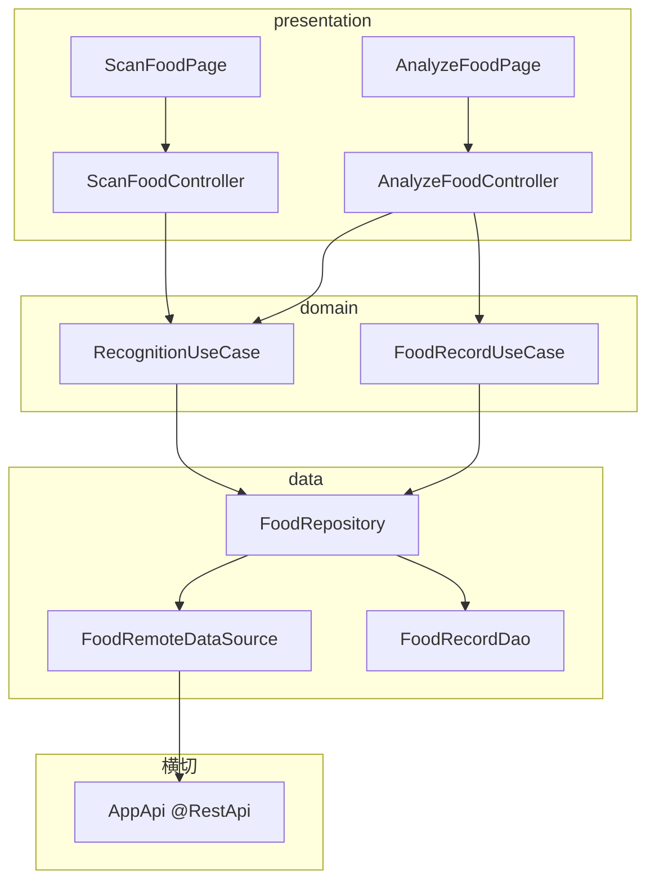
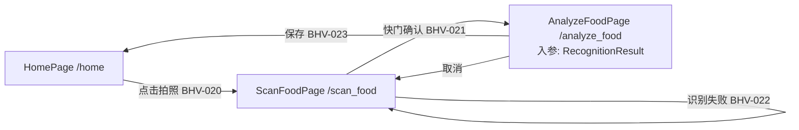
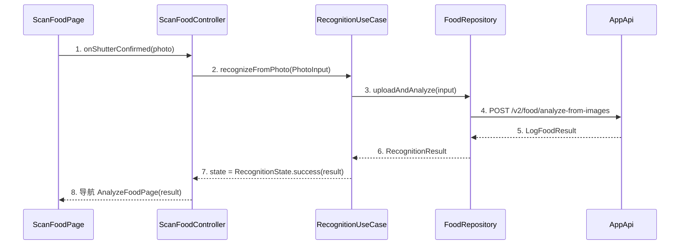

# 概要设计分章写作指南（references）

> 编排层产物：只补充分章写法细则、模板与示例，不替代 L1。规则正文与完成条件一律以
> `.trellis/spec/harness/overview/overview-structure-single-source.md`（L1）为准；冲突时以 L1 为准。

## 0. 写作前准备

- **判轨**：读 task.json `guru_chain`。full → 设计包模式（本指南全部章节）；light → design.md §1（跳过 README/设计包动作，第 5 章按 L1 §2b 简化口径）。
- **技术栈基线**：从 project-conventions 槽位抄录（Flutter 版本、状态管理、DI、网络、存储），写进第 1 章"技术栈约束"；概要不重新决定技术栈。
- **术语统一**：先 `rg` 检索需求与既有设计中的实体名、页面名、BHV/UC 编号，复用既有命名；新术语在第 1 章登记。
- **目录动作（full 链）**：
  ```bash
  mkdir -p docs/design/<feature>/chapters
  touch docs/design/<feature>/README.md docs/design/<feature>/design-main.md
  # task.json 写入 "design_package": "docs/design/<feature>"
  ```

## 1. README 与 design.md 指针写法（full 链）

README 只做导航，不承载事实正文：

```markdown
# <feature> 设计包

| 文档 | 职责 |
|------|------|
| [design-main.md](./design-main.md) | 概要主定义（行为/归属/架构总览/索引） |
| [chapters/](./chapters/) | 详细设计逐章（见 design-main 第 7 节索引） |

追踪：BHV 来源 = ../../.trellis/tasks/<task>/prd.md；追溯矩阵 = trace-matrix.md（机器生成）
```

任务内 design.md 指针模板：

```markdown
# 设计指针（full 链）

主定义：[<feature> 设计包](../../docs/design/<feature>/design-main.md)（task.json design_package）
摘要：<三句话以内：解决什么、核心归属结论、最大风险>
本文件不承载设计正文；修订一律进设计包。
```

## 2. 第 1 章「设计约束与输入」写法

模板：

```markdown
## 1. 设计约束与输入
### 1.1 承接的核心能力
| 能力编号 | P0/P1 | 一句话 | 需求锚点 |
### 1.2 技术栈约束（引用 project-conventions 槽位，不另定取值）
### 1.3 显式假设
| 假设 | 依据 | 影响范围 | 验证时点 |
```

要点：核心能力逐条带需求锚点（prd 章节或正式需求包小节）；没有假设也要写"无"。

## 3. 第 2 章「行为集合」写法

按 L1 §3 四类顺序枚举；每条行为一个 `### BHV-NNN <短名>` 标题 + GWT 正文：

```markdown
### BHV-021 拍照提交识别
Given 相机权限已授予且预览就绪 When 用户点击快门并确认 Then 图片压缩上传，
进入识别中态（recognizing），失败转 BHV-022。涉及状态：RecognitionState；数据：PhotoInput。
```

正反对照（粒度，L1 §3.1）：

- ✅ 上例：前置/触发/后置/状态/失败去向齐全。
- ❌ `### BHV-021 拍照识别`：「用户拍照后系统识别食物」——无前置、无状态、无失败路径，审核记 P1。

常见遗漏自查：每个用户操作行为是否配了对应失败路径行为？页面销毁/后台切换是否影响进行中的行为？

## 4. 第 3 章「归属判定表」写法

表模板（每行一条 BHV，三问写实质内容，不写"同上"）：

```markdown
| BHV | owner | 为什么属于它 | 为什么不属于别人 | 是否需独立存在 |
|-----|-------|------------|----------------|--------------|
| BHV-021 | RecognitionUseCase | 识别是有状态业务流（上传→轮询→结果） | controller 只该转发事件不该拥有重试规则 | 是：被拍照/文字两入口复用 |
```

争议行先加载 `client-grill` 拷问再定稿。状态归属单独列一小节：每个状态字段一行（状态名/写 owner/读取方）。

## 5. 第 4 章「页面流与路由」写法

逐页面列：路由名（与代码 Routes 常量一致）、入参/出参、进入与退出动作、deep link（如有）。失败/取消的导航去向必须显式（如"识别失败停留当前页展示重试，不回退"）。非 UI 需求整章写 `N/A + 依据`。

## 6. 第 5 章「架构总览（人审视图）」写法（六件套，L1 §2.5）

### 6.1 一句话架构

按 L1 固定格式填空，组件名用真实名：

> 用户经 `ScanFoodPage(Routes.scanFood)` 进入，由 `ScanFoodController` 转发拍照事件、`RecognitionUseCase` 承接识别流程，按需访问 `FoodRepository → FoodRemoteDataSource / FoodRecordDao`，经 `RecognitionState` 流收口到 `AnalyzeFoodPage` 展示。

### 6.2 分层架构图模板



自检：图中每个节点都能在第 3 章归属表找到；箭头全部上→下（分层依赖律）；不出现归属表之外的组件。

### 6.3 页面流图模板



边上标注触发 BHV 与关键入参；失败/取消路径必须出现。

### 6.4 核心 UC 表 / 6.5 UC 承接表

列定义见 L1 §2.5 ④⑤，直接用表。UC 从需求验收场景提炼（用户可感知的完整目标），不是 BHV 的重排——一个 UC 通常覆盖 2~5 条 BHV。

### 6.6 时序图策略表与 sequenceDiagram 写法

策略表先行（独立/合并/豁免，列定义 L1 §2.5 ⑥）。sequenceDiagram 编号步骤规范——图中编号与图下详述一一对应：



1. 用户确认快门，页面把照片交给 controller（不做任何业务判断）。
2. controller 调用 usecase 的识别行为，转入 recognizing 态。
3~5. usecase 经 repository → API 完成上传与识别（超时/失败在第 6 步前由 repository 转换为领域错误）。
6~8. 结果回流：usecase 发射成功态，controller 监听后导航结果页。

要求：参与者=真实组件名；箭头方向符合分层律（回包用虚线）；失败分支可另起一图或在合并图中以 alt 块表达。

## 7. 第 6 章「技术决策承接清单」写法

字段合同见 L1 §2.6，直接用表。两条易错点：

- `rationale` 必须从约束/驱动推到选择（"因离线优先约束选 sqflite 本地缓存"），不得反向倒推（"选了 X 所以 X 好"）。
- 涉权限/采集的条目 `compliance_basis` 写最小权限与用途解释（如"相机权限仅识别流程内申请，拒绝后降级为相册选择"），这是概要 Gate G3 的取证点。

## 8. 第 7 章「详细设计承接索引」写法

```markdown
| chapter_target | detail_doc_type | 目标文件 | 承接 owner | 不承接范围 |
|---------------|----------------|---------|-----------|-----------|
| recognition-usecase | usecase | chapters/recognition-usecase.md | RecognitionUseCase | 不决定缓存策略（属 repository） |
| food-repository | repository-datasource | chapters/food-repository.md | FoodRepository/RemoteDataSource | 不决定表结构（属 db-dao） |
```

自检：归属表每个 owner 至少被一条索引覆盖；doc_type 只用九分类；命中 pending L2 的条目在本表或第 8 章写 `L2豁免` 计划（或改走先补 L2）。

## 9. 第 8/9 章写法

- 未决问题：逐条 `问题 / 风险等级(高中低) / 阻塞哪个 G 项 / 建议解法`；高风险项未关闭不得送审（G5）。
- 架构就绪自检（full 链成节）：

```markdown
## 9. 架构就绪自检
| G 项 | 结论 | 证据/缺口 |
|------|------|----------|
| G1 行为覆盖 | 满足 | BHV-020~027 覆盖 P0×2 P1×1（§2） |
| ... | ... | ... |
| G7 时序闭合 | 缺口 | UC-03 仍为计划锚点 → 本轮回填 |
```

## 10. 阶段推进与暂停口径

- 默认连续推进（一次性交付模式）；只有高风险未决项才暂停提问（一次 1~4 个；存在单一明显 P0 时通常 1 个问题即可）。
- 每阶段切换前轻量自检：本阶段产物是否满足对应 L1 合同；明显缺口当场补，不带病推进。
- 全稿完成 → 回填全部时序图占位 → G1~G8 自检 → 提示送审（review skill）与人工 confirm。

## 11. 禁止事项（写作期红线速查）

1. 不从名词/组件出发枚举（先有行为再有组件）。
2. 不写方法签名、字段合同、SDK 参数、DDL、secret value（L1 §5）。
3. 不替用户拍板未决业务规则、不凭空生成 P0/P1。
4. 不让图表与归属表两套口径（图中组件 ⊆ 归属表）。
5. 不在"未选定"技术决策上构建下游设计。
6. 不用概括性结论替代 G 项逐条证据。
7. 不代替用户执行 `guru_gate.py confirm`（无 TTY 会被拒）。
