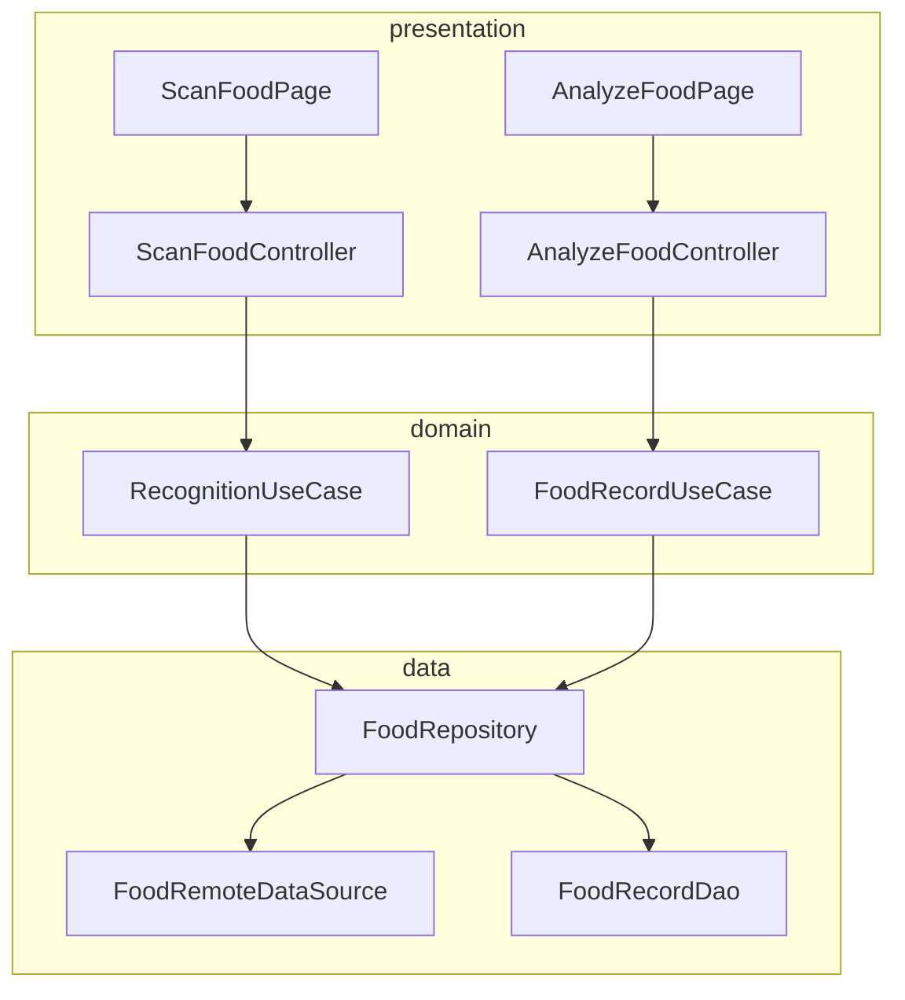
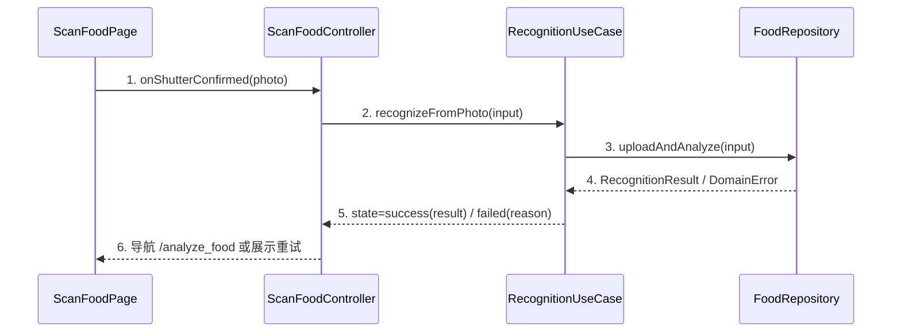

# 示例：食物拍照识别 design-main（缩减样例）

> 本文件是 **成稿形态示例**（取材自 calorie 项目食物识别 feature 的缩减改编），只演示各章形态与粒度，
> 不是规则来源；章节合同以 L1 为准。示例为缩减版：真实成稿的 BHV/UC 数量与表行数通常是本例的 2~4 倍。

## 1. 设计约束与输入

### 1.1 承接的核心能力

| 能力编号 | P0/P1 | 一句话 | 需求锚点 |
|---------|-------|-------|---------|
| CAP-01 | P0 | 拍照识别食物并记录营养 | prd §2 BHV-020~023 |

### 1.2 技术栈约束

按 project-conventions 槽位：GetX + get_it/injectable、Retrofit/Dio、sqflite；不另定取值。

### 1.3 显式假设

| 假设 | 依据 | 影响范围 | 验证时点 |
|------|------|---------|---------|
| 识别接口 P95 < 8s | 后端容量评估口径 | 识别中态超时阈值 | 详细设计前向后端确认 |

## 2. 行为集合

### BHV-020 进入拍照页
Given 已登录且在首页 When 点击拍照入口 Then 申请相机权限并进入 ScanFoodPage；权限拒绝 → 降级相册选择。涉及状态：无新增；数据：无。

### BHV-021 拍照提交识别
Given 相机预览就绪 When 快门确认 Then 图片压缩上传，RecognitionState→recognizing；超时/失败转 BHV-022。状态：RecognitionState；数据：PhotoInput。

### BHV-022 识别失败重试
Given recognizing 中收到失败 When 网络错误/超时 Then RecognitionState→failed(reason)，停留当前页展示重试；点重试回 BHV-021。

### BHV-023 确认保存记录
Given 识别成功并展示结果 When 用户确认 Then 写入本地记录（FoodRecord）并返回首页刷新当日营养。状态：当日营养汇总；数据：FoodRecord。

## 3. 归属判定表

| BHV | owner | 为什么属于它 | 为什么不属于别人 | 是否需独立存在 |
|-----|-------|------------|----------------|--------------|
| BHV-020 | ScanFoodController | 权限申请是页面生命周期内交互编排 | usecase 不该感知权限 UI 降级 | 否：随页面存在 |
| BHV-021/022 | RecognitionUseCase | 识别是有状态业务流（上传→等待→结果/失败） | controller 不该拥有重试与超时规则 | 是：拍照/文字两入口复用 |
| BHV-023 | FoodRecordUseCase | 落库+汇总刷新是业务规则 | repository 只做数据访问不做编排 | 是：多页面复用 |

状态归属：RecognitionState 写 owner = RecognitionUseCase（controller/页面只订阅）。

## 4. 页面流与路由

| 页面 | 路由 | 入参 | 出参/退出 |
|------|------|------|----------|
| ScanFoodPage | /scan_food | — | 成功→/analyze_food(RecognitionResult)；取消→back |
| AnalyzeFoodPage | /analyze_food | RecognitionResult | 保存→/home（携带刷新标记）；取消→back |

## 5. 架构总览（人审视图）

**一句话架构**：用户经 `ScanFoodPage(/scan_food)` 进入，由 `ScanFoodController` 转发拍照事件、`RecognitionUseCase` 承接识别流，按需访问 `FoodRepository → RemoteDataSource/Dao`，经 `RecognitionState` 流收口到 `AnalyzeFoodPage`。



```mermaid
graph LR
    Home[/home] -->|BHV-020| Scan[/scan_food]
    Scan -->|BHV-021| Analyze[/analyze_food]
    Scan -->|BHV-022 失败| Scan
    Analyze -->|BHV-023 保存| Home
```

**核心 UC 表**

| uc_id | uc_title | actor_or_trigger | source_refs | goal | priority |
|-------|---------|------------------|------------|------|----------|
| UC-01 | 拍照记录一餐 | 用户操作 | BHV-020~023 | 当日营养含新记录 | P0 |

**UC 承接表**

| uc_id | page_refs | bhv_refs | owner_refs | index_refs |
|-------|----------|----------|-----------|-----------|
| UC-01 | /scan_food, /analyze_food | BHV-020~023 | ScanFoodController, RecognitionUseCase, FoodRecordUseCase, FoodRepository | recognition-usecase, food-repository, scan-food-page |

**时序图策略表**

| uc_id | strategy | sequence_section | merged_coverage | exemption_reason |
|-------|----------|------------------|----------------|------------------|
| UC-01 | 独立 | §5.1 | — | — |

### 5.1 UC-01 时序图



1. 页面只转发快门事件；2. controller 调用识别行为并订阅状态；3~4. repository 收口网络与错误转换；5~6. 状态流回流驱动导航/重试展示。

## 6. 技术决策承接清单

| decision_id | decision_point | candidates | selected | rationale | detail_expansion_targets | compliance_basis |
|------------|----------------|-----------|----------|-----------|--------------------------|------------------|
| TD-01 | 图片压缩与上传通道 | 复用 gurusdk 上传 / 自建 S3 直传 | 复用 gurusdk | 已有鉴权与重试能力，避免重复造轮 | food-repository（上传合同字段） | 相机权限仅识别流程内申请，拒绝降级相册（最小权限） |

## 7. 详细设计承接索引

| chapter_target | detail_doc_type | 目标文件 | 承接 owner | 不承接范围 |
|---------------|----------------|---------|-----------|-----------|
| recognition-usecase | usecase | chapters/recognition-usecase.md | RecognitionUseCase | 不决定缓存（属 repository） |
| food-repository | repository-datasource | chapters/food-repository.md | FoodRepository/RemoteDataSource | 不决定表结构（属 db-dao） |
| scan-food-page | page-entry | chapters/scan-food-page.md | ScanFoodPage/Controller | 不拥有识别规则 |

L2豁免：page-entry 理由：首发页面结构简单，按 L1 八问展开，l2_status: pending 标注；v1.1 前补齐 L2。

## 8. 未决问题

| 问题 | 风险 | 阻塞 G 项 | 建议 |
|------|------|----------|------|
| 识别超时阈值待后端确认 | 中 | 无（已有显式假设） | 详细设计前确认 |

## 9. 架构就绪自检

| G 项 | 结论 | 证据/缺口 |
|------|------|----------|
| G1 行为覆盖 | 满足 | BHV-020~023 覆盖 CAP-01（§2） |
| G2 归属完整 | 满足 | §3 全行三问，无分层律违例 |
| G3 合规 | 满足 | TD-01 compliance_basis |
| G4 索引覆盖 | 满足 | §7 覆盖全部 owner，逐文件 |
| G5 未决无高风险 | 满足 | §8 仅中风险且有假设 |
| G6 六件套 | 满足 | §5 ①~⑥ 齐全 |
| G7 时序闭合 | 满足 | UC-01 独立图 §5.1，无占位 |
| G8 技术决策 | 满足 | TD-01 字段完整 |
