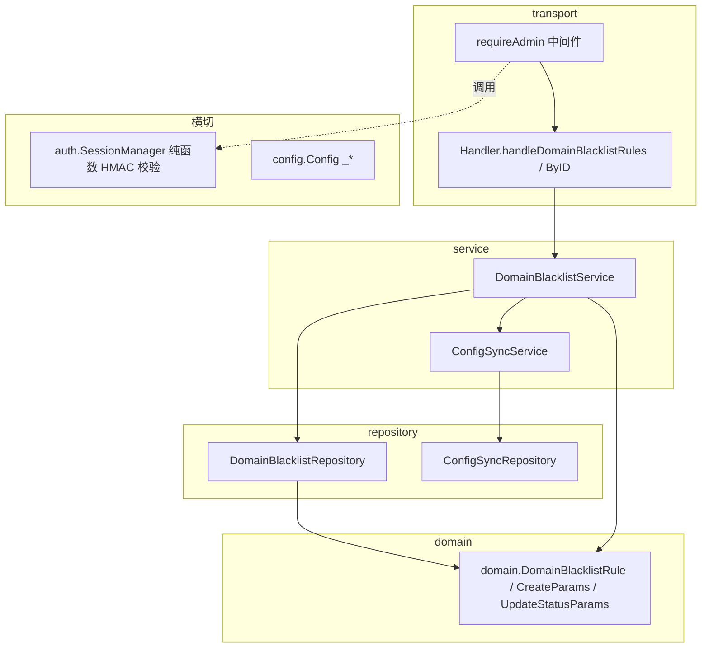
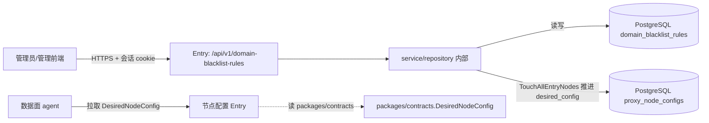
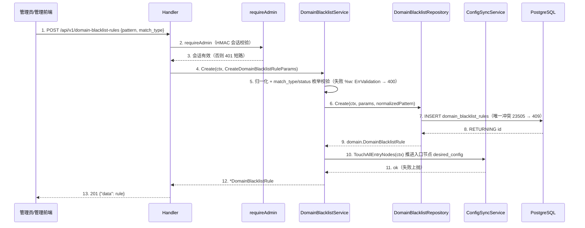

# Go 后端概要设计分章写作指南（references）

> 编排层产物：只补充分章写法细则、模板与示例，不替代 L1。规则正文与完成条件一律以
> `.trellis/spec/harness/overview/overview-structure-single-source.md`（概要 L1）为准；分层依赖律与硬红线以
> `.trellis/spec/guides/golden-path.md` 为准；项目槽位取值以 `.trellis/spec/conventions/project-conventions.md` 为准。
> 冲突时 golden-path 硬红线 > L1 章节合同 > project-conventions 槽位 > 本指南 > SKILL.md。
> 本指南所有锚点（组件名、SQL、env 前缀、目录）取材自一个中性 worked example：某后端服务 `services/<svc>`（net/http + 原生 SQL + PostgreSQL）的「域名黑名单规则」feature，仅示范形态与粒度，非任何具体参考仓库。

## 0. 写作前准备

- **判轨**：读 task.json `guru_chain`。full → 目录级设计包（本指南全部章节，落 `design-main.md` + `chapters/` 空目录 + 任务内 `design.md` 指针）；light → 任务内 `design.md` §1 概要（跳过 README/设计包动作，第 5 章按 L1 §2b 简化：保留一句话架构 + 一张分层架构图 + 核心 UC 表，系统边界图/时序图策略表在无外部依赖/无异步时标 `N/A 依据`，但分层依赖律归属表与承接索引仍必须保留）。
- **技术栈基线（从槽位抄录，不另定）**：从 project-conventions 抄录槽位取值写进第 1 章「技术栈约束」——`[SLOT-01]` DI（当前无 DI，构造注入；可 wire）、`[SLOT-02]` 数据访问（当前 `database/sql` + `lib/pq` + PostgreSQL；可 ent/sqlc）、`[SLOT-03]` 日志（当前 `log`；可 slog/zap）、`[SLOT-04]` 测试（当前 `testing`；可 testify/ginkgo）、`[SLOT-10]` 会话鉴权（当前 HMAC-SHA256 签名 cookie + bcrypt，自实现）、`[SLOT-08]` env 前缀（按服务区分，如 `<SVC>_*`）、`[SLOT-05]` API 风格（当前 REST JSON）。概要不重新决定技术栈，引用裸 `SLOT-NN` token。
- **服务边界确认**：本任务落在哪个 `services/<svc>/`，复用还是新建 `internal/{app,config,transport,service,repository,domain,auth}` 包，跨服务结构是否需进 `packages/contracts/`。
- **术语统一**：先 `rg` 检索 prd 与既有设计中的实体名、`BHV-NNN`/`UC`/`UNIT-<slug>`、服务名、接口名，复用既有命名；新术语在第 1 章登记。
- **目录动作（full 链）**：

  ```bash
  mkdir -p docs/designs/versions/vx.y.z/chapters    # 或 docs/designs/<feature>/chapters（二选一在 design-main 声明依据）
  touch docs/designs/versions/vx.y.z/README.md docs/designs/versions/vx.y.z/design-main.md
  # task.json 写入 "design_package": "docs/designs/versions/vx.y.z"（相对 repo root）
  ```

## 1. README 与 design.md 指针写法（full 链）

README 只做导航，不承载事实正文（L1 §2a：README 不得作为详细设计执行基线的权威定义位置）：

```markdown
# <feature> 设计包

| 文档 | 职责 |
|------|------|
| [design-main.md](./design-main.md) | 概要主定义（行为/归属/架构总览/技术决策承接/索引） |
| [chapters/](./chapters/) | 详细设计逐章（见 design-main 第 8 节承接索引，文件名 `<序号>-<层次名>-<模块名>-design.md`） |

追踪：BHV 来源 = ../../.trellis/tasks/<task>/prd.md
目录策略：版本化（docs/designs/versions/）依据 <迭代频率/多版本并行/审计回溯>
```

任务内 `design.md` 指针模板（full 链；正文一律进设计包，本文件不承载主定义）：

```markdown
# 设计指针（full 链）

主定义：[<feature> 设计包](../../docs/designs/versions/vx.y.z/design-main.md)（task.json design_package）
摘要：<三句话以内：解决什么、核心归属结论（落在哪几层）、最大风险>
本文件不承载设计正文；修订一律进设计包。
```

## 2. 第 1 章「设计约束与输入」写法

模板：

```markdown
## 1. 设计约束与输入
### 1.1 承接的核心能力（逐条引用 P0/P1 编号，带需求锚点）
| 能力编号 | P0/P1 | 一句话 | 需求锚点 |
### 1.2 技术栈约束（golden-path 锁定项 + project-conventions 槽位取值，不另定取值）
- 框架：net/http ServeMux（golden-path 锁定，禁 gin/echo）
- 分层依赖律：transport → service → repository → domain 单向无环
- 错误三件套：service sentinel（ErrValidation）+ repository sentinel（ErrNotFound）+ `%w` 包装 + `errors.Is`
- 数据访问 [SLOT-02]：database/sql + lib/pq + PostgreSQL（原生 SQL）
- 会话鉴权 [SLOT-10]：HMAC-SHA256 签名 cookie + bcrypt
- env 前缀 [SLOT-08]：<SVC>_*（按服务区分）
### 1.3 显式假设（无则写"无"）
| 假设 | 依据 | 影响范围 | 验证时点 |
### 1.4 向后兼容性决策（L1 §2.7，默认 no，须用户显式确认）
| backward_compatibility_required | confirmation_ref | compatibility_scope | internal_contract_policy |
```

要点：核心能力逐条带需求锚点（prd 章节或 BHV 编号）；没有假设也写"无"；向后兼容默认 `no`，仅当 `<svc>` 对外暴露公开 API/SDK 给旧第三方或需兼容旧版客户端时才 `yes`，且必须有用户确认锚点。内部 service/repository/domain、`packages/contracts` 跨服务契约默认只描述当前正确契约，不保留历史版本字段。

## 3. 第 2 章「行为集合」写法

按 L1 §3 行为枚举顺序的 Go 四类组织（**协议端点 → 编排步骤 → 数据访问 → 失败收口**；运行/生命周期行为按需补）。每条行为一个 `### BHV-NNN <短名>` 标题 + GWT 正文，标注涉及的 domain 实体与持久化状态：

```markdown
### BHV-040 新增域名黑名单规则
Given 管理员会话有效（requireAdmin 通过） When `POST /api/v1/domain-blacklist-rules` 携带 `pattern`/`match_type`/`status`/`notes`
Then service 归一化 pattern → 校验 match_type/status 枚举（失败 `%w: ErrValidation`）→ 计算 normalized_pattern →
repository 在 `domain_blacklist_rules` 插入一行（唯一冲突 23505 → 409）→ 触发 ConfigSync.TouchAllEntryNodes 同步入口节点 → 返回 201 + domain.DomainBlacklistRule。
涉及实体：DomainBlacklistRule；持久化状态：domain_blacklist_rules 行新增 + 入口节点 desired_config 版本推进。
```

四类枚举锚点（取自 domain_blacklist 示例链路）：

- **协议端点**：`### BHV-040 新增域名黑名单规则`（POST）、`### BHV-041 列出域名黑名单规则`（GET）、`### BHV-042 更新规则状态`（PATCH）、`### BHV-043 删除规则`（DELETE）——每条带 method+path、入参、鉴权门禁。
- **编排步骤**：归一化/校验/枚举判定（service 内 `normalizeDomainBlacklistPattern` + match_type/status switch）；副作用编排（`TouchAllEntryNodes` 同步入口节点）。
- **数据访问**：repository 的 List / ListActive / Create / UpdateStatus / Delete；唯一约束 `(normalized_pattern, match_type)`。
- **失败收口**：校验失败 `ErrValidation`→400；记录不存在 `ErrNotFound`→404；唯一冲突 23505→409；其余→500。

正反对照（粒度，L1 §3.1）：

- ✅ 上例 BHV-040：前置（会话有效）/触发（method+path+入参）/后置（状态变化 + 同步副作用）/失败去向（枚举校验、唯一冲突）齐全，详细设计可直接展开为 service 方法合同。
- ❌ `### BHV-040 处理黑名单`：「管理员管理黑名单」——无前置、无协议、无状态变化、无失败路径，审核记 P1（粗粒度）。

常见遗漏自查：每个写操作行为是否配了校验失败与唯一冲突失败路径？删除/状态变更是否触发了 ConfigSync 同步（否则入口节点配置漂移）？入口行为（transport）能否追踪到至少一个业务行为（service）——禁止"入口即业务终点"。

## 4. 第 3 章「归属判定表」写法（核心产物）

每行一条 BHV，owner 只取 transport/service/repository/domain 四层；横切（config/external/runtime）作为一等合同单独承接，不混入四层。三问写实质内容，不写"同上"：

```markdown
| BHV | owner | 为什么属于它 | 为什么不属于别人 | 为什么需独立存在 |
|-----|-------|------------|----------------|----------------|
| BHV-040 | DomainBlacklistService | 归一化+枚举校验+副作用编排是业务规则与状态语义 owner，持有 ErrValidation | transport 只做协议归一不拥有校验；repository 只落库不做编排 | 是：被 POST/PATCH/DELETE 三入口复用，且 TouchAllEntryNodes 编排必须集中一处 |
| BHV-041 | DomainBlacklistRepository | List/ListActive 是纯数据访问，唯一接触 domain_blacklist_rules 表 | service 不写 SQL；transport 不直连 repository | 是：跨 service（配置同步消费 ListActive）复用 |
| BHV-040~043 入口 | UsersHandler/Handler.handleDomainBlacklistRules | 协议解析、JSON 解码、requireAdmin 接入、错误→状态码映射 | service 不感知 http.Request/ResponseWriter | 否：随 *Handler 集中注册，不独立成组件 |
```

要点（grounded 于 golden-path §2.1/§4）：

- 一个业务状态只能有一个写 owner（`domain_blacklist_rules` 写 owner = DomainBlacklistService 编排 + DomainBlacklistRepository 落库；其他层只读/调用）。同一状态出现在两个 service 合同里 = P1，回退重判。
- 分层依赖律自检：箭头只能 `transport → service → repository → domain`；`service` 不 import `net/http`，`repository` 不 import `service`，`domain` 不 import 任何 internal 包。把 SQL 访问归给 service、把校验归给 transport、让 repository 反向依赖 service 即归属错误，先回退重判。
- 外部触发边界：外部调用方/前端只能进入 transport handler（HTTP 入口）或后台触发入口，不能直连 service/repository/domain/Utility。
- **Utility 不是层、不是依赖对象**：业务无关纯函数技术能力（HMAC-SHA256 签名计算、bcrypt 哈希、token 编解码、normalize 字符串）是纯函数集合，概要只标「纯函数技术能力 + 调用方使用锚点」，不写成 owner 行为、不进 service/transport 的运行时依赖边、不作为 DI/wire 目标。业务判定（"该规则状态是否合法"）留 service，纯算法调 Utility。
- 状态归属单独列一小节：每个持久化状态一行（状态名 / 写 owner / 读取方），如 `domain_blacklist_rules` 行：写 owner = DomainBlacklistService；读取方 = DomainBlacklistService.List/ListActive、ConfigSyncService（消费 ListActive 生成入口节点配置）。
- 单行为候选默认可疑：若某候选只有一个行为却被提为独立 service/repository/Utility，必须给出独立边界证据（外部协议、独立事务边界、跨 service 复用、不独立会让父行为黑盒）；否则回收为父行为的内部步骤。
- 按 SKILL.md「自底向上」收敛边界叙述：先定 domain（实体/Params 边界）→ repository（数据访问合同边界）→ service（业务编排与状态写 owner）→ transport（协议入口与外部边界）→ 横切（config/external/runtime 一等合同）。

第 3 章续——**关键取舍与 ADR**（阶段 4）：命中技术选择（DB 引擎/驱动、会话鉴权方案、是否引入游标分页、外部 provider）先在此形成 ADR/关键取舍（备选、选定、原因、主要代价），再为第 5 章 `technology_decision_handoff[]` 埋锚点。能力泛化判定证据（Utility 抽取理由、`packages/contracts` 归属）可放在此处或第 4 章责任抽象或第 8 章索引职责边界中。

## 5. 第 4 章「入口与路由承接」写法

逐路由列：method+path（与 router.go `Routes()` 注册一致）→ handler 方法 → 下游 service 行为，标注鉴权门禁与非 HTTP 入口的 `entry_kind`：

```markdown
| method+path | handler 方法 | 下游 service 行为 | 鉴权门禁 | entry_kind |
|-------------|-------------|------------------|---------|-----------|
| GET/POST /api/v1/domain-blacklist-rules | handleDomainBlacklistRules | DomainBlacklistService.List / Create | requireAdmin | API Endpoint |
| PATCH/DELETE /api/v1/domain-blacklist-rules/ | handleDomainBlacklistRuleByID | DomainBlacklistService.UpdateStatus / Delete | requireAdmin | API Endpoint |
```

要点：集合用裸路径 `"/api/v1/domain-blacklist-rules"`，带 ID/子路径用尾斜杠前缀 `"/api/v1/domain-blacklist-rules/"`（ServeMux 前缀匹配律）；受保护路由包 `h.requireAdmin(...)`（HMAC-SHA256 签名 cookie 校验，由 `SessionManager.ParseCookie` 解）。后台 worker / 定时任务 / 消息消费显式标注 `entry_kind`（Message Consumer / Scheduled Job / Background Worker，均归 entry-api 后台触发子类）；纯库/纯计算服务整章写 `N/A + 依据`。失败/拒绝去向必须显式（如 parseIDParam 解析失败 → 404 不 500）。

## 6. 第 5 章「架构总览（人审视图）」写法（六件套，L1 §2.5）

### 6.1 一句话架构

按 L1 固定格式填空，组件名用真实名：

> 外部调用方经 `POST/GET/PATCH/DELETE /api/v1/domain-blacklist-rules` 进入 `<svc>`，由 `Handler.handleDomainBlacklistRules` / `handleDomainBlacklistRuleByID` 归一化请求并经 `requireAdmin`（HMAC 会话）门禁后分发给 `DomainBlacklistService` 的校验/编排行为，按需经 `DomainBlacklistRepository` 访问 PostgreSQL `domain_blacklist_rules` 表，写操作经 `ConfigSyncService.TouchAllEntryNodes` 推进入口节点 desired_config，以 `domain.DomainBlacklistRule` 结构与 `ErrValidation`/`ErrNotFound` 语义收口为 HTTP 响应。

### 6.2 分层架构图模板（subgraph 表达 Go 分层）



自检：图中每个节点都能在第 3 章归属表找到；箭头全部符合分层依赖律（transport→service→repository→domain，单向无环）；domain 被依赖不依赖任何上层；config/auth 横切被依赖不依赖业务；不出现归属表之外的组件，也不出现违反单向律的箭头（如 `repository → service`）。SessionManager 是 Utility 纯函数，用虚线「调用」表达，不作为 transport 的运行时依赖边。

### 6.3 系统边界图模板（与分层图是两个不同产物，不得互替）



要点：外部系统（管理前端、数据面 agent）画在边界外，不画成 `<svc>` 内部组件；数据/权限出入边界标方向与用途（请求进入、会话门禁、状态写入 DB、跨服务契约消费）。其协议/鉴权/SLA 需详细展开时承接到 `external`，跨服务契约结构承接到 `external` 或 `domain`（`packages/contracts`）。

### 6.4 核心 UC 表 / 6.5 UC 承接表

列定义见 L1 §2.5 ④⑤，直接用表。UC 从需求验收场景提炼（外部调用方可观测的完整目标），不是 BHV 的重排——一个 UC 通常覆盖 2~5 条 BHV。`bhv_refs` 必须存在于 prd；`owner_refs` 取归属表 owner；`index_refs` 指向第 8 节承接索引 `chapter_target`。

### 6.6 时序图策略表与 sequenceDiagram 写法

策略表先行（独立/合并/豁免，列定义 L1 §2.5 ⑥）。sequenceDiagram 参与者用真实组件名，箭头方向符合分层律（回包用虚线），步骤编号与图下详述一一对应：



1~3. 入口归一化与会话门禁（外部调用方只进入 Entry，不直连 service）；4~5. service 持有校验与归一化业务规则；6~9. repository 收口 SQL 与唯一冲突→哨兵；10~11. 跨 service 单向编排副作用，失败上抛；12~13. 结果回流转 HTTP 201。失败分支（ErrValidation/唯一冲突）在第 5、7 步标注，或另起 alt 块。

时序图回填硬约束（L1 §2.5）：送审概要 Gate 前非豁免 UC 必须有可定位的真实 `sequenceDiagram`，外部调用方只能进入显式 Entry，不得直连 service/repository/外部依赖；占位锚点残留不得宣称可送审。

## 7. 第 6 章「技术决策承接清单」写法

字段合同见 L1 §2.6（逐条 `decision_id / trigger_source / decision_point / candidates / selected / selection_status / rationale / selected_stack_boundary / runtime_component_boundary / contract_boundary / resilience_boundary / credential_strategy_boundary / detail_expansion_targets / compliance_basis`）。易错点：

- `rationale` 必须从约束/驱动推到选择（"因跨服务消费 ListActive 需稳定 JSON 契约，选 packages/contracts 承接"），不得反向倒推（"选了 X 所以 X 好"）；必含备选、选定、原因、主要代价/限制。
- `selection_status` 最终概要不得停留在 `needs_validation`；只能 `accepted` 或 `explicit_assumption`。未选定项显式标 `selected=未选定`，禁止让下游引用未选定决策。
- 命中外部 provider/LLM/对象存储/云服务时 `credential_strategy_boundary` 必填：**不保存任何 secret value**，只写 `api_key_env_name`（如 `<SVC>_*`）/`credential_ref`/默认凭证链/运行平台身份注入短期凭证（AWS 优先 SDK default chain/IRSA/instance role，阿里云优先 Credentials default provider chain/RRSA/ECS RAM Role）。`config.Load()` 默认值不得是真实凭证。出现真实 key/AK/SK/token 即审核 P1。
- 涉鉴权/数据采集/三方域名/PII 时 `compliance_basis` 写最小权限与用途可解释依据（如"会话 cookie 仅管理员域内签发，HMAC 密钥经 `<SVC>_SESSION_SECRET` 注入，非真实值"）；否则写 N/A。
- 查询分页先判定普通分页还是连续消费语义，普通分页不触发游标决策。

## 8. 第 7 章「详细设计承接索引」写法

覆盖归属表全部 owner + 全部横切一等合同；full 链每条附 `chapters/<slug>.md` 目标文件名；`detail_doc_type` 只用七分类（见 SKILL.md 七类表 / L1 §6.1）：

```markdown
| chapter_target | detail_doc_type | 目标文件 | 承接 owner | 不承接范围 | l2_status |
|---------------|----------------|---------|-----------|-----------|-----------|
| domain-blacklist-service | biz | chapters/03-service-domain-blacklist-design.md | DomainBlacklistService | 不决定表结构（属 repository-data）；不写 HTTP 状态码（属 entry-api） | 已出 L2 |
| domain-blacklist-repository | repository-data | chapters/04-repository-domain-blacklist-design.md | DomainBlacklistRepository + domain_blacklist_rules 迁移 | 不决定校验规则（属 biz） | 已出 L2 |
| domain-blacklist-handler | entry-api | chapters/02-transport-domain-blacklist-design.md | Handler.handleDomainBlacklistRules/ByID | 不拥有业务规则（属 biz） | 已出 L2 |
| domain-blacklist-rule | domain | chapters/01-domain-domain-blacklist-design.md | domain.DomainBlacklistRule/CreateParams/UpdateStatusParams | 无 I/O、无校验、无副作用 | pending（L2豁免） |
| <svc>-config | config | chapters/05-config-<svc>-design.md | config.Config（<SVC>_* + SessionSecret 引用） | 不写真实 secret value | pending（L2豁免） |
| session-auth | external | chapters/06-external-session-auth-design.md | auth.SessionManager（HMAC 签名 cookie）+ packages/contracts | 不写真实 HMAC 密钥 | pending（L2豁免） |
| <svc>-runtime | runtime | chapters/07-runtime-<svc>-design.md | app.New/Run/Shutdown + 连接池 + 信号 | 不写部署脚本/运维命令 | pending（L2豁免） |
```

自检（L1 §6.1 / G4）：

- 归属表每个 owner 至少被一条索引覆盖；`detail_doc_type` 只用七分类（`entry-api`/`biz`/`repository-data`/`domain`/`config`/`external`/`runtime`），**不得串入他平台类型名**（如 flutter 的 usecase/page-entry/repository-datasource）。
- 存在业务数据库持久化时必含至少一条 `repository-data`（无持久化时显式声明并标 n/a）。
- 命中 pending L2 的类型（`domain`/`config`/`external`/`runtime`）必须在本表或第 8 章写 `L2豁免：<doc_type> 理由：…`（说明按 L1 合同八问展开的风险与补齐计划），或改走先补 L2 路径——否则详细 Gate 拦截。
- `technology_decision_handoff[].detail_expansion_targets` 必须能回指本节 `detail_doc_type + chapter_target`。
- chapters 文件名遵守详细 L1 §1 命名 `<序号>-<层次名>-<模块名>-design.md`；`chapter_target` 是 slug，与文件名一一对应（gate 检查双向闭合）。

七类 doc_type 分章承接要点（写作期对照）：

- `entry-api`：承接 `internal/transport/http` handler 入口——协议边界、参数归一（`decodeJSON` `DisallowUnknownFields`）、`requireAdmin` 门禁接入、context/timeout 透传、下游 service 分发、入口错误→HTTP 状态码（`handleMutationError`：ErrValidation→400/ErrNotFound→404/唯一冲突→409）。不承接业务规则。CLI/定时/消息消费按 `entry_kind` 子类共用薄入口骨架。
- `biz`：承接 `internal/service` 业务核心与状态/能力 owner——`<Domain>Service` 核心行为、sentinel error（ErrValidation）、跨实体/跨 service 协作（TouchAllEntryNodes）、终态收口、内部能力组件 `IC-*`。**核心能力正文主承接方**，每个 P0/P1 owner 行为必落 biz chapter_target（L1 §6.2）。
- `repository-data`：承接 `internal/repository` 数据访问合同 + `db/migrations` canonical 表/迁移（合并为一类）——Repo 读写/事务/查询意图、表结构、索引、迁移合同、`sql.ErrNoRows`→`ErrNotFound` 转换、domain 字段语义来源。存在业务持久化时必含至少一条。
- `domain`（pending L2）：承接 `internal/domain` 实体/值对象/Params/sentinel/不变量（唯一允许跨层导入），及落在被调用包内的业务无关纯函数技术能力；无 I/O、无副作用。
- `config`（pending L2）：承接 `internal/config` + `config.Load`、env 前缀（`<SVC>_*`）、默认值、credential 引用策略、超时/重试 profile、校验与失败行为；不写真实 secret。
- `external`（pending L2）：承接外部系统/三方 API/对象存储/模型服务/Webhook 集成合同（协议、鉴权、请求/响应/错误、SLA/限流、超时重试、出站 adapter），及跨服务 `packages/contracts` 对外契约；会话鉴权算法（HMAC-SHA256/bcrypt）封装的出站合同亦在此。
- `runtime`（pending L2）：承接进程拓扑 + `app.New/Run/Shutdown`（`cmd/<svc>/main.go` 启动顺序、信号关闭、context 超时、健康检查、连接池/资源边界、发布/回滚）；不写部署脚本与运维命令。

另需在 `design-main.md` 权威承载详细设计执行基线五字段（L1 §6.3）：`stack_profile_ref`（内置 `builtin:detail-stack/go-wire-go-guru`）/ `project_profile_ref`（内置 `builtin:detail-project/go-guru`）/ `profile_selection_basis` / `profile_assumption_status`（`user_confirmed`/`explicit_assumption`/`existing_project_evidence`）/ `detail_stage_impact`。引用必须稳定可解析，不写本机绝对路径/Skill 安装路径。

## 9. 核心能力到架构承接矩阵 `Capability-to-Architecture Mapping`（L1 §6.2，强制）

作为第 3 与第 4 章之间子节，逐 P0/P1 能力承接到架构响应。最小字段见 L1 §6.2（`capability_id / capability_priority / difficulty_focus / complexity_source / design_focus / design_expansion_requirement / architecture_response / scenario_refs / owner_units(UNIT-*) / owner_behaviors(BHV-*) / internal_component_refs / quality_semantics / fallback_semantics / observability_semantics / technology_decision_refs / detail_owner_plan / detail_index_refs`）。`difficulty_focus`/`complexity_source`/`design_focus`/`design_expansion_requirement`/`architecture_response` 不得为空或只写"见需求"。每个 `owner_behaviors` 必须落到 `detail_doc_type=biz`（service `UNIT-*`）的 chapter_target。P2 不进矩阵主行，记 `p2_ordinary_behavior_trace[]`（含至少一个 biz detail_index_refs，owner 不得落到非 biz 类型）。进入架构就绪收敛前派生 `detail_wx6_readiness`（`pass:established_complete` / `pass:not_applicable_by_no_p0_p1` / `fail:*`），任何 `fail:*` 不得输出"可进入详细设计"。

## 10. 第 8/9 章写法

- **未决问题**（第 8 章）：逐条 `问题 / 风险等级(高中低) / 阻塞哪个 G 项 / 建议解法`；高风险项未关闭不得送审（G5）；无未决也须显式声明"无未决"。
- **架构就绪自检**（第 9 章，full 链成节，对照 L1 §6 G1~G9）：

```markdown
## 9. 架构就绪自检
| G 项 | 结论 | 证据/缺口 |
|------|------|----------|
| G1 行为覆盖 | 满足 | BHV-040~043 覆盖 P0×1（§2），粒度自检通过 |
| G2 归属完整 | 满足 | §3 全行三问，无分层律违例，无 gin/echo |
| G3 凭证合规 | 满足 | 会话 HMAC 经 <SVC>_SESSION_SECRET 注入，无 secret value |
| G4 索引覆盖 | 满足 | §7 覆盖 4 层 owner + config/external/runtime，逐文件，含 repository-data |
| G5 未决无高风险 | 满足 | §8 仅中风险且有显式假设；执行基线五字段齐全 |
| G6 六件套 | 满足 | §5 ①~⑥ 齐全，图组件 ⊆ 归属表 |
| G7 时序闭合 | 满足 | UC 独立图 §5.6，无占位 |
| G8 技术决策 | 满足 | TECH-* 字段完整，selection_status=accepted |
| G9 能力承接闭环 | 满足 | 每个 P0 经 Mapping 回指 owner_behaviors → biz chapter_target；detail_wx6_readiness=pass:established_complete |
```

存在未闭合 G 项不得送审；不得用概括性"基本满足"替代逐项证据。

## 11. 阶段推进与暂停口径

- 默认连续推进（一次性交付模式）；只有高风险未决项才暂停提问（一次 1~4 个；存在单一明显 P0 缺口时通常 1 个问题即可）。
- 每阶段切换前轻量自检：本阶段产物是否满足对应 L1 合同；明显缺口当场补，不带病推进。
- 全稿完成 → 回填全部时序图占位 → G1~G9 自检 → 提示送审：加载 `go-design-overview-review` 过概要 Gate；由 review worker 用 `record-review overview` 记录当前 digest 的 clean/findings 证据，区别于 `trellis-check` 代码质检。

## 12. 禁止事项（写作期红线速查）

1. 不从名词/组件出发枚举（先有行为再有组件）；不发明 `Manager`/`Helper`/`Util`/`Engine`/`Processor` 等无行为来源结构（名词先行反模式）。
2. 不写概要禁写项（L1 §5）：Go 方法签名、domain 字段级 struct 全集、sentinel error 全集与文案、原生 SQL/DDL/索引、`config.Load()` env 前缀与默认值取值、SDK 初始化/调用参数、连接池/超时数值、HTTP 状态码映射表正文、cookie 属性、secret value。这些交详细设计，概要只写"由哪个 `chapters/<slug>.md` 承接"。
3. 不违反分层依赖律：箭头反向（repository→service）、业务规则下沉 transport、SQL 上浮 service、domain import 上层、跨服务 import `internal/`、引入 gin/echo 即 P1。
4. 不让外部调用方/前端直连 service/repository/domain/Utility/external（只能进 transport 或后台触发 Entry）。
5. 不把 Utility 写成 owner 行为/运行时依赖边/DI 装配目标（纯函数技术能力只标调用锚点）。
6. 不替用户拍板未决业务规则、不凭空生成 P0/P1；不在"未选定/needs_validation"技术决策上构建下游设计。
7. 不让图表与归属表两套口径（图中组件 ⊆ 归属表）。
8. 不用概括性结论替代 G 项逐条证据；存在未闭合 G 项或时序占位残留不得宣称可送审。
9. `detail_doc_type` 只用 Go 七分类，不得串入他平台类型名。
