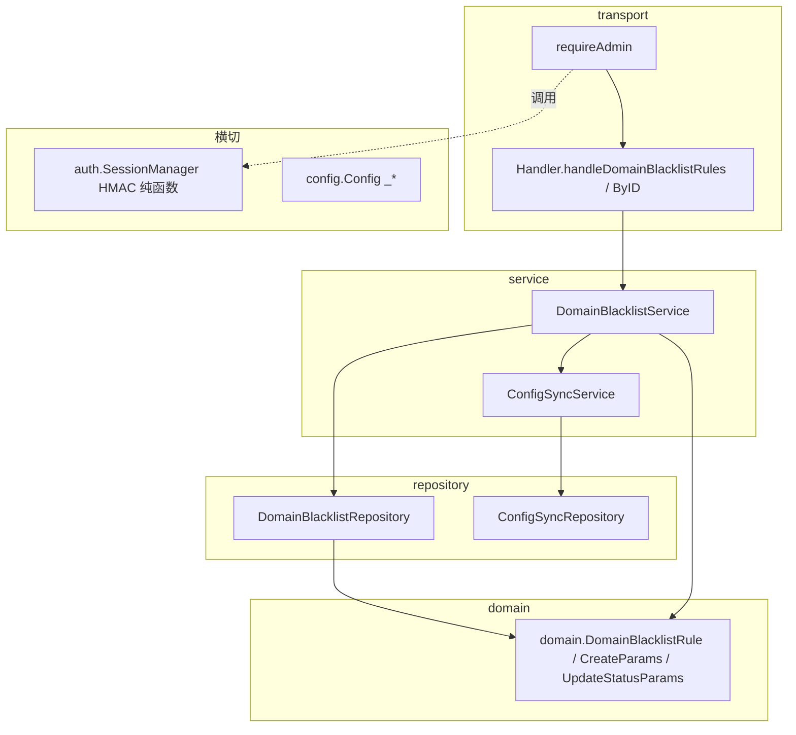
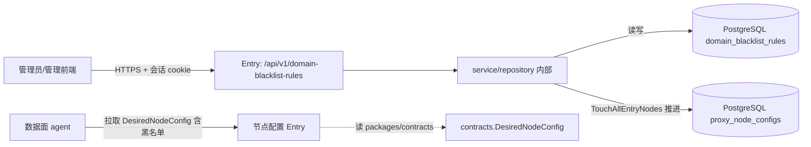
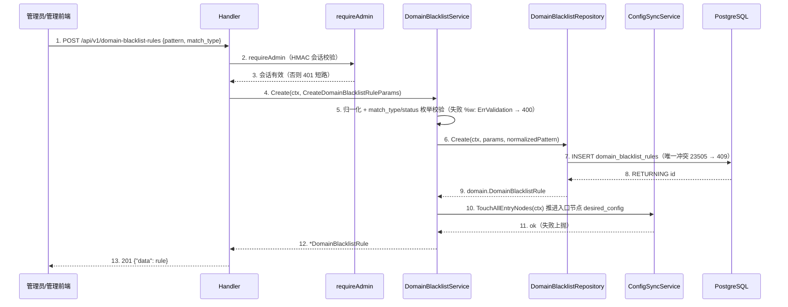

# 示例：域名黑名单规则管理 design-main（缩减样例）

> 本文件是 **成稿形态示例**（一个中性 worked example：某后端服务 `services/<svc>` 的域名黑名单规则 feature），只演示各章形态与粒度，
> 不是规则来源，也不绑定任何具体参考仓库；章节合同以概要 L1 为准。示例为缩减版：真实成稿的 BHV/UC 数量与表行数通常是本例的 2~4 倍。
>
> 文件骨架（本例组件名/SQL/env 前缀在目标仓库落到对应相对路径，按代码现状核对）：
> - 实体：`internal/domain/domain_blacklist_rule.go`
> - 数据访问：`internal/repository/domain_blacklist_repository.go`
> - 业务编排：`internal/service/domain_blacklist_service.go`
> - 跨域同步：`internal/service/config_sync_service.go`（`TouchAllEntryNodes`）
> - 入口路由：`internal/transport/http/router.go`（`handleDomainBlacklistRules` / `handleDomainBlacklistRuleByID`，`requireAdmin`）
> - 表/迁移：`db/migrations/<nnnn>_domain_blacklist_rules.up.sql`
> - 配置：`internal/config/config.go`（`<SVC>_*`）
> - 会话鉴权：`internal/auth/session_manager.go`（HMAC 签名 cookie）

链型：full ｜ 概要主定义位置：`docs/designs/versions/v1.0.0/design-main.md` ｜ 服务边界：`services/<svc>/`（复用既有 `internal/{app,config,transport,service,repository,domain,auth}` 包，无新建）

**详细设计执行基线（L1 §6.3）**：`stack_profile_ref=builtin:detail-stack/go-wire-go-guru` ｜ `project_profile_ref=builtin:detail-project/go-guru` ｜ `profile_selection_basis=既有实现证据（目标仓库当前 net/http + database/sql + lib/pq）` ｜ `profile_assumption_status=existing_project_evidence` ｜ `detail_stage_impact=新增 DomainBlacklistRepository SQL 列清单/scanDomainBlacklistRule/domain struct 三处同步`

## 1. 设计约束与输入

### 1.1 承接的核心能力

| 能力编号 | P0/P1 | 一句话 | 需求锚点 |
|---------|-------|-------|---------|
| CAP-01 | P0 | 管理员维护域名黑名单规则并自动同步到入口节点 | prd §3 BHV-040~043 |

### 1.2 技术栈约束（golden-path 锁定 + project-conventions 槽位，不另定取值）

- 框架：net/http ServeMux（golden-path 锁定，禁 gin/echo）；分层依赖律 transport→service→repository→domain 单向无环。
- 错误三件套：service sentinel `ErrValidation` + repository sentinel `ErrNotFound` + `%w` 包装 + `errors.Is`。
- 数据访问 `[SLOT-02]`：`database/sql` + `lib/pq` + PostgreSQL（原生 SQL）。
- 会话鉴权 `[SLOT-10]`：HMAC-SHA256 签名 cookie + bcrypt（自实现，`requireAdmin` 门禁）。
- env 前缀 `[SLOT-08]`：`<SVC>_*`（按服务区分）。API 风格 `[SLOT-05]`：REST JSON。DI `[SLOT-01]`：无 DI 框架，`app.New` 构造注入。

### 1.3 显式假设

| 假设 | 依据 | 影响范围 | 验证时点 |
|------|------|---------|---------|
| 黑名单规则总量在万级以内，列表无需分页 | 现有管理前端一次性加载用法 | List 不引入游标决策 | 详细设计前向需求方确认 |

### 1.4 向后兼容性决策（L1 §2.7）

| backward_compatibility_required | confirmation_ref | compatibility_scope | internal_contract_policy |
|--------------------------------|------------------|---------------------|--------------------------|
| no | 本任务为内部 admin API，无对外旧第三方使用方 | N/A | 只描述当前正确契约，不保留历史版本字段 |

## 2. 行为集合

### BHV-040 新增域名黑名单规则
Given 管理员会话有效（`requireAdmin` 通过） When `POST /api/v1/domain-blacklist-rules` 携带 `pattern`/`match_type`/`status`/`notes`
Then service 归一化 pattern、补默认值并校验 `match_type`∈{domain_suffix,contains}、`status`∈{active,disabled}（失败 `%w: ErrValidation`→400）→ 计算 normalized_pattern → repository 在 `domain_blacklist_rules` 插入一行（唯一 `(normalized_pattern, match_type)` 冲突 23505→409）→ 触发 `ConfigSync.TouchAllEntryNodes` 推进入口节点配置 → 返回 201 + `domain.DomainBlacklistRule`。
实体：DomainBlacklistRule；状态：`domain_blacklist_rules` 行新增 + 入口节点 desired_config 版本推进。

### BHV-041 列出域名黑名单规则
Given 管理员会话有效 When `GET /api/v1/domain-blacklist-rules` Then repository `List` 按 `id DESC` 返回全部规则 → 200 + 数组。
实体：DomainBlacklistRule；状态：无变化（只读）。

### BHV-042 更新规则状态
Given 规则存在且会话有效 When `PATCH /api/v1/domain-blacklist-rules/{id}` 携带 `status`
Then service 校验 id>0 与 `status` 枚举（失败 `ErrValidation`→400）→ repository `UpdateStatus`（0 行受影响→`ErrNotFound`→404）→ `TouchAllEntryNodes` 同步 → 200 + 更新后规则。
状态：`domain_blacklist_rules.status` 变更 + 入口节点配置推进。

### BHV-043 删除规则
Given 规则存在且会话有效 When `DELETE /api/v1/domain-blacklist-rules/{id}`
Then service 校验 id>0 → repository `Delete`（0 行→`ErrNotFound`→404）→ `TouchAllEntryNodes` 同步 → 200 `{deleted:true}`。
状态：`domain_blacklist_rules` 行删除 + 入口节点配置推进。

## 3. 归属判定表

| BHV | owner | 为什么属于它 | 为什么不属于别人 | 为什么需独立存在 |
|-----|-------|------------|----------------|----------------|
| BHV-040/042/043 | DomainBlacklistService | 归一化+枚举校验+`TouchAllEntryNodes` 副作用编排是业务规则与状态语义 owner，持有 `ErrValidation` | transport 只做协议归一不拥有校验；repository 只落库不做编排 | 是：三个写入口复用同一校验与同步编排 |
| BHV-041 | DomainBlacklistRepository | List 是纯数据访问，唯一接触 `domain_blacklist_rules` 表 | service 不写 SQL；transport 不直连 repository | 是：ListActive 被 ConfigSyncService 跨 service 复用 |
| BHV-040~043 入口 | Handler.handleDomainBlacklistRules / ByID | 协议解析、`decodeJSON`、`requireAdmin` 接入、错误→状态码（`handleMutationError`） | service 不感知 `http.Request`/`ResponseWriter` | 否：随唯一 `*Handler` 集中 `Routes()` 注册 |

**状态归属**：`domain_blacklist_rules` 行——写 owner = DomainBlacklistService（编排）+ DomainBlacklistRepository（落库）；读取方 = DomainBlacklistService.List/ListActive、ConfigSyncService（消费 ListActive 生成入口节点配置）。一状态一写 owner，无并行写。

**分层依赖律自检**：箭头全部 transport→service→repository→domain；`DomainBlacklistService→ConfigSyncService` 为 service→service 单向依赖（构造注入，无环）；`SessionManager`（HMAC 校验）为 Utility 纯函数，`requireAdmin` 调用但不进运行时依赖边、不作 DI 目标；无 gin/echo，无反向 import。

## 3a. 核心能力到架构承接矩阵（Capability-to-Architecture Mapping，缩减）

| capability_id | priority | architecture_response | owner_units | owner_behaviors | technology_decision_refs | detail_index_refs |
|---------------|----------|----------------------|-------------|-----------------|--------------------------|-------------------|
| CAP-01 | P0 | 管理员经 requireAdmin 入口 CRUD 规则，service 校验+编排，repository 落库，写操作经 ConfigSync 推进入口节点 desired_config | UNIT-domain-blacklist-service | BHV-040, BHV-042, BHV-043 | TECH-01 | domain-blacklist-service(biz), domain-blacklist-repository(repository-data) |

`detail_wx6_readiness=pass:established_complete`（CAP-01 字段完整、owner_behaviors 落 biz chapter_target、技术决策引用合法）。

## 4. 入口与路由承接

| method+path | handler 方法 | 下游 service 行为 | 鉴权门禁 | entry_kind |
|-------------|-------------|------------------|---------|-----------|
| GET/POST /api/v1/domain-blacklist-rules | handleDomainBlacklistRules | DomainBlacklistService.List / Create | requireAdmin | API Endpoint |
| PATCH/DELETE /api/v1/domain-blacklist-rules/ | handleDomainBlacklistRuleByID | DomainBlacklistService.UpdateStatus / Delete | requireAdmin | API Endpoint |

集合裸路径 + 带 ID 尾斜杠前缀（ServeMux 前缀匹配）；`parseIDParam` 解析失败→404 不 500。

## 5. 架构总览（人审视图）

**① 一句话架构**：外部调用方经 `GET/POST/PATCH/DELETE /api/v1/domain-blacklist-rules` 进入 `<svc>`，由 `Handler.handleDomainBlacklistRules`/`handleDomainBlacklistRuleByID` 归一化请求并经 `requireAdmin`（HMAC 会话）门禁后分发给 `DomainBlacklistService` 的校验/编排行为，按需经 `DomainBlacklistRepository` 访问 PostgreSQL `domain_blacklist_rules` 表，写操作经 `ConfigSyncService.TouchAllEntryNodes` 推进入口节点 desired_config，以 `domain.DomainBlacklistRule` 与 `ErrValidation`/`ErrNotFound` 语义收口为 HTTP 响应。

**② 分层架构图**

**③ 系统边界图**

**④ 核心 UC 表**

| uc_id | uc_title | actor_or_trigger | source_refs | business_goal | priority_or_core_capability_refs |
|-------|---------|------------------|------------|---------------|----------------------------------|
| UC-01 | 维护域名黑名单并同步入口 | 管理员操作 | BHV-040~043 | 规则落库且入口节点 desired_config 已推进 | P0 / CAP-01 |

**⑤ UC 承接表**

| uc_id | api_or_background_entry_refs | bhv_refs | owner_refs | data_external_runtime_refs | index_refs |
|-------|-----------------------------|----------|-----------|----------------------------|------------|
| UC-01 | /api/v1/domain-blacklist-rules（GET/POST/PATCH/DELETE） | BHV-040~043 | Handler, DomainBlacklistService, DomainBlacklistRepository, ConfigSyncService | domain_blacklist_rules 表、入口节点 desired_config | domain-blacklist-service, domain-blacklist-repository, domain-blacklist-handler |

**⑥ 时序图策略表**

| uc_id | strategy | sequence_section | merged_coverage | exemption_reason |
|-------|----------|------------------|----------------|------------------|
| UC-01 | 独立 | §5.6 | — | — |

### 5.6 UC-01 时序图（以新增为代表链路）

1~3. 入口归一化与会话门禁（外部调用方只进入 Entry）；4~5. service 持校验/归一化业务规则；6~9. repository 收口 SQL 与唯一冲突→哨兵；10~11. 跨 service 单向编排副作用，失败上抛；12~13. 转 HTTP 201。失败分支（ErrValidation/23505）在第 5、7 步标注。

## 6. 技术决策承接清单

| decision_id | trigger_source | decision_point | candidates | selected | selection_status | rationale | runtime_component_boundary | credential_strategy_boundary | detail_expansion_targets | compliance_basis |
|------------|----------------|----------------|-----------|----------|------------------|-----------|----------------------------|------------------------------|--------------------------|------------------|
| TECH-01 | architecture_driver | 黑名单变更如何同步到入口节点 | 同步推送给 agent / 推进 desired_config 由 agent 拉取 | 推进 desired_config（复用 ConfigSync.TouchAllEntryNodes） | accepted | 复用既有 desired-config 拉取机制，避免新增推送通道与一致性窗口；代价：变更生效有一次拉取延迟 | service：DomainBlacklistService→ConfigSyncService→ConfigSyncRepository | N/A（无新增外部 provider；会话密钥经 `<SVC>_SESSION_SECRET` 注入，非真实值） | domain-blacklist-service(biz), <svc>-runtime(runtime) | N/A（无新增数据采集；管理员会话域内鉴权） |

## 7. 详细设计承接索引

| chapter_target | detail_doc_type | 目标文件 | 承接 owner | 不承接范围 | l2_status |
|---------------|----------------|---------|-----------|-----------|-----------|
| domain-blacklist-service | biz | chapters/03-service-domain-blacklist-design.md | DomainBlacklistService | 不决定表结构（属 repository-data）；不写 HTTP 状态码（属 entry-api） | 已出 L2 |
| domain-blacklist-repository | repository-data | chapters/04-repository-domain-blacklist-design.md | DomainBlacklistRepository + 0010 迁移 | 不决定校验规则（属 biz） | 已出 L2 |
| domain-blacklist-handler | entry-api | chapters/02-transport-domain-blacklist-design.md | Handler.handleDomainBlacklistRules/ByID | 不拥有业务规则（属 biz） | 已出 L2 |
| domain-blacklist-rule | domain | chapters/01-domain-domain-blacklist-design.md | domain.DomainBlacklistRule/CreateParams/UpdateStatusParams | 无 I/O、无校验、无副作用 | pending |
| <svc>-runtime | runtime | chapters/07-runtime-<svc>-design.md | app.New 装配 DomainBlacklistService/Repository + 连接池 + 信号 | 不写部署脚本/运维命令 | pending |

L2豁免：domain 理由：实体仅 8 字段 + 2 个 Params，按 L1 八问展开（结构/不变量/序列化/跨层引用）风险低；v1.1 前补齐 domain L2。
L2豁免：runtime 理由：本 feature 仅在 `app.New` 增一行 wiring，不改生命周期律；按 L1 八问展开装配与连接池边界；v1.1 前补齐 runtime L2。
（本 feature 无新增 external provider 与 config 键，故不出 external/config 索引项；会话鉴权沿用既有 auth.SessionManager，不在本包重复承接。）

## 8. 未决问题

| 问题 | 风险 | 阻塞 G 项 | 建议 |
|------|------|----------|------|
| 列表是否需分页 | 中 | 无（已有 §1.3 显式假设） | 详细设计前向需求方确认规则量级 |

## 9. 架构就绪自检

| G 项 | 结论 | 证据/缺口 |
|------|------|----------|
| G1 行为覆盖 | 满足 | BHV-040~043 覆盖 CAP-01（§2），粒度自检通过 |
| G2 归属完整 | 满足 | §3 全行三问，无分层律违例，无 gin/echo |
| G3 凭证合规 | 满足 | TECH-01 credential_strategy=N/A；会话密钥经 env 注入，无 secret value |
| G4 索引覆盖 | 满足 | §7 覆盖四层 owner + runtime，逐文件，含 repository-data |
| G5 未决无高风险 | 满足 | §8 仅中风险且有显式假设；执行基线五字段齐全 |
| G6 六件套 | 满足 | §5 ①~⑥ 齐全，图组件 ⊆ 归属表 |
| G7 时序闭合 | 满足 | UC-01 独立图 §5.6，无占位 |
| G8 技术决策 | 满足 | TECH-01 字段完整，selection_status=accepted |
| G9 能力承接闭环 | 满足 | CAP-01 经 §3a Mapping 回指 owner_behaviors → biz chapter_target；detail_wx6_readiness=pass:established_complete |
