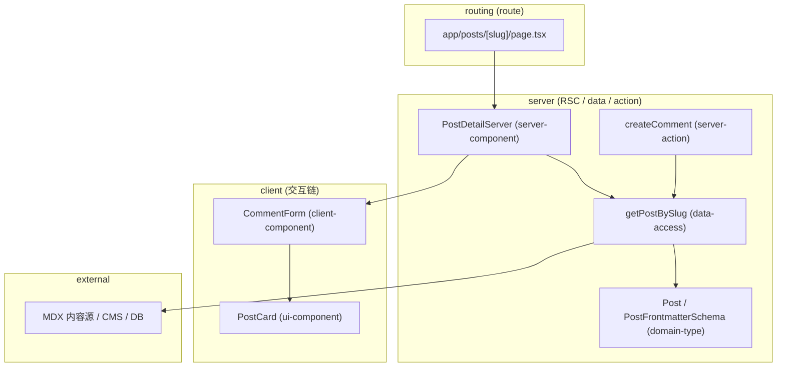
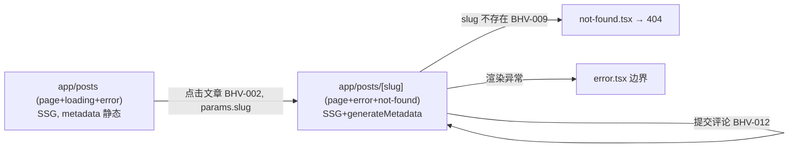
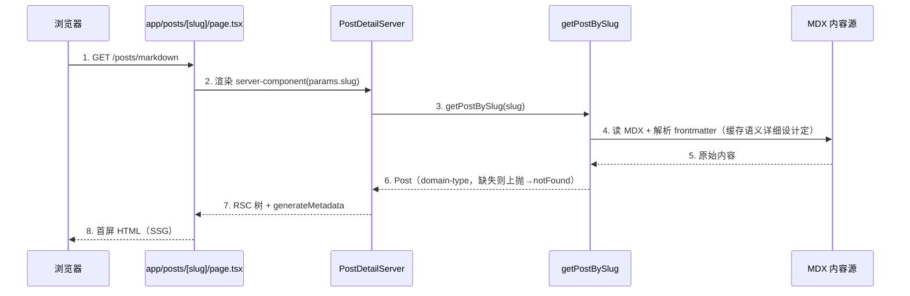

# H5/Next.js 概要设计分章写作指南（references）

> 编排层产物：只补充分章写法细则、模板与示例，不替代 L1。规则正文与完成条件一律以
> `.trellis/spec/harness/overview/overview-structure-single-source.md`（概要 L1 SSOT）为准；分层依赖律与硬红线以
> `.trellis/spec/guides/golden-path.md` 为准；项目槽位取值以 `.trellis/spec/conventions/project-conventions.md` 为准。
> 冲突时 golden-path 硬红线 > 概要 L1 章节合同 > project-conventions 槽位 > 本指南 > SKILL.md。
> doc_type 一律用 H5 钉死的七类（`server-component` / `client-component` / `data-access` / `route` / `ui-component` / `domain-type` / `server-action`），**禁止照抄 flutter（page-entry/controller/usecase/repository-datasource）或 Go（Entry/Biz/Utility/Data）的类型名**。

## 0. 写作前准备

- **判轨**：读 task.json `guru_chain`（`guru_after_create` 默认 `full`）。full → 设计包模式（本指南全部章节，落 `design-main.md` + `chapters/`）；light → 任务内 `design.md` §概要（必含章节第 1~8 条；第 5 章架构总览可简化为一句话架构 + 路由/组件树描述，分层图与时序图策略表不强制；第 9 章自检退为 Gate 前自查不强制成节，见概要 L1 §2b）。
- **技术栈基线（引用槽位，不另定取值）**：从 `project-conventions.md` 抄录 H5 槽位写进第 1 章「技术栈约束」——内容源（MDX/CMS）、状态管理（none/Zustand/Context）、UI 组件库（shadcn/MUI）、样式方案（Tailwind/CSS Modules）、测试（Vitest+RTL/Playwright）、lint（ESLint+Prettier）、数据库（按需）、认证（NextAuth 按需）、图像优化（next/image）、部署（Vercel）、路由模式（App Router/Pages Router）。取值一律写槽位裸 token（`SLOT-NN`），概要不重新决定技术栈。
- **生产基线钉死**：`tsconfig.json` `strict: true`、App Router（`app/`）为生产基线；**不沿用** blog 示例的 `strict: false`、`target: es5`、Pages Router（见 §12「示例 vs 生产」）。
- **术语统一**：先 `rg` 检索需求与既有设计中的实体名、route 段名、组件名、`BHV-NNN` / `UC` / `UNIT-<slug>` 编号，复用既有命名；新术语在第 1 章登记。
- **路由边界初判**：本任务落在哪个 `app/<seg>/`，复用还是新建 `page/layout/loading/error/not-found/route` 段，内容源/数据源接入点，server/client 切分初判（哪段是 RSC、哪段需 `'use client'`）。
- **目录动作（full 链）**：
  ```bash
  mkdir -p docs/design/<feature>/chapters
  touch docs/design/<feature>/README.md docs/design/<feature>/design-main.md
  # task.json 写入 "design_package": "docs/design/<feature>"（相对 repo root）
  ```

## 1. README 与 design.md 指针写法（full 链）

README 只做导航，不承载事实正文：

```markdown
# <feature> 设计包

| 文档 | 职责 |
|------|------|
| [design-main.md](./design-main.md) | 概要主定义（行为/归属/架构总览/技术决策/索引/自检） |
| [chapters/](./chapters/) | 详细设计逐章（见 design-main 第 6 章承接索引） |

追踪：BHV 来源 = ../../.trellis/tasks/<task>/prd.md；trace 矩阵由 guru_gate.py trace-matrix 机器生成。
平台基线：Next.js App Router + React + TypeScript strict（生产形态）。
```

任务内 design.md 指针模板（full 链）：

```markdown
# 设计指针（full 链）

主定义：[<feature> 设计包](../../docs/design/<feature>/design-main.md)（task.json design_package）
摘要：<三句话以内：解决什么、核心归属结论（落在哪几类 doc_type）、最大风险/未决>
本文件不承载设计正文；修订一律进设计包。
```

## 2. 第 1 章「设计约束与输入」写法（概要 L1 §2 必含章节 1）

模板：

```markdown
## 1. 设计约束与输入
### 1.1 承接的核心能力
| 能力编号 | P0/P1 | 一句话 | 需求锚点 |
### 1.2 技术栈约束（引用 project-conventions 槽位，不另定取值）
- 路由模式：App Router（SLOT-13，生产基线；不沿用示例 Pages Router）
- 内容源：SLOT-05 / 状态管理：SLOT-03 / UI 库：SLOT-01 / 样式：SLOT-04 / 测试：SLOT-07 …
- TS：strict: true（生产硬底线，不沿用示例 strict:false）
### 1.3 显式假设
| 假设 | 依据 | 影响范围 | 验证时点 |
```

要点：
- 核心能力逐条带需求锚点（prd 章节或正式需求包小节）；需求合法声明「无 P0/P1」时记录依据，**不补造核心能力主线**；需求缺失走显式假设路径，不得宣称「可进入详细设计」。
- 没有假设也要写「无」；有假设必须四字段齐全（假设/依据/影响范围/验证时点）并落盘本章（不允许只在会话里口头声明）。
- 概要禁写边界在本章点明：组件 props 字段级合同、zod schema 正文、`fetch`/CMS/ORM 调用参数、SDK 初始化参数、`metadata` 字段表正文、`revalidate`/cache 数值、env 取值、secret value 全部交详细设计（第 6 章索引指明承接落点）——不写成「设计范围外」，而写成「概要不展开，由 `chapters/<slug>.md` 承接」。

## 3. 第 2 章「行为集合」写法（概要 L1 §3）

按概要 L1 §3 四类顺序枚举（**用户操作 → 系统反应（渲染与数据获取）→ 失败路径（error/notFound 边界）→ 生命周期与导航**）；每条一个 `### BHV-NNN <短名>` 标题 + GWT 正文，并标注**执行边（server / client）**、涉及状态与数据：

```markdown
### BHV-003 渲染文章详情
Given 路由 `app/posts/[slug]/page.tsx`、`params.slug` 已知 When SSR 首屏 Then
[server] server-component 调 data-access 按 slug 取 MDX，命中缓存或 `notFound()`，
生成 metadata，输出静态结构。涉及状态：无新增；数据：Post（domain-type）。

### BHV-012 提交评论表单
Given 文章页已渲染、评论内容已输入 When 用户点击提交 Then [client] 触发 server-action →
[server] 校验 + 写入 data-access → `revalidatePath` 当前文章 → 返回新评论态 →
客户端乐观更新收口。涉及状态：评论列表、提交中态、错误态；数据：Comment。
```

正反对照（粒度，概要 L1 §3.1 四条：可直接实现 / 明确触发与归属 / 完整链路 / 粒度一致）：

- ✅ 上两例：前置、触发/导航、执行边（server/client）、渲染或状态变化、失败路径（`notFound()`/错误态）齐全。
- ❌ `### BHV-003 显示文章`：无路由锚点、无数据源、无 not-found 路径 → 审核 P2。
- ❌ `### BHV-012 处理评论`：无前置细节、无执行边、无失败路径、无状态变化 → 审核 P2。

常见遗漏自查：
- 每个用户操作（提交/筛选/导航）是否配了对应失败路径行为（fetch 失败 / 数据缺失 `notFound()` / 认证拒绝 / `error.tsx` 命中）？
- 是否覆盖生命周期：首屏 SSR、客户端 hydration、`loading.tsx` 挂起、路由切换、`revalidate` 触发、server-action 重验证？
- 每条 `BHV-NNN` 是否标注了执行边（server/client）与候选 owner（七类之一）？无执行边即不达 §3.1 第 2 条。

编号纪律：`BHV-NNN` 创建后不复用、不重排，删除留洞；归属表、详细设计、测试引用一律裸 token（`BHV-012`）。设计单元命名 `UNIT-<slug>`（kebab-case，如 `UNIT-post-detail-server-component`），下游裸 token 引用。

## 4. 第 3 章「归属判定表」写法（概要 L1 §4，概要核心产物）

### 4.1 归属判定表（每行一条 BHV，三问写实质，不写「同上」）

owner 取七类之一；按概要 L1 §4.1 判定表 + 三问理由（为什么属于它 / 为什么不属于别人 / 为什么需独立存在）：

```markdown
| BHV | owner（doc_type / UNIT） | 为什么属于它 | 为什么不属于别人 | 是否需独立存在 |
|-----|--------------------------|-------------|-----------------|---------------|
| BHV-003 | server-component / UNIT-post-detail-server-component | server-first 渲染 + 数据获取编排，私有取数收口在此 | 不属于 route（route 只装配段/SEO 不取数）；不属于 client-component（首屏无交互，client 也禁取私有数据） | 是：文章详情页主渲染单元 |
| BHV-012 | server-action / UNIT-create-comment-action | 评论提交是变更（mutation）+ `revalidatePath` 重验证 | 不属于 client-component（client 只触发，不能写库/持有 secret）；不属于 data-access（data-access 只提供写入封装，不编排重验证与表单语义）；不属于 server-component（server-component 负责读渲染不承接变更） | 是：被文章页与详情页两处复用，有自身错误语义 |
```

### 4.2 状态归属小节

每个状态字段一行（状态名 / 写 owner / 读取方）。硬约束：一个状态只能有一个写 owner——client 态写 owner 是 `client-component`，服务端数据写 owner 是 `server-action`；其他层只读/订阅。同一变更出现在两个 `server-action` 里 = P1，回退重判。

### 4.3 分层依赖律自检（概要 L1 §4.0 / golden-path §2.1，违反 fail）

逐条核对，**自底向上**（domain-type → data-access → server-action → server-component → client-component → ui-component → route）收敛边界叙述：

- 服务端链 `route → server-component → data-access → domain-type` 单向无环；
- 交互链 `client-component → ui-component` 单向无环；
- 变更链 `server-action → data-access` 单向无环；
- **server-first / 'use client' 最小化**：能落 server-component 的不下沉 client；整页/大块标 `'use client'` = P1。
- **私有数据获取 / secret 边界**：私有取数、API key、DB 连接、token 只能归 `server-component` / `data-access` / `server-action`；归 `client-component` 直取 = P1 fail。
- **外部触发只进 route**：浏览器请求/外部角色只能进 `route` 段（`page`/`route handler`），不能直连 `data-access` / `server-action` / `domain-type`；发现直连先补 route 段入口。
- `ui-component` 纯展示叶子，不取数、不依赖 `data-access`/`server-action`、不被 `domain-type` 之外的运行层反向依赖；`domain-type` 是横切被依赖叶子，自身不依赖任何运行层。

争议行先加载 `h5-design-overview` 相关拷问（或与用户确认）再定稿。发现归属错误回退本章重判，不在下游补救。

## 5. 第 3 章续「关键取舍与 ADR」写法（阶段 4）

命中架构显著技术选择时，先在本章形成关键取舍 / ADR，再为第 5 章 `technology_decision_handoff[]` 埋锚点（不可反向倒推「选了 X 所以 X 好」，必须从约束/驱动推到选择）。H5 高频取舍：

- **server/client 切分取舍**：哪段保持 RSC、哪段下沉 `'use client'` 最小叶子，理由回指「server-first + 私有数据只在 server 侧」。
- **内容源 MDX vs Headless CMS**：小站/单作者倾向 MDX（构建期文件读取 + frontmatter）；多编辑者/频繁更新倾向 CMS（经 data-access 鉴权与字段裁剪）。
- **渲染策略 SSG / SSR / ISR**：静态内容 SSG；强时效/个性化 SSR；折中用 ISR（`revalidate`）——**只写策略选择与依据，不写 `revalidate` 数值**（数值交详细设计）。
- **状态管理选型**：server-first 优先 none；确有跨组件客户端态再上 Zustand/Context（引用 `SLOT-03`）。

ADR 只写：决策主题 / 状态 / 备选 / 选定（或显式「未选定」）/ 选择原因 / 主要代价。**不写**实现配置、`next.config` 取值、SDK 初始化参数。

## 6. 第 4 章「路由与组件树 + 架构总览（人审视图）」写法（概要 L1 §2.5 六件套）

> full 链六件套缺一不可（概要 L1 §2.5 ①~⑥），是架构就绪门禁 G6/G7，不是可选优化。

### 6.1 一句话架构（固定格式，组件用真实名）

> 用户经 `<入口 route 段/path>` 进入，由 `<server-component>` 编排数据获取并调用 `<data-access>`，交互部分下沉到 `<client-component>`（消费 `<ui-component>`），变更经 `<server-action>` 回写，按 `<渲染策略 SSR/SSG/ISR + metadata>` 收口到界面。

### 6.2 分层架构图模板（mermaid，subgraph 区分 server/client 段）



自检：图中每个节点都能在第 3 章归属表找到（图中组件 ⊆ 归属表）；箭头方向符合分层依赖律（服务端链/交互链/变更链单向无环）；**不出现 `client-component → data-access` 直取数据的箭头**；server 段（RSC/data-access/server-action/domain-type）与 client 段（client-component/ui-component）以 subgraph 视觉区分。

### 6.3 路由/组件树图模板（mermaid，仅 UI 需求；非 UI 需求标 N/A + 依据）

节点 = route 段（标 `app/<seg>` + 产物文件 page/layout/loading/error/not-found），边 = 导航动作（标触发 BHV + 入参 `params`/`searchParams` 要点 + 渲染策略 SSR/SSG/ISR + metadata 来源）；覆盖失败/取消去向：



### 6.4 核心 UC 表 / 6.5 UC 承接表

列定义见概要 L1 §2.5 ④⑤，直接用表。UC 从需求验收场景提炼（用户可感知的完整目标），不是 BHV 重排——一个 UC 通常覆盖 2~5 条 BHV。承接表逐 UC 回答「谁实现它」：`uc_id / route_refs / bhv_refs / owner_refs（七类组件名）/ index_refs（第 6 章 chapter_target）`。行为↔UC 双向核对：每条 BHV 回指 ≥1 个 UC，UC 承接表 `bhv_refs` 与行为集合双向核对，不留孤儿行为、不留空 UC。

### 6.6 时序图策略表与 sequenceDiagram 写法

策略表先行（逐 UC 声明 独立/合并/豁免，列定义概要 L1 §2.5 ⑥）。sequenceDiagram 参与者用真实组件名，编号步骤与图下详述一一对应，server/client 边界与数据获取方向可读：



1. 浏览器请求动态段（外部触发只进 route）。
2~3. route 段把渲染下放 server-component，server-component 调 data-access 取数。
4~6. data-access 收口内容源读取与错误转换；数据缺失上抛由 `not-found.tsx` 收口（**不在 data-access 静默吞错返回空值冒充成功**）。
7~8. server-component 产出 RSC 树并注入 metadata，route 回首屏 HTML。

要求：参与者 = 真实组件名（七类）；回包用虚线；交互/变更路径另覆盖 `client-component → server-action → data-access`（按实际链路裁剪）；失败分支可另起一图或用 `alt` 块。**送审 Gate 前非豁免 UC 必须回填可定位真实 sequenceDiagram**，占位残留不得宣称可送审。

## 7. 第 5 章「技术决策承接清单」写法（概要 L1 §2.6）

字段合同见概要 L1 §2.6（`decision_id / decision_point / candidates / selected / rationale / detail_expansion_targets / compliance_basis`），直接用表。H5 易错点：

- `rationale` 必须从约束/驱动推到选择，不得反向倒推。
- **命中外部 provider / CMS / 对象存储 / 云服务 / 三方 API / 数据库 / 认证 provider（NextAuth）时必填 credential strategy**：**不保存任何 secret value**，默认凭证链优先，只写 `api_key_env_name`（如 `process.env.X`）/ `credential_ref` / `default_credential_provider_chain` / 运行平台身份注入；私有数据获取与 secret 引用**只允许出现在 `server-component` / `data-access` / `server-action` 三类的决策项**，出现在 `client-component` 决策项即审核 P1（`NEXT_PUBLIC_` 非敏感值除外）。
- 渲染策略（SSR/SSG/ISR）与缓存/`revalidate` 必须成决策项（G8），但只写策略选择，**不写 `revalidate` 数值**。
- 列表/分页先判定语义：普通分页（页号/页大小/总数/排序/空结果）不触发游标决策；只有无限滚动/游标/增量同步等连续消费语义才建游标决策。
- 「未选定」必须显式标注（如内容源 MDX vs CMS 待用户拍板），禁止让下游引用未选定决策。

## 8. 第 6 章「详细设计承接索引」写法（概要 L1 §7）

覆盖归属表全部 owner（七类全覆盖）；full 链每条附 `chapters/<slug>.md` 目标文件名（文件本体详细阶段产出）。字段：`chapter_target / doc_type（七类裸 token）/ chapter_file / bhv_refs / l2_status`。

```markdown
| chapter_target | doc_type | chapter_file | bhv_refs | l2_status | 不承接范围 |
|----------------|----------|--------------|----------|-----------|-----------|
| post-detail-server-component | server-component | chapters/post-detail-server-component.md | BHV-003 | full | 不决定缓存数值（交 data-access 章）；不持表单状态 |
| posts-data-access | data-access | chapters/posts-data-access.md | BHV-003 | full | 不决定渲染（属 server-component）；不写 frontmatter 字段表正文 |
| post-frontmatter-type | domain-type | chapters/post-frontmatter-type.md | BHV-003 | pending | 不含 I/O；仅类型/schema 边界 |
| create-comment-action | server-action | chapters/create-comment-action.md | BHV-012 | pending | 不直连 DB driver（经 data-access）；不写 revalidate 数值 |
| comment-form-client | client-component | chapters/comment-form-client.md | BHV-012 | full | 不取私有数据（数据走 props/调 action）；不持 secret |
| post-card-ui | ui-component | chapters/post-card-ui.md | BHV-002 | pending | 零取数、零业务、零状态 |
| posts-route | route | chapters/posts-route.md | BHV-002, BHV-009 | pending | 不堆复杂取数（下放 server-component）；error.tsx 必 'use client' |
```

L2 状态规则（概要 L1 §7.3 / detail L1 §2.5）：
- render/interactive/data 三元组（`server-component` / `client-component` / `data-access`）`l2_status: full`，`chapter_file` 遵循对应 L2 模板。
- pending 四类（`route` / `ui-component` / `domain-type` / `server-action`）在本表或第 8 章写 `L2豁免：<doc_type> 理由：按 L1 §3 合同八问展开；风险：<具体>；补齐计划：<何时补 L2>`，否则详细 Gate 拦截（首选先补 L2）。

自检：归属表每个 owner 至少被一条索引覆盖；doc_type 只用七类裸 token（禁 Page/Controller/UseCase/Repository/handler/service）；回填 UC 承接表 `index_refs`。

## 9. 第 7/8 章写法

- **第 7 章 未决问题**：逐条 `问题 / 风险等级(高中低) / 阻塞哪个 G 项 / 建议解法`；高风险项未关闭不得送审（G5）。无未决也须显式声明「无未决」。
- **第 8 章 架构就绪自检**（full 链成节，概要 L1 §6 G1~G9）：

```markdown
## 8. 架构就绪自检
| G 项 | 结论 | 证据/缺口 |
|------|------|----------|
| G1 行为覆盖 | 满足 | BHV-002~012 覆盖 P0×n（§2），均含执行边 |
| G2 归属完整 | 满足 | §3 全行三问，无分层依赖律违例 |
| G3 合规/secret | 满足 | §5 credential strategy 齐备，secret 仅 server 边三类 |
| G4 索引覆盖 | 满足 | §6 覆盖全部 owner，逐文件 + l2_status |
| G5 未决无高风险 | 满足 | §7 仅中风险且有假设 |
| G6 六件套 | 满足 | §4 ①~⑥ 齐全，图⊆归属表，箭头合 §4.0 |
| G7 时序闭合 | 满足 | 非豁免 UC 均有可定位 sequenceDiagram，无占位 |
| G8 技术决策 | 满足 | §5 逐条字段完整，渲染策略已成决策项 |
| G9 golden-path 自检 | 满足 | §8 锁定项通过；[示例实证]/[生产级补充] 标签正确 |
```

存在未闭合 G 项不得送审，不得用「基本满足」替代逐项证据。

## 10. 阶段推进与暂停口径

- 默认连续推进（一次性交付模式）；只有高风险未决项才暂停提问（一次 1~4 个；存在单一明显 P0 时通常 1 个问题即可）。
- 每阶段切换前轻量自检：本阶段产物是否满足对应概要 L1 合同；明显缺口当场补，不带病推进。
- 全稿完成 → 回填全部时序图占位 → G1~G9 自检 → 提示送审（加载 `h5-design-overview-review` 过概要 Gate；该 Gate 人工判「能否进详细」，区别于 `trellis-check` 代码质检）。

## 11. 禁止事项（写作期红线速查）

1. 不从名词/组件出发枚举（先有行为 `BHV-NNN` 再有组件，禁「先有 `PostListServer` 再倒推它做什么」）。
2. 不写组件 props 字段级合同、zod schema 正文、`fetch`/CMS/ORM 调用参数、SDK 初始化参数、`metadata` 字段表正文、`revalidate`/cache 数值、route segment config 取值、env 取值、cookie/session 属性、secret value（概要 L1 §5）。
3. 不替用户拍板未决业务规则、不凭空生成 P0/P1。
4. 不让图表与归属表两套口径（图中组件 ⊆ 归属表）。
5. 不在「未选定」技术决策上构建下游设计。
6. 不用概括性结论替代 G 项逐条证据。
7. 不违反分层依赖律：禁 `client-component` 直取私有数据/持 secret、禁整页标 `'use client'`、禁 `route` 跳层堆取数、禁 `server-action` 直连 DB driver 绕 data-access、禁 `ui-component` 取数/含业务、禁 `domain-type` 反向依赖。
8. 不用 blog 示例的简化（`strict:false`、Pages Router、无 server-action、`<style jsx>` 全局样式）反推弱化生产硬规则。
9. 不照抄 flutter（page-entry/controller/usecase/repository-datasource）或 Go（Entry/Biz/Utility/Data）的类型名，doc_type 只用 H5 七类。

## 12. 示例 vs 生产（引用纪律，概要 L1 §0 分隔线）

参考示例 `/Users/devSC/Documents/MyProject/next.js/examples/blog` 是**故意简化的 Pages Router + Nextra + MDX + gray-matter 轻量 starter**，**不是 golden-path**。引用时必须挂标签并给文件锚点：

| 标签 | 何时用 | 写法约束 | 本示例实证锚点 |
|------|--------|----------|----------------|
| `[示例实证]` | 结论可在 blog 示例文件直接验证 | 必须附 `examples/blog/<file>` 路径 | 内容模型：`pages/posts/markdown.md` frontmatter（`title/date/description/tag/author`）；构建期 RSS：`scripts/gen-rss.js`（`fs.readdir(pages/posts)` + `gray-matter` + `rss` → `public/feed.xml`）；`package.json` build=`node ./scripts/gen-rss.js && next build`；客户端取参：`pages/tags/[tag].mdx` 用 `useRouter().query`；RSS link：`pages/_app.tsx` `<Head>`；样式：`theme.config.js` `<style jsx>` |
| `[生产级补充]` | App Router 生产要求，示例未覆盖或相反 | 必须显式说明「示例为何不适用/已过时」，不得伪装成示例实证 | `strict: true`（示例 `tsconfig.json` 为 `strict:false`/`target:es5`，不沿用）；App Router 段（`page/layout/loading/error/not-found/route`，示例为 Pages Router）；server-first + RSC（示例无）；server-action（示例无）；`metadata`/`generateMetadata` SEO（示例手写 `<Head>`）；data-access 封装内容源读取（示例逻辑散落在 `gen-rss.js`）；`next/image`（示例用 `public/` 静态图）；CSS Modules/Tailwind（示例用 `nextra-theme-blog/style.css` + `<style jsx>`） |

硬规则：把 `[生产级补充]`（`strict:true`、Server Components、`app/` 路由）写成「示例已实证」即审核 P2；用示例简化反推弱化生产硬规则即 P1。
