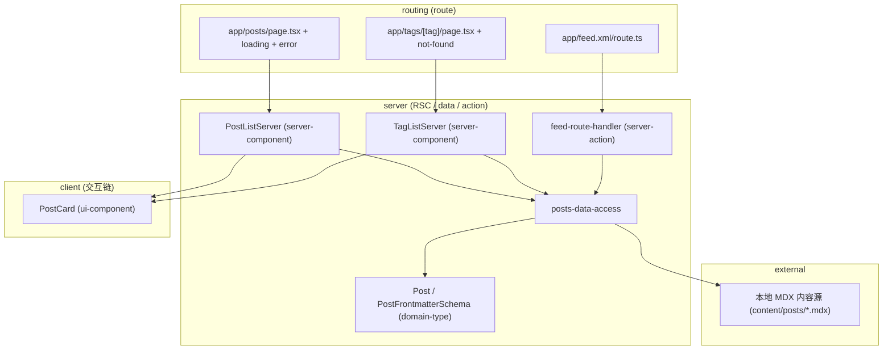
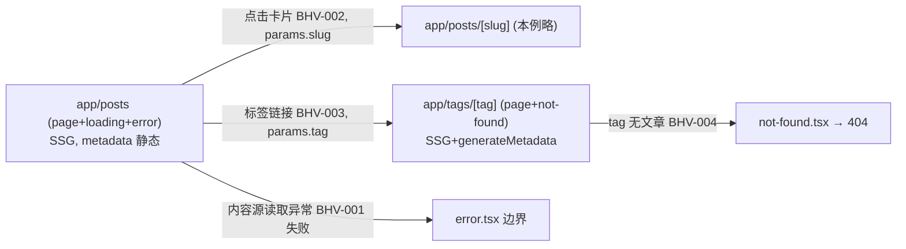
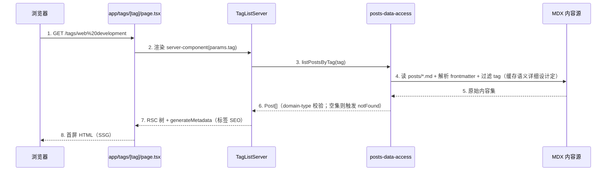

# 示例：标签筛选文章列表 design-main（缩减样例）

> 本文件是 **成稿形态示例**（取材一个通用「文章 + 标签 + RSS」内容单元，以 App Router 生产形态展开），只演示各章形态与粒度，**不是规则来源**；章节合同以概要 L1（`.trellis/spec/harness/overview/overview-structure-single-source.md`）为准。
> 取材单元：文章 + 标签 + RSS——文章 frontmatter（`title/date/description/tag/author`）、按 tag 列文章、生成 RSS feed。全部按生产基线落 owner（App Router 段 / RSC / server-action / `strict: true`）。
> 缩减说明：真实成稿的 BHV/UC 数量与表行数通常是本例的 2~4 倍。

交付范围：全稿（示例）｜执行模式：一次性交付｜链型：full｜概要主定义位置：design-main.md
路由边界：落在 `app/posts/`（新建段 page/loading/error）与 `app/tags/[tag]/`（新建段 page/not-found）；RSS 落 `app/feed.xml/route.ts`（route handler）。

## 1. 设计约束与输入

### 1.1 承接的核心能力

| 能力编号 | P0/P1 | 一句话 | 需求锚点 |
|---------|-------|-------|---------|
| CAP-01 | P0 | 列表展示文章并支持按标签筛选 | prd §2 BHV-001~004 |
| CAP-02 | P1 | 输出 RSS feed 供订阅 | prd §3 BHV-020 |

### 1.2 技术栈约束（引用 project-conventions 槽位，不另定取值）

- 路由模式：App Router（SLOT-13，生产基线），归属以 `app/` 段为准。
- 内容源：本地 MDX（SLOT-05）。内容模型为文章 frontmatter；生产将「读 MDX + 解析 frontmatter」封装进 data-access。
- 状态管理：none（SLOT-03，server-first 优先；标签筛选用 URL `searchParams`/动态段，不引入客户端状态库）。
- UI 库：shadcn（SLOT-01）｜样式：Tailwind（SLOT-04，禁全局污染）｜测试：Vitest+RTL + Playwright（SLOT-07）｜lint：ESLint+Prettier｜图像优化：next/image｜部署：Vercel。
- TS：`strict: true`（生产硬底线）。

### 1.3 显式假设

| 假设 | 依据 | 影响范围 | 验证时点 |
|------|------|---------|---------|
| 标签为字符串单值（如 frontmatter `tag: web development`） | 内容 frontmatter `tag` 为单字符串 | tag 路由段与筛选粒度（单标签）；多标签需扩 domain-type | 详细设计前向需求确认是否需多标签 |

> 概要禁写边界：本稿不写组件 props 字段级合同、`PostFrontmatterSchema` 字段正文、MDX 读取调用参数、`metadata` 字段表正文、`revalidate` 数值、RSS endpoint 响应头细节——均由第 6 章索引的 `chapters/<slug>.md` 承接。

## 2. 行为集合

### BHV-001 渲染文章列表（首屏）
Given 路由 `app/posts/page.tsx`、无筛选参数 When SSR 首屏 Then [server] server-component 调 data-access 取全部文章 frontmatter，按 `date` 倒序，RSC 渲染列表 + metadata。涉及状态：无；数据：Post[]（domain-type）。失败：内容源读取失败 → `error.tsx` 边界。

### BHV-002 点击文章卡片导航
Given 列表已渲染 When 用户点击某卡片 When 导航 `app/posts/[slug]`（本例略其详情页，仅记导航去向） Then [client] 链接跳转，`params.slug` 传入详情段。涉及状态：无新增；数据：slug。

### BHV-003 按标签筛选列表
Given 列表页已渲染 When 用户进入 `app/tags/[tag]` 段（或带 tag 的标签链接） Then [server] server-component 调 data-access 取按 `params.tag` 过滤的文章，RSC 渲染筛选结果 + `generateMetadata` 注入标签 SEO。涉及状态：无（筛选态由 URL 段承载）；数据：Post[]。
> 生产用动态段 `params.tag` 在 server-component 取参，避免客户端取数。

### BHV-004 标签不存在收口
Given 进入 `app/tags/[tag]` When 该 tag 无任何文章 Then [server] data-access 返回空集，server-component 调用 `notFound()` → `not-found.tsx` 收口返回 404。涉及状态：无；数据：空集判定。

### BHV-020 生成 RSS feed
Given 请求 `/feed.xml` When route handler `GET` 触发 Then [server] route handler 调 data-access 取全部文章，组装 RSS 输出。涉及状态：无；数据：Post[]。
> 生产用 App Router route handler `app/feed.xml/route.ts` 经 data-access 共用取数逻辑（构建期脚本与运行时 endpoint 二选一，本稿取 route handler 形态作 server-action 类承接示例）。

## 3. 归属判定表

| BHV | owner（doc_type / UNIT） | 为什么属于它 | 为什么不属于别人 | 是否需独立存在 |
|-----|--------------------------|-------------|-----------------|---------------|
| BHV-001 | server-component / UNIT-post-list-server-component | server-first 渲染 + 数据获取编排，私有/内容源取数收口在此 | 不属于 route（route 只装配段/SEO，取数下放 server-component）；不属于 ui-component（含取数与排序业务） | 是：列表页主渲染单元 |
| BHV-003/004 | server-component / UNIT-tag-list-server-component | 按 tag 取数编排 + 空集 `notFound()` 收口是服务端渲染职责 | 不属于 client-component（生产禁 client 直取内容源）；不属于 data-access（data-access 只过滤取数，不调 `notFound()`/不编排渲染） | 是：标签页主渲染单元 |
| BHV-001/003 取数 | data-access / UNIT-posts-data-access | 读 MDX + 解析 frontmatter + 按 tag 过滤是数据访问合同 owner，server 边唯一取数入口 | 不属于 server-component（编排归 RSC，取数封装下沉）；不属于 server-action（无变更） | 是：被列表/标签/RSS 三处复用 |
| BHV-020 | server-action / UNIT-feed-route-handler | RSS endpoint 是 route handler（API endpoint）形态，经 data-access 取数出站 | 不属于 route（route 段是页面渲染壳，feed.xml 是 API endpoint）；不属于 data-access（data-access 只取数不组装 RSS 出站协议） | 是：独立订阅出口 |
| BHV-002 | route / UNIT-posts-route + ui-component / UNIT-post-card-ui | 导航链接 + 卡片展示；route 承段约定，PostCard 纯展示 | 卡片不属于 client-component（无状态/事件，纯展示）；不属于 server-component（无取数） | 卡片是：列表/标签页两处复用 |
| 文章/frontmatter 形状 | domain-type / UNIT-post-type | frontmatter `title/date/description/tag/author` + slug 是类型/校验 owner，横切被依赖 | 不属于 data-access（data-access 引用它做校验，不定义形状） | 是：全链共享底座 |

状态归属：本 feature 无客户端写状态（server-first，筛选态由 URL 段承载）；服务端数据无变更 owner（RSS 为只读出站）。

分层依赖律自检（§4.0）：服务端链 `app/posts route → PostListServer → posts-data-access → Post(domain-type)` 单向无环；`app/tags/[tag] route → TagListServer → posts-data-access → Post` 单向无环；变更链 `feed-route-handler → posts-data-access`（只读出站，无写库）；`PostCard(ui-component)` 纯展示被两处复用、不取数；无 `client-component` 直取内容源（标签筛选用 server 段 `params`）；外部触发只进 route（`/posts`、`/tags/[tag]`、`/feed.xml`）。无违例。

## 4. 路由与组件树 + 架构总览（人审视图）

**一句话架构**：用户经 `app/posts/page.tsx`（及 `app/tags/[tag]/page.tsx`）进入，由 `PostListServer` / `TagListServer`（server-component）编排数据获取并调用 `posts-data-access`（读 MDX + 解析 frontmatter + 按 tag 过滤），展示下沉到 `PostCard`（ui-component），RSS 经 `feed-route-handler`（server-action 类 route handler）回写，按 `SSG + generateMetadata` 收口到界面。

**核心 UC 表**

| uc_id | uc_title | actor_or_trigger | source_refs | goal | priority |
|-------|---------|------------------|------------|------|----------|
| UC-01 | 浏览并按标签筛选文章 | 用户操作 + SSR 首屏 | BHV-001~004 | 看到（筛选后的）文章列表 | P0 |
| UC-02 | 订阅 RSS feed | 系统事件（GET /feed.xml） | BHV-020 | 取得有效 RSS feed | P1 |

**UC 承接表**

| uc_id | route_refs | bhv_refs | owner_refs | index_refs |
|-------|-----------|----------|-----------|-----------|
| UC-01 | app/posts, app/tags/[tag] | BHV-001~004 | PostListServer, TagListServer, posts-data-access, PostCard, Post, posts-route | post-list-server-component, tag-list-server-component, posts-data-access, post-card-ui, post-type, posts-route |
| UC-02 | app/feed.xml | BHV-020 | feed-route-handler, posts-data-access | feed-route-handler, posts-data-access |

**时序图策略表**

| uc_id | strategy | sequence_section | merged_coverage | exemption_reason |
|-------|----------|------------------|----------------|------------------|
| UC-01 | 独立 | §4.1 | — | — |
| UC-02 | 豁免 | — | — | 单跳只读 route handler，最小行为链：GET /feed.xml → feed-route-handler → posts-data-access → RSS 出站；无分支无交互 |

### 4.1 UC-01 时序图

1. 浏览器请求标签动态段（外部触发只进 route）。
2~3. route 把渲染下放 server-component，server-component 按 `params.tag` 调 data-access。
4~6. data-access 收口 MDX 读取、frontmatter 解析与 tag 过滤；空集上抛触发 `not-found.tsx`（**不静默吞错返回空数组冒充成功**，BHV-004）。
7~8. server-component 产出 RSC 树并注入标签 metadata，route 回首屏 HTML（SSG）。

## 5. 技术决策承接清单

| decision_id | decision_point | candidates | selected | rationale | detail_expansion_targets | compliance_basis |
|------------|----------------|-----------|----------|-----------|--------------------------|------------------|
| TD-01 | 内容源形态 | 本地 MDX / Headless CMS | 本地 MDX | 单作者小站、内容随仓库版本管理，无需多编辑者后台；内容模型为 MDX frontmatter | posts-data-access（封装 MDX 读取 + frontmatter 校验，不写调用参数） | N/A（无 PII/认证/三方域名） |
| TD-02 | 渲染策略 | SSG / SSR / ISR | SSG | 内容构建期已知、强 SEO、低更新频率；标签页随文章集静态生成 | post-list-server-component, tag-list-server-component（不写 revalidate 数值） | N/A |
| TD-03 | RSS 产出形态 | 构建期脚本 / 运行时 route handler | route handler | 与页面共用 data-access 取数，避免逻辑两份；endpoint 形态便于按需重生成 | feed-route-handler（不写响应头/RSS 字段正文） | N/A |
| TD-04 | 标签多值支持 | 单值（示例）/ 多值数组 | 未选定 | 取决于需求是否支持多标签（见 §1.3 显式假设）；未选定，下游不得私自拍板 | post-type（domain-type，待定后展开 schema） | N/A |

> credential strategy：本 feature 无外部 provider/CMS/云服务/认证，无 secret，N/A。若 TD-01 改选 CMS，则 CMS token 经 `process.env.<CMS_TOKEN_ENV>` 引用、只在 posts-data-access（server 边）使用，不下放 client。

## 6. 详细设计承接索引

| chapter_target | doc_type | chapter_file | bhv_refs | l2_status | 不承接范围 |
|----------------|----------|--------------|----------|-----------|-----------|
| post-list-server-component | server-component | chapters/post-list-server-component.md | BHV-001 | full | 不决定缓存数值（交 data-access 章）；不持展示样式细节 |
| tag-list-server-component | server-component | chapters/tag-list-server-component.md | BHV-003, BHV-004 | full | 不写 generateMetadata 字段表正文；不定义过滤实现 |
| posts-data-access | data-access | chapters/posts-data-access.md | BHV-001, BHV-003, BHV-020 | full | 不决定渲染（属 server-component）；不写 frontmatter 字段表/MDX 读取参数正文 |
| post-type | domain-type | chapters/post-type.md | BHV-001, BHV-003 | pending | 仅类型/zod schema 边界；零 I/O、零 React |
| feed-route-handler | server-action | chapters/feed-route-handler.md | BHV-020 | pending | 不直读文件系统（经 data-access）；不写 RSS 字段/响应头正文 |
| post-card-ui | ui-component | chapters/post-card-ui.md | BHV-002 | pending | 零取数、零业务、零状态 |
| posts-route | route | chapters/posts-route.md | BHV-001, BHV-002, BHV-003, BHV-004 | pending | 不堆复杂取数（下放 server-component）；error.tsx 必 'use client' |

L2豁免：post-type 理由：按 L1 §3 合同八问展开；风险：类型边界简单，无 L2 模板风险低；补齐计划：domain-type L2 出后回填。
L2豁免：feed-route-handler 理由：按 L1 §3 合同八问展开；风险：RSS 出站协议细节集中在详细，需八问就地齐全；补齐计划：server-action L2 出后回填。
L2豁免：post-card-ui 理由：纯展示叶子，按八问展开；风险：低；补齐计划：ui-component L2 出后回填。
L2豁免：posts-route 理由：按八问展开段约定与错误边界；风险：error/not-found 边界须就地写清；补齐计划：route L2 出后回填。

## 7. 未决问题

| 问题 | 风险 | 阻塞 G 项 | 建议 |
|------|------|----------|------|
| 标签是否需多值（TD-04 未选定） | 中 | 无（已有 §1.3 显式假设） | 详细设计前向需求确认，定后展开 post-type schema |

## 8. 架构就绪自检

| G 项 | 结论 | 证据/缺口 |
|------|------|----------|
| G1 行为覆盖 | 满足 | BHV-001~004 覆盖 CAP-01、BHV-020 覆盖 CAP-02（§2），均含执行边 |
| G2 归属完整 | 满足 | §3 全行三问，无分层依赖律违例（无 client 直取内容源、无 route 堆取数、无 ui 含业务） |
| G3 合规/secret | 满足 | §5 无外部 provider，N/A；CMS 假设路径下 secret 仅 server 边 |
| G4 索引覆盖 | 满足 | §6 覆盖全部 owner，逐文件 + l2_status，render/data 走 full、pending 四类有 L2豁免 |
| G5 未决无高风险 | 满足 | §7 仅中风险且有显式假设 |
| G6 六件套 | 满足 | §4 一句话架构/分层图/路由树/UC 表/承接表/策略表齐全；图⊆归属表；箭头合 §4.0；server/client 段以 subgraph 区分 |
| G7 时序闭合 | 满足 | UC-01 独立图 §4.1，无占位；UC-02 豁免有最小行为链 |
| G8 技术决策 | 满足 | §5 逐条字段完整；TD-04 显式标「未选定」，下游未引用；渲染策略 TD-02 已成决策项 |
| G9 golden-path 自检 | 满足 | strict:true / server-first / secret 隔离 / route 段约定 / metadata 标准化 / 样式隔离均合锁定项 |

---

> 送审提示：加载 `h5-design-overview-review` 过概要 Gate（人工判「能否进详细」，区别于 `trellis-check` 代码质检）。本示例为缩减演示，正式成稿 BHV/UC/索引行数应更多。
