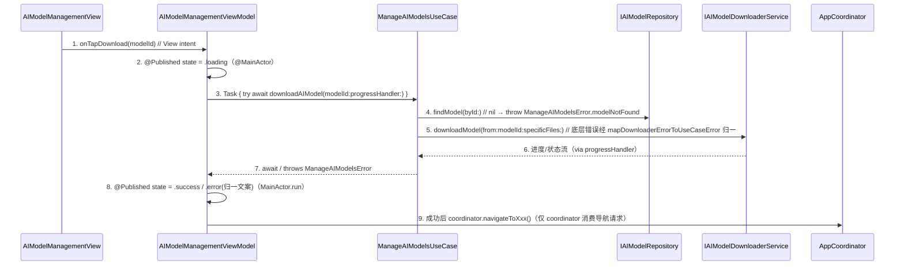

# iOS 原生详细设计分章写作指南（references）

> 编排层产物：只补充 iOS 七类 doc_type 的逐类写法细则、章节模板与时序图示例，不替代 L1/L2。
> 规则正文、合同八问、完成条件以 `.trellis/spec/harness/detail/detail-structure-single-source.md`（L1）与
> `detail-type-viewmodel.md` / `detail-type-usecase.md` / `detail-type-repository.md`（L2，v1 三类）为准。
> 平台事实唯一来源是 IOS_BRIEF：DDD 四层 `Domain → App → Infrastructure → UI`（Domain 零依赖）、SwiftUI 主 + RxSwift 遗留、
> FactoryKit `@Injected` DI、Repository 模式（接口在 Domain / 实现在 Infrastructure）、`enum Error` per domain、
> `AppCoordinator` 导航、WCDBSwift 持久化、ViewModel = `ObservableObject` + `@Published`。
> doc_type 严格七类：`viewmodel` / `usecase` / `repository` / `domain-model` / `view` / `coordinator` / `external`，
> 禁止照抄 flutter（`controller`/`page-entry`/`datasource`）或 Go（`Biz/Behavior`/`Utility`）的类型名。冲突时 `L1 > L2 > references > SKILL.md`。

## 1. 规范装载矩阵（按当前批次命中装载，不全量装）

每批只装载本批 doc_type 命中的 L2 与对应 golden-path 迷你路径，不为后续章节预加载无关 L2（L1 §1 装载纪律）。

| doc_type | L2 文件（命中即装） | l2_status | 额外必读 golden-path 节 |
|----------|--------------------|-----------|------------------------|
| `domain-model` | 无（pending，按 L1 §3 八问 + §3.2 退化口径） | pending（full 链须 L2豁免） | §3 domain-model 迷你路径、§2.5 enum Error 分层、§2.4 命名 |
| `repository` | `detail-type-repository.md` | full | §4 repository 迷你路径、§2.2 接口/实现分离、§2.7 WCDBSwift |
| `usecase` | `detail-type-usecase.md` | full | §5 usecase 迷你路径、§2.1 分层依赖律、§2.5 enum Error 分层 |
| `viewmodel` | `detail-type-viewmodel.md` | full | §6 viewmodel 迷你路径、§2.3 FactoryKit DI、§2.6 private extension |
| `view` | 无（pending，按 L1 §3 八问 + §3.2 退化口径） | pending（full 链须 L2豁免） | §7 view 迷你路径、§2.1 禁 View 间导航/直连持久化 |
| `coordinator` | 无（pending，按 L1 §3 八问 + §3.2 退化口径） | pending（full 链须 L2豁免） | §9 coordinator 迷你路径、§2.3 DI 装配（`Container+*`） |
| `external` | 无（pending，按 L1 §3 八问 + §3.2 退化口径） | pending（full 链须 L2豁免） | §8 external 迷你路径、§2.7 WCDBSwift、合规（PrivacyInfo/entitlements/StoreKit） |

pending 四类（`domain-model`/`view`/`coordinator`/`external`）在 full 链命中时，必须先在 design-main.md 取得
`L2豁免：<doc_type> 理由：…` 声明（WX-6），否则停止生成并回退概要补 L2 或写豁免。v1 三类命中时不需豁免，按 L2 差异规则展开。

## 2. 章节正文模板（L1 §4 骨架的操作版）

新章节从此模板起稿（full 链=`chapters/<slug>.md`，文件名与概要承接索引一致；light 链=`design.md` §2 内一章，可压缩小节层级）。
模板是表达形式，**合同八问（L1 §3）是完成条件**，二者必须同时满足。辅助文本中文，Swift 语法元素（类型名/方法名/参数名/`@Published`/`@Injected`/关键字）英文。

````markdown
# <chapter_target> 详细设计

> doc_type：usecase ｜ l2_status：full ｜ owner 层：Domain
> 承接索引：design-main.md 第 7 节 <chapter_target> ｜ 返回：[design-main](../design-main.md)
> partial_scope：N/A（如有：covered_items[] / not_covered_items[] / canonical_publish_status）

## 1. 单元职责
本章承载的 `UNIT-<slug>` 清单与一句话职责，以及与依赖/被依赖单元的关系（调用谁的什么行为、被谁调用），
并给出依赖方向声明（必须符合 L1 §6.1 分层依赖律）。
示例：`UNIT-manage-ai-models-usecase` 是 Domain 层 AI 模型管理业务编排 owner，承接 BHV-301/302/303；
依赖 `IAIModelRepository`（repository 接口）、`IAIModelDownloaderService`/`IApplicationInfoService`/`IFileSystem`（external 协议）；
被 `AIModelManagementViewModel`（viewmodel）调用并订阅其 `observeModelDownloadStatus()` 流。

## 2. 行为定义
### 2.1 行为清单（每行为一行：行为名 + 简述 + 承接的 BHV-NNN 编号；一条 BHV 映一个公开方法或一条流，不允许一对多笼统承接）
- getAllModelsWithStatus — 取全部模型及状态（BHV-301）
- downloadAIModel — 下载模型并回放进度（BHV-302）
- observeModelDownloadStatus — 全局下载状态流（BHV-303）

### 2.2 接口定义（Swift 签名级，禁止超过签名级的实现代码）
```swift
protocol IManageAIModelsUseCase {
    func getAllModelsWithStatus() async throws -> [AIModel]
    func getSpecificModelStatus(modelId: String) async throws -> AIModelStatus
    func downloadAIModel(modelId: String, progressHandler: @escaping (Double) -> Void) async throws
    func observeModelDownloadStatus() -> AsyncStream<[AIModelDownloadStatus]>
}
```

## 3. 核心数据结构
### 3.1 数据模型（Swift struct/class/enum 签名级；序列化按 project-conventions JSON 槽位；domain-model 单元此节为主体）
### 3.2 错误类型表（enum Error，分层定义）
| 错误名 | 枚举 case | 语义 | 归属层 | 转换/收口位置 |
|--------|-----------|------|--------|--------------|
| ManageAIModelsError.modelNotFound | modelNotFound(id:) | 仓库无此 modelId | Domain | usecase 入口 guard |
| ManageAIModelsError.diskSpaceInsufficient | diskSpaceInsufficient(requiredBytes:availableBytes:) | 磁盘不足 | Domain | mapDownloaderErrorToUseCaseError（SLOT-error-mapping） |

## 4. 逐行为设计（每个行为一小节）
### 4.x <行为名>
- 函数签名（Swift）
- 行为简述（一句话 + 承接 BHV-NNN）
- 输入参数表：| 参数 | 类型 | 取值域/约束 | 必填 |
- 输出表：| 返回值/发射值 | 类型 | 语义 |
- 依赖调用表（八问 4）：| 依赖 | @Injected/构造注入 | 调用的行为 | 不调用边界 |
- 执行流程（mermaid sequenceDiagram，参与者用真实组件名，步骤编号）
- 流程详述（编号列表，与图中编号一一对应，满足 L1 §3.1 粒度标准）
- 异常处理表：| 异常情况 | 处置（重试/降级/上抛/提示） | 错误转换位置（SLOT-error-mapping） |

## 5. 状态管理（viewmodel 必含；usecase 有业务状态时必含；无状态单元写 N/A 并说明理由）
状态字段（含初始态、所在 actor）+ 三态（loading/success/error）+ 状态转移（mermaid stateDiagram 或转移表）
+ 写 owner 声明（`@Published` owner / 业务态 owner）+ 流 seed 与发射时机。

## 6. View 设计（仅 view 类）/ 导航设计（仅 coordinator 类）；其余类型写 N/A 及理由
- view：组件层级（SwiftUI body 结构要点）、交互（手势/输入 → 回调）、响应式适配、状态绑定（只读消费 `@Published`）。
- coordinator：导航路由表（route → 目标 view + 参数 + 装配依赖）、FactoryKit `Container` 注册项、栈/呈现方式（push/sheet/fullScreenCover）。

## 7. 测试映射
| BHV/行为 | 测试层（unit/view/integration/manual） | 测试点（成功 + 失败路径逐条） | mock 对象（手写/Mockolo） |

## 8. 不得补造清单
本单元不拥有的决策逐条列出（含越层禁止项，回指 L1 §6.1）。

## 9. 不适用场景与产物合同 / 10. 未决问题与跨章引用
落盘产物文件与归属目录；未决项（不留空、不写 TODO）；稳定引用与下一批修复动作。
````

> 模板与 L1 §4 骨架小节对应：模板 §1↔L1 §1、§2↔L1 §2、§3↔L1 §3、§4↔L1 §4、§5↔L1 §5、§6↔L1 §6、§7↔L1 §7、§8↔L1 §8；
> 本指南把 L1 §4 的「9 不适用场景与产物合同 / 10 未决问题与跨章引用」并入模板尾部，落盘时按 L1 编号纪律命名小节。

## 3. 时序图示例（mermaid，View → ViewModel → UseCase → Repository 接口 → Infrastructure 实现 / external）

iOS 时序图参与者用真实组件名，覆盖异步 `Task`/`await` 与 `@MainActor` 回写边界；导航请求穿插 `AppCoordinator`；
`enum Error` 转换点标在 repository 实现或 external 边界（SLOT-error-mapping），不在 UI 首次发明错误。



## 4. 七类写作步骤（3.1~3.7）

每类共同骨架同 §2 模板；以下只列各 doc_type 的类型要点与易错点。命中 v1 三类（`usecase`/`viewmodel`/`repository`）时叠加对应 L2 差异规则。

### 3.1 domain-model（pending，按 L1 §3.2 退化口径 + golden-path §3）

- 先写类型签名再写不变量：`### 3.1 数据模型` 是本类主体——列 `struct`/`class`/`enum`/`enum Error` 的签名级声明（字段、关联值），不写持久化注解。
- 八问退化（L1 §3.2）：只强约束 2（类型/`enum`/`enum Error` 签名）、5（不变量违反的错误语义）、8（零依赖断言——不补造任何 usecase/repository/UI 引用）；八问 1/3/4/6/7 中行为类项写 `N/A：值类型无运行时行为`，但若存在不变量校验（如构造校验 title 非空抛 `StoryError.validationFailed`）则按行为展开并配测试。
- `enum Error` 分层（golden-path §2.5）：每域独立 `enum XxxError: Error`；需测试断言的实现 `Equatable`（手写 `static func ==`，见 `ManageAIModelsError`、`StoryError`）。
- 可验证信号：本类型文件 `import` 只出现 `Foundation`（grep 无 `import SwiftUI`/`import WCDBSwift`/`import FactoryKit`）；零依赖断言写进八问 8。
- 易错点：实体里塞 `func save()` 或 `TableCodable` 持久化逻辑（应在 repository 实现 / external 表定义）；把纯 UI 展示态当成 domain-model（属 viewmodel 的 `@Published`）。

### 3.2 repository（full，按 detail-type-repository.md + golden-path §4）

- 合同从 Domain 需要出发（不从表结构/SDK 出发）：先列接口 `protocol IXxxRepository` 签名级（`async throws`、取数动词 `list`/`one`/`get`/`fetch`、`save`/`delete`），再写 Infrastructure 实现合同。
- 双 owner 必须分标清：接口 owner=Domain（`Domain/Repositories/IXxxRepository.swift`，零依赖），实现 owner=Infrastructure（`Infrastructure/Persistence/Repositories/XxxRepository.swift`，注入 `DatabaseManager`/`EnhancedDatabaseManager`，独占 WCDBSwift）。同一 `repository` UNIT 同时落接口合同与实现合同。
- 错误转换点（SLOT-error-mapping）逐错误枚举写明转换前后类型：WCDBSwift 原始错误在 repository 实现边界转 `PersistenceError`/Domain 错误，绝不裸抛到上层（golden-path §2.5）。
- local/remote 编排与缓存回落策略 owner 在此定；持久化行模型（`XxxObject: TableCodable`）列定义本体归 external，repository 只声明 Domain 实体 ↔ 持久化 Object 的转换映射归属。
- 易错点：接口方法返回 WCDBSwift 类型（泄漏到 Domain，P1）；ViewModel/View 里出现 repository 实现类名或 `import WCDBSwift`；repository 里判业务前置条件（应在 usecase）。

### 3.3 usecase（full，按 detail-type-usecase.md + golden-path §5）

- 先行为后接口：从承接的 BHV 推导行为清单，一条 BHV 映协议 `IXxxUseCase` 的一个公开方法或一条发射流（不允许一对多笼统承接，detail-type-usecase §U1）。
- 接口签名级：`protocol IXxxUseCase { func ... async throws -> T; func observeXxx() -> AsyncStream<Element> }`（不写方法体）；`AsyncStream` 失败建模为元素 `case failed(message:)`（流不携带 error 通道）。
- 状态唯一写 owner：业务状态清单 + 所在 `actor`（跨 `Task` 可变共享状态用 `actor` 封装，见 `private actor StateManager`）；流 seed（订阅瞬间是否回放，如 `observeModelDownloadStatus` 订阅即 `yield(initialProgress)`）+ 发射时机 + `onTermination` 清理。
- 依赖正反两面：允许注入 `IXxxRepository` 接口 / service 协议 / Infrastructure 能力的协议抽象（`IFileSystem`/`IApplicationInfoService`/`IAIModelDownloaderService`）/ 单向 usecase 接口；禁 import `SwiftUI`/`FactoryKit`/`WCDBSwift`/repository 实现类；依赖构造注入并持有协议类型（`private let aiModelRepository: any IAIModelRepository`），DI 装配在 coordinator 的 `Container+UseCases` 完成（usecase 自身不碰 `@Injected`）。
- 错误用本 domain `enum Error`：底层错误（`AIModelDownloaderError`/`URLError`）在单点 `map`（`mapDownloaderErrorToUseCaseError`，SLOT-error-mapping）转成本域 case 后再抛。
- 第 6 节 View 设计恒为 `N/A（Domain 层无 UI）`；测试密度最高——每条承接行为 1 成功 + 全部失败路径，每个 error case 至少一条断言，流时序用 `expectation`/`for await` 断言。
- 易错点：合同只写「提供 AI 模型管理能力」而无逐方法签名（八问 2 缺项 P1）；流无 seed/发射时机（八问 6 P2）；裸抛底层错误类型给 viewmodel（R4 P1）；双写同一业务状态（R7 P1，回概要重判归属）。

### 3.4 viewmodel（full，按 detail-type-viewmodel.md + golden-path §6）

- 只做「事件 → usecase 行为 + 状态订阅 → UI 态」映射：出现业务规则（重试阈值/业务校验/不变量）即越权——回查概要归属（属 usecase）。
- 形态固定 `final class XxxViewModel: ObservableObject`；对外状态 `@Published`（列每个字段初值 + 含义）；依赖 `@Injected(\.xxxUseCase)` 注入 usecase/仓储接口（禁手动 new、禁 import repository 实现/`WCDBSwift`）。
- 异步用 `Task` + `async/await`，状态写回经 `@MainActor`/`MainActor.run`（如 `await MainActor.run { recentStories = ... }`）；UI 相关 Factory 在 `Container+ViewModels` 标 `@MainActor` 注册。
- 三态映射（loading/success/error）必写：`enum Error` 降级为 UI 态（不把 `throws` 漏到 View）；导航请求只产出不消费（调注入的导航闭包/coordinator，不在 viewmodel 硬跳）。
- 第 5 节状态管理必含：`@Published` 字段集 + 状态转移（stateDiagram 或转移表）+ 写 owner 声明 + 生命周期钩子（`onAppear`/`task`/订阅取消）。
- 易错点：`@Published` 直接存 `Database` 查询结果对象；viewmodel 里 `StoryRepository(...)` 手动 new；viewmodel 承接业务规则。

### 3.5 view（pending，按 L1 §3.2 退化口径 + golden-path §7）

- 形态 `struct XxxView: View`；依赖经 `@InjectedObject(\.xxxViewModel)` / `@Injected(\.navigateToXxx)` / `@EnvironmentObject`（`ThemeManager`）获取，`body` 里禁 init ViewModel。
- 强约束（L1 §3.2）：2（输入事件 → 回调签名）、4（只依赖 `viewmodel`，反面禁业务/导航/持久化）、6（事件回调与导航请求消费方=coordinator）、8（不拥有状态转移/业务/导航决策）；状态读为只读绑定 `@Published`。
- 第 6 节 View 设计必含：组件层级要点、用户输入 → 转发的 VM 方法映射、导航触发点（调哪个 coordinator 动作/注入闭包）、文案走本地化（`R.string.localizable`，不硬编码用户可见字符串）。
- 八问 8 必列「不决定状态转移——属 viewmodel」「不决定导航拓扑——属 coordinator」「不直连持久化——经 viewmodel→usecase→repository」。
- 易错点：View 间 `NavigationLink` 硬跳到别 feature（绕过 coordinator，§2.1 硬禁止）；`Task { try await storyRepository.findAll() }` 业务漏进 View。

### 3.6 coordinator（pending，按 L1 §3.2 退化口径 + golden-path §9）

- 双职责：导航编排（`AppCoordinator` 改 `@Published activeDestination`，目的地用内嵌 `enum NavigationDestination`）+ FactoryKit DI 装配（`Container+UseCases`/`Container+ViewModels`/`Container+Infrastructure`/`Container+Coordinators`/`Container+Domain` 的 Factory 计算属性）。
- 八问 2 用导航路由表表达：`route → 目标 view + 参数 + 装配依赖`；八问 4 列装配哪些 `view`/`viewmodel`/`usecase` 及 FactoryKit `Container` 注册项逐条（注册形态见 golden-path §2.3，含 `.singleton`/`@MainActor` 标注）；八问 6 写导航后置结果与栈变化；八问 8 写「不拥有业务规则」。
- 第 6 节导航设计必含：导航路由表 + `Container` 注册项 + 呈现方式（push/sheet/fullScreenCover）。导航动作以闭包 Factory 暴露给 view 注入（`Factory<() -> Void>`/`Factory<(String) -> Void>`）。
- 易错点：coordinator 里编排业务（属 usecase）；DI 用手动 new 替代 Factory；允许 view 绕过 coordinator 跳转。

### 3.7 external（pending，按 L1 §3.2 退化口径 + golden-path §8）

- 逐网络/SDK/WCDBSwift/三方：Domain 侧定适配器协议 `IXxxAdapter`（让 Domain 零依赖于具体 SDK），Infrastructure 侧实现封装 SDK/网络/WCDBSwift 细节；`Container+Infrastructure` 注册 Factory。
- 强约束（L1 §3.2）：2（网络 req/resp model 或 SDK/引擎调用合同签名）、5（技术错误归一为 Domain `enum Error`/`PersistenceError` 的转换边界）、8（不拥有业务规则/业务终态判定）。
- WCDBSwift 新建表：表/列定义集中到 `Persistence/Entities` 的 WCDB 表对象（`Codable`+`TableCodable`），迁移逻辑集中在 `DatabaseManager`/`EnhancedDatabaseManager`（按版本推进、新列给默认值或 `fromMap` 兜底），供 repository 实现消费，不让 ViewModel/View 直接拿 `Database`。
- 合规面（涉权限/数据采集/三方域名/PII 时必填）：PrivacyInfo 条目、entitlements、StoreKit、最小权限用途串逐条落点；credential 只写 `credential_ref`（Keychain 引用/环境变量名/xcconfig 引用），出现真实 key 即 P1。
- 易错点：SDK 细节泄漏到 Domain/UI；原始错误裸抛到 UI；external 里做业务判定（如「低置信度则降级业务规则」，属 usecase）。

## 5. 批次收敛与 checkpoint 操作细则

- 写作顺序（自底向上，对齐 DDD 依赖方向，L1 §5.2）：① `domain-model` → ② `repository`（接口先行、实现随后）→ ③ `usecase` → ④ `viewmodel` → ⑤ `view` + `coordinator`；`external` 横切随 repository 实现就近排入。同一 feature 的 usecase 与其直接 repository 同批优先；同一 feature 的 view 与其 viewmodel 同批优先。
- 每批 1~3 章（禁止一轮全量生成），生成后立即自动 review（不等用户）——批内自检逐项打钩后才置 `chapter_status`：
  1. 类型骨架与第 7 节索引的 `detail_doc_type` 匹配，且为七类之一，无自创类型名（无 `controller`/`service`/`datasource`）；
  2. 合同八问逐 UNIT 可回指（L1 §3 括号内可验证信号），无 TODO/占位/空章节；
  3. 粒度抽查：任选一个行为，按 L1 §3.1 四条逐条判（可直接实现 / 明确调用关系 / 完整调用链 / 粒度一致）；
  4. 分层依赖律全过（L1 §6.1）：Domain 零依赖（无 SwiftUI/FactoryKit/WCDBSwift/网络 import）、方向单向、View 不直连导航/持久化、repository 接口/实现双 owner；
  5. golden-path 硬规则全过：`@Injected` DI（无手动 new 注入对象）、Repository 模式、`enum Error` 分层、WCDBSwift（无 CoreData/SwiftData）、`ObservableObject`+`@Published`、private 方法在 `private extension`；
  6. 命中 v1 三类时逐条核对 L2 差异规则（usecase U1~U7 / viewmodel / repository 的类型硬规则）；
  7. 测试映射覆盖每个 `enum Error` case（成功 + 全部失败路径）；
  8. 编号双向闭合（BHV↔UNIT，无幽灵 `BHV-NNN`、无无承接 `UNIT-<slug>`）。
- 层级 checkpoint（L1 §5.4）操作：列出该层全部 UNIT → 跑对应核对项 → 失效项标注到章节 → 回批次修复。domain-model 层 checkpoint 通过前不开始 repository 层批次。
- 受影响章节复查：本批修改触及已完成章节的跨章引用（如 viewmodel 引用的 usecase 签名变了）时复查该引用闭合；层级 checkpoint 或最终复审若修改已通过章节，受影响章节通过状态失效，必须重新进入当前小批次写审修闭环。
- 修复闭环上限：同一 finding 修复 2 轮仍不收敛 → 按 SKILL.md 强制约束 11 升级用户，不得带病置 `passed`。

## 6. 禁止事项（写作期红线速查）

1. 一轮全量生成全部章节（每批 ≤3 章并完成批内审修后才进下一批）。
2. 越过签名级写实现代码/伪代码（Swift 方法签名、`struct`/`enum`/`protocol` 声明、`@Published`/`@Injected` 声明为上限）。
3. 补造概要归属表之外的结构、改 owner、拍板未选定技术决策（URLSession/Moya、XCTest/Quick+Nimble、SwiftyBeaver/OSLog 迁移取舍未定时不得私选）。
4. 把「见概要 / 同 flutter」当八问答案（每问就地作答，可引用但须有本地结论）。
5. 跳过失败路径的测试映射（每个 `enum Error` case 至少一条）。
6. 自创七类之外的 `doc_type`（含照抄 flutter `controller`/`page-entry`/`datasource` 或 Go `Biz/Behavior`/`Utility`）。
7. 违反分层依赖律：Domain 层 import App/Infrastructure/UI、View 间直接导航、View/ViewModel 直连持久化或 import repository 实现/`WCDBSwift`、usecase import SwiftUI/持 `@Published`、用手动 new 替代 FactoryKit DI、CoreData/SwiftData 替代 WCDBSwift。
8. View 硬编码用户可见文案（不走本地化）。

## 7. 规范入口

- L1（详细阶段中立规范）：`.trellis/spec/harness/detail/detail-structure-single-source.md`
- L2（v1 三类）：`.trellis/spec/harness/detail/detail-type-viewmodel.md` / `detail-type-usecase.md` / `detail-type-repository.md`
- pending 四类（`domain-model`/`view`/`coordinator`/`external`）：按 L1 §3 合同八问 + §3.2 退化口径展开，标 `l2_status: pending`，full 链须 L2豁免
- 通用方法 SSOT：`.trellis/spec/guides/golden-path.md`；项目取值：`.trellis/spec/conventions/project-conventions.md`
- 章节成稿样例：`references/examples/chapter-usecase-minimal.md`
