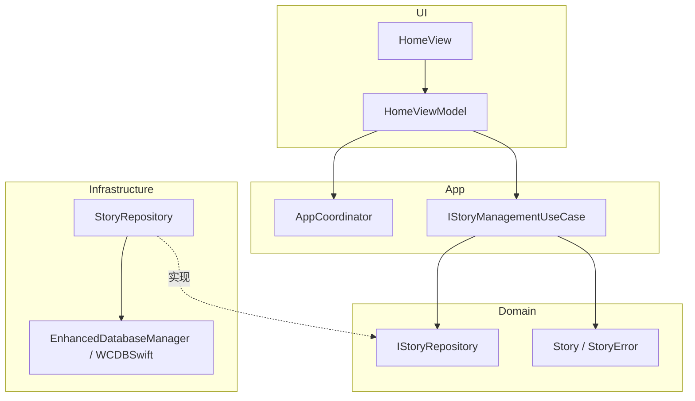
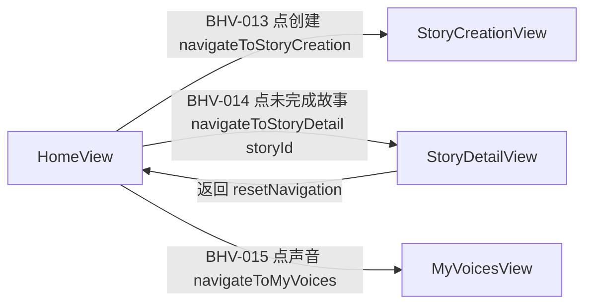
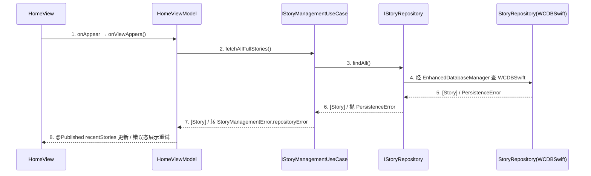

# iOS 概要设计分章写作指南（references）

> 编排层产物：只补充分章写法细则、模板与示例，**不替代 L1**。规则正文与完成条件一律以
> `.trellis/spec/harness/overview/overview-structure-single-source.md`（概要 L1）为准；分层依赖律与四条硬红线以
> `.trellis/spec/guides/golden-path.md` 为准；项目取值以 `.trellis/spec/conventions/project-conventions.md` 槽位为准。
> 冲突时：golden-path 硬红线 > L1 章节合同 > project-conventions 槽位 > 本指南 > SKILL.md。
> 本指南所有示例组件名（`HomeView` / `HomeViewModel` /
> `StoryManagementUseCase` / `IStoryRepository` / `StoryRepository` / `AppCoordinator` / `Story` / `StoryError`）均为
> DDD 四层的通用示例命名（落地时替换为目标仓库的真实领域名），不照抄 flutter（Page/Controller/Service/DataSource/Dao/Api）或 Go（Entry/Biz/IC/Utility/Data）类型名。

## 0. 写作前准备

- **判轨**：读 task.json `guru_chain`。`full` → 设计包模式（本指南全部章节）；`light` → 任务内 `design.md` §概要（L1 §2b 简化口径：第 4 章架构总览保留一句话架构 + 页面流文字描述，分层图与时序图策略表不强制；第 8 章自检退为 Gate 前自查；但七类 doc_type 归属表不得省略）。
- **技术栈基线（不另定取值）**：从 project-conventions 槽位抄录写进第 1 章「技术栈约束」，全程引用裸 token（编号体系与 `conventions/project-conventions.template.md` canonical 一致 SLOT-01~SLOT-16）：`SLOT-01` UI 框架基线 / ViewModel 形态（SwiftUI 主 + RxSwift 遗留 → 纯 SwiftUI；`ObservableObject` + `@Published`）、`SLOT-04` `enum Error` 分层、`SLOT-08` 网络层（URLSession / Moya）、`SLOT-09` 日志（SwiftyBeaver → OSLog）、`SLOT-10` JSON 修复策略、`SLOT-11` 主题（`ThemeManager`）、`SLOT-12` i18n（`Localizable.strings` + R.swift）、`SLOT-13` feature 模块结构（`UI/Features/<Feature>/{Views,ViewModels}/`）、`SLOT-14` 测试约定 + mock 生成（XCTest → Quick/Nimble；手写 → Mockolo）。概要不重新决定技术栈。
- **术语统一**：先 `rg` 检索需求与既有设计中的实体名 / View 名 / `BHV-NNN` / `UC` / `UNIT-<slug>` / UseCase / Repository 名，复用既有命名；新术语在第 1 章登记。命名遵守 golden-path §2.4：`view` → `XxxView`，`viewmodel` → `XxxViewModel`（`ObservableObject`），`usecase` → `XxxUseCase`（接口 `IXxxUseCase`），`repository` → 接口 `IXxxRepository`（Domain）+ 实现 `XxxRepository`（Infrastructure），`domain-model` → 实体 `Xxx` / 值对象 `XxxVO` / 错误 `XxxError`，`coordinator` → `AppCoordinator` + `Container+Xxx`，`external` → `XxxAdapter` / `XxxService`（接口侧 `IXxxAdapter` 留 Domain）。禁 `Manager` / `Helper` / `Handler` 等含混后缀新增（既有遗留除外，须标注遗留）。
- **目录动作（full 链）**：

  ```bash
  mkdir -p docs/design/<feature>/chapters
  touch docs/design/<feature>/README.md docs/design/<feature>/design-main.md
  # task.json 写入 "design_package": "docs/design/<feature>"（相对 repo root）
  ```

## 1. README 与 design.md 指针写法（full 链）

README 只做导航，不承载事实正文：

```markdown
# <feature> 设计包（iOS 原生）

| 文档 | 职责 |
|------|------|
| [design-main.md](./design-main.md) | 概要主定义（行为 / 四层归属 / 架构总览 / 承接索引） |
| [chapters/](./chapters/) | 详细设计逐章（见 design-main 第 6 节承接索引；文件本体详细阶段产出） |

追踪：BHV 来源 = ../../.trellis/tasks/<task>/prd.md；trace-matrix 机器生成（行为 × 需求场景（REQ-UC）× 归属 × 单元 × 测试 × 切片）。
```

任务内 design.md 指针模板：

```markdown
# 设计指针（full 链）

主定义：[<feature> 设计包](../../docs/design/<feature>/design-main.md)（task.json design_package）
摘要：<三句话以内：解决什么、核心四层归属结论、最大风险（如分层依赖律风险点 / 未选定技术决策）>
本文件不承载设计正文；修订一律进设计包。
```

## 2. 第 1 章「设计约束与输入」写法

模板：

```markdown
## 1. 设计约束与输入
### 1.1 承接的核心能力
| 能力编号 | P0/P1 | 一句话 | 需求锚点（prd 章节 / BHV） |
### 1.2 feature 边界
落在哪个 `UI/Features/<Feature>/`（SLOT-13）；复用 / 新建哪个 `Domain` 子能力（UseCase 接口 / Repository 接口 / 实体）与 `Infrastructure` 实现。
### 1.3 技术栈约束（引用 project-conventions 槽位，不另定取值）
DDD 四层 / SwiftUI（SLOT-01）/ FactoryKit `@Injected` / WCDBSwift（持久化）/ ViewModel=`ObservableObject`+`@Published`（SLOT-01）/ 网络（SLOT-08）/ 日志（SLOT-09）/ 测试（SLOT-14）……
### 1.4 显式假设
| 假设 | 依据 | 影响范围 | 验证时点 |
```

要点：核心能力逐条带需求锚点；feature 边界必须落到具体 `UI/Features/<Feature>/` 与对应 Domain/Infrastructure 单元（复用还是新建）；没有假设也要写「无」。**不得凭空生成 P0/P1**——需求缺失时只产草稿并在 1.4 记显式假设，不宣称可进入详细设计。

## 3. 第 2 章「行为集合」写法

按 L1 §3 四类顺序枚举（**用户操作 → 系统反应 → 失败路径 → 生命周期**），每条一个 `### BHV-NNN <短名>` 标题 + GWT 正文，标注涉及状态（哪个 ViewModel 的哪个 `@Published`）与数据（哪个 domain-model / 哪个 Repository）：

```markdown
### BHV-012 加载首页故事列表
Given 用户已登录且进入首页 When `HomeView` 触发 `onAppear` → `viewModel.onViewAppera()`
Then `HomeViewModel.loadStorys()` 调 `IStoryManagementUseCase.fetchAllFullStories()` → 经 `IStoryRepository.findAll()`
命中 WCDBSwift；成功回主线程写 `@Published recentStories`（按 `updatedAt` 倒序）；
失败抛 `StoryManagementError.repositoryError` → ViewModel 置错误态展示重试。
涉及状态：`HomeViewModel.recentStories`；数据：`Story` / `IStoryRepository`。
```

正反对照（粒度，L1 §3.1）：

- ✅ 上例：前置 / 触发源（`onAppear`）/ 后置状态（`@Published recentStories`）/ 失败去向（`StoryManagementError` → 重试态）齐全，链路可追踪到 usecase → repository。
- ❌ `### BHV-012 处理首页`：「Given 有页面 When 打开 Then 显示数据」——无前置、无触发源、无失败路径、无状态 / 数据 / 层归属，审核记 P2（粒度不达标）。

iOS 专属遗漏自查：
- 每个用户操作行为是否配了对应失败路径行为（网络失败 / 数据缺失 / 权限拒绝（麦克风 / 相册 / 文件）/ WCDBSwift 损坏 / 模型下载失败）？
- 是否覆盖生命周期事件（前后台切换、scene 销毁 / 恢复、进程被杀后恢复、长任务进度续传）？
- 编号纪律：`BHV-NNN` 创建后不复用、不重排，删除留洞，下游裸 token 引用；每条 BHV 回指 ≥1 个核心 UC（§3.2）。

## 4. 第 3 章「归属判定表」写法（核心产物）

### 4.1 自底向上组织边界叙述

按 golden-path §1 / L1 §7 的写作顺序组织归属收敛节奏：① `domain-model` → ② `repository` → ③ `usecase` → ④ `viewmodel` → ⑤ `view` + 横切 `coordinator` / `external`。先定稳定零依赖层（实体 / 错误 / 仓储合同）再定上层依赖，便于校验依赖方向。

### 4.2 归属表模板（每行一条 BHV，以 `BHV-NNN` 开头；三问写实质内容，禁止「同上」「同 flutter」）

```markdown
| BHV | owner 层 | doc_type | UNIT | 为什么属于它 | 为什么不属于别人 | 是否需独立存在 |
|-----|---------|----------|------|------------|----------------|--------------|
| BHV-012 | Domain | usecase | UNIT-story-management-usecase | 取全量故事是有状态业务编排（校验→访问仓储→归一错误） | viewmodel 只该转发事件与持有 `@Published`，不该拥有仓储错误转换规则 | 是：首页 / 我的故事页等多入口复用 |
| BHV-012(状态) | UI | viewmodel | UNIT-home-viewmodel | `recentStories` 是首页生命周期内 UI 状态，是唯一写 owner | usecase 零 UI 依赖不持 `@Published`；view 不持可变业务态 | 是：绑定 `HomeView` |
| BHV-012(导航) | App | coordinator | UNIT-app-coordinator | 跳转故事详情属导航编排，改 `AppCoordinator.activeDestination` | view 间不得直接导航；viewmodel 不该硬跳 | 是：全局单一导航 owner |
```

### 4.3 owner 层 → doc_type 映射（L1 §4 / §7，全程裸 token）

| owner 层 | 可落 doc_type |
|----------|---------------|
| UI | `view`、`viewmodel` |
| App | `coordinator` |
| Domain | `usecase`、`repository`（接口侧）、`domain-model` |
| Infrastructure | `repository`（实现侧）、`external` |

`repository` 合并 Domain 接口（`IXxxRepository`）+ Infrastructure 实现（`XxxRepository`）为一类。**禁止自创 `service` / `transport-handler` / `datasource` / `dao` / `controller` 等第八类**（无论 flutter/Go 是否合法）。

### 4.4 状态归属与三问硬约束

- **一个状态只能有一个写 owner**：页面态写 owner 是对应 viewmodel（`@Published`），业务态写 owner 是对应 usecase；其余层只读 / 订阅。同一 `@Published` 状态在两个 ViewModel 里写 = P1，回退重判。状态归属单独列小节，每个状态字段一行（状态名 / 写 owner / 读取方）。
- **分层依赖律自检（四条硬红线，golden-path 锁定，违反直接 fail）**，归属表后逐条核对：
  1. **Domain 零依赖**：`usecase` / `IXxxRepository` 接口 / 实体 / 值对象 / `enum Error` 不 import `App` / `Infrastructure` / `UI`，也不 import SwiftUI / WCDBSwift / 网络 SDK（示例 `Domain/Repositories/IStoryRepository.swift` 只 `import Foundation`）。把 WCDBSwift 写入、SwiftUI 类型塞进 Domain 即归属错误，回退重判。
  2. **单向无环**：依赖方向 `Domain → App → Infrastructure → UI`；`Repository` 接口在 Domain、实现在 Infrastructure，上层只依赖接口（依赖倒置）。
  3. **View 不直接导航**：View → View 直接 push/present 即违例，必经 `AppCoordinator`（改 `@Published activeDestination` 或注入 `navigateToXxx` Factory 闭包）。
  4. **View 不直接访问持久化**：View / ViewModel 直接 import `DatabaseManager` / WCDBSwift / repository 实现类即违例，必经 `IXxxRepository` 接口。
- **FactoryKit DI 强制**：跨层依赖一律 `@Injected`（示例 `HomeViewModel` 全 `@Injected(\.storyManageUseCase)` 等），禁手动 `init` 硬编码依赖；DI 装配归 `coordinator`。
- 争议行先回到需求发现 / Domain Grill 核对代码证据与用户意图；仍无法定稿时输出 `REQ_BLOCKER`，不要在 overview 阶段加载旧 `design-grill`。

### 4.5 纯函数技术能力（不是层、不是依赖对象）

业务无关纯函数（格式化、日期 / 随机数封装、纯算法）只标「纯函数技术能力 + 调用方使用锚点」，不写成 owner 行为、不进 ViewModel/UseCase 运行时依赖边、不作为 FactoryKit 装配对象。业务判定（「该故事是否可发布」「会话是否过期」）留在 `usecase`，纯算法直接调用。

## 5. 第 3 章续「关键取舍与 ADR」写法（阶段 4）

命中技术选择（三方 SDK / 网络栈 / 持久化策略 / RxSwift→SwiftUI 迁移取舍 / 端侧或远程 LLM / TTS·STT / FactoryKit scope）先在本节形成 ADR / 关键取舍，再为第 5 章 `technology_decision_handoff[]` 埋锚点。ADR 写「驱动 / 约束 → 选择」，不反向倒推（不写「选了 X 所以 X 好」）。

## 6. 第 4 章「页面流与路由」写法

逐页面列：路由 / `NavigationDestination` 枚举值（与 `AppCoordinator.NavigationDestination` 一致）、入参 / 出参、进入与退出动作、经 `AppCoordinator` 的方法名（如 `navigateToStoryDetail`）、deep link（如有）。失败 / 取消 / 权限拒绝的导航去向必须显式。非 UI 需求（纯后台任务、纯持久化迁移、纯 external 集成）整章写 `N/A + 依据`。

```markdown
| View | NavigationDestination | 入参 | 出参 / 退出 | 经 AppCoordinator 方法 |
|------|----------------------|------|------------|----------------------|
| HomeView | （根，无） | — | 点故事详情 → storyDetail(storyId)；点设置 → setting | navigateToStoryDetail / navigateToSetting |
| StoryDetailView | storyDetail | storyId: String | 返回 → resetNavigation | navigateToStoryDetail |
```

## 7. 第 4 章「架构总览（人审视图）」写法（六件套，L1 §2.5）

### 7.1 一句话架构

按 L1 固定格式填空，组件名用真实名：

> 用户经 `HomeView`（根视图）进入，由 `HomeViewModel` 承接首页故事 / 创作资源态（`@Published recentStories` / `creations`），调用 `IStoryManagementUseCase` 编排故事读取与删除，经 `IStoryRepository` 访问数据（实现 `StoryRepository` 在 Infrastructure 收口 WCDBSwift），导航由 `AppCoordinator` 收口，按需经 `external`（`StoryRepository` → `EnhancedDatabaseManager`）集成 WCDBSwift。

### 7.2 分层架构图模板（DDD 四层 subgraph）



自检：① 图中每个节点都能在第 3 章归属表找到（图组件 ⊆ 归属表，不出现归属表之外的组件，不出现 `Manager`/`Helper`/`Util` 这类无行为来源结构，`EnhancedDatabaseManager` 作为 external 引擎合法）；② `Domain` 节点零入边依赖（只被依赖、不依赖他层）；③ `StoryRepository`（Infrastructure 实现）以虚线「实现」指向 `IStoryRepository`（Domain 接口），表达依赖倒置——UI/App 只连接口不连实现；④ 不出现 `HomeView`/`HomeViewModel` 直连 `StoryRepository`/`WCDBSwift` 的边。

### 7.3 页面流图模板



边上标注触发 `BHV-NNN` + 关键入参 + 经 `AppCoordinator` 的方法名；失败 / 取消 / 权限拒绝路径必须出现。

### 7.4 核心 UC 表 / 7.5 UC 承接表

列定义见 L1 §2.5 ④⑤，直接用表。UC 从需求验收场景提炼（用户可感知的完整目标），不是 BHV 的重排——一个 UC 通常覆盖 2~5 条 BHV。`owner_refs` 写归属表中的 `UNIT-<slug>`；`index_refs` 回填第 6 章 `chapter_target`。

### 7.6 时序图策略表与 sequenceDiagram 写法

策略表先行（`独立` / `合并` / `豁免`，列定义 L1 §2.5 ⑥）；早期可用计划锚点占位，**送审概要 Gate 前非豁免 UC 必须回填可定位的真实 `sequenceDiagram`**，占位残留不得宣称可送审。参与者用真实组件名，编号步骤与图下详述一一对应，外部触发从 View/Coordinator 进入，**禁止 View 直连 Repository 实现 / WCDBSwift**（违反分层依赖律）：



1. View 只转发 `onAppear` 生命周期事件给 ViewModel，不做业务判断。
2. ViewModel 调用注入的 `IStoryManagementUseCase` 业务行为（`@Injected(\.storyManageUseCase)`）。
3~4. UseCase 经 `IStoryRepository` 接口 → 实现 `StoryRepository` 收口 WCDBSwift（UseCase 不感知 WCDBSwift）。
5~6. Repository 实现在边界把 WCDBSwift 原始错误转换为 `PersistenceError`，绝不裸抛到上层。
7. UseCase 把 `PersistenceError` 归一为 `StoryManagementError.repositoryError`（域错误）。
8. ViewModel 回主线程写 `@Published recentStories`；失败置错误态。

要求：参与者 = 真实组件名；回包用虚线；失败分支可另起一图或用 `alt` 块表达；导航穿插 `AppCoordinator`。

## 8. 第 5 章「技术决策承接清单」写法（L1 §2.6）

逐条建立 `technology_decision_handoff[]`，字段缺一即该条不完整：

```markdown
| decision_id | decision_point | candidates | selected | rationale | detail_expansion_targets（→ chapters/<slug>.md + doc_type） | compliance_basis（credential strategy） |
|------------|----------------|-----------|----------|-----------|--------------------------------------------------------------|------------------------------------------|
| TD-01 | 端侧 LLM 适配选型 | OnDeviceLLMAdapter（示例） / 远程 LLM | OnDeviceLLMAdapter（端侧） | 离线优先 + 隐私约束，避免上传用户创作 | story-llm-external（external） | 不联网无凭证；如远程则 api_key_keychain_ref，不写 secret value |
| TD-02 | 持久化引擎 | WCDBSwift（golden-path 钉死） | WCDBSwift | 禁 CoreData/SwiftData（全局约定） | story-repository（repository 实现） | N/A |
```

两条易错点：
- `rationale` 必须从约束 / 驱动推到选择，不得反向倒推。
- 命中外部 provider / LLM / 对象存储 / 云服务 / 三方 SDK / 推送 / IAP / 权限（麦克风 / 相册 / 文件）时必填 `compliance_basis` 与 credential strategy：**不保存任何 secret value**，只写引用方式（`api_key_keychain_ref` / Info.plist 或 xcconfig 注入 / 默认凭证来源 / Keychain 引用 / `NSMicrophoneUsageDescription` 用途串），出现真实 key 即 P1。
- `未选定` 必须显式标注，禁止让下游引用未选定决策。查询分页先判定普通分页还是连续消费语义（示例 `findAllSummaries(criteria:page:pageSize:)` 是普通分页），普通分页不触发游标决策。

## 9. 第 6 章「详细设计承接索引」写法（L1 §2.7）

覆盖归属表全部 owner + 全部横切一等合同（`coordinator` / `external`）；full 链每条附 `chapters/<slug>.md` 目标文件名；`detail_doc_type` 取值只用七分类裸 token：

```markdown
| chapter_target | detail_doc_type | l2_status | 目标文件 | 承接 owner（UNIT） | 不承接范围 |
|---------------|----------------|-----------|---------|-------------------|-----------|
| story-model | domain-model | pending | chapters/story-model.md | UNIT-story-model | 不承载 WCDBSwift 表结构（属 external 实现） |
| story-repository | repository | full | chapters/story-repository.md | UNIT-story-repository | 不决定业务编排（属 usecase） |
| story-management-usecase | usecase | full | chapters/story-management-usecase.md | UNIT-story-management-usecase | 不直接读写 WCDBSwift（经 repository 接口） |
| home-viewmodel | viewmodel | full | chapters/home-viewmodel.md | UNIT-home-viewmodel | 不决定缓存策略（属 repository） |
| home-view | view | pending | chapters/home-view.md | UNIT-home-view | 不拥有状态转移 / 业务 / 导航决策 |
| app-coordinator | coordinator | pending | chapters/app-coordinator.md | UNIT-app-coordinator | 不承载业务规则 |
```

自检：① 归属表每个 owner 至少被一条索引覆盖；② `detail_doc_type` 只用七分类（`viewmodel` / `usecase` / `repository` / `domain-model` / `view` / `coordinator` / `external`）；③ 命中 pending L2 的四类（`domain-model` / `view` / `coordinator` / `external`）在本表或第 7 章写 `L2豁免：<doc_type> 理由：…`（按 L1 / 详细 L1 §3 合同八问展开口径声明，full 链须此声明否则详细 Gate 拦截），或改走先补 L2 路径；④ `full` 的三类（`viewmodel` / `usecase` / `repository`）`l2_status: full`，指向 `detail-type-*.md`；⑤ UC 承接表 `index_refs` 回填本表 `chapter_target`，不留孤儿 owner、不留未被索引覆盖的归属行。

`L2豁免` 声明样例：

```markdown
L2豁免：view 理由：`view` 类型 L2 文件（detail-type-view.md）暂 pending；本 feature 的 `HomeView` 结构稳定，详细阶段按详细 L1 §3 合同八问展开（强约束输入事件→回调签名、只依赖 viewmodel、不拥有状态转移/业务/导航决策），风险低，v1.x 前补齐 L2。
```

## 10. 第 7 章「未决问题」/ 第 8 章「架构就绪自检」写法

- **未决问题**：逐条 `问题 / 风险等级(P1/P2/P3) / 阻塞哪个 G 项 / 建议解法`；高风险（P1）项未关闭不得送审（G5）。无未决也须显式声明「无未决」。
- **架构就绪自检**（full 链成节，G1~G8 逐项，不得用概括性「基本满足」替代逐项证据）：

```markdown
## 8. 架构就绪自检
| G 项 | 结论 | 证据 / 缺口 |
|------|------|-----------|
| G1 行为覆盖 | 满足 | BHV-012~018 覆盖 P0×1 P1×1（§2），逐条满足粒度标准 |
| G2 归属完整 | 满足 | §3 全行三问 + 七类 doc_type；四红线逐条核对无违例 |
| G3 合规 | 满足 / N/A | TD-01 credential strategy；无权限触发则 N/A 并说明 |
| G4 索引覆盖 | 满足 | §6 覆盖全部 owner + 横切，逐文件，doc_type 七类，l2_status 已标 |
| G5 未决无高风险 | 满足 | §7 仅 P2/P3 或已带假设进入 |
| G6 六件套 | 满足 | §4 ①~⑥ 齐全，图组件 ⊆ 归属表 |
| G7 时序闭合 | 满足 | 非豁免 UC 均有真实 sequenceDiagram，无占位，外部触发经 View 入口 |
| G8 技术决策 | 满足 | §5 字段完整，无「未选定但被下游引用」，无 secret 落盘 |
```

其中 G2 必须逐条核对四条硬红线（Domain 零依赖 / 单向无环 / View 不直接导航 / View 不直接访问持久化）。

## 11. 阶段推进与暂停口径

- 默认连续推进（一次性交付模式）；只有高风险未决项才暂停提问（一次 1~4 个；存在单一明显 P0 时通常 1 个问题即可）。
- 每阶段切换前轻量自检：本阶段产物是否满足对应 L1 合同；明显缺口当场补，不带病推进。
- 全稿完成 → 回填全部时序图占位 → G1~G8 自检 → 提示加载 `ios-design-overview-review` 过概要 Gate，由 review worker 用 `record-review overview` 记录当前 digest 的 clean/findings 证据，区别于 `trellis-check` 代码质检。

## 12. 禁止事项（写作期红线速查）

1. 不从名词 / 组件 / SwiftUI View 名出发枚举（先有行为再有组件）。
2. 不写可编码合同（L1 §5）：Swift 方法签名（`func loadStories() async throws -> [Story]` 级）、`@Published` 字段全集与初值、`enum XxxError` 全集与每个 `case`、FactoryKit `Container` 注册条目（`Container.shared.storyRepository`）、`@Injected` 注入点逐个清单、WCDBSwift 表结构 / `TableCodable` / 迁移 DDL、`DatabaseManager` 建表语句、网络 URL/Header/Body 字段、SDK 初始化 / 调用参数、超时 / 重试数值、Keychain / secret value。
3. 不替用户拍板未决业务规则、不凭空生成 P0/P1、不在概要补造业务规则（缺陷回退 brainstorm）。
4. 不让图表与归属表两套口径（图中组件 ⊆ 归属表）。
5. 不在「未选定」技术决策上构建下游设计。
6. 不用概括性结论替代 G 项逐条证据。
7. 不自创七类之外的 doc_type，不照抄 flutter（controller/datasource/page-entry）或 Go（Biz/Entry）类型名。
8. 发现自己在写禁写项即停下，回收到「交给详细设计展开（由哪个 `chapters/<slug>.md`、哪类 doc_type 承接）」的索引条目。
