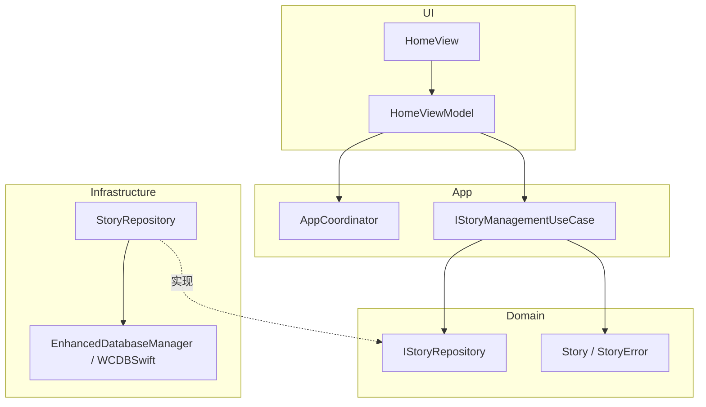
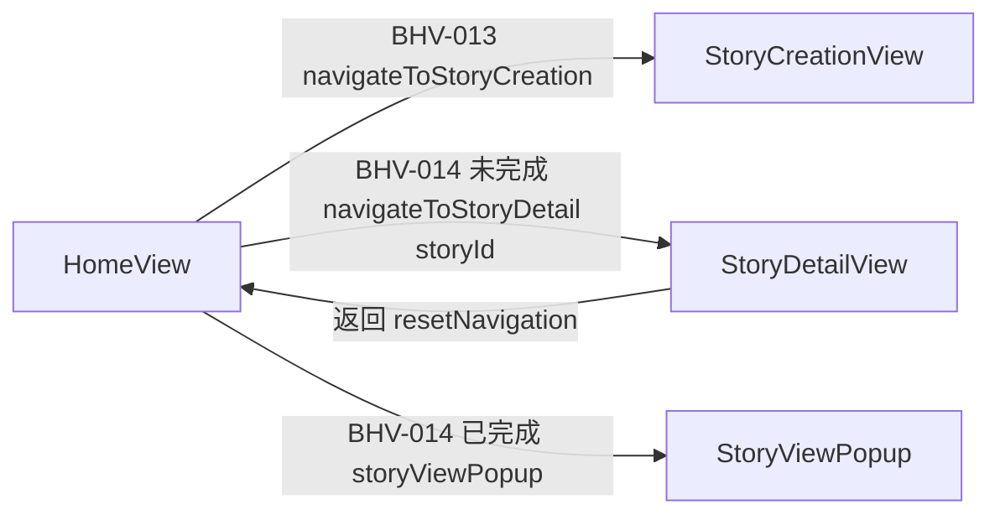
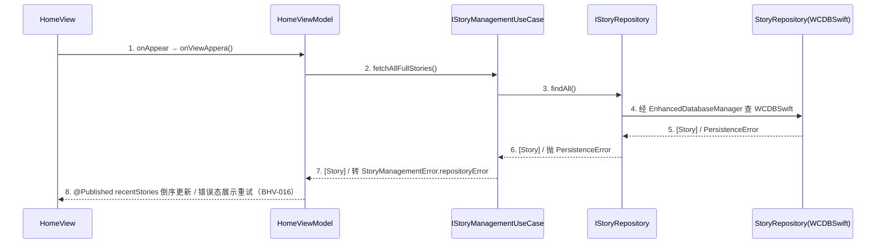

# 示例：首页故事概览 design-main（iOS 原生 · 缩减成稿样例）

> 本文件是 **成稿形态示例**，取材自 `story-verse-mac` 真实 Home feature 的缩减改编，只演示 iOS 原生概要各章形态与粒度，
> **不是规则来源**；章节合同以概要 L1（`.trellis/spec/harness/overview/overview-structure-single-source.md`）为准，
> 分层依赖律以 `.trellis/spec/guides/golden-path.md` 为准。
> 示例为缩减版：真实成稿的 BHV/UC 数量与表行数通常是本例的 2~4 倍。
>
> **取证锚点（均为参考项目真实文件 / 类型，先读取证实再写）**：
> - `view` → `StoryVerse/StoryVerse/UI/Features/Home/Views/HomeView.swift`（`struct HomeView: View`，`@InjectedObject(\.homeViewModel)`、`@Injected(\.navigateToStoryDetail)`、`.onAppear { viewModel.onViewAppera() }`）
> - `viewmodel` → `UI/Features/Home/ViewModels/HomeViewModel.swift`（`class HomeViewModel: ObservableObject`，`@Published var recentStories: [Story]`、`@Injected(\.storyManageUseCase)`、`loadStorys()`/`onTapStoryDelete(_:)`/`onTapStoryExport(_:format:)`）
> - `usecase` → `App/UseCases/StoryManagement/{IStoryManagementUseCase.swift,StoryManagementUseCase.swift,StoryManagementError.swift}`（`fetchAllFullStories()`/`deleteStory(storyId:)`，注入 `any IStoryRepository`，把 `PersistenceError` 转 `StoryManagementError.repositoryError`）
> - `repository` → `Domain/Repositories/IStoryRepository.swift`（接口，只 `import Foundation`，含 `PersistenceError`）+ `Infrastructure/Persistence/Repositories/StoryRepository.swift`（实现，`import WCDBSwift`，注入 `EnhancedDatabaseManager`）
> - `domain-model` → `Domain/Entities/Story.swift`（`struct Story: Identifiable, Codable`）+ `Domain/Errors/StoryError.swift`（`enum StoryError: Error, Equatable`）
> - `coordinator` → `App/Coordinators/AppCoordinator.swift`（`@Published activeDestination`、`enum NavigationDestination`）+ `App/DependencyInjection/Container+Coordinators.swift`（`navigateToStoryDetail: Factory<(String) -> Void>`）+ `Container+UseCases.swift`（`storyManageUseCase`/`storyRepository` 注册 `.singleton`）
> - 技术栈槽位 → `.trellis/spec/conventions/project-conventions.md`（story-verse 取值：`SLOT-01` 纯 SwiftUI 且 `ObservableObject`+`@Published`、`SLOT-14` XCTest，存量违例 `SLOT-16`）

**交付范围**：全稿（缩减）｜**执行模式**：一次性交付｜**链型**：full｜**概要主定义位置**：`design-main.md`

## 1. 设计约束与输入

### 1.1 承接的核心能力

| 能力编号 | P0/P1 | 一句话 | 需求锚点 |
|---------|-------|-------|---------|
| CAP-01 | P0 | 进入首页查看最近故事并可删除 / 导出 | prd §2 BHV-012~016 |

### 1.2 feature 边界

落在 `UI/Features/Home/`（SLOT-13）。复用既有 `Domain` 子能力：`Story` 实体、`IStoryRepository` 接口、`IStoryManagementUseCase`；复用 Infrastructure 实现 `StoryRepository`（WCDBSwift）。本需求不新建 Domain 子能力，仅在 `HomeViewModel` 接线既有 UseCase。

### 1.3 技术栈约束（引用 project-conventions 槽位，不另定取值）

DDD 四层；UI 纯 SwiftUI（`SLOT-01`）；ViewModel = `ObservableObject` + `@Published`（`SLOT-01`）；DI = FactoryKit `@Injected`；持久化 = WCDBSwift（golden-path 钉死，禁 CoreData/SwiftData）；日志 `SLOT-09`；i18n `SLOT-12`（`R.string.localizable`）；主题 `SLOT-11`（`ThemeManager`）；测试 `SLOT-14`（XCTest）。

### 1.4 显式假设

| 假设 | 依据 | 影响范围 | 验证时点 |
|------|------|---------|---------|
| 首页只展示前 4 条最近故事（`prefix(4)`） | 既有 `HomeView` 实测 UI 约定 | BHV-012 后置展示量 | 详细设计前与产品确认 |

## 2. 行为集合

### BHV-012 加载首页故事列表
Given 用户已登录且进入首页 When `HomeView` 触发 `onAppear` → `viewModel.onViewAppera()` Then `HomeViewModel.loadStorys()` 调 `IStoryManagementUseCase.fetchAllFullStories()` → 经 `IStoryRepository.findAll()` 命中 WCDBSwift；成功回主线程写 `@Published recentStories`（按 `updatedAt` 倒序，UI 取前 4）；失败转 BHV-016。涉及状态：`HomeViewModel.recentStories`；数据：`Story` / `IStoryRepository`。

### BHV-013 进入故事创建
Given 在首页 When 点「创建故事」且 `rootViewState.checkModels` 通过 Then 经 `AppCoordinator.navigateToStoryCreation()`（注入闭包 `navigateToStoryCreation`）跳转创建页。涉及状态：`AppCoordinator.activeDestination`；数据：无。

### BHV-014 打开故事详情
Given 首页已展示故事卡片 When 点未完成故事卡片（`story.isComplete == false`）Then 经 `navigateToStoryDetail(story.id)` 跳详情；已完成故事改弹 `storyViewPopup`（本地 `@State`，不导航）。涉及状态：`AppCoordinator.activeDestination` / `activeStoryId`；数据：`Story`。

### BHV-015 删除故事
Given 故事卡片菜单展开 When 点删除 Then `HomeViewModel.onTapStoryDelete(id)` 调 `IStoryManagementUseCase.deleteStory(storyId:)` → `IStoryRepository.delete(id:)` 写 WCDBSwift；成功经仓储 CRUD 事件回流（`autoObserve` → `handleStoryEvent` → 重新 `loadStorys()`）。涉及状态：`recentStories`（经事件刷新）；数据：`Story`。

### BHV-016 加载失败处置（失败路径）
Given BHV-012 进行中 When `findAll()` 抛 `PersistenceError` Then `StoryManagementUseCase` 归一为 `StoryManagementError.repositoryError` 上抛；ViewModel 应置错误态展示重试。**实测存量违例**：当前 `loadStorys()` 内 `catch { }` 空吞错误，无错误状态机（`SLOT-16 #5`）；本概要要求详细阶段补错误态（见 §7 未决）。涉及状态：`recentStories`（错误态由详细 home-viewmodel 章补齐）；数据：`Story`。

## 3. 归属判定表

> 按自底向上顺序组织（domain-model → repository → usecase → viewmodel → view + coordinator）。每行以 `BHV-NNN` 开头，三问写实质内容。

| BHV / 状态 | owner 层 | doc_type | UNIT | 为什么属于它 | 为什么不属于别人 | 是否需独立存在 |
|-----------|---------|----------|------|------------|----------------|--------------|
| BHV-012/015(数据) | Domain | domain-model | UNIT-story-model | `Story` 是领域事实（实体 + `StoryError` + 不变量），零依赖可被各层导入 | 不含 IO / 编排；持久化形态属 external 实现 | 是：被各层导入 |
| BHV-012/015(访问) | Domain 接口 + Infra 实现 | repository | UNIT-story-repository | `IStoryRepository.findAll/delete` 是数据访问合同，实现 `StoryRepository` 收口 WCDBSwift 并转 `PersistenceError` | usecase 不该碰 WCDBSwift；viewmodel 不该持有仓储实现 | 是：多 usecase 复用 |
| BHV-012/015/016(编排) | Domain | usecase | UNIT-story-management-usecase | 故事读取 / 删除 / 错误归一是有状态业务编排，零 UI 依赖 | viewmodel 只转发事件 + 持 `@Published`，不拥有 `PersistenceError → StoryManagementError` 转换 | 是：首页 / 我的故事页多入口复用 |
| BHV-012(状态) | UI | viewmodel | UNIT-home-viewmodel | `recentStories` 是首页生命周期内 UI 状态，唯一写 owner；`onViewAppera`/`onTapStoryDelete` 是事件入口 | usecase 零 UI 依赖不持 `@Published`；view 不持可变业务态 | 是：绑定 `HomeView` |
| BHV-012/014(展示+输入) | UI | view | UNIT-home-view | `HomeView` 只组装 UI（创建区 / 最近故事区 / 创作资源区）+ 转发输入给 ViewModel / 导航闭包 | 无业务规则；导航经注入闭包不硬跳 | 是：首页入口 |
| BHV-013/014(导航) | App | coordinator | UNIT-app-coordinator | 跳转创建 / 详情属导航编排，改 `AppCoordinator.activeDestination`，DI 装配（`Container+Coordinators`）归此层 | view 间不得直接导航；viewmodel 不该硬跳 | 是：全局单一导航 + DI owner |

**状态归属**：
| 状态 | 写 owner | 读取方 |
|------|---------|--------|
| `HomeViewModel.recentStories`（`@Published`） | UNIT-home-viewmodel | `HomeView`（`recentStoriesSection`） |
| `HomeViewModel.creations`（`@Published`） | UNIT-home-viewmodel | `HomeView`（`myCreationsSection`） |
| `AppCoordinator.activeDestination`（`@Published`） | UNIT-app-coordinator | 根视图导航绑定 |

**分层依赖律四红线自检**：① Domain 零依赖——`Story`/`StoryError`/`IStoryRepository` 只 `import Foundation`（实测）✔；② 单向无环——`StoryRepository`（Infra 实现）经 DI 注入 `IStoryRepository`（Domain 接口），上层只依赖接口 ✔；③ View 不直接导航——`HomeView` 经 `@Injected(\.navigateToStoryDetail)` 闭包 / `AppCoordinator`，无跨 feature `NavigationLink` ✔；④ View 不直接访问持久化——`HomeView`/`HomeViewModel` 不 import `WCDBSwift`/`StoryRepository` 实现，经 `IStoryManagementUseCase` ✔。**遗留提示**：`HomeView` 实测同时注入了 `@Injected(\.storyRepository)` 供 `autoObserve` 订阅 CRUD 事件——订阅观察接口（`IObservableRepository`）属允许，但应避免在 View 直接调用其数据方法；本概要要求详细阶段确认订阅边界（见 §7）。

**唯一写 owner 自检**：`recentStories` 仅 `HomeViewModel` 写，无第二 ViewModel 重复写 ✔。

## 4. 架构总览（人审视图）

**① 一句话架构**：用户经 `HomeView`（根视图）进入，由 `HomeViewModel` 承接首页故事 / 创作资源态（`@Published recentStories` / `creations`），调用 `IStoryManagementUseCase` 编排故事读取 / 删除，经 `IStoryRepository` 访问数据（实现 `StoryRepository` 在 Infrastructure 收口 WCDBSwift），导航由 `AppCoordinator` 收口，按需经 external（`StoryRepository` → `EnhancedDatabaseManager` / WCDBSwift）。

**② 分层架构图**

**③ 页面流图**

**④ 核心 UC 表**

| uc_id | uc_title | actor_or_trigger | source_refs | goal | priority |
|-------|---------|------------------|------------|------|----------|
| UC-01 | 浏览并管理首页故事 | 用户操作 + `onAppear` 生命周期 | BHV-012~016 | 首页展示最近故事，可删除 / 进入详情 | P0 |

**⑤ UC 承接表**

| uc_id | page_refs | bhv_refs | owner_refs | index_refs |
|-------|----------|----------|-----------|-----------|
| UC-01 | HomeView, StoryDetailView | BHV-012~016 | UNIT-home-view, UNIT-home-viewmodel, UNIT-story-management-usecase, UNIT-story-repository, UNIT-story-model, UNIT-app-coordinator | home-view, home-viewmodel, story-management-usecase, story-repository, story-model, app-coordinator |

**⑥ 时序图策略表**

| uc_id | strategy | sequence_section | merged_coverage | exemption_reason |
|-------|----------|------------------|----------------|------------------|
| UC-01 | 独立 | §4.1 | — | — |

### 4.1 UC-01 时序图（加载首页故事列表，BHV-012 / 失败 BHV-016）

1. View 只转发 `onAppear` 生命周期事件，不做业务判断。
2. ViewModel 调注入的 `IStoryManagementUseCase`（`@Injected(\.storyManageUseCase)`）。
3~4. UseCase 经 `IStoryRepository` 接口 → 实现 `StoryRepository` 收口 WCDBSwift（UseCase 不感知 WCDBSwift）。
5~6. Repository 实现在边界把 WCDBSwift 原始错误转换为 `PersistenceError`，不裸抛上层。
7. UseCase 归一 `PersistenceError → StoryManagementError.repositoryError`（域错误）。
8. ViewModel 回主线程写 `@Published recentStories`（倒序）；失败置错误态（BHV-016，详细阶段补）。

## 5. 技术决策承接清单

| decision_id | decision_point | candidates | selected | rationale | detail_expansion_targets | compliance_basis |
|------------|----------------|-----------|----------|-----------|--------------------------|------------------|
| TD-01 | 故事持久化引擎 | WCDBSwift（golden-path 钉死） | WCDBSwift | 全局约定禁 CoreData/SwiftData；既有 `StoryRepository` 已落 WCDBSwift | story-repository（repository 实现，external 引擎） | N/A（本地库，无外部凭证） |
| TD-02 | 加载失败错误态策略 | 空吞（存量）/ 错误状态机 + 重试 | 错误状态机 + 重试 | 修复 `SLOT-16 #5` 空吞违例，给用户可恢复路径 | home-viewmodel（viewmodel 状态机） | N/A |

## 6. 详细设计承接索引

| chapter_target | detail_doc_type | l2_status | 目标文件 | 承接 owner（UNIT） | 不承接范围 |
|---------------|----------------|-----------|---------|-------------------|-----------|
| story-model | domain-model | pending | chapters/story-model.md | UNIT-story-model | 不承载 WCDBSwift 表结构 / `TableCodable`（属 external 实现） |
| story-repository | repository | full | chapters/story-repository.md | UNIT-story-repository | 不决定业务编排（属 usecase）；不外泄 WCDBSwift 类型给上层 |
| story-management-usecase | usecase | full | chapters/story-management-usecase.md | UNIT-story-management-usecase | 不直接读写 WCDBSwift（经 repository 接口） |
| home-viewmodel | viewmodel | full | chapters/home-viewmodel.md | UNIT-home-viewmodel | 不决定缓存策略（属 repository）；不拥有业务规则（属 usecase） |
| home-view | view | pending | chapters/home-view.md | UNIT-home-view | 不拥有状态转移 / 业务 / 导航决策 |
| app-coordinator | coordinator | pending | chapters/app-coordinator.md | UNIT-app-coordinator | 不承载业务规则 |

L2豁免：domain-model 理由：`domain-model` 类型 L2 文件 pending；`Story`/`StoryError` 详细阶段按详细 L1 §3 合同八问退化展开（强约束类型 / `enum Error` 签名、不变量违反错误语义、零依赖断言），风险低，v1.x 前补 L2。
L2豁免：view 理由：`view` 类型 L2 文件 pending；`HomeView` 结构稳定，按合同八问展开（强约束输入事件→回调签名、只依赖 viewmodel、不拥有状态/业务/导航决策），风险低。
L2豁免：coordinator 理由：`coordinator` 类型 L2 文件 pending；`AppCoordinator` 导航 + `Container+Coordinators` DI 装配按合同八问展开（导航路由表 + FactoryKit 注册项 + 不拥有业务规则），风险低。
（`story-repository` / `story-management-usecase` / `home-viewmodel` 为 `l2_status: full`，指向 `detail-type-repository.md` / `detail-type-usecase.md` / `detail-type-viewmodel.md`，无需豁免。）

## 7. 未决问题

| 问题 | 风险 | 阻塞 G 项 | 建议 |
|------|------|----------|------|
| 加载失败错误态文案与重试交互未定（存量 `catch {}` 空吞，SLOT-16 #5） | P2 | 无（已由 TD-02 决策 + BHV-016 覆盖，详细阶段补状态机） | 详细 home-viewmodel 章定义错误三态 |
| `HomeView` 直接注入 `storyRepository` 用于 `autoObserve` 的订阅边界 | P3 | 无 | 详细阶段确认仅订阅 `IObservableRepository` 事件、不调数据方法 |

## 8. 架构就绪自检

| G 项 | 结论 | 证据 / 缺口 |
|------|------|-----------|
| G1 行为覆盖 | 满足 | BHV-012~016 覆盖 CAP-01（§2），逐条满足粒度标准（有前置 / 触发 / 状态 / 失败去向） |
| G2 归属完整 | 满足 | §3 全行三问 + 七类 doc_type；四红线逐条核对无新增违例（遗留以提示标注） |
| G3 合规 | 满足 | 本 feature 无权限 / PII / 三方域名触发；TD 字段 compliance_basis 标 N/A 并说明 |
| G4 索引覆盖 | 满足 | §6 覆盖全部 owner + 横切 coordinator，逐文件，doc_type 七类，l2_status 已标 |
| G5 未决无高风险 | 满足 | §7 仅 P2/P3，且 P2 已由 TD-02 决策覆盖 |
| G6 六件套 | 满足 | §4 ①~⑥ 齐全，图组件 ⊆ 归属表（`EnhancedDatabaseManager` 作 external 引擎合法） |
| G7 时序闭合 | 满足 | UC-01 独立图 §4.1，无占位，外部触发从 `HomeView`/`onAppear` 入口，无 View 直连 WCDBSwift |
| G8 技术决策 | 满足 | §5 TD-01/02 字段完整，无「未选定但被下游引用」，无 secret 落盘 |
